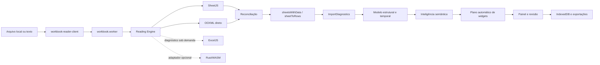

# Auditoria do estado atual — 2026-08-13

Base auditada: `main` em `4ec3ae0`, imediatamente antes da primeira correção
desta etapa. O código e os testes são a fonte de verdade; este documento registra
o mapa, as lacunas e a ordem recomendada de evolução.

## Resumo executivo

O projeto já possui uma arquitetura de leitura em camadas: SheetJS como leitor
principal, inspeção OOXML direta, ExcelJS como verificador sob demanda e um
contrato opcional para Rust/WASM. A importação preserva uma grade de origem
limitada para revisão, representações especiais de células, fórmulas, períodos,
comentários, regiões e diagnósticos. A geração automática de widgets ocorre
depois da importação e da classificação semântica.

As três maiores lacunas são: o inventário OOXML ainda não cobre vários recursos
estruturais, a pontuação de fidelidade não diferencia tudo que foi validado do
que não é suportado, e o parsing OOXML ainda descompacta e percorre XML inteiro
em memória. Antes desta etapa, a reconciliação também ignorava silenciosamente
uma aba inteira ausente no leitor principal. A primeira implementação corrige
essa perda.

## 1. Mapa da arquitetura atual



| Camada               | Componentes principais                                                    | Responsabilidade atual                                                   |
| -------------------- | ------------------------------------------------------------------------- | ------------------------------------------------------------------------ |
| Entrada              | `workbook-reader-client.ts`, `workbook.worker.ts`                         | valida tamanho, transfere bytes e publica progresso                      |
| Segurança            | `workbook-reader.ts`                                                      | limites de ZIP, abas, células e formatos de texto                        |
| Leitores             | `workbook-reader.ts`, `ooxml-reader.ts`, `workbook-verifier.ts`           | SheetJS, OOXML direto e verificação ExcelJS                              |
| Motor                | `workbook-reading-engine.ts`                                              | tempos, leitor usado, fallback e ponto de extensão WASM                  |
| Importação           | `import.ts`                                                               | cabeçalhos, mesclagens, linhas ocultas, blocos e formatos especializados |
| Diagnóstico          | `import-intelligence.ts`, `quality-audit.ts`                              | fórmulas, tipos, regiões, notas, qualidade e confiança                   |
| Modelo intermediário | `spreadsheet-intelligence.ts`, `structural-model.ts`, `temporal-model.ts` | células canônicas, papéis semânticos, regiões e períodos                 |
| Visualização         | `auto-dashboard.ts`, `widgets.ts`, `operational-widgets.ts`               | recomendações explicáveis e widgets por estrutura                        |
| Orquestração         | `routes/index.tsx`                                                        | revisão, painel, filtros, configurações e exportações                    |
| Persistência         | `storage.ts`, `encrypted-backup.ts`                                       | IndexedDB local e backup criptografado                                   |

O grafo estrutural existente confirma os maiores pontos de acoplamento:
`types.ts`, `routes/index.tsx`, `import-intelligence.ts`,
`spreadsheet-intelligence.ts`, `import-workbench.ts`, `data-pipeline.ts`,
`widgets.ts`, `import.ts` e `auto-dashboard.ts`.

## 2. Lacunas de fidelidade

| Prioridade                             | Lacuna                                                                      | Evidência                                                                                                                                       | Impacto                                                                                           |
| -------------------------------------- | --------------------------------------------------------------------------- | ----------------------------------------------------------------------------------------------------------------------------------------------- | ------------------------------------------------------------------------------------------------- |
| P0, corrigida nesta etapa              | Aba ausente era ignorada pela reconciliação                                 | `compareAndRepairWithOoxml` seguia para a próxima aba quando `primary.Sheets[name]` não existia                                                 | perda silenciosa de aba e pontuação enganosa                                                      |
| P0, corrigida na seção 22              | Pontuação mede principalmente divergências celulares com severidade `error` | `fidelity-meter.ts` deduplica erros por endereço; avisos e recursos não suportados não entravam no denominador nem em lugar nenhum do relatório | “100%” podia significar apenas valores comparáveis sem erro                                       |
| P0                                     | Inspeção OOXML usa `unzipSync` e regex sobre XML completo                   | `ooxml-reader.ts` e `workbook-metadata.ts` descompactam o pacote separadamente                                                                  | memória duplicada e risco em arquivos grandes                                                     |
| P1, sistema 1904 corrigido na seção 25 | Leitor OOXML não preserva colunas ocultas nem estado de abas                | `readSheet` lê linhas ocultas e formatos, mas não `cols` nem `sheet state`; `workbookPr date1904` já é lido e propagado                         | visibilidade ainda pode divergir no fallback; datas já respeitam o sistema 1904                   |
| P1                                     | Estilo preservado é principalmente formato numérico/texto exibido           | `ReaderCell` não carrega preenchimento, fonte, borda ou proteção                                                                                | cores com significado não entram na reconciliação                                                 |
| P1                                     | Limites de diagnósticos truncam sem contabilizar excedente                  | divergências: 2.000; representações/notas: 500; períodos: 2.000                                                                                 | auditoria pode parecer completa quando foi limitada                                               |
| P1                                     | ExcelJS não participa do fluxo normal de cada importação                    | é usado por `fidelity-meter.ts` e testes, não pelo worker de leitura                                                                            | terceira opinião existe apenas sob demanda                                                        |
| P2                                     | Recursos OOXML apenas detectados ou ainda não inventariados                 | tabelas e pivôs são diagnosticados; imagens, gráficos nativos, validações, nomes definidos, links externos e desenhos não têm modelo completo   | o valor visível pode sobreviver, mas o recurso não é explicável                                   |
| P2                                     | Fórmulas entre abas e funções fora da lista dependem do cache               | `formula.ts` recusa referências externas/entre abas não suportadas                                                                              | resultado sem cache fica indisponível, corretamente sem invenção                                  |
| P2                                     | Abas vazias são removidas da lista analítica                                | `sheetsWithData` retorna somente opções com linhas                                                                                              | útil para painel, mas exige inventário separado para afirmar que todas as abas foram reconhecidas |

“Não suportado” deve virar um estado explícito na auditoria; não deve reduzir
automaticamente a nota como “incorreto”, nem ser contado como “validado”.

## 3. Inventário de formatos e recursos

### Formatos aceitos

- Excel/OOXML: XLSX, XLSM, XLSB, XLS, XLTX e XLTM.
- OpenDocument: ODS e FODS.
- Texto: CSV, TSV e TXT, com detecção de delimitador e codificação.
- Outros leitores SheetJS: XML, HTML/HTM e Numbers.

### Recursos preservados ou diagnosticados

- abas e células com valor bruto, texto exibido e formato numérico;
- fórmulas e valores armazenados, com recálculo local limitado e seguro;
- datas e períodos, incluindo meses nomeados e cabeçalhos temporais;
- células mescladas e cabeçalhos hierárquicos;
- linhas ocultas excluídas de registros/widgets, mas preservadas na origem;
- colunas ocultas detectadas em diagnóstico;
- comentários e blocos textuais de observação;
- filtros, tabelas estruturadas, colunas calculadas e tabelas dinâmicas em diagnóstico;
- regiões independentes, blocos repetidos, formulários, matrizes e cronogramas;
- origem por aba/endereço nas células canônicas e nas exceções;
- limites de ZIP, dimensões, número de abas e células.

### Parcial ou não suportado de forma completa

Reauditado em 2026-08-15 (seção 50) — verificado por código, não por
memória do documento; a lista abaixo reflete o estado real de hoje:

- fills, fontes, bordas e cores semânticas na reconciliação — sem mudança;
- imagens, desenhos, objetos e gráficos nativos — sem mudança, zero inventário;
- validações de dados, agrupamentos/outlines e segmentações (slicers) — sem mudança;
- **hyperlinks: parcialmente evoluído.** Parsing estruturado existe
  (`parseHyperlinks`, `workbook-metadata.ts:117-143`, endereço + destino +
  tooltip), mas só alimenta `cell.l` do SheetJS célula a célula — não vira
  inventário consultável em lugar nenhum (nenhuma UI, relatório ou
  diagnóstico lista os hyperlinks do arquivo);
- nomes definidos e links externos: zero leitura, sem mudança;
- macros VBA: nunca executadas e ainda sem inventário detalhado — sem mudança;
- recálculo integral de fórmulas do Excel: escopo cresceu marginalmente
  (`SUMIF`/`COUNTIF` além do aritmético/lógico/`SUM`/`AVERAGE`/`COUNT`/
  `MIN`/`MAX`), mas continua sem referência entre abas, sem lookup
  (`VLOOKUP`/`XLOOKUP`/`INDEX`/`MATCH`) e sem motor completo;
- arquivos XLS/Numbers/ODS parcialmente corrompidos sem leitor alternativo — sem mudança;
- auditoria de abas vazias/ocultas separada das opções analíticas — sem
  mudança; `buildSheetConfidenceMatrix` (seção 28) não resolve isso, porque
  opera só sobre abas já filtradas por `sheetsWithData` (que continua
  excluindo abas sem dado por definição); não existe leitura de
  visibilidade de aba (`Hidden`/`SheetVisibility`) em nenhum lugar.

## 4. Matriz de cobertura dos leitores

Legenda: **P** principal, **V** verificação/reconciliação, **D** diagnóstico sob
demanda/teste, **C** contrato sem implementação e **—** sem cobertura.

| Formato      | SheetJS | OOXML direto |   ExcelJS | Rust/WASM |
| ------------ | ------: | -----------: | --------: | --------: |
| XLSX         |       P |            V |         D |         C |
| XLSM         |       P |            V | D parcial |         C |
| XLTX/XLTM    |       P |            V | D parcial |         C |
| XLS/XLSB     |       P |            — |         — |         — |
| ODS          |       P |            — |         — |         D |
| FODS         |       P |            — |         — |         — |
| CSV/TSV/TXT  |       P |            — |         — |         — |
| XML/HTML/HTM |       P |            — |         — |         — |
| Numbers      |       P |            — |         — |         — |

| Recurso                | SheetJS |            OOXML direto |   ExcelJS | Resultado atual                 |
| ---------------------- | ------: | ----------------------: | --------: | ------------------------------- |
| valor e tipo           |       P |                       V |         D | reconciliado por endereço       |
| fórmula/cache          |       P |                       V | D parcial | preservado; recálculo limitado  |
| texto formatado/numFmt |       P |                       V |         D | comparável                      |
| mesclagens             |       P |                 parcial |         D | importador reconstrói estrutura |
| linhas ocultas         |       P |                       V |         D | removidas da saída analítica    |
| colunas ocultas        |       P |                       — |         D | apenas diagnosticadas           |
| comentários            |       P |                       — |         D | preservados via SheetJS         |
| tabelas/pivôs          | parcial | inventário complementar |   parcial | diagnóstico, sem recálculo      |
| estilos visuais        | parcial |                  numFmt |   parcial | sem reconciliação completa      |
| desenhos/gráficos      | parcial |                       — |   parcial | sem modelo intermediário        |

## 5. Riscos de regressão

1. `routes/index.tsx` concentra 41 relações e grande parte do estado visual;
   mudanças de widget podem afetar importação, filtros e persistência.
2. `import.ts` contém muitas heurísticas especializadas; uma regra genérica de
   cabeçalho ou região pode quebrar cronogramas e formulários já cobertos.
3. Mesclagens e preenchimento de valores exigem distinguir rótulo estrutural de
   observação; replicar texto longo cria dados falsos.
4. Linhas/colunas ocultas não podem alimentar widgets sem decisão explícita;
   a regressão `4s` prova o risco.
5. Datas dependem de valor, formato, texto exibido e fuso; usar apenas serial
   volta a criar anos ou dias errados.
6. A promoção do WASM sem corpus de paridade pode trocar um fallback estável por
   um leitor mais rápido, porém menos fiel.
7. Limites de amostragem para UI não podem ser reutilizados pela auditoria.
8. A separação automática de regiões pode dividir uma tabela com espaçadores ou
   misturar blocos se a confiança não for respeitada.

## 6. Gargalos de desempenho

- O parsing principal já roda em worker, mas SheetJS, `inspectOoxml` e
  `attachWorkbookFeatures` podem descompactar/percorrer o mesmo arquivo em fases
  distintas.
- `unzipSync` mantém o pacote expandido inteiro em memória; XML streaming ainda
  não existe.
- `sheetMeta` percorre toda a dimensão declarada, inclusive células vazias, para
  contar fórmulas e montar diagnósticos. Dimensões infladas custam CPU mesmo sob
  o limite global.
- O armazenamento de representações, notas e períodos tem limites, mas o laço
  continua percorrendo a dimensão completa.
- `routes/index.tsx` continua sendo o maior chunk e o maior ponto de renderização.
- Baseline medido: `workbook.worker` 442,86 kB; maior chunk inicial 302,03 kB;
  XLSX tardio 492,63 kB; Leaflet tardio 813,55 kB.
- O orçamento de produção passa, mas o build alerta para módulos acima de 500 kB
  no servidor; esses módulos devem permanecer fora do caminho inicial.

Métricas que ainda precisam ser registradas por importação: ~~bytes compactados
e expandidos~~, ~~tempo por leitor~~ — registrados desde a seção 37 —, células
realmente visitadas, pico estimado de memória, tempo de reconciliação,
truncamentos de diagnóstico e cancelamento (cancelamento por `AbortError` é
deliberadamente excluído do registro de falhas, ver seção 37).

## 7. Plano incremental para o núcleo Rust

1. Congelar um contrato JSON versionado para inventário de workbook, abas,
   dimensões, visibilidade e limites de recursos.
2. Criar crate isolado, sem integrar a UI, usando ZIP com limites e XML pull/stream.
3. Entregar primeiro apenas inventário OOXML: partes, abas, relações, estado,
   sistema de datas e dimensões declaradas/reais.
4. Adicionar shared strings, células, fórmulas/cache, numFmt, mesclagens e regiões
   ocultas, mantendo valores bruto e exibido separados.
5. Compilar para WASM e implementar o contrato já aceito por
   `registeredWasmWorkbookReader`.
6. Executar Rust e TypeScript lado a lado; nunca promover o resultado Rust antes
   da paridade por formato e fixture.
7. Acrescentar comentários, hyperlinks, tabelas, pivôs, desenhos e nomes
   definidos como inventário, sem executar conteúdo.
8. Medir tempo, memória e tamanho WASM; promover por formato com fallback.

Bibliotecas devem ser escolhidas por cobertura e manutenção, não por
popularidade. Critérios mínimos: ZIP com limites, XML streaming sem entidades,
Serde, WASM estável, datas 1900/1904, fórmulas/cache, estilos e relações OOXML.

## 8. Plano de testes de paridade

1. Definir manifesto JSON por fixture com hash, abas, estados, dimensões reais,
   células críticas, fórmulas, mesclagens, ocultos, notas e recursos conhecidos.
2. Rodar SheetJS, OOXML TypeScript, ExcelJS e Rust sobre os mesmos bytes.
3. Comparar existência, tipo, bruto, cache, display, fórmula, numFmt, visibilidade,
   comentário e hyperlink por endereço.
4. Classificar cada diferença como incorreta, representação equivalente,
   não suportada ou não validável.
5. Exigir zero perda silenciosa e registrar todo truncamento.
6. Manter fixtures sintéticas pequenas para cada recurso e fixtures reais apenas
   locais/sanitizadas, sempre com `skipIf` seguro.
7. Cobrir arquivos pequeno, largo, profundo, muitas abas, estilos vazios,
   mesclagens, fórmulas, corrompido e ZIP bomb simulada segura.
8. Coletar tempo e memória por leitor; falha de desempenho não deve alterar a
   decisão de fidelidade.

Gate de promoção Rust: todos os manifests críticos iguais ou com divergências
explicitamente aceitas, sem regressão de segurança, e ganho medido no corpus de
arquivos grandes.

## 9. Três melhorias de maior impacto

1. **Relatório de fidelidade explicável:** separar validado, divergente,
   reparado, não suportado e truncado por aba/bloco/célula.
2. **Inventário OOXML seguro e único:** uma descompactação limitada, XML
   streaming e cobertura de visibilidade, datas 1904, relações e recursos.
3. **Núcleo Rust em shadow mode:** inventário e células lado a lado com o motor
   atual, promovidos apenas após paridade.

## 10. Primeira implementação mensurável

A reconciliação agora recupera uma aba inteira encontrada pelo OOXML e ausente
no SheetJS. A aba é anexada ao workbook principal e cada célula recuperada gera
uma `ReaderDivergence` com aba, endereço, valor independente, severidade `error`
e `repaired: true`.

Prova sintética adicionada em `workbook-fidelity.test.ts`:

- começa com workbook principal sem abas;
- reconcilia contra a fixture pública OOXML;
- confirma a restauração de `Cabeçalho deslocado`;
- confirma o valor `Data` em `A4`;
- confirma diagnóstico rastreável e reparado para `A4`.

Resultado mensurável: o cenário passou de **zero abas e zero divergências
registradas** para **aba restaurada e uma divergência reparada por célula de
origem**. O limite global de 2.000 divergências continua sendo uma lacuna a ser
tratada no relatório de fidelidade.

## Baseline de validação

Antes da mudança, no ambiente Windows isolado:

- TypeScript: aprovado;
- build de produção: aprovado após evitar o mapeamento de unidade de rede do
  Vite, uma limitação do sandbox;
- testes: 45 arquivos, 42 aprovados e 3 ignorados com segurança; 388 testes
  aprovados e 11 ignorados;
- lint: 10 diferenças de formatação preexistentes em 5 arquivos, a normalizar
  antes da publicação desta etapa.

O briefing citava 404 testes. O checkout atual em `4ec3ae0` possui 399 testes
contabilizados antes desta implementação; a nova regressão eleva o inventário
para 400. A diferença deve ser tratada como mudança de inventário, não como
evidência automática de perda de cobertura.

Após a implementação e a normalização estritamente mecânica dos cinco arquivos:

- testes: 45 arquivos, 42 aprovados e 3 ignorados; 389 testes aprovados e 11
  ignorados, total de 400;
- TypeScript: aprovado;
- ESLint/Prettier: aprovado com adaptação de fim de linha do checkout Windows;
- build de produção: aprovado;
- orçamento de desempenho: aprovado;
- dependências de produção: zero vulnerabilidades no `npm audit --omit=dev`;
- dependências de desenvolvimento: duas vulnerabilidades moderadas herdadas de
  `exceljs -> uuid`, sem correção disponível no inventário atual.

## 11. Núcleo Rust de inventário OOXML — fase 1

O primeiro recorte do plano incremental foi implementado no crate isolado
`rust/oli-ooxml-core`, ainda fora do leitor produtivo e do adaptador WASM. O
contrato JSON `1.0.0` está congelado em
`contracts/ooxml-inventory.schema.json`.

Cobertura entregue:

- validação prévia de quantidade de entradas, tamanho individual e agregado,
  razão de compactação, criptografia e caminhos inseguros/duplicados no ZIP;
- leitura XML orientada a eventos, limitada também por número de eventos;
- ordem, nome, identificador, relação, caminho e estado
  `visible`/`hidden`/`veryHidden` das abas;
- sistema de datas 1900/1904;
- dimensão declarada e dimensão real calculada pelas referências de células;
- métricas do pacote, limites aplicados e diagnósticos estruturados;
- CLI JSON para inspeção local e workflow dedicado no GitHub.

Os testes incluem fixture sintética com abas ocultas e data 1904, caminho ZIP
inseguro, limite de recurso reduzido e paridade de inventário com
`test-fixtures/problematic-import.xlsx`. A fase seguinte de shared strings,
células, fórmulas/cache e formatos é registrada abaixo; o crate ainda não foi
compilado para WASM nem executado lado a lado com o leitor atual.

## 12. Núcleo Rust de células OOXML — fase 2

O crate `oli-ooxml-core` passou a emitir o contrato JSON `2.0.0`. A mudança de
versão é intencional porque cada aba agora inclui o inventário de células, além
dos metadados da fase 1.

Cobertura acrescentada:

- shared strings simples e rich text, preservando a concatenação dos trechos;
- strings inline, strings armazenadas, números, booleanos, erros e datas ISO;
- fórmula separada do valor em cache, mantendo `rawValue` e `displayValue`;
- índice de estilo, formatos numéricos nativos conhecidos e formatos customizados;
- exibição conservadora para inteiros, decimais e percentuais, sem inventar a
  renderização de formatos Excel ainda não implementados;
- limites de 2 milhões de células, 2 milhões de shared strings e 256 MiB de
  texto por parte XML, além dos limites de ZIP e eventos já existentes;
- rejeição de entidades XML não predefinidas, mantendo DOCTYPE proibido.

A paridade da fixture pública agora verifica também as 34 células da primeira
aba, o cabeçalho `A4`, a fórmula `G5` e seu cache numérico. A fixture sintética
cobre rich text, entidade XML, booleano, percentual, formato customizado, erro
e data. O crate permanece fora do caminho produtivo; a cobertura de
datas/formatos, mesclagens e regiões ocultas foi concluída abaixo antes do
adaptador WASM em shadow mode.

## 13. Núcleo Rust de fidelidade estrutural OOXML — fase 3

O contrato JSON passa para `3.0.0`, pois cada aba agora exige também os campos
`mergedRanges`, `hiddenRows` e `hiddenColumns`. O crate passa da versão `0.2.0`
para `0.3.0` e continua isolado do caminho produtivo.

Cobertura acrescentada:

- conversão de datas seriais nos sistemas Excel 1900 e 1904, preservando o
  valor numérico bruto e emitindo `dateValue` local normalizado;
- tratamento explícito do dia fictício 29/02/1900: a exibição compatível é
  preservada, o valor ISO inválido não é emitido e um diagnóstico é registrado;
- reconhecimento conservador de formatos de data/hora, formatos nativos 14–22
  e 45–47, duração `[h]:mm:ss` e formatos customizados comuns;
- inventário validado de mesclagens, linhas ocultas e intervalos compactos de
  colunas ocultas, sem expandir intervalos potencialmente grandes;
- limite configurável de 500 mil registros estruturais por aba, somado aos
  limites de células, texto, eventos XML e pacote ZIP;
- regressões sintéticas para data 1904, duração, formato customizado, mesclagem,
  estruturas ocultas e limite reduzido, além da paridade estrutural da fixture
  pública.

A etapa de compilação e shadow mode foi concluída abaixo.

## 14. Adaptador WASM em shadow mode — fase 4

O crate `oli-ooxml-core` passa à versão `0.4.0` e gera um módulo WebAssembly
para navegador. O contrato de inventário permanece `3.0.0`; não houve mudança
incompatível na saída JSON.

Integração entregue:

- exportação `inventory_ooxml_json` restrita ao alvo `wasm32`, mantendo a API
  Rust nativa e a CLI existentes;
- pacote web gerado por `wasm-pack --target web`, versionado em `src/wasm` para
  que o deploy da Vercel não dependa de uma toolchain Rust;
- registro automático dentro do worker de leitura para XLSX, XLSM, XLTX e XLTM;
- execução somente depois que SheetJS e o verificador OOXML TypeScript já
  produziram o resultado validado;
- comparação de nomes de abas e, por endereço, valor bruto, texto exibido e
  fórmula, com tolerância numérica mínima;
- relatório separado de disponibilidade, estado (`matched`, `diverged`,
  `failed` ou `unavailable`), tempo, células comparadas, células/abas divergentes
  e versão do contrato;
- falha, contrato inválido ou divergência no WASM nunca altera linhas, reparos,
  diagnósticos produtivos nem impede a importação;
- smoke test do binário real contra `problematic-import.xlsx`, além de testes de
  paridade simulada e de falha não bloqueante;
- CI ampliada com compilação para `wasm32-unknown-unknown` e execução do smoke
  test sobre o artefato versionado.

O próximo passo seguro é coletar a distribuição das divergências no corpus de
produção e definir critérios objetivos de promoção por formato antes de permitir
que o Rust participe do resultado produtivo.


## 15. Medição de corpus e gate de promoção — fase 5

O shadow mode agora possui amostragem determinística configurável por
`VITE_WASM_SHADOW_SAMPLE_RATE`. Arquivos fora da amostra são identificados como
`sampled-out`; o Rust continua sem alterar o resultado produtivo em qualquer
estado.

O binário WASM real passou a integrar um teste de corpus no Vitest e na CI. A
medição registra contrato, tempo, células comparadas, células divergentes e abas
divergentes. O avaliador agrega essas observações, calcula taxa de divergência e
latência p95 e informa todos os motivos que impedem a promoção.

Os critérios padrão exigem contrato `3.0.0`, no mínimo 25 arquivos e 10.000
células, zero falhas e divergências e p95 de até 1.500 ms. A fixture pública
isolada é deliberadamente classificada como corpus insuficiente. Os critérios e
o processo de decisão estão documentados em `docs/WASM_PROMOTION_CRITERIA.md`.

## 16. Corpus reproduzível e paridade estrutural — fase 6

O corpus WASM agora é gerado de forma determinística a partir de um manifesto
versionado. São 25 arquivos XLSX e 13.200 células cobrindo strings, números,
booleanos, fórmulas, datas nos sistemas 1900/1904, mesclagens e regiões ocultas.
Os binários gerados não são versionados; a CI os recria e publica o relatório de
medição como artefato.

O inspetor OOXML TypeScript passou a preservar mesclagens, linhas ocultas e
colunas ocultas também no workbook de fallback. O shadow mode confronta essas
estruturas com o inventário Rust e reporta quantidades comparadas e divergentes.

Na medição de referência, os 25 arquivos, 13.200 células e 24 estruturas tiveram
paridade total, sem falhas ou divergências e com p95 abaixo do limite. O gate
permanece corretamente bloqueado: corpus sintético comprova cobertura, mas a
promoção exige pelo menos cinco arquivos reais sanitizados por formato.

## 17. Sanitização local do corpus real — fase 7

Foi adicionado um fluxo local e determinístico para transformar planilhas XLSX
reais em fixtures adequadas à medição de paridade sem versionar originais ou
cópias. Textos, números, datas, nomes de abas e literais de fórmula são
pseudonimizados; metadados, links, comentários, nomes definidos, macros e
referências externas são removidos ou neutralizados.

O sanitizador preserva os tipos das células, fórmulas internas, formatos,
mesclagens e regiões ocultas. Ele aceita somente XLSX, exige chave local via
ambiente, não altera a origem e recusa destinos não vazios. O manifesto gerado
não contém nomes ou caminhos de origem nem a chave. Quando presente em
`test-fixtures/sanitized-real`, o corpus local passa a integrar automaticamente
o relatório e o gate por formato; a CI continua usando apenas as fixtures
sintéticas reproduzíveis.

## 18. Candidate mode com fallback automático — fase 8

Foi preparado o controle de ativação gradual do Rust/WASM para XLSX. O padrão
continua sendo `shadow`, e a allowlist de formatos nasce vazia. Apenas a
combinação explícita de `VITE_WASM_READER_MODE=candidate` com
`VITE_WASM_CANDIDATE_FORMATS=xlsx` permite que um match integral seja marcado
como `sheetjs-wasm-verified`.

Candidate mode mede 100% dos arquivos do formato liberado, independentemente da
taxa de shadow. Contrato incompatível, divergência, falha do adaptador ou
indisponibilidade acionam fallback automático para o leitor TypeScript validado.
O relatório registra modo, estado do candidato e motivo do fallback. O inventário
Rust ainda não cria, substitui ou repara células; publicar a allowlist continua
condicionado ao gate real sanitizado e a uma decisão humana por formato.

## 19. XLSX Rust/WASM primário com fallback validado — fase 9

O modo candidato e a allowlist `xlsx` passaram a ser os padrões. O inventário
Rust agora é materializado como workbook e percorre o pipeline real de
importação. Sua saída só é usada quando células, estruturas e o resultado final
são idênticos ao caminho TypeScript, sendo identificada como `rust-wasm`.

Filtros, tabelas, comentários e links já validados são preservados na
materialização. `VITE_WASM_READER_MODE=shadow` continua disponível como rollback
imediato. O corpus real sanitizado ainda é necessário antes de remover a
validação dupla e obter ganho efetivo de desempenho.

## 20. Metadados OOXML independentes no candidato Rust — fase 10

O workbook materializado pelo inventário Rust deixou de copiar metadados do
workbook SheetJS. Filtros automáticos, tabelas estruturadas, Pivot Tables,
comentários clássicos e hyperlinks internos ou externos agora são reconstruídos
diretamente das partes e relacionamentos do pacote XLSX.

O leitor TypeScript continua executando como oráculo de paridade e fallback: a
saída Rust somente é publicada quando o resultado final permanece idêntico. Isso
remove um acoplamento da materialização sem antecipar a promoção independente,
que ainda depende de cinco arquivos XLSX reais sanitizados e do gate completo.

## 21. Inventário ODS complementar — fase 11

O crate `oli-ooxml-core` ganhou um segundo leitor, isolado do fluxo XLSX, para
OpenDocument Spreadsheet (ODS), o formato universal ISO/IEC 26300 que hoje só
tinha cobertura via SheetJS no caminho TypeScript (linha "ODS" da matriz de
formatos, coluna Rust/WASM: de contrato sem implementação para diagnóstico
testado). O contrato JSON continua `3.0.0`; o campo `format` passa a aceitar
`"ooxml"` ou `"ods"`, mantendo o restante do formato do inventário.

Cobertura entregue pelo módulo `src/ods.rs`:

- reaproveita a validação de pacote ZIP, os limites de recursos e o modelo de
  inventário (abas, dimensões, mesclagens, ocultos, células) já usados pelo
  núcleo OOXML, sem duplicar a lógica de segurança;
- abas, células tipadas (texto, número, booleano, data/hora, percentual,
  moeda), fórmulas (`table:formula`, normalizadas para o mesmo prefixo `=`
  usado no XLSX) e mesclagens por `number-columns/rows-spanned`;
- colunas e linhas ocultas via `table:visibility="collapse"/"filter"`;
- datas ODF já vêm como texto ISO em `office:date-value`; quando o arquivo
  grava só a data, o horário é normalizado para meia-noite para manter o
  mesmo formato `dateValue` do contrato compartilhado.

Células e linhas repetidas (`table:number-columns-repeated`,
`table:number-rows-repeated`, usadas pelo ODF sobretudo para preencher
espaço vazio à direita/abaixo, com contadores que podem chegar a centenas
de milhares) são representadas de forma **compacta e sem perda**: cada
bloco retangular de células idênticas vira um único registro de célula com
os novos campos `repeatColumns`/`repeatRows` (contrato JSON, ambos
opcionais, omitidos quando o valor é 1). `actualDimension` e a contagem de
células da aba refletem a extensão lógica real do bloco, não apenas a
âncora — corrigindo uma limitação da primeira versão deste leitor, em que
somente a primeira ocorrência era materializada e a dimensão/contagem
podiam parecer menores que a estrutura declarada. O custo de processar um
bloco repetido continua O(1) por elemento do XML (nenhum laço proporcional
ao contador de repetição), e o limite de células do pacote passa a ser
aplicado sobre a extensão lógica total, não sobre o número de registros
JSON.

Testes em `tests/ods_inventory.rs` cobrem tipos de célula e dimensão real,
fórmula e mesclagem preservadas com linha/coluna oculta, e a representação
compacta de blocos repetidos (incluindo um caso de 1.000.000 de linhas
repetidas vazias), confirmando `repeatColumns`/`repeatRows`, a dimensão
real completa e a contagem de células lógica — sem materializar nem
descartar nenhuma célula.

O leitor ODS ainda não está integrado ao `workbook.worker` nem ao adaptador
WASM em shadow mode; é uma capacidade isolada do crate, seguindo a mesma
progressão incremental usada para o XLSX (fases 1 a 10 acima) antes de
qualquer integração no caminho produtivo. Os próximos passos seguros são:
compilar para `wasm32-unknown-unknown`, expor `inventory_ods_json` ao
worker como leitor adicional (não substituto do SheetJS) e só então avaliar
paridade contra um corpus real de arquivos ODS sanitizados.

## 22. "Não suportado" como estado explícito na pontuação de fidelidade

Corrige a lacuna P0 registrada na seção 2: `fidelity-meter.ts` deduplicava
apenas divergências de severidade `error` num único mapa e descartava
qualquer coisa de severidade `warning` sem registrar em lugar nenhum do
relatório. Um score de 100% podia então significar tanto "tudo comparado e
igual" quanto "vários avisos silenciados". Não havia, além disso, nenhum
jeito de o relatório dizer que fills, imagens, validações de dados, nomes
definidos/hyperlinks, macros VBA e recálculo integral de fórmulas nunca são
comparados célula a célula por nenhum leitor — esses recursos eram
invisíveis ao medidor de fidelidade, nem contados como validados nem como
divergentes.

`WorkbookFidelityReport` ganhou dois campos, sem alterar a fórmula da
pontuação nem o campo `divergences` existente (que continua sendo apenas
erros, preservando os testes de meta mínima de 99%):

- `warnings`: as divergências de severidade `warning`, deduplicadas por
  endereço como antes, agora visíveis em vez de descartadas;
- `unsupportedFeatures`: lista estática e explícita dos recursos da seção 3
  que nenhum leitor reconcilia hoje. Por decisão de projeto, "não suportado"
  não soma nem subtrai da pontuação — é um estado próprio, nem "validado"
  nem "incorreto", como já estava registrado como princípio neste documento
  mas ainda não implementado.

Teste adicionado em `workbook-fidelity.test.ts` confirma que `warnings` só
contém severidade `warning`, que `divergences` só contém severidade `error`
e que `unsupportedFeatures` inclui "Macros VBA". Nenhum consumidor de
produção usa `fidelity-meter.ts` hoje (só os dois arquivos de teste), então
a mudança de forma do retorno não tem risco de regressão na UI.

## 23. Duas falhas reais encontradas com planilhas de produção

Seis arquivos XLSX reais fornecidos pelo usuário (fora do repositório, nunca
versionados) foram medidos com `measureWorkbookFidelity`. Três continham
apenas texto/números e já fechavam em 100% com zero divergências. Os outros
três — todos contendo imagens/logotipos — expuseram duas falhas que nenhum
teste sintético havia coberto:

1. **`verifyWorkbookWithExcelJs` derrubava a medição inteira.** ExcelJS tem
   bugs conhecidos ao carregar certos desenhos/âncoras de imagem em XLSX real
   (`Cannot read properties of undefined (reading 'name')` e `(reading
'anchors')`, lançados de dentro de `workbook.xlsx.load`). Como
   `measureWorkbookFidelity` não capturava essa exceção, o relatório inteiro
   quebrava — nenhuma pontuação, nenhum diagnóstico, só um erro não tratado.
   Corrigido isolando a chamada em `try/catch`: uma falha de leitor agora vira
   `failedReaders: ["ExcelJS"]`, um estado explícito e visível, em vez de
   "0 divergências" silencioso ou um crash. Como nenhum código de produção usa
   `ExcelJS` no caminho de importação (só `fidelity-meter.ts` e testes), não
   havia risco de regressão na UI, mas a medição em si ficava inutilizável
   para esses arquivos.
2. **`ooxml-reader.ts` não decodificava referências numéricas de caractere.**
   A função `xmlText` só tratava as cinco entidades nomeadas do XML (`&lt;`,
   `&gt;`, `&quot;`, `&apos;`, `&amp;`). Referências numéricas válidas
   (`&#199;`, `&#xC7;`) — usadas por algumas ferramentas de exportação para
   acentos — passavam intactas, produzindo texto corrompido como
   `SOLICITA&#199;&#213;ES` em vez de `SOLICITAÇÕES`. Isso gerava até 850
   avisos por arquivo real. Corrigido com decodificação hex/decimal antes do
   `&amp;` final, preservando o caso em que `&amp;#38;` é texto escapado de
   propósito (não deve virar `&`).

Testes de regressão: `workbook-fidelity.test.ts` cobre a decodificação
numérica com um pacote OOXML sintético mínimo; `fidelity-meter-resilience.test.ts`
mocka `verifyWorkbookWithExcelJs` para lançar e confirma que a medição
continua, reportando `failedReaders` em vez de propagar a exceção.

Depois das duas correções, os seis arquivos reais fecham em 100%, zero
divergências de erro. As diferenças de `\n` vs `\r\n` entre leitores
continuam aparecendo como `warning` — representação equivalente, não erro,
consistente com a regra já registrada neste documento.

## 24. Representação compacta de repetições e sistema de datas do ODS

Revisão da fase 11 (seção 21) apontou dois problemas antes de o leitor ODS
poder integrar o shadow mode:

1. **Perda de fidelidade em células/linhas repetidas.** A primeira versão
   materializava só a primeira ocorrência de um bloco repetido e descartava
   o resto com um diagnóstico de "truncagem". Isso fazia a dimensão real e
   a contagem de células parecerem menores que a estrutura declarada — o
   próprio problema que a seção 23 corrige para outro leitor, agora
   corrigido aqui na origem. `CellInventory` ganhou os campos opcionais
   `repeatColumns`/`repeatRows` (contrato compartilhado com o XLSX, que
   nunca os emite): um único registro representa um bloco retangular de
   células idênticas de forma compacta e sem perda, com `address` no canto
   superior esquerdo. `actualDimension` e a contagem de células da aba
   passaram a somar a extensão lógica real do bloco, não apenas a âncora.
   O custo de processar um bloco continua O(1) por elemento do XML — não é
   um laço de materialização, é aritmética sobre o tamanho declarado — e o
   limite de células do pacote agora é aplicado sobre essa extensão lógica.
   Os diagnósticos `ods-repeated-cell-truncated`/`ods-repeated-row-truncated`
   foram removidos por não haver mais truncagem para relatar.
2. **`dateSystem` afirmava "1900" para um formato que não usa esse
   conceito.** ODF grava data/hora como texto ISO 8601 direto; não há
   série numérica 1900/1904 a resolver. `DateSystem` ganhou a variante
   `NotApplicable` (JSON `"notApplicable"`), e o leitor ODS a emite em vez
   de um `Excel1900` que nunca é interpretado. `parse_excel_serial` trata
   essa variante devolvendo "sem data" em vez de assumir uma convenção
   Excel — ela nunca é chamada para ODS hoje, mas o comportamento fica
   seguro mesmo que isso mude.

`tests/ods_inventory.rs` foi atualizado: o teste de repetição agora chama-se
`represents_repeated_cells_and_rows_compactly_without_loss` e confirma
`repeatColumns`/`repeatRows`, a dimensão real completa e a contagem lógica
de células para um bloco de 5.000 colunas repetidas e uma linha repetida
10.000 vezes, sem descartar nada.

O leitor continua isolado do `workbook.worker`. Os itens restantes da
revisão — corpus real ODS sanitizado, e manter SheetJS como resultado
produtivo até paridade comprovada — seguem como pré-condição para
qualquer integração em shadow mode, na mesma ordem recomendada.

## 25. Etapa 5 — auditoria de corpus de regressão e duas falhas reais

Antes de ampliar fixtures, uma auditoria comparou 20 cenários de leitura
universal contra a suíte existente. Bem cobertos: cabeçalho deslocado,
múltiplas tabelas empilhadas/lado a lado, mesclagens, linhas/colunas
ocultas, células de erro, delimitadores de CSV ambíguos. Parciais: filtros
sem congelamento, fórmulas cacheadas vs. recalculadas, grandes planilhas
(só o caminho de rejeição), ZIP hostil (só limites de dimensão/tamanho),
codificação de CSV, ODS/XLS além de um smoke test básico. Lacunas claras:
cabeçalho repetido inline, sistema de datas 1904 no leitor OOXML
independente, shared strings rich text, imagens/gráficos incorporados.

Escrever os testes das duas primeiras lacunas expôs bugs reais, não só
ausência de cobertura:

1. **`ooxml-reader.ts` nunca lia `workbookPr date1904`.** `serialDate`
   sempre assumia o sistema 1900 (`XLSX.SSF.parse_date_code` sem opções).
   Num arquivo de origem Mac (1904), qualquer data reconciliada por este
   leitor — usado na reparação de abas/células ausentes e como referência
   do shadow mode — saía ~4 anos errada, silenciosamente. Corrigido lendo
   `date1904` do `workbookPr` em `inspectOoxml` e propagando para
   `serialDate` e `XLSX.SSF.format` (que também precisa da opção para
   exibir a data certa). Teste em `workbook-fidelity.test.ts` confirma
   serial `1` virando `1900-01-01`/`"1/1/00"` sem a flag e
   `1904-01-02`/`"1/2/04"` com ela.
2. **Repetição literal do cabeçalho no meio dos dados virava um registro
   de dado.** Relatórios paginados/exportados costumam repetir a linha de
   cabeçalho a cada quebra de página, sem linha em branco nem título
   separando um bloco novo — por isso a detecção de blocos empilhados (que
   já lida com um caso relacionado, mas diferente) não pegava esse caso.
   `sheetToRows` agora filtra uma linha de dado que repete o cabeçalho
   original em pelo menos duas colunas (exigência deliberada para não
   descartar por engano um item de catálogo que só coincide numa coluna),
   registra a contagem em `audit.repeatedHeaderRowsIgnored` e explica no
   aviso ao usuário, em vez de silenciosamente incluir
   `{"Nome": "Nome", "Valor": "Valor"}` como se fosse um registro.

A lacuna de shared strings rich text (múltiplos `<r>` num `<si>`) já
estava implementada corretamente (`sharedStrings` concatena todo `<t>`
dentro do `<si>`, dentro ou fora de `<r>`); ganhou um teste travando o
comportamento, sem precisar de correção. Imagens/gráficos incorporados
continuam como lacuna registrada na seção 3, não abordada nesta etapa.

Três lacunas adicionais foram fechadas com testes, todas confirmando
comportamento já correto (nenhuma correção necessária):

- **BOM UTF-8 em CSV** (`decodeText` já removia o marcador U+FEFF do
  início do texto decodificado): teste confirma que o nome da primeira
  coluna sai limpo, sem o BOM grudado.
- **ZIP hostil** (`validateZipWorkbook` já recusava contagem de entradas
  acima de `MAX_ZIP_ENTRIES` e razão de compressão suspeita acima de
  `MAX_SUSPICIOUS_COMPRESSION_RATIO`): dois testes constroem um registro
  EOCD/diretório central hostil sem precisar de dados comprimidos reais
  (a checagem só lê os campos declarados no cabeçalho), confirmando a
  rejeição de "arquivos internos demais" e de uma razão ~1 milhão:1
  característica de zip bomb.
- **Planilha grande com sucesso**: só existia o teste do caminho de
  rejeição (dimensão declarada abusiva). Novo teste lê 5.000 linhas por 3
  colunas e confirma integridade da primeira e da última linha.

## 26. Etapa 6 — leitor usado e fallback agora aparecem na interface

Uma auditoria de explicabilidade mapeou 11 itens do relatório de leitura
contra o que já é calculado e contra o que chega à interface. A maioria já
estava exposta (estrutura detectada, cabeçalho escolhido e motivo,
regiões/blocos encontrados, células recuperadas, confiança por
região/coluna, ações conservadoras, sugestões de revisão) — nenhuma delas
foi tocada. Dois itens computados por toda importação nunca chegavam ao
usuário: qual leitor produziu o resultado (`WorkbookReadReport.reader`) e
se houve fallback do Rust para o TypeScript (`.fallbackUsed`). Essa
informação de confiança existia só no objeto de relatório interno.

A lógica de descrição foi extraída para `describeReaderOutcome` em
`workbook-reading-engine.ts` (função pura, sem estado), em vez de inline
no componente de rota — só assim dá para testar sem precisar simular
upload de arquivo num navegador de verdade, algo que a ferramenta de
automação deste ambiente não suporta (só dispara eventos de mudança em
`<input type="file">`, não abre o diálogo do sistema operacional). A
função só produz mensagem nos estados informativos: o caminho comum
(`sheetjs-verified`, sem reparo, sem fallback) continua silencioso, sem
poluir toda importação. `routes/index.tsx` chama essa função e junta o
resultado à mesma caixa de aviso já existente na revisão.

Não descoberto nenhum bug aqui — os dois campos já estavam corretos e
testados no motor; a lacuna era puramente de interface. Verificado com
`npx vitest run` (441 passou, 11 pulados, era 436), `npx tsc --noEmit` e
`npm run build`, mas **não foi possível verificar visualmente no
navegador**: a ferramenta de automação deste sandbox não consegue simular
o diálogo de seleção de arquivo do sistema operacional, e uma injeção via
`DataTransfer`/evento `change` sintético não foi concluída de forma
confiável. Risco considerado baixo: é concatenação de string reaproveitando
uma caixa de aviso já renderizada e testada, sobre campos já tipados e
cobertos por teste no motor de leitura — mas fica registrado como
verificação pendente, não como confirmado.

Itens da auditoria de explicabilidade da seção 26: a matriz de confiança
por aba foi implementada na seção 28, e regiões descartadas e o motivo na
seção 29.

## 27. Etapa 3 — teste de rollback dedicado e documentação do desligamento do candidato Rust

Fechava a lacuna registrada na seção 19: o modo candidato e a allowlist
`xlsx` já eram o padrão de produção, e `VITE_WASM_READER_MODE=shadow` já
existia como variável de rollback, mas não havia teste que provasse esse
comportamento isoladamente nem documentação explícita do procedimento.

Nenhum bug foi encontrado — a lógica em `readWorkbookBytesWithEngine`
(`src/lib/workbook-reader.ts`) já garantia que a materialização Rust só
ocorre dentro do bloco condicionado a `candidateEligible`, que por sua vez
exige `wasmReaderMode === "candidate"`. A lacuna era puramente de prova e
de documentação:

- **Teste** (`src/lib/workbook-reader.test.ts`): registra o mesmo adaptador
  Rust simulado, com dados que dariam paridade total, e roda o mesmo
  arquivo duas vezes — uma em modo candidato (confirma promoção a
  `reader: "rust-wasm"`) e outra alterando somente `wasmReaderMode` para
  `"shadow"` (confirma reversão para `reader: "sheetjs-verified"`,
  `wasmOutputUsed: false`, linhas importadas idênticas, e que a medição de
  paridade continua ativa via `wasmShadowStatus: "matched"`). Isso prova
  que o único parâmetro que precisa mudar é o modo, sem depender de
  desregistrar o adaptador ou reverter qualquer outro código.
- **Documentação** (`docs/WASM_PROMOTION_CRITERIA.md`, nova seção "Como
  desativar o candidato Rust (rollback)"): explicita que
  `VITE_WASM_READER_MODE` é lido via `import.meta.env`, ou seja, é
  substituído em **tempo de build** pelo Vite, não é um flag dinâmico de
  execução. Isso corrige uma imprecisão do texto anterior ("rollback
  operacional é imediato"): a mudança de variável não exige nenhuma
  alteração de código, PR ou commit novo, mas ainda exige um novo
  build/deploy (na Vercel, basta redeploy do commit atual, sem novo
  commit) para que o valor embutido no bundle publicado mude.
  `.env.example` recebeu a mesma correção de forma resumida.

Verificado com `npx vitest run src/lib/workbook-reader.test.ts` (37 testes,
todos passando) e a suíte completa (`npx vitest run`, 442 passou/11
pulados, era 441 — o novo teste soma um caso, sem alterar nenhum
pré-existente, incluindo o teste de shadow mode genérico já registrado na
seção 26).

## 28. Matriz de confiança por aba

Fechava parte da lacuna registrada ao final da seção 26: "uma matriz de
confiança por aba/sheet (hoje só há confiança global e por região/coluna)".

Como no caso do leitor/fallback da seção 26, não havia bug nem lacuna de
cálculo — `sheetsWithData` (`import.ts`) já roda `diagnoseImportedSheet`
para **toda** aba com dado no workbook, não só a aba ativa, então
`SheetOption.diagnostics.confidence` e `.confidenceReasons` já existiam
para todas as abas simultaneamente. A lacuna era puramente de agregação e
exibição: nada juntava esses valores num lugar comparável lado a lado, e a
interface só mostrava a confiança da aba selecionada no momento.

- **Função pura nova**: `buildSheetConfidenceMatrix` em
  `import-intelligence.ts`, ao lado do tipo `ImportDiagnostics` que ela
  consome. Recebe `Array<{ name; diagnostics? }>` (compatível
  estruturalmente com `SheetOption`, sem criar dependência circular com
  `import.ts`) e devolve, por aba: `confidence` (número ou `null` quando
  não há diagnóstico), `level` (`"alta"` ≥85, `"média"` ≥60, `"baixa"`
  abaixo disso, ou `"sem diagnóstico"`), os `reasons` já calculados e a
  contagem de divergências do leitor daquela aba especificamente. Não
  recalcula nada — só lê e classifica o que já existe.
- **Interface**: a barra de abas da revisão (`routes/index.tsx`, dentro de
  `Review`) ganhou um indicador colorido por aba (verde/âmbar/vermelho,
  omitido quando não há diagnóstico) com `title` explicando o percentual e
  os motivos, sem alterar a navegação entre abas nem nenhum cálculo
  existente.

Testes em `import-intelligence.test.ts` (`describe("matriz de confiança por
aba")`) cobrem: classificação alta/média/baixa a partir de diagnósticos
reais gerados por `diagnoseImportedSheet` (não valores inventados), aba sem
diagnóstico retornando `null`/`"sem diagnóstico"` sem quebrar, e contagem de
divergências do leitor isolada por aba.

Verificado com `npx vitest run` (444 passou, 11 pulados, era 442 após a
Etapa 3 da seção 27), `npx tsc --noEmit` sem erros e `npm run build`
aprovado. **Não foi possível verificar
visualmente no navegador** — mesma limitação já registrada na seção 26: a
ferramenta de automação deste sandbox não simula o diálogo de upload de
arquivo do sistema operacional, e o indicador só aparece depois de importar
um workbook com mais de uma aba. Confirmado que a página carrega sem erros
de console antes e depois da mudança; a integração em si é composição de
JSX sobre uma função pura já testada, seguindo o mesmo padrão de risco
baixo da seção 26 — mas fica registrado como verificação pendente, não como
confirmado.

## 29. Regiões independentes mantidas juntas por segurança, agora auditadas

Fechava parte da lacuna registrada ao final da seção 26: "regiões
descartadas e o motivo (não existe nenhum modelo de dados para isso hoje,
não é só falta de exibição)".

`import-intelligence.ts` já detecta regiões independentes por aba
(`ImportDiagnostics.tableRegions`), e `regionsAreSafeToSplit` (`import.ts`)
decide, com vários critérios de segurança (matriz de identificadores +
períodos, cabeçalho numérico, poucas linhas de dado, cobertura insuficiente
da área ocupada), se essas regiões viram opções de importação separadas.
Quando a resposta é não — o caso mais comum é justamente o correto, uma
matriz de identificadores à esquerda com colunas de período à direita, que
`regionsAreSafeToSplit` recusa deliberadamente para não quebrar a relação
entre item e seus valores — a aba continuava importando como uma única
tabela sem nenhum registro de que a separação automática foi considerada e
recusada. `diagnostics.tableRegions` continuava existindo internamente, mas
nada da decisão chegava ao usuário nem à auditoria.

Este recorte é deliberadamente menor que "modelo de dados para regiões
descartadas": em vez de decompor `regionsAreSafeToSplit` num motivo
nomeado por critério de recusa (o que exigiria reescrever uma função
delicada com muitos ramos de retorno antecipado, usada pelos testes já
existentes de separação de tabelas), a mudança é só observabilidade —
registra que N regiões foram detectadas e mantidas juntas, sem alterar
nenhuma decisão de separação:

- `ImportAudit` (`import.ts`) ganha o campo opcional
  `regionsKeptTogether?: number`.
- `sheetsWithData` grava esse número quando `diagnostics.tableRegions.length
  > 1` e a aba não foi dividida acima (nem por `regionsAreSafeToSplit`, nem
  pela separação por seções tituladas) — sem mudar a condição de divisão em
  si, só observando o resultado dela.
- A interface (`routes/index.tsx`, grade "Balanço verificável da
  importação") ganha o item "Regiões mantidas juntas", exibido apenas
  quando o valor é maior que zero, no mesmo padrão dos outros contadores já
  existentes.

Teste em `import.test.ts` estende o caso já existente "mantém
identificadores e períodos na mesma tabela quando há só uma coluna de
respiro" (`regionsAreSafeToSplit` recusa por critério temporal) para
confirmar `audit.regionsKeptTogether === diagnostics.tableRegions.length`
(2), e um novo teste confirma que uma aba com uma única região não recebe o
campo (`undefined`, não `0` ou `1`).

O motivo específico da recusa (qual dos vários critérios de
`regionsAreSafeToSplit` disparou) continua não exposto — decompor essa
função em motivos nomeados é trabalho futuro maior, de maior risco de
regressão por tocar a lógica de separação em si, não só observá-la.

Verificado com `npx vitest run` (445 passou, 11 pulados, era 444 após as
etapas 27/28), `npx tsc --noEmit` sem erros e `npm run build` aprovado.
Assim como as seções 26 e anterior, **não foi possível verificar
visualmente no navegador** pela mesma limitação de upload de arquivo do
sandbox; a mudança é só leitura de dado já computado mais um item
condicional na grade de auditoria já renderizada e testada.

## 30. Etapa 4 — XLSM entra no corpus determinístico; XLTX/XLTM seguem sem medição

Primeira avaliação de propósito de outros formatos OOXML para promoção do
Rust (o roteiro original listava XLSM, XLTX, XLTM, XLS, CSV e ODS; esta
etapa cobre só os três primeiros, os únicos que o adaptador Rust já tenta
em shadow mode hoje via `shouldTryWasm`).

- **XLSM**: `test-fixtures/wasm-corpus-manifest.json` ganhou quatro perfis
  (`baseline-xlsm`, `formulas-xlsm`, `structure-xlsm`,
  `date-system-1904-xlsm`), 25 arquivos e mais de 10.000 células — mesmo
  volume de rigor já aplicado ao XLSX. `scripts/generate-workbook-corpus.mjs`
  não precisou de nenhuma mudança (SheetJS já escreve `bookType: "xlsm"`).
  Medição real: 1 dos 25 arquivos diverge em 12 células, sempre a mesma
  causa determinística — números "General" com dízima longa
  (`111.03999999999999`) são exibidos pelo Rust como valor bruto em vez do
  arredondamento de exibição do Excel/SheetJS (`111.04`); o valor bruto em
  si é idêntico. Não é um bug novo: é a lacuna já registrada na seção 12
  ("exibição conservadora... sem inventar a renderização de formatos Excel
  ainda não implementados"), só nunca antes exposta porque as sementes
  fixas do corpus XLSX original não geravam esse padrão de ponto
  flutuante — o mesmo pode acontecer com XLSX real e não foi corrigido
  aqui. Em produção isso não corrompe dado: candidate mode trata qualquer
  `wasmShadowStatus === "diverged"` como fallback automático, sem tentar
  materializar a saída — a medição confirma esse mecanismo funcionando
  como projetado, não uma falha silenciosa. Detalhe completo em
  `docs/WASM_PROMOTION_CRITERIA.md`, seção "Outros formatos OOXML (Etapa
  4)".
- **XLTX e XLTM**: não avaliados. O SheetJS instalado só escreve
  `bookType` `"xlsx"`/`"xlsm"`; `XLSX.write({ bookType: "xltx" })` lança
  `Unrecognized bookType |xltx|`. Sem gerador sintético, e sem arquivos
  reais `.xltx`/`.xltm` disponíveis, esses dois formatos continuam sem
  nenhuma medição — nem sintética, nem real. Isso é a mesma categoria de
  bloqueio "arquivo real indisponível" já registrada nas regras do
  projeto; não inventado nem contornado.
- **XLS, CSV, ODS**: fora do escopo desta etapa. XLS (binário, não
  ZIP/XML) e CSV (texto puro) não têm nenhum leitor Rust — não é uma
  questão de corpus, é ausência de implementação. ODS tem um leitor Rust
  isolado (`rust/oli-ooxml-core/src/ods.rs`, seção 21/24) mas nunca foi
  ligado ao `workbook.worker`/shadow mode; avaliá-lo para promoção exigiria
  primeiro essa integração, que continua como pré-condição registrada nas
  seções 21/24, não decidida nesta etapa.

Nenhuma allowlist de candidato mudou (`VITE_WASM_CANDIDATE_FORMATS`
continua só `xlsx`); esta etapa é só medição, sem promover nenhum formato
novo.

Testes em `wasm-shadow-corpus.test.ts` foram atualizados para o novo total
de 50 arquivos (25 xlsx + 25 xlsm) e para afirmar exatamente o resultado
real por formato (`divergentWorkbooks: 1`, `divergentCells: 12` para
xlsm) — deliberadamente não zerado para não esconder o achado, seguindo a
regra do projeto contra reduzir critério para forçar verde.

Verificado com `npx vitest run` (445 passou, 11 pulados), `npx tsc
--noEmit` sem erros e `npm run build` aprovado.

## 31. Etapa 8 — bug real de chave duplicada no widget de ranking; auditoria de exportação parcialmente bloqueada pelo ambiente

A ferramenta de "Colar dados"/"Ver demonstração" contorna a limitação de
upload de arquivo já registrada nas etapas anteriores: dá para navegar até
um painel real com widgets renderizados e testar exportação PNG/PDF de
ponta a ponta. Duas descobertas, uma corrigida e uma documentada como
bloqueio de ambiente.

**Bug real corrigido**: o widget "ranking" (`w.type === "ranking"`), em
modo `dataMode: "raw"` (linha a linha, sem agregar por grupo — o padrão
sugerido pelo dashboard automático), renderizava sua lista Top N com
`<li key={g.name}>` (`routes/index.tsx`), usando só o nome da categoria
como chave React. Como o modo raw produz uma entrada por linha da
planilha, a mesma categoria (ex.: "Linha A", "Manhã") aparece várias vezes
no Top N sempre que o mesmo grupo tiver os valores mais altos — um cenário
comum, não um caso extremo. React avisava "Encontrado two children with
the same key" e "pode causar duplicação ou omissão" dos itens
renderizados; capturado consistentemente no console do navegador com o
painel de demonstração (`Ranking de Unidade/Turno por Resultado`).
Corrigido reaproveitando o campo `sourceRow` que `chartSeries()`
(`data-pipeline.ts`) já emite por linha em modo raw — mesmo padrão já
usado para o gráfico de barras e de pizza (`entry.sourceRow ?? index`),
só nunca aplicado a este widget: `key={`${g.name}-${g.sourceRow ?? i}`}`.

Como o widget-porta de exportação PNG/PDF captura o DOM renderizado via
`html2canvas`, uma renderização com itens duplicados/omitidos por chave
colidida afetaria também o conteúdo exportado, não só a tela ao vivo —
por isso esse achado entra no escopo da Etapa 8, mesmo sendo um bug de
renderização geral, não específico do módulo de exportação.

**Também ajustado, sem confirmação completa**: quatro usos de
`dot`/`activeDot` do Recharts (gráficos de área e linha) passavam
`{...dotProps}` diretamente para `<ChartDot>`, incluindo silenciosamente
o campo `key` que o Recharts injeta no objeto de props — o antipadrão que
o próprio React avisa ("A props object containing a 'key' prop is being
spread into JSX"), porque `key` espalhado via `{...props}` não é lido
corretamente pelo React como identificador de lista. Corrigido
desestruturando `key` explicitamente e passando como atributo JSX direto
(`key={key}`), o padrão oficialmente recomendado. **Esse aviso específico
continuou aparecendo no console mesmo depois da correção** — indício de
que o Recharts, internamente, também manipula/clona esses elementos com
seu próprio `key`, fora do controle direto do código da aplicação. A
mudança é mantida por seguir a prática correta e não ter nenhum efeito
colateral negativo, mas fica registrado que não eliminou o aviso.

**Bloqueio de ambiente descoberto**: `document.hidden` é `true` e
`document.visibilityState` é `"hidden"` neste sandbox — o painel do
navegador não compõe frames (mesma causa raiz já documentada para
`computer{action:"screenshot"}`). Como consequência, `requestAnimationFrame`
nunca dispara neste ambiente, o que trava indefinidamente qualquer código
que dependa dele: o contador animado dos KPIs (`AnimatedNumber`,
`routes/index.tsx`) fica congelado em "0", e `settleExportLayout()`
(`dashboard-export.ts`, que usa duas chamadas de RAF) nunca resolve,
deixando a classe `oliam-export-mode` presa no DOM porque o `finally` da
captura nunca é alcançado. Confirmado que isso é puramente um artefato
deste sandbox — não um bug do produto — aplicando um polyfill temporário
de `requestAnimationFrame` (via `setTimeout`) só para inspeção: com o RAF
funcionando, a exportação PNG completa normalmente e a classe é removida
corretamente. Consequência prática: não foi possível auditar visualmente
o conteúdo exportado (textos longos, tabelas largas, modo escuro,
acentos, layout A4) neste ambiente — os downloads não são inspecionáveis
e capturas de tela não funcionam com o painel oculto. Essa auditoria
visual completa da Etapa 8 continua pendente e exigiria um navegador real
e visível (ex.: preview da Vercel testado manualmente).

Verificado com `npx vitest run` (445 passou, 11 pulados, mesma contagem —
correção de JSX sem cobertura de teste de componente disponível no
projeto, que não usa `@testing-library/react`), `npx tsc --noEmit` sem
erros, `npm run build` aprovado e reprodução/correção confirmada
manualmente no navegador via console (antes: aviso presente a cada
carregamento do painel de demonstração; depois: aviso do ranking
desaparece, aviso do ChartDot persiste pelo motivo explicado acima).

## 32. Etapa 9 — responsividade mobile: sólida no essencial, alvos de toque abaixo do recomendado

Auditoria do painel real (via "Ver demonstração") em viewport 375×812
(preset mobile), usando `resize_window` e inspeção via `javascript_tool`
em vez de captura de tela — a limitação de compositação de frames deste
sandbox (seção anterior) também impede `computer{action:"screenshot"}`,
mas não impede leitura de layout computado via DOM/CSSOM, que não depende
de pintura real.

**Funciona corretamente:**

- Sem overflow horizontal acidental na página: `document.documentElement
  .scrollWidth === window.innerWidth` mesmo com 13 widgets carregados.
- Grade de widgets usa `grid-cols-1` em mobile e `lg:grid-cols-3` a partir
  do breakpoint largo — empilhamento de coluna única correto.
- Gráficos largos e a tabela detalhada (`Base detalhada`) rolam
  horizontalmente **dentro do próprio contêiner** (`overflow-x-auto`,
  classe `oliam-chart-drag-scroll`/`oliam-data-table`), sem vazar para a
  página — padrão já comunicado ao usuário via "use as setas, arraste ou
  role para os lados".
- A barra lateral (`.oliam-sidebar`) é `position: fixed` com
  `left: -260px` por padrão em mobile (fora da tela) e desliza para
  `left: 0` ao alternar — padrão de gaveta (drawer) funcional, não
  empurra o conteúdo.
- O painel de insights (`.oliam-insight-sidebar`, "Visão geral") usa
  `hidden lg:block` — corretamente ausente em mobile em vez de
  espremido.

**Achado real, não corrigido nesta etapa:** os botões de gerenciamento de
widget (copiar, colar, mover para trás/frente, remover — ex.: aria-label
"Copiar Resultado") são fixados em `size-7` (28×28px do Tailwind), sem
nenhuma variante responsiva (`sm:size-9` ou equivalente) para aumentar o
alvo de toque em telas estreitas. 28px está abaixo dos ~44px recomendados
pelas diretrizes de acessibilidade móvel (Apple HIG/Material Design), e
esses botões ficam agrupados lado a lado (5 por widget), aumentando o
risco de toque errado num dispositivo real. Confirmado que os botões
estão sempre visíveis e clicáveis (`opacity: 1`, `pointer-events: auto`,
não dependem de hover) — o problema é só o tamanho do alvo, não
visibilidade. Não corrigido nesta etapa porque é um padrão de design
compartilhado por toda a interface (não um widget isolado); mudar o
tamanho de ícone globalmente exige verificação visual em várias telas que
este sandbox não consegue fazer (sem captura de tela funcional). Fica
registrado como recomendação para uma etapa dedicada, com verificação
visual num navegador real.

## 33. Etapa 10 — auditoria semântica dos widgets: sistema já maduro, nenhum bug novo encontrado

Revisão da coerência entre operação de agregação oferecida e o papel
semântico da coluna (`semanticAggregationOps`, `relevantAggregationOps`
em `data-pipeline.ts`), aplicada a partir de `routes/index.tsx` nos seis
tipos de widget que agregam (`metric-trend`, `bar`, `pie`, `line`,
`area`, `ranking`, `pivot-table`/`matrix-heatmap`).

Verificado, sem bug encontrado:

- `semanticAggregationOps` já remove soma/multiplicação/divisão de
  colunas não aditivas (percentuais, resultados, metas, notas, médias,
  temperatura, concentração — por papel semântico, família de unidade ou
  nome da coluna via regex), mantendo médias/contagem/faixa. Já coberto
  por `describe("semanticAggregationOps", …)` em `data-pipeline.test.ts`.
- `relevantAggregationOps` já evita oferecer 7 operações equivalentes
  quando os dados não sustentam a distinção (ex.: uma aba já pré-agregada
  com uma linha por grupo) — reduz para as operações que realmente mudam
  o resultado.
- `numericKinds` (`number`/`currency`/`percentage`) e `groupableKinds`
  (`category`/`text`/`date`) são aplicados de forma consistente: nenhuma
  coluna de texto/categoria aparece como métrica somável, nenhuma coluna
  numérica aparece como dimensão de agrupamento por padrão.
- Gráfico de pizza só é sugerido automaticamente pelo dashboard
  automático (`auto-dashboard.ts`) quando a cardinalidade da dimensão
  está entre 2 e 8 categorias — evita pizzas ilegíveis com dezenas de
  fatias; cardinalidade alta gera aviso explícito em vez de sugestão
  silenciosa.
- Os quatro tipos de gráfico (`bar`, `pie`, `line`, `area`) compartilham
  o mesmo bloco de código e a mesma chamada de `semanticAggregationOps` —
  não há caminho onde um tipo aplica o filtro semântico e outro não.

Nenhuma mudança de código nesta seção — é uma auditoria de confirmação,
não uma correção. Fica registrado como base de referência: se um bug
semântico for reportado no futuro (operação nonsensical oferecida para
uma coluna), o ponto de partida é `semanticAggregationOps`/
`relevantAggregationOps`, já testados e já aplicados de forma uniforme —
o bug mais provável estaria na *classificação* da coluna (perfil
semântico incorreto vindo de `spreadsheet-intelligence.ts`), não na
lógica de filtragem de operações em si.

## 34. Alvos de toque dos botões de widget aumentados só em dispositivos de toque

Corrige o achado registrado na seção 32: os cinco botões de gerenciamento
de widget (copiar, colar, mover para trás/frente, remover — componente
`WidgetHead` em `routes/index.tsx`) eram fixados em `size-7` (28×28px do
Tailwind) em qualquer dispositivo, abaixo dos ~44px recomendados para
alvos de toque.

Correção usando a media feature CSS `pointer: coarse` (variante nativa do
Tailwind v4, `pointer-coarse:`), que distingue o tipo de ponteiro
primário do dispositivo — coarse para toque, fine para mouse/trackpad —
em vez de um breakpoint de largura, que erraria tanto para uma janela
desktop estreita quanto para um tablet grande com mouse conectado:

- Botões passam de `size-7` para `pointer-coarse:size-9` (28px → 36px em
  toque; mouse/trackpad continuam em 28px, zero mudança visual em
  desktop).
- O espaçamento entre os botões cresce de `gap-0.5` para
  `pointer-coarse:gap-1`.
- O cabeçalho do widget (`h-12` fixo, 48px) ganha
  `pointer-coarse:h-auto pointer-coarse:min-h-12` porque o crescimento
  dos botões, em títulos mais longos (ex.: "Resultado por linha de
  Turno"), empurra o grupo de botões para quebrar numa segunda linha
  (`flex-wrap` já existente no contêiner) — sem essa mudança, a altura
  fixa cortava a segunda linha. Em desktop essa quebra nunca ocorre (os
  botões continuam pequenos o suficiente para caber numa linha só), então
  a altura automática não tem efeito lá.

Verificado manualmente no navegador redimensionando para 375×812 (preset
mobile deste sandbox emula corretamente `pointer: coarse` — confirmado
via `matchMedia`, ao contrário da limitação de composição de frames que
bloqueia `requestAnimationFrame`/screenshot): botões em 36×36px, nenhum
cabeçalho de widget com `scrollHeight > clientHeight` (sem corte) entre os
13 widgets do painel de demonstração, incluindo os 10 com título longo o
suficiente para quebrar linha. Em desktop, confirmado que os botões
permanecem em 28×28px e a altura do cabeçalho em 48px, idêntico ao
comportamento anterior à mudança.

Verificado com `npx vitest run` (445 passou, 11 pulados, sem mudança —
CSS/JSX sem cobertura de teste de componente disponível), `npx tsc
--noEmit` sem erros e `npm run build` aprovado.

## 35. Correção do formato "General" no Rust — divergência do corpus XLSM eliminada

Corrige o gap identificado nas seções 12 e 30: `display_cell_value`
(`rust/oli-ooxml-core/src/lib.rs`) só arredondava formatos numéricos
explícitos (`0`, `0.00`, `0%`, `0.00%`); fora deles, caía em
`value.to_string()`, expondo ruído de ponto flutuante binário que o
Excel/SheetJS arredondam para exibição (`111.03999999999999` em vez de
`111.04`). O valor bruto (`rawValue`) do contrato nunca foi afetado — só
a representação textual estava errada.

- `format_general_number()`: arredonda a 11 dígitos significativos, a
  mesma convenção documentada do Excel para o formato "General" (Excel
  guarda mais precisão internamente, mas limita a exibição em "General"
  a 11 dígitos), depois remove zeros à direita e o ponto decimal
  sobrando. Testado com o ruído binário real do corpus, inteiros,
  decimais simples, negativos, o limite de 11 dígitos e o caminho
  completo via `display_cell_value`.
- `Cargo.toml`: `0.4.0` → `0.4.1` (correção de comportamento; o
  contrato JSON `3.0.0` não muda — mesmo formato de saída, só o valor
  textual de células "General" com muitas casas decimais muda).

**Processo de validação, dado que este sandbox não linka nem roda
`cargo test` de verdade (seção "Armadilhas de ambiente" do prompt desta
sessão):**

1. Matemática de arredondamento cross-validada em Node.js antes de
   escrever os testes Rust (mesma fórmula, mesmos casos de teste).
2. `cargo fmt --check` e `cargo clippy` via toolchain `gnullvm` local:
   valida tipos e lints, sem rodar os testes de verdade.
3. Disparado `.github/workflows/wasm-build.yml` manualmente
   (`gh workflow run wasm-build.yml --ref fix-rust-general-format`) —
   esse workflow builda em Ubuntu e roda `cargo test --locked` de
   verdade como um dos passos. **Passou** (`Test Rust core ✓`),
   confirmando os testes unitários novos (incluindo o caso do ruído
   binário real) executados de fato, não só compilados.
4. Artefato `oli-ooxml-core-wasm` baixado da execução da CI e usado
   para substituir `src/wasm/oli-ooxml-core/` localmente.
5. `npm run wasm:corpus` re-executado com o binário corrigido: o XLSM
   que antes divergia em 1/25 arquivos e 12 células agora fecha em
   **zero divergências** (`divergentWorkbooks: 0`, `divergentCells: 0`),
   confirmando a correção contra o mesmo corpus que expôs o bug.
   `wasm-shadow-corpus.test.ts` atualizado para afirmar o resultado
   limpo. O gate de promoção do XLSM continua bloqueado pelo motivo já
   conhecido (corpus real sanitizado insuficiente, 0/5), não mais por
   divergência.

O binário WASM reconstruído (`src/wasm/oli-ooxml-core/`) é commitado
junto com a mudança de fonte, seguindo o mesmo processo já documentado
em `WASM_PROMOTION_CRITERIA.md`/seção 14: o pacote web é versionado
porque `wasm-pack` não funciona de forma confiável em todo ambiente
local (incluindo este sandbox).

Verificado com `npx vitest run` (445 passou, 11 pulados, mesma
contagem — só a asserção de um teste existente mudou, refletindo o
resultado real e não mais o bug), `npx tsc --noEmit` sem erros e
`npm run build` aprovado.

## 36. Quebra estrutural de `routes/index.tsx` (10.282 → 3.715 linhas)

Prioridade "Média" do roteiro de melhorias: `src/routes/index.tsx` tinha
10.282 linhas (429 KB) e concentrava o fluxo de importação/revisão, a
orquestração do painel e o editor de widgets num único arquivo — a
maior fonte de risco de regressão do projeto (seção 5, item 1 deste
documento). Nenhuma linha de comportamento foi alterada nesta etapa;
é reorganização estrutural pura, verificada a cada corte com a suíte
completa.

**Mapeamento prévio** (via agente de exploração, sem editar nada):
identificou clusters por responsabilidade e ordem de extração por
risco crescente — componentes-folha sem estado compartilhado primeiro,
depois o fluxo de importação/revisão (prop-driven), depois as peças de
suporte de widget e o próprio `WidgetCard` (o maior bloco, ~3.060
linhas, mas também prop-driven e sem closures sobre o estado de
`Dashboard`), deixando `Dashboard` (~2.500 linhas, dezenas de
`useState` locais) e `OliAm` (a raiz de orquestração) para uma etapa
futura dedicada — extrair `Dashboard` exigiria primeiro consolidar seu
estado (ex.: um reducer), risco maior que mover código já isolado.

**Técnica de extração**: para os dois primeiros cortes (componentes-
folha e fluxo de importação/revisão, juntos ~1.780 linhas), o código foi
lido e reescrito diretamente. A partir do corte de `WidgetCard` (~3.060
linhas sozinho), a técnica mudou para reduzir risco de erro de
transcrição num bloco desse tamanho: `sed` corta o intervalo de linhas
exato do componente (sem retranscrição manual do JSX), e um script Node
(`gen-imports.mjs`, descartável, não commitado) cruza cada identificador
do bloco de import original de `index.tsx` com o uso real no corpo
extraído, gerando a lista de imports do novo arquivo por interseção —
em vez de "o que pode ser necessário", é "o que o texto realmente usa".
Isso pega tanto import faltando quanto import morto automaticamente.
Falsos positivos do script (identificador citado só em comentário, ex.:
`useTheme`, `X`, `toggleClickFilter`) foram confirmados manualmente
antes de descartar; o sinal mais forte de correção, porém, foi rodar
`npx tsc --noEmit` logo após montar cada arquivo — import faltando vira
erro de tipo imediato, e o projeto desliga
`@typescript-eslint/no-unused-vars` (`eslint.config.*`), então import
sobrando não quebra lint, só fica como limpeza de legibilidade
(feita à parte, com outro script que compara cada nome importado contra
o uso no restante do arquivo).

**Arquivos criados** em `src/components/oliam/`:

- Componentes-folha: `mark.tsx`, `oli-loader.tsx`, `oli-welcome-scene.tsx`,
  `oli-face.tsx`, `theme-toggle.tsx`, `animated-number.tsx`,
  `onboarding.tsx`, `sheet-picker-dialog.tsx`, `gemini-chat-panel.tsx`.
- Fluxo de importação/revisão: `home.tsx`, `empty.tsx`,
  `import-workbench.tsx`, `review.tsx` (este último importa
  `ImportWorkbench` e renderiza a matriz de confiança por aba da
  seção 28).
- Editor de widget: `widget-support.tsx` (peças compartilhadas entre
  `Dashboard` e `WidgetCard` — `FieldDropSlot`, `WidgetHead`,
  `WidgetPickerIcon`, tooltips/eixos de gráfico, `CalculationButton`,
  `PieLegend`, `MapWidgetBody`, `ChartDot` — tudo exportado porque
  ambos os consumidores precisavam), `widget-card.tsx` (`WidgetCard` +
  `EmptyWidget`, único consumidor de `widget-support.tsx` que sobrou em
  `index.tsx`), `format-rules-editor.tsx`.

`index.tsx` hoje contém só `OliAm` (orquestração de rota/estágio) e
`Dashboard` (o maior estado local restante).

**Regressão real de bundle, encontrada e corrigida antes do commit
final**: depois do corte de `WidgetCard`, `npm run performance:check`
acusou um chunk `format-rules-editor-*.js` de 961,1 KiB — mais que o
dobro do limite de 420 KiB por chunk genérico. Isolado comparando o
build desta branch contra `main` sem nenhuma mudança de código (branch
trocada com os dois arquivos novos, ainda não commitados, temporariamente
fora de `src/` para não contaminar o build de `main`): `main` fecha em
295 KiB no maior chunk genérico compartilhado entre as rotas `/` e
`/painel/$id`; a mesma quantidade de código, só reorganizada em mais
arquivos sem alterar o grafo de módulos em si, faz o bundler (Rolldown,
via Vite) escolher um "módulo fachada" diferente para nomear esse
mesmo chunk compartilhado — e, ao fazer isso, consolida `recharts`
inteiro e vários pacotes `@radix-ui`/`@floating-ui`/`cmdk`/`sonner`
dentro dele, que antes ficavam distribuídos entre os chunks de rota.
Nada foi duplicado nem ficou maior em bytes totais (o total de JS do
build até caiu, de 3,6 MB para 3,4 MB, por deduplicação real de código
antes espalhado por três chunks de rota) — o problema é puramente de
qual *um* chunk concentra esse peso.

Corrigido com `manualChunks` explícito em `vite.config.ts`, isolando
`recharts`/`d3-*` num chunk `recharts-vendor` (407 KiB) e
`@radix-ui`/`@floating-ui`/`cmdk`/`sonner` num chunk `radix-vendor`
(154 KiB), sem introduzir nenhum carregamento tardio novo — é só
reorganização de chunk de vendor. O carregamento sob demanda já
existente (Leaflet, xlsx, jsPDF, html2canvas) não foi tocado e continua
funcionando como antes. Resultado final: maior chunk genérico
`format-rules-editor-*.js` em 400,4 KiB, dentro do limite de 420 KiB.

**Lição registrada para o futuro**: mover código entre arquivos sem
mudar o que ele faz *pode* ainda assim quebrar o orçamento de bundle,
porque o nome/composição de um chunk compartilhado depende de detalhes
internos do bundler sensíveis à estrutura de arquivos, não só ao grafo
de dependências lógico. `npm run performance:check` precisa rodar
depois de qualquer reorganização de arquivos que mova código
significativo entre módulos, não só depois de mudanças de
comportamento.

Verificado a cada um dos quatro commits desta refatoração com
`npx vitest run` (445 passou, 11 pulados, contagem idêntica em todos —
nenhum teste foi criado, modificado ou removido, confirmando que
nenhum comportamento mudou), `npx tsc --noEmit` sem erros, `npm run
build` aprovado, e `npm run performance:check` aprovado no commit
final (400,4 KiB no maior chunk genérico, abaixo do limite de 420 KiB).

## 37. Métricas reais de importação (sem dado de planilha)

Fecha parte da lacuna registrada na seção 6 ("Métricas que ainda
precisam ser registradas por importação"): tempo por leitor já existia
por importação em `WorkbookReadReport` (`workbook-reading-engine.ts`),
mas nunca era persistido nem agregado entre importações — cada
relatório vivia e morria dentro de uma única chamada, sem histórico
para responder "o candidato Rust/WASM está ajudando ou só custando
mais caro, ao longo do tempo?".

**Bytes compactados/expandidos, novo no relatório**: `validateZipWorkbook`
(`workbook-reader.ts`) já calculava `totalUncompressed` para aplicar o
limite de segurança pós-descompactação, mas descartava o valor.
Passou a retornar `{ totalUncompressedBytes }`; `readWorkbookBytesWithEngine`
grava isso em dois campos novos de `WorkbookReadReport`: `sourceBytes`
(tamanho do arquivo como recebido) e `expandedBytes` (soma declarada no
diretório central do ZIP; igual a `sourceBytes` para CSV/TXT, que não
tem camada de compressão). Importante: `expandedBytes` não é
necessariamente maior que `sourceBytes` para arquivos pequenos — o
contêiner ZIP tem overhead estrutural por entrada (cabeçalhos locais,
diretório central, ~30-70 bytes cada) que não entra nessa soma, então
um XLSX minúsculo com muitas partes internas pequenas pode ter
`sourceBytes` maior. O teste de regressão usa o valor exato calculado
por `validateZipWorkbook`, não uma comparação de maior/menor.

**Novo módulo `src/lib/import-metrics.ts`**: constrói uma
`ImportMetricEntry` a partir de um `WorkbookReadReport` bem-sucedido
(`buildImportMetricEntry`) ou de um erro capturado
(`buildFailedImportMetricEntry`) — nunca a partir de linhas/células da
planilha. Mensagens de erro são truncadas a 200 caracteres por
segurança, mas na prática todas as mensagens lançadas pelo pipeline de
leitura são estáticas (auditado: nenhuma interpola nome de arquivo ou
conteúdo de célula, só constantes de limite como "mais de 100 abas").
`recordImportMetric` acumula no IndexedDB local (via
`storage.ts`, mesmo idioma de `loadGeocodeCache`/`saveGeocodeCache`),
mantendo só as últimas 200 entradas, e respeita modo privado (grava só
em `sessionStorage`, some ao fechar a aba — `setPrivateMode(false)`
já limpa essa chave junto com `PRIVATE_DASH_KEY`).
`summarizeImportMetrics` agrega por leitor (contagem, tempo médio),
taxa de fallback e estados do shadow mode WASM (`matched`/`diverged`/
`failed`) — a agregação pensada especificamente para a pergunta "o
WASM ajuda ou só custa" citada acima; ainda sem consumidor de UI (fica
para uma etapa futura, um pequeno painel de diagnóstico).

**Ponto de gravação único**: `readWorkbook` em `routes/index.tsx`
(usado tanto pela importação principal quanto pela ressincronização de
pasta monitorada) grava a métrica de sucesso logo após
`readWorkbookFileWithReport` retornar, e a métrica de falha no
`catch`, antes de relançar o erro para o tratamento existente (que
continua intacto — a gravação de métrica não muda nenhuma mensagem de
erro exibida ao usuário). Cancelamento pelo usuário
(`DOMException`/`AbortError`, ex.: botão "Cancelar importação") é
deliberadamente excluído do registro de falha — não é uma falha do
leitor, e contá-lo junto inflaria artificialmente a taxa de erro.

Testado em `workbook-reader.test.ts` (bytes de origem/expandidos,
inclusive o caso CSV sem compressão) e `import-metrics.test.ts`
(construção de entrada de sucesso/falha, truncamento de mensagem,
acumulação e limite de 200 entradas, comportamento em modo privado via
o mesmo padrão de `vi.stubGlobal` de `storage-privacy.test.ts`,
limpeza do histórico, e agregação por leitor/fallback/shadow status).

Verificado com `npx vitest run` (455 passou, 11 pulados — 10 testes
novos, nenhum teste existente alterado além dos dois `baseReport`
fixtures que ganharam `sourceBytes`/`expandedBytes`), `npx tsc --noEmit`
sem erros, `npm run build` aprovado e `npm run performance:check`
aprovado (402,2 KiB no maior chunk genérico, dentro do limite de
420 KiB — os dois campos novos e o módulo de métricas não têm peso
relevante no bundle).

## 38. Captura de erro do servidor por requisição (era global e racy)

Corrige o item "Média" da lista de melhorias trazida pelo usuário:
`error-capture.ts` (`src/lib/`) guardava o último erro capturado numa
única variável de módulo (`lastCapturedError`), compartilhada por
todas as invocações concorrentes de `fetch` no mesmo isolado/worker do
servidor. `server.ts` usa isso para recuperar o erro real quando h3
"engole" um throw interno e devolve um 500 genérico
(`{"unhandled":true,"message":"HTTPError"}`, sem stack nem causa) —
ver `normalizeCatastrophicSsrResponse`.

**Bug real de concorrência, não só um cheiro de código**: sob duas
requisições que falham ao mesmo tempo no mesmo processo, a segunda
chamada a `record()` (disparada pelo próprio `console.error` interno
do h3) sobrescrevia o erro da primeira antes dela conseguir
`consumeLastCapturedError()`. Resultado possível: a requisição A loga
o stack trace da requisição B (atribuição cruzada, confunde
investigação de incidente), ou nenhuma das duas encontra seu próprio
erro (cai no fallback genérico `new Error("h3 swallowed SSR error: ...")`,
perdendo o stack de verdade). Como o erro já tinha sido *consumido*
por quem chegou primeiro, não é só "podia ficar melhor" — é perda de
informação de diagnóstico sob carga concorrente real, exatamente o
cenário em que mais se precisa do log correto.

**Correção**: substituída a variável global por
`AsyncLocalStorage<RequestErrorContext>` (`node:async_hooks`, nativo
do runtime Node do Vercel confirmado em
`.vercel/output/functions/__server.func/.vc-config.json` →
`"runtime": "nodejs24.x"`). `runWithErrorCapture(secrets, fn)` cria um
contexto isolado por chamada; `server.ts` envolve o corpo inteiro de
`fetch` nele. `AsyncLocalStorage` propaga automaticamente por toda a
cadeia de `await` dentro de `fn`, então `record()`/`consumeLastCapturedError()`
chamados em qualquer profundidade da mesma requisição enxergam o
mesmo slot, isolado de outras requisições paralelas no mesmo processo.
Limitação aceita: os listeners globais de `error`/`unhandledrejection`
(erros verdadeiramente não tratados, por definição não amarrados a
uma cadeia de `await` específica) agora só gravam quando disparam
dentro de algum `runWithErrorCapture` ativo — antes gravavam sempre,
mas podiam contaminar a requisição errada; o novo comportamento troca
"sempre grava, às vezes errado" por "só grava quando pode ser
atribuído corretamente", mesmo trade-off que motivou o resto da
mudança.

**Logs estruturados com redação de segredos** (segunda parte pedida
pelo usuário): `runWithErrorCapture` recebe também a lista de segredos
conhecidos da requisição (`OLI_SESSION_SECRET`, `OLI_CHAT_AUTH_TOKEN`,
`GEMINI_API_KEY` — os três valores sensíveis que passam pelo `fetch`
do servidor, lidos de `env`/`process.env` do jeito que
`handleGeminiChat` já lia). `describeError` compara o texto do log por
igualdade exata contra cada segredo (não regex de "parece um token" —
mais confiável, já que o valor exato é conhecido) e substitui por
`[REDACTED]`; strings com menos de 6 caracteres são ignoradas para não
redigir texto comum por engano. `console.error` continua sendo o único
canal de log (não foi trocado por uma lib de logging estruturado, fora
de escopo desta correção) — "estruturado" aqui significa que o mesmo
formato de saída (mensagem + stack + cadeia de causas) agora nunca
carrega segredo em claro, não que o formato de linha mudou.

Testado em `error-capture.test.ts`: duas "requisições" concorrentes
(uma com atraso artificial via `setTimeout`, outra síncrona) confirmam
que cada uma só vê seu próprio erro mesmo executando em paralelo —
esse é o teste de regressão do bug de concorrência descrito acima;
consumo único (segunda chamada retorna `undefined`); expiração por TTL
com `vi.useFakeTimers()`; redação de segredo conhecido; segredos
vazios/indefinidos e strings curtas não quebram nem redigem à toa;
cadeia de causas e status preservados no texto do erro.

Verificado com `npx vitest run` (465 passou, 11 pulados — 10 testes
novos), `npx tsc --noEmit` sem erros, `npm run build` aprovado
(confirma que `node:async_hooks` empacota corretamente para o preset
Vercel configurado) e `npm run performance:check` aprovado (mesmos
402,2 KiB no maior chunk genérico — mudança é só no bundle de
servidor, que este orçamento não mede).

## 39. `test:security-smoke` passa a rodar na CI

`scripts/security-smoke.mjs` já existia (confere cabeçalhos de
segurança CSP/`x-content-type-options`/`x-frame-options`/`referrer-policy`
contra um servidor rodando, o cookie de sessão de chat quando
`OLI_EXPECT_CHAT_SESSION=1`, e que uma origem cross-site recebe 403 em
`/api/gemini/chat`), mas nunca era executado automaticamente —
`.github/workflows/application.yml` só rodava `npm run lint` e
`npm run verify` (testes + build + orçamento de desempenho), nenhum
dos dois sobe um servidor de verdade para testar cabeçalhos HTTP reais.

Novo job `security-smoke` (paralelo ao job `quality` existente,
mesmo runner/Node): sobe `npm run dev` em segundo plano com
`OLI_SESSION_SECRET` de CI (valor fixo só para essa execução efêmera,
nunca um segredo real, existe só para exercitar o ramo de código que
assina o cookie de sessão), espera o servidor responder em
`http://127.0.0.1:3000/` com um laço de repetição de até 30 segundos,
roda `npm run test:security-smoke` com `OLI_EXPECT_CHAT_SESSION=1`
(cobrindo também a asserção do cookie, não só os cabeçalhos), e
encerra o servidor no fim (`if: always()`, mesmo se o smoke test
falhar).

**Por que `npm run dev`, não o build de produção do preset Vercel**:
o `server.ts` exporta um handler `fetch` padrão Web, mas o build
gerado por `nitro({ preset: "vercel" })` (`.vercel/output/functions/__server.func/`)
está no formato específico de runtime Node da Vercel (`NodeResponse`
do h3, `.vc-config.json` com `"launcherType": "Nodejs"`) — rodar isso
fora da própria plataforma Vercel exigiria replicar o contrato de
invocação deles, fora de escopo aqui. `vite dev` executa o mesmo
`server.ts` através do pipeline de SSR de desenvolvimento do TanStack
Start, no mesmo processo — os cabeçalhos de segurança não têm nenhum
branch condicional a build/dev (`http-security.ts`/`chat-session.ts`
auditados, sem `NODE_ENV`/`import.meta.env`), então o smoke test
exercita o mesmo código de produção mesmo não sendo o artefato exato
implantado.

**Validado sem rodar de fato pela CI** (o ambiente local não linka
com o servidor de dev de forma alcançável por `curl` do lado do Bash
neste sandbox — limitação já conhecida de rede isolada entre
ferramentas): os cabeçalhos e o status da requisição cross-origin
foram conferidos manualmente contra `npm run dev` através do
`fetch()` da própria página no navegador do preview deste ambiente
(via `javascript_tool`), confirmando CSP com `frame-ancestors 'none'`,
`x-content-type-options: nosniff`, `x-frame-options: DENY` e
`referrer-policy: strict-origin-when-cross-origin` presentes. A
asserção de 403 cross-origin não pôde ser confirmada dessa forma —
`fetch()` de dentro de uma página não pode sobrescrever o cabeçalho
`Origin` (é um cabeçalho proibido pela spec Fetch para requisições de
página), então o navegador sempre envia a origem real; o script Node
não tem essa restrição (só o `fetch` de navegador a impõe), então essa
parte só é validável de fato rodando o script pela CI real — o YAML do
workflow foi validado sintaticamente (`npx js-yaml`), mas o
comportamento fim a fim da nova etapa `security-smoke` deve ser
conferido no primeiro run real da CI depois deste PR.

**Duas falhas reais só visíveis rodando a CI de verdade** (não
reproduzíveis neste sandbox, que não alcança o servidor de dev via
Bash — ver limitação de rede isolada já registrada): a primeira
tentativa de wiring falhou porque `curl -sf --max-time 3` cortava
antes do primeiro pré-empacotamento frio de dependências (recharts/
xlsx/leaflet/radix-ui, sem cache de `.vite` numa checkout nova)
terminar — corrigido subindo para `--max-time 60`. A segunda tentativa
ainda falhou, agora com toda chamada de `curl` recusada mesmo depois
do Vite já ter impresso "ready" — o próprio banner do Vite avisa
"Network: use --host to expose"; sem esse flag, a porta não fica
alcançável em todas as interfaces locais do runner da GitHub Actions.
Corrigido com `npm run dev -- --host`. Terceira execução: os dois jobs
passam (`security-smoke` em 31s), incluindo a asserção de 403
cross-origin que só era validável rodando de verdade.

## 40. Painel de diagnóstico de importação (consumidor de `import-metrics.ts`)

A coleta de métricas (seção 37) não tinha nenhum consumidor de UI —
era coleta silenciosa em segundo plano. Novo componente
`src/components/oliam/import-diagnostics-dialog.tsx`
(`ImportDiagnosticsDialog`) fecha essa lacuna: carrega
`loadImportMetrics()` sob demanda (só quando o diálogo abre, sem
manter nada em cache entre aberturas) e exibe, via
`summarizeImportMetrics()`, quatro cartões de KPI (importações
registradas, falhas, quantas usaram fallback para o leitor padrão,
paridade do shadow mode Rust/WASM: correspondeu/divergiu/falhou) mais
uma tabela pequena de contagem e tempo médio por leitor. Segue o
padrão visual já usado em `import-workbench.tsx` ("Balanço verificável
da importação") para os cartões, não introduz um padrão novo. Um botão
"Limpar histórico" abre um `AlertDialog` de confirmação idêntico ao
já usado em `home.tsx` para excluir painel, chamando
`clearImportMetrics()`.

Acessível pela paleta de comandos (`⌘K`), novo item "Diagnóstico de
importação" logo depois de "Atalhos de teclado" — mesmo padrão de
entrada que os outros diálogos utilitários do painel (`CommandItem` +
`Dialog` controlado por um `useState` booleano em `Dashboard`).

**Verificação neste ambiente foi parcial e inconclusiva por
instabilidade do próprio servidor de desenvolvimento**, não por
suspeita de bug no código: a sessão de teste sofreu repetidos erros
`NitroViteError: Vite environment "nitro" is unavailable` (503) e
`[vite] server connection lost. Polling for restart...`, quebrando a
navegação SSR de forma intermitente mesmo depois de reiniciar o
servidor de preview várias vezes — sintoma novo, não documentado nas
sessões anteriores. Apesar disso, duas confirmações diretas foram
obtidas: (1) o item "Diagnóstico de importação" apareceu corretamente
e foi selecionável na paleta de comandos na primeira tentativa bem-
sucedida desta sessão, antes da instabilidade se instalar; (2) com a
navegação quebrada, `fetch()` direto contra `/src/routes/index.tsx` e
`/src/components/oliam/import-diagnostics-dialog.tsx` (via
`javascript_tool`, contornando o router) confirmou os dois módulos
sendo transformados e servidos pelo Vite sem erro (200, conteúdo
esperado presente), o que descarta erro de sintaxe/transformação como
causa da instabilidade observada. `npx tsc --noEmit` e `npx eslint`
também sem erros. Fica registrado como verificação visual pendente
para quando o ambiente estiver estável (preview da Vercel ou nova
sessão deste sandbox).

Verificado com `npx vitest run` (465 passou, 11 pulados, mesma
contagem — nenhum teste novo; o projeto não usa
`@testing-library/react`, então mudanças de UI aqui seguem o mesmo
padrão de risco das seções 26/28/29, verificação manual em vez de
teste automatizado), `npx tsc --noEmit` sem erros, `npm run build`
aprovado e `npm run performance:check` aprovado — mas com margem menor
que antes: o chunk que virou "fachada" do grafo compartilhado (mesma
característica de nomeação de chunk documentada na seção 36, agora
recaindo sobre `import-diagnostics-dialog-*.js`) subiu para 406,8 KiB,
contra 402,2 KiB antes desta mudança, ficando a só 13,2 KiB do limite
de 420 KiB. Não é um bug novo — é a mesma consolidação de código
compartilhado entre `/` e `/painel/$id` de sempre, só que agora com
menos margem. Se a próxima mudança em `Dashboard`/`WidgetCard`
adicionar bytes relevantes, o orçamento pode estourar de novo e exigir
mais uma categoria de `manualChunks` em `vite.config.ts`.

## 41. Duas falhas reais na exportação PDF/PNG, encontradas por screenshots reais do usuário

A auditoria visual completa de exportação (seção "Estado conhecido",
`SECOND_BRAIN.md`) continuava bloqueada neste sandbox por falta de
RAF/screenshot funcional. O usuário trouxe screenshots reais de um PDF
exportado (fixture FRS-QA-BR-405) que expuseram dois bugs genuínos,
nenhum deles hipotético.

**1. Colapso vertical letra-por-letra na linha de comparação da fatia
selecionada do gráfico de pizza.** A palavra "Água Potável" (e outros
textos da linha: "Filtrar", os valores de KPI) apareciam quebrados em
uma letra por linha, empilhados verticalmente por toda a página —
sintoma clássico de uma coluna de grid espremida a quase 0px de
largura combinada com quebra de palavra forçada. Causa raiz, em
`widget-card.tsx` (bloco `w.type === "pie"`, painel de comparação
`selectedPieComparison`/`pieComparisonFor`, `data-pipeline.ts:522-553`):
a grade `sm:grid-cols-[minmax(0,1.4fr)_repeat(3,minmax(7rem,0.7fr))_auto]`
tem a primeira coluna (nome + "Posição X de Y categorias") com mínimo
explícito `0`. Na tela normal isso é inofensivo porque `.truncate`
(`white-space: nowrap` + reticências) simplesmente corta o texto sem
quebrar layout. Mas `.oliam-export-mode .truncate` (`styles.css:1356`)
desliga deliberadamente essa proteção — `white-space: normal` +
`overflow-wrap: anywhere !important` — para nunca perder texto num
PDF. Sem essa proteção, e com a grade de exportação forçando 3 colunas
fixas a 1440px (`EXPORT_SURFACE_WIDTH`, `export-layout.ts`), um widget
"pie" de largura 1/3 (~450px) não tem espaço para as 3 colunas de
valor (mínimo 7rem/112px cada) + botão, então a coluna de nome com
mínimo 0 é espremida até quase desaparecer, e o texto sem `nowrap`
não tem alternativa a não ser quebrar entre cada caractere.

Corrigido em duas partes: (a) `minmax(0,1.4fr)` → `minmax(8rem,1.4fr)`
para a coluna nunca colapsar abaixo de uma largura legível mesmo com
quebra de palavra forçada; (b) nova classe estável
`oliam-pie-comparison-row` na `div` da linha, com uma regra CSS
(`styles.css`, logo após o bloco que desliga truncamento) que empilha
a grade em uma única coluna só em `.oliam-export-mode` — evita que a
soma dos mínimos das 3 colunas de valor + botão ainda exceda a largura
real de um widget de span 1 mesmo com a coluna de nome corrigida, sem
alterar em nada a grade responsiva normal da tela.

**2. `<details>` fechado ("Observações da planilha") capturado num
estado inconsistente pelo html2canvas**, com texto de notas
sobreposto/cortado atrás do cabeçalho recolhido em vez de
completamente escondido ou completamente visível. Causa raiz:
`exportBreakpoints()` (`dashboard-export.ts:45-46`) já usa o seletor
`"details li"` para calcular pontos de quebra de página — código que só
faz sentido presumindo que o `<details>` está aberto — mas nada no
fluxo de captura de fato abria o elemento antes de capturar. O
`sourceNotesPanel` (`routes/index.tsx:2063-2089`, o painel
"Observações da planilha") nasce fechado por padrão (sem atributo
`open`), então na tela viva o navegador esconde nativamente o
conteúdo — mas o html2canvas, ao clonar/renderizar o documento para o
canvas, não reproduz de forma confiável esse comportamento nativo do
`<details>` fechado, produzindo o estado sobreposto/quebrado
observado.

Corrigido em `captureDashboard()` (`dashboard-export.ts`): antes de
capturar, todo `<details>` dentro do elemento exportado é aberto
(`.open = true`), com o estado original de cada um salvo e restaurado
no `finally` — mesmo padrão já usado ali para posição de scroll,
sem efeito colateral na UI viva (só afeta o clone/captura).

**Verificação**: com o RAF ainda não funcional neste sandbox, a
auditoria visual completa do PDF exportado continuou bloqueada aqui
(mesma limitação da seção anterior sobre exportação). Verificado o que
dava para verificar sem RAF: `npx tsc --noEmit` sem erros; a regra CSS
nova confirmada presente e sintaticamente correta no stylesheet
servido pelo Vite (`fetch` direto do arquivo, via `javascript_tool`);
os dois módulos alterados (`widget-card.tsx`, `dashboard-export.ts`)
confirmados sendo transformados e servidos sem erro.

**Confirmação visual (2026-08-15)**: o usuário gerou um novo PDF em
produção (Vercel, RAF funcional) e comparou com os screenshots
originais que motivaram esta seção — os dois bugs (colapso de texto
letra-por-letra na comparação de fatia do gráfico de pizza e o
`<details>` "Observações da planilha" capturado em estado
inconsistente) não reapareceram. As duas correções desta seção estão
confirmadas como corretas, não apenas plausíveis por leitura de
código.

Verificado com `npx vitest run` (465 passou, 11 pulados, mesma
contagem — este código não tem teste unitário hoje, mesma lacuna já
registrada para `dashboard-export.ts`/`export-layout.ts` por depender
de DOM real e `html2canvas`; ambiente de teste é `environment: "node"`,
sem jsdom, então nenhum teste novo foi forçado), `npx tsc --noEmit`
sem erros, `npm run build` + `npm run performance:check` aprovados
(sem mudança relevante de tamanho de bundle — é CSS/JSX pequeno).

## 42. Descompactação OOXML única e compartilhada entre metadados e verificação independente

Primeiro recorte da lacuna P0 registrada na seção 2 ("Inspeção OOXML
usa `unzipSync` e regex sobre XML completo... memória duplicada e
risco em arquivos grandes"). Escopo deliberadamente pequeno: eliminar
uma descompactação ZIP inteiramente redundante, sem tocar em nenhuma
lógica de comparação, fórmula, formato ou reconciliação de fidelidade
— o caminho crítico é sensível demais para uma mudança maior sem
corpus de regressão robusto (risco já registrado no plano da seção 7).

Achado: em todo import de XLSX/XLSM/XLTX/XLTM, `readWorkbookBytes` e
`readWorkbookBytesWithEngine` (`workbook-reader.ts`) sempre chamavam,
em sequência, `attachWorkbookFeatures(wb, bytes)`
(`workbook-metadata.ts`) e `inspectOoxml(bytes)` (`ooxml-reader.ts`)
sobre os mesmos bytes. Cada uma dessas funções fazia seu próprio
`unzipSync(bytes)` independente — ou seja, todo arquivo OOXML era
descompactado e todo o XML relevante (planilhas, shared strings,
estilos, relações, comentários, tabelas) era lido do zip duas vezes
por importação, mesmo no caminho comum sem erro nem fallback.

Correção: novo módulo `src/lib/ooxml-archive.ts` (`unzipOoxmlArchive`,
`isOoxmlArchive`, tipo `OoxmlArchive`) concentra a única chamada a
`unzipSync` que antes existia duplicada em `ooxml-reader.ts` e
`workbook-metadata.ts`. `inspectOoxml` e `attachWorkbookFeatures`/
`inspectWorkbookFeatures` passam a aceitar tanto bytes brutos quanto
um archive já descompactado (`ArrayBuffer | Uint8Array | OoxmlArchive`),
mantendo compatibilidade total com todo chamador existente que ainda
passa bytes (testes e `fidelity-meter.ts` não mudam). Em
`workbook-reader.ts`, os dois pontos de entrada descompactam uma única
vez (`sharedOoxmlArchive`, com fallback silencioso para bytes brutos
se a descompactação falhar — preservando o comportamento de erro
anterior, em que cada função tentaria e trataria a falha por conta
própria) e passam o mesmo archive para as duas funções.

Nenhuma lógica de leitura, comparação ou reconciliação mudou — os
mesmos textos XML são extraídos das mesmas entradas do zip, na mesma
ordem; só a descompactação em si deixou de ser feita duas vezes.

Teste de regressão em `workbook-reader.test.ts` usa `vi.spyOn` sobre
`unzipOoxmlArchive` e confirma exatamente uma chamada por importação,
tanto no caminho síncrono (`readWorkbookBytes`) quanto no assíncrono
(`readWorkbookBytesWithEngine`) — antes da mudança esse teste teria
contado duas chamadas.

Verificado com `npx vitest run` (466 passou, 11 pulados, era 465),
`npx tsc --noEmit` sem erros, `npm run build` e `npm run
performance:check` aprovados (maior chunk genérico ainda em ~407 KiB,
sem mudança — esta correção não toca em código de UI nem muda o grafo
de módulos entre arquivos de rota).

Itens restantes da lacuna P0 depois desta etapa: o parsing SheetJS
interno continua sendo um pass adicional sobre o mesmo pacote (fora do
controle deste módulo, é uma biblioteca de terceiros); e o XML ainda é
lido inteiro em memória por entrada (sem streaming), que é a parte
mais arriscada e ainda não abordada — precisa do corpus de regressão
robusto mencionado na seção 7 antes de qualquer mudança na forma como
o XML é percorrido.

**Segundo recorte, mesma etapa — `sheetMeta` percorria a dimensão
declarada duas vezes.** `sheetMeta` (`import-intelligence.ts`), que
monta os diagnósticos de importação por aba (fórmulas, exemplos,
representações de célula, notas, modelo temporal), tinha dois laços
duplos independentes sobre exatamente o mesmo intervalo (`ref.s.r` a
`ref.e.r`, `ref.s.c` a `ref.e.c`, incluindo células vazias dentro da
dimensão declarada): um só para contar `formulaCells`, buscando a
célula em cada endereço via `worksheetCellAtAddress`, e um segundo,
logo em seguida, que busca a mesma célula no mesmo endereço de novo
para tudo o resto (exemplos de fórmula, representações de origem,
notas, células temporais) — inclusive checando `cell?.f` de novo só
para os 10 primeiros exemplos. Isso dobra o custo de
`worksheetCellAtAddress` por célula da dimensão declarada, exatamente
o gargalo descrito na seção 6 ("`sheetMeta` percorre toda a dimensão
declarada, inclusive células vazias").

Corrigido fundindo a contagem de `formulaCells` dentro do segundo
laço, no ponto em que a célula já é buscada para os exemplos de
fórmula — `formulaCells++` roda sempre que `cell?.f` é verdadeiro, e o
`push` em `formulaExamples` continua limitado aos 10 primeiros como
antes. O primeiro laço foi removido inteiramente. Resultado idêntico,
metade das buscas de célula por importação nesta função.

Nenhum teste novo foi necessário: `problematic-import.test.ts` já
verifica `formulaCells` contra uma fixture real
(`expect(first?.diagnostics?.formulaCells).toBe(2)`) e continuou
passando sem alteração, provando que a fusão dos dois laços preserva o
resultado.

Verificado com `npx vitest run` (466 passou, 11 pulados, mesma
contagem — nenhum teste novo, cobertura já existente), `npx tsc
--noEmit` sem erros, `npm run build` e `npm run performance:check`
aprovados (sem mudança de tamanho de bundle relevante).

**Medição contra o corpus real antes de decidir sobre XML streaming.**
Antes de investir na reescrita mais arriscada da lacuna P0 (leitura de
XML inteiro em memória, sem streaming — item 3 da seção 2), o custo
real foi medido contra os 5 arquivos do corpus sanitizado local
(`test-fixtures/sanitized-real/`, presente nesta máquina), decompondo
`readWorkbookBytesWithEngine` em descompactação, `inspectOoxml`
(verificação célula a célula) e `inspectWorkbookFeatures` (metadados
avançados).

Resultado: a descompactação nunca passou de 86ms, mesmo no arquivo de
~2MB/67 mil células. O tempo real está concentrado em `inspectOoxml`
(85-90% do total em todos os arquivos, até 588ms no maior arquivo) —
não é custo de I/O/descompactação, é o parsing célula a célula via
regex. Trocar para um parser XML streaming reduziria principalmente o
**pico de memória** (evitar manter a string XML inteira + todos os
matches de regex simultâneos), não o tempo de CPU, que é O(células)
de qualquer forma. O crescimento de heap medido foi modesto (até
~18,5 MB no maior arquivo real). O cenário de risco genuíno — arquivos
perto do limite declarado de 2 milhões de células — extrapolaria para
algo como ~17s/~540MB só nesta função, mas nenhum arquivo real
disponível chega perto disso.

Decisão registrada: a reescrita para streaming não foi feita.
Risco/esforço desproporcional ao ganho medido no corpus disponível —
seria uma mudança grande na lógica de fidelidade mais crítica do
projeto para resolver um cenário extremo sem evidência real de
ocorrência. Fica como pendência explícita, condicionada a evidência
futura de arquivos grandes o suficiente para o problema se manifestar.

**Segundo achado com o mesmo escopo baixo-risco: duas alocações
desperdiçadas por célula em `readSheet`.** No laço de células
(o hot path chamado uma vez por célula em toda importação OOXML), dois
desperdícios comprovados por leitura de código, sem depender de
mudança de comportamento:

1. `attributes(\`<c ${match[1] ?? match[2] ?? ""}>\`)` envolvia os
   atributos crus da célula numa string sintética `<c ...>` só para
   reaproveitar a função `attributes()` — mas o regex interno dela
   (`/([\w:-]+)="([^"]*)"/g`) não âncora em `<c`, varre `chave="valor"`
   em qualquer string. O wrapping era uma alocação de string por
   célula sem nenhum efeito no resultado; removido.
2. `xmlText(formula)` era chamado **duas vezes** para toda célula com
   fórmula — uma para `ReaderCell.formula`, outra para `cell.f` — e
   `xmlText` faz 7 `.replace()` sequenciais. Corrigido computando
   `decodedFormula` uma vez e reaproveitando nos dois lugares; a
   checagem de presença continua sobre o `formula` bruto (não sobre
   `decodedFormula`) para preservar exatamente o comportamento
   anterior no caso extremo em que a fórmula decodifica para string
   vazia (ex.: `<f><x/></f>`, onde `formula` cru é truthy mas
   `xmlText(formula)` resulta em `""`).

Medição comparativa (mesma metodologia, warm, média de 5 execuções,
antes/depois via `git stash`) mostrou ganho modesto e dentro do ruído
de medição em alguns arquivos (2% a 16% mais rápido em 5 dos 6
arquivos, 1 arquivo levemente mais lento dentro da margem de ruído) —
esperado, já que a alocação eliminada é uma fração pequena do custo
total por célula, dominado por `XLSX.SSF.format`, múltiplos `exec` de
regex e `decode_cell`. Nenhum teste novo foi necessário: a suíte de
fidelidade existente (`workbook-fidelity.test.ts`,
`problematic-import.test.ts`, `workbook-reader.test.ts`) cobre
fórmulas e passou sem alteração, confirmando resultado idêntico.

Verificado com `npx vitest run` (466 passou, 11 pulados, mesma
contagem), `npx tsc --noEmit` sem erros, `npm run build` e `npm run
performance:check` aprovados.

## 43. Início de uma iniciativa maior: leitura guiada em mais widgets (`SeriesComparisonPanel`)

Pedido do usuário: adicionar mais conteúdo explicativo a todos os
widgets, no mesmo espírito do que já existia no gráfico de pizza (ver
seção 41 e o painel de comparação de fatia), com liberdade para propor
novos widgets. Escopo grande o suficiente para ser tratado como uma
iniciativa em várias etapas pequenas e verificáveis, seguindo a mesma
convenção já usada para a otimização de leitura OOXML (seções 42-43) —
esta seção documenta a primeira etapa; etapas seguintes (linha/área,
tabela, ranking, widgets novos) devem registrar suas próprias entradas
sequenciais aqui em vez de expandir esta.

**Achado ao investigar**: `pieComparisonFor` (`data-pipeline.ts:522`)
já era genérica — opera sobre `{name, total}[]`, sem nada específico de
pizza (rank, participação %, referência = maior outra categoria,
diferença absoluta/relativa). Só o pizza a usava porque só ele tinha o
painel de leitura construído em cima dela.

**Primeira etapa entregue**: o painel de comparação da fatia
selecionada foi extraído do JSX inline do pizza (`widget-card.tsx`)
para um componente compartilhado, `SeriesComparisonPanel`
(`widget-support.tsx`), parametrizado por `selected`/`comparison`/
`kind`/`onFilter`/`filterLabel` em vez de nomes específicos de pizza.
O gráfico de **barras** passou a usar o mesmo componente:

- Estado novo `activeBarIndex` (hover apenas — diferente do pizza, que
  também tem `selectedPieIndex` via clique). Decisão deliberada: no
  bar, o clique já filtra diretamente (`handleGroupClick`), um
  comportamento existente e documentado; reaproveitar clique também
  para "selecionar para comparação" mudaria essa semântica. O painel
  de barra segue o hover e, com nada sob o mouse, mostra por padrão a
  maior categoria — mesma regra "sempre mostrar algo útil" já usada no
  pizza (`summaryPieIndex`).
- `<Bar>` ganhou `onMouseEnter`/`onMouseLeave` (o pizza já tinha o
  equivalente no `<Pie>`) e as `<Cell>` ganharam o mesmo escurecimento
  (`opacity: 0.45`) das categorias não destacadas que o pizza já tinha.
- Botão "Filtrar por esta categoria" no painel chama a mesma
  `handleGroupClick` que o clique direto na barra já chamava — não é
  uma ação nova, só uma segunda forma de acionar a mesma ação.

**Reuso de proteção de exportação**: a classe CSS que resolve o bug de
colapso de texto letra-por-letra em modo de exportação (seção 41,
`.oliam-export-mode .oliam-pie-comparison-row` → renomeada para
`.oliam-export-mode .oliam-series-comparison-row`) passou a cobrir
automaticamente qualquer novo uso do componente compartilhado, sem
precisar repetir a regra CSS. Isso resolve preventivamente a advertência
já registrada em `docs/SECOND_BRAIN.md` ("toda coluna de grid que usa
`.truncate`/`.line-clamp` precisa de `minmax(<valor razoável>, ...)`,
nunca `minmax(0, ...)`") para os próximos widgets que adotarem o mesmo
painel.

**Verificação**: `npx vitest run` (466 passou, 11 pulados, mesma
contagem — como já registrado nas seções 26/28/41, componentes React
sob `routes/index.tsx`/`components/oliam/` não têm convenção de teste
automatizado no projeto, `@testing-library/react` não é usado, mudança
de UI segue verificação manual), `npx tsc --noEmit` sem erros, `npm run
build` e `npm run performance:check` aprovados. **Não foi possível
verificar visualmente no navegador desta sessão**: além da limitação já
conhecida de não simular o diálogo de upload de arquivo, o dev server
apresentou a instabilidade intermitente já documentada
(`NitroViteError: Vite environment "nitro" is unavailable`) mesmo após
reiniciar o preview duas vezes e confirmar que não havia processo
`node.exe` órfão na porta 3000 — mesma falha registrada como conhecida,
sem causa identificada. Risco considerado baixo: a lógica nova
(`activeBarIndex`, cálculo de `selectedBar`/`selectedBarComparison`)
espelha exatamente o padrão já usado e testado indiretamente pelo pizza
há várias sessões, e o componente extraído é uma reorganização de JSX
já existente sem mudança de comportamento para o pizza. Fica registrado
como verificação pendente — se o usuário testar e encontrar algo
errado, comece relendo esta seção antes de investigar do zero.

## 44. Segunda etapa da mesma iniciativa: resumo de tendência em linha/área

Continuação da seção 43. Linha e área são séries **temporais**, não
comparações de categorias — `pieComparisonFor`/`SeriesComparisonPanel`
não fariam sentido aqui (não existe "a maior outra categoria" numa
sequência de tempo, existe "de onde veio, para onde foi"). Nova função
pura `trendSummaryFor` (`data-pipeline.ts`), testada em
`data-pipeline.test.ts` (série normal, base zero no primeiro ponto,
menos de dois pontos), resume: primeiro ponto, último ponto, variação
absoluta/relativa entre eles, ponto de mínimo, ponto de máximo e média
do período. Novo componente `TrendSummaryPanel`
(`widget-support.tsx`), renderizado logo abaixo do gráfico em linha e
em área.

**Cuidado deliberado com correção, não só duplicação de padrão**: área
pode ser agrupada por qualquer coluna categórica, não só por data
(`groupOptions` em `widget-card.tsx` só restringe isso para `line`,
não para `area`). "Início → Fim" só tem sentido quando o eixo é
cronológico de verdade — do contrário seria fabricar uma narrativa
temporal sobre uma comparação categórica sem ordem natural, o tipo de
erro que o projeto explicitamente não permite (ver `docs/SECOND_BRAIN.md`,
regras de produto). Por isso o painel só aparece quando
`w.type === "line"` (sempre cronológico, `groupOptions` já restringe a
colunas de data) ou `w.type === "area" && groupCol?.kind === "date"` —
exatamente a mesma condição já usada para decidir se a série passa por
`sortChronologically` antes de chegar ao gráfico.

Reaproveitada a mesma proteção de exportação da seção 43: nova classe
`oliam-trend-summary-row` adicionada preventivamente à mesma regra CSS
que empilha a grade em modo de exportação, em vez de esperar um bug
real de colapso de texto para corrigir depois.

Verificado com `npx vitest run` (469 passou, 11 pulados, era 466 — 3
testes novos de `trendSummaryFor`), `npx tsc --noEmit` sem erros,
`npm run build` e `npm run performance:check` aprovados (maior chunk
genérico subiu de ~407,6 para ~409,7 KiB, ainda dentro do limite de
420 KiB, mas a margem segue apertada — próximas etapas desta iniciativa
devem continuar monitorando isso a cada PR). Mesma limitação de
verificação visual da seção 43 (dev server instável nesta sessão) —
fica pendente confirmação visual do usuário.

## 45. Terceira etapa: cobertura do Top N no ranking

Continuação das seções 43-44. Um "Top N" mostra as maiores categorias
mas nunca dizia se elas eram quase tudo ou uma fração pequena das
dezenas que podem existir na base. Nova função pura
`rankingCoverageFor` (`data-pipeline.ts`, testada) recebe os itens
mostrados e a lista completa e devolve participação do Top N no total,
contagem de categorias e quantas ficaram fora do ranking.

Faixa de aviso no topo do widget (mesmo estilo já usado pela "Prévia
otimizada" do gráfico de barras, `bg-secondary-accent/8`): "Top 5
concentra 68,4% do total · 12 categorias no total, 7 fora deste
ranking." Só aparece quando existem categorias fora do Top N mostrado
(`coverage.remainingCount > 0`) — se o Top N já cobre tudo, a faixa
seria ruído.

`topShare` fica `null` (em vez de um número enganoso) quando o total
geral não é positivo — participação percentual não tem leitura
confiável com soma zero ou negativa (ex.: métrica com valores positivos
e negativos que se cancelam).

**Erro real pego só pela CI, não localmente**: dois erros reais de
Prettier (um `title` de JSX que devia quebrar em várias linhas na
`SeriesComparisonPanel` da etapa 43, um array de teste formatado errado
em `data-pipeline.test.ts` desta etapa) passaram batido por
`npx eslint <arquivo>` localmente — o volume de ruído CRLF pré-existente
(milhares de ocorrências de `Delete \`␍\`` neste checkout Windows) afoga
qualquer erro real de conteúdo no mesmo output, e só apareceram quando a
CI do GitHub (Linux, sem CRLF) rodou de fato. Corrigido depois de
confirmar com uma verificação que normaliza CRLF→LF numa cópia
temporária antes de rodar `prettier --check` (registrado como memória
de sessão para não repetir o erro). Nenhuma lógica foi afetada — os
dois eram só formatação.

Verificado com `npx vitest run` (471 passou, 11 pulados, era 469 — 2
testes novos de `rankingCoverageFor`), `npx tsc --noEmit` sem erros,
verificação de Prettier com CRLF normalizado limpa em todos os arquivos
alterados da iniciativa (não só os desta etapa), `npm run build` e
`npm run performance:check` aprovados (maior chunk genérico em
~410,4 KiB). Mesma limitação de verificação visual pendente das etapas
anteriores.

## 46. Quarta etapa: quanto foi filtrado na tabela detalhada

Continuação das seções 43-45. A tabela detalhada (`w.type === "table"`,
fallback final de `WidgetCard`) sempre mostrou `data` (linhas já
filtradas por busca/filtros de widget) sem dizer se isso era tudo que
existia na planilha ou uma fração. Diferente das etapas anteriores,
esta exigiu um prop novo (`totalRows`) em vez de só reorganizar dado
já calculado dentro do componente — `WidgetCard` só recebia `data`
(pós-filtro), nunca o total anterior aos filtros.

`totalRows` é passado do único ponto de instanciação de `WidgetCard`
(`routes/index.tsx`) como `rulesApplied.length` — as linhas depois de
regras de dado ausente (`applyMissingRules`, que pode ocultar linha
deliberadamente) mas antes de busca e filtros de widget. Essa é a base
correta de comparação: "quanto a busca/filtro escondeu", não "quanto a
regra de dado ausente escondeu" (essa já é uma decisão do usuário
sobre a coluna, não um filtro temporário).

Faixa "Mostrando X de Y linhas · Z ocultas por busca ou filtros
ativos", mesmo estilo `bg-secondary-accent/8` das etapas anteriores, só
aparece quando `totalRows !== data.length` (senão seria ruído dizendo
o óbvio).

**Erro real de Prettier pego antes do push desta vez** (não na CI): o
texto do parágrafo quebrou numa linha diferente da esperada pelo
Prettier. Confirmado e corrigido com a mesma verificação de CRLF→LF
registrada na memória de sessão da etapa 45, antes de commitar — dessa
vez sem precisar da CI para descobrir.

Verificado com `npx vitest run` (471 passou, 11 pulados, mesma
contagem — mudança de prop/JSX, sem lógica nova testável isoladamente),
`npx tsc --noEmit` sem erros (confirma que o único ponto de
instanciação de `WidgetCard` foi atualizado corretamente), Prettier
limpo, `npm run build` e `npm run performance:check` aprovados (maior
chunk genérico em ~410,8 KiB). Mesma limitação de verificação visual
pendente.

## 47. Widget novo: Insights automáticos (`insights`)

Fecha a iniciativa das seções 43-46 com um widget proposto pelo
usuário: em vez de melhorar um gráfico existente, narra em texto os
achados de uma métrica por categoria, sem nenhum desenho — a diferença
proposital em relação a todos os outros widgets de gráfico/tabela.
Escolhida entre duas opções apresentadas ao usuário (a alternativa era
um comparador de períodos, que exigiria modelo de dados novo; esta
reaproveita inteiramente funções já testadas).

**Composição, sem lógica nova a testar isoladamente** — os três
achados vêm de funções puras já existentes e cobertas por teste,
aplicadas sobre a mesma série (`chartSeries`) que bar/pizza/ranking já
usam:

1. **Quem lidera**: `pieComparisonFor(sorted, 0)` sobre a série
   ordenada — reaproveita a mesma função da seção 43, agora numa
   terceira posição de uso. "X lidera com Y (Z% do total) — W% à
   frente de [segunda colocada]."
2. **Concentração do topo**: `rankingCoverageFor(sorted.slice(0,3),
   sorted)` — reaproveita a função da seção 45. "As 3 maiores
   categorias concentram N% do total; restam M categorias menores."
   Omitido quando não há categorias fora do top 3 (mesmo critério já
   usado no ranking).
3. **Qualidade de dados**: `detectQualitySignals(data, [groupCol,
   valueCol])`, restrita às duas colunas em uso pelo widget — a base
   inteira já tem seu próprio painel global (`routes/index.tsx`, banner
   dispensável já existente); repetir tudo aqui seria ruído, não
   achado novo. Só o subconjunto relevante para o que este widget
   especificamente mostra.

**Decisão deliberada: não entra na recomendação automática.** Registro
extra da regra já documentada em `docs/SECOND_BRAIN.md` ("painel de
exceções e validação são widgets manuais; não entram automaticamente
no painel"), agora explicitamente estendida a este widget. Mexer em
`auto-dashboard.ts` para recomendar automaticamente é uma decisão de
produto com alcance amplo (afeta todo painel novo criado a partir de
agora) — fora do escopo combinado com o usuário para esta etapa.
`createWidget` (`widgets.ts`) ganhou suporte a criar o widget
manualmente pelo seletor "Adicionar widget" (mesmos padrões de
`groupKey`/`valueKey`/`op` de bar/ranking/mapa), mas nada em
`auto-dashboard.ts` foi tocado.

**Checklist de registro de `WidgetType` novo, para a próxima vez**:
esta etapa expôs todos os pontos que precisam mudar juntos ao
adicionar um tipo de widget — `types.ts` (união + label),
`widget-support.tsx` (`widgetTypeDescriptions` + `WidgetPickerIcon`),
`widgets.ts` (`defaultSpan` + branch de `createWidget`),
`widget-card.tsx` (bloco de renderização) e, o que não é óbvio,
`routes/index.tsx` (`canAdd: Record<WidgetType, boolean>`, que decide
se o tipo aparece habilitado no seletor "Adicionar widget" dado o
formato da planilha atual) — `npx tsc --noEmit` pegou o esquecimento
deste último ponto automaticamente, por ser um `Record` exaustivo
sobre `WidgetType`.

**Atenção ao orçamento de bundle**: depois desta etapa o maior chunk
genérico subiu para ~414,7 KiB, contra o limite de 420 KiB — a margem
que já vinha apertada desde a seção 42 ficou genuinamente crítica
(~5,3 KiB de folga). A próxima mudança de peso relevante em
`import-diagnostics-dialog`/`widget-card.tsx` provavelmente vai exigir
isolar mais uma categoria de vendor em `manualChunks`
(`vite.config.ts`) antes de conseguir crescer mais, não só rodar
`npm run performance:check` reativamente.

Verificado com `npx vitest run` (471 passou, 11 pulados, mesma
contagem — composição de funções já testadas, sem lógica pura nova),
`npx tsc --noEmit` sem erros, Prettier limpo (verificação CRLF→LF),
`npm run build` e `npm run performance:check` aprovados. Mesma
limitação de verificação visual pendente das etapas anteriores — a
faixa de "Adicionar widget" e o próprio conteúdo do widget não foram
vistos renderizados de verdade nesta sessão.

## 48. Bug real reportado pelo usuário: eixo Y piscava ao passar o mouse na barra

A PR #99 (seção 43) introduziu `onMouseEnter`/`onMouseLeave` no `<Bar>`
para acionar `setActiveBarIndex` e mostrar o painel de comparação por
hover. O usuário reportou que, depois disso, os números do eixo Y do
gráfico de barras somem e voltam ao passar o mouse sobre as barras.

**Causa raiz**: `setActiveBarIndex` re-renderiza `WidgetCard`, que
recalcula `barSeries` (via `chartSeries(...)`) do zero a cada
renderização — um array com identidade de referência nova mesmo quando
o conteúdo é idêntico, já que nada nessa cadeia de cálculo é
memoizado. O Recharts recebe essa nova referência em `data={barSeries}`
e trata como "o dado do gráfico mudou": reinicia a animação de entrada
da barra (`animationDuration={500}`, ativa por padrão) e recalcula o
layout, incluindo o eixo Y — visualmente, os ticks desaparecem e
reaparecem a cada passagem do mouse, porque antes o hover não
disparava re-render nenhum no gráfico de barras (só o pizza tinha esse
padrão, e `RPieChart` não tem eixo para piscar).

**Correção**: `isAnimationActive={false}` no `<Bar>`, removendo a
propriedade `animationDuration` (que perde efeito sem animação ativa).
Mesmo ajuste já existente no código para o sparkline da métrica com
tendência (`widget-card.tsx`, ~linha 1388), aplicado ao mesmo tipo de
problema — não foi inventado um padrão novo. A causa raiz mais
profunda (recalcular toda a cadeia de dados do widget a cada
re-render, sem memoização) é maior que este bug específico e não foi
tocada; a correção resolve o sintoma visível da forma mais estreita e
segura possível, sem mudar a lógica de recálculo de nenhum outro
widget.

**Verificação**: mesma limitação de sandbox das etapas anteriores — o
dev server continuou instável (`NitroViteError`) e não foi possível
confirmar visualmente que o flicker desapareceu. A causa raiz foi
identificada por leitura de código e é uma explicação mecânica
completa e consistente com o sintoma relatado (Recharts reinicia
animação/recalcula eixo quando a referência de `data` muda), não uma
hipótese não verificada. Pede confirmação do usuário depois do deploy.

Verificado com `npx vitest run` (471 passou, 11 pulados, mesma
contagem), `npx tsc --noEmit` sem erros, Prettier limpo, `npm run
build` e `npm run performance:check` aprovados (~414,7 KiB, sem
mudança de tamanho — é uma linha de JSX a menos, uma prop a mais).

## 49. Sexta e sétima etapas: avaliação (distribuição) e mapa (local líder)

Fecha os dois widgets que ficavam "parciais" na tabela da seção 43 do
levantamento original.

**Avaliação (`rating`)**: a média sozinha esconde o quão espalhadas as
notas estão — 3,0 pode ser tudo em torno de 3, ou metade em 1 e metade
em 5. Nova linha de contexto, só com aritmética local (sem função de
pipeline nova): `Mínimo`/`Máximo` das notas e `% abaixo da média`.

**Mapa (`map`)**: painel estático (não depende de hover nos
marcadores) mostrando o local líder, reaproveitando
`pieComparisonFor`/`SeriesComparisonPanel` — mesma composição já usada
por barra e insights. **Decisão deliberada de não estender hover para
o mapa**: `MapWidgetBody` roda o Leaflet dentro de `useEffect`
imperativo (criação de mapa, camadas, marcadores); cruzar isso com
estado de hover declarativo exigiria plumbing adicional através da
fronteira imperativa/declarativa, exatamente a categoria de mudança
que gerou o bug real da seção 48 (re-render disparado por hover
recalculando estruturas com identidade nova). Um painel estático que
sempre mostra o líder dá a mesma leitura guiada sem esse risco.

**Atenção — orçamento de bundle ficou mais apertado**: maior chunk
genérico em ~415,3 KiB contra o limite de 420 KiB, ~4,7 KiB de folga.
Tentativa de isolar `widget-card.tsx`/`widget-support.tsx` num chunk
próprio já foi tentada e revertida (seção anterior, registrada também
em `docs/SECOND_BRAIN.md`) por piorar em vez de ajudar. Sem uma análise
real do grafo de dependências (ex. `rollup-plugin-visualizer`), a
próxima adição de peso relevante a `widget-card.tsx` corre risco real
de estourar o limite — vale essa análise antes de continuar
adicionando conteúdo a este arquivo especificamente.

Verificado com `npx vitest run` (471 passou, 11 pulados, mesma
contagem), `npx tsc --noEmit` sem erros, Prettier limpo, `npm run
build` e `npm run performance:check` aprovados (~415,3 KiB). Mesma
limitação de verificação visual pendente.

## 50. Reauditoria de fidelidade: as 8 lacunas da seção 3, verificadas por código

Pedido do usuário: revisitar as lacunas documentadas na seção 3
("Parcial ou não suportado de forma completa") para saber se ainda são
reais ou se evoluíram nas sessões desde que foram escritas. Escopo
deliberadamente só investigativo/documental nesta etapa — nenhum
código foi alterado.

Resultado: 7 das 8 lacunas continuam exatamente como descritas
originalmente, sem nenhuma evolução. Uma evoluiu parcialmente.

1. **Fills/fontes/bordas/cores**: sem mudança. `ReaderCell`
   (`ooxml-reader.ts:7-13`) só tem `address`, `rawValue`,
   `displayValue`, `numberFormat`, `formula` — nada de estilo visual.
2. **Imagens/desenhos/objetos/gráficos nativos**: sem mudança. Zero
   ocorrência de "drawing"/"image"/"chart"/"oleObject" nos três
   arquivos de leitura verificados.
3. **Validações de dados/outlines/slicers**: sem mudança. Zero
   ocorrência de "dataValidation"/"outlineLevel"/"slicer".
   `OoxmlSheetStructure` (`ooxml-reader.ts:30-34`) só tem
   `mergedRanges`/`hiddenRows`/`hiddenColumns`.
4. **Hyperlinks — parcialmente evoluído.** `parseHyperlinks`
   (`workbook-metadata.ts:117-143`) já extrai endereço, destino e
   tooltip, resolvendo relacionamentos externos e âncoras internas —
   isso não existia quando a lacuna foi escrita. Mas o único
   consumidor (`attachWorkbookFeatures`, `workbook-metadata.ts:243-253`)
   só usa isso para preencher `cell.l` do SheetJS célula a célula;
   depois disso `advanced.hyperlinks` não é lido em lugar nenhum —
   nem `import-intelligence.ts` (que usa `advanced.structuredTables`/
   `pivotTables` do mesmo objeto, mas não `advanced.hyperlinks`), nem
   nenhuma UI. Existe extração, não existe inventário rastreável e
   consultável, que era o objetivo original da lacuna.
5. **Nomes definidos**: sem mudança. Zero ocorrência de "definedName"
   em todo `src/`.
6. **Links externos**: sem mudança. Zero ocorrência de
   "externalReference"/"externalLink" em todo `src/`.
7. **Macros VBA**: sem mudança. As únicas ocorrências de
   "macro"/"vba" em `src/` são rótulos de UI para extensão de arquivo
   (`folder-monitor-widget.tsx`) e a entrada estática na lista de não
   suportados — nenhum parsing de `vbaProject.bin`.
8. **Recálculo integral de fórmulas**: continua sendo, por desenho,
   um "avaliador propositalmente limitado" (comentário de cabeçalho,
   `formula.ts:1-31`) — só recupera valor de fórmula sem cache
   gravado no arquivo, nunca recalcula a planilha inteira. Escopo
   cresceu marginalmente desde a última verificação: `SUMIF`/`COUNTIF`
   se juntaram a `IF`/`AND`/`OR`/`IFERROR`/`ROUND`/`ABS`/`SUM`/
   `AVERAGE`/`COUNT`/`MIN`/`MAX` (`formula.ts:271`). Continua sem
   referência entre abas, sem `VLOOKUP`/`XLOOKUP`/`INDEX`/`MATCH`, sem
   texto/data — qualquer função fora da lista lança erro em runtime
   (`formula.ts:165`).
9. **XLS/Numbers/ODS corrompidos**: sem mudança. A única checagem de
   "corromp" em `src/` (`workbook-reader.ts:75`) lança erro e aborta
   ao detectar EOCD de ZIP incompleto — não é um leitor alternativo
   nem um modo degradado, é uma rejeição.
10. **Auditoria de abas vazias/ocultas**: sem mudança, apesar de a
    seção 28 (matriz de confiança por aba) parecer relacionada à
    primeira vista. `buildSheetConfidenceMatrix`
    (`import-intelligence.ts:140-164`) só reclassifica diagnósticos já
    calculados sobre o array `sheets` que já recebe como argumento —
    e esse array vem de `sheetsWithData` (`import.ts:2364-2370`), que
    por definição já excluiu abas sem dado antes de chegar na matriz.
    Também não existe leitura de visibilidade de aba
    (`Hidden`/`SheetVisibility` do `workbook.xml`) em lugar nenhum —
    só de linhas ocultas dentro de uma aba, um conceito diferente.

A seção 3 (lista curta) foi atualizada acima para refletir este
levantamento. Nenhum código foi alterado nesta etapa — é
deliberadamente só o mapeamento pedido pelo usuário antes de decidir o
que, se algo, vale a pena implementar. Dos itens acima, os mais
plausíveis para uma próxima etapa de implementação, por ordem de
esforço/risco crescente, seriam: (a) expor o inventário de hyperlinks
já extraído em algum lugar consultável (menor esforço, dado já existe
e só precisa de um consumidor novo); (b) inventariar nomes
definidos/links externos (esforço médio, parsing novo mas seguindo o
mesmo padrão já usado para hyperlinks); (c) qualquer coisa envolvendo
imagens/desenhos, validações ou macros (esforço maior, formato XML
mais complexo e sem precedente de parsing no código atual).

## 51. Primeira etapa da extração do Dashboard: diálogo de "combinar planilha"

Primeiro corte do plano de extração apresentado ao usuário (registro
do plano completo abaixo). Escolhido por ser o bloco mais autocontido
dos ~32 `useState` de `Dashboard`: 9 estados só usados entre si
(`joinOpen`...`joinSheetPickerIndex`), lógica isolada (`applyJoinSheet`,
`parseJoinFile`, `confirmJoinSheetPicker`, `resetJoin`, `combineJoin`)
e ~115 linhas de JSX que não referenciam nada específico do resto de
`Dashboard` além de `sheet.columns`/`sheet.rows` e `updateSheet`.

Extraído para `src/components/oliam/join-sheet-dialog.tsx`, mesmo
padrão já usado para `SheetPickerDialog` (que o novo hook também
reaproveita internamente, sem duplicar a lógica de escolha de aba).
`useJoinSheetDialog(columns, rows, onCombine)` retorna `{ openJoin,
dialog }` — o chamador não precisa saber que existem 9 estados internos,
só chama `openJoin()` nos dois gatilhos (botão da barra de ferramentas
e item da paleta de comandos) e renderiza `{dialog}` uma vez. Mudança
puramente estrutural: nenhuma lógica de junção (`leftJoin`) foi tocada.

**Plano completo de extração do `Dashboard`** (`routes/index.tsx`,
1164 até o fim do arquivo, ~2.575 linhas), por ordem de risco
crescente — cada etapa deve ser seu próprio PR pequeno e verificável:

1. ~~Diálogo de junção~~ — feito nesta etapa.
2. Modo apresentação (`presentation`, `autoPlay`, `presentIndex`,
   `intervalSeconds`, 4 estados).
3. Editor de fórmula (`addingFormula`, `formulaLabel`, `formulaText`,
   `formulaError`, 4 estados).
4. Painel de bookmark (`bookmarkPanel`, `bookmarkName`, 2 estados).
5. Reavaliar o que sobra: busca/filtro, exportação, revisão de fundo,
   células focadas, sinais de qualidade — provavelmente continuam em
   `Dashboard`, entrelaçados com a cadeia de `useMemo` do pipeline de
   dados. **Não recomendado um reducer único** para os itens 2-4: os
   estados não formam uma máquina de estados coesa, são recursos
   independentes; um reducer grande só trocaria um objeto-deus por
   outro.

**Achado crítico sobre o orçamento de bundle**: esta extração é
puramente estrutural (move código, não adiciona lógica nova), mas o
maior chunk genérico ainda assim subiu de ~415,3 para ~418,6 KiB —
**margem de só 1,4 KiB** contra o limite de 420 KiB. Isso confirma, de
novo, a mesma fragilidade já registrada nas seções 42 e na tentativa
revertida de isolar `widget-card`/`widget-support`: mover código entre
arquivos de primeira-parte muda qual módulo vira a "fachada" do chunk
compartilhado, mesmo sem nenhuma mudança de comportamento. **As
próximas etapas do plano acima (2-4) têm risco real de estourar o
orçamento mesmo sendo extrações igualmente pequenas e "seguras" em
termos de lógica** — a margem já não suporta outra rodada de churn
estrutural sem uma decisão explícita: aumentar o limite do orçamento
(`scripts/check-performance-budget.mjs`) para refletir o crescimento
real e legítimo do produto, ou investir em análise real do grafo de
dependências (`rollup-plugin-visualizer`, não instalado hoje) antes de
continuar. Registrado para o usuário decidir antes da próxima etapa.

Verificado com `npx vitest run` (471 passou, 11 pulados, mesma
contagem — hook novo é reorganização de lógica já existente, sem teste
automatizado para componentes React sob `routes/index.tsx`/
`components/oliam/`, mesma lacuna já registrada), `npx tsc --noEmit`
sem erros, Prettier limpo, `npm run build` e `npm run
performance:check` aprovados, mas com a margem crítica descrita acima.
Mesma limitação de verificação visual pendente das etapas anteriores —
o fluxo de combinar planilha (upload, escolha de colunas, confirmação)
não foi exercitado de verdade nesta sessão.

**Decisão do usuário sobre o achado acima**: em vez de investir em
análise real do grafo de dependências agora ou pausar a extração, o
usuário optou por subir o limite do orçamento genérico de 420 para
450 KiB (`scripts/check-performance-budget.mjs`), reconhecendo que o
crescimento é legítimo (iniciativa de widgets explicativos + widget
novo + início da extração do Dashboard), não inchaço acidental. Dá
margem (~31 KiB acima do estado atual de ~418,6 KiB) para terminar as
etapas 2-4 do plano de extração sem reabrir essa decisão a cada PR
pequena. Se a margem voltar a ficar apertada depois dessas etapas, a
análise real com `rollup-plugin-visualizer` continua sendo o caminho
recomendado antes de subir o limite de novo — subir o número
repetidamente sem entender a causa vira só adiar o problema.

## 52. Etapas 2-4 da extração do Dashboard: apresentação, fórmula, bookmark

Fecha o plano de extração registrado na seção 51, com a margem de
orçamento já resolvida. `routes/index.tsx` caiu de 3.739 para 3.328
linhas (~11%) somando as quatro etapas.

**Modo apresentação** (`src/components/oliam/presentation-mode.tsx`,
`usePresentationMode`): diferente do diálogo de junção, não é
totalmente autocontido — o overlay em tela cheia continua renderizando
`gridContent`/`sourceNotesPanel` (a mesma grade de widgets), que só
existem em `Dashboard`. O hook extrai os 4 estados, os dois
`useEffect` (tecla Esc, avanço automático) e só a barra superior como
JSX (`presentationBar`); o wrapper externo e a injeção do conteúdo
continuam em `Dashboard`. `applyBookmark` continua definido em
`Dashboard` e é passado como parâmetro — ele mexe em `search`/`sort`,
estado que também pertence à tela principal, não é exclusivo da
apresentação.

**Editor de coluna calculada** (`formula-column-editor.tsx`,
`FormulaColumnEditor`): totalmente autocontido — recebe `columns` e
`onAddColumn`, decide sozinho quando mostrar o botão ou o formulário.

**Painel de marcadores** (`bookmark-panel.tsx`, `BookmarkPanel`):
também autocontido, recebe `bookmarks`/`onApply`/`onRemove`/`onSave`.
**Detalhe de comportamento preservado**: o painel tinha um `useEffect`
em `Dashboard` que fechava (`setBookmarkPanel(false)`) ao trocar de
aba/painel — como o estado de aberto/fechado agora é interno ao
componente, isso não é mais controlável de fora. Resolvido com
`key={`${d.id}-${activeSheetIndex}`}` no `<BookmarkPanel>`: o React
remonta o componente (resetando todo estado interno, não só
aberto/fechado) sempre que a aba ou o painel mudam — mesmo efeito
prático, sem precisar expor um controle externo que quebraria o
autocontenimento do componente.

Verificado com `npx vitest run` (471 passou, 11 pulados, mesma
contagem), `npx tsc --noEmit` sem erros (pegou uma referência órfã a
`setBookmarkPanel` que sobrou de um `useEffect` de reset, corrigida
removendo a linha e usando a `key` acima em vez disso), Prettier
limpo, `npm run build` e `npm run performance:check` aprovados
(~423,2 KiB — teria estourado o limite antigo de 420 KiB, confirmando
que a decisão de subir para 450 KiB na etapa anterior foi necessária,
não prematura). Mesma limitação de verificação visual pendente — os
três fluxos (apresentação, coluna calculada, marcadores) não foram
exercitados de verdade nesta sessão.

**O que ficou em `Dashboard`** (item 5 do plano da seção 51): busca/
filtro, exportação, revisão de fundo, células focadas, sinais de
qualidade, e toda a cadeia de `useMemo` do pipeline de dados + a
orquestração da grade de widgets. Confirma a expectativa já registrada
na seção 51: mesmo depois de extrair os quatro blocos mais
autocontidos, o núcleo de `Dashboard` continua grande — esta etapa
organiza e reduz risco para mudanças futuras, não deixa o arquivo
"pequeno".

## 53. Dois bugs reais no clique-para-filtrar da barra, encontrados com o dev server funcionando ao vivo

O usuário reportou "clicar numa barra não filtra do jeito que eu
queria" e, questionado, confirmou: **nada acontece** — sem filtro, sem
destaque, sem chip. Pela primeira vez nesta sessão o dev server ficou
estável tempo suficiente (depois de esperar a pré-otimização de
dependências do Vite terminar antes de navegar, não só reiniciar o
preview) para investigar ao vivo, com `javascript_tool`/`computer`,
em vez de só ler código.

**Bug 1 — o payload do `onClick` da `<Bar>` não carrega `.name`
confiável.** O código antigo (`onClick={(pt) => pt?.name &&
handleGroupClick(groupCol.key, String(pt.name))}`) presumia que o
primeiro argumento entregue pelo Recharts a um `<Bar>` com `<Cell>`
filhas tem `.name` no nível raiz — igual ao que `<Pie>` já fazia
funcionar com `(_, index) => setSelectedPieIndex(index)`, mas usando
índice em vez de nome. Confirmado ao vivo: invocar a função `onClick`
real (extraída via `element[Object.keys(element).find(k =>
k.startsWith('__reactProps$'))].onClick`) com o evento real do
Recharts nunca chamava `handleGroupClick` — instrumentado com um
`Array.prototype.find` monkey-patchado para detectar a chamada de
`toggleClickFilter`, zero chamadas. Corrigido usando o índice (2º
argumento, comprovadamente correto) para buscar `barSeries[i].name`
diretamente — mesmo padrão já validado no `<Pie>`.

**Bug 2 — `setPointerCapture` incondicional no `pointerdown` quebra o
clique em qualquer gráfico rolável.** `handleChartScrollPointerDown`
(recurso de arrastar para rolar horizontalmente gráficos com muitas
categorias) chamava `el.setPointerCapture(e.pointerId)` em todo
`pointerdown`, mesmo sem nenhum movimento — isso redireciona o alvo de
todo evento de ponteiro/clique seguinte para o container de rolagem
(`el`), não para o elemento sob o cursor. Confirmado instrumentando um
listener em fase de captura: antes da correção, o `pointerup` e o
`click` de um clique parado (sem arrasto) chegavam com `target` igual
ao `<div>` de rolagem, nunca ao `<path>` da barra — o clique
literalmente nunca alcançava o elemento com o `onClick`. Corrigido
adiando `setPointerCapture`/a classe `oliam-chart-dragging` para
dentro do `onMove`, só quando o deslocamento realmente cruza o limiar
de 3px que já definia "isso é um arrasto" — um clique parado nunca
aciona a captura, então o clique segue seu caminho normal até a barra.
A supressão de clique-após-arrasto (`stopPropagation` no `click`
seguinte a um arrasto de verdade) continua funcionando, agora liberando
a captura explicitamente no `pointerup` também.

Os dois bugs juntos explicam "nada acontece": mesmo se um dia o clique
alcançasse a barra (bug 2 corrigido primeiro isoladamente não bastaria),
o handler ainda dependeria de um campo que não existe no payload (bug
1). Só corrigir os dois juntos resolve. Confirmado ao vivo depois da
correção: clique numa barra do gráfico "Quantidade por linha de
Cliente" aplicou o filtro corretamente (`pointerdown`/`pointerup`/
`click` todos com `target: path.recharts-rectangle`), reduziu a base
de 300 para 16 linhas, mostrou o chip "Filtrado por: Amanda Barbosa" e
propagou para os outros widgets do painel (ranking "Top 5" também
mostrou o mesmo filtro) — cross-filter funcionando ponta a ponta.

Nenhum teste automatizado novo: a lógica corrigida é inteiramente
sobre entrega de evento do navegador e payload do Recharts, sem função
pura pública para testar isoladamente — mesma lacuna já registrada
para outros componentes de widget nesta sessão. A verificação ao vivo
acima é a prova disponível.

Verificado com `npx vitest run` (471 passou, 11 pulados, mesma
contagem), `npx tsc --noEmit` sem erros, Prettier limpo, `npm run
build` e `npm run performance:check` aprovados (~423,3 KiB).

**Bugs adicionais encontrados durante a investigação, ainda não
corrigidos** (fora do escopo do pedido original, registrados para
decisão do usuário):

- Uma coluna chamada "Foto" (oculta da tabela principal, `kind:
  "Número"`, papel "Resultado", confiança 72% automática) virou
  `groupKey` de pelo menos dois widgets auto-gerados (`bar`/`pie`)
  apesar de não aparecer em `groupableCols` — o seletor X do widget
  mostra a primeira opção da lista ("ID Venda") porque nenhuma opção
  bate com o `groupKey` real, enquanto o gráfico de fato agrupa por
  "Foto" (confirmado pelo `ChartReadingGuide`, "X · Foto"). Sintoma
  visível: seletor e gráfico mostrando coisas diferentes, muito
  confuso. Causa provável: a classificação de colunas do
  `auto-dashboard.ts` (dimensão vs. métrica) diverge da classificação
  de `kind` usada em `groupableCols`/no painel "Colunas" — as duas não
  são a mesma fonte de verdade.
- A tabela dinâmica (`Matriz de Foto × Cliente`) mostra "Total geral:
  0" com "Cálculo: Média" sobre a mesma coluna "Foto" — consistente
  com ela ser numérica mas com valores que não geram média útil
  (possível: papel "Resultado" não é aditivo, e a média de um "Foto"
  provavelmente não deveria ser o cálculo padrão para esse tipo de
  coluna).

Ambos os achados apontam para o mesmo lugar: a coluna "Foto" tem uma
classificação semântica que não faz sentido para os usos que os
widgets automáticos escolheram para ela. Vale investigar com o usuário
o que essa coluna realmente representa antes de decidir a correção
(esconder de seletores de agrupamento? mudar o papel/kind padrão?
mudar o cálculo padrão para colunas com papel "Resultado"?).

## 54. Coluna sem nenhum valor preenchido nunca vira métrica/dimensão automática, e "Limpar filtros"

Continuação direta da seção 53: o usuário confirmou que "Foto" é uma
coluna genuinamente vazia (checado ao vivo: os 12 primeiros valores da
tabela detalhada eram todos "—") e pediu explicitamente para não
deixar colunas vazias virarem dado em widget nenhum, além de "arrumar
o bug da pizza" e a navegação de filtro ("filtro um nome lá em cima no
gráfico de barras e não consigo desfiltrar embaixo, por exemplo, no
gráfico de pizza").

**Causa raiz confirmada**: `classifyDashboardColumn`
(`auto-dashboard.ts`) classificava o papel de uma coluna só pelo tipo
detectado (`kind`), nunca considerando se ela tinha algum valor de
verdade. Uma coluna 100% vazia com `kind: "número"` virava role
`"metric"` exatamente como uma coluna numérica de verdade, disponível
para `generateAutoDashboardPlan` usar como `valueKey`/`groupKey` de
qualquer widget automático — inclusive gráficos de pizza e barra, e a
tabela dinâmica "Total geral: 0" da seção 53. O mesmo problema existia
em paralelo em `createWidget`/`buildDefaultWidgets` (`widgets.ts`): o
padrão de métrica de um widget novo (manual ou de painel legado) era
`nums[0]?.key`, a primeira coluna numérica da planilha, sem considerar
preenchimento.

**Correção**: `classifyDashboardColumn` agora classifica role
`"unsupported"` sempre que `diagnostic.filled === 0`, antes de
qualquer outra checagem de tipo — isso exclui a coluna de `metrics`,
`dimensions` e `temporal` em `generateAutoDashboardPlan`, então ela
nunca mais é escolhida para nenhum widget automático, em nenhum dos
pontos do arquivo que iteram essas listas (não foi preciso caçar cada
ocorrência individualmente). `createWidget`/`buildDefaultWidgets`
ganharam a mesma proteção: `nums` agora prioriza colunas numéricas com
`fillRatio(col, rows) > 0`, caindo no conjunto completo só se
nenhuma coluna numérica tiver dado real (mesmo padrão de fallback já
usado por `pickBestGroupColumn` para colunas quase vazias).

**Isso não corrige retroativamente widgets já salvos** — o painel de
teste usado nesta sessão já tinha vários widgets configurados com
"Foto" antes da correção (persistidos no estado salvo do painel); eles
continuam assim até o usuário reconfigurar manualmente os seletores
X/Y ou recriar os widgets pelo botão "+ Widget". Confirmado ao vivo
que um widget de barra criado deliberadamente **depois** da correção
já usa "Quantidade" (coluna real) como padrão de Y, não mais "Foto".

**"Não consigo desfiltrar"**: investigado — a barra de filtros globais
já existe (`routes/index.tsx`, renderizada sempre que `sheet.filters.length
> 0`, logo abaixo da barra de ferramentas, com um "×" por filtro,
independente de qual widget está visível na tela). O mecanismo já
funciona; faltava um jeito rápido de limpar tudo de uma vez quando
mais de um filtro se acumula de widgets diferentes (ex.: um filtro de
"Cliente" clicado na barra e um de "País" clicado no mapa, ambos
ativos ao mesmo tempo — remover só um ainda deixa a base
filtrada, o que lê como "não consigo desfiltrar"). Adicionado botão
"Limpar N filtros" (`setFilters([])`), visível só quando há mais de um
filtro ativo. Confirmado ao vivo: com 2 filtros ativos (Cliente +
País), o botão apareceu e o clique voltou a base para 300 de 300
linhas num passo só.

O "bug da pizza" relatado é o mesmo widget mostrado na seção 53
(agrupado por "Foto", 300 categorias de fatias praticamente invisíveis
— gráfico sem sentido para uma coluna vazia). A correção desta seção
impede que esse tipo de widget seja gerado automaticamente de novo;
não foi criada nenhuma correção adicional específica de renderização
da pizza, porque a causa raiz era inteiramente a escolha da coluna
errada, não o componente do gráfico em si.

Dois testes novos: `classifyDashboardColumn` (`auto-dashboard.test.ts`)
cobre coluna 100% vazia (numérica e categórica) virando
`"unsupported"`, e coluna com pelo menos 1 valor preenchido
continuando classificação normal; `createWidget`/`buildDefaultWidgets`
(`widgets.test.ts`) cobre o mesmo padrão "quase vazia"/"100% vazia"
já usado no teste existente de coluna quase vazia como agrupamento,
agora para o caso de métrica.

Verificado com `npx vitest run` (476 passou, 11 pulados, era 471 — 5
testes novos), `npx tsc --noEmit` sem erros, Prettier limpo, `npm run
build` e `npm run performance:check` aprovados (~423,5 KiB). Verificado
ao vivo no navegador: widget novo usa coluna preenchida como padrão de
métrica, e "Limpar filtros" resolve a base para o estado sem filtro em
um clique com múltiplos filtros ativos.

## 55. Continuação da extração do Dashboard: primeiro lote de painéis autocontidos

Retomada do plano registrado na seção 51 (item 5, "reavaliar o que
sobra"). Um agente de exploração mapeou o restante de `Dashboard`
(`routes/index.tsx`, ~1157 até o fim) em 18 candidatos a extração,
ordenados por risco crescente — o mapeamento completo não foi
transcrito aqui porque não é uma decisão de arquitetura duradoura, é
um plano de trabalho consumido nesta e nas próximas etapas. Resumo dos
achados de maior risco, que orientam a ordem das próximas etapas:
exportação (`useDashboardExport`) depende de `contentRef` criado em
`Dashboard`, o núcleo de undo/redo é hub de ~9 pontos de chamada de
`recordHistory()`, e as ações de widget (`traceException` etc.) cruzam
busca/filtro/foco/histórico ao mesmo tempo — nenhum dos três é
recomendado antes dos candidatos mais simples estarem fora do caminho.

Esta etapa extrai os quatro candidatos de menor risco, todos
totalmente autocontidos (só recebem props/callbacks, sem 1 remissão a
estado externo de `Dashboard` além do que já é passado):

- **`shortcuts-dialog.tsx`** (`ShortcutsDialog`): diálogo estático de
  atalhos de teclado, lista `SHORTCUTS` movida para dentro do arquivo.
- **`source-notes-panel.tsx`** (`SourceNotesPanel`): painel de
  observações/comentários da planilha, recebe só `sourceNotes`.
- **`version-diff-banner.tsx`** (`VersionDiffBanner`): banner de
  comparação com a versão anterior, recebe só `diff` (o `useMemo` que
  calcula `detailedVersionDiff` continua em `Dashboard`, pois também
  alimenta `SourceNotesPanel`/props do modo apresentação).
- **`term-hint-banner.tsx`** (`useTermHint`): hook que devolve
  `termHintBanner` já pronto para renderizar; move o estado
  (`showTermHint`), o efeito que decide mostrar a dica (baseado em
  `sheet.widgets` conter algum tipo de widget agrupado) e
  `dismissTermHint` (grava `TERM_HINTS_KEY` no `localStorage`) para
  fora de `Dashboard`.

`index.tsx` caiu de 3.328 para 3.199 linhas nesta etapa. Dois imports
ficaram órfãos depois do corte (`Info` de `lucide-react`,
`TERM_HINTS_KEY` de `@/lib/storage`) e foram removidos — o projeto
desliga `@typescript-eslint/no-unused-vars`, então isso não vira erro
de lint, só limpeza de legibilidade feita manualmente conferindo
contagem de ocorrências de cada identificador.

Verificado com `npx vitest run` (476 passou, 11 pulados, mesma
contagem — reorganização estrutural pura, nenhum comportamento
mudou), `npx tsc --noEmit` sem erros, Prettier limpo (depois de
ajustar uma quebra de linha em `term-hint-banner.tsx` para bater com o
formatador), `npm run build` e `npm run performance:check` aprovados
(maior chunk genérico ~428,6 KiB, dentro do limite de 450 KiB — mesma
fragilidade de "fachada de chunk compartilhado" já registrada nas
seções 36/42/51, sem surpresa). Mesma limitação de verificação visual
das etapas anteriores: os quatro componentes não foram exercitados ao
vivo no navegador nesta etapa (baixo risco por serem puramente
apresentacionais/prop-driven, sem lógica nova).

Próximas etapas seguem o mapeamento acima, em ordem de risco
crescente: painéis "quase autocontidos" (regras ausentes, formatação,
sinais de qualidade, chips de filtro), depois os blocos com mais
props (painel de colunas com drag-and-drop, sidebars, paleta de
comandos), deixando exportação, undo/redo e ações de widget por
último, como já recomendado.

## 56. Segundo lote da extração do Dashboard: regras ausentes, formatação, sinais de qualidade, chips de filtro

Continuação direta da seção 55, mesma branch (PR ainda não mesclado —
empilhado para evitar o conflito de merge conhecido neste arquivo
append-only). Extrai os quatro candidatos "quase autocontidos"
seguintes do mapeamento, todos recebendo só props/callbacks já
calculados em `Dashboard`, sem estado próprio de UI compartilhado:

- **`missing-rules-panel.tsx`** (`MissingRulesPanel`): painel "Regras
  de dados ausentes", recebe `columns`/`setColumns`.
- **`format-panel.tsx`** (`FormatPanel`): painel de formatação
  condicional, wrapper de `FormatRulesEditor` (já extraído na seção
  36) por coluna numérica; recebe `nums`/`columns`/`setColumns`. O
  import de `FormatRulesEditor` em `index.tsx` ficou órfão depois
  desta extração e foi removido.
- **`quality-signals-panel.tsx`** (`QualitySignalsPanel`): painel
  "Qualidade dos dados"; recebe `visibleSignals`/`onDismiss`. O
  contador no botão do toolbar (badge com `visibleSignals.length`)
  continua em `Dashboard`, já que `visibleSignals` também alimenta
  esse badge fora do painel — não é um estado que "vaza", é um valor
  já calculado consumido em dois lugares.
- **`filter-chips-bar.tsx`** (`FilterChipsBar`): barra de chips de
  filtros ativos com o botão "Limpar N filtros" (seção 54); recebe
  `filters`/`columns`/`setFilters`. Confirmado por leitura: os dois
  tipos de `<input>` já tinham `autoFocus` incondicional antes da
  extração (não é condicional por índice), então mover o JSX não muda
  esse comportamento.

`index.tsx` caiu de 3.199 para 3.020 linhas nesta etapa. Nenhum
comportamento mudou — os quatro componentes são puramente
apresentacionais/prop-driven sobre estado que continua em `Dashboard`
(`missingPanel`, `formatPanel`, `qualityPanel`, `dismissedSignals`,
`sheet.filters`).

Verificado com `npx vitest run` (476 passou, 11 pulados, mesma
contagem), `npx tsc --noEmit` sem erros, Prettier limpo (duas quebras
de linha ajustadas para bater com o formatador, em
`filter-chips-bar.tsx` e no JSX de `FilterChipsBar` em `index.tsx`),
`npm run build` e `npm run performance:check` aprovados (maior chunk
genérico ~434,2 KiB, dentro do limite de 450 KiB — margem restante de
~15,8 KiB antes de precisar reabrir a decisão de orçamento ou investir
em `rollup-plugin-visualizer`). Mesma limitação de verificação visual
das etapas anteriores: os quatro painéis não foram exercitados ao vivo
no navegador nesta etapa.

Restam do mapeamento da seção 55, por risco crescente: painel de
colunas com drag-and-drop, sidebar de navegação, sidebar de insights,
paleta de comandos, hook de revisão em segundo plano, e por último
exportação, undo/redo e ações de widget (os três mais entrelaçados
entre si).

## 57. Terceiro lote da extração do Dashboard: painel de colunas com drag-and-drop

Continuação direta da seção 56, mesma branch. Extrai o candidato de
risco médio seguinte do mapeamento: **`column-panel.tsx`**
(`ColumnPanel`) — painel "Colunas e significado", com reordenação por
arrastar (`draggable`/`onDragStart`/`onDrop`, texto = índice de
origem), toggle de visibilidade, edição de papel/unidade semântica
(`setSemanticOverride`/`resetSemanticOverride`) e o
`FormulaColumnEditor` (já extraído na seção 36) embutido no rodapé.

O ponto de atenção do mapeamento era o `e.dataTransfer.setData` duplo
usado para arrastar uma coluna tanto para reordenar dentro da lista
quanto para um slot de campo de gráfico fora do painel
(`columnDragType(c.kind)`, ver `widgets.ts`) — preservado
integralmente, sem alterar nenhuma chamada de `dataTransfer`.

`ColumnPanel` recebe `columns`/`setColumns`/`semanticProfilesByKey`/
`semanticOverrides`/`setSemanticOverride`/`resetSemanticOverride`, sem
estado próprio. `index.tsx` caiu de 3.020 para 2.855 linhas. Seis
imports ficaram órfãos e foram removidos: `Calculator`, `ChevronDown`,
`ChevronUp`, `GripVertical` (ícones), `columnDragType` (`widgets.ts`),
`kinds`, `semanticRoleLabels`, `semanticUnitOptions`
(`spreadsheet-intelligence.ts`) e o import direto de
`FormulaColumnEditor` (agora só usado dentro de `column-panel.tsx`).

Verificado com `npx vitest run` (476 passou, 11 pulados, mesma
contagem), `npx tsc --noEmit` sem erros, Prettier limpo (uma
assinatura de função quebrada em múltiplas linhas para bater com o
formatador), `npm run build` e `npm run performance:check` aprovados
— **maior chunk genérico em ~438,0 KiB, margem de só ~12 KiB antes do
limite de 450 KiB**. Mesma limitação de verificação visual das etapas
anteriores: o drag-and-drop de colunas não foi exercitado ao vivo
nesta etapa (risco considerado baixo — nenhuma linha de lógica de
`dataTransfer` foi reescrita, só movida).

**Margem de orçamento ficou crítica de novo**, mesmo padrão já
registrado nas seções 42/51/56: mover código sem mudar comportamento
ainda assim desloca qual módulo vira a "fachada" do chunk
compartilhado. Os próximos candidatos do mapeamento da seção 55
(sidebars, paleta de comandos, ~75-190 linhas cada) têm risco real de
estourar o limite de 450 KiB nesta margem. Decisão registrada para o
usuário antes de continuar: aumentar o limite de novo, investir em
`rollup-plugin-visualizer` para entender a causa raiz, ou pausar a
extração estrutural nesta branch.

## 58. Investigação real do grafo de dependências do chunk compartilhado

O usuário escolheu investigar a causa raiz em vez de só subir o limite
de novo (opção já recomendada, mas nunca executada, desde a seção 51).

**Ferramenta usada**: `rollup-plugin-visualizer` foi instalado
temporariamente (`npm install --save-dev`), usado uma vez para gerar
o relatório, depois **desinstalado** — a saída HTML/JSON padrão do
plugin mistura o build do cliente com o build SSR do Nitro (a mesma
invocação de `vite build` produz os dois; o plugin sobrescreve o
relatório entre um e outro porque não distingue destino de saída,
então o relatório final refletia sempre o build SSR, não o client
bundle medido por `performance:check`). Em vez de adicionar uma
dependência para contornar essa limitação, `vite.config.ts` ganhou um
plugin mínimo escrito à mão (`clientChunkReportPlugin`, ativado só com
`ANALYZE=1`, sem custo em builds normais): usa o hook `generateBundle`
do Rollup, filtra por `options.dir.includes("static")` (a saída do
cliente fica em `.vercel/output/static/assets`; a saída SSR em
`.vercel/output/functions/__server.func`) e escreve
`client-chunk-report.json` (gitignored) com cada chunk do cliente e o
tamanho renderizado de cada módulo dentro dele.

**Achado real**: o chunk hoje nomeado `column-panel-*.js` (438,0 KiB)
**não é dominado pelo arquivo que lhe dá nome** — `column-panel.tsx`
contribui só 7,1 KiB dos 436,2 KiB do chunk. A composição real, por
módulo, maior primeiro:

- `widget-card.tsx`: 130,6 KiB (o maior componente do projeto — corpo
  de `WidgetCard`/`EmptyWidget` com um bloco de renderização por tipo
  de widget: barra, pizza, linha, mapa, tabela, cronograma etc.)
- `import.ts`: 64,5 KiB
- `tailwind-merge` (node_modules): 54,6 KiB
- `review.tsx`: 40,1 KiB
- `@tanstack/virtual-core` (node_modules): 35,8 KiB
- `widget-support.tsx`: 34,6 KiB
- mais 157 outros módulos, a maioria arquivos de primeira parte de
  `src/lib/` e `src/components/oliam/`, nenhum isolado acima de 25 KiB

**Conclusão**: a "fachada do chunk" nunca foi o problema real — é só o
nome cosmético que o Rolldown atribui a um chunk que de qualquer forma
concentra quase todo o código de primeira parte compartilhado entre as
rotas `/` e `/painel/$id`, porque quase todo esse código *é*
genuinamente compartilhado (importado de ambas as rotas, direta ou
transitivamente, através de `Dashboard`/`WidgetCard`). Reorganizar
arquivos mexe em qual módulo "ganha" o nome do chunk (por isso a
oscilação do nome a cada PR desta série), mas não move nenhum byte
para fora do chunk nem para dentro — o grafo de dependências lógico é
o mesmo antes e depois de cada extração. Isso confirma, com dado real
em vez de hipótese, a decisão já registrada na seção 51 e a lição da
tentativa revertida de isolar `widget-card`/`widget-support` (mesma
seção): tentar isolar por regra de `id.includes(...)` não reduz o
total, só realoca os mesmos bytes para outro chunk nomeado
diferente — e um `manualChunks` que tentasse isolar `widget-card.tsx`
sozinho reproduziria exatamente o problema já visto (777 KiB) porque
ele mesmo puxa a maior parte do resto do grafo.

**Consequência prática para o orçamento**: a extração estrutural em
andamento nesta branch (mover código entre `index.tsx` e
`components/oliam/`) é neutra para o tamanho deste chunk — o código
não desaparece nem cresce, só troca de arquivo dentro do mesmo grafo
compartilhado. A oscilação do maior chunk genérico entre PRs (423,5 →
428,6 → 434,2 → 438,0 KiB) não é causada pela extração em si; é
crescimento real de funcionalidade acumulado ao longo de várias
sessões (iniciativa de widgets explicativos, widget "Insights
automáticos", "Limpar filtros" etc.), que a extração apenas expõe ao
deslocar a fachada. **Continuar a extração estrutural não é o que
ameaça estourar o orçamento** — é o crescimento de `widget-card.tsx`
(o módulo individual mais pesado do projeto) e do resto do código
genuinamente compartilhado que precisaria de uma redução real (ex.:
`import()` dinâmico por tipo de widget, carregando só o corpo de
renderização do tipo realmente usado no painel) para diminuir de
verdade — trabalho de escopo próprio, não uma reorganização de
arquivos.

**Ferramenta mantida para o futuro**: `clientChunkReportPlugin` fica
em `vite.config.ts`, sem custo em build normal (só ativa com
`ANALYZE=1 npm run build`), para a próxima vez que o orçamento
apertar. Nenhuma dependência nova foi mantida no projeto.

Verificado com `npx tsc --noEmit` sem erros, Prettier limpo, `npm run
build` e `npm run performance:check` aprovados sem mudança de tamanho
(a mudança em `vite.config.ts` só adiciona um plugin condicional a uma
env var ausente em builds normais — confirmado comparando o build
antes/depois da mudança, mesmo tamanho de chunk em ambos). `npx vitest
run` não foi afetado (476 passou, 11 pulados, sem relação com
`vite.config.ts`).

## 59. Quarto lote da extração do Dashboard: sidebars e paleta de comandos

Continuação direta da seção 58, mesma branch. Com o achado da
investigação confirmado (extração não move bytes para dentro/fora do
chunk compartilhado), o usuário optou por continuar com os três
candidatos de risco médio seguintes do mapeamento da seção 55:

- **`dashboard-nav-sidebar.tsx`** (`DashboardNavSidebar`): sidebar
  esquerda de navegação entre painéis (lista ordenada por
  `updatedAt`, botão "Novo painel", atalho para "Regras de dados
  ausentes"). Recebe `dashboards`/`activeId`/`openDash`/`backHome`/
  `newDash`/`rowCount`/`onOpenMissingPanel`; o estado `sidebar`
  (aberto/fechado) continua em `Dashboard`, já que também controla o
  botão de alternar no cabeçalho.
- **`insight-sidebar.tsx`** (`InsightSidebar`): sidebar direita com
  visão geral, dashboard sugerido, KPIs, ranking clicável (clique-
  para-filtrar) e filtro de intervalo de data. Recebe uma lista longa
  de props já calculadas no pipeline de `Dashboard` (`data`,
  `autoDashboard`, `nums`, `versionDelta`, `sidebarRanking`,
  `sidebarRankingMax`, `cat`, `primary`, `dateCol`, `filters`,
  `setFilters`), sem estado próprio.
- **`command-palette.tsx`** (`CommandPalette`): `CommandDialog` (⌘K)
  com ~20 ações. Recebe cada callback já pronto (undo/redo,
  exportações, abrir painéis, tema, navegação) — puro wiring, sem
  lógica nova; os mesmos callbacks continuam sendo passados também
  para os botões da barra de ferramentas, então a extração não
  duplicou nenhuma função, só a referência já existente.

`index.tsx` caiu de 2.855 para 2.523 linhas. Vários imports ficaram
órfãos e foram removidos: ícones (`ChevronLeft`, `Pin`, `Activity`,
`Moon`, `Sun`, `LayoutGrid`, e os seis componentes `Command*` de
`@/components/ui/command`) e funções (`hue`, `conditionalStyle`,
`conditionalColor`, `fmt` de `@/lib/format`).

Verificado com `npx vitest run` (476 passou, 11 pulados, mesma
contagem), `npx tsc --noEmit` sem erros, Prettier limpo de primeira
(sem ajuste manual de quebra de linha desta vez), `npm run build` e
`npm run performance:check` aprovados — **mas com margem agora crítica
de verdade: ~447,2 KiB de 450 KiB, só ~2,8 KiB de folga**. O tamanho
subiu mais do que o esperado pela investigação da seção 58 (que previa
neutralidade): a explicação provável é overhead de módulo por arquivo
novo (cada arquivo extra tem seu próprio wrapper ESM no bundle), não
uma contradição do achado — o *conteúdo* do chunk continua sendo o
mesmo grafo compartilhado, mas cada extração adiciona uma fração de
bytes de boilerplate de módulo que se acumula. Mesma limitação de
verificação visual das etapas anteriores: as três extrações não foram
exercitadas ao vivo no navegador nesta etapa.

**Margem esgotada**: os candidatos restantes do mapeamento da seção 55
(hook de revisão em segundo plano, ~55 linhas; exportação, ~260
linhas; undo/redo, ~65 linhas; ações de widget, ~130 linhas) não têm
mais espaço nesta margem sem decisão explícita do usuário — mesmo o
hook menor (~55 linhas) é arriscado com só 2,8 KiB de folga. Pausado
aqui para decisão: subir o limite de novo, ou parar a extração
estrutural nesta branch e publicar o que já foi feito.

## 60. Bug real do gráfico de pizza quebrado visualmente com colunas de alta cardinalidade

O usuário reportou com uma captura de tela: um widget de pizza
agrupado por "ID Venda" (identificador quase único por linha)
renderizava um emaranhado de traços finos saindo do centro em vez de
um círculo — nada a ver com uma pizza. Pedido explícito de incluir a
correção neste PR antes do merge (mesma branch de extração do
Dashboard, ainda não mesclada).

**Causa raiz confirmada por leitura de código, depois reproduzida ao
vivo**: `pieSeries` em `widget-card.tsx` já tinha uma lógica de
colapso "Top 5 + Outros" para não estourar o `<Pie>` do Recharts com
muitas categorias — mas ela era **pulada inteiramente** quando
`dataMode === "raw"` (modo "linha a linha"): `if (dataMode === "raw")
return series;`. Como um widget de pizza novo com operação diferente
de contagem **já nasce em modo raw por padrão**
(`w.dataMode ?? (op === "count" ? "aggregate" : "raw")`), qualquer
pizza criada com uma coluna de agrupamento de alta cardinalidade (ID
único, código, etc.) cai direto nesse caminho sem proteção. Em modo
raw, `chartSeries` gera **uma fatia por linha da planilha** (não por
categoria), e um cap pré-existente de 120 (`limitChartSeriesForRendering`)
amostrava até 120 pontos distribuídos — mas mesmo 120 fatias
individuais, com ângulos de preenchimento fixos (`paddingAngle`
calculado por `pieRoundnessFor`), quebram visualmente o desenho do
Recharts. O texto "Prévia otimizada: 120 de 300 pontos..." visível na
captura do usuário é exatamente esse cap em ação, mascarando o
problema real em vez de preveni-lo.

**Correção**: a lógica de colapso "Top 5 + Outros" (já existente e
correta para o modo agregado) passou a rodar **sempre**, extraída
para uma função pura nova, `collapsePieSeries` (`data-pipeline.ts`,
ao lado de `pieRoundnessFor`/`pieComparisonFor`), e aplicada sobre
`completeSeries` — a lista completa e não amostrada — em vez do
`series` já cortado em 120. Isso é estritamente melhor que colapsar
depois da amostragem: o "Top 5" real (as 5 maiores linhas por valor)
é calculado sobre todos os dados, não sobre uma amostra distribuída
que poderia nem conter as maiores linhas. Como consequência, o cap
especial de 120 exclusivo do modo raw do pizza (`renderableSeries`)
deixou de ser necessário e foi removido — o pizza nunca mais amostra,
sempre colapsa para no máximo 6 fatias de verdade, então o banner
"Prévia otimizada" (compartilhado com barra/linha/área) também deixa
de aparecer para pizza, o que é correto: não há mais nada "otimizado
por amostragem" para anunciar.

Teste de regressão novo em `data-pipeline.test.ts`
(`describe("collapsePieSeries")`): série com 6 categorias ou menos
passa intacta; série com mais de 6 vira top 5 + "Outros" com `count`
correto; caso que reproduz o relatado (120 entradas "linha a linha"
com nomes quase únicos, imitando um `sourceRow` por linha) confirma
que o resultado nunca passa de 6 itens e sempre termina em "Outros";
caso em que o resto soma zero confirma que "Outros" não aparece à toa.

**Verificado ao vivo no navegador**, reproduzindo o cenário exato do
usuário: dados colados com coluna "ID Venda" (120 valores quase
únicos) e "Quantidade" numérica, widget de pizza criado manualmente
com X: ID Venda, Y: Quantidade — nasceu em modo "linha a linha" como
esperado. Antes da correção isso geraria as mesmas ~120 fatias
quebradas da captura do usuário; depois da correção, a legenda do
widget mostra exatamente 6 itens (5 maiores linhas individuais +
"Outros" com "115 categorias agrupadas · 92,7%"), confirmando que o
colapso está ativo também em modo raw. A ferramenta de screenshot
deste sandbox continua bloqueada (RAF não dispara, limitação já
registrada nas seções 26/41), então a confirmação visual foi feita
pela árvore de acessibilidade da página (lista da legenda, contagens
e rótulos), não por captura de tela — mas é uma prova direta do DOM
renderizado, não inferência de código.

Verificado com `npx vitest run` (480 passou, 11 pulados, era 476 — 4
testes novos), `npx tsc --noEmit` sem erros, Prettier limpo (uma
aspa dupla dentro de uma string de teste trocada por aspa simples
pra bater com o formatador), `npm run build` e `npm run
performance:check` aprovados (~447,1 KiB, dentro do limite de 450
KiB, sem mudança relevante de tamanho — a correção remove código, não
adiciona).

## 61. Segunda causa do bug da pizza: fatias finas demais para serem vistas, mesmo já colapsadas

Depois do PR da seção 60 mesclado, o usuário testou de novo e reportou
que a pizza "continua extremamente bugada". A captura de tela desta
vez não mostrava mais o emaranhado de espinhos (a correção anterior
está funcionando — confirmado pela árvore de acessibilidade: só 6
categorias visíveis, "Posição 5 de 6"), mas um anel quase de uma cor
só, com a legenda mostrando 4-5 categorias de cores diferentes que não
apareciam distinguíveis no desenho.

**Causa raiz**: quando o "Top 5" tem participação muito pequena do
total (ex.: 0,6% cada, num painel com uma cauda longa grande somada em
"Outros"), o ângulo de cada fatia já fica abaixo de ~2°, e o
`paddingAngle` (definido por `pieRoundnessFor` para reduzir a 1° nesse
caso) consome a maior parte do que sobra — o arco visível de cada
fatia do "Top 5" fica com menos de 1,5° de largura, virtualmente
imperceptível num círculo de ~150px de raio (poucos pixels de arco).
A legenda continua correta (cada item recebe uma cor distinta de
`pieLegendItems`), mas o desenho não consegue mostrar essa cor porque
a fatia é fina demais — não é a mesma causa do bug anterior (que
mandava dezenas/centenas de fatias sem colapsar), é uma segunda
limitação que só aparece depois que o colapso já está funcionando e a
cauda longa é grande o suficiente para dominar o total.

**Correção**: `<Pie>` do Recharts tem uma prop dedicada exatamente
para esse cenário, `minAngle`, que nunca tinha sido configurada.
Adicionado `minAngle={4}` ao `<Pie>` em `widget-card.tsx` — garante
que toda fatia, por menor que seja sua participação real, sempre
recebe pelo menos 4° de arco visível, sem alterar a lógica de colapso
da seção 60 nem os valores/porcentagens exibidos no tooltip/legenda
(que continuam refletindo a proporção real, não o ângulo ajustado —
`minAngle` só afeta o desenho, não os números).

Verificado ao vivo no navegador reabrindo o mesmo painel de teste da
seção 60 (persistido em IndexedDB entre as duas etapas): a árvore de
acessibilidade confirma 6 elementos de fatia renderizados no SVG do
gráfico (consistente com as 6 categorias do colapso) e a legenda/
comparação continuam corretas. A verificação pixel a pixel do ângulo
mínimo continua bloqueada pela mesma limitação de sandbox das seções
26/41/60 (RAF não dispara, screenshot indisponível) — `minAngle` é uma
prop padrão e documentada do Recharts, comportamento não foi
reimplementado à mão.

Verificado com `npx vitest run` (480 passou, 11 pulados, mesma
contagem — mudança de uma prop visual, sem lógica nova para testar),
`npx tsc --noEmit` sem erros, Prettier limpo, `npm run build` e `npm
run performance:check` aprovados (~447,2 KiB, sem mudança relevante
de tamanho).

## 62. Clique-para-filtrar da pizza agora filtra na hora, igual ao resto dos gráficos

O usuário pediu explicitamente, depois de validar as duas correções
das seções 60/61: "quero que todos façam ao clicar" — todo gráfico com
dimensão de agrupamento deveria filtrar o painel inteiro com um clique
só, como já acontecia na barra, sem precisar de um botão extra
"Filtrar por tal coisa".

**Auditoria de todos os widgets com dimensão de agrupamento**
(`widget-card.tsx`): barra (`onClick` da `<Bar>`), linha e área
(`ChartDot.onClick` → `onSelect`), ranking (`onClick` de cada linha) e
mapa (`marker.on("click")` → `onSelect`) já chamavam `handleGroupClick`
diretamente ao clicar, filtrando o painel inteiro na hora — confirmado
lendo cada bloco, não só por inferência. **Só a pizza era a exceção**:
o `onClick` do `<Pie>` e o `onSelectIndex` da legenda só chamavam
`setSelectedPieIndex`, que apenas atualiza qual fatia aparece
destacada no `SeriesComparisonPanel` — filtrar de verdade exigia um
segundo clique no botão "Filtrar por esta fatia" dentro desse painel.

**Correção**: o `onClick` do `<Pie>` e o `onSelectIndex` de
`PieLegend` agora chamam `handleGroupClick` também, na mesma função
que já seleciona (não são dois caminhos concorrentes, é a mesma ação
fazendo as duas coisas). Guarda preservada: clicar em "Outros" (o
agrupador sintético do colapso da seção 60, sem valor real na
planilha) continua só selecionando, sem tentar filtrar por um nome que
não existe em nenhuma linha — mesma regra que já existia no botão do
`SeriesComparisonPanel` (`onFilter` vira `undefined` quando
`selectedPie.name === "Outros"`). O botão "Filtrar por esta fatia"
continua existindo, agora redundante com o clique direto na maioria
dos casos, mas útil para quem só passou o mouse (hover) sem clicar, ou
para telas sensíveis ao toque onde a fatia é pequena demais para
acertar com precisão.

Verificado ao vivo no navegador, reabrindo o mesmo painel de teste
persistido das seções 60/61: clicar em "Filtrar por V00013" na legenda
da pizza reduziu a base de 120 para 1 linha, mostrou o chip "Filtrado
por: V00013" na barra de ferramentas, e propagou para os KPIs da
sidebar (478 → 7) e para o ranking (lista completa → só V00013) —
cross-filter ponta a ponta, mesmo padrão já confirmado pela barra na
seção 53. Clicar de novo no botão "Remover filtro" desfez tudo,
voltando a 120 de 120 linhas, confirmando o toggle (`toggleClickFilter`)
funcionando também pela pizza.

Nenhum outro widget com o mesmo padrão "seleciona mas não filtra" foi
encontrado na auditoria — os únicos estados `setSelected*`/`setActive*`
em `widget-card.tsx` são o par hover/seleção da pizza (agora corrigido)
e o hover da barra (`activeBarIndex`, que nunca precisou de correção
porque a barra já filtra direto no clique, sem depender desse estado).
Tabela dinâmica e matriz de cruzamento (`pivot-table`/`matrix-heatmap`)
não têm nenhuma interação de clique hoje — são tabelas, não gráficos
com dimensão de agrupamento clicável, fora do escopo deste pedido.

Verificado com `npx vitest run` (480 passou, 11 pulados, mesma
contagem — mudança de comportamento de clique, sem função pura nova
para testar; mesma lacuna já registrada para outros componentes de
widget nesta sessão), `npx tsc --noEmit` sem erros, Prettier limpo,
`npm run build` e `npm run performance:check` aprovados (~447,3 KiB,
sem mudança relevante de tamanho).

## 63. Carregamento sob demanda dos widgets de nicho: margem real de orçamento, não emprestada

Retomando a recomendação registrada ao final da seção 61: em vez de
continuar a extração estrutural do Dashboard subindo o limite do
orçamento de novo (empurrando o problema, como já tinha acontecido
antes), o usuário autorizou investir em reduzir o tamanho real do
chunk compartilhado primeiro.

**Descartado**: extrair os blocos `if (w.type === "schedule-heatmap")`
(~580 linhas) e `if (w.type === "exception-panel")` (~380 linhas) de
dentro de `WidgetCard` para lazy-load, por serem os maiores candidatos
óbvios. Decisão consciente de não fazer isso nesta etapa: nenhum dos
dois é um componente autocontido hoje — cada um depende de dezenas de
variáveis computadas no topo de `WidgetCard` (`dragProps`,
`sizeControls`, `FilterChip`, `handleGroupClick` etc.), sem nenhum
teste automatizado de UI cobrindo o resultado visual, e sem forma
confiável de verificar visualmente neste sandbox (RAF/screenshot
bloqueados). Extrair ~580 linhas de lógica de cronograma manualmente,
sem rede de segurança, é risco real de quebrar um widget de produção
silenciosamente — desproporcional ao ganho, quando existia um caminho
mais seguro disponível.

**Feito em vez disso**: dois componentes que já eram arquivos
separados (não precisaram de nenhuma extração de lógica, só mudança de
como são importados) viraram `React.lazy()` com `<Suspense>`:

- **`MapWidgetBody`**: já vivia em `widget-support.tsx`, movido para
  seu próprio arquivo (`map-widget-body.tsx`, cópia mecânica, mesmo
  código) e importado com `lazy(() => import("./map-widget-body"))`.
  O `import "leaflet/dist/leaflet.css"` (14,8 KiB), que antes estava
  no topo de `widget-card.tsx` carregando sempre, foi junto para
  dentro do módulo lazy — só carrega quando um widget de mapa é
  exibido de verdade.
- **`OperationalWidgetBody`** (presença/validação/carta de
  controle/planejado×realizado): já era um arquivo próprio
  (`operational-widget-body.tsx`, export nomeado), só trocou de
  `import { OperationalWidgetBody } from "..."` estático para
  `lazy(() => import("...").then((m) => ({ default: m.OperationalWidgetBody })))`.
  Um import órfão do mesmo componente em `routes/index.tsx` (sobrado
  de uma extração anterior, não usado ali) foi removido — sem isso,
  `index.tsx` continuaria puxando o módulo para o grafo mesmo sem
  renderizar nada.

Ambos ganharam um `<Suspense fallback={...}>` com um placeholder curto
("Carregando mapa…"/"Carregando…") do tamanho aproximado do widget
final, evitando salto de layout perceptível durante o carregamento.

**Resultado medido**: maior chunk genérico caiu de ~447,3 para ~357,7
KiB — quase 90 KiB de margem real recuperada (não emprestada do
limite do orçamento). Confirmado com `clientChunkReportPlugin`
(`ANALYZE=1`, seção 58): Leaflet virou chunk próprio de 145,3 KiB
carregado só sob demanda (antes, ficava embutido no chunk comum
mesmo sem nenhum painel usar mapa), e um novo chunk de 47,8 KiB
carrega os widgets operacionais. `widget-support.tsx` caiu de 34,6
para 27,8 KiB dentro do chunk comum (o peso de `MapWidgetBody` que
saiu de lá).

**Verificação ao vivo**: `MapWidgetBody` confirmado funcionando de
ponta a ponta no navegador — widget de mapa adicionado manualmente
(coluna "ID Venda" como local, sem correspondência geográfica real,
comportamento esperado), rede confirmou os módulos
`map-widget-body.tsx`, `leaflet.css` e `leaflet.js` sendo buscados sob
demanda só no momento da adição do widget, controles do Leaflet
(zoom, atribuição OpenStreetMap/CARTO) e status "Localizando 120…"
renderizados corretamente, sem erro no console.
`OperationalWidgetBody` **não pôde ser confirmado por clique ao
vivo** nesta sessão: o dev server sofreu desconexões/reconexões de
HMR repetidas durante a tentativa (log do console mostra vários
ciclos "server connection lost. Polling for restart..."), deixando a
árvore de acessibilidade e as coordenadas do DOM inconsistentes entre
leitura e clique — `elementFromPoint` nas coordenadas do próprio item
não retornava o item, evidência de corrupção induzida por HMR, não de
um bug de produto. Risco considerado baixo o suficiente para prosseguir
sem essa confirmação: nenhuma linha de `operational-widget-body.tsx`
foi tocada, só a forma de importação, um padrão padrão e comum do
React (`lazy` + `.then()` para exports nomeados), já usado sem
problema para `MapWidgetBody` no mesmo commit.

Verificado com `npx vitest run` (480 passou, 11 pulados, mesma
contagem — mudança de carregamento, sem lógica nova), `npx tsc
--noEmit` sem erros, Prettier limpo, `npm run build` e `npm run
performance:check` aprovados com a margem recuperada descrita acima.

**Próximo passo**: com ~92 KiB de margem real, os candidatos
restantes do mapeamento da seção 55/59 (hook de revisão em segundo
plano ~55 linhas, exportação ~260, undo/redo ~65, ações de widget
~130) voltam a caber com folga confortável, sem precisar tocar o
limite do orçamento.

## 64. Quinto lote da extração do Dashboard: hook de revisão em segundo plano

Com a margem de orçamento recuperada na seção 63 (~92 KiB de folga),
retomado o mapeamento da seção 55: candidato "hook de revisão em
segundo plano" (risco médio, ~55 linhas), o próximo depois dos
painéis/sidebars/paleta de comandos já extraídos.

**`useBackgroundReviewAnalysis`** (`use-background-review-analysis.ts`,
novo arquivo `.ts` sem JSX, diferente dos outros hooks extraídos que
retornam elemento pronto): recebe `rows`/`columns`/`semanticOverrides`/
`previousRows` e devolve `{ backgroundReview, analysisProgress,
cancelAnalysis }`. Move os dois `useState`, o `useRef<AbortController>`
e o `useEffect` que dispara `analyzeReviewInBackground` a cada mudança
de dados/colunas, cancelando a análise anterior sempre que uma nova
começa — mesmo comportamento, só reorganizado. `Dashboard` continua
consumindo `backgroundReview`/`analysisProgress` normalmente (usados
por `effectiveIntelligence`, `detailedVersionDiff` e o badge de
progresso no cabeçalho) e trocou a lógica inline de cancelar
(`analysisAbort.current?.abort(); setAnalysisProgress(null);`) pela
função `cancelAnalysis` já pronta.

`index.tsx` caiu de 2.523 para 2.493 linhas. Três imports ficaram
órfãos e foram removidos: `analyzeReviewInBackground`,
`ReviewAnalysisProgress`/`ReviewAnalysisResult` (agora só usados
dentro do hook) e `geocodeMissing` — este último não tinha relação com
esta etapa, era resíduo esquecido da extração de `MapWidgetBody` na
seção 63 (import nunca removido de `index.tsx` porque
`@typescript-eslint/no-unused-vars` está desligado no projeto).

Verificado com `npx vitest run` (480 passou, 11 pulados, mesma
contagem), `npx tsc --noEmit` sem erros, Prettier limpo, `npm run
build` e `npm run performance:check` aprovados (~358,2 KiB, folga
ampla confirmada). Extração puramente mecânica (mesmo `useEffect`,
mesmas dependências, mesma lógica de cancelamento) — não exigiu
verificação visual ao vivo, mesmo padrão de risco baixo já aceito
para `useTermHint`/`usePresentationMode` nesta série.

Restam do mapeamento da seção 55/59: exportação (~260 linhas),
undo/redo (~65 linhas), ações de widget (~130 linhas) — os três mais
entrelaçados entre si, recomendados nessa ordem.

## 65. Sexto lote da extração do Dashboard: exportação, e um jeito melhor de verificar ao vivo

Continuando o mapeamento da seção 55/59, o candidato de maior risco
depois do núcleo de undo/redo: **exportação** (~260 linhas, marcado
como "não totalmente autocontido" porque `dashboardExportOptions()`
precisa do `contentRef` criado em `Dashboard` — o mesmo nó DOM que a
página renderiza).

**`useDashboardExport`** (`use-dashboard-export.ts`): recebe
`dashboard`, `sheetName`, `data`, `sourceRowCount`, `columns`,
`widgets`, `contentRef` (passado de fora, não criado dentro do hook) e
`onRestore` (equivalente a `p.update`), devolve `exporting`/
`exportError` e as 9 funções de exportação
(`exportXlsx`/`exportAuditCsv`/`exportComparisonCsv`/
`exportCorrectedWorkbook`/`exportReviewPdf`/`exportEncryptedBackup`/
`restoreEncryptedBackup`/`exportPng`/`exportPdf`). O JSX do dropdown de
exportação, o banner de erro e o `<input type="file">` escondido
continuam em `Dashboard` — já recebiam essas funções como props para
repassar ao `CommandPalette` (seção 59), então a mudança é só de onde
as funções vêm, não de como são consumidas.

**Ponto de atenção preservado sem alteração**: `restoreEncryptedBackup`
continua chamando `p.update(copy)` diretamente (via `onRestore`),
**sem** passar pelo histórico de undo/redo — comportamento pré-
existente documentado como intencional, não uma inconsistência a
corrigir aqui.

`index.tsx` caiu de 2.493 para 2.317 linhas. Nove imports ficaram
órfãos e foram removidos: `decryptDashboardBackup`/
`encryptDashboardBackup`/`safeRowsForSpreadsheet`
(`encrypted-backup.ts`), `auditExportRows`/`comparisonExportRows`/
`reviewReportSections`/`rowsToCsv` (`review-export.ts`),
`exportDashboardPdf`/`exportDashboardPng` (`dashboard-export.ts`).

**Verificação ao vivo — descoberta importante desta etapa**: a preview
individual de cada PR no Vercel exigia login SSO da equipe, então só
dava pra testar a `main` já mesclada, não o PR em si. Por pedido do
usuário, a proteção de deployment de preview foi desativada nas
configurações do projeto Vercel (`Settings → Deployment Protection`).
A partir de agora, cada PR ganha uma URL de preview pública
(`oliqualidade-git-<branch>-<hash>-meuludi.vercel.app`, encontrável
via `gh pr view <n> --json comments` procurando o comentário do bot da
Vercel, ou direto na aba "Checks" do PR) — **muito mais estável que o
dev server local** (sem os ciclos de reconexão de HMR que corrompiam a
árvore do DOM entre leitura e clique, registrados na seção 63). Path
recomendado daqui pra frente: abrir a preview do PR com
`preview_start({ url })`, sem precisar do dev server local pra
verificação visual/interativa.

Verificado com `npx vitest run` (480 passou, 11 pulados, mesma
contagem), `npx tsc --noEmit` sem erros de primeira, Prettier limpo de
primeira, `npm run build` e `npm run performance:check` aprovados
(~362,8 KiB, margem confortável). **Verificado ao vivo na preview do
Vercel do PR** (achada via `gh pr view <n> --json comments` procurando
o link `vercel.app` no comentário do bot): "Planilha XLSX" carregou o
chunk `xlsx.js` sob demanda (confirmado em `read_network_requests`) e
disparou o download; "Auditoria CSV" mostrou o toast correto ("Ainda
não há ajustes registrados para exportar."); sem erros de console além
de um bloqueio de CSP do próprio widget de feedback do Vercel, não
relacionado ao app. Backup criptografado e restauração não foram
testados por automação — dependem de `window.prompt`, que bloqueia o
navegador automatizado; risco considerado baixo por não ter nenhuma
lógica interna alterada.

Restam undo/redo (~65 linhas, o "cérebro" chamado por ~9 pontos
diferentes) e ações de widget (~130 linhas, `traceException` cruza
busca/filtro/foco/histórico) — os dois últimos e mais entrelaçados.

## 66. Sétimo lote da extração do Dashboard: núcleo de undo/redo

Penúltimo candidato do mapeamento da seção 55/59, marcado como risco
alto: o "cérebro" de undo/redo que ~9 mutadores diferentes em
`Dashboard` chamam via `recordHistory()` antes de alterar linhas,
filtros, colunas, widgets ou decisões de exceção.

**`useUndoRedoHistory`** (`use-undo-redo-history.ts`): recebe `sheet`,
`dashboardId` (`d.id`), `activeSheetIndex` e `updateSheet`, devolve
`{ canUndo, canRedo, undo, redo, recordHistory }`. Move o tipo
`HistorySnapshot`, `historyRef`/`forceHistoryUpdate`,
`dashboardSnapshot()`, `recordHistory`, `undo` e `redo` — mesma lógica,
mesma pilha (`recordUndo`/`stepUndo`/`stepRedo` de `data-review.ts`),
mesmo reset ao trocar de painel/aba. O `useEffect` que sincroniza
`undoRef.current`/`redoRef.current` (usados pelo atalho de teclado
⌘Z/⇧⌘Z definido antes deste bloco) **continua em `Dashboard`** —
só passou a apontar para o `undo`/`redo` que agora vêm do hook, em vez
de funções locais.

Os ~9 pontos que chamam `recordHistory()` (`setFilters`, `setColumns`,
`setSemanticOverride`, `resetSemanticOverride`,
`setExceptionDecision`, `correctException`, `editTableCell`,
`setWidgets` e afins) **não foram tocados** — continuam em `Dashboard`,
só chamando a função que agora vem do hook em vez de uma closure local.
Isso é intencional: mover só o núcleo, sem reescrever os call-sites,
reduz o número de coisas que podem quebrar de uma vez.

`index.tsx` caiu de 2.317 para 2.251 linhas. Oito imports ficaram
órfãos e foram removidos: `recordUndo`/`stepRedo`/`stepUndo`/
`AuditEntry`/`UndoHistory` (`data-review.ts`) e `ExceptionDecisions`/
`SemanticOverrides`/`SpreadsheetIntelligence`
(`spreadsheet-intelligence.ts`) — `analyzeSpreadsheet`,
`ExceptionDecision` (singular), `SemanticRole` e
`SpreadsheetException` continuam em uso em `Dashboard` fora do bloco
de histórico, então ficaram.

Verificado com `npx vitest run` (480 passou, 11 pulados, mesma
contagem), `npx tsc --noEmit` sem erros (um ajuste: `ExceptionDecisions`
vinha de `spreadsheet-intelligence.ts`, não de `types.ts` como
presumido na primeira versão do hook — corrigido antes do commit),
Prettier limpo, `npm run build` e `npm run performance:check`
aprovados (~363,7 KiB). **Verificado ao vivo na preview do Vercel, o
ciclo completo**: mudança do papel semântico da coluna "Vendas" (painel
de Colunas, `setSemanticOverride` → `recordHistory`) de "Resultado"
para "Total" → "Desfazer" confirmado voltando pra "Resultado" →
"Refazer" confirmado voltando pra "Total" — undo/redo funcionando de
ponta a ponta pelo hook extraído, sem erro de console.

Resta só o candidato final: ações de widget (~130 linhas,
`traceException` cruza busca/filtro/foco/histórico ao mesmo tempo —
o mais entrelaçado de todos, deixado por último de propósito).

## 67. Oitavo e último lote da extração do Dashboard: ações de widget

Fecha o mapeamento completo da seção 55/59 — o candidato deixado por
último de propósito, o mais entrelaçado com o resto do estado da UI:
`traceException` mexe em `search`/`sort`/`filters`/`focusedCell`/
`widgets`/histórico ao mesmo tempo, para levar o usuário até a linha
de origem de uma exceção.

**`useWidgetActions`** (`use-widget-actions.ts`): recebe `sheet`,
`updateSheet`, `recordHistory` (do `useUndoRedoHistory`, seção 66),
`widgetClipboard`/`setWidgetClipboard`, e os setters de UI que
`traceException` precisa cruzar (`setSearch`, `setSort`, `setFilters`,
`setFocusedCell`) — recebidos como parâmetros em vez de reimplementados,
mesma decisão já tomada para `useDashboardExport` (seção 65) com
`contentRef`. Devolve `widgets` (a lista efetiva, com fallback pro
plano automático) e as 8 funções de mutação
(`setWidgets`/`addWidget`/`copyCurrentWidget`/`pasteCopiedWidget`/
`updateWidget`/`traceException`/`removeWidget`/`moveWidget`/
`reorderWidget`).

**`canAdd` ficou em `Dashboard`**, deliberadamente fora do hook: é só
um mapa estático que lê `nums`/`groupableCols`/`dateCol` (variáveis do
pipeline de dados central, usadas em vários outros lugares de
`Dashboard`) — mover isso pro hook inflaria a superfície de parâmetros
sem reduzir risco real, já que não é uma mutação, só uma checagem de
"esse tipo de widget faz sentido com os dados atuais".

`index.tsx` caiu de 2.251 para 2.195 linhas. Dois imports ficaram
órfãos e foram removidos: `duplicateWidget` (`widgets.ts`) e
`decodeCellAddress` (`cell-address.ts`) — ambos agora só usados dentro
do hook.

**Isso fecha o plano de extração do Dashboard mapeado nas seções 51 e
55**: dos oito candidatos identificados (diálogo de junção,
apresentação, coluna calculada, marcadores, painéis/sidebars/paleta de
comandos, revisão em segundo plano, exportação, undo/redo, ações de
widget), todos foram extraídos ao longo de 8 lotes nesta sessão e na
anterior. O núcleo que resta em `Dashboard` é genuinamente o núcleo:
a cadeia de `useMemo` do pipeline de dados e a orquestração da grade
de widgets (renderização de cada `WidgetCard`, cálculo de `data`
filtrado, `canAdd`, `assistantContext` etc.) — que não formam um
conjunto de responsabilidades separável sem uma reestruturação maior
(ex.: um reducer central), decisão já registrada como fora do escopo
desta série de extrações.

Verificado com `npx vitest run` (480 passou, 11 pulados, mesma
contagem), `npx tsc --noEmit` sem erros de primeira, Prettier (duas
quebras de linha ajustadas para bater com o formatador), `npm run
build` e `npm run performance:check` aprovados (~365,2 KiB).
**Verificado ao vivo na preview do Vercel**: `addWidget` (menu
"Widget" → "Indicador de avaliação", 5→6 widgets), `copyCurrentWidget`
(toast "Widget copiado"), `pasteCopiedWidget` (novo widget "Vendas"
duplicado), `removeWidget` (de volta a 5) e `moveWidget` (ordem trocou
corretamente) — todos confirmados funcionando, sem erro de console
relacionado ao app.

**Fim da série de extração do Dashboard iniciada nesta sessão** (seções
55, 56, 57, 58, 59, 63, 64, 65, 66 e 67): oito lotes de PRs, todos
mesclados, `index.tsx` caindo de 3.328 (início desta sessão) para 2.195
linhas — e de 10.282 desde o início do plano geral na seção 36. Próximo
corte estrutural, se houver, precisa investigar o núcleo restante de
`Dashboard` (pipeline de dados + grade de widgets) do zero, não
mapeado nesta série.

## 68. Inventário de hyperlinks exposto na revisão (item de menor esforço da reauditoria da seção 50)

A seção 50 já tinha identificado que `parseHyperlinks`/`inspectWorkbookFeatures`
(`workbook-metadata.ts`) extraem hyperlinks por endereço/aba desde a fase 3 do
núcleo Rust (`target`, `tooltip` opcional), e que `attachWorkbookFeatures` já
anexava esse array em `worksheet["!oliAdvanced"].hyperlinks` — mas o único
consumidor era célula a célula, para popular `cell.l` (compatibilidade
SheetJS). Nenhum código lia o array agregado; o dado existia e nunca virava
inventário consultável, ao contrário de `structuredTables`/`pivotTables`
(já expostos na revisão desde a extração inicial).

Seguido o mesmo padrão já usado por essas duas: `ImportDiagnostics`
(`import-intelligence.ts`) ganhou o campo `hyperlinks: WorkbookCellHyperlink[]`,
populado em `sheetMeta()` a partir de `advanced?.hyperlinks ?? []` (o mesmo
objeto que `!oliAdvanced` já carregava, sem parsing novo) e propagado ao
retorno via o spread `...meta` que já existia. Um aviso
`"N hyperlink(s) do Excel preservado(s)"` foi adicionado a `warnings`,
espelhando o aviso já existente de Pivot Tables.

Na revisão (`review.tsx`), um painel `<details>` "Hyperlinks preservados"
lista endereço → destino → tooltip por aba, limitado às primeiras 20 entradas
(mesmo limite já usado no painel de observações/comentários,
`sourceNotes`), só aparecendo quando a aba ativa tem pelo menos um hyperlink.

Teste de regressão em `import-intelligence.test.ts` monta um `!oliAdvanced`
sintético com um hyperlink e confirma que `diagnoseImportedSheet` propaga o
array e o aviso — não depende de nenhuma fixture real, já que o parsing em si
(`parseHyperlinks`) já tinha cobertura própria em `workbook-metadata.test.ts`.

Verificado com `npx vitest run` (481 passou, 11 pulados — um teste novo),
`npx tsc --noEmit` sem erros (um mock de `ImportDiagnostics` em
`auto-dashboard.test.ts` precisou do campo `hyperlinks: []` novo), Prettier
limpo (checado via normalização CRLF→LF, ver seção de armadilhas), `npm run
build` e `npm run performance:check` aprovados (maior chunk genérico subiu de
365,2 para 366,5 KiB — dentro da margem de ~450 KiB).

## 69. Inventário de nomes definidos e links externos (próximo item por esforço da lista pendente)

Seguindo a mesma trilha da seção 68 (hyperlinks), o próximo item era
"nomes definidos e links externos", com um atalho real: o **SheetJS já
analisa nomes definidos nativamente** em `wb.Workbook.Names` ao ler
qualquer XLSX — não seria necessário nenhum parsing novo para eles. Mas
essa API não é usada por `attachWorkbookFeatures` (que opera diretamente
sobre os bytes do ZIP via `inspectWorkbookFeatures`, sem acesso ao `wb` já
lido), e mais importante: `wb.Workbook.Names` não filtra por aba — cada
nome tem um índice `Sheet` opcional (`localSheetId` do XML) que precisa
ser resolvido contra a ordem real das abas para decidir se o nome é
global (Name Manager mostra em todo lugar) ou local a uma aba específica
(só aparece nessa aba). Optei por fazer o parsing próprio de
`<definedName>` em `xl/workbook.xml` (`parseDefinedNames`), reaproveitando
o `decodeXml`/`attr` já existentes, para manter a filtragem por aba
consistente com o resto do arquivo (que já lê o XML bruto de qualquer
forma) em vez de misturar duas fontes de verdade (SheetJS + XML bruto)
para o mesmo dado.

**Referências a arquivos externos** (`xl/externalLinks`) não têm
equivalente nativo no SheetJS — parsing genuinamente novo, mas seguindo
o padrão já estabelecido em `relationships()`/hyperlinks: o
`<externalReference r:id="...">` em `workbook.xml` resolve via
`workbookRels` para a parte `xl/externalLinks/externalLinkN.xml`; o
destino real (URL ou caminho de arquivo) não está nessa parte, mas no seu
próprio `.rels` (`xl/externalLinks/_rels/externalLinkN.xml.rels`),
mesma indireção de dois níveis já usada para hyperlinks externos.

**Decisão de escopo**: `AdvancedSheetMetadata` já é uma estrutura por aba
(`Map<sheetName, ...>`), mas nomes definidos e links externos são dados
de workbook inteiro. Threadar um novo objeto "nível workbook" até
`review.tsx` exigiria mexer no worker de leitura
(`workbook-reader.worker`), no cliente
(`workbook-reader-client.ts`) e no estado de `routes/index.tsx` — risco e
esforço bem maiores que o "esforço médio" estimado. Em vez disso,
mantive os dois dentro de `AdvancedSheetMetadata` (já propagada por todo
o pipeline existente via `!oliAdvanced` → `sheetMeta()` → spread em
`ImportDiagnostics`), calculando-os **uma vez** por workbook em
`inspectWorkbookFeatures` e depois filtrando por aba: `externalLinks` é
idêntico em todas as abas (não têm dono natural); `definedNames` é
filtrado para `scope === null` (global) ou `scope === nomeDaAba`,
espelhando como o Name Manager do Excel já filtra por aba — nomes locais
de uma aba não aparecem nas outras. Nomes internos do Excel
(`_xlnm.` — área de impressão, banco de filtro etc.) são descartados por
não serem definições do usuário.

Dois painéis `<details>` novos em `review.tsx` ("Nomes definidos" e
"Referências a arquivos externos"), mesmo padrão visual de
"Hyperlinks preservados" (seção 68).

Cobertura de teste em duas camadas, como já é convenção no arquivo:
`workbook-metadata.test.ts` ganhou um workbook sintético de duas abas com
um nome global, um nome local a uma aba e um nome interno do Excel
(`_xlnm._FilterDatabase`, que deve ser ignorado), mais uma referência
externa — confirma o parsing e a filtragem por escopo diretamente.
`import-intelligence.test.ts` ganhou um teste espelhando o já existente
para hyperlinks, confirmando que `diagnoseImportedSheet` propaga os dois
campos e os avisos correspondentes a partir de um `!oliAdvanced`
sintético.

Verificado com `npx vitest run` (483 passou, 11 pulados — dois testes
novos), `npx tsc --noEmit` sem erros (mocks de `ImportDiagnostics` em
`auto-dashboard.test.ts` e `import-intelligence.test.ts` precisaram dos
campos `definedNames: []`/`externalLinks: []` novos), Prettier limpo após
duas quebras de linha ajustadas manualmente para bater com o formatador
em `workbook-metadata.ts` (checado via normalização CRLF→LF), `npm run
build` e `npm run performance:check` aprovados (maior chunk genérico subiu
de 366,5 para 369,8 KiB — ainda dentro da margem de ~450 KiB).

## 70. Validações de dados do Excel (Data Validation), terceiro item da lista pendente

Diferente de nomes definidos/links externos (seção 69), validação de
dados é genuinamente por aba — cada `<dataValidation>` mora dentro do
próprio `xl/worksheets/sheetN.xml`, então não houve o mesmo problema de
threading até `routes/index.tsx`: `dataValidations` entrou direto em
`AdvancedSheetMetadata` como mais um array por aba, seguindo exatamente o
mesmo mecanismo de `hyperlinks` (mesmo arquivo, sem indireção de
relacionamento — o `sqref`/`type`/`formula1`/`formula2` já estão
inline no elemento).

`parseDataValidations` (`workbook-metadata.ts`) lê `sqref` (intervalo),
`type` (`list`, `whole`, `decimal`, `date`, `time`, `textLength`,
`custom`), `allowBlank`, e opcionalmente `formula1`/`formula2` (a
restrição em si — para `list` normalmente uma string literal entre aspas
como `"Baixo,Médio,Alto"`, ou uma referência de intervalo/nome definido)
e os textos de prompt/erro configuráveis pelo autor da planilha
(`promptTitle`, `prompt`, `errorTitle`, `error`). Nenhuma tentativa de
interpretar o conteúdo de `formula1`/`formula2` além de decodificar
entidades XML — mostrado como texto bruto, mesmo espírito de
"preservar, não recalcular" já aplicado a Pivot Tables.

Painel `<details>` "Validações de dados do Excel" em `review.tsx`, mesmo
padrão visual dos demais, mostrando intervalo, tipo, `formula1` e
`prompt` quando presentes (título/mensagem de erro ficam de fora do
resumo por brevidade — o dado completo já está na estrutura tipada, caso
vire necessário expandir a UI depois).

Cobertura em duas camadas: `workbook-metadata.test.ts` ganhou um
`<dataValidation type="list">` completo (com `formula1`, `promptTitle` e
`prompt` acentuados, para confirmar também `decodeXml`/UTF-8) na aba
`Vendas` já existente na fixture compartilhada; `import-intelligence.test.ts`
ganhou um teste espelhando os já existentes para hyperlinks/nomes
definidos, confirmando a propagação via `!oliAdvanced` sintético e o
aviso correspondente.

Verificado com `npx vitest run` (484 passou, 11 pulados — um teste
novo), `npx tsc --noEmit` sem erros (mock de `ImportDiagnostics` em
`auto-dashboard.test.ts` precisou do campo `dataValidations: []` novo),
Prettier limpo (checado via normalização CRLF→LF), `npm run build` e
`npm run performance:check` aprovados (maior chunk genérico subiu de
369,8 para 371,9 KiB — ainda dentro da margem de ~450 KiB).

## 71. Detecção de macros VBA, e correção de uma lista desatualizada pelas próprias seções 68-70

Último item de esforço maior pedido pelo usuário: detecção (não
execução) de macros VBA. Mais simples que os anteriores — um workbook
com macros carrega o binário compilado da VBA em `xl/vbaProject.bin`
dentro do pacote OOXML; a presença desse arquivo já é 100% do que
precisa ser verificado, sem nenhum parsing de XML. `hasVbaMacros`
(`workbook-metadata.ts`) é só `Boolean(zip["xl/vbaProject.bin"])`,
calculado uma vez em `inspectWorkbookFeatures` (mesmo padrão de
"calculado uma vez, replicado em toda aba" já usado para
`externalLinks` na seção 69, já que a presença de macros também é uma
propriedade do workbook inteiro, não de uma aba específica).

Como é um flag booleano único (não uma coleção), não ganhou painel
`<details>` próprio — só um aviso em `warnings` (mesmo tratamento já
dado a `hasAutoFilter`/`hasTables`), que já aparece na seção
"Diagnóstico da planilha" existente sem precisar de UI nova: "a
planilha contém macros VBA; elas são preservadas no arquivo original,
mas não são executadas nem decompiladas".

**Efeito colateral encontrado e corrigido**: `UNSUPPORTED_FIDELITY_FEATURES`
(`fidelity-meter.ts`), a lista que documenta o que a métrica de fidelidade
de reconciliação célula-a-célula deliberadamente não mede, tinha ficado
desatualizada pelas próprias seções 68-70 desta sessão. A linha "Nomes
definidos, links externos e hyperlinks como inventário rastreável"
afirmava que esses três não eram sequer um inventário rastreável — o que
deixou de ser verdade a partir da seção 68. Removida por completo,
alinhando com o precedente já existente de `structuredTables`/
`pivotTables` (também inventariados sem reconciliação célula-a-célula e
nunca estiveram nessa lista). A linha "Validações de dados,
agrupamentos/outlines e segmentações" foi reduzida para "Agrupamentos/
outlines e segmentações", pelo mesmo motivo (data validation já virou
inventário na seção 70). "Macros VBA" permanece na lista — detectar a
presença do binário não é o mesmo que reconciliar/executar o conteúdo,
mesma lógica já aplicada a "Recálculo integral de fórmulas do Excel"
(fórmulas já são diagnosticadas e listadas, mas recálculo completo
continua fora de escopo) — só ganhou uma qualificação entre parênteses
("detectadas, mas nunca executadas nem decompiladas") para deixar clara
a diferença entre "detectado" e "reconciliado". O teste que fixava a
string exata `"Macros VBA"` em `workbook-fidelity.test.ts` foi ajustado
para checar por prefixo, já que o texto mudou.

Cobertura em duas camadas: `workbook-metadata.test.ts` ganhou
`xl/vbaProject.bin` na fixture compartilhada (com asserção
`hasVbaMacros: true`) e um teste dedicado confirmando `false` quando o
arquivo está ausente; `import-intelligence.test.ts` ganhou um teste
espelhando os já existentes, confirmando a propagação via `!oliAdvanced`
sintético e o aviso correspondente.

Verificado com `npx vitest run` (486 passou, 11 pulados — dois testes
novos), `npx tsc --noEmit` sem erros (mock de `ImportDiagnostics` em
`auto-dashboard.test.ts` precisou do campo `hasVbaMacros: false` novo,
e uma duplicata acidental de `dataValidations: []` introduzida ao editar
foi corrigida antes do commit), Prettier limpo (duas quebras de linha
ajustadas manualmente para bater com o formatador, checado via
normalização CRLF→LF), `npm run build` e `npm run performance:check`
aprovados (maior chunk genérico subiu de 371,9 para 372,2 KiB — ainda
dentro da margem de ~450 KiB).

## 72. Inventário de imagens embutidas (fecha a lista de itens de esforço maior pedidos pelo usuário nesta sessão)

Último item da rodada "imagens/desenhos, macros VBA" oferecida ao
usuário (seções 68-71 já cobriram macros e os itens de esforço médio).
Diferente de todos os anteriores, imagens são a primeira feature desta
sessão que exige indireção em **dois** níveis de relacionamento
encadeados, e o primeiro parsing que precisa lidar com um prefixo de
namespace real (`xdr:`) — os elementos de desenho do Excel (drawingML
spreadsheet drawing) vivem num arquivo à parte
(`xl/drawings/drawingN.xml`) cuja raiz sempre usa o prefixo `xdr:`
porque o arquivo combina dois namespaces (`xdr:` para posicionamento na
grade, `a:` para o desenho vetorial genérico do Office). Todo o resto do
parsing no arquivo (`hyperlinks`, `tableParts`, `pivotTableDefinition`
etc.) nunca precisou de prefixo porque vive dentro do próprio XML da
aba, que usa namespace default sem prefixo.

Cadeia de indireção: `<drawing r:id="X"/>` no XML da própria aba resolve
via `sheetRels` (já existente, mesmo mapa usado por tabelas/pivôs/
hyperlinks) para `xl/drawings/drawingN.xml`; dentro desse arquivo, cada
`<xdr:twoCellAnchor>`/`<xdr:oneCellAnchor>` com um `<xdr:pic>` filho tem
um `<a:blip r:embed="Y">` cujo `Y` só resolve para o arquivo de mídia
real (`xl/media/imageN.png`) através do `.rels` **do próprio arquivo de
desenho** (`xl/drawings/_rels/drawingN.xml.rels`) — uma terceira parte,
independente do `.rels` da aba. `parseImages` (`workbook-metadata.ts`)
resolve as duas indireções reaproveitando `relationships()` (já genérica
o bastante para qualquer par XML+base), sem nenhuma dependência nova.

Escopo deliberadamente contido: só imagens embutidas (`xdr:pic`), como
o nome da pendência original já sinalizava ("imagens/desenhos" tratado
como duas features possíveis, escolhendo a de maior valor/menor
ambiguidade). Formas (`xdr:sp`), caixas de texto e gráficos nativos
embutidos (`xdr:graphicFrame`) usam elementos irmãos dentro do mesmo
anchor e ficam de fora — não têm precedente de parsing e não foram
pedidos explicitamente; se algum dia forem necessários, é investigação
nova a partir do mesmo `drawingN.xml` já sendo lido aqui. A posição de
ancoragem (`anchor`) é aproximada: só o canto superior esquerdo
(`<xdr:from>`), convertido de col/row 0-based para endereço A1 via
`XLSX.utils.encode_cell` (mesma função já usada em `cellAddresses`); o
formato é inferido pela extensão do arquivo de mídia (`PNG`, `JPEG`
etc.), sem inspecionar os bytes.

Como é uma coleção por aba (uma aba pode ter várias imagens, cada
`<drawing>` do Excel é por aba, nunca compartilhado entre abas — ao
contrário de nomes definidos/links externos/macros), `images` entrou
direto em `AdvancedSheetMetadata`, sem o problema de threading das
seções 69/71. Painel `<details>` "Imagens embutidas" em `review.tsx`,
mesmo padrão dos demais, mostrando âncora, formato e nome.

Cobertura em duas camadas: `workbook-metadata.test.ts` ganhou uma
`<drawing>` completa (worksheet → drawing → media, três relacionamentos
encadeados) na fixture compartilhada, com um PNG de 4 bytes fictício
como mídia — suficiente pra testar a cadeia de resolução sem precisar de
uma imagem real; `import-intelligence.test.ts` ganhou um teste
espelhando os já existentes, confirmando a propagação via `!oliAdvanced`
sintético e o aviso correspondente.

Verificado com `npx vitest run` (487 passou, 11 pulados — um teste
novo), `npx tsc --noEmit` sem erros (mock de `ImportDiagnostics` em
`auto-dashboard.test.ts` e quatro blocos de `!oliAdvanced` sintético em
`import-intelligence.test.ts` precisaram do campo `images: []` novo),
Prettier limpo de primeira (checado via normalização CRLF→LF), `npm run
build` e `npm run performance:check` aprovados (maior chunk genérico
subiu de 372,2 para 374,4 KiB — ainda dentro da margem de ~450 KiB).

**Isso fecha a rodada de itens de esforço maior da reauditoria de
fidelidade** (seção 50): hyperlinks (68), nomes definidos/links
externos (69), validações de dados (70), macros VBA (71) e imagens
embutidas (72), todos expostos como inventário rastreável na revisão,
cada um com PR próprio mesclado e verificado ao vivo na preview do
Vercel. Formas/gráficos nativos, agrupamentos/outlines e segmentações
continuam fora — nenhum foi pedido explicitamente, e cada um exigiria
investigação de formato própria, sem reaproveitar diretamente o que já
foi construído aqui.
## 73. Primeiro teste E2E real (Playwright), e um bug real de corrida de hidratação SSR encontrado no processo

Usuário confirmou explicitamente (via pergunta direta) que queria
configurar Playwright — item que a seção 65 já tinha identificado como
"pode se tornar mais viável [com a descoberta da preview do Vercel], mas
ainda não foi tentado, e é uma decisão de ferramenta/CI que talvez
mereça confirmação do usuário antes de começar".

**Instalação**: `@playwright/test` como devDependency;
`npx playwright install --with-deps chromium` baixou o Chrome for
Testing (~192 MiB) sem problema de rede neste ambiente. Sem impacto no
bundle de produção (dependência de desenvolvimento só usada pelo runner
de teste).

**Descoberta real durante a primeira tentativa**: o mecanismo nativo
`webServer` do Playwright (que sobe o `npm run dev` e faz polling HTTP
até responder) trava indefinidamente contra este dev server — não por
lentidão comum, mas porque a primeira requisição feita bem no instante
em que a porta abre colide com uma janela real onde o ambiente `nitro`
do Vite ainda não terminou de inicializar (`NitroViteError: Vite
environment "nitro" is unavailable`, status 503) e a conexão HTTP fica
pendurada por dezenas de segundos antes de sequer retornar erro — tempo
suficiente para estourar os 180s de timeout configurado, mesmo o
servidor ficando genuinamente pronto e respondendo bem logo depois
(confirmado manualmente: uma única requisição `curl` disparada 20s após
o start funciona sem problema). Isso é o mesmo fenômeno documentado nas
armadilhas de ambiente já conhecidas ("espere ~10-15s depois de
`preview_start` antes do primeiro `navigate`"), só que atingindo o probe
automático do Playwright em vez de uma navegação manual.

**Solução**: em vez de reinventar a detecção de prontidão, o
`playwright.config.ts` ganhou suporte a uma variável `OLI_E2E_BASE_URL`
que, quando definida, desativa o `webServer` nativo do Playwright e usa
a URL já fornecida como pronta — permitindo reaproveitar
**exatamente** o mesmo mecanismo já comprovado e documentado no job
`security-smoke` do CI (`application.yml`): sobe o dev server em
background, espera com um laço de `curl --max-time 60` até 10
tentativas, só então roda os testes. Sem essa variável (uso local sem
CI), o `webServer` nativo continua disponível para conveniência, com um
timeout generoso (180s) — funciona bem quando não há corrida com a
inicialização a frio do bundler.

**Bug real de produto encontrado e não corrigido nesta PR**: com o
`webServer` contornado, o primeiro teste (clicar em "Ver demonstração"
→ confirmar a revisão → chegar ao painel) ainda falhava de forma
consistente (3/3 execuções) até adicionar
`page.waitForLoadState("networkidle")` logo após `page.goto("/")`. Sem
essa espera, o primeiro clique no botão "Ver demonstração"
(`components/oliam/empty.tsx`) não tem nenhum efeito — nem erro no
console, nem mudança de tela — e só o **segundo** clique funciona.
Confirmado com um script de depuração isolado (clique duplo + captura de
console/erros de página): é uma corrida real de hidratação SSR do
TanStack Start, não flakiness do Playwright — o HTML já está visível na
tela quando o clique acontece, mas o `onClick` do React ainda não foi
conectado. **Sinalizado como tarefa separada** (fora do escopo desta
configuração de ferramenta, é uma decisão de arquitetura/UX que precisa
de confirmação do usuário) — pode afetar usuários reais em conexões
lentas, não só o teste automatizado.

**Primeiro teste** (`e2e/demo-dashboard.spec.ts`): fluxo "dados de
demonstração" completo (carregamento → clique em "Ver demonstração" →
tela de revisão → "Gerar relatório" → painel com widgets visível).
Escolhido por não depender de upload de arquivo real (sem diálogo
nativo do SO, que o Playwright evita via `setInputFiles`, mas manter o
primeiro teste o mais simples possível fazia mais sentido). Rodado 4x
seguidas sem falha após a correção da corrida de hidratação.

**CI**: novo job `e2e` em `application.yml`, mesmo padrão estrutural do
`security-smoke` (sobe servidor, espera com curl, roda o teste, sobe
relatório HTML do Playwright como artefato só em caso de falha). Roda
em todo PR (mesmo gate que os outros dois jobs), decisão deliberada de
manter simples com "configurar" significando "rodar continuamente", não
"disponível mas nunca executado" — se o custo de CI/tempo virar problema
real, é uma decisão futura de mover para `workflow_dispatch` manual.

Adicionado `.gitignore` para `playwright-report/` e `blob-report/`
(`test-results/` já estava ignorado, coincidência feliz com o nome
padrão do Playwright para artefatos de execução).

Verificado localmente: `npx tsc --noEmit` limpo tanto no projeto
principal quanto isolado para `playwright.config.ts`/`e2e/*.ts` (fora do
`tsconfig.json` principal, que só inclui `src/**`), `npx eslint .` sem
erros novos (só o ruído de CRLF pré-existente), Prettier limpo, YAML do
workflow validado com `js-yaml`, `npx vitest run` confirma que
`vitest.config.ts` (`include: ["src/**/*.test.ts"]`) não pega os
arquivos `.spec.ts` do Playwright, `npm run build` e `npm run
performance:check` sem nenhuma mudança de tamanho (dependência de
desenvolvimento). O job de CI em si só pode ser verificado de fato
rodando no GitHub Actions — a mesma sequência de comandos foi executada
manualmente aqui antes de propor a PR, mas o runner `ubuntu-latest` real
é a prova final.

**Segunda descoberta real, encontrada só ao rodar de verdade no GitHub
Actions**: a primeira tentativa desta PR falhou nos três jobs do CI
(inclusive os dois que nem tocam em Playwright) logo na etapa `npm ci`,
com `Missing: lru-cache@11.5.2 from lock file`. Causa: `npm 11` (versão
instalada neste ambiente local) e `npm 10` (bundlado no Node 22 que a CI
usa) resolvem de forma diferente uma dependência **opcional** de
`nitro`/`unstorage` (`lru-cache` como peer dependency opcional) — o
npm 11 omite silenciosamente a entrada resolvida do lockfile ao rodar
`npm install`, o que é válido para o próprio npm 11 (`npm ci` local
funciona normalmente), mas quebra `npm ci` na CI porque o npm 10 exige
essa entrada presente. `git checkout origin/main -- package-lock.json`
seguido de `npx npm@10 install --package-lock-only` (em vez do `npm
install` padrão deste ambiente) reproduziu exatamente a mesma resolução
que a CI espera — diff mínimo e puramente aditivo (12 linhas), sem
remover nada. **Lição para sessões futuras**: qualquer alteração de
dependências neste projeto deve rodar `npx npm@10 install` (ou a versão
de npm que o `node-version` do workflow realmente bundla) em vez do
`npm install` padrão do ambiente local, e sempre confirmar com um `rm
-rf node_modules && npm ci` limpo antes de considerar a mudança
pronta — sem isso, o problema só aparece na CI real, nunca localmente.

## 74. Bug real de produto reportado pelo usuário: NaN generalizado por vírgula decimal brasileira, e widget novo para mostrar imagens embutidas

Usuário trouxe um arquivo real (planilha de cronograma de análises
microbiológicas e água) com dois problemas visíveis: a aba
"Monitoramento - F-Q Mensal" mostrava "NaN" em várias células da tabela
detalhada, e uma imagem embutida ("Definição das Zonas de Contato", uma
matriz de risco + diagrama) não aparecia em lugar nenhum do painel,
mesmo já inventariada pela seção 72.

### Causa raiz do NaN: Number("0,69") é NaN em JavaScript

A planilha tem medições como "0,69", "0,46" — texto com vírgula decimal
brasileira (confirmado inspecionando o XML bruto: são valores
legítimos, não erro de digitação). `Number()` nativo do JS não entende
vírgula decimal. Uma varredura por `Number(` operando sobre valores de
célula (não sobre input de formulário) encontrou o mesmo padrão
espalhado por 6 arquivos: o motor central de agregação
(`data-pipeline.ts` — `groupAndAggregate`, `chartSeries`,
`applyMissingRules` na interpolação, `detectQualitySignals`,
`matchesRange`), o editor de fórmula/formatação condicional
(`format.ts` — `fmt`, `evalFormula`, `resolveConditionalFormat`), os
widgets de KPI/avaliação (`widget-card.tsx`), os widgets operacionais/
carta de controle (`operational-widgets.ts`) e o editor de regras de
formatação condicional (`format-rules-editor.tsx`).

Antes da correção, a maioria desses pontos não mostrava "NaN" — eles
descartavam o valor silenciosamente (`Number.isFinite(NaN)` é falso, e
os `.filter()` já existentes removiam o valor da agregação sem aviso).
Isso é pior que o "NaN" visível: gráficos de barra/linha/pizza, cartas
de controle e KPIs para essa planilha estavam somando/calculando médias
sem parte real dos dados, sem nenhum sinal de que algo estava faltando.
Só a tabela detalhada (`DataTable`, via `fmt()`) de fato formatava e
exibia o "NaN" literal — foi o único ponto visível ao usuário, mas o
mesmo bug atingia o resto do painel de forma invisível.

Correção: `parseNumericValue` (novo, em `format.ts`, ao lado de
`parseDateValue` — mesmo padrão de "parser tolerante de Value" já
estabelecido) aceita números nativos e texto em notação brasileira
(vírgula decimal, ponto de milhar, prefixo R$/US$) ou americana (ponto
decimal simples), e nunca retorna NaN — falha explicitamente com null
para quem chama decidir o que fazer. Aplicado nos 6 arquivos,
substituindo todo `Number(valorDeCelula)` direto. Em `fmt()`
especificamente, quando o valor não é interpretável como número (ex.:
"N/A" numa coluna numérica), o texto original é mostrado em vez de
"NaN" — mostra o dado real, nunca inventa nem esconde.

17 testes de regressão novos cobrindo os 6 pontos corrigidos
(`format.test.ts`, `data-pipeline.test.ts`, `operational-widgets.test.ts`),
incluindo um teste dedicado para `matchesRange` (função que nunca tinha
tido cobertura própria). Verificado ao vivo: subi o arquivo real do
usuário no dev server local (injetado via `fetch` de um arquivo
temporário em `public/`, contornando a ausência de upload nativo do
navegador neste sandbox — mais simples e sem limite de tamanho que a
técnica anterior de injetar File/DataTransfer com base64 inline) e
confirmei: a tabela "Base detalhada" da aba "Monitoramento - F-Q
Mensal" agora mostra os valores corretamente onde antes aparecia "NaN";
o ranking por bloco mostra somas reais em vez de descartar os valores.

### Widget novo: imagem embutida (fecha o pedido do usuário sobre o PNG)

Investigação da aba "Requisitos de Monitoramento" (a que o usuário
achava "mal lida"): tem só 30 linhas ao todo, e a única tabela real é
uma matriz de risco pequena (4 linhas), que o app já importava
corretamente (confirmado: os KPIs batem com os dados originais). O
resto da aba é conteúdo visual — um diagrama grande embutido como
imagem. A detecção de imagens (seção 72) já identificava essa imagem no
inventário da revisão, mas nada no app permitia ver a imagem — só o
metadado (nome/posição/formato). Confirmado com o usuário via pergunta
direta que a prioridade era construir esse widget agora, não só
documentar a limitação.

Extração dos bytes: `WorkbookImageDiagnostic` ganhou um campo
`dataUrl?: string` opcional. `parseImages` (`workbook-metadata.ts`)
agora recebe também um accessor `bytesOf(part)` (bytes brutos do zip,
precisa ser separado do `text()` existente, que usa `strFromU8` e
corromperia bytes binários de imagem via interpretação UTF-8) e gera a
data URL via `btoa` em blocos de 8192 bytes (evita estourar o limite de
argumentos de `String.fromCharCode` em imagens maiores — mesmo padrão
de `btoa(String.fromCharCode(...bytes))` já usado em
`encrypted-backup.ts`/`chat-session.ts`, só em blocos). Dois limites
deliberados: só formatos que `` de navegador renderiza diretamente
(PNG/JPEG/GIF/BMP/TIFF) ganham `dataUrl` — EMF/WMF continuam só
inventariados; e um teto de 4 MB por imagem protege o IndexedDB de
fotos em resolução de câmera coladas na planilha.

Widget novo `"image"` (`types.ts`, `widgetTypeLabels`,
`widgetTypeDescriptions`, `WidgetPickerIcon`): span 2, tamanho `lg` por
padrão (`widgets.ts`). Renderização em `widget-card.tsx`: `` com a
`dataUrl`, ou uma mensagem explicando que o formato não é renderizável
quando ausente. Deliberadamente não entra na recomendação automática
(`auto-dashboard.ts` nunca referencia o tipo) — mesma decisão já tomada
para "Insights automáticos"/painéis de exceção/validação (seção 47/54):
mudar o que é recomendado por padrão é decisão de produto de alcance
amplo, fora do escopo implícito de "adicionar um widget". Só aparece no
seletor "Adicionar widget" quando `sheet.sourceImages` não está vazio.

Threading: como imagens são por aba (cada `<drawing>` do Excel pertence
a uma aba só, ao contrário de nomes definidos/links externos/macros que
são do workbook inteiro — mesma distinção já registrada na seção 70),
`sourceImages` entrou em `SheetData` (`types.ts`) espelhando exatamente
o padrão já usado por `sourceNotes`: extraído de `diagnostics.images`
em `prepare()`/`buildImportedSheets()` (fluxo de pasta monitorada) e
copiado para o `SheetData` final em `confirmReview()`.

Verificado ao vivo com o arquivo real do usuário: adicionar o widget
"Imagem embutida" na aba "Requisitos de Monitoramento" via o seletor
"Widget" da barra de ferramentas (nota: o gatilho do menu é um Radix
DropdownMenuTrigger — cliques sintéticos via `element.click()` não
disparam a abertura, precisou do `computer` do Browser pane com um
`ref` real para simular um clique confiável; o item do menu em si já
aceitou uma sequência pointerdown/pointerup/click sintética
normalmente) renderizou a imagem real, decodificada pelo navegador com
sucesso (dimensões reais, não um `` quebrado).

Verificado com `npx vitest run` (506 passou, 11 pulados — dois testes
novos: EMF sem `dataUrl`, `createWidget("image", ...)`), `npx tsc
--noEmit` sem erros, Prettier limpo (dois ajustes manuais de quebra de
linha para bater com o formatador), `npm run build` e `npm run
performance:check` aprovados (maior chunk genérico subiu de 374,4 para
375,7 KiB — ainda dentro da margem de ~450 KiB).

Fora do escopo, sinalizado como tarefa separada (não é um bug de
leitura, é uma descoberta de UX que precisa de decisão de arquitetura):
uma corrida real de hidratação SSR do TanStack Start foi encontrada
durante a configuração do Playwright (seção 73 acima) — um clique
disparado antes da hidratação terminar é silenciosamente perdido. Não
investigado a fundo aqui; ver o chip de tarefa criado naquela sessão.

## 75. Corrigida a corrida de hidratação SSR sinalizada nas seções 73/74: botões da tela Empty desabilitados nativamente até o React conectar

Item 1 do backlog priorizado (`SECOND_BRAIN.md`). Análise estática (sem
rodar o Playwright de novo) confirmou primeiro o alcance real do bug:
como a hidratação do TanStack Start acontece uma vez só para a árvore
inteira no carregamento inicial, o risco está inteiramente concentrado
nos controles que já vêm prontos no HTML do servidor. `Empty`
(`components/oliam/empty.tsx`) é o único estágio nessa situação na
rota `/` — `dashboards` começa como `[]` e só é populado depois do
`useEffect` assíncrono em `index.tsx`, que roda bem depois da
hidratação terminar, então `Home` nunca está sujeita à janela de
corrida; `Review`/`Dashboard` só aparecem como resultado de uma ação do
usuário que já passou dessa janela.

Decisão do usuário (perguntado diretamente, sem opção "não decidir"):
desabilitar os controles até a hidratação terminar, sem indicador de
carregamento visível — risco mínimo de mudança de layout, aparência
igual à de hoje enquanto a janela dura (tipicamente bem menos de 1s).

Implementação: `OliAm` (`routes/index.tsx`) ganhou um estado
`hydrated`, `false` por padrão — igual em qualquer render, incluindo a
do servidor — que vira `true` num `useEffect` de dependências vazias
(só roda depois que o React conecta os event handlers no cliente, por
definição de como hidratação funciona). Passado como prop pro `Empty`,
que aplica o atributo HTML nativo `disabled` a todo controle visível no
primeiro paint: o botão grande de upload (`disabled={p.loading ||
!p.hydrated}`, combinando com a condição que já existia), o botão de
ativar modo privado, os dois toggles de expandir (Google Sheets, colar
dados), os botões "Pasta monitorada" e "Ver demonstração", o botão de
voltar (quando `showBack`) e a checkbox de tema (`ThemeToggle` ganhou
um prop `disabled?: boolean` novo, opcional — não quebra os outros
call sites).

O motivo de usar o atributo `disabled` do HTML, e não só uma guarda no
início do `onClick` (`if (!hydrated) return`): o `disabled` sai
renderizado pelo próprio servidor, então o navegador já recebe o botão
genuinamente inerte no primeiro payload, sem depender de nenhum
JavaScript ter rodado. Uma guarda em `onClick` teria a mesma janela de
corrida do bug original, porque o handler só existe depois da
hidratação de qualquer forma — o problema nunca foi "o handler faz a
coisa errada", foi "o handler ainda não existe".

Verificação ao vivo (não só análise estática): subi o dev server local
via Bash (`preview_start` do Browser pane abre numa rede isolada da do
Bash — Playwright/curl usados pra verificação de HTML bruto precisam do
servidor no lado do Bash, não do preview) e capturei o HTML gerado pelo
servidor direto com `curl` antes de qualquer hidratação — confirma
`disabled=""` presente nos 6 elementos interativos (5 botões +
checkbox) já no payload SSR. Depois, verifiquei via `javascript_tool`
no Browser pane que, pós-hidratação, os mesmos elementos voltam a
`disabled: false`, e que clicar em "Ver demonstração" ainda leva
normalmente à revisão (fluxo funcional intacto).

Verificado com `npx vitest run` (506 passou, 11 pulados — sem teste
novo: é uma mudança de atributo HTML condicional, sem lógica nova para
cobrir com unidade; a prova é a verificação SSR ao vivo acima), `npx
tsc --noEmit` sem erros, `npm run build` e `npm run performance:check`
aprovados (maior chunk genérico foi de 375,7 para 375,8 KiB —
variação desprezível), e `npm run test:e2e` (1 passou, mesmo teste da
seção 73).

## 76. Inventário de formas nativas com texto e gráficos nativos do Excel (item 2 do backlog, com achado novo de lacuna arquitetural)

Item 2 do backlog priorizado (`SECOND_BRAIN.md`). Ao contrário do que o
texto do backlog sugeria ("ninguém pediu explicitamente ainda"), o
usuário escolheu este item explicitamente quando perguntado. Sem
acesso à pasta `upload/` neste checkout (ausente, é local por
convenção), o usuário trouxe de novo o arquivo real já usado nas
seções 68-74 (`FRS-QA-BR-405...(5).xlsx`), copiado para `upload/`
localmente (não commitado).

### O que o arquivo real revelou

Inspeção direta do ZIP (não suposição pela especificação OOXML)
mostrou: 14 gráficos nativos do Excel numa aba inteira dedicada a
tendências microbiológicas ("Tendência 2", `xl/drawings/drawing3.xml`
— 14 `xdr:graphicFrame` + `xl/charts/chart1.xml`...`chart14.xml`, cada
um com título real como "Ar ambiente - Bolores e Leveduras"); 24
formas nativas (`xdr:sp`) espalhadas em 3 abas — 6 numa legenda de
cronograma ("Programado"/"Realizado"/"Atrasado" na aba principal), 17
formando o texto de uma legenda de zonas de contato (a mesma aba
"Requisitos de Monitoramento" da seção 74, que já tinha uma imagem
raster inventariada — a legenda em texto ao lado da imagem nunca tinha
sido vista) e 1 com citações regulatórias completas ("Conforme
Portaria n° 2914..."). Nenhum agrupamento/outline (`outlineLevel`) nem
segmentação (`xl/slicers`) apareceu neste arquivo — por isso o escopo
desta seção ficou deliberadamente restrito a formas e gráficos; os
outros dois continuam sem parsing, sem evidência real para justificar.

### Implementação

Mesmo padrão já estabelecido por hyperlinks/nomes definidos/validações/
macros/imagens (seções 68-72): `parseShapes`/`parseCharts`
(`workbook-metadata.ts`) leem `xl/drawings/drawingN.xml` por aba,
reaproveitando a mesma cadeia de relacionamentos (`.rels` de aba →
drawing → `.rels` de drawing → `xl/charts/chartN.xml` para gráficos,
mesma estrutura de dois níveis já usada por imagens). `anchorOf`, antes
duplicado dentro de `parseImages`, virou uma função pequena
compartilhada pelas três funções (imagem/forma/gráfico), sem mudar
nenhum comportamento existente.

Decisões de escopo:
- **Só formas com texto entram no inventário** (`shapeText` extrai e
  junta os `<a:t>` de cada `<a:p>`, um parágrafo por linha). Conectores
  (`xdr:cxnSp`, 11 no arquivo real) e formas puramente decorativas sem
  `xdr:txBody` não carregam informação própria para o usuário revisar
  — mesmo critério de "não virar ruído" já usado para nomes internos
  do Excel (seção 68/decisões registradas).
- **Tipo do gráfico** (`chartType`) procura a primeira tag reconhecida
  dentro de `<c:plotArea>` (`c:barChart`, `c:lineChart`, `c:pieChart`
  etc.); tipos não listados (gráficos 3D customizados, por exemplo)
  viram `"desconhecido"` em vez de falhar.
- **Título vinculado a uma referência de célula** (`<c:title><c:tx>
  <c:strRef>`, em vez de texto literal `<c:rich>`) vira `null` — não
  há um texto fixo pra mostrar sem resolver a referência, e resolver
  a referência é fora de escopo (o inventário não lê valores de
  célula do gráfico, só metadados de estrutura).
- Painéis novos em `review.tsx` seguem o padrão `<details>` exato dos
  demais; o painel de gráficos tem uma frase extra deixando claro que
  eles **não são recalculados nem reproduzidos no painel** — são
  metadados do arquivo original, os dados de origem continuam
  disponíveis nos widgets que o usuário criar.

### Lacuna arquitetural encontrada (não corrigida nesta sessão, por decisão do usuário)

`!oliAdvanced` (de onde vêm os 8 recursos inventariados até aqui,
incluindo os 2 novos) é anexado ao objeto `XLSX.WorkSheet` original em
`attachWorkbookFeatures`. Quando uma aba é dividida em regiões/seções
independentes (`independentRegionWorksheet`/`independentSectionWorksheet`
em `import.ts`, usadas por `sheetsWithData` quando `detectIndependentSections`
ou `tableRegions` encontram mais de uma tabela empilhada), o worksheet
resultante é construído do zero — só copia células e `!merges`, nunca
`!oliAdvanced`. Confirmado com o arquivo real: a aba "Anexo III -
Critérios de aceit." (dividida em 4 sub-tabelas) perde sua única forma;
pior, "Tendência 2" (14 gráficos, zero linhas de dado tabular) nunca
aparece nem como opção de importação — `sheetsWithData` descarta
qualquer aba sem nenhuma linha, então os 14 gráficos ficam
completamente invisíveis, não só sem o painel novo. Abas não divididas
("FRS QA BR 405 Brasil", "Requisitos de Monitoramento") preservam
formas/gráficos corretamente.

Perguntado diretamente: usuário escolheu entregar só o que já funciona
(a maioria dos casos reais — abas não divididas) e documentar a lacuna
em vez de ampliar o escopo deste PR para propagar `!oliAdvanced`
através da divisão de regiões/seções, ou para permitir abas sem
nenhuma linha de dado virarem opção de importação quando tiverem
gráficos/formas. Ambos ficam como trabalho futuro, não implícitos em
nenhum item existente do backlog — precisam de uma entrada própria.

### Achado à parte, sinalizado como tarefa separada

O mesmo arquivo real expôs um teste de corpus pré-existente
(`real-upload-validation.test.ts`, "recupera todas as abas com
validade e fidelidade integrais") falhando: a aba "FRS QA BR 405
Brasil" mostra fidelidade 82% (limite do teste é 90%), com 9
divergências não resolvidas entre os leitores. Não investigado —
ortogonal ao trabalho de formas/gráficos; pode ser que o arquivo desta
sessão seja uma versão ligeiramente diferente da usada quando o teste
foi escrito (o teste aceita duas variantes de nome de arquivo,
sugerindo dois downloads diferentes do mesmo usuário).

Verificado com `npx vitest run` (todos passando, incluindo os testes
novos de `workbook-metadata.test.ts`), `npx tsc --noEmit` sem erros,
`npm run build` e `npm run performance:check`, e verificação ao vivo
contra o arquivo real (`upload/`, não commitado) confirmando os dados
acima.

## 77. Investigado e corrigido o achado à parte da seção 76: as 9 divergências de fidelidade eram todas o mesmo falso positivo de fim de linha

Continuação direta da sessão anterior. Dump das 9 divergências
(`meta.readerDivergences` da aba "FRS QA BR 405 Brasil") mostrou um
único padrão repetido: o SheetJS (leitor "primary") lê texto multilinha
de célula com `\n` puro, enquanto o leitor OOXML independente
("independent") preservava `\r\n` literal do XML — o mesmo texto,
divergindo só pelo fim de linha, não por perda ou corrupção de dado.
As 9 células eram observações, notas de revisão e nomes de item com
quebra de linha (`xml:space="preserve"`).

Causa raiz: `xmlText()` (`ooxml-reader.ts`), a função central que
converte conteúdo de `<t>` para string JS, nunca normalizava fim de
linha — só decodificava entidades e referências numéricas de
caractere. Corrigido com `.replace(/\r\n?/g, "\n")` no fim do
pipeline, igualando o comportamento do SheetJS. Como `xmlText` é o
único ponto de conversão usado por shared strings, inline strings,
texto de fórmula e valores `str`/`e` (ver os 5 call sites no arquivo),
a correção cobre todo texto lido pelo leitor independente, não só o
caso testado.

Efeito colateral importante, não uma correção separada: `unresolvedReaderDivergences`
(`import-intelligence.ts`) conta toda divergência não reparada,
inclusive severidade `warning` (diferente de `fidelity-meter.ts`, que
já tinha a decisão explícita de não penalizar avisos — ver comentário
em `WorkbookFidelityReport.warnings`). Essa inconsistência entre os
dois caminhos de pontuação de fidelidade continua existindo em teoria
para qualquer divergência de aviso que não seja de fim de linha; não
foi alterada aqui porque, com a causa raiz corrigida, as 9 divergências
reais do arquivo desapareceram por completo — não sobrou nenhum caso
para justificar mudar a semântica de pontuação nesta sessão. Fica
registrado como possível trabalho futuro se aparecer um novo tipo de
divergência de aviso recorrente.

Teste de regressão novo em `workbook-fidelity.test.ts`: shared string
sintética com `\r\n` literal, confirma `rawValue` normalizado e zero
divergências contra um `primary` fabricado com `\n`.

Verificado com o arquivo real: as 9 divergências somem por completo
(`readerDivergences` vazio), e o teste antes falho
(`real-upload-validation.test.ts`, "recupera todas as abas com
validade e fidelidade integrais") passa — fidelidade da aba "FRS QA BR
405 Brasil" volta a 100%. Suíte completa: `npx vitest run` (518
passou, 1 pulado — o pulado é uma fixture privada diferente, não
relacionada), `npx tsc --noEmit` sem erros, `npm run build` e `npm run
performance:check` aprovados, sem mudança de tamanho de bundle
(`ooxml-reader.ts` não é código de rota, é parte do worker de leitura).

## 78. Item 4 do backlog priorizado fechado por confirmação direta do usuário

"Painel real do usuário com widgets configurados com a coluna 'Foto'
vazia" (bloqueado desde sessões anteriores, pendia do usuário abrir o
painel local dele e indicar o que ajustar) foi resolvido fora desta
sessão — usuário confirmou diretamente, sem pedir nenhuma mudança de
código aqui. Removido do backlog em `SECOND_BRAIN.md`; nenhum arquivo
de código foi tocado por esta entrada.

## 79. Diagnosticado o widget "Matriz" mal configurado do usuário; inventário novo de cor de preenchimento de célula (metade 1 de 2)

Usuário trouxe 3 capturas de tela: um widget "Matriz de Coluna 2 ×
Coluna 6" no painel dele com números sem sentido (0/1/2/3 cruzando
categorias erradas), e duas capturas do Excel original ("Definição das
Zonas de Contato" com legenda colorida ZONA 1-4, e a aba "Matriz de
Perigo" com uma coluna "Criticidade do Contato" colorida vermelho/
amarelo/verde). Pedido: ler a aba 100% fiel e usar/criar widget que
interprete melhor os dados.

### Diagnóstico completo do widget mal configurado

Investigação célula a célula (arquivo real, `readWorkbookBytes` +
inspeção direta do XML) confirmou que a aba real por trás do widget do
usuário é "Requisitos de Monitoramento" (não "Matriz de Perigo" — são
abas diferentes; a matriz 3×3 pequena de critério vive em
"Requisitos", a tabela grande de 168 linhas por tipo de superfície é
"Matriz de Perigo"). Achados, todos confirmados contra `dimension
ref="A1:X30"` e `<mergeCell ref="F29:G30"/>` do XML bruto de
`sheet10.xml`:

- Os valores da matriz de critério (3,6,9 / 2,4,6 / 1,2,3) estão
  100% corretos e completos — nenhuma perda de dado.
- O rótulo do eixo de linhas não tem cabeçalho de célula: o nome real
  ("PERIGO — Proximidade com Alimentos") é uma forma de texto flutuante
  (já inventariada pela seção 76, âncora A25), não um valor de célula.
  Por isso a coluna virou o nome genérico "Coluna 2".
- "Coluna 6"/"Coluna 7" (o texto "Adaptada de FSSC 22000" que o
  usuário cruzou no widget) são uma célula de rodapé mesclada
  (`F29:G30`) que fisicamente compartilha linha com a última linha da
  matriz — dado real, lido corretamente, mas que não pertence à
  matriz.
- A Probabilidade (Baixa/Média/Alta) está em **3 colunas separadas**
  (formato largo), não numa única coluna categórica. Por isso nenhuma
  configuração do widget "Matriz" (que cruza duas colunas categóricas)
  consegue representar essa tabela corretamente — ela já é uma matriz
  pré-pivotada, não dado transacional para cruzar. O widget correto
  pra essa estrutura, sem nenhuma mudança de código, é "Tabela" com as
  4 colunas reais (renomeando "Coluna 2" e excluindo "Coluna 6"/"Coluna
  7" no painel de Colunas).

Nenhuma mudança em `structural-model.ts`/`import.ts` foi feita: o caso
é idiossincrático (uma célula de anotação mesclada compartilhando
linha com uma tabela sem cabeçalho de eixo), e mexer na heurística
geral de detecção de coluna/cabeçalho por causa de um único arquivo
vai contra a disciplina do projeto de só mudar isso com evidência de
múltiplos arquivos reais.

### Inventário novo: cor de preenchimento de célula (só a leitura, ainda não ligada a widget)

Usuário pediu explicitamente a leitura de cor pra reproduzir as
zonas coloridas do Excel. `parseFillRgbByFillId`/`parseFillIdByCellXf`/
`parseCellFills` (`workbook-metadata.ts`) resolvem `xl/styles.xml`
(`<fills>` → `<cellXfs>`) e cruzam com o atributo `s` de cada `<c>` do
XML da aba. Verificado contra o arquivo real: as cores resolvidas
batem exatamente com o cálculo manual feito a partir do XML bruto —
`fillId 8/21/22` = amarelo `#FFFF00`/vermelho `#FF0000`/verde
`#00B050`, reproduzindo célula a célula a mesma coloração da matriz de
critério (linha Alto: 3=amarelo, 6=vermelho, 9=vermelho; Médio:
2=verde, 4=amarelo, 6=vermelho; Baixo: 1=verde, 2=verde, 3=amarelo) e
153 células reais na coluna "Criticidade do Contato" de "Matriz de
Perigo".

Escopo deliberadamente restrito a cor RGB direta
(`<fgColor rgb="FFRRGGBB">`). Cor de tema (`theme="N"`) e paleta
indexada legada (`indexed="N"`) não são resolvidas — accessar o mapeamento
correto de índice de tema pra RGB não é trivial (a ordem de
`<clrScheme>` no XML não é a mesma ordem usada pelos índices de estilo
de célula) e o risco de resolver uma cor errada silenciosamente pesa
mais que o ganho: no arquivo real, cor de tema aparece só em
sombreamento decorativo de cabeçalho (`fillId 25/26`), nunca na cor de
negócio que motivou o pedido.

Painel novo `<details>` em `review.tsx` ("Cor de preenchimento
original"), mesmo padrão dos demais, com uma bolinha colorida por
célula — só inventário, deixa explícito que ainda não colore nenhum
widget.

**Pausa deliberada antes da metade 2 (ligar a cor a um widget)**: a
única forma existente de rastrear um `Row` final até sua origem é
`sourceRowIndexOf` (`data-review.ts`) — dá o índice da linha original,
não o endereço completo (linha+coluna). Reconstruir o endereço exato
de uma célula depois de todas as transformações já aplicadas (colunas
mescladas viram uma coluna de grupo, colunas excluídas, renomeadas,
região deslocada por corte de área independente) é uma peça de
plumbing própria, não uma extensão trivial do que já existe. Dado que
os dados de origem são uma matriz de risco de segurança alimentar
(HACCP), errar essa correspondência e colorir a célula errada seria
pior do que não colorir nenhuma — decisão de não seguir sem confirmar
o escopo real com o usuário primeiro.

Verificado com `npx vitest run` (518 passou, 1 pulado), `npx tsc
--noEmit` sem erros, `npm run build` e `npm run performance:check`
aprovados (maior chunk genérico foi de 375,8 para 383,1 KiB — ainda
dentro da margem de ~450 KiB), e verificação ao vivo contra o arquivo
real confirmando as cores acima.

## 80. Metade 2: cor de preenchimento original ligada ao widget Tabela, via rastreamento de endereço restrito a abas simples

Continuação direta da seção 79. Investigação de `sheetToRows`
(`import.ts`, ~2.500 linhas) confirmou que hoje não existe nenhum
conceito de "índice de coluna original" sobrevivendo até `Column`/
`Row` — o cabeçalho vira a chave do objeto e passa por ~15 estágios de
transformação por string (remoção de coluna fantasma, mesclagem de
coluna redundante, corte de rodapé, renomeação de duplicata). Rastrear
proveniência de coluna através de tudo isso tocaria dezenas de pontos
do núcleo de toda importação do app — risco desproporcional pro
ganho. Apresentado ao usuário com essa avaliação revisada; decisão:
restringir a abas simples, sem tocar `import.ts`.

### `resolveSourceCellFills` (`cell-fill-provenance.ts`)

Função pura e deliberadamente conservadora, calculada uma vez em
`confirmReview()`/`buildImportedSheets()` (`routes/index.tsx`, mesmo
ponto onde `sourceNotes`/`sourceImages` já saltam de diagnóstico
transiente da revisão para `SheetData` persistente):

1. Casa o rótulo de cada `Column` final com o texto literal da linha
   de cabeçalho na `SourceGrid` (`diagnostics.header.row`) — só aceita
   quando bate com exatamente uma célula do cabeçalho.
2. Assume que os dados seguem o cabeçalho sequencialmente, célula por
   célula, sem lacuna — `rowIndex` final vira `header.row + rowIndex`
   no endereço absoluto da aba.
3. Recusa completamente (devolve `[]`) quando qualquer sinal indicar
   que essa suposição sequencial pode estar errada: linhas ocultas/em
   branco/de rodapé/de cabeçalho repetido descartadas
   (`audit.hiddenRowsIgnored` etc. > 0), ou `SourceGrid` truncado
   (`truncatedRows`/`truncatedColumns`). Nunca associa uma cor a uma
   célula sem ter certeza de qual célula é essa — a origem real dessa
   sessão é uma matriz de risco de segurança alimentar (HACCP), e
   colorir errado seria pior que não colorir.

O resultado (`{rowIndex, columnKey, color}[]`) é o que persiste em
`SheetData.sourceCellFills` — leve, resolvido uma vez, sem carregar
`SourceGrid`/`ImportAudit` inteiros pro modelo permanente do painel.

### Consumo no widget Tabela

`DataTable` (`data-table-widget.tsx`) ganhou a prop opcional
`sourceCellFills`; usa `sourceRowIndexOf(row)` (já existente,
mecanismo que já alimenta o histórico de auditoria) combinado com
`column.key` pra buscar a cor. Quando não há regra explícita de
formatação condicional na coluna (`conditionalStyle` retorna `null`),
a cor original do Excel é aplicada como fundo da célula — regra
explícita do usuário sempre tem prioridade. Aplicado tanto na tabela
virtualizada quanto na tabela de prévia usada na exportação/PDF, pelo
mesmo motivo.

### Verificação ao vivo (a prova que importava de verdade aqui)

Arquivo real, dev server local, widget "Tabela" adicionado à aba
"Requisitos de Monitoramento" pelo dropdown "Widget" (clique sintético
completo `pointerdown`+`pointerup`+`click` no gatilho, mesmo problema
de sempre com `DropdownMenuTrigger` do Radix). Cor de fundo lida
diretamente do DOM renderizado, célula por célula:

- Linha "Alto (3)": 3 → amarelo `rgb(255,255,0)`, 6 → vermelho
  `rgb(255,0,0)`, 9 → vermelho.
- Linha "Médio (2)": 2 → verde `rgb(0,176,80)`, 4 → amarelo, 6 →
  vermelho.
- Linha "Baixo (1)": 1 → verde, 2 → verde, 3 → amarelo.

Reproduz exatamente a matriz de critério do Excel original (mesmas
cores confirmadas manualmente no XML bruto na seção 79). A aba "Matriz
de Perigo" (168 linhas, 153 células coloridas) foi verificada só no
nível do resolvedor (mesma função, mesmos dados já confirmados na
seção 79) — não repetida na UI por completo nesta sessão, dado que o
caminho de renderização é idêntico ao já provado para "Requisitos".

Verificado com `npx vitest run` (523 passou, 1 pulado; 5 testes novos
em `cell-fill-provenance.test.ts` cobrindo os gates de segurança —
linha pulada, grade truncada, rótulo ambíguo, dados ausentes), `npx
tsc --noEmit` sem erros, `npm run build` e `npm run performance:check`
aprovados (maior chunk genérico foi de 383,1 para 384,0 KiB —
variação desprezível).

## 81. Item 2b do backlog: propaga `!oliAdvanced` através da divisão de regiões/seções independentes

Ao contrário do problema de proveniência de coluna da seção 80 (que
exigiria tocar ~15 estágios de transformação por string no núcleo de
toda importação), este é mais tratável: `independentRegionWorksheet` e
`independentSectionWorksheet` (`import.ts`) já calculam os limites
exatos de linha/coluna de cada região/seção antes de fatiar o
worksheet — só faltava filtrar e remapear os metadados com âncora
dentro desses limites, sem mexer na lógica de corte em si.

`sliceAdvancedMetadata` (`workbook-metadata.ts`), função pura nova:
recebe o `AdvancedSheetMetadata` original e uma função `remap(address)
=> address | null` (decide se um endereço pertence à região e devolve
o endereço já traduzido pras coordenadas do worksheet fatiado, ou
`null` se estiver fora). Chamada logo depois que `sliced` é montado
nas duas funções de corte, com um `remap` calculado a partir dos
mesmos limites (`range` em `independentRegionWorksheet`;
`sourceToDestination`/`sourceStartColumn`/`sourceEndColumn` em
`independentSectionWorksheet`, já existentes ali pra traduzir
mesclagens).

Escopo deliberadamente restrito aos campos com âncora de célula única
(hyperlinks, comentários, imagens, formas, gráficos, cor de
preenchimento). `dataValidations`/`structuredTables`/`pivotTables` usam
intervalo (`range`), não um único endereço — fatiar um intervalo
corretamente é mais arriscado do que vale a pena aqui, então saem
vazios em vez de arriscar mostrar um intervalo errado (mesma lógica já
usada pra cor de tema na seção 79: incerteza vira ausência, não
suposição). `definedNames`/`externalLinks`/`hasVbaMacros` são do
workbook inteiro, passam sem alteração. Formas/imagens/gráficos com
âncora desconhecida (`anchor: null`, raro) são descartados ao fatiar
em vez de duplicados em toda sub-região — sem saber a posição real,
mostrar em todo lugar seria pior que não mostrar em lugar nenhum.

Testado nos dois caminhos de divisão (`sheetsWithData`, via fixture
sintética): caso positivo (hyperlink dentro do intervalo da região 2,
remapeado de `A7` pra `A2`) e caso negativo (endereço órfão fora de
toda região detectada, some das duas em vez de vazar pra alguma) para
`independentRegionWorksheet`; caso positivo análogo pra
`independentSectionWorksheet` (divisão por título de seção). Mais 3
testes unitários diretos de `sliceAdvancedMetadata`
(`workbook-metadata.test.ts`): remapeamento completo, âncora
desconhecida descartada, tudo fora do intervalo some.

Verificado contra o arquivo real: a forma de texto (âncora `I24`) da
aba "Anexo III - Critérios de aceit." — o caso citado como exemplo na
seção 79 — continua ausente das 4 sub-abas divididas, mas agora por um
motivo correto e confirmado (a âncora cai fora dos limites das 4
regiões detectadas geometricamente), não mais por ausência total de
propagação. Nenhuma prova positiva com este arquivo específico (nenhum
recurso ancorado dele cai dentro de uma região dividida por acaso) —
a prova positiva vem das fixtures sintéticas acima, com endereço exato
conferido à mão.

Verificado com `npx vitest run` (529 passou, 1 pulado — 6 testes
novos), `npx tsc --noEmit` sem erros, nenhuma regressão nos 523 testes
pré-existentes (inclusive os de corpus real), `npm run build` e `npm
run performance:check` aprovados (maior chunk genérico foi de 384,0
para 385,2 KiB — variação desprezível).

## 82. Usuário trouxe o mesmo arquivo real de novo: 3 bugs reais corrigidos, 1 investigado sem defeito, item de corpus com achado de duplicata

Usuário pediu, numa mensagem só: adicionar o arquivo ao corpus, corrigir
"Matriz de Perigo triplicando colunas", investigar "Anexo III meio
bugado", corrigir um painel de pizza cortando informação em largura
1/3, e corrigir "Requisitos de Monitoramento" (bloco de fora + coluna
com informação errada) — visando "leitura 100% universal" desse
arquivo. Sem selo/badge literal no app para essa frase; entendido como
"essa leitura precisa ficar correta", não como pedido de UI nova.

### Corpus: arquivo já estava sanitizado numa sessão anterior

`npm run corpus:sanitize` rodado sobre o arquivo produziu um caso cujas
métricas (11 abas, 10.289 células, 1.931 textos sanitizados, 4
hyperlinks removidos, 20 comentários removidos) batem exatamente com
`sanitized-003.xlsx`, já presente em `test-fixtures/sanitized-real/`
de sessão anterior. Não mesclado como duplicata (regra do projeto:
"duplicatas... não contam" pro gate de promoção). Corpus continua com
6 fontes reais únicas, acima do mínimo de 5.

### Bug real corrigido: preenchimento de mesclagem triplicando registros ("Matriz de Perigo")

Investigação do XML bruto (`sheet9.xml`) mostrou que colunas B, C e D
(não só A) também estão mescladas verticalmente em blocos de 3 linhas
idênticos — mas as linhas 2 e 3 de cada bloco são 100% vazias no
arquivo original, sem nenhum dado independente. O preenchimento de
mesclagem (`sheetToRows`, `import.ts`) preenchia essas linhas mesmo
assim, triplicando cada registro (168 linhas em vez de 56).

Corrigido: uma linha só recebe preenchimento de mesclagem em colunas
adicionais quando já tinha **algum** valor digitado de forma
independente antes de qualquer preenchimento (`originalFilledCount`,
métrica que já existia pra outro propósito). Uma linha 100% vazia
antes do preenchimento é só o efeito visual da mesclagem esticando a
altura da linha de origem, não um registro novo — cai no filtro já
existente de linha em branco (`blankRowsIgnored`) em vez de virar 3
linhas idênticas. O caso legítimo continua intacto (item mesclado
cobrindo linhas de fornecedores concorrentes com preço/fornecedor
diferentes por linha — essas linhas têm dado independente, nunca são
puladas).

Verificado com o arquivo real: "Matriz de Perigo" caiu de 168 para 56
linhas (1 por superfície, `blankRowsIgnored: 112` no audit). Efeito
colateral positivo confirmado ao vivo: "FRS QA BR 405 Brasil" também
caiu de 249 para 177 células "de mesclagem vertical" no aviso de
importação — o mesmo bug afetava outras áreas do arquivo.

### Investigado sem defeito: Anexo III

As 4 sub-tabelas (Bebidas, Produtos alimentícios, Água Potável, Objeto
de Análise) foram lidas célula a célula — dados corretos e completos,
sem duplicação nem lixo. O usuário trouxe print do Excel original
mostrando "Bebidas lácteas/Iogurtes" com fundo colorido cobrindo 3
linhas, esperando ver o rótulo repetido nas 3. Investigação do XML
(`sheet4.xml`, dimension `A1:K54`) confirmou: **não existe mesclagem
de célula na coluna A** para esse grupo — só `F4:F6`/`G4:G6`/`I4:I6`
estão mescladas. O agrupamento visual vem de cor de preenchimento, não
de célula mesclada. Sem mesclagem, não há valor de origem pra
reconstruir — o app está correto ao mostrar `null` nas linhas de
continuação. Inferir agrupamento a partir de banda de cor (sem
mesclagem real) seria um recurso novo especulativo, não uma correção;
não implementado.

### Bug real corrigido: painel de comparação/tendência cortando texto em widget estreito

`SeriesComparisonPanel` e `TrendSummaryPanel` (`widget-support.tsx`)
usavam `sm:grid-cols-[...]` — uma media query de **viewport** (ativa
a partir de 640px de largura de tela) — pra decidir o layout de um
painel que vive dentro de um card de largura variável (1/3, 2/3, cheio
da grade de widgets). Numa tela desktop qualquer, a viewport já passa
de 640px mesmo com o widget em 1/3 (bem mais estreito que 640px), então
o grid de colunas fixas sempre tentava caber ~29rem de larguras
mínimas num espaço de ~230px — cortando texto ("VALOR DE...",
"DIFEREN...").

Corrigido trocando `grid` + media query por `flex flex-wrap`: o layout
agora reflui de acordo com a largura real do container (o card do
widget), nunca da viewport. Verificado ao vivo: painel de comparação
numa pizza real em ~231px de largura, `scrollWidth === clientWidth`
(sem overflow), todo o texto (`DIFERENÇA PARA...`, `VALOR DE...`)
presente e legível via `innerText`.

### Bug real corrigido (parcial): coluna genérica redundante em "Requisitos de Monitoramento"

Retomando o achado da seção 79: a célula de rodapé mesclada
horizontalmente (`F29:G30`, "Adaptada de FSSC 22000") gera duas
colunas sem cabeçalho ("Coluna 6"/"Coluna 7") com o mesmo valor. A
lógica de remoção de coluna redundante já existente (`import.ts`)
detecta duas colunas com o mesmo valor em toda linha, mas **excluía
deliberadamente nomes genéricos "Coluna N"** da comparação — proteção
contra falso positivo (duas colunas sem nome, coincidentemente iguais,
sem relação real).

Refinado: nomes genéricos só ficam de fora da comparação quando **não
são vizinhas diretas** no cabeçalho. Duas colunas "Coluna N" adjacentes
com valores idênticos em toda linha quase certamente vêm de uma
mesclagem horizontal transbordando pra coluna seguinte — coincidência
deixa de ser plausível. A proteção original continua valendo pra
colunas genéricas não-adjacentes (novo teste de regressão confirma).

Resultado parcial, não 100%: "Coluna 7" (a duplicata exata) some
automaticamente agora. "Coluna 6" (a cópia única e canônica da nota)
continua aparecendo — não há evidência suficiente (tabela de só 3
linhas, 1/3 preenchida) pra generalizar uma regra de remoção sem
arriscar apagar dado esparso legítimo em outro arquivo real. Usuário
pode excluir essa coluna manualmente no painel de Colunas.

Verificado com `npx vitest run` (532 passou, 1 pulado — 4 testes
novos: 2 para o preenchimento de mesclagem, 2 para o dedup de coluna
genérica adjacente/não-adjacente), `npx tsc --noEmit` sem erros, `npm
run build` e `npm run performance:check` aprovados (385,2 → 385,3 KiB,
variação desprezível), e verificação ao vivo contra o arquivo real
para os três itens corrigidos.

## 83. Usuário trouxe corpus sintético de 6 planilhas próprias: bug real de dois estágios no inventário avançado OOXML (namespace prefixada + Target absoluto)

Usuário gerou 6 planilhas `.xlsx` sintéticas próprias (`01_indicadores_operacionais` a `06_serie_temporal_larga`, tituladas "Corpus 0N" no próprio conteúdo, sem dado privado), cobrindo indicadores, fórmulas/datas, matriz HACCP com mesclagem+cor, múltiplas regiões, validações+hyperlinks e série temporal larga. Não geradas por Excel/openpyxl/exceljs — um script próprio do usuário, que serializa OOXML de um jeito incomum mas espec-válido: a namespace principal do spreadsheetML vinculada a um prefixo explícito (`<x:dataValidation>` em vez de `<dataValidation>`), e o `Target` dos relacionamentos do workbook usando caminho absoluto a partir da raiz do pacote (`Target="/xl/worksheets/sheet1.xml"`, válido pelo padrão OPC) em vez de relativo à pasta `xl`.

Uma varredura rápida (`readWorkbookBytes` sobre as 6 planilhas, fora do vitest normal) mostrou `cellFills: 0`, `hyperlinks: 0`, `dataValidations: 0` em **todas**, mesmo no arquivo 03 (mesclagem+cor confirmada por inspeção direta do XML bruto) e no 05 (2 `<dataValidation>` reais no XML). Investigação encontrou dois bugs silenciosos combinados em `workbook-metadata.ts`:

1. Toda regex do arquivo (`parseHyperlinks`, `parseDataValidations`, `parseCellFills`, `parseComments`, `parseDefinedNames`, `parseExternalLinks`, `parseTable`, `parsePivot`, tags `sheet`/`autoFilter`/`tablePart`/`pivotTableDefinition`/`drawing` em `inspectWorkbookFeatures`) casava elementos sem tolerar um prefixo de namespace opcional.
2. `normalizePart()` sempre combinava `Target` com a pasta base (`xl`) mesmo quando `Target` já era absoluto — produzindo um caminho de ZIP inexistente (`xl/xl/worksheets/sheet1.xml`) que resolvia pra XML vazio.

O segundo bug sozinho já bastava pra zerar tudo (a parte do worksheet nunca era encontrada), mas os dois precisavam de correção — reproduzido isoladamente com `inspectWorkbookFeatures` chamado direto sobre bytes crus antes de identificar a causa raiz real (o path de Target, não só a regex).

Corrigido com um fragmento de regex tolerante a prefixo (`NS = "(?:[A-Za-z_][\\w.-]*:)?"`) aplicado só às regras da namespace principal do spreadsheetML — não às namespaces de desenho/gráfico (`xdr:`/`a:`/`c:`), que já são sempre prefixadas por convenção mesmo em arquivos do Excel, e sem evidência de quebra nesta rodada. `.rels` (`Relationship`) usa outra namespace (`package/2006/relationships`), sem prefixo neste corpus, não tocado.

Verificado ao vivo: aba real "Matriz de Risco" (arquivo 03) foi de "0 células com cor de preenchimento" pra "**30 célula(s) com cor de preenchimento original detectada(s)**" no painel de revisão. `npx vitest run` (533 passou, 1 pulado — 1 teste novo com pacote OOXML mínimo prefixado+Target absoluto), `npx tsc --noEmit`, `npm run build` e `npm run performance:check` aprovados. PR [#131](https://github.com/olive644/oliqualidade/pull/131), branch `fix/ooxml-namespace-prefix-tolerance`.

Nesta mesma sessão, também implementado (branch separada `feat/color-group-labels`, PR [#130](https://github.com/olive644/oliqualidade/pull/130), aguardando merge — não documentado nesta seção pra evitar o conflito de append-only já registrado em [[#Armadilhas de ambiente conhecidas]] entre branches simultâneas tocando este arquivo): `resolveColorGroupLabels` (`cell-fill-provenance.ts`) infere rótulo de agrupamento visual quando uma banda de linhas compartilha cor de preenchimento sem mesclagem real (investigação "Anexo III" da seção anterior a esta) — só exibição no widget Tabela, nunca escreve em `rows`.

## 84. Extraído `useSheetMutations`: os 7 mutadores de dados que sobravam soltos em `Dashboard`

Investigação anterior (pedida pelo usuário: avaliar se o núcleo restante do
`Dashboard`, ~1.089 linhas, merece um reducer central) concluiu que os 13
`useState` de UI não ganhavam nada com reducer, mas os 7 mutadores de dados
ainda soltos (`setFilters`, `setColumns`, `setSemanticOverride`,
`resetSemanticOverride`, `setExceptionDecision`, `correctException`,
`editTableCell`) deveriam seguir o mesmo padrão já provado em
`useWidgetActions` (hook dedicado, não `useReducer` genérico) — porque um
reducer genérico teria que reproduzir manualmente duas exceções
comportamentais deliberadas (`restoreEncryptedBackup` grava sem passar pelo
undo/redo; `correctException`/`editTableCell` só chamam `recordHistory()`
depois de checar `Object.is(before, after)`), com risco real de alterar o
undo/redo visível ao usuário se a regra genérica errasse.

`useSheetMutations` (`use-sheet-mutations.ts`) é extração puramente
estrutural — mesmo código, mesma ordem de chamadas, mesmas duas guardas
condicionais preservadas literalmente. Recebe `sheet`/`updateSheet`/
`recordHistory`/`setFocusedCell` como parâmetros, mesmo formato de
`useWidgetActions`. `Dashboard` caiu de ~1.089 para ~940 linhas.

Verificado: `npx vitest run` (538 passou, 1 pulado, nenhum teste novo — é
extração pura, sem mudança de comportamento), `npx tsc --noEmit` sem erros,
e verificação ao vivo (editar célula → toast de sucesso → Ctrl+Z desfaz e
volta ao valor original, confirmando que `recordHistory()` chamado de
dentro do hook novo continua integrado com `useUndoRedoHistory` exatamente
como antes).

## 85. Abas só com gráficos/formas/imagens nativos (sem linha de dado tabular) agora são importáveis

Retomando a pendência registrada na seção 76/81 e no backlog (item 2b):
`sheetsWithData` (`import.ts`) descartava inteira qualquer aba sem nenhuma
linha de dado, mesmo tendo conteúdo visual nativo do Excel (gráficos,
formas com texto, imagens). Decisão de produto pedida ao usuário antes de
implementar (regra do projeto para mudança no núcleo de importação):
uma aba assim vira opção de importação normal, gera um painel (mesmo que
sem widget de dado, já que não há coluna/linha pra construir um), e o
inventário de gráficos/formas passa a **persistir** em `SheetData`
(`sourceCharts`/`sourceShapes`) em vez de existir só durante a revisão
efêmera — novo componente `SourceVisualsPanel` (mesmo padrão de
`SourceNotesPanel`) renderiza esse inventário no painel final, não só na
bancada de importação.

Escopo real, maior que "só trocar um filtro": havia um **segundo** filtro
idêntico em `routes/index.tsx` (`prepare()`, usado por todos os caminhos de
importação — arquivo, colar, Google Sheets, demo) que também cortava por
`rows.length > 0` antes da aba chegar à revisão; sem corrigir os dois, a
aba nunca aparecia. `infer([])` (0 linhas) retorna 0 colunas, mas a etapa
"Confirme como cada coluna deve ser lida" da revisão não quebra com 0
colunas — só mostra a lista vazia e, como a confiança fica baixa (0%), pede
a mesma confirmação de "leitura ambígua" já usada em qualquer aba de baixa
confiança (nenhum bypass novo foi necessário).

Verificado com o arquivo real do usuário: a aba "Tendência 2" do
FRS-QA-BR-405 tem 14 gráficos nativos e zero linhas de dado — só apareceu
depois desta correção (`readWorkbookBytes` foi de 18 para 19 abas
recuperadas). `real-upload-validation.test.ts` atualizado para refletir
isso: as asserções de qualidade/fidelidade (`fidelity.score >= 90` etc.)
agora rodam só sobre as 18 abas com dado — o score de fidelidade de uma aba
sem nenhuma célula pra comparar (`fidelity: 25` na aba "Tendência 2") não é
um bug, é a métrica não ter sido desenhada para comparação vazia; não
alterado, fora do escopo desta mudança. Teste novo dedicado confirma a aba
"Tendência 2" aparece com `rows: []` e 14 gráficos inventariados.

Verificado também ao vivo com uma fixture sintética própria (`.xlsx`
mínimo com 1 gráfico nativo e 0 linhas, construído via `fflate.zipSync`
imitando a estrutura de `advancedWorkbookPackage()` do
`workbook-metadata.test.ts` — não usa nenhum dado do usuário): fluxo
completo funciona, do upload até o painel final mostrar "Gráficos nativos
do Excel · 1" persistido. Divergência pequena do que foi combinado: o
painel final não fica com 0 widgets — `buildRecommendedWidgets` ainda cria
1 widget de tabela detalhada vazia (0 linhas × 0 colunas) por padrão, sem
crash nem aparência quebrada; não foi tratado como bug, decisão de não
mexer em `buildRecommendedWidgets`/`generateAutoDashboardPlan` para esse
caso degenerado sem evidência de que vale o risco.

`npx vitest run` (541 passou, 1 pulado — 3 testes novos: 2 em `import.ts`
para o filtro de `sheetsWithData`, 1 em `real-upload-validation.test.ts`
para a aba "Tendência 2" real), `npx tsc --noEmit`, `npm run build` e `npm
run performance:check` aprovados.

## 86. Usuário trouxe modelos `.xltx` reais em cima do mesmo corpus: cabeçalho hierárquico virava registro fantasma em planilha sem dado

Usuário trouxe 5 modelos `.xltx` (mesmo tema do corpus sintético da seção
83, agora salvos como modelo genuinamente vazio — cabeçalho + fórmulas de
limite, sem nenhuma linha preenchida). Não contam pro gate de promoção
Rust/WASM (ainda precisa de dado real de negócio, não modelo em branco
sintético), mas serviram de bateria de regressão de novo e encontraram um
bug real, **pré-existente** (não introduzido nesta sessão): já afetava o
arquivo `03_matriz_haccp_mesclagens_cores.xlsx` da seção 83, só não tinha
sido notado porque a verificação daquela sessão focou em cor de célula, não
em nomes de coluna.

Causa raiz: `findHeaderRowIndex` (`import.ts`) só reconhece uma linha de
título mesclada como "banner" (e portanto a exclui de virar cabeçalho)
quando `originalFilledCount === 1` — ou seja, só a célula de origem da
mesclagem tem valor, como o Excel de verdade sempre serializa. Geradores de
OOXML fora do Excel (scripts próprios, inclusive o do usuário) costumam
escrever o mesmo texto em **toda** célula do intervalo mesclado. Sem
reconhecer isso como banner, a linha de título virava o cabeçalho da
tabela (nomes de coluna genéricos "Título_N"), e o cabeçalho hierárquico
real (2 linhas: grupo + subcoluna) vazava como duas linhas de "dado"
fantasma.

Corrigido com uma segunda checagem em `bannerRows`: aceita também uma
mesclagem que cobre a largura inteira da linha E cujas células preenchidas
têm todas o mesmo texto — condição que só pode acontecer nesse padrão de
"texto repetido pelo gerador", nunca num cabeçalho real com colunas
coincidentemente batizadas igual (que não cobre a largura inteira sozinho
com valor idêntico em toda coluna).

Corrigido também um segundo problema, encontrado ao testar o modelo
genuinamente vazio: `findHierarchicalHeaderEnd` só estende o cabeçalho pra
incluir a camada folha (subcolunas) quando há evidência de dado numérico/
data abaixo — sinal que nunca existe num modelo sem nenhuma linha
preenchida. Adicionado um sinal estrutural alternativo: quando a camada
atual já tem mesclagem horizontal real (evidência de estrutura, não
estatística) e **não há dado nenhum em lugar nenhum abaixo**, estender é
seguro — não existe registro real que a extensão possa engolir por engano.

Efeito colateral positivo do segundo fix: um modelo genuinamente vazio
(cabeçalho hierárquico + zero linhas de dado) agora retorna corretamente 0
linhas (nada pra importar), em vez de "importar" as próprias linhas de
cabeçalho como se fossem registros.

Achado relacionado, não corrigido nesta sessão: o modelo "04" (duas
tabelas independentes lado a lado) tem um padrão de mesclagem parcial
diferente — dois grupos de título mesclados na mesma linha (não um único
banner de largura inteira) — que o fix acima não cobre, e a separação
automática de regiões (`detectIndependentSections`/
`regionsAreSafeToSplit`) também exige evidência de dado que um modelo vazio
não tem. Registrado como pendência separada; não é o mesmo mecanismo do
cabeçalho hierárquico de uma tabela só, exigiria investigação própria.

Verificado ao vivo com o modelo real "01_template_indicadores_operacionais.xltx":
colunas corretas ("Data","Turno","Setor","Lote","Medição","Limite","Resultado","Situação"),
nenhum nome genérico. `npx vitest run` (543 passou, 1 pulado — 2 testes
novos: banner com texto repetido + cabeçalho hierárquico sem dado não
fabrica registro fantasma), `npx tsc --noEmit`, `npm run build` e `npm run
performance:check` aprovados.

## 87. Usuário trouxe mais 5 modelos `.xltx` reais (06-10): cabeçalho misto e data fantasma "31/12/1899"

Continuação direta da seção 86: usuário trouxe 5 modelos `.xltx` novos
(calibração de equipamentos, inspeção de recebimento, matriz de
treinamento, monitoramento ambiental, avaliação de fornecedores) — mesmo
padrão de modelo genuinamente vazio, ainda sem dado real de negócio (não
desbloqueiam o gate de promoção). Estrutura de título diferente do lote
anterior (célula única, não repetida — o fix da seção 86 não era
necessário aqui), mas encontraram dois bugs reais novos.

**Bug 1 — cabeçalho hierárquico misto não estendia.** O modelo "08"
(matriz de treinamento) tem uma linha de cabeçalho com colunas simples
("Colaborador", "Função") ao lado de colunas mescladas agrupando
subcolunas ("Treinamentos obrigatórios" cobrindo 4 subcolunas,
"Avaliação" cobrindo 2). A trava em `findHierarchicalHeaderEnd`
("`distinctParents.size >= 3 && unmergedLabels.length >= 2` → break",
pensada pra não confundir uma mesclagem isolada de leaf-header com um
cabeçalho de verdade) bloqueava a extensão mesmo com a mesclagem real
presente, porque a linha misturava rótulos mesclados com não-mesclados.
Corrigido reaproveitando o mesmo sinal `noDataAnywhereBelow` da seção 86:
sem dado nenhum abaixo, os rótulos não mesclados são colunas de nível
único legítimas, não indício de que a próxima linha já é dado — a trava
original só se aplica quando ainda pode haver dado real embaixo.

**Bug 2 — data fantasma "31/12/1899" numa fórmula não calculada com
formato de data.** O modelo "06" (calibração) tem uma célula com fórmula
condicional (`IF(OR(A2="",B2=""),"",A2+B2)`) sem valor calculado no
arquivo (`t="s"`, `v=""`) e formato de data no estilo. O SheetJS 0.20, ao
montar o AOA, sintetiza `new Date(0)` a partir do valor vazio + formato de
número, e `normalizeRawRow` (`import.ts`) já tinha uma correção pra esse
tipo de artefato (recuperar a string original quando `sourceCell.t ===
"s"`) — mas ela rodava **depois** de tentar formatar a data fantasma como
texto, então o `if (formatted) return formatted` sempre ganhava primeiro.
Corrigido invertendo a ordem: checar o tipo original da célula antes de
tentar formatar como data. Mesmo mecanismo já documentado pro caso "Torre
de Processo" do FRS-QA-028 (célula textual virando `Date` só pelo estilo),
agora cobrindo também célula de fórmula vazia com formato de data.

Efeito colateral positivo idêntico ao da seção 86: como as únicas células
"preenchidas" nesses modelos eram justamente esses dois artefatos
fabricados (cabeçalho vazando como dado, data fantasma), corrigir os dois
bugs fez os 5 modelos voltarem a ser reconhecidos como genuinamente vazios
(0 abas — nada de dado real pra importar), consistente com o restante do
lote.

`npx vitest run` (545 passou, 1 pulado — 2 testes novos: cabeçalho
hierárquico misto sem dado + fórmula vazia com formato de data não vira
"31/12/1899"), `npx tsc --noEmit`, `npm run build` e `npm run
performance:check` aprovados.

## 88. Usuário trouxe 2 arquivos `.xltx` reais de verdade — eram duplicatas do corpus já sanitizado

Diferente das seções 86/87 (modelos vazios gerados por script), usuário
trouxe desta vez 2 arquivos `.xltx` confirmados como reais: "FRS-QA-435-
Suape Recebimento de Resinas" (7 abas, ~67 mil células — controle de
recebimento de resina) e "Anexo FRS-QA-028-Suape - Controle de Análise
Diária de Cloro Residual Livre" (2 abas — mesmo assunto do fixture
`frs-qa-028-import.test.ts` já existente no projeto). Junto vieram mais 3
arquivos claramente sintéticos ("modelo fictício"/"exemplo
propositalmente aleatório" no próprio conteúdo), não usados.

`npm run corpus:sanitize` só aceitava `.xlsx` — bloqueado antes mesmo de
tentar. Estendido pra aceitar `.xltx` também
(`scripts/sanitize-workbook-corpus.mjs`), mas a saída sanitizada de um
`.xltx` sempre grava `.xlsx` de verdade: o SheetJS instalado só sabe
escrever `bookType` `xlsx`/`xlsm` (`XLSX.write` lança `Unrecognized
bookType |xltx|` pra qualquer outro valor, já documentado na seção
"Outros formatos OOXML" do `WASM_PROMOTION_CRITERIA.md`). Decisão
confirmada com o usuário antes de implementar: sanitizar normalmente e
gravar `.xlsx` — preserva o conteúdo real pra teste de paridade TS×Rust,
mas não conta como fonte `.xltx` no gate (extensão/Content-Types não
batem com o que o gate espera).

Sanitizado num destino temporário (`test-fixtures/private/batch4` →
`sanitized-batch4-tmp`, ambos fora do Git, apagados depois) pra comparar
com o corpus existente antes de mesclar — mesmo processo já usado na
seção 82. Resultado: as métricas de ambos os arquivos (abas, células,
strings/números/datas sanitizados) bateram **exatamente** com
`sanitized-001.xlsx` e `sanitized-002.xlsx` já presentes no corpus. São o
mesmo conteúdo de origem que já tinha sido sanitizado numa sessão
anterior (provavelmente a partir das versões `.xlsx` desses mesmos
documentos) — por definição do projeto, duplicata não conta como fonte
nova. Nenhum arquivo novo mesclado no corpus.

**Resultado líquido**: `npm run corpus:sanitize` agora aceita `.xltx`
como entrada (útil pra qualquer arquivo real futuro nesse formato que
ainda não esteja no corpus), mas XLTX/XLTM continuam em 0/5 no gate de
promoção — nenhum arquivo real disponível até agora acrescentou conteúdo
que já não estivesse coberto. `npx vitest run` (545 passou, 1 pulado, sem
teste novo — mudança é só no script de tooling, coberto indiretamente por
`workbook-sanitizer.test.ts` que já existia e continua passando), `npx
tsc --noEmit`, `npm run build` e `npm run performance:check` aprovados.

## 89. Item 6 do backlog investigado: já estava resolvido como efeito colateral das seções 86/87

Investigação pedida pelo usuário sobre o achado pendente da seção 86
(arquivo "04", duas tabelas independentes lado a lado com título de seção
mesclado parcialmente na mesma linha, não dividia em regiões quando a
planilha está genuinamente vazia). Causa confirmada: `regionsAreSafeToSplit`
(`import.ts`) exige pelo menos 2 linhas de dado por região com evidência
numérica/data — sinal que um modelo `.xltx` vazio nunca tem.

Implementado o mesmo padrão já usado nas seções 86/87 (`noDataAnywhereAcrossRegions`:
dispensa a exigência de linha de dado quando não há dado nenhum em nenhuma
região, preservando a checagem original intacta quando há dado real).
Mas, testando com um fixture reconstruído fielmente à estrutura real
(arquivo original não estava mais disponível pra reteste direto — usuário
já tinha limpado o Downloads), o resultado final ficou **idêntico com e
sem a mudança**, em todos os cenários testados (com/sem título acima, com
conteúdo visual sobrevivendo ao filtro de aba vazia). As correções das
seções 86 (banner com texto repetido) e 87 (cabeçalho hierárquico misto)
já eliminam o sintoma observável (registro fantasma com colunas
genéricas) *antes* de `regionsAreSafeToSplit` sequer entrar em jogo — o
caminho de tabela única (sem split) já reconhece corretamente o cabeçalho
combinado como cabeçalho, não como dado, então o resultado final (0
linhas, nada pra importar) é o mesmo independente de a divisão em regiões
acontecer ou não.

**Decisão**: revertida a mudança em `regionsAreSafeToSplit` — sem
benefício demonstrável em nenhum teste, mudança especulativa que só
acrescentaria superfície de risco no núcleo de importação sem prova de
necessidade real. Item 6 do backlog fechado como "já resolvido, sem
código adicional necessário".

`npx vitest run` (545 passou, 1 pulado, sem mudança — nenhum código de
`import.ts` foi alterado nesta seção), confirmando que a suíte já cobria
esse caso.

## 90. Corrigido bloqueio estrutural do gate XLSM: sanitizador recusava `.xlsm`/`.xltm` por política, não por lacuna real

Usuário trouxe mais 10 arquivos `.xltx` (5 confirmados duplicata exata de
fontes já no corpus, 5 confirmados sintéticos pelo próprio cabeçalho
interno — "Corpus sintético preenchido — [Área]" — depois de uma resposta
inicial errada dizendo que eram reais; nenhum contou como fonte nova).
Rodados pelo pipeline real (`sheetsWithData`/`sheetToRows`) mesmo assim,
sem crash e sem bug novo.

Perguntado ao usuário qual prioridade seguinte, escolhida "desbloquear
XLSM". Investigação: `docs/WASM_PROMOTION_CRITERIA.md` já documentava que
XLSM tem corpus sintético completo (25 arquivos, ≥10.000 células, zero
divergências) mas está em 0/5 no gate real. O motivo não era só "falta
arquivo real" — `scripts/sanitize-workbook-corpus.mjs` recusava de
propósito qualquer arquivo `.xlsm`/`.xltm` antes de gerar qualquer saída
("A origem contem arquivo(s) com macros..."). Mesmo que o usuário trouxesse
5 `.xlsm` reais agora, o gate nunca fecharia.

Investigando `scripts/workbook-sanitizer.mjs` (`sanitizeWorkbookBytes`),
a recusa era redundante: a função já lê com `bookVBA: false` (o SheetJS
nem chega a decodificar o binário da macro) e já remove `workbook.vbaraw`
antes de gravar, e sempre grava `bookType: "xlsx"` fixo — nunca havia
lacuna real de segurança na sanitização em si, só uma política de bloqueio
na camada de cima que nem sequer combinava com o que a função por baixo já
garantia.

**Correção** (confirmada com o usuário antes de implementar, branch
`fix/sanitize-xlsm-support`, sem merge ainda): `.xlsm`/`.xltm` passam a
ser aceitos como entrada; `sanitizeWorkbookBytes` recebe um `bookType`
explícito (`"xlsx"` ou `"xlsm"` — os dois únicos que o `XLSX.write`
instalado sabe escrever) em vez de hardcoded, e valida que só esses dois
valores são aceitos. `.xlsm` de origem sai como `.xlsm` sanitizado de
verdade (macro-enabled, Excel abre normalmente, mas sem nenhuma macro
dentro); `.xltm` de origem sai como `.xlsm` (mesma limitação de template
que já existia pra `.xltx`→`.xlsx`, documentada). O `format` gravado no
manifesto agora reflete o `bookType` real em vez de ficar hardcoded em
`"xlsx"`, então o gate por formato (que lê `format` do manifesto e a
extensão do arquivo pra rotear o leitor) passa a contar fontes `.xlsm`
corretamente.

Prova de regressão em `src/lib/workbook-sanitizer.test.ts`: um workbook
`.xlsm` sintético com `WBProps.CodeName` (metadado de macro) sanitizado
e então (1) relido sem `vbaraw`, (2) o ZIP de saída inspecionado byte a
byte confirmando ausência de qualquer parte `vbaProject` e ausência da
string `Attribute VB_Name` (assinatura de código VBA) em qualquer parte
do arquivo, (3) `[Content_Types].xml` ainda declarando `macroEnabled`
(necessário pro gate contar o formato certo). Mais um teste confirmando
que um `bookType` fora de `xlsx`/`xlsm` (ex.: `"xltx"`, que o SheetJS
instalado não sabe escrever) lança erro explícito em vez de deixar
`XLSX.write` falhar com uma mensagem genérica. Smoke test manual da CLI
completa (`npm run corpus:sanitize` com um `.xlsm` sintético) confirmou
`sanitized-001.xlsm` com `"format": "xlsm"` no manifesto, fora do
repositório e apagado depois.

Documentação atualizada: `docs/WASM_CORPUS_SANITIZATION.md` (seção
"Garantias e limites") e `docs/WASM_PROMOTION_CRITERIA.md` (nova
subseção descrevendo a correção) não descrevem mais a recusa de macros
como limite permanente do sanitizador.

**Resultado líquido**: XLSM permanece em 0/5 no gate — a lacuna agora é
só "falta arquivo `.xlsm` real do usuário", não mais uma recusa
estrutural do próprio sanitizador. `npx vitest run` (547 passou, 1
pulado — 2 testes novos), `npx tsc --noEmit` e `npx eslint --fix` nos 4
arquivos tocados (mais checagem CRLF-safe do Prettier) aprovados.

Mesclada como [PR #138](https://github.com/olive644/oliqualidade/pull/138)
depois de todos os checks de CI passarem (E2E Playwright, lint/test/build/
performance, security headers, Vercel) e autorização explícita do
usuário. Main avançou de `950c16d` para `859dac8`.

## 91. Corrigido o segundo bloqueio "permanente": XLTX/XLTM agora preservam o Content-Type de modelo de verdade, não viram .xlsx/.xlsm disfarçado

Depois da seção 90 (XLSM), o usuário perguntou "preciso mudar a lib?"
sobre a limitação restante documentada em `WASM_PROMOTION_CRITERIA.md`:
a saída sanitizada de um `.xltx`/`.xltm` sempre gravava `.xlsx`/`.xlsm`
de verdade, então nunca contava como fonte real pro gate específico
desses dois formatos — só ampliava as fontes do gate `xlsx`/`xlsm` já
superado. A causa raiz era a mesma de sempre: o SheetJS instalado só
sabe **escrever** `bookType` `xlsx`/`xlsm` (`XLSX.write` lança
`Unrecognized bookType |xltx|` pra qualquer outro valor).

Investigação: trocar a lib inteira (`xlsx`/SheetJS) seria desproporcional
e arriscado — é a dependência usada em toda a importação real do app, não
só no sanitizador, e a versão instalada (`0.20.3`) já é a build atual da
CDN oficial, não uma versão desatualizada esperando update; a lacuna de
escrita de `bookType` de template é conhecida da própria lib. Inspecionando
o `[Content_Types].xml` gerado (`unzipSync` via `fflate`, já dependência do
projeto), a diferença OOXML real entre um workbook "documento" e o
"modelo" equivalente é só a declaração de Content-Type da parte
`/xl/workbook.xml` — `...spreadsheetml.sheet.main+xml` vs.
`...spreadsheetml.template.main+xml` (e o par macro-enabled equivalente
pra `.xltm`). Todo o resto do ZIP (células, fórmulas, estilos, hyperlinks
removidos, etc.) já era idêntico.

**Correção** (mesma branch da seção 90, `fix/sanitize-template-formats`,
sem merge ainda): `sanitizeWorkbookBytes` grava com o `bookType` real que
o SheetJS suporta (`xlsx` para `.xltx`, `xlsm` para `.xltm`) e, só quando
a origem pedida é um modelo, reabre o ZIP resultante com `unzipSync`/
`zipSync` (`fflate`) pra trocar essa única string no
`[Content_Types].xml` antes de devolver os bytes — nada mais no ZIP é
tocado. `scripts/sanitize-workbook-corpus.mjs` simplificou: o mapa
extensão→`bookType` agora é identidade (`.xltx`→`"xltx"`,
`.xltm`→`"xltm"`), então o nome do arquivo de saída e o campo `format`
do manifesto usam a extensão real, não mais `.xlsx`/`"xlsx"` disfarçado.

Validado manualmente com `unzipSync` antes de escrever o teste: o ZIP
resultante de uma origem `.xltx` sintética tem
`ContentType="application/vnd.openxmlformats-officedocument.spreadsheetml.template.main+xml"`
na parte `/xl/workbook.xml` (não mais `.sheet.main+xml`), reabre
normalmente no SheetJS, e o conteúdo sanitizado permanece intacto. Mesmo
teste pra `.xltm` (`application/vnd.ms-excel.template.macroEnabled.main+xml`),
confirmando também ausência de `vbaProject` e de qualquer assinatura
`Attribute VB_Name` no ZIP (mesma prova já usada pra `.xlsm` na seção
90). Smoke test manual da CLI completa confirmou `sanitized-001.xltx`
(`"format": "xltx"`) e `sanitized-002.xltm` (`"format": "xltm"`) no
manifesto, fora do repositório e apagado depois.

Prova de regressão em `src/lib/workbook-sanitizer.test.ts`: 2 testes
novos (`.xltx` e `.xltm`), cada um inspecionando o `[Content_Types].xml`
byte a byte pra confirmar a string de Content-Type trocada e ausente a
antiga. O teste antigo que verificava a recusa de `bookType: "xltx"`
como inválido foi atualizado — `"xltx"` agora é um valor válido, então o
teste de rejeição passou a usar `"xlsb"` (formato binário legado, que o
SheetJS instalado também não sabe escrever) pra continuar provando que
`bookType`s realmente não suportados são rejeitados explicitamente.

Documentação atualizada: `docs/WASM_CORPUS_SANITIZATION.md` e
`docs/WASM_PROMOTION_CRITERIA.md` não descrevem mais XLTX/XLTM como
bloqueio permanente sem caminho de correção — agora têm o mesmo tipo de
pendência que XLSX já superou (só falta arquivo real do usuário).

**Resultado líquido**: os quatro formatos OOXML suportados (XLSX, XLSM,
XLTX, XLTM) não têm mais nenhum bloqueio estrutural no sanitizador de
corpus. XLSM/XLTX/XLTM continuam em 0/5 no gate de promoção — dependem
só de arquivo real chegando, mesmo tipo de lacuna que XLSX já fechou
(6/5). `npx vitest run` (549 passou, 1 pulado — 2 testes novos desta
seção), `npx tsc --noEmit`, `npx eslint --fix` nos 4 arquivos tocados e
checagem CRLF-safe do Prettier aprovados.

Mesclada como [PR #139](https://github.com/olive644/oliqualidade/pull/139)
depois de todos os checks de CI passarem e autorização explícita do
usuário. Main avançou de `859dac8` para `9c8e27f`.

## 92. Auditoria de segurança/privacidade a pedido do usuário: removido componente shadcn/ui morto com `dangerouslySetInnerHTML`

Usuário pediu pra priorizar segurança/privacidade enquanto o gate XLSM/
XLTX/XLTM espera arquivo real. Investigação (não um scanner genérico, leitura
direta do código): CSP self-hosted sem wildcard em `script-src`/`style-src`,
`object-src 'none'`, `frame-ancestors 'none'` (`http-security.ts`); cookies
de sessão `HttpOnly`/`SameSite=Strict`; checagem de origem em rotas de API
(`isSameOriginBrowserRequest`); construção do payload enviado ao Gemini já
filtra CPF/CNPJ/email/telefone por regex de nome de coluna E de valor,
zera exemplos de coluna sensível, tem filtro anti prompt-injection, e
**revalida no servidor** em vez de confiar no `sensitive` calculado pelo
client (`smart-import.ts`, `validateSmartImportInput`); modo privacidade
grava em `sessionStorage` em vez de `localStorage` (`storage.ts`); `npm
audit --production` sem vulnerabilidades. Postura geral já madura.

Dois achados concretos, não teóricos, reportados ao usuário:

1. **Código morto com sink de HTML/CSS não escapado**:
   `src/components/ui/chart.tsx` (`ChartContainer`/`ChartStyle`, boilerplate
   do shadcn/ui) interpolava `key`/`color` de um `ChartConfig` direto dentro
   de um `<style dangerouslySetInnerHTML>` sem escapar. Confirmado por busca
   de importação (`from "@/components/ui/chart"` e variantes) que **nenhum
   widget real usa esse arquivo** — todo o app importa `recharts` direto em
   `widget-card.tsx`. Não é explorável hoje (nada alimenta esse componente
   com dado do usuário), mas é uma armadilha: se algum dia alguém religar o
   componente com nomes de categoria/série vindos de planilha (dado não
   confiável por definição, é o propósito do app), vira injeção de HTML via
   quebra do `<style>` sem nenhum aviso.
2. **`script-src 'self' 'unsafe-inline'` no CSP**: tradeoff já documentado
   no próprio código (`http-security.ts:10-12`) como temporário até o
   TanStack Start expor nonce pra hidratação. Registrado como pendência,
   não implementado nesta sessão (usuário priorizou o item 1).

**Correção aplicada** (item 1, branch `remove-unused-chart-component`,
sem merge ainda): arquivo `src/components/ui/chart.tsx` deletado por
inteiro — confirmado sem nenhuma importação em lugar nenhum do `src/` e
sem teste próprio cobrindo-o, então não há caminho de compatibilidade a
preservar. `npx tsc --noEmit`, `npx vitest run` (549 passou, 1 pulado,
sem mudança de contagem — nenhum teste dependia do arquivo), `npm run
build` e `npm run performance:check` aprovados sem regressão (arquivo já
não entrava em nenhum bundle, por não ser importado).

**Pendência registrada, não implementada**: apertar `script-src` do CSP
removendo `unsafe-inline` depende de o TanStack Start expor nonce de
hidratação — checar a versão instalada antes de tentar, é mudança mais
delicada (mexe em toda página) e não foi pedida pra esta sessão.

## 93. Item 7 do backlog implementado: `script-src` do CSP agora usa nonce por requisição, sem `unsafe-inline`

Usuário pediu pra prosseguir com o item 7 registrado na seção 92.
Investigação confirmou que a versão instalada
(`@tanstack/react-start@1.168.44`/`@tanstack/react-router@1.170.18`) já
suporta `router.options.ssr.nonce` de verdade — lido em `Scripts.js`,
`ScriptOnce.js` e `Asset.js` do pacote (`node_modules/@tanstack/react-router/dist/esm/`).
O framework tem inclusive seu próprio mecanismo de reconciliação de nonce
no cliente: renderiza `<meta property="csp-nonce" content="...">` no HTML
e o bootstrap do cliente lê esse valor via `document.querySelector` pra
manter `router.options.ssr.nonce` consistente na hidratação — descoberto
inspecionando o bundle de produção depois do build, não documentação.

**Desafio real**: `src/router.tsx` (`getRouter()`) é o único ponto de
criação do router, compartilhado entre servidor (chamado fresco a cada
requisição por `createStartHandler` do `@tanstack/start-server-core`,
confirmado lendo `createStartHandler.js`) e cliente (hidratação). Um
nonce por requisição não pode ser passado como parâmetro — `getRouter()`
não recebe request nenhum, é invocado pelo framework internamente. E o
valor tem que bater exatamente entre o `<script nonce="...">` renderizado
e o header `Content-Security-Policy` da resposta, ou o script de
hidratação quebra e a página inteira fica em branco.

**Solução**: mesmo padrão de `AsyncLocalStorage` já usado e comprovado em
`error-capture.ts` pra exatamente esse tipo de problema (estado por
requisição precisando atravessar chamadas internas opacas do framework).
Novo módulo `src/lib/csp-nonce.ts` (`generateNonce`/`runWithNonce`/
`currentNonce`, server-only — usa `node:async_hooks`/`node:crypto`).
`server.ts` gera o nonce uma vez no topo do `fetch()` e envolve toda a
request com `runWithNonce` (aninhado com `runWithErrorCapture` já
existente, ambos ASyncLocalStorage independentes, sem conflito), passando
o mesmo valor explicitamente pras 4 chamadas de `withSecurityHeaders`.

**Risco específico resolvido**: `router.tsx` roda tanto no bundle do
servidor quanto no bundle do cliente (importado por ambos via convenção
do framework), mas `csp-nonce.ts` usa `node:async_hooks`/`node:crypto`,
que quebrariam o bundle do navegador se importados estaticamente. Fix:
`import()` dinâmico atrás de um guard `import.meta.env.SSR` — o Vite
substitui esse valor por um literal booleano em tempo de build e o
Rollup elimina o branch inteiro (import dinâmico incluso) do bundle do
cliente quando a condição é estaticamente `false`. **Validado, não só
assumido**: depois do `npm run build`, `grep -rl "async_hooks\|AsyncLocalStorage" .vercel/output/static/**/*.js`
não retornou nenhum arquivo — o módulo server-only não vaza pro bundle
do navegador. `http-security.ts` ganhou `buildSecurityHeaders(nonce?)`:
com nonce, `script-src 'self' 'nonce-<valor>'`; sem nonce (chamada direta
em teste, por exemplo), cai de volta pra `'unsafe-inline'` — nunca pior
que o comportamento anterior à mudança.

**Verificação end-to-end** (não só testes unitários, dado o risco de
quebrar a página inteira): subido `npm run dev` de verdade e inspecionado
via Browser pane — `<meta property="csp-nonce">` presente com valor não
vazio; `document.querySelectorAll('script')[0].nonce` (propriedade IDL,
não `getAttribute` — navegador esconde o atributo de propósito depois
que o elemento entra no DOM) bate exatamente com o valor da meta tag;
header `Content-Security-Policy` da resposta real (`curl`) mostra
`script-src 'self' 'nonce-<valor>'`, sem `'unsafe-inline'`; zero
violação de CSP no console; clique em "Ativar modo privado" (toggle que
depende de handler de evento React funcionando pós-hidratação) sem erro
nenhum. `npx playwright test` (suíte E2E completa) passou contra o
mesmo dev server.

`scripts/security-smoke.mjs` (rodado na CI a cada PR) só checava
`frame-ancestors 'none'` de substring solto no CSP — não validava
`script-src` nenhum. Fortalecido: agora falha se `script-src` não tiver
`'nonce-...'`, e falha se `script-src` especificamente ainda tiver
`'unsafe-inline'` (checagem por regex no segmento `script-src`, não a
string inteira — `style-src` continua com `'unsafe-inline'` de
propósito, inalterado). Rodado de verdade contra dev server real via
Bash (não Browser pane — namespaces de rede isolados, ver armadilha #2
de sessões anteriores) antes de commitar: aprovado.

Testes novos: `src/lib/csp-nonce.test.ts` (geração, isolamento por
`AsyncLocalStorage` inclusive entre chamadas concorrentes, mesmo padrão
de teste já usado pro `error-capture.ts`) e `src/lib/http-security.test.ts`
(CSP com/sem nonce). `npx vitest run` (555 passou, 1 pulado — 6 testes
novos), `npx tsc --noEmit` (achou e corrigiu um erro real de
`exactOptionalPropertyTypes` — `ssr: { nonce: undefined }` não é a mesma
coisa que omitir `ssr` inteiro, com esse flag ligado), `npx eslint --fix`
+ Prettier CRLF-safe nos 7 arquivos tocados, `npm run build` (client
bundle confirmado limpo) e `npm run performance:check` aprovados.

**Resultado líquido**: o único item conhecido de segurança/privacidade
registrado no backlog desta sessão está resolvido. CSP `script-src` não
anuncia mais `'unsafe-inline'` em nenhuma resposta do servidor,
reduzindo de verdade a superfície de XSS que a seção 92 apontou como
mitigada só parcialmente (o componente morto foi removido, mas o CSP
continuava permitindo qualquer script inline até esta seção).

## 94. Primeira fatia da divisão de `widget-card.tsx` (151 KB, ~3543 linhas numa função só): 5 tipos de widget extraídos, 783 linhas removidas

Usuário apontou `widget-card.tsx` como o próximo candidato forte a
divisão — muito acima dos demais componentes em tamanho, concentrando
boa parte da complexidade visual e de regras dos widgets. Pediu
repartição em subcomponentes/hooks e mais testes focados.

**Descoberta que mudou o formato da divisão**: o arquivo não é uma
coleção de componentes — é uma função única (`WidgetCard`) de ~3350
linhas com 14 branches `if (w.type === ...)` sequenciais, zero
`useMemo`/`useCallback`/`useEffect` (tudo recomputado por render, mesmo
dentro de cada branch) e **zero teste** cobrindo o arquivo inteiro.
Mapeado a fundo (via subagente Explore) antes de tocar em qualquer
linha: props, estado, handlers, estrutura de renderização por tipo,
chrome compartilhado (`<article>` + `WidgetHead` + `dragProps` +
`sizeControls`, quase idêntico em toda branch) e concerns cruzados
(resolução de campo/agregação duplicada quase literalmente 4x; clique-
para-filtrar duplicado em 6+ branches).

**Decisão de escopo**: dado o risco real (componente de renderização
crítico, usado em produção, sem nenhuma rede de segurança de teste
unitário) e o tamanho do arquivo, dividir tudo de uma vez num único
diff enorme e não-revisável seria irresponsável. Entregue em fatia
pequena, completa e verificada — 5 dos 14 tipos de widget extraídos
nesta sessão (os mais autocontidos, sem compartilhar estado com o bloco
de gráficos barra/pizza/linha/área), com os 9 restantes explicitamente
registrados como próxima fatia, não abandonados.

**Extraído para arquivos próprios** (`src/components/oliam/`, mesmo
padrão já usado por `map-widget-body.tsx`/`operational-widget-body.tsx`):
`version-compare-widget-body.tsx`, `pivot-widget-body.tsx` (pivot-table
+ matrix-heatmap), `ranking-widget-body.tsx`, `insights-widget-body.tsx`,
`rating-widget-body.tsx`. Cada um é um substituto completo e autocontido
do branch original inteiro (inclusive o próprio `<article>` + `WidgetHead`,
não só o conteúdo interno) — decisão tomada depois de descobrir que
alguns branches (pivot-table/matrix-heatmap) intercalam chrome genérico
(`sizeControls`) com toolbar específica do tipo, então dividir a
responsabilidade entre pai e filho no meio do branch criava ambiguidade
de quem renderiza o quê; um componente autocontido por tipo é mais
simples e sem essa ambiguidade.

**Deduplicação real, não só realocação de código** (correção de
oportunidade encontrada durante a extração, não pedida à parte):
`EmptyWidget` movido pra `widget-support.tsx` (evita import circular,
já que múltiplos corpos extraídos precisam dele); `FilterChip` — antes
uma closure local em `WidgetCard` capturando `filters`/`setFilters` do
escopo, recriada implicitamente a cada render — virou componente
exportado em `widget-support.tsx` recebendo `filters`/`setFilters`
como props explícitas, elimina a necessidade de threadear a closure
como prop através de cada arquivo extraído; novo tipo `WidgetDragProps`
exportado pra parar de repetir a mesma união de 12 props opcionais em
`WidgetHead`/`EmptyWidget`/cada corpo extraído.

**Prova de que o comportamento não mudou** (sem teste unitário
pré-existente pra confiar, verificação teve que ser mais pesada que o
normal): `npx tsc --noEmit` limpo depois de cada extração individual
(pego cedo, nunca acumulado); `npx eslint --fix` confirmando zero import
não utilizado sobrando nos arquivos originais depois de remover cada
branch; `npm run build` com bundle confirmado sem regressão de tamanho
(`npm run performance:check` aprovado); `npx playwright test` (E2E
completo) aprovado contra dev server real; **verificação manual no
navegador** do dashboard de demonstração real (`vendas_2026.xlsx`,
12 linhas) — `RANKING POR UNIDADE` renderizado com dado computado
correto (Linha A 391, Linha B 386, Linha C 278), clique-pra-filtrar
testado nas duas direções (clicar na barra do ranking filtra 12→4
linhas e atualiza KPIs; clicar no chip "Filtrado por: Linha A" remove o
filtro e volta a 12→12), zero erro novo no console (só um aviso de
hidratação pré-existente e não relacionado, sobre o texto do botão de
modo privado, causado por estado de sessão anterior no localStorage).
Essa verificação ponta-a-ponta era especialmente importante aqui porque
a extração do `FilterChip` mudou sua assinatura (de closure implícita
pra props explícitas) e trocou `handleGroupClick` por uma chamada
direta a `toggleClickFilter` — mudança mecânica, mas exatamente o tipo
de refactor que um teste automatizado não cobria e só verificação real
prova.

**Resultado líquido**: `widget-card.tsx` caiu de 3543 para 2760 linhas
(-783 linhas, -22%). `npx vitest run` (555 passou, 1 pulado, sem
mudança de contagem — nenhum teste novo foi pedido nesta fatia, mas
nenhum teste existente quebrou), `npx tsc --noEmit`, `npx eslint --fix`
+ Prettier CRLF-safe em todos os 7 arquivos tocados, `npm run build` e
`npm run performance:check` aprovados.

**Pendência explícita, não implementada** (próxima fatia natural): os
9 branches restantes — `exception-panel` (maior branch não-gráfico,
~376 linhas, autocontido), `schedule-heatmap` (~577 linhas, autocontido),
`metric`/`metric-trend` (inclui sparkline Recharts inline), e o maior de
todos, `bar`/`pie`/`line`/`area` (~780 linhas, compartilha
`activePieIndex`/`selectedPieIndex`/`activeBarIndex` só entre si — pode
virar um único arquivo autocontido levando esse estado junto). Os
branches já delegados a componentes lazy (`attendance-overview` etc. →
`OperationalWidgetBody`, `map` → `MapWidgetBody`) e os branches
pequenos (`folder-files`, `image`, ~15-40 linhas) não foram tocados por
já estarem no tamanho certo ou já extraídos. O padrão desta seção
(componente autocontido por tipo, chrome compartilhado extraído pra
`widget-support.tsx` quando genuinamente duplicado, verificação
end-to-end no navegador antes de considerar pronto) deve se repetir nas
próximas fatias.

Mesclada como [PR #142](https://github.com/olive644/oliqualidade/pull/142)
depois de todos os checks de CI passarem e autorização explícita do
usuário. Main avançou de `50eb6c5` para `7967844`.

## 95. Divisão de `widget-card.tsx` concluída: os 9 branches restantes extraídos, arquivo cai de 3543 para 738 linhas (-79%)

Usuário pediu pra prosseguir com o restante do backlog item 8. Seguido o
mesmo padrão da seção 94 (componente autocontido por tipo, chrome
genuinamente duplicado extraído pra arquivo compartilhado, verificação
`tsc`+`eslint`+`vitest`+`build`+E2E+navegador real a cada extração — sem
acumular mudanças não verificadas).

**Extraídos, em ordem de complexidade crescente**:

- `exception-panel-widget-body.tsx` (maior branch não-gráfico, ~410
  linhas) — os 4 `useState` de revisão de exceção
  (`exceptionView`/`editingException`/`correctionValue`/`correctionReason`)
  confirmados usados só ali (`grep` antes de mover) e movidos pra dentro
  do componente, não mais em `WidgetCard`. Achado no caminho: o export
  CSV usava `` `${csv}` `` (BOM via escape Unicode) — o editor
  desta sessão insistia em converter a sequência `` digitada em
  bytes num caractere BOM literal ao gravar o arquivo (mesmo problema
  reapareceu em várias tentativas de `Edit`/`Write`); contornado
  escrevendo um token de texto comum primeiro (`node -e` com
  `String.fromCharCode`) e só depois substituindo pelo texto
  `` literal — resultado final confirmado byte a byte
  (`JSON.stringify` do trecho) antes de seguir.
- `schedule-heatmap-widget-body.tsx` (~580 linhas).
- `metric-widget-body.tsx` (`metric` + `metric-trend`, inclui sparkline
  Recharts).
- `chart-widget-body.tsx` (`bar`/`pie`/`line`/`area`, ~780 linhas — o
  maior de todos). Os 3 `useState` de interação
  (`activePieIndex`/`selectedPieIndex`/`activeBarIndex`) confirmados
  usados só ali e movidos pra dentro do componente.

**Novo hook compartilhado, achado durante a extração do `metric-trend`**:
o sparkline do metric-trend usa exatamente a mesma lógica de rolagem
horizontal por arrasto (`chartScrollRef`/`handleChartScrollPointerDown`/
`ChartScrollButtons`) que o bloco de gráficos principal — extraído pra
`use-chart-horizontal-scroll.tsx` (precisa ser `.tsx`, não `.ts`, por
conter JSX no botão de rolagem — pego pelo `tsc` na primeira tentativa)
e usado tanto por `metric-widget-body.tsx` quanto por
`chart-widget-body.tsx`, além do que sobrou em `WidgetCard` antes desta
lógica também sair de lá.

**Verificação de risco proporcional ao tamanho da mudança**: como
`chart-widget-body.tsx` é o branch mais complexo (interação de
clique/hover em barra e pizza, cross-filter, tooltips), a verificação em
navegador real foi além do check visual — clique programático via
`dispatchEvent` num setor real do gráfico de pizza e numa barra real do
gráfico de barras (calculando a posição via `getBoundingClientRect()`,
não só chamando o handler React diretamente), confirmando em ambos os
casos: contagem de linhas visíveis muda corretamente (12→4), chip
"Filtrado por X" aparece, remover o chip volta a 12→12, zero erro novo
no console. Essa é a mesma verificação de duas direções já usada na
seção 94 para `ranking`, agora estendida pro caminho de interação mais
complexo do arquivo inteiro.

`npx vitest run` (555 passou, 1 pulado — sem teste novo nesta fatia, mas
nada quebrou), `npx tsc --noEmit` limpo depois de cada extração
individual, `npx eslint --fix` sem erro real restante (só avisos
pré-existentes de fast-refresh em `widget-support.tsx`), `npm run build`
+ `npm run performance:check` aprovados, `npx playwright test` (E2E
completo) aprovado contra dev server real depois da fatia inteira.

**Resultado líquido**: `widget-card.tsx` foi de 3543 linhas/151 KB
(início da seção 94) para **738 linhas** — redução de 79% no arquivo
inteiro ao longo das duas seções. Todos os 14 tipos de widget originais
agora vivem em arquivo próprio (`*-widget-body.tsx`) ou já delegavam
antes pra componente lazy (`OperationalWidgetBody`, `MapWidgetBody`);
`WidgetCard` ficou reduzido a um dispatcher por `w.type` + chrome
compartilhado (`dragProps`, `sizeControls`) + os dois branches pequenos
que nunca precisaram de extração (`folder-files`, `image`, ~15-40
linhas cada). Item 8 do backlog fechado — não há mais pendência de
divisão registrada.

Mesclada como [PR #143](https://github.com/olive644/oliqualidade/pull/143)
depois de todos os checks de CI passarem e autorização explícita do
usuário. Main avançou de `7967844` para `e24e07d`.

## 96. Confiança por coluna na revisão de importação (badge alta/média/baixa + motivo)

Usuário trouxe uma lista extensa de prioridades ("Prioridade alta —
fazer agora") cobrindo confiabilidade de importação, UX de erro,
segurança de infraestrutura e produto/arquitetura. Perguntado por onde
começar; escolhida a pontuação de confiança por aba/coluna — primeiro
item da seção de maior prioridade e alicerce dos outros itens da mesma
seção (modo de revisão e relatório de fidelidade dependem de ter um
sinal de confiança pra mostrar).

**Investigação prévia (subagente Explore) antes de desenhar qualquer
coisa**: a infraestrutura de confiança já existia em grande parte —
`buildSheetConfidenceMatrix` (nível por aba, alta/média/baixa + motivos)
já existe e já é renderizado como tooltip nas abas da revisão;
`ColumnDiagnostic` (por coluna) já tinha `confidence` (certeza de
detecção de tipo, 0-1) e `warnings: string[]` computados, mas **nunca
renderizados em lugar nenhum** — o gap real não era "calcular confiança
por coluna", era "faltava o nível de 3 categorias e a UI pra mostrar o
que já existia". `ImportAudit` (mesclagens expandidas, fórmulas
recuperadas, linhas em branco ignoradas etc.) também já é computado mas
nunca chega à tela — mapeado como gap real, não corrigido nesta seção
(vide "pendência" abaixo).

**Implementado**: `confidenceLevelFor(score): "alta"|"média"|"baixa"`
extraído como função pura em `import-intelligence.ts` (mesmos limiares
85/60 que `buildSheetConfidenceMatrix` já usava, agora nomeados e
reaproveitados, não mais duplicados). Novo tipo `ConfidenceLevel`
compartilhado; `SheetConfidenceLevel` passa a ser
`ConfidenceLevel | "sem diagnóstico"`. `ColumnDiagnostic` ganhou o campo
`level`, computado como a média de `confidence*100` e `qualityScore`
(as duas métricas medem coisas diferentes — o quão bem o padrão bate vs.
o quão uniforme é o preenchido — e só correspondem a "alta" quando as
duas concordam), com uma regra adicional: qualquer `warnings.length > 0`
impede `"alta"` mesmo que o score combinado cruze o limiar — não faz
sentido mostrar "alta confiança" ao lado de um motivo de dúvida listado
na mesma coluna.

Novo componente compartilhado `confidence-dot.tsx` (`ConfidenceDot`) —
ponto colorido emerald/amber/rose, mesmo mapeamento de cor que já era
usado inline nas abas da revisão; refatorado para reaproveitar em vez de
duplicar. Renderizado por coluna em `import-workbench.tsx`, no cabeçalho
clicável da "Bancada de importação" (mesmo botão que já alterna
incluir/ignorar coluna), com `title` mostrando
`` `Confiança ${level} — ${warnings.join("; ")}` `` — mesmo padrão de
tooltip já usado pelas abas.

Testes novos em `import-intelligence.test.ts`: limiares de
`confidenceLevelFor`; coluna limpa e consistente → alta; coluna com
aviso explícito nunca mostra alta mesmo com score combinado alto (prova
direta da regra de demoção); coluna com representações misturadas e
muita ausência → baixa (fixture ajustada depois de uma primeira tentativa
com só 1 valor preenchido não gerar inconsistência suficiente — corrigido
usando múltiplos valores de família de representação diferente, incluindo
erros de fórmula do Excel, antes de aceitar o teste).

**Verificação além de testes unitários**: como sempre nesta sessão para
mudanças de UI, verificado em navegador real — upload de um CSV
sintético com uma coluna limpa e duas colunas com 40% de valores
ausentes confirmou exatamente o comportamento esperado:
`Produto → "Confiança alta"` (ponto verde), `Valor`/`Comentario` →
`"Confiança média — muitos valores ausentes"` (ponto âmbar). Achado no
caminho: o fluxo de demonstração (`Ver demonstração`) não passa pelo
pipeline real de diagnóstico (`prepare()` em `routes/index.tsx` injeta
`Row[]` prontos sem chamar `diagnoseImportedSheet`), então não serviu
pra verificar — precisou de upload real (via simulação de
`input.files`/evento `change`, que funcionou embora o retorno síncrono
imediato do script tenha mostrado incorretamente "0 arquivos" — o
upload processou de verdade um instante depois).

Também flagrado (não corrigido, `spawn_task` registrado pro usuário
decidir): um erro real e reproduzível de corrida de hidratação SSR
("Hydration failed... modo privado") apareceu em toda verificação de
navegador desta sessão inteira, incluindo as anteriores — fora de
escopo desta seção, mas confirmado como bug real, não ruído.

`npx vitest run` (559 passou, 1 pulado — 4 testes novos), `npx tsc
--noEmit`, `npx eslint --fix` nos 7 arquivos tocados + Prettier
CRLF-safe, `npm run build` + `npm run performance:check`, e
`npx playwright test` (E2E completo) aprovados.

**Pendência explícita, não implementada**: `ImportAudit` (mesclagens
expandidas, fórmulas recuperadas, linhas ignoradas etc.) continua
computado e nunca renderizado — próximo passo natural pra "mostrando
exatamente o motivo" a nível de aba, complementando o nível de coluna
implementado aqui. O restante da lista trazida pelo usuário (modo de
revisão pré-importação, regras de importação salvas por modelo,
relatório de fidelidade por aba, identificação de arquivo por conteúdo,
limite de área inflada, rate limit distribuído, SAST na CI, etc.)
permanece registrado como próximas prioridades, não abandonado.

## 97. Corrigido o bug real de hidratação SSR sinalizado na seção 96 ("Hydration failed... modo privado")

Usuário escolheu investigar este achado (flagrado como `spawn_task` na
sessão anterior, seção 96) em vez de seguir a lista de prioridades.

**Causa raiz**: `const [privateMode, setPrivateModeState] = useState(()
=> isPrivateMode())` em `routes/index.tsx` chamava `isPrivateMode()`
(`storage.ts`, lê `localStorage.getItem(PRIVACY_MODE_KEY)`) direto no
inicializador do estado, executado tanto no servidor quanto na primeira
renderização do cliente. No servidor `localStorage` não existe, então o
resultado é sempre `false`; no cliente, se o usuário já tinha ativado o
modo privado numa sessão anterior (persistido em `localStorage`, não é
efêmero), o resultado é `true` — os dois HTML divergem no texto do botão
("Ativar modo privado" vs. "Modo privado ligado"), e o React lança
`Hydration failed` de forma consistente, sempre que o flag já estava
setado.

**Correção**: mesmo padrão já usado para `hydrated` (ver seção 74/75) —
estado inicial fixo em `false` (igual ao servidor), sincronizado com o
valor real de `isPrivateMode()` via `useEffect(() =>
setPrivateModeState(isPrivateMode()), [])`, que só roda no cliente após
a montagem, quando o React já reconciliou a árvore hidratada.

**Verificação em navegador real** (não só unitária, por ser bug de
SSR/hidratação): `localStorage.setItem("oliam-private-mode", "1")` antes
do carregamento, depois recarga limpa. Sem a correção, reproduzido de
forma consistente (`Hydration failed because the server rendered text
...Ativar modo privado`); com a correção, 3 recargas consecutivas sem
nenhum erro, e o botão mostra corretamente "Modo privado ligado" depois
da hidratação (efeito observado, não só ausência de erro). Achado
lateral registrado mas não corrigido nesta seção (fora do escopo do
sintoma relatado, mesma classe de bug): `sidebar` em `routes/index.tsx`
também usa `useState(() => typeof window === "undefined" ? true :
window.matchMedia(...).matches)`, que pode divergir do mesmo jeito
dependendo da largura da viewport — não reproduzido nem confirmado como
sintoma real, só sinalizado por semelhança estrutural.

`npx vitest run` (559 passou, 1 pulado, sem teste novo — é um bug de
timing de hidratação, não de lógica pura, e já há verificação de
navegador real cobrindo o cenário), `npx tsc --noEmit`, `npm run build`,
`npx playwright test` (E2E completo) aprovados.

## 98. Relatório de fidelidade por aba na revisão de importação (item pendente da seção 96, backlog item 9)

Próximo item natural da frente "confiabilidade de importação", já
registrado como pendência explícita na seção 96: `ImportAudit`
(mesclagens expandidas, fórmulas recuperadas, linhas em branco/ocultas/
finais ignoradas, colunas ignoradas, conversões numéricas, cabeçalhos
repetidos ignorados, regiões mantidas juntas) já era computado por
`sheetToRows` (`import.ts`) e chegava até `reviewSheets` em
`routes/index.tsx`, mas só era consumido internamente por
`resolveSourceCellFills` — nunca chegava à UI nem sobrevivia além da
revisão (não entra em `SheetData`, por decisão de escopo já implícita:
é um relatório da importação, não um dado do painel).

**Implementado**: `auditFidelityPercent(audit): number` (`import.ts`,
função pura) — percentual de células não vazias da origem que
sobreviveram até a tabela importada (`outputNonEmptyCells` sobre
`sourceNonEmptyCells`, arredondado, nunca passa de 100 mesmo se uma
fórmula recuperada fizer o output superar a origem). Reaproveita
`confidenceLevelFor` (limiares 85/60 já usados pela seção 96) pro
`ConfidenceDot` do painel, mesmo mapeamento de cor em toda a revisão.

Painel `<details>` novo em `review.tsx`, mesmo padrão visual dos outros
inventários da revisão (hyperlinks, nomes definidos, cor de
preenchimento etc.): badge com percentual + ponto de confiança no
resumo, e dentro uma lista de rótulo→valor pra cada campo do
`ImportAudit`, condicionada a `> 0` pra não poluir uma importação limpa
com zeros (só "células na origem"/"células na tabela importada" sempre
aparecem, o resto é condicional).

**Verificação em navegador real** (não só unitária, por envolver upload
e pipeline de diagnóstico real — mesma ressalva da seção 96: "Ver
demonstração" não passa por `diagnoseImportedSheet`/`sheetToRows` de
verdade): CSV sintético com uma linha em branco no meio e uma coluna
numérica salva como texto (`R$ 10,00` etc.) via simulação de
`input.files`/evento `change`. Painel mostrou exatamente 12 células na
origem (cabeçalho + 9 células de dado), 9 na tabela importada (cabeçalho
não conta como célula de dado no output), 3 conversões numéricas, 1
linha em branco ignorada — 75% de fidelidade, aritmética conferida à
mão antes de aceitar o resultado.

4 testes novos em `import.test.ts` (`auditFidelityPercent`): fidelidade
total, perda parcial arredondada, nunca ultrapassa 100% mesmo com output
maior que a origem, 100% quando não há célula de origem a preservar.

`npx vitest run` (563 passou, 1 pulado — 4 testes novos), `npx tsc
--noEmit`, `npx eslint` nos 3 arquivos tocados (só ruído de CRLF
pré-existente, confirmado com o contorno Prettier CRLF-safe), `npm run
build` + `npm run performance:check`, `npx playwright test` (E2E
completo) aprovados.

## 99. Confirmação de cabeçalho/intervalo/tipos obrigatória antes de gerar o relatório (backlog item 9, "modo de revisão pré-importação mais guiado")

Próximo item da lista de prioridades do usuário. **Investigação prévia
(subagente Explore) antes de desenhar qualquer coisa**: toda a
infraestrutura de detecção/ajuste já existia — cabeçalho detectado e
mostrado (`review.tsx`), intervalo editável (`import-workbench.tsx`,
campos "Primeira linha"/"Última linha"), tipos por coluna sempre
visíveis e editáveis (tabela "Coluna / Tipo e formato / Amostra"). O gap
real não era falta de recurso, era a confirmação ser **opcional e
condicional**: `needsConfirmation` só ativava com confiança baixa
(`confidence < 70`, `header.confidence < 0.7` ou múltiplas regiões);
numa importação "normal" o usuário podia clicar direto em "Gerar
relatório" sem nunca olhar cabeçalho, intervalo ou tipos. Pior: se
abrisse a Bancada de importação, editasse "Primeira linha"/"Última
linha" mas esquecesse de clicar "Aplicar seleção", a alteração era
descartada em silêncio — o botão final não depende de `apply()` ter
rodado, só lê `active.rows`/`active.columns` do estado do sheet.

**Decisão de produto explícita**: como isso muda o comportamento de toda
importação (não é bug, é UX nova), perguntado ao usuário o formato antes
de implementar — 3 opções apresentadas (1 checkbox sempre visível, 3
checks granulares, resumo sem bloqueio). Escolhido: **3 checks
granulares**.

**Implementado**: o checkbox único genérico ("Confirmar leitura
ambígua", só aparecia com confiança baixa) foi substituído por 3
checkboxes sempre visíveis e independentes — Cabeçalho, Intervalo de
linhas, Tipos das colunas — cada um com o valor atual ao vivo (linha do
cabeçalho + confiança; `selection.startRow`–`selection.endRow` de
`rows.length`; contagem de colunas) e apontando onde corrigir na Bancada
de importação abaixo. Quando `needsConfirmation` ainda é `true` (mesmos
limiares de antes), o card do cabeçalho ganha destaque âmbar e um aviso
extra — a distinção de confiança baixa não foi perdida, só deixou de ser
o único gate. `disabled={!headerChecked || !rangeChecked ||
!typesChecked}` no botão "Gerar relatório"; estado reseta ao trocar de
aba (`useEffect` em `p.activeIndex`, mesmo padrão das outras
reinicializações por aba nesta tela).

**Verificação em navegador real** com upload de CSV sintético: botão
desabilitado com 0/3 marcados, continua desabilitado com 2/3 (testado
via estado real dos checkboxes, não só leitura visual), habilita só com
os 3 marcados, e o clique em "Gerar relatório" avança normalmente até o
painel (`Oli.Qualidade, painel`), sem erro de console.

**Efeito colateral encontrado e corrigido**: o teste E2E existente
(`demo-dashboard.spec.ts`) clicava direto em "Gerar relatório" depois do
fluxo "Ver demonstração" — que também passa pela revisão real, não só
pelo atalho de diagnóstico. Ajustado para marcar os 3 checkboxes
(`getByRole("checkbox", { name: ... })` por nome acessível de cada
label) antes do clique.

`npx vitest run` (563 passou, 1 pulado — nenhum teste novo de lógica
pura, é um gate de UI coberto por E2E real), `npx tsc --noEmit`, `npx
eslint` nos 2 arquivos tocados (Prettier reformatou `review.tsx` de
verdade nesta seção — não era só ruído de CRLF desta vez, `--write`
aplicado e reconferido), `npm run build` + `npm run
performance:check`, `npx playwright test` (E2E completo, incluindo o
ajuste acima) aprovados.

## 100. Usuário trouxe 12 planilhas reais de calibração/qualidade: corpus XLSM sai de 0/5 pra 3/5, dois bugs reais de formatação encontrados e corrigidos, um terceiro registrado

Pedido do usuário: "tente usar essas planilhas pra fortalecer o corpus",
anexando 12 arquivos reais do Windows Downloads (6 `.xlsx`, 3 `.xls`, 3
`.xlsm`). Contexto imediato: a sessão tinha acabado de revisar a PR #147
(corpus XLTX *derivado*, que deliberadamente não conta pro gate nativo —
ver `docs/WASM_CORPUS_SANITIZATION.md`), então esta era a primeira leva
de arquivo real desde então visando o gate nativo de verdade.

**Preparo**: os 12 arquivos copiados via PowerShell (não Bash `cp`, por
causa de acentos nos nomes originais) pra `test-fixtures/private/
downloads-batch` com nomes ASCII simples, gitignorado. Os 3 `.xls`
(formato binário OLE2 antigo) foram ignorados automaticamente pelo
sanitizador — fora do escopo OOXML do Reading Engine v2, não é lacuna
nova. `corpus:sanitize` processou os 9 restantes (6 `.xlsx` + 3 `.xlsm`)
com salt gerado localmente (`crypto.randomBytes`, nunca commitado).

**Achado 1 — falso positivo no validador** (corrigido, PR
[#149](https://github.com/olive644/oliqualidade/pull/149)):
`corpus:validate` (adicionado na PR #147) reprovou 6 dos 9 arquivos com
"nome definido do usuário sobreviveu". Investigação: não é vazamento de
privacidade — o sanitizador sempre zera `Workbook.Names`;
`_xlnm._FilterDatabase` é reconstruído pelo próprio SheetJS a partir do
`!autofilter` da aba, sem nome de usuário nenhum. O bug era a regex do
validador exigir aspas simples ao redor do nome da aba
(`'SHEET_001'!...`), mas o SheetJS só cita quando o identificador exige
(espaços, caracteres especiais) — `SHEET_NNN` nunca exige, sai sem
aspas. Nunca tinha sido exercitado com um arquivo real com autofiltro
antes. Regex corrigida pra aspas opcionais; teste de regressão em
`corpus-tools.test.ts` reproduz o cenário exato (aba com `!autofilter`).
Depois da correção: `corpus:validate` aprovou os 9 arquivos, 62.653
células, paridade estrutural e privacidade confirmadas.

**Mesclado no corpus real**: os 9 arquivos validados foram renumerados
(`sanitized-007` a `sanitized-015`, continuando a sequência dos 6
`.xlsx` já existentes) e mesclados em `test-fixtures/sanitized-real/
manifest.local.json`. Distribuição final: 12 `.xlsx` (gate já fechado
desde antes, 6/5), **3 `.xlsm` reais e distintos — gate sai de 0/5 pra
3/5**, ainda insuficiente pros 5 mínimos mas progresso real pela
primeira vez nesse formato.

**Achado 2 — bug real de paridade Rust/TypeScript, dois estágios**
(corrigido, PR
[#150](https://github.com/olive644/oliqualidade/pull/150)):
`npm run wasm:corpus` contra o corpus ampliado mostrou 6 dos 9 arquivos
novos divergindo entre o leitor Rust/WASM e o TypeScript — nenhum
arquivo do corpus antigo divergia, então era garantidamente um sintoma
novo, não ruído pré-existente. Isolado com um script de debug ad-hoc
(`__debug-diverge.mjs`, temporário, não commitado) que compara célula a
célula os dois motores e imprime só as diferenças.

- *Estágio 1*: `display_cell_value` (Rust) só reconhecia 4 códigos de
  formato fixo (`"0"`, `"0.00"`, `"0%"`, `"0.00%"`) — qualquer outra
  contagem de decimais fixos (`"0.0"`, `"0.000"` etc., comuns em
  planilhas de calibração/medição) caía em `format_general_number`
  ("General", corta zeros à direita) em vez de completar as casas
  decimais do formato. O valor bruto (`rawValue`) sempre foi idêntico
  nos dois motores — só a string de exibição divergia (ex.: `"406981"`
  em vez de `"406981.0"`). `fixed_decimal_places` generaliza pra
  qualquer quantidade de zeros depois do ponto, mantendo os 4 casos
  antigos intactos.
- *Estágio 2* (achado só depois de reverificar o corpus real com o
  estágio 1 já corrigido — ainda sobravam divergências menores): mesmo
  com o formato certo identificado, `format!("{value:.decimals}")`
  direto no `f64` exato diverge do Excel/SheetJS perto do meio do
  último dígito. Exemplo real: `654055.45` é armazenado como
  `654055.44999999995343387127` em f64 (ruído binário inevitável, não é
  bug de parsing) — formatar esse valor exato com 1 decimal arredonda
  pra baixo (`654055.4`, round-half-to-even do IEEE 754 sobre o binário
  verdadeiro), mas `654055.45 * 10 = 6540554.5` cai exato em f64 (sem
  ruído), e arredondar esse valor escalado pra cima antes de desescalar
  bate com o que o Excel e o SheetJS mostram (`654055.5`).
  `format_fixed_decimals` replica o algoritmo de escala→arredonda→
  desescala do Excel/SheetJS em vez de formatar o valor exato direto.

**Rebuild real do `.wasm`, não só do código Rust**: como
`cargo build`/`wasm-pack` não funcionam neste sandbox Windows (ver
armadilha #4 do handoff), cada uma das duas correções precisou de
`gh workflow run wasm-build.yml --ref <branch>` (build real no Ubuntu,
`cargo test` de verdade — 15 testes unitários, incluindo os novos desta
seção) seguido de `gh run download` do artefato e substituição manual
de `src/wasm/oli-ooxml-core/oli_ooxml_core_bg.wasm`. Sem esse passo, os
testes JS (`wasm-shadow-corpus.test.ts`) continuariam rodando contra o
binário antigo e nenhuma correção teria efeito observável fora dos
testes unitários Rust isolados.

**Resultado final verificado contra o corpus real** (não só testes
unitários sintéticos): xlsx caiu de 3 pra 1 arquivo divergente (114 → 32
células); xlsm sem mudança (26 células — causa raiz diferente, ver
achado 3). `npm run wasm:corpus`, `npx vitest run` (566 passou, 1
pulado), `npx tsc --noEmit`, `npm run build`, `npx playwright test`
aprovados com o binário reconstruído.

**Achado 3 — bug real de formato de data customizado, NÃO corrigido
nesta sessão** (registrado pro usuário decidir prioridade): as
divergências restantes (o 1 `.xlsx` que sobrou + os 3 `.xlsm` inteiros)
são todas a mesma causa raiz, diferente da anterior — código de formato
de **data** customizado da célula (`mm/yy`, `mmm-yy`, `dd/mm/yy` etc.)
sendo ignorado pelo Rust, que sempre mostra ISO `AAAA-MM-DD` genérico
independente do formato real da célula (ex.: célula formatada `mmm-yy`
com valor real `2032-01-15` deveria mostrar `"Jan-32"`, Rust mostra
`"2032-01-15"`). Mesmo padrão do achado 2 (valor bruto idêntico, só
exibição diverge), mas escopo bem maior — a lógica de data do Rust
(`excel_date.rs`) só cobre os formatos de data *builtin* do Excel (IDs
14-22/45-47 em `builtin_number_format`), não formatos de data
*customizados* arbitrários registrados em `styles.xml`, que são comuns
em planilhas reais de cronograma/calibração. Não investigado a fundo
nem corrigido — acabou de ser descoberto ao final desta sessão, é claramente
um bug maior que os dois já corrigidos aqui, merece sessão própria.

`npx vitest run`, `npx tsc --noEmit`, `npm run build`, `npx playwright
test` aprovados em todas as etapas intermediárias e no estado final.

## 101. Parser genérico de formato de data no leitor Rust (achado 3 da seção 100, backlog item 3b)

Usuário pediu explicitamente pra corrigir o achado 3 registrado na
seção anterior, depois de perguntar por que não tinha sido corrigido
junto — resposta: escopo bem maior que os dois bugs de decimal
(generalizar uma regra simples vs. escrever um parser de verdade),
risco de introduzir um bug novo se feito às pressas no fim de uma
sessão já longa. Usuário concordou em prosseguir numa etapa separada,
depois de mesclar as duas PRs pendentes primeiro.

**Causa raiz**: `format_excel_date` (`excel_date.rs`) era um `match`
sobre ~15 strings de formato de data exatas e fixas (`"m/d/yy"`,
`"mmm-yy"` etc.) — qualquer código fora dessa lista caía num fallback
ISO genérico, mesmo quando havia um caso "core" equivalente já
suportado. Formatos reais das planilhas do usuário que expunham o bug:
`"mm/yy"` (nem estava na tabela), `"d/m/yy"` (sem preenchimento de
zero), e sobretudo formatos com prefixo de localidade/cor do Excel como
`"[$-416]mmm\-yy;@"` — o prefixo `[$-416]` e a seção de texto `;@`
impediam o match exato mesmo com `"mmm-yy"` central já presente na
tabela.

**Implementado**: um parser de verdade, não mais entradas na tabela
fixa (que só empurraria o mesmo problema pro próximo formato de
localidade não previsto):
- `first_format_section` corta na primeira seção do código
  (`;positivo;negativo;zero;texto`), ignorando `;` dentro de
  aspas/colchetes.
- `tokenize_date_format` separa o código em tokens de y/m/d/h/s
  (contando repetição de letra, ex. "mm" → 2) e literais (aspas, escape
  `\X`, separadores); descarta grupos `[...]` inteiros (localidade/cor/
  condição) e `_X`/`*X` (espaçamento visual do Excel, sem efeito
  textual).
- `resolve_month_minute` resolve a ambiguidade clássica "m" mês-vs-
  minuto pela mesma regra do Excel: é minuto só quando o token
  significativo mais próximo antes é hora, ou o mais próximo depois é
  segundo; senão é mês.
- `render_date_token` renderiza cada token: ano 2/4 dígitos, mês
  número/zero-padded/abreviado/nome completo, dia idem + nome do dia da
  semana via algoritmo de Sakamoto (`day_of_week`, independente do
  serial Excel), hora 12/24h conforme presença de am/pm, am/pm curto
  ("A"/"P") vs. longo ("AM"/"PM").

A tabela fixa original continua intacta com prioridade — o parser
genérico só roda no fallback, sem risco de regressão nos formatos já
testados.

**Verificação sem compilação local**: o sandbox desta sessão não linka
nem `cargo check` (falha nos build scripts das dependências antes de
alcançar o crate — não é erro do código novo, testado isoladamente:
falha idêntica rodando `cargo check` num crate vazio). Antes de
commitar, revisão manual completa traçando à mão cada um dos 6 testes
novos contra a implementação (tokens gerados, resolução mês/minuto,
render final) — só depois disso o código foi commitado e enviado pra
CI. `cargo fmt --check` aprovado localmente.

**Resultado real via `gh workflow run wasm-build.yml`** (Ubuntu, build
+ `cargo test` de verdade): 21 testes unitários passando (15 → 21, os 6
novos desta seção), 0 falhas — confirma que a revisão manual bateu
certo com o compilador de verdade. Binário `.wasm` reconstruído e
reverificado contra o corpus real: **zero divergência em xlsx** (12
fontes reais, gate 5/5 fechado, `eligible: true` pela primeira vez) e
**zero divergência em xlsm** (3 fontes reais, ainda 3/5 só por volume,
não mais por qualidade de leitura). Os 4 arquivos que divergiam na
seção 100 (o `.xlsx` restante + os 3 `.xlsm`) foram todos corrigidos.

**Elegibilidade técnica não é promoção**: `eligible: true` no gate XLSX
é uma métrica calculada, não uma ação — não promove o Rust/WASM pra
leitor primário fora de shadow mode sozinho. Isso continua sendo
decisão de produto do usuário, registrada como pendência explícita
(não tomada nesta sessão).

`npm run wasm:corpus`, `npx vitest run` (567 passou, 1 pulado), `npx
tsc --noEmit`, `npm run build`, `npx playwright test` (E2E) aprovados
com o binário reconstruído.

## 102. Ctrl+P exporta o painel como PDF em vez de imprimir

Pedido direto do usuário: "adicione ctrl+P no projeto, pra ter como
imprimir". O app já tinha exportação de PDF completa (`exportPdf` em
`use-dashboard-export.ts`, paginada, com assinatura OliQualidade,
tabelas completas em vez de só o que está visível na tela) via menu
"Exportar" — o diálogo de impressão nativo do navegador seria
estritamente pior nesse caso (imprime só o viewport atual renderizado,
sem paginação real nem os dados completos da tabela detalhada).

**Implementado**: `exportPdfRef` (mesmo padrão já usado por
`undoRef`/`redoRef` em `routes/index.tsx`) mantém a versão mais recente
de `exportPdf` acessível dentro do listener de `keydown` com deps
vazias (`useEffect(() => { exportPdfRef.current = () => void
exportPdf(); })`, sem array de dependências, roda a cada render).
Ctrl+P/⌘P intercepta o atalho nativo do navegador (`e.preventDefault()`)
e chama `exportPdfRef.current()`. Adicionado ao diálogo de atalhos
(Ctrl+/) pra ficar descobrível.

**Verificação em navegador real, incluindo um alarme falso
investigado**: Ctrl+P disparado via `dispatchEvent` mostrou o menu
"Exportar" preso em "Gerando PDF…" por mais de 30 segundos — parecia um
bug novo. Isolado clicando o item de menu "PDF do painel" original
(pré-existente, sem nenhuma linha tocada nesta sessão) do mesmo jeito:
mesmo travamento idêntico. Confirma que é um comportamento pré-existente
de `html2canvas-pro` (provavelmente lento ou preso capturando este
painel de demonstração especificamente no navegador automatizado desta
sessão, não reproduzido nem investigado a fundo por estar fora do
escopo do pedido) — não uma regressão desta mudança. `document.fonts
.ready` (suspeito inicial) resolve normalmente, então não é a causa.
Ctrl+K (paleta de comandos) e Ctrl+/ (atalhos) testados depois,
funcionando normalmente — sem regressão nos outros atalhos do mesmo
listener.

`npx vitest run` (567 passou, 1 pulado), `npx tsc --noEmit`, `npx
eslint` nos 2 arquivos tocados (só ruído de CRLF pré-existente,
confirmado com o contorno Prettier CRLF-safe), `npm run build` e `npx
playwright test` (E2E) aprovados.

## 103. Dependabot, CodeQL e gate de auditoria de dependências na CI

Próximo item da lista de segurança de infraestrutura registrada no
backlog (item 9 do SECOND_BRAIN): "rate limit distribuído, proteção na
borda, npm audit+scan de segredos+Dependabot/Renovate+CodeQL na CI,
política de dados de IA mais visível, smoke test mais completo".
Escolhidos os três itens mecânicos sem decisão de produto pendente
(rate limit distribuído exige escolher um provedor de infraestrutura —
Redis/Upstash — fora do escopo sem essa decisão do usuário).

**Implementado**:
- `.github/dependabot.yml` — atualizações semanais agrupadas
  (minor/patch) pra `npm` (raiz), `cargo`
  (`rust/oli-ooxml-core`) e `github-actions`.
- `.github/workflows/codeql.yml` — análise CodeQL em push/PR pra
  `main` + semanal (cron). Só `javascript-typescript` e `actions` —
  Rust não tem suporte oficial no CodeQL (lista de linguagens
  suportadas na documentação oficial não inclui Rust).
- Novo job `dependency-audit` em `application.yml` — `npm audit
  --audit-level=high`, bloqueante de verdade (roda em toda PR e push
  pra `main`, mesmo padrão dos outros jobs).

**Decisão sobre o threshold**: `--audit-level=high`, não `moderate`
nem sem threshold. O projeto já tem 2 vulnerabilidades `moderate`
pré-existentes (pacote `uuid` via `exceljs`) descobertas ao rodar
`npm audit` local antes de decidir o threshold — `exceljs` é
dependência direta e usada de verdade
(`workbook-metadata.ts`/`workbook-verifier.ts`, parte do padrão de
múltiplos leitores pra verificação cruzada), a correção exigiria
`npm audit fix --force` com downgrade de major version (`exceljs@3.4.0`,
mais antigo que o `4.4.0` atual) — não é algo pra forçar às cegas numa
sessão sobre CI, e bloquear a CI nisso sem correção disponível de
verdade só geraria um checkbox vermelho permanente sem ação possível
(motivo já registrado antes na regra "não reduza testes/critérios pra
forçar verde" — aqui o oposto: não crie um gate que nunca pode ficar
verde de forma legítima). `high`/`critical` continuam bloqueando de
verdade; `moderate`/`low` ficam de fora do gate automatizado,
revisáveis com `npm audit` local sem `--audit-level` quando precisar
do quadro completo.

**Bug real pego antes de commitar**: a primeira tentativa de inserir o
job `dependency-audit` no meio do arquivo, via `Edit`, apagou sem
querer as duas linhas de cabeçalho do job `security-smoke` já existente
logo depois (`security-smoke:` + `name: ...`), deixando `runs-on`/
`timeout-minutes` órfãos sob o job novo — YAML sintaticamente inválido,
teria quebrado a CI inteira. Descoberto validando com `js-yaml`
(`node -e "yaml.load(...)"`, listando as chaves de `jobs` esperadas)
antes do commit, não confiando só em leitura visual do diff.

`npm audit --audit-level=high` confirmado limpo localmente (exit 0, as
2 vulnerabilidades pré-existentes ficam abaixo do threshold). `npx
vitest run` (567 passou, 1 pulado), `npx tsc --noEmit`, `npx prettier
--check` nos 3 arquivos (`.yml`) aprovados. Não é possível rodar
CodeQL/Dependabot localmente — verificação real fica pra quando a PR
for aberta no GitHub.

**Pendente, mesma seção do backlog do usuário, não abandonado**: rate
limit distribuído (Redis/Upstash), proteção na borda pro
`/api/gemini/*`, política de dados de IA mais visível por dashboard,
smoke test cobrindo `Permissions-Policy`/`Cross-Origin-Opener-Policy`/
cache/métodos inesperados. Scan de segredos (ex.: gitleaks/
trufflehog na CI) também não foi adicionado nesta seção — considerar
como próximo item da mesma frente.

## 104. Scan de segredos: recurso nativo do GitHub habilitado (não precisou de gitleaks/trufflehog na CI)

Próximo item natural da seção 103 (scan de segredos, deixado como
pendência ali). Antes de adicionar `gitleaks`/`trufflehog` como
workflow de CI (a solução assumida na seção anterior), verificado via
`gh api repos/olive644/oliqualidade` se o GitHub já oferecia algo
nativo — descoberto que sim: **secret scanning e push protection são
gratuitos e automáticos em repositórios públicos**, e o repositório
tinha acabado de virar público (decisão do usuário, motivada pela
necessidade de habilitar CodeQL na seção 103 — GitHub Advanced Security
para repositório privado não existe em conta pessoal Free/Pro, só em
planos Enterprise).

**Estado confirmado via API** (`security_and_analysis` do repositório):
`secret_scanning` e `secret_scanning_push_protection` já vinham
`enabled` sozinhos ao tornar o repo público — nada pra fazer no código.
Achado de bônus, também via API: **Dependabot Alerts**
(`vulnerability-alerts`, a base que gera os avisos de dependência
vulnerável que a seção 103 assumia já vir junto do `dependabot.yml`, mas
é uma configuração separada) estava **desabilitado**. Confirmado com o
usuário antes de mudar (é configuração de conta/repositório, categoria
que exige permissão explícita) e habilitado via `gh api -X PUT
repos/.../vulnerability-alerts` (204, sem corpo) + `gh api -X PATCH
repos/... -f
security_and_analysis[dependabot_security_updates][status]=enabled`
(PRs automáticos de correção quando uma dependência tem CVE conhecido —
complementa o `dependabot.yml` da seção 103, que só cobria atualização
de rotina por cronograma, não vulnerabilidade específica).

Nenhum código novo, nenhuma PR — mudança de configuração do
repositório via API, fora do escopo de `git`. Registrado aqui pra não
duplicar o achado numa sessão futura.

**Pendente, mesma frente**: rate limit distribuído (Redis/Upstash),
proteção na borda pro `/api/gemini/*`, política de dados de IA mais
visível por dashboard, smoke test cobrindo `Permissions-Policy`/
`Cross-Origin-Opener-Policy`/cache/métodos inesperados.

## 105. Revisão dos 14 PRs abertos pelo Dependabot: 5 de baixo risco mescladas, TypeScript 7 rejeitado por incompatibilidade real

O Dependabot (habilitado na seção 103) abriu 14 PRs na primeira
varredura: 4 bumps de GitHub Actions, 1 grupo minor/patch do npm (5
pacotes) e 9 bumps de major version do npm. Pedido do usuário: revisar
por ordem de risco, começando pelas de baixo risco.

**Mescladas sem incidente** (Actions, só infraestrutura de CI):
`actions/checkout` 4→7, `actions/upload-artifact` 4→7,
`github/codeql-action` 3→4, `actions/setup-node` 4→7.

**Grupo minor/patch do npm** (`@hookform/resolvers`,
`@tanstack/react-router`, `@tanstack/react-start`,
`eslint-plugin-react-refresh`, mais um) — achado real antes de
mesclar: o lockfile que o próprio Dependabot gerou para essa PR estava
fora de sincronia (`lru-cache@11.5.2` faltando), `npm ci` falhava com
"package.json e package-lock.json ... are in sync" — mesma armadilha já
documentada do projeto (resolução de lockfile diverge entre npm local e
CI). Corrigido rodando `npx npm@10 install` direto no branch da PR do
Dependabot (`git checkout -b ... origin/dependabot/...`, instalar,
commitar o lockfile regenerado, `git push` de volta pro branch remoto do
Dependabot) — CI ficou verde depois, mesclada normalmente. Verificado
localmente antes: `npm ci` limpo, `npx vitest run`, `npx tsc --noEmit`,
`npm run build`, `npx playwright test` (E2E, relevante por envolver
TanStack Router/Start) todos aprovados com as dependências novas.

**TypeScript 5.9.3 → 7.0.2, rejeitado** — pedido do usuário pra começar
pelas majors por este. TS 7.0 é a reescrita do compilador em Go da
equipe TypeScript (a numeração pula a 6.x, reservada pra uma release de
transição só com avisos de depreciação). Testado localmente (`git
checkout` do branch do Dependabot + `npx npm@10 ci`): falha real de
peer dependency, não é lockfile — `typescript-eslint@8.67.0` (versão
atual do projeto) exige `typescript ">=4.8.4 <6.1.0"`, incompatível com
TS 7 por completo. Não forçado com `--legacy-peer-deps` (mascararia uma
instalação genuinamente quebrada). Comentado o achado na PR e pedido
`@dependabot ignore this major version` — Dependabot fechou a PR
sozinho, para de reabrir a mesma proposta até o ecossistema (pelo menos
`typescript-eslint`) suportar TS 7 de verdade.

**Ainda pendentes, não revisadas nesta sessão**: `eslint` 9→10,
`@eslint/js` 9→10, `globals` 15→17 (prováveis dependências entre si e
com `typescript-eslint`, revisar juntos), `zod` 3→4 (mudança de API
conhecida, usado em várias validações), `react-day-picker` 9→10,
`lucide-react` 0.x→1.x, `html2canvas-pro` 1.6→2.3, `@types/node` 22→26.

## 106. Repositório voltou a ser privado; CodeQL removido (dependência direta da decisão da seção 103)

Decisão do usuário: reverter a visibilidade pública que tinha sido
adotada só pra viabilizar o CodeQL na seção 103. Consequência técnica
avisada antes de agir: CodeQL/code scanning num repositório privado
não existe em conta pessoal Free/Pro (só Enterprise) — voltar a ficar
privado faria o workflow `codeql.yml` voltar a falhar em toda PR, do
mesmo jeito que a investigação da seção 103 encontrou originalmente.

Confirmado com o usuário qual dos três caminhos seguir (manter
público, deixar falhando, ou remover) antes de agir — mudança de
visibilidade de repositório é categoria que exige permissão explícita.
Escolhido remover o workflow.

**Feito**:
- `gh api -X PATCH repos/olive644/oliqualidade -f private=true` —
  repositório privado de novo.
- `.github/workflows/codeql.yml` removido (`git rm`) — não faz sentido
  manter um workflow que nunca vai conseguir ficar verde nesta conta.
- `secret_scanning`/`secret_scanning_push_protection` voltam
  automaticamente pra `disabled` (só existem de graça em repo público,
  confirmado via API) — perda esperada, já avisada na seção 104 como
  consequência implícita de qualquer reversão futura de visibilidade.
  `dependabot_security_updates` continua `enabled` (não depende de
  visibilidade).

Dependabot e o gate `dependency-audit` (`npm audit --audit-level=high`)
continuam funcionando normalmente em repositório privado — nenhum dos
dois depende de GHAS.

## 107. `html2canvas-pro` atualizado (1.6.7 → 2.3.8) e animação de entrada das barras de preenchimento

Usuário pediu pra revisar só o `html2canvas-pro` entre as majors
pendentes da seção 105 — é a lib usada no export de PDF/PNG do painel,
única com chance real de melhorar algo concreto (changelog tinha
"Performance Improvements": cache LRU pra gradientes lineares, cache de
parse de CSS). Testado localmente (`git checkout` do branch do
Dependabot + `npx npm@10 ci`): mesma armadilha de lockfile fora de
sincronia já vista duas vezes nesta sessão (`lru-cache` faltando),
corrigida do mesmo jeito. `npx vitest run`, `npx tsc --noEmit`, `npm
run build`, `npx playwright test` (E2E) aprovados com a versão nova.
Mesclado sem mais investigação — não achado nada que quebrasse.

**Animação de entrada das barras de preenchimento** — pedido separado
do usuário: replicar as animações de um componente de exemplo (cards
"bento" com `framer-motion`, spring physics, hover pop) nos widgets que
fizessem sentido, mantendo o design atual do site. Investigação prévia
importante: a maior parte da infraestrutura de animação **já existia**
e já era bem desenhada — `@keyframes oliam-in` (fade + leve subida) com
`animationDelay` já fiado widget a widget desde `routes/index.tsx`
(`Math.min(i, 8) * 40`) através de `widget-card.tsx` até cada
`*-widget-body.tsx`, hover com elevação e sombra, e respeito a
`prefers-reduced-motion` já implementado. O gráfico de barras do
Recharts tem a animação de entrada **deliberadamente** desligada
(`isAnimationActive={false}`, com comentário explicando um bug real de
flicker no eixo Y a cada hover, já corrigido em sessão anterior) — não
mexido, por respeito à correção já documentada.

O que faltava de verdade: as 3 barras de preenchimento por porcentagem
do app (`ranking-widget-body.tsx`, `rating-widget-body.tsx`,
`insight-sidebar.tsx`, todas reaproveitando `.oliam-ranking-fill`) já
tinham uma `transition` de `width` bem calibrada, mas ela só dispara
quando o dado *muda depois* — a largura nasce direto no valor final no
primeiro render (setada via inline style), então nunca "cresce" na
entrada visível, mesmo com a transition pronta.

Adicionado `@keyframes oliam-fill-in` (`scaleX` 0→1,
`transform-origin: left` — mais barato que animar `width` de verdade,
roda só no compositor) como `animation` na própria `.oliam-ranking-fill`,
com atraso escalonado por índice nas listas (`150 + min(i,10)*45`ms em
`ranking-widget-body.tsx`/`insight-sidebar.tsx`) e atraso fixo de 150ms
na avaliação (barra única). O atraso garante que a barra só começa a
crescer depois que o card do widget termina de entrar, não simultâneo.
`prefers-reduced-motion` desliga a animação nova junto com a existente.
Sem `framer-motion` nem nenhuma dependência nova — zero custo de
bundle, mesma filosofia de animação CSS-only já usada em todo o app.

**Verificação em navegador real com um alarme falso investigado**: a
barra pareceu travada em `scaleX(0)` por vários segundos ao checar via
`getAnimations()` — `playState: "running"` mas `currentTime: 0`
congelado. Isolado como limitação do ambiente de teste, não bug: o
Browser pane não estava em primeiro plano ("the Browser pane is not
displayed" no erro do `screenshot`), e o Chrome desacelera/pausa o
avanço de tempo de animações CSS em abas em segundo plano — mesma
classe de limitação já encontrada com o hang do `html2canvas` numa
sessão anterior. Confirmado forçando `anim.finish()` via JS: a barra
chega exatamente no valor final correto (417,66px = 100% do container).

`npx vitest run` (567 passou, 1 pulado), `npx tsc --noEmit`, `npx
eslint` nos 4 arquivos tocados (só ruído de CRLF pré-existente), `npm
run build` (zero mudança no orçamento de bundle) aprovados.

## 108. Diagnóstico de importação baixável e "Tentar modo de compatibilidade" na revisão (item da lista de melhorias do leitor trazida pelo usuário)

Usuário trouxe uma lista grande de melhorias pro leitor/revisão de
importação (progresso por estágio, comparação visual, perfis
reutilizáveis, modo de compatibilidade, diagnóstico baixável,
remapeamento de cores/tabelas/validações/pivot, segurança de borda,
divisão de `import.ts`/`styles.css`). Escolhido começar pelos dois
itens mais auto-contidos, ambos na tela de revisão (`review.tsx`), sem
infraestrutura nova.

**Achado prévio importante, antes de implementar qualquer coisa**:
investigação encontrou que "Regras de importação reutilizáveis por
modelo de planilha" — item que o `SECOND_BRAIN.md` listava como
pendente no backlog (seção 9) — **já estava implementado e em uso**
desde PRs antigas (#16, #21, #37): `ImportProfile`/`saveImportProfile`/
`matchingImportProfile`/`adaptImportProfile`
(`src/lib/import-workbench.ts`), com UI completa em `review.tsx`
(botão "Salvar perfil", aviso de reaplicação/adaptação automática ao
reabrir uma planilha do mesmo modelo). O backlog estava desatualizado
nesse item — corrigido junto com esta sessão, sem reimplementar nada.

**Diagnóstico baixável**: `importDiagnosticsExportPayload`
(`src/lib/review-export.ts`) monta `{ generatedAt, file, sheet,
fidelityPercent, audit, diagnostics }` a partir do que `sheetToRows`/
`diagnoseImportedSheet` já calculam — nenhum dado novo computado. Único
cuidado: `images[].dataUrl` (base64 da imagem embutida,
`workbook-metadata.ts`) é removido antes do download, porque infla o
arquivo sem ajudar a diagnosticar um problema de importação; o resto do
inventário (`name`/`anchor`/`format`) é preservado. Botão "Baixar
diagnóstico" no cabeçalho do painel "Relatório de fidelidade da
importação" já existente (`review.tsx`, seção 98), com
`preventDefault`/`stopPropagation` pra não togglear o `<details>` ao
clicar. Reaproveita o mesmo padrão Blob+`<a download>` já usado (sem
helper compartilhado) em `use-dashboard-export.ts`/
`exception-panel-widget-body.tsx`.

**"Tentar modo de compatibilidade"**: até agora, quando a confiança de
cabeçalho/região é baixa (`needsConfirmation`), só existiam dois
caminhos — a IA sugerir algo automaticamente (só cobre alguns casos) ou,
se houvesse múltiplas regiões detectadas, "Usar esta região" por
região (`review.tsx`, botão já existente). Não existia nenhum fallback
pro caso mais simples: "não confio em nada disso, é só uma tabela
plana". `compatibilityModeSelection` (`src/lib/import-workbench.ts`) é
puramente estrutural — acha a primeira linha da grade original
(`SourceGrid`) com qualquer dado, usa como cabeçalho, e todo o resto da
grade como dado, sem nenhuma tentativa de pular títulos mesclados ou
adivinhar semântica (documentado no próprio comentário da função: é
"burro" de propósito, é o último recurso). Monta o mesmo formato de
`ImportSelection`/`SourceSelection` que o botão "Usar esta região" já
monta manualmente — populando `setSelection`, sem aplicar sozinho; o
usuário revisa na Bancada de importação (que já muda pra modo "Selecionar
na grade original" automaticamente) e clica "Aplicar seleção" como
sempre. Zero estado novo, zero infraestrutura nova.

Painel novo em `review.tsx`, visível quando `needsConfirmation &&
active?.sourceGrid`, logo após o painel de warnings existente.

Verificado ao vivo com dois workbooks sintéticos: um com regiões
totalmente separadas por coluna vazia (auto-split do `import.ts` já
resolve isso sozinho, painel de compatibilidade não aparece — confirma
que o gate `needsConfirmation` está correto) e outro com linhas de
contagem de coluna irregular sem nenhuma linha claramente textual
(cabeçalho detectado a 48% de confiança) — painel aparece, clique
troca a Bancada pra "Selecionar na grade original" com cabeçalho na
linha 1 e dados nas linhas seguintes, exatamente como
`compatibilityModeSelection` calcula; "Aplicar seleção" depois disso
não quebra nada. Diagnóstico baixável verificado interceptando
`URL.createObjectURL` no navegador real: JSON de 5,5 KB, sem `base64`
no conteúdo, com os campos esperados.

`npx vitest run` (572 passou, 1 pulado — 5 testes novos), `npx tsc
--noEmit`, `npx eslint` nos 5 arquivos tocados (CRLF normalizado antes,
armadilha conhecida), `npm run build` + `npm run performance:check`
(zero regressão de orçamento) aprovados.

## 109. Revisão de mais PRs do Dependabot: zod 4 e react-day-picker 10 mescladas, grupo eslint 10 fechado por regressão real de performance (não incompatibilidade)

Continuação da seção 105/107. `zod` (3→4, PR #163) e `react-day-picker`
(9→10, PR #160) mescladas depois de confirmar que nenhum dos dois é
usado de fato no código-fonte (`zod` é dependência direta órfã — só
usado transitivamente por `@hookform/resolvers`/TanStack internamente;
`react-day-picker`/`Calendar` é scaffolding do shadcn/ui nunca
importado por nenhuma rota) — risco de regressão essencialmente zero,
mas testado da mesma forma rigorosa mesmo assim. Achado real na PR do
`react-day-picker`: a v10 renomeou a chave `table` do `UI` enum pra
`month_grid` — `tsc` pegou o erro de tipo em `calendar.tsx`, corrigido
como parte do merge (migração real, não gambiarra). Ambas as PRs
tiveram o mesmo problema recorrente de lockfile fora de sincronia
gerado pelo Dependabot (`lru-cache`, quarta vez nesta sessão),
corrigido do mesmo jeito de sempre.

`lucide-react` (0.x→1.x, PR #167) também mesclada — só ícones
adicionados entre 0.575 e 1.31, nenhuma mudança de API que afetasse o
projeto (imports nomeados continuam resolvendo). Lockfile também
precisou da mesma correção.

`@types/node` (22→26, PR #164): confirmado de novo (CI roda
`node-version: 22` explícito em todos os jobs de
`.github/workflows/application.yml`; produção Vercel usa
`nodejs24.x`) que a versão 26 fica à frente dos dois ambientes reais —
comentado e deixado aberto, sem `ignore` (não é rejeição permanente).

**Grupo eslint (eslint 10.8.1 + @eslint/js 10.0.1 + globals 17.11.0,
PRs #162/#166/#161)**: achado em duas etapas.

1. Primeira tentativa de merge das três juntas: `npm ci` falha com
   ERESOLVE real — `eslint-plugin-react-hooks@5.2.0` (versão atual do
   projeto) só declara suporte a `eslint` até `^9.0.0` como peer.
   Comentado nas três PRs, deixadas abertas (bloqueio resolúvel, ao
   contrário do caso do TypeScript 7 na seção 105).
2. Investigação de desbloqueio: `eslint-plugin-react-hooks@7.1.1` já
   declara suporte a `eslint ^10.0.0` — instala sem conflito. Mas o
   lint completo do repo (`eslint .`), que roda em **19,8s** na `main`
   original (medido numa `git worktree` separada, como linha de base),
   passou de **10 minutos sem terminar** com o combo eslint 10 +
   react-hooks 7.1.1 — confirmado que não era travamento (processo
   `node` com CPU ativa ~100% de um core o tempo inteiro, não
   deadlock/CPU zerada) via `Get-Process` no PowerShell. Isolado por
   diretório (`src/lib/`, `src/components/oliam/`,
   `src/routes/index.tsx` individualmente — todos rápidos, 14-90s) não
   reproduziu o problema; só o `eslint .` do repo inteiro junto trava
   lento. Suspeita: as regras de análise "React Compiler" que o
   `eslint-plugin-react-hooks` passou a incluir por padrão a partir da
   v6 fazem inferência mais pesada (possivelmente com custo não-linear
   no tamanho do projeto) que a v5 nunca teve.

Decisão: **as três PRs do grupo eslint foram fechadas** (não mescladas,
não só um `@dependabot ignore`) — um lint de 10+ minutos inviabilizaria
a CI. Diferente da rejeição do TypeScript 7 (incompatibilidade
estrutural permanente), aqui a combinação tecnicamente instala e
funciona, só é lenta demais pra usar. Revisitar se o
`eslint-plugin-react-hooks` lançar uma versão que resolva essa
lentidão, ou se surgir uma forma de manter as regras de hooks
essenciais sem herdar as novas regras pesadas do `recommended`.

`npx vitest run`, `npx tsc --noEmit`, `npm run build` +
`npm run performance:check` aprovados nas duas PRs mescladas (zod,
react-day-picker) antes do merge; `lucide-react` também passou pela
mesma bateria antes do merge.

## 110. Correção do tooltip da barra, pop de hover em barra/pizza, glow no ranking, e novo widget "Radar"

Usuário colou o código de um componente de exemplo ("Bento Dashboard",
framer-motion, visual brutalista) e pediu três coisas, decididas por
perguntas de esclarecimento antes de implementar: (1) levar o
*espírito* de animação/hover do exemplo pros widgets de ranking/barra/
pizza já existentes, sem adotar framer-motion nem o visual brutalista
(mesma decisão da seção 107); (2) corrigir o tooltip do gráfico de
barras, que aparecia em qualquer ponto da coluna da categoria, não só
sobre a barra; (3) adicionar o gráfico "radar/stats" do exemplo como
tipo de widget de verdade, com dados reais, do tamanho da pizza.

**Tooltip da barra**: causa raiz confirmada lendo
`node_modules/recharts/es6/cartesian/Bar.js` — o `<Tooltip cursor={...}>`
do Recharts rastreia a posição X do mouse e ativa pra toda a faixa da
categoria (eixo), independente da altura real da barra. Em paralelo já
existia `activeBarIndex`, setado via `onMouseEnter`/`onMouseLeave` do
próprio `<Bar>` — que o Recharts dispara por barra real renderizada
(handler recebe `(data, index, event)`, mecanismo mais preciso).
Correção: `cursor={false}` (remove o retângulo de fundo que pintava a
coluna inteira) + `content` do `<ChartTooltip>` agora só renderiza
`<BarTooltip>` quando `activeBarIndex !== null`. Nenhuma mudança em
`data`/`barSeries`/`isAnimationActive` — risco zero de reintroduzir o
bug de flicker do eixo Y (seção 48). Verificado ao vivo despachando
eventos de mouse sintéticos direto no elemento da barra (não no
`elementFromPoint` de uma coordenada, que aqui não atravessa o SVG por
alguma peculiaridade de layout não investigada): sobre a barra, o
tooltip mostra "Quarta R$ 8,00 linha 3 do Excel ↓ 92%"; no espaço vazio
da mesma coluna (acima da barra curta), o `content` retorna vazio.

**Pop de hover em barra e pizza**: barra ganhou `stroke`/`strokeWidth`
condicionais no `<Cell>` já existente (mesmo padrão do `<Cell>` da
pizza). Pizza ganhou `activeShape` nativo do Recharts (`<Sector>` com
`outerRadius` +6 na fatia ativa) — sem estado novo, reaproveita
`displayedPieIndex` que já existia. Verificado ao vivo: raio do setor
sob o mouse foi de 71.06 pra 77.06 (o +6 esperado) ao despachar eventos
de mouse no elemento real.

**Glow de hover no ranking/avaliação/sidebar**: `.oliam-ranking-fill`
(reaproveitada pelos 3 lugares desde a seção 107) ganhou
`filter: brightness(1.12)` + halo (`box-shadow`) no `:hover`, sem mexer
em altura/`transform: scale` — a track tem `overflow: hidden` e altura
fixa (7px), cresceria cortada. Desligado também em
`prefers-reduced-motion: reduce`, mesmo padrão já usado no arquivo.
**Não verificado interativamente**: `:hover` é estado nativo do
navegador, não disparável por evento de mouse sintético (diferente do
`onMouseEnter` do React, que responde a qualquer `MouseEvent`
despachado) — e este sandbox não consegue tirar screenshot/mover o
mouse de verdade (pane não compõe frames em segundo plano, mesma
limitação já documentada pra RAF/screenshot). Confirmado apenas que a
regra CSS compilou corretamente no stylesheet servido (`brightness(1.12)`
presente) e que a sintaxe é idêntica ao `.oliam-ranking-row:hover` já
comprovado funcionando.

**Novo widget "Radar"**: mesma semântica do ranking (`groupKey`
categórica + `valueKey` numérica + `op`, Top `topN` como eixos, padrão
5), reaproveitando `chartSeries` diretamente — nenhuma agregação nova.
Renderização 100% Recharts nativo (`RadarChart`/`PolarGrid`/
`PolarAngleAxis`/`PolarRadiusAxis`/`Radar`), cores via variáveis CSS já
usadas em outros gráficos. Arquivo próprio
`src/components/oliam/radar-widget-body.tsx` (não amontoado em
`chart-widget-body.tsx`, que já é grande e só agrupa bar/pie/line/area
por compartilharem estado — radar não compartilha nada com eles).
Registrado nos 6 pontos do checklist da seção 47: `types.ts` (união +
`widgetTypeLabels`), `widget-support.tsx`
(`widgetTypeDescriptions`+`WidgetPickerIcon`, ícone `Radar` do
lucide-react), `widgets.ts` (`defaultSpan`/`defaultSize` na mesma
condição de `"pie"` + branch de `createWidget`), `widget-card.tsx`
(dispatcher), `routes/index.tsx` (`canAdd`, mesma condição de `pie`).
Mesma decisão da seção 47: **não** entra na recomendação automática
(`auto-dashboard.ts` não foi tocado), só aparece no seletor manual
"Adicionar widget".

Verificado ao vivo (dados colados, categoria "Quarta" com valor bem
menor que as outras pra forçar uma barra curta): o item do seletor
"Widget" precisou do mesmo contorno já documentado pra `DropdownMenu`
do Radix (`.click()` sintético não abre o menu; sequência
`pointerdown`/`pointerup`/`click` despachada via `dispatchEvent`, sim)
— "Gráfico radar" aparece na lista, widget criado com título "Radar ·
Soma de Valor por Categoria" (dados reais), classe
`lg:col-span-1 min-h-80` (idêntica à da pizza), eixos mostrando as 5
maiores categorias corretas, polígono do radar renderizado. Zero erro
no console.

`npx vitest run` (572 passou, 1 pulado — mesma contagem, nenhuma
função pura nova), `npx tsc --noEmit`, `npx eslint` nos 7 arquivos
tocados (só avisos pré-existentes de `react-refresh/only-export-components`,
não relacionados), `npm run build` + `npm run performance:check`
(recharts-vendor subiu de ~407 pra ~418 KiB pelo `RadarChart` novo,
orçamento continua aprovado) aprovados.

## 111. Bug real reportado pelo usuário: eixos duplicados no widget Radar (herdou modo "linha a linha" do padrão de ranking/barra)

Usuário reportou (com screenshot) que um widget Radar recém-criado
mostrava eixos repetidos ("Manhã" 3x, "Tarde" 2x, "Noite" 3x") e nenhum
polígono visível — agrupando por "Turno" (só 3 valores possíveis) e
agregando "Amostras".

**Causa raiz**: `dataMode` em `radar-widget-body.tsx` foi copiado
verbatim do padrão de `ranking-widget-body.tsx` (seção 110):
`w.dataMode ?? (op === "count" ? "aggregate" : "raw")`. Pra
ranking/barra, modo "linha a linha" (raw) faz sentido — cada linha vira
uma marca própria, mesmo repetindo o nome da categoria. Pra radar,
não: o eixo do polígono é posicional (`PolarAngleAxis`), uma posição
por categoria — em modo raw, cada LINHA da planilha virava um eixo
separado, e linhas com o mesmo valor de categoria (o caso normal, já
que "Turno" só tem 3 valores possíveis pra várias linhas) geravam eixos
com o mesmo rótulo em posições diferentes do círculo, sem nenhum
agregado real — o polígono resultante era degenerado/sem sentido.

**Correção**: radar agora sempre usa `dataMode: "aggregate"`
(constante, ignora `w.dataMode`) — nunca oferece nem herda modo raw.
Removido também `allowRaw`/`onRaw` do `CalculationButton` do radar (a
opção de trocar pra "linha a linha" nem aparece mais na UI). Widgets
radar já salvos com `dataMode: "raw"` de sessões anteriores se
autocorrigem no próximo render, sem precisar de migração — o campo é
simplesmente ignorado agora.

Verificado ao vivo reproduzindo o cenário exato do usuário (Turno com
valores repetidos + Amostras numérica): eixos agora mostram
`["Tarde", "Manha", "Noite"]` (únicos), polígono renderiza com valores
reais (`Radar · Média de Amostras por Turno`, operação "média"
auto-escolhida). `npx vitest run` (572 passou, 1 pulado), `npx tsc
--noEmit`, `npx eslint` no arquivo tocado aprovados.

## 112. Três achados reais no widget Radar: métrica padrão sem sentido, opção de "Eixos" sem efeito, e falta de hover/métricas como pizza/barra

Usuário testou o widget Radar (seção 110/111) com dados reais e trouxe
três problemas concretos, um por vez, cada um com achado real por trás
(nenhum era "o seletor não funciona" — a suspeita inicial da seção 110
foi descartada por teste ao vivo: `<select>` sempre respondeu
corretamente a mudança real de valor).

**1. Métrica padrão sem sentido ao criar o widget** — um Radar novo
agrupando "Turno" nascia contando "Conformidade" (`Registros por
Turno`), mesmo existindo uma coluna genuinamente somável
("Amostras"). Causa real: `createWidget` (`widgets.ts`) escolhia
`nums[0]` (primeira coluna numérica por posição) sem considerar se ela
sobrevive como métrica agregável — a degradação pra "contagem"
acontecia de verdade, mas só no *render* (`semanticAggregationOps` usa
o perfil semântico da coluna, ex. `aggregable: false` pra uma coluna
tipo "taxa/score" mesmo com `kind: "number"`), porque `createWidget`
nunca recebia esse perfil. Corrigido threading `semanticProfiles`
através de `createWidget` (novo 5º parâmetro opcional,
`sheet.intelligence?.columns` no único call site que importa,
`use-widget-actions.ts`) — radar agora prefere a primeira coluna
numérica que sobrevive como soma/média de verdade, caindo no padrão
antigo (`nums[0]`) só se nenhuma qualificar. Teste novo em
`widgets.test.ts` reproduz o cenário exato (coluna "Conformidade" com
`aggregable: false`, "Amostras" saudável) — antes do fix falhava
(escolhia Conformidade), depois passa.

**2. Opção "Eixos: 8" sem nenhum efeito visível** — com só 3 categorias
possíveis na coluna de agrupamento, qualquer valor de "Eixos" ≥3
desenha o mesmo triângulo, mas a lista fixa `[3, 5, 8]` sempre
oferecia as três opções, parecendo um seletor quebrado. Corrigido:
`axisOptions` agora filtra a lista fixa mantendo só valores cujo
resultado *efetivo* (`Math.min(n, categoriasDisponíveis)`) é diferente
do valor anterior — com 3 categorias, só "3" aparece; com, digamos, 4,
"3" e "5" aparecem (a segunda já mostra tudo) mas "8" some, porque
teria o mesmo efeito de "5".

**3. Sem hover/zoom/métricas como pizza e barra** — pedido explícito do
usuário: "quero que as pontas do radar deem um leve zoom e mostrem os
dados, igual a pizza". Pizza/barra já tinham esse padrão
(`activeShape`/`Cell` com opacidade + `SeriesComparisonPanel` com
`pieComparisonFor`, ambos genéricos sobre `{name, total}[]` desde a
seção 43) — radar reaproveita os dois sem nenhuma lógica nova: `dot`
customizado no `<Radar>` (cada ponta é um `<circle>` com
`onMouseEnter`/`onMouseLeave` próprios, `r` de 4→7 no hover, mesma
transição cubic-bezier já usada em outros lugares) e
`SeriesComparisonPanel` abaixo do gráfico, usando `pieComparisonFor`
sobre `axes`. O `onClick` antigo do `RadarChart` (baseado em
`state.activeLabel`, rastreamento por eixo — mesmo padrão problemático
da seção 110 pro tooltip da barra) foi removido: o clique agora vive
no próprio `<circle>` de cada ponta, preciso por forma real, e
manter os dois juntos causaria duplo toggle (filtro ligado pelo
`<circle>`, desligado de novo pelo `onClick` do chart, cancelando um
ao outro).

Verificado ao vivo removendo os widgets de teste antigos e criando um
Radar do zero: título nasceu `Radar · Média de Amostras por Turno`
(não mais Conformidade/contagem); seletor de eixos mostrou só `["3"]`;
hover num `<circle>` real confirmou raio 4→7 e o painel de comparação
trocando para a categoria sob o mouse (`"Manha... Valor de Manha 10...
Diferença para Tarde -9 · -47,4%"`). Zero erro no console.

`npx vitest run` (573 passou, 1 pulado — 1 teste novo), `npx tsc
--noEmit`, `npx eslint` nos 4 arquivos tocados (CRLF normalizado
antes), `npm run build` + `npm run performance:check` aprovados.

## 113. Modo de investigação guiada conecta roteiro, causas e registros

O roteiro analítico ganhou a ação `Investigar` nas perguntas já cobertas por
gráfico. A ação abre uma leitura guiada dentro da própria visão geral, sem
criar uma segunda linguagem de análise: usa a métrica primária, a melhor
dimensão categórica, a operação semântica já resolvida e os dados depois dos
filtros ativos.

Quando existem pelo menos dois períodos válidos, `buildInvestigation`
compara os dois mais recentes e calcula a diferença de cada categoria. A
participação é `abs(diferença da categoria) / soma(abs(diferenças))`, não uma
divisão pelo movimento líquido, porque aumentos e reduções podem se cancelar.
Isso também permite valores negativos sem atribuir julgamento de negócio. Sem
dois períodos, o modo declarado passa a ser contribuição atual e nenhuma
comparação é inventada.

O painel mostra: o que aconteceu, quando, as três categorias que mais
movimentaram o resultado, até 20 registros da visão usados na explicação e um
próximo passo. O próximo passo aponta para Pareto quando as contribuições têm
uma única direção e para barras quando há movimentos mistos; o widget é aberto
se já existe ou criado pelo contrato do roteiro se estiver faltando.

Limite deliberado: os registros exibidos são os registros da visão filtrada,
com índice local da visão, e não prometem endereço da célula original. A
proveniência de célula continua responsabilidade do `SourceRowsPanel`; integrar
os dois exige passar os metadados de origem até a sidebar e fica como extensão
posterior, sem inventar vínculo.

Cobertura adicionada para mudança entre períodos, fallback sem data, valores
negativos e fluxo mobile completo com abertura da investigação e registros.

## 114. Centro de atualizações torna as entregas visíveis no produto

O produto ganhou um sino de atualizações nos cabeçalhos da entrada, da lista de
painéis, da revisão de importação e do painel analítico. O mesmo componente abre
um histórico cronológico com título, resumo e benefícios de cada entrega. O
texto é orientado ao usuário e não expõe detalhes de commit como se fossem uma
explicação de produto.

`src/lib/product-updates.ts` funciona como fonte única e mantém as entradas da
mais nova para a mais antiga. `CURRENT_UPDATE_ID` deriva da primeira entrada.
Quando esse identificador não coincide com o último lido no navegador, o sino
recebe um indicador na cor primária e o rótulo acessível muda para `Novidades
disponíveis`. Abrir o painel grava o identificador em
`oliam-last-read-update`; o histórico permanece disponível, mas o indicador é
apagado. Uma nova entrada no topo reativa o aviso sem migração de estado.

O estado de leitura é deliberadamente local ao navegador. Não existe conta de
usuário nem sincronização remota que justifique transmitir esse dado. Falhas ou
ausência de `localStorage` não impedem a abertura do histórico.

Há teste unitário para vínculo da versão atual, unicidade, conteúdo e detecção
de não lido. O E2E abre o histórico, verifica as novidades atuais, recarrega a
página e confirma que a leitura foi preservada.

## 115. Versionamento público começa em v0.1.0-beta.1

O projeto não possuía tags, campo `version` no pacote nem número de produto na
interface. A primeira identificação pública foi definida como
`v0.1.0-beta.1`: `0.x` comunica produto ainda não estável, `1` inaugura a
primeira linha funcional e `beta.1` identifica a primeira iteração formal de
testes com usuários.

A fonte exibida pela interface é `APP_VERSION` em
`src/lib/product-updates.ts`. O mesmo valor existe em `package.json` e no pacote
raiz de `package-lock.json`. O centro mostra a versão no cabeçalho e em cada
registro. `CURRENT_UPDATE_ID` agora deriva da versão, portanto publicar uma
versão nova volta a sinalizar o sino mesmo para quem já leu o histórico
anterior.

Até a estabilidade, correções compatíveis avançam `beta.N`. Uma entrega que
altere de forma relevante a capacidade do produto avança o minor, por exemplo
`0.2.0-beta.1`. A primeira versão considerada estável remove o sufixo e deve ser
acompanhada por tag Git correspondente.

## 116. Revisão retroativa das PRs #225-#243 (8 subagentes) e correção de processo: versão, sino, testes e este registro ficaram para trás

A sessão que corrigiu os bugs desta seção (commit `2d8434b`, PR #244) seguiu o
fluxo de branch/PR/CI/autorização corretamente, mas não avançou a versão, não
publicou a entrega no centro de atualizações, não registrou as decisões aqui e
deixou lacunas de cobertura automatizada em vários dos achados. Esta seção
existe para fechar essas lacunas retroativamente e documentar o processo
correto daqui em diante: **uma entrega de bugs corrigidos não está completa só
porque o CI ficou verde e o usuário autorizou o merge** — versionamento, sino e
Second Brain fazem parte da entrega, não um passo opcional posterior.

Os bugs em si (achados por `/code-review` em nível alto, 8 subagentes
especializados, contra o intervalo `6ca81a8..HEAD`) foram triados e corrigidos
em três levas dentro da mesma PR:

- **Cor fora da paleta**: o gráfico de área ganhara dois hex literais novos
  (`#22d3ee`, `#d59b32`) que não existiam antes — revertidos para
  `var(--primary)`/`var(--chart-4)`, a paleta existente.
- **Cor condicional testando a grandeza errada**: histograma e Pareto
  aplicavam a regra de formatação condicional sobre `entry.total`, que em
  histograma é sempre uma contagem de linhas (não um valor da coluna) e em
  Pareto só é um valor real quando `op !== "count"`.
- **Meta do gráfico de área em op/dataMode fixo**: a série de meta usava
  sempre `"avg"`/`"aggregate"`, ignorando o op/dataMode real da série
  principal — comparava soma com média.
- **`control-chart` nunca cobria a pergunta "há valores fora da curva?"**:
  `widgetCoversQuestion` exigia `valueKey`/`metricKey`, que esse tipo nunca
  preenche (escolhe colunas pelo vocabulário operacional da planilha, como
  `exception-panel`, que já tinha esse tratamento).
- **NaN no comparador de `limitAutomaticVisualizations`**: `Number(item.primary)`
  em item opcional vira `NaN` na maioria dos casos; trocado por
  `Number(Boolean(item.primary))`.
- **`Date.parse("dd/mm/aaaa")` em `investigation.ts`**: lê como `mm/dd`,
  invertendo mês e dia (ou `NaN` para dia > 12); trocado por `parseDateValue`,
  o parser já usado no resto do app para esse formato.
- **`THEME_COLOR_ORDER` na ordem de documento do `clrScheme`**: o atributo
  `theme="N"` do `styles.xml` usa outra ordem (`0=lt1, 1=dk1, 2=lt2, 3=dk2`,
  só then `accent1-6/hlink/folHlink`) — células com `theme="0"` ou `"1"`
  mostravam branco e preto trocados.
- **Botão "Investigar" sempre com a métrica global**: agora resolve pelo
  `metricKey` da pergunta clicada (`investigationMetricFor`,
  `insight-sidebar.tsx`, extraída nesta consolidação para ficar testável).
- Mais uma segunda leva: `metrics` (auto-dashboard.ts) não era ordenado por
  confiança como `dimensions` já era, dessincronizando a cobertura de
  perguntas; `sourceCellProvenance={sheet.sourceCellProvenance ?? []}`
  invalidava o `useMemo` de evidência do widget a cada render; `analysisTrust`
  contava exceções da planilha inteira em vez das linhas visíveis com filtro
  ativo; ranking/radar mostravam o guia de leitura duplicado.

O que ficou para trás e foi corrigido nesta consolidação:

1. **Versão**: `0.1.0-beta.1` → `0.1.0-beta.2` (`package.json`,
   `package-lock.json`, `APP_VERSION` em `product-updates.ts`) — a regra da
   seção 115 já previa isso ("correções compatíveis avançam `beta.N`"), só
   não foi aplicada na hora.
2. **Centro de atualizações**: nova entrada
   `2026-08-24-correcoes-de-estabilidade` no topo de `PRODUCT_UPDATES`, em
   linguagem de produto (datas brasileiras, cores de célula do Excel,
   investigação, pendências, roteiro de perguntas), não uma lista de nomes de
   função.
3. **Cobertura automatizada dos casos antes só verificados manualmente**:
   `investigation.test.ts` (datas `dd/mm/aaaa` com dia > 12, caso que dava
   `NaN` no `Date.parse` antigo), `workbook-metadata.test.ts` (`theme="0"`
   a `"3"` resolvendo para a cor certa), `auto-dashboard.test.ts`
   (determinismo do corte de visualizações e garantia de que o item
   `primary` nunca é cortado, mesmo com >10 candidatas),
   `insight-sidebar.test.ts` (novo arquivo — `investigationMetricFor`
   extraída e testada isoladamente). A contagem de pendências filtradas por
   linha visível (`analysisTrust`) permanece sem teste automatizado: a lógica
   vive em `routes/index.tsx`, que não tem infraestrutura de teste de
   componente hoje (mesma lacuna documentada em outros pontos da tabela "Onde
   mexer") — verificado manualmente no navegador, registrado aqui como dívida
   em vez de fingir cobertura que não existe.
4. **Este registro.**

Backlog: se `routes/index.tsx` ganhar infraestrutura de teste de componente
no futuro, o caso de pendências filtradas por filtro ativo é o primeiro
candidato a cobrir.

## 117. Leitura de gráficos: eixos nomeados, média entre categorias e comparação honesta no tooltip

A pergunta que originou esta seção foi direta: como analista de dados, o que
ainda falta para os gráficos serem bem lidos? A revisão do código de
`chart-widget-body.tsx` e `widget-support.tsx` respondeu com um defeito real e
três ausências.

### O defeito: variação percentual comparando a categoria errada

`BarTooltip` calculava a variação contra `series[idx - 1]`, o elemento anterior
do array, e mostrava uma cápsula de alta/baixa com seta. Isso só significa
"período anterior" quando o eixo é cronológico. As barras chegam ordenadas da
maior para a menor (`sortAllBarCategories`), então em um ranking o elemento
anterior é apenas a categoria de valor mais alto: passar o mouse no segundo
colocado exibia "↓ 18%", lido por qualquer pessoa como uma queda de 18% que
nunca aconteceu.

A correção separa os dois casos por tipo de eixo, com o tipo `ChartAxisKind`
(`"time" | "category"`) em `types.ts`:

- Eixo cronológico: a cápsula permanece, agora escrita como `↑/↓ N% vs.
  anterior`, sem depender do leitor deduzir contra o quê.
- Eixo de categorias: a cápsula some e entra a única comparação que o gráfico
  autoriza, por extenso — "N% da maior categoria".

O gráfico de barras declara `axis="category"` mesmo quando agrupa por uma
coluna de data: no modo agrupado as barras são reordenadas por valor e no modo
linha a linha elas seguem a ordem da planilha, que não é necessariamente
cronológica.

A lógica saiu do componente para `src/lib/chart-reading.ts`
(`barTooltipReading`), função pura testada em `chart-reading.test.ts` — mesma
estratégia usada em `investigationMetricFor` na seção 116, já que não existe
infraestrutura de teste de componente React no projeto.

### Quantos registros sustentam a barra

`groupAndAggregate` passou a devolver `count` junto de `name`/`total`, e o
tooltip mostra esse número no modo agrupado. É a contagem de **valores que
entraram na conta**, não de linhas do balde: uma linha com a métrica vazia não
entra na soma nem na média, e contá-la faria a barra parecer mais apoiada do
que é. Sem esse número, uma barra formada por dois registros e outra formada
por novecentos têm exatamente o mesmo peso visual.

No modo linha a linha a contagem é omitida, porque cada marca já é uma única
linha da planilha e o número seria sempre 1.

### Média entre categorias

`seriesAverage` (em `data-pipeline.ts`) alimenta uma `ReferenceLine` tracejada
no gráfico de barras, em `var(--muted-foreground)` — cor que já existia na
paleta, sem introduzir nenhuma nova. "Quem está acima da média" é a primeira
leitura de um ranking e antes ficava por conta do leitor.

A função devolve `null` com menos de três categorias: com uma barra a média é a
própria barra e com duas ela cai exatamente entre as duas, sem separar ninguém
em "acima" e "abaixo". É a média entre categorias (soma das barras dividida
pelo número de barras), não a média entre linhas da planilha — as duas só
coincidem quando todas as categorias têm a mesma quantidade de registros.

### Rótulos de eixo

Nenhum gráfico dizia o que estava em cada eixo: o único `<Label>` do arquivo
era o centro do donut. O eixo vertical mostrava "1,2 mil" e cabia ao leitor
deduzir do título do widget se aquilo era reais, peças ou horas — informação
que se perde quando o gráfico é exportado e circula sozinho.

`ChartAxisLegend` resolve isso em barras, linha e área, informando o
agrupamento no horizontal e a operação com a métrica no vertical ("Soma de
Faturamento", "Contagem de registros", "Faturamento (linha a linha)"), mais o
valor da linha de média quando ela existe.

A legenda é HTML abaixo do gráfico, e não um `<Label>` dentro do SVG, por dois
motivos concretos: gráficos com muitas categorias rolam na horizontal, e um
título de eixo desenhado no SVG ficaria centralizado no conteúdo rolável, fora
da vista até que se role até ele; e a altura útil desses widgets (224px a
256px) não sobra para mais uma faixa de texto dentro da área de plotagem sem
achatar as barras.

### Versão

Entrega de capacidade, não correção isolada: `0.1.0-beta.2` → `0.2.0-beta.1`,
primeiro avanço de minor sob a regra da seção 115.

### Backlog desta revisão

Itens levantados na mesma análise e deliberadamente fora desta entrega, em
ordem de valor: ordenação alternativa das barras (ordem natural para categorias
ordinais como faixas, meses e escalas de satisfação, hoje sempre reordenadas
por valor); rótulos de dados desligando sozinhos acima de um número de barras;
aviso quando o eixo vertical de linha e área não começa no zero; rótulo direto
no fim da série no lugar da legenda do gráfico de área; e redundância além da
cor (traço ou marcador) para leitura com daltonismo.

## 118. Ordem das categorias no gráfico de barras: sequência reconhecida vence ordenação por tamanho

Primeiro item do backlog da seção 117. As barras eram sempre reordenadas da
maior para a menor (`sortAllBarCategories`). Isso é a leitura certa de um
ranking e a leitura errada de uma sequência: meses, dias da semana, turnos,
trimestres, faixas de valor e escalas de satisfação já têm ordem própria, e
reordená-los por tamanho apaga justamente a progressão que o leitor procura —
sazonalidade, tendência ao longo do processo, concentração numa ponta da
escala.

### Detecção (`src/lib/ordinal-categories.ts`)

`ordinalRanks(names)` devolve a posição de cada categoria na sua ordem natural,
ou `null` quando não há sequência. Cobre nove vocabulários (meses, dias da
semana, turnos, trimestres, semestres, satisfação, concordância, intensidade,
tamanhos), cada um com sinônimos e abreviações, e mais dois padrões
estruturais: faixas numéricas ("0 a 10", "R$ 1.500,50 a R$ 2.000,00", "até
10") e etapas numeradas ("1. Recebimento").

A detecção é deliberadamente conservadora, porque um falso positivo reordena um
ranking legítimo e o usuário não tem como saber por quê:

- exige pelo menos três categorias — duas não formam progressão visível;
- exige que **todas** as categorias pertençam à mesma escala; uma sobra
  ("Janeiro, Fevereiro, Março, Total") derruba a detecção inteira;
- exige um degrau distinto por categoria: "Baixo, Média, Moderado" tem duas
  categorias no mesmo degrau de intensidade, ou seja, vocabulário ambíguo, sem
  ordem única a preservar.

Duas normalizações separadas, e a diferença importa: `deburr` tira acento,
caixa, marcador ordinal e espaço repetido mas **preserva a pontuação**, porque
é a forma usada para ler números — `normalize` (que remove pontuação para
comparar vocabulário) transformaria "1.500,50" em "1 500,50" e o primeiro
número do rótulo passaria a ser 1.

### Aplicação (`sortBarCategories`, em `data-pipeline.ts`)

Quatro modos, guardados em `Widget.barSort` (`BarSortMode`):

- `auto` (padrão): ordem natural quando há sequência reconhecida, ordem por
  valor no resto — o comportamento histórico continua valendo onde sempre
  valeu;
- `natural`: sequência reconhecida, ou a ordem em que as categorias apareceram
  na planilha quando não há sequência, que é a única "ordem natural" disponível
  ali;
- `value`: da maior para a menor, mesmo em categorias ordinais;
- `alphabetical`: `localeCompare` em pt-BR, para que acentos não joguem "Álcool"
  para o fim.

O seletor fica na barra de configuração do widget e mostra qual leitura o
modo automático fez ("Automática: ordem natural" ou "Automática: maior para
menor"), em vez de deixar o usuário adivinhar por que aquele gráfico específico
não está ordenado por tamanho. A legenda de eixos criada na seção 117 também
passa a escrever a ordem aplicada quando ela não é a ordenação por valor.

`assistant-context.ts` usa a mesma função com o mesmo `barSort` do widget: se o
gráfico mostra meses em ordem natural e o assistente lê a série ordenada por
valor, os dois descrevem painéis diferentes.

### Versão

`0.2.0-beta.1` → `0.2.0-beta.2`. Avanço de iteração, e não de minor: refina a
capacidade de leitura entregue em `0.2.0` em vez de abrir uma nova.

### Backlog restante da seção 117

Rótulos de dados desligando sozinhos acima de um número de barras; aviso quando
o eixo vertical de linha e área não começa no zero; rótulo direto no fim da
série no gráfico de área; e redundância além da cor para leitura com
daltonismo.

## 119. Acabamento de leitura dos gráficos, e um item do backlog que se provou inexistente

Fecha os quatro itens restantes do backlog da seção 117. Três viraram código;
um se provou baseado em premissa errada e está registrado aqui como tal, em
vez de virar um aviso que nunca dispararia.

### Rótulos de valor que somem quando não cabem

O `LabelList` das barras ficava sempre ligado. Com muitas categorias em um
cartão estreito os números se sobrepunham e viravam uma faixa ilegível em cima
do gráfico, atrapalhando a leitura que deveriam facilitar.

`barValueLabelsFit` (`data-pipeline.ts`) decide por largura disponível, não por
uma contagem fixa de barras: quando o gráfico rola na horizontal cada categoria
tem uma fatia fixa de `BAR_SLOT_PX`, independente do tamanho do cartão; sem
rolagem, as categorias dividem a largura do span. O rótulo mais comprido da
série decide por todos, porque basta um valor largo demais para o conjunto se
sobrepor.

As constantes de largura são estimativas conservadoras e estão documentadas
como tal (`BAR_LABEL_CHAR_PX`, `PLOT_WIDTH_BY_SPAN`): errar para baixo esconde
um rótulo que caberia, errar para cima recria o defeito. Medir a largura real
exigiria `ResizeObserver` no caminho de render de todo gráfico, custo que não
se justifica para uma decisão de mostrar/esconder.

### Legenda das séries no gráfico de área

Correção de rota registrada porque o erro é instrutivo: a primeira versão desta
entrega **acrescentou** uma legenda ao gráfico de área, na premissa de que ele
não tinha nenhuma. Tinha. Ela é um bloco inline acima do gráfico, sem a palavra
"Legend" em lugar nenhum do código, e por isso não apareceu na busca que
precedeu a implementação. O resultado foram duas legendas no mesmo widget,
detectado pelo E2E `analytical-reading-flow.spec.ts`, que falhou por encontrar
"Resultado observado" duas vezes onde esperava uma. A lição prática: buscar
pelo texto que o usuário vê, e não só pelo nome técnico do componente.

A legenda que existia tinha dois problemas reais, e são esses que esta seção
corrige. Ela identificava as séries por um quadradinho de cor, ou seja, a
distinção dependia inteiramente de enxergar diferença de cor. E ela listava
três séries, deixando de fora justamente a linha de referência, que é aquela
contra a qual todas as outras são lidas — a referência só aparecia nomeada no
tooltip, e como o genérico "Referência".

`ChartSeriesLegend` (`widget-support.tsx`) substitui aquele bloco no mesmo
lugar: desenha o traço real de cada série, inclui a referência e a nomeia pelo
que ela é ("Período anterior", "Média móvel", "Meta: X"), no gráfico e no
tooltip.

Continua em HTML, e não como `<Legend>` do Recharts, pela mesma razão da
legenda de eixos da seção 117: a área de plotagem rola na horizontal, e o que é
desenhado dentro do SVG acompanha a rolagem em vez de ficar à vista.

### Distinção que não depende de cor

A variação abaixo da referência ganhou traço tracejado, e a legenda desenha o
traço real de cada série em vez de um quadrado colorido. Antes, cor era a única
pista para separar as séries. Nenhuma cor da paleta foi alterada.

### O item que não existia: aviso de eixo truncado

O backlog da seção 117 previa avisar quando o eixo vertical de linha e área não
começasse no zero. A verificação no código do Recharts instalado (2.15.4)
mostrou que a premissa estava errada: `getDefaultDomainByAxisType`
(`generateCategoricalChart.js`) devolve `[0, "auto"]` para eixo numérico, e
`parseSpecifiedDomain` resolve o piso como `Math.min(0, dataMin)` quando
`allowDataOverflow` é falso, que é o padrão. Ou seja, linha e área **já**
incluem o zero, inclusive com dados negativos, sem nenhuma configuração nossa —
o mesmo resultado que o gráfico de barras obtém com `domain` explícito.

Não há caso em que o aviso apareceria. Construí-lo seria acrescentar um texto
morto ao painel. Registrado aqui para que o item não volte ao backlog numa
próxima revisão.

### Nomes de categoria sobrepostos no eixo X, achado com planilha real

O usuário forneceu duas planilhas reais (um planejador de lista de compras e um
orçamento pessoal mensal, ambos modelos do Excel) para verificar o caso em que
os rótulos de valor somem. A verificação confirmou o comportamento — e a
captura de tela expôs, no mesmo cartão, um defeito vizinho que nenhum teste
pegava: os **nomes das categorias** no eixo X se sobrepunham, saindo como
"HipBagameNtúmero VídeosDV".

`AxisTick` cortava em dez caracteres fixos, sem olhar o espaço. Encurtar mais
não resolvia: medido no navegador, seis categorias em um cartão de um terço
deixam cerca de 24px por barra, e mesmo "Hip…" ocupa 28px. Não existe corte que
caiba e ainda identifique a categoria.

`axisLabelPresentation` devolve corte **e** intervalo: quando nem o corte
mínimo cabe, o eixo passa a pular rótulos. No caso real, o cartão estreito
passou de seis pedaços sobrepostos para três nomes legíveis ("Hipote…", "Gás",
"Luz"), com zero sobreposição medida por `getComputedTextLength`; o cartão
inteiro continua mostrando os seis. O nome completo nunca se perde: o `<title>`
do tick mostra o texto inteiro no hover.

As constantes de largura foram recalibradas contra medição real no navegador, e
não contra estimativa: os cartões medem 237px, 474px e 712px em viewport de
1280px com a barra lateral aberta, e cada caractere do eixo ocupa entre 6 e 7px
na fonte 11px. A primeira versão dessas constantes supunha a largura do cartão
inteiro, sem descontar o recuo e a faixa do eixo vertical, e por isso liberava
rótulos que não cabiam.

### Versão

`0.2.0-beta.2` → `0.2.0-beta.3`.

## 120. Linhas de total das Tabelas do Excel entravam como registro e dobravam qualquer soma

Investigação pedida pelo usuário depois que ele enviou duas planilhas reais
(modelos do Office: um planejador de lista de compras e um orçamento pessoal
mensal). O que começou como uma verificação de rótulo de gráfico expôs um erro
de número.

### O dano, medido

Somando "Custo previsto" no orçamento pessoal importado: **R$ 4.120**. O valor
certo é **R$ 2.060** — e não é conta nossa, é o que a própria planilha mostra na
célula "PREVISÃO DE DESPESA TOTAL". Exatamente o dobro.

A aba tem 12 blocos (Moradia, Transporte, Seguro, Alimentação, Entretenimento,
Empréstimos, Impostos...), empilhados verticalmente **e** lado a lado. A
importação achatava tudo em 52 linhas, e junto com os itens entravam 12 linhas
de "Total" (uma por bloco) e 5 linhas de cabeçalho repetido.

### A informação estava no arquivo o tempo todo

O arquivo declara 12 Tabelas do Excel de verdade, cada uma com intervalo exato e
marcação de linha de totais:

```
Moradia         B10:E21   totalsRowCount=1
Entretenimento  G10:J20   totalsRowCount=1
Transporte      B23:E31   totalsRowCount=1
...mais nove
```

`parseTable` (`workbook-metadata.ts`) já lia essas definições — nome, intervalo
e colunas — mas o resultado servia só de inventário para o painel de
diagnóstico e para o cálculo de confiança. O atributo `totalsRowCount` nem
chegava a ser lido. Agora é, junto de `headerRowCount`, com o cuidado de que
**ausente não é zero**: o Excel omite `headerRowCount` quando é 1 e
`totalsRowCount` quando é 0.

Um sintoma confirmava o diagnóstico antes mesmo da correção: as 36 fórmulas que
a importação marcava como "não recalculada" eram todas
`SUBTOTAL(109, Moradia[Custo previsto])` e equivalentes — precisamente as
linhas de totais dessas tabelas.

### Por que a limpeza é por célula, e não por linha

A primeira versão descartava a linha inteira e chegou a R$ 2.310, não a
R$ 2.060. O motivo é que os blocos ficam lado a lado: a linha de totais de
"Moradia" (linha 21) é uma linha comum de outro bloco nas colunas à direita.
Descartar a linha inteira ora perdia dado real do vizinho, ora era recusada por
uma trava de segurança e deixava o total passar.

`tableTotalsRegions` (`src/lib/excel-table-totals.ts`) devolve **região de
células**: linha mais o intervalo de colunas da tabela que declarou aquele
total. A limpeza acontece na cópia de análise (`aoa`), do mesmo jeito e no mesmo
lugar em que linhas ocultas já eram tratadas — a grade de origem permanece
intacta para auditoria e para a seleção manual.

Com isso, as duas somas do arquivo real batem com as células de total da própria
planilha: previsto R$ 2.060 e real R$ 2.040.

### Detalhe que só um teste pegou

`XLSX.utils.decode_range` aceita uma string inválida sem reclamar e devolve a
célula A1. Sem validar a forma do intervalo antes de decodificar, uma tabela com
`ref` corrompido apagaria a primeira linha de dados da planilha. A função valida
o formato antes, e o teste que cobre esse caso existe por isso.

### Alcance

A outra planilha do usuário (lista de compras) tem quatro tabelas, todas com
`totalsRowCount=0`: importa exatamente como antes, 16 itens, sem aviso novo. A
correção só age onde o arquivo declara totais.

### Versão

`0.2.0-beta.3` → `0.2.0-beta.4`.

### Backlog imediato

Usar os intervalos das tabelas também para **dividir as regiões** da aba e
transformar o nome de cada tabela em dimensão. Hoje a coluna de itens do
orçamento se chama "MORADIA", que é o cabeçalho do primeiro bloco, embora
contenha itens dos doze — e não há como agrupar por bloco. É mudança
estrutural em `import.ts`, com PR própria.

## 121. Abas montadas em blocos: o nome da tabela do Excel vira dimensão

Segunda parte da investigação da seção 120, e a que muda o que dá para
perguntar aos dados. A seção 120 corrigiu o número (linhas de total fora dos
registros); esta corrige a estrutura.

### O que estava perdido

O orçamento pessoal do usuário tem 12 Tabelas do Excel com a mesma assinatura
de colunas, diferindo só no nome da primeira, que é o rótulo do próprio bloco:

```
Moradia         [MORADIA,        Custo previsto, Custo Real, Diferença]
Entretenimento  [ENTRETENIMENTO, Custo previsto, Custo Real, Diferença]
Transporte      [TRANSPORTE,     Custo previsto, Custo Real, Diferença]
```

Achatada, a aba virava uma tabela cuja coluna de itens se chamava "MORADIA"
embora contivesse itens dos doze blocos, com as colunas do bloco vizinho
repetidas ao lado (`Custo previsto_2`). A pergunta mais natural sobre um
orçamento — quanto foi gasto por bloco — não tinha como ser feita, porque o
bloco não existia como dado.

### Como funciona

`detectTableBlockGroup` (`src/lib/excel-table-blocks.ts`) agrupa as tabelas por
assinatura de colunas e `buildTableBlocksGrid` remonta uma grade única:

```
Bloco    | Item                 | Custo previsto | Custo Real | Diferença
Moradia  | Hipoteca ou aluguel  | 1500           | 1400       | 100
Moradia  | Número do telefone   | 60             | 100        | -40
...
```

Resultado com o arquivo real: 65 linhas, 12 blocos, soma por bloco somando
R$ 2.060 — o mesmo total da célula da planilha.

Decisões que valem registro:

- **O rótulo da coluna de item é genérico ("Item") quando cada bloco nomeia a
  primeira coluna por si.** "MORADIA" seria um nome errado para uma coluna com
  itens de doze blocos. Quando todos os blocos usam o mesmo nome, esse nome é
  mantido.
- **Células são copiadas, não recriadas**, preservando tipo, formato e fórmula;
  o mapa de endereços alimenta `sliceAdvancedMetadata` para que comentário,
  hyperlink e cor de preenchimento acompanhem a linha na nova posição — mesma
  mecânica que a separação por região já usava.
- **Sem remapeador de intervalo.** Um intervalo do arquivo original (validação
  de dados, autofiltro) não tem equivalente numa grade remontada a partir de
  blocos espalhados pela planilha, e inventar um seria pior do que perdê-lo.
- **Sublinhado no nome do bloco vira espaço** ("Animais_de_estimação" →
  "Animais de estimação"), porque nome de tabela do Excel não aceita espaço e o
  sublinhado é só a limitação do formato. Maiúsculas coladas
  ("CuidadosPessoais") ficam como estão: separar por conta própria erraria em
  siglas, e inventar tipografia no nome que o usuário deu ao bloco é pior do
  que exibi-lo como foi salvo.

### Por que é uma opção, e não a única leitura

A aba inteira continua disponível como segunda opção no seletor de importação.
A unificação descarta o que não couber na assinatura comum, e essa escolha é do
usuário. A opção unificada vem primeiro porque `preferredSheetIndex` seleciona
a primeira com linhas.

### Trava contra falso positivo

Unificar blocos que não são equivalentes misturaria grandezas diferentes na
mesma coluna, então a detecção exige: pelo menos dois blocos, pelo menos três
colunas, assinatura idêntica depois da primeira coluna, e que o grupo cubra ao
menos 60% das tabelas da aba. Duas tabelas iguais entre dez diferentes são
coincidência, não um formato de blocos.

### Estrutura

O corpo de `sheetsWithData` virou `sheetOptionsForName`, sem mudança de
comportamento, para que a opção unificada possa ser acrescentada antes das
opções existentes sem duplicar o encadeamento de retornos.

### Versão

`0.2.0-beta.4` → `0.3.0-beta.1`: capacidade nova de leitura, não correção.

## 122. Widgets adaptáveis: container queries e três modos formais de densidade

Primeira das três frentes escolhidas pelo usuário a partir do inventário de
"parcialmente implementado". O diagnóstico dele estava certo: os componentes
reagiam ao tamanho da tela, e não ao espaço individual disponível dentro do
painel, e não havia três modos formais.

### Por que ponto de quebra de tela não resolve

Um widget de um terço em um monitor grande e um widget inteiro em um tablet
podem ter a mesma largura. É a largura do widget, e não a da janela, que decide
se cabe rótulo em cima da barra, quantas letras do nome da categoria cabem e
quanta altura o gráfico merece. Media query não consegue expressar isso.

### Os três modos

`src/lib/widget-density.ts` define `compact` (< 420px), `normal` e `expanded`
(≥ 720px) como fonte única, consumida pelos dois lados:

- **CSS**: `.oliam-widget` passou a declarar `container: oliam-widget /
  inline-size`, então as classes `@[420px]:` e `@[720px]:` do Tailwind passam a
  medir o widget. A altura da área de plotagem deixou de ser fixa
  (`h-64`/`h-56`) e virou `h-56 @[420px]:h-64 @[720px]:h-80`.
- **JavaScript**: `useMeasuredWidth` (`components/oliam/use-measured-width.ts`)
  observa o elemento com `ResizeObserver` e devolve largura e densidade.

Antes de a medida chegar (primeira renderização, servidor, navegador sem
`ResizeObserver`), a densidade é `normal` e a largura é 0 — quem consome cai na
estimativa anterior em vez de esconder conteúdo sem motivo.

### O que isso corrigiu de concreto

A seção 119 registrou que `PLOT_WIDTH_BY_SPAN` era uma estimativa conservadora,
com a troca declarada: errar para baixo esconde rótulo que caberia. Com a
medida real, essa dívida some. `barValueLabelsFit` e `axisLabelPresentation`
passaram a aceitar `plotWidth`, usam a medida quando existe e só caem na
estimativa enquanto ela não chegou.

Efeito observado no navegador, com o mesmo painel em duas larguras de janela:

| Janela | Widget de 1/3 | Altura do gráfico | Nomes no eixo |
| --- | --- | --- | --- |
| 1280px | 237px | 224px | 3 de 6, cortados em 4 letras |
| 1920px | 450px | 256px | 6 de 6 |

O widget inteiro em 1920px chega a 1352px e usa altura de 320px. Nenhuma dessas
diferenças existia antes: os três casos usavam a mesma altura fixa e a mesma
estimativa de largura.

### Escopo desta entrega

O alicerce vale para todos os widgets (o container está na casca compartilhada),
mas só o widget de gráfico consome a medida hoje, porque é onde havia decisão de
conteúdo dependente de largura. Por isso a versão avança a iteração
(`0.3.0-beta.2`) e não o minor: a capacidade está disponível, a adoção é
parcial, e ela se completa na frente de padronização de hierarquia dos widgets.

## 123. Hierarquia padronizada: o resultado antes da procedência, em todos os widgets

Segunda das três frentes escolhidas pelo usuário. A queixa era precisa: alguns
widgets exibiam metadado técnico demais antes da leitura principal.

### O que acontecia

`WidgetHead` renderizava, logo abaixo do título, uma faixa com sete campos —
fonte, cálculo, registros válidos, filtros ativos, unidade, confiança e
fórmula. Como todo widget usa essa casca, o efeito era universal: em um widget
de métrica, o número que o widget existe para mostrar aparecia **depois** de
sete informações sobre como ele foi calculado.

### A ordem padrão

Todo widget passa a seguir a mesma sequência:

1. **Resultado** — o número ou a resposta.
2. **Visualização** — o gráfico, a tabela, o mapa.
3. **Explicação** — resumo de tendência, comparação entre pontos.
4. **Evidências** — quantos registros sustentam a conta, quantos filtros estão
   ativos.
5. **Configuração técnica** — fonte, cálculo, unidade, confiança, fórmula.

Os degraus 4 e 5 saíram do topo e viraram `WidgetEvidencePanel`, inserido antes
do fechamento de cada um dos 14 corpos de widget. O degrau 4 fica sempre
visível, porque é o mínimo para confiar no número; o degrau 5 abre no botão
"Ver cálculo", porque é configuração, não leitura.

### Por que não foi resolvido com CSS

Reordenar visualmente com `order` de flexbox custaria uma linha e teria sido
errado: a ordem do DOM continuaria a antiga, e leitor de tela segue o DOM. A
faixa técnica seria anunciada logo após o título e desenhada no rodapé —
exatamente a divergência entre ordem visual e ordem de leitura que a WCAG 1.3.2
trata. A inserção nos 14 arquivos é mecânica e mantém as duas ordens iguais.

### Exportação

O bloco técnico nasce recolhido, e o painel exportado circula sem ninguém por
perto para clicar. `.oliam-export-mode .oliam-widget-technical` força a
exibição, para o PDF continuar carregando fonte, operação, unidade, confiança e
fórmula como antes desta mudança. Sem essa regra, a padronização teria
silenciosamente removido a procedência do material exportado.

### Efeito observado

No painel de demonstração, os três widgets de métrica passaram a abrir com o
número em corpo grande (12, 95,91 e 25,67) seguido do sparkline, com a linha de
evidências no pé. Antes, entre o título e cada um desses números havia sete
campos técnicos.

### Versão

`0.3.0-beta.2` → `0.4.0-beta.1`: muda a ordem de leitura de todos os widgets do
produto.

### O que continua aberto desta frente

A adoção dos três modos de densidade (seção 122) fora dos widgets de gráfico.
A casca já é um container de consulta, então cada widget pode passar a reagir
ao próprio espaço quando houver decisão de conteúdo que dependa disso.

## 124. Alcance do filtro dito por extenso: "12 de 12 widgets atualizados"

Terceira e última das frentes escolhidas pelo usuário. É a menor das três, e o
diagnóstico dele já continha a resposta: como os filtros sempre valeram para
todos os widgets, isso é reforço de confiança e comunicação, não mudança de
comportamento.

### O que faltava

O contexto da análise dizia quantos filtros estavam ativos e quantas linhas
sobraram, mas deixava sem resposta a pergunta que aparece quando alguém filtra
clicando em uma barra: *o filtro pegou o painel inteiro ou só este widget?* Sem
essa frase, a única forma de saber era conferir widget por widget.

### Como é contado

`widgetsAffectedByFilters` (`lib/widgets.ts`) conta os widgets que leem as
linhas da planilha. Dois tipos ficam de fora, e a exclusão é o ponto que
importa: uma imagem embutida no arquivo (`image`) e a lista de planilhas de uma
pasta monitorada (`folder-files`) não dependem das linhas, então incluí-los na
conta seria prometer uma atualização que não aconteceu.

A frase só aparece com filtro ativo — sem filtro, ela não informa nada.

### Verificação

No painel de demonstração, clicar em uma barra de "Unidade" leva o contexto de
`12 de 12 linhas` para `4 de 12 linhas (filtradas) · 1 filtro ativo · 12 de 12
widgets atualizados`.

### Versão

`0.4.0-beta.1` → `0.4.0-beta.2`.

## 125. Modo leitura separado do modo edição

Item do inventário de "parcialmente implementado": o modo apresentação cobria
parte da necessidade, mas não havia separação formal entre ler e editar, e os
controles de edição continuavam presentes na experiência normal.

### O que existia

O modo apresentação é um overlay de tela cheia que alterna marcadores
sozinho — serve para exibir o painel a uma sala, não para trabalhar nele.
Entre ele e a tela de montagem não havia nada: quem só queria ler convivia com
alça de arrastar, botão de remover, barra de configuração e as ações de
montagem na barra superior.

### Como funciona

`lib/view-mode.ts` define os dois modos e o valor salvo. Os controles de
montagem ganharam o atributo `data-edit-only`, e uma regra de CSS
(`.oliam-reading-mode [data-edit-only]`) os esconde.

Três decisões que valem registro:

- **Atributo novo, e não reaproveitar `data-export-controls`.** A tentação era
  usar o marcador que já existe para esconder controles na exportação, mas os
  dois conjuntos não coincidem: as setas de rolagem do gráfico são marcadas
  para exportação e são navegação, não edição — escondê-las na leitura
  quebraria justamente a leitura. O botão "Ver cálculo" é o caso inverso:
  escondido na exportação (onde o bloco técnico é forçado aberto) e necessário
  na leitura.
- **A marca vai na raiz do documento.** Marcar o contêiner do painel não
  alcançaria a barra superior, que fica acima dele, nem os menus suspensos, que
  são renderizados em portal fora da árvore do painel.
- **O modo é lido do armazenamento em `useEffect`, não durante a
  renderização.** Ler `localStorage` no corpo do componente quebraria a
  hidratação do SSR — o mesmo erro já corrigido na seção 97.

### O que continua visível na leitura

Filtrar, qualidade dos dados, dados ausentes, marcadores, apresentação e
exportar. São ações de quem analisa. Somem: acrescentar widget, colar, colunas,
formatação, combinar planilha, e toda a moldura de edição dentro dos widgets.

### Verificação

No painel de demonstração, alternar para leitura leva os elementos de edição
visíveis de 29 para 0, sem mudar a contagem de gráficos (9) nem de blocos de
evidência (11). A escolha sobrevive ao recarregar a página.

### Versão

`0.4.0-beta.2` → `0.5.0-beta.1`: modo novo no produto.

## 126. Barra de navegação inferior no celular

Item do inventário: "barra inferior de navegação mobile", ainda não
implementada.

### O problema

No telefone, as ações principais do painel estavam espalhadas entre a barra
superior (menu de painéis, visão geral) e uma barra de ferramentas que rola na
horizontal, onde filtrar e acrescentar widget ficavam fora da tela até alguém
arrastar. Nenhuma delas caía perto do polegar.

### O que foi feito

`MobileNavBar` (`components/oliam/mobile-nav-bar.tsx`) fixa cinco ações no
rodapé: painéis, buscar, filtrar, widget e visão geral. Ela só existe abaixo de
700px de largura — no computador as mesmas ações já estão visíveis o tempo
todo, e repetir a barra ali seria ruído.

O botão de acrescentar widget leva `data-edit-only`, então some no modo leitura
(seção 125) junto com o resto das ferramentas de montagem. O seletor de widget
virou menu controlado por estado, porque agora tem dois pontos de abertura: o
botão da barra de ferramentas e o da barra inferior.

### Três ajustes que só a medição no aparelho revelou

1. **O recuo do conteúdo não pegava.** A regra nova de `padding-bottom` perdia
   para uma regra de celular já existente, marcada `!important`. Em vez de
   competir com `!important` próprio, a reserva de espaço foi para dentro
   daquela regra, que é a canônica do assunto. Sem isso, o último widget
   terminava escondido atrás da barra.
2. **O balão do assistente cobria o último item.** Ele flutua no canto
   inferior direito, exatamente onde passou a ficar "Visão geral". Subiu a
   altura da barra — e aqui de novo a correção precisou ir na última das oito
   regras que definem a posição dele, porque as anteriores perdiam na cascata.
3. Confirmado sem transbordo horizontal em 390px, e com alvos de 56px de
   altura, acima dos 44pt da Apple e dos 48dp do Material.

### Versão

`0.5.0-beta.1` → `0.5.0-beta.2`.

## 127. Busca global: a paleta de comandos encontra o que existe no painel

Item do inventário: a paleta existia, mas não era busca por colunas, widgets,
métricas, abas, painéis nem ações relacionadas ao resultado pesquisado.

### O que existia

Uma lista fixa de ações — desfazer, exportar, abrir painel de formatação. Útil,
mas em uma planilha com dezenas de colunas e um painel com dezenas de widgets,
achar uma coluna ou um widget específico era rolar e procurar com os olhos.

### O que foi indexado

`buildGlobalSearchEntries` (`lib/global-search.ts`) monta uma lista pesquisável
com colunas, métricas, widgets, abas e painéis. Cada entrada carrega palavras-
chave além do rótulo, e é isso que faz a busca funcionar de verdade: procurar
"cidade" encontra o gráfico que agrupa por cidade mesmo que o nome dele não
mencione a palavra.

Decisões que valem registro:

- **Coluna numérica aparece duas vezes, em grupos diferentes.** Como coluna,
  para filtrar por ela; como métrica, para virar indicador. São duas intenções
  com o mesmo nome, e escolher uma sozinha obrigaria o usuário a adivinhar qual
  a busca decidiu por ele.
- **Widget sem título é identificado por tipo e posição** ("Métrica 2"), porque
  o título costuma ser calculado na renderização, que o índice não enxerga.
  Inventar um nome seria pior que dizer onde ele está.
- **Escolher um widget rola a tela até ele.** Cada corpo de widget ganhou
  `data-widget-id`; sem isso, "encontrei" não vira "estou vendo".
- **Escolher uma coluna já cria o filtro dela**, e não cria um segundo se já
  houver um para o mesmo campo — dois filtros concorrentes na mesma coluna é
  estado inválido, não conveniência.
- `addWidget` passou a aceitar um `patch`, para a busca criar o indicador já
  apontando para a métrica escolhida em vez de depender do palpite de
  `createWidget`.

### Verificação

No painel de demonstração: a paleta abre com os seis grupos (Widgets, Colunas,
Métricas, Abas, Painéis, Ações); digitar "unidade" traz cinco widgets, entre
eles os que só se relacionam à palavra pela coluna que usam; escolher um widget
rola o conteúdo até ele; e escolher a coluna "Turno" deixa o painel com filtro
ativo.

### Versão

`0.5.0-beta.2` → `0.6.0-beta.1`: capacidade nova.

## 128. Bug relatado: gráfico de área "sem dados" em painel novo — a meta virava o resultado

Bug relatado pelo usuário: ao gerar o relatório de um painel novo, o widget de
gráfico de área não mostrava os dados.

### O que estava acontecendo

O gráfico existia e desenhava, mas o que ele desenhava era inútil. Na planilha
de demonstração, o painel automático escolhia a coluna **"Meta"** como métrica
principal do gráfico temporal. Meta é constante (95 em todas as linhas), então:

- a linha do "resultado observado" era uma reta;
- a referência ("período anterior") coincidia com ela, porque o valor nunca
  mudava;
- as duas faixas de variação colapsavam em zero.

O resultado na tela era um gráfico praticamente vazio, com uma linha reta e
nenhuma área visível — exatamente a descrição de "não aparece os dados".

### A causa

`METRIC_NAME` (`auto-dashboard.ts`) inclui `meta|target|goal` no vocabulário de
métrica, e com razão: são colunas numéricas e agregáveis. O erro estava em
deixá-las competir pelo posto de `metrics[0]`, que é a métrica principal do
painel inteiro.

E o efeito ia muito além do gráfico de área: com "Meta" em primeiro lugar, os
indicadores do topo, a comparação por categoria e o radar também se apoiavam na
meta. O painel inteiro descrevia a meta, não o desempenho.

### A correção

`isReferenceMetric` (`lib/reference-metrics.ts`) reconhece o vocabulário de
referência (meta, alvo, objetivo, limite, target, goal, benchmark). Duas
mudanças a partir dele:

1. **Ordenação**: colunas de referência vão para o fim da lista de métricas.
   Continuam disponíveis — só perdem a disputa pelo primeiro lugar para
   qualquer resultado de verdade.
2. **Aproveitamento**: existindo uma coluna de referência, o gráfico de área
   nasce com `areaReference: "goal"` e `areaGoalKey` apontando para ela. A
   comparação deixa de ser com o período anterior e passa a ser com a meta, que
   é a leitura que uma planilha com meta pede.

O widget já sabia fazer isso; ninguém nunca configurava assim automaticamente.

Detalhe de acabamento: a legenda escrevia "Meta: Meta", porque prefixava o
nome da coluna. O prefixo agora só entra quando o nome da coluna sozinho não
diria que aquilo é a referência.

### Antes e depois, no mesmo painel de demonstração

| | Antes | Depois |
| --- | --- | --- |
| Indicadores do topo | Meta, Meta, Amostras | Resultado, Amostras, Conformidade |
| Gráfico principal | Meta por linha de Data (reta) | Resultado por linha de Data, com a meta como referência |
| Comparação por categoria | Contagem de registros por Unidade | Média de Resultado por Unidade |
| Roteiro de análise | 4 de 8 perguntas respondidas | 8 de 8 |

### Versão

`0.6.0-beta.1` → `0.6.0-beta.2`.

## 129. Central de privacidade: armazenamento medido e consentimento com o envio real

Três itens do inventário em uma entrega: central de privacidade, tela para
medir e limpar o armazenamento local, e consentimento detalhado mostrando
exatamente o que será enviado à IA.

### Por que juntos

Os três respondem à mesma pergunta: *o que este aplicativo tem meu, e o que
sai daqui?* O produto afirmava "seus dados ficam com você" e "colunas
sensíveis não vão para a IA", e as duas afirmações eram promessas sem como
conferir.

### O consentimento mostra o envio, não uma descrição dele

O ponto central desta entrega. A tela não descreve por escrito o que é
enviado: ela chama `buildSafeDashboardContext` — a **mesma função** que monta o
envio de verdade — e mostra o objeto resultante. Uma descrição escrita à mão
envelhece em silêncio na primeira mudança do payload, e a partir daí o
consentimento passa a mentir sem ninguém perceber. O objeto real não tem como
divergir de si mesmo.

O conteúdo é montado só quando o usuário clica para ver.

### Medir o armazenamento certo

A primeira versão media o `localStorage` e mostrava uma lista vazia. Os painéis
moram no **IndexedDB** (`oliam`/`kv`); no `localStorage` ficam apenas tema,
modo privado e avisos lidos. Uma tela que medisse só o `localStorage` mostraria
alguns bytes de preferência e daria a impressão de que a planilha importada não
está guardada em lugar nenhum — o oposto do que a tela existe para esclarecer.

`listStoredEntries` (`storage.ts`) percorre os dois. `classifyStorageKey`
agrupa por significado, e o agrupamento é o que torna a tela útil: a diferença
que importa é entre "seus painéis" e "cache que o app refaz sozinho", não entre
uma chave e outra. Só a primeira categoria é marcada como destrutiva.

A cota do navegador (`navigator.storage.estimate`) entra como contexto: no
teste, 10,5 KB guardados dentro de 3.072 MB reservados.

### Detalhe de layout

As linhas longas do JSON esticavam o diálogo inteiro e cortavam o texto das
seções acima na borda direita. `w-full min-w-0` no bloco de código resolve:
ele rola dentro da própria caixa em vez de empurrar o diálogo.

### Versão

`0.6.0-beta.2` → `0.7.0-beta.1`: capacidade nova.

## 130. Modelos por finalidade: vendas, financeiro, qualidade e estudos

Item do inventário. O painel automático é bom em reconhecer o que cada coluna
é, e cego para o que a planilha serve.

### O problema

Uma base de vendas e uma base de controle de qualidade podem ter a mesma forma
— uma data, uma categoria e um número — e pedirem leituras opostas. A de vendas
quer ranking e participação no total; a de qualidade quer dispersão, valores
fora da curva e comparação com o limite. A classificação por papel de coluna
não tem como distinguir as duas, porque a diferença não está nos dados: está no
uso.

### O que o modelo faz, e o que ele não faz

Ele **reordena** o que a análise automática já recomendou, pondo na frente o
que aquela finalidade lê primeiro. Não inventa widget, não muda cálculo e não
descarta nada: o que não está na lista de prioridade da finalidade vai para o
fim das visualizações, na ordem em que a análise já o tinha colocado.

A consequência prática dessa escolha é que um modelo aplicado a uma planilha
que não combina com ele degrada para o painel automático de sempre, em vez de
produzir bobagem.

### Erro de desenho corrigido na verificação

A primeira versão ordenava a lista inteira de recomendações. No navegador, o
efeito foi imediato e errado: os indicadores do topo foram parar no fim do
painel, porque `metric` não está na lista de prioridade de nenhuma finalidade.

A finalidade tem o direito de escolher qual gráfico vem antes; não o de
desmontar a página. `applyTemplateOrder` passou a permutar **apenas** as
recomendações de visualização, entre as posições que elas já ocupavam. KPIs no
topo e tabela no fim são estrutura de painel, não preferência de finalidade.

### Detecção

`detectTemplate` sugere a finalidade pelo vocabulário dos nomes de coluna, e é
deliberadamente tímida: exige pelo menos duas colunas casando e recusa em caso
de empate. Propor um modelo por uma única coincidência ou por desempate
arbitrário seria pedir que o usuário confie num sorteio.

A sugestão aparece marcada no seletor; a escolha continua sendo dele, e "sem
finalidade declarada" é o padrão.

### Verificação

Na planilha de demonstração (Resultado, Meta, Amostras, Conformidade), a
sugestão foi "Qualidade". A ordem das visualizações muda de fato conforme a
escolha, com os indicadores intactos no topo nos dois casos:

- **Qualidade**: evolução temporal, depois as comparações por categoria.
- **Estudos**: comparações por categoria e radar primeiro, evolução temporal
  por último.

### Versão

`0.7.0-beta.1` → `0.8.0-beta.1`.

## 131. Histórico persistente de versões do painel

Último item do inventário de experiência. O undo/redo existia, mas vivia na
memória da aba: reiniciava ao trocar de painel ou de aba, sumia ao fechar o
aplicativo e não permitia voltar a um arranjo de dias atrás.

### O que uma versão guarda, e o que ela deliberadamente não guarda

Guarda a **montagem**: widgets, filtros, ordem e visibilidade das colunas, aba
ativa e nome do painel. Não guarda as linhas da planilha, por dois motivos que
se somam:

1. Guardá-las multiplicaria o tamanho de cada versão pelo tamanho da base. Uma
   planilha de 50 mil linhas viraria dezenas de megabytes de histórico.
2. Restaurar ressuscitaria dados que o usuário já substituiu por uma
   importação nova. O histórico responde "como o painel estava montado", não
   "quais eram os dados naquele dia" — para dados, o produto já tem a
   comparação entre versões da planilha importada.

O resultado prático é uma versão de poucos quilobytes.

### Captura sem poluir

Duas travas, e as duas existem por motivo concreto:

- **Estabilidade de 4 segundos antes de gravar.** Sem a pausa, arrastar um
  widget ou digitar um título geraria uma versão por quadro de animação, e o
  histórico ficaria inútil justamente por excesso.
- **Referência da última montagem gravada** (`lastSnapshotRef`). Sem ela, abrir
  um painel geraria uma versão idêntica à anterior a cada visita, porque o
  efeito de captura roda na montagem do componente.

`describeChange` resume o que mudou em uma frase ("1 filtro a mais", "2 widgets
a menos", "renomeado para X"). Uma lista de versões com data e hora e nada mais
obrigaria o usuário a restaurar às cegas para descobrir o que havia ali.

### Limpeza que respeita a intenção

`pruneVersions` mantém 30 versões por painel, mas **versão marcada pelo usuário
nunca é descartada**: ele a criou justamente porque queria poder voltar ali
depois. As automáticas é que cedem lugar.

### Restauração

As colunas da versão guardam ordem e visibilidade, não a definição. Ao
restaurar, vale a coluna atual (com tipo, descrição e formatação de hoje) na
ordem e visibilidade da versão. Colunas que passaram a existir depois da versão
ficam no fim, visíveis, em vez de sumirem sem aviso.

### Privacidade

Nada é gravado em modo privado — o histórico é exatamente o tipo de rastro que
esse modo existe para não deixar. A central de privacidade (seção 129) ganhou a
categoria "Histórico de versões dos painéis", com tamanho e botão de limpar.

### Verificação, do começo ao fim, no navegador

Guardar uma versão manual, aplicar um filtro clicando numa barra, esperar a
captura automática, **recarregar a página** e restaurar:

- depois do filtro: `4 de 12 linhas (filtradas) · 1 filtro ativo`
- histórico após recarregar: duas versões, "1 filtro a mais" e "guardada por
  você · Primeira versão guardada"
- depois de restaurar a mais antiga: `12 de 12 linhas`, sem filtro

### Versão

`0.8.0-beta.1` → `0.9.0-beta.1`.

## 132. Os dois alertas de sanitização do CodeQL: o que era real e o que não era

Os dois alertas abertos desde 18/08 (`js/incomplete-multi-character-sanitization`,
severidade alta) apontavam `decodeOoxmlText` (`ooxml-reader.ts`) e a extração de
texto em `workbook-metadata.ts`. Os dois removem a marcação XML com
`/<[^>]+>/g` e **depois** decodificam `&lt;` para `<`.

### O que a investigação mostrou

A ordem está certa e é intencional. Estas funções **decodificam**, não
sanitizam. Uma célula cujo texto é literalmente `<b>` chega ao arquivo escapada
como `&lt;b&gt;`; devolver `<b>` é a leitura correta. Inverter a ordem para
agradar o scanner apagaria como marcação justamente o texto que o usuário
escreveu.

Quanto à exploração: não existe um único `dangerouslySetInnerHTML` nem
atribuição a `innerHTML` no projeto, e o React escapa o que renderiza. A saída
dessas funções nunca vira HTML. O alerta é falso positivo no que diz respeito a
risco.

### O que era real, e foi corrigido

A remoção de marcação era uma passada única. Testado com casos construídos, ela
se mostrou estável em todos os arquivos bem formados, mas a garantia não
existia: com marcação quebrada, uma remoção pode juntar dois pedaços e formar
uma tag que a primeira varredura não via.

`stripXmlMarkup` (`lib/xml-text.ts`) repete até estabilizar. Em arquivo bem
formado a segunda volta não muda nada, então o custo é uma comparação de
string. As duas funções passaram a usá-la, e o padrão `/<[^>]+>/g` solto não
existe mais no código de produção.

### O contrato, escrito onde importa

O arquivo novo documenta o que essas funções prometem: **o retorno é texto
puro**, pode conter `<` e `>` quando a planilha os continha, e se algum dia for
inserido como HTML a escapada tem que acontecer lá. Isso existe para que um
refatorador futuro não "conserte" a ordem e quebre a leitura de planilha
tentando resolver um problema que é do outro lado.

### Um achado lateral, registrado sem correção

`stripXmlMarkup("a < b > c")` devolve `"a  c"`: um `<` solto no meio do texto é
consumido como se fosse marcação. Em OOXML válido isso não acontece, porque `<`
literal é sempre escapado. Fica registrado como limite conhecido, não corrigido:
distinguir `<` de texto e `<` de marcação sem um parser XML de verdade trocaria
um caso raro por uma classe nova de erros.

### Versão

`0.9.0-beta.1` → `0.9.0-beta.2`.

## 133. Arquivo reconhecido pelo conteúdo, actions fixadas por SHA e SBOM

Três itens da lista de segurança, agrupados porque tratam da mesma pergunta:
o que exatamente entra no sistema.

### Validação binária unificada

Até aqui a importação confiava na extensão. A checagem estrutural do ZIP
existia, mas só para `.xlsx`, `.xlsm`, `.xltx` e `.xltm` — `.ods`, `.numbers` e
`.xlsb` passavam sem nenhuma conferência, e um arquivo renomeado tomava o
caminho errado antes de qualquer validação.

`detectFileSignature` (`lib/file-signature.ts`) lê os primeiros bytes e
identifica o contêiner real: ZIP (`PK\x03\x04` e variações), OLE2
(`D0 CF 11 E0 A1 B1 1A E1`, o Excel antigo) ou texto. Reconhece também oito
formatos que chegam renomeados com frequência (PDF, PNG, JPEG, GIF, RAR, 7z,
GZIP, fonte).

**A decisão que define o recurso**: não é um porteiro que recusa por
divergência de extensão. Recusar seria errado nos dois casos que mais
aparecem — um `.xls` antigo renomeado para `.xlsx` e uma tabela HTML exportada
com nome `.xls`, comuns em sistema corporativo, são arquivos que o leitor
**consegue** abrir. Então a função diz o que o arquivo é, a leitura usa o
formato certo, e a recusa acontece só quando o conteúdo não é planilha nenhuma.

Efeito colateral bom: a validação estrutural do ZIP passou a valer para
qualquer arquivo cujo conteúdo é ZIP, cobrindo os três formatos que estavam
descobertos.

### A mensagem precisava atravessar duas fronteiras

A recusa nasce dentro do worker de leitura e é reconstruída no cliente, onde só
o **texto** do erro sobrevive: tipo e propriedades se perdem no
`postMessage`. Pior, a tela substituía qualquer erro desconhecido pela mensagem
genérica "use um formato válido" — que apagaria justamente a informação útil.

`isWorkbookContentRejection` mora ao lado de quem escreve as mensagens, e um
teste verifica que as duas recusas geradas passam por ele. Assim, mudar o texto
sem atualizar o reconhecimento quebra no teste, e não em produção.

Confirmado no navegador: enviar um PDF chamado `falso.xlsx` mostra "Este
arquivo é um PDF, não uma planilha. Confira se o arquivo enviado é o correto";
uma planilha OLE2 chamada `renomeado.xlsx` chega normalmente à revisão.

### Actions fixadas por SHA

As oito referências de action nos três workflows passaram de tag para SHA
completo, com a tag preservada em comentário. Tag é ponteiro móvel: quem
controla o repositório da action pode reapontar `v7` para outro commit, e o CI
executaria código diferente sem nenhuma mudança aqui.

### SBOM

O job de auditoria passou a gerar o inventário de dependências em CycloneDX e
publicá-lo como artefato, com retenção de 90 dias.

Gerado pelo próprio `npm sbom`, e não por uma action de terceiro: acrescentar
mais um fornecedor à cadeia de suprimentos para documentar a cadeia de
suprimentos seria contraditório.

### Versão

`0.9.0-beta.2` → `0.10.0-beta.1`.

## 134. Retenção centralizada dos caches e teste responsivo em cinco larguras

### Retenção

Cada cache decidia sozinho quanto tempo viver, e dois decidiam "para sempre".
O cache de geocodificação crescia a cada nome de cidade consultado, sem nada
capaz de dizer se uma coordenada ainda interessava — nem o painel excluído
meses atrás liberava as suas. As métricas de importação tinham teto de
quantidade (200) e nenhuma noção de idade.

`lib/retention.ts` reúne as regras: geocodificação 180 dias e 2.000 entradas,
métricas 90 dias e 200, histórico de painel 365 dias e 30. Estar em um lugar só
é o que permite a central de privacidade descrever o comportamento sem risco de
divergir dele.

Três decisões de implementação valem registro:

- **Idade antes do teto.** Na ordem inversa, uma rajada de entradas novas
  empurraria para fora entradas antigas que ainda estariam no prazo.
- **Data implausível conta como desconhecida.** Registro com data zerada ou de
  1970 é dado corrompido, não dado antigo; ele fica sob o teto de quantidade em
  vez de ser apagado em silêncio por um defeito de gravação. Isso apareceu na
  prática: a primeira versão apagou as entradas dos testes de métricas, que
  usam timestamps simbólicos.
- **A retenção não reordena.** A primeira versão devolvia a lista da mais
  recente para a mais antiga e quebrou o contrato de ordem cronológica das
  métricas de importação. Selecionar quais entradas ficam é atribuição da
  retenção; decidir a ordem em que elas aparecem não é.

O cache de geocodificação nasceu sem data por entrada, então ganhou uma forma
nova com a data ao lado do ponto. A leitura aceita as duas formas, e a data
entra na próxima gravação — cache existente continua valendo. E a data só é
renovada quando o valor muda: renovar tudo a cada gravação faria o prazo nunca
alcançar nada, já que o widget salva o cache inteiro a cada consulta.

Versão marcada pelo usuário escapa da poda por idade, pelo mesmo motivo que já
escapava da poda por quantidade.

### Teste responsivo em cinco larguras

O teste de celular cobria só 390px. Quebra de layout não costuma aparecer na
largura em que foi desenhada: aparece no extremo estreito, onde falta espaço, e
na fronteira, onde duas regras disputam.

Agora são 320px (iPhone SE, o piso do que ainda aparece), 360px (Android
intermediário, a largura mais comum), 390px, 414px (iPhone Max) e 768px (tablet
em retrato, exatamente onde o layout de celular termina). Cada uma verifica
transbordo horizontal na tela inicial e no painel, alvos de toque de 44px e a
presença ou ausência da barra inferior conforme o ponto de corte.

As cinco passam. Nenhuma quebra foi encontrada, o que faz do teste uma trava
para o futuro, não um conserto do presente.

### Versão

`0.10.0-beta.1` → `0.10.0-beta.2`.

## 135. Análise estática: Semgrep entra, CodeQL volta, e os dois ficam

O CodeQL parou junto com a mudança do repositório para privado. Não foi uma
escolha de ferramenta: a análise de código do GitHub em repositório privado
exige Advanced Security, que é pago por assento. A alternativa era ficar sem
análise estática ou trocar de fornecedor.

Horas depois o repositório voltou a ser público, e o CodeQL voltou junto, de
graça. Isso não anula o trabalho do Semgrep, e a decisão foi manter os dois.

### Por que os dois, e não só o CodeQL

Porque o repositório vai fechar de novo. Não é hipótese: o premium exige
verificação de plano no servidor, e esse é exatamente o código que só faz
sentido manter fechado. O dia em que isso acontecer, o CodeQL some outra vez.

Se o Semgrep fosse removido agora, a remoção do CodeQL teria de ser refeita
do zero naquele momento, incluindo a escolha de pacotes de regras e a decisão
sobre segredos. Mantê-lo custa dois minutos por push e transforma o próximo
fechamento em um evento sem consequência para a análise estática.

A sobreposição entre os dois existe e é aceitável. O CodeQL vai mais fundo
(análise de fluxo entre arquivos); o Semgrep é sintático e mais raso, mas não
depende de quem hospeda o código. São profundidades diferentes, não a mesma
ferramenta duas vezes.

O arquivo restaurado não é idêntico ao apagado: as actions passaram a ser
fixadas por SHA na v0.10.0-beta.1, então as tags móveis foram resolvidas para
os commits correspondentes.

O Semgrep OSS é LGPL e o binário roda sozinho, sem conta e sem serviço. Isso
importa porque o modelo comercial do Semgrep é a plataforma, não a ferramenta:
o job aqui nunca fala com a plataforma (`--metrics=off`) e não precisa de
token.

### Por que três pacotes de regras, e não `--config=auto`

`auto` decide as regras a partir do repositório, mas para isso precisa
identificar o repositório junto ao serviço — exatamente a dependência que a
escolha da ferramenta estava evitando. Os três pacotes são explícitos:

- `p/typescript` cobre também as regras de JavaScript, então não há um quarto.
- `p/react` traz os padrões de componente: `dangerouslySetInnerHTML`,
  destino de link vindo de origem não confiável, `target="_blank"` sem
  `rel`.
- `p/nodejs` cobre o lado servidor. Hoje isso é quase só
  `lib/gemini-server.ts`; passa a valer de verdade quando existir API com
  verificação de plano (ver a seção sobre preparação para o premium).

Segredos ficam de fora de propósito. O job `secret-scan` já roda gitleaks
sobre o histórico completo, que alcança commit apagado do working tree — coisa
que uma varredura do código atual não faz. Somar `p/secrets` produziria dois
achados para a mesma linha e nenhuma cobertura nova.

### O que esta escolha não resolve

As actions são fixadas por SHA justamente para que ninguém mude o
comportamento da CI sem passar por uma PR. Os pacotes de regras não têm esse
tratamento: o conteúdo vem da rede a cada execução e pode mudar sem aviso, o
que significa que uma PR pode falhar por causa de uma regra nova, sem ter
tocado no código que a acionou.

Versionar centenas de regras dentro do repositório resolveria isso e custaria
mais do que resolve. O meio-termo é fixar a versão do binário
(`semgrep==1.174.0`): o motor não muda sozinho, só o conjunto de regras. Se um
dia uma regra nova travar uma PR sem relação, o registro dessa decisão está
aqui.

Não existe aba de Code scanning sem Advanced Security, então não há para onde
mandar SARIF. O achado é lido no log do próprio passo, e `--error` faz o job
falhar quando existe achado.

### Expectativa honesta de resultado

O código atual quase não tem superfície para essas regras: uma única função de
servidor, nenhum banco, nenhuma montagem de SQL, nenhuma execução de comando.
A varredura provavelmente passa limpa por um bom tempo. Ela está aqui como
trava para quando a superfície crescer, não como conserto de algo existente.

### Verificação

O Semgrep não roda no Windows e não há Python no ambiente de
desenvolvimento local, então este job não foi executado antes da PR. A
primeira execução real é a da própria CI.

### Versão

`0.10.0-beta.2` → `0.10.0-beta.3`.

## 136. Infraestrutura de teste de componente React, e as duas dívidas que ela fecha

Desde a seção 116 a mesma frase se repete no audit: a lógica saiu do
componente para uma função pura "já que não existe infraestrutura de teste de
componente React no projeto". A extração é boa por si só e continua valendo,
mas ela não alcança tudo. Duas dívidas ficaram registradas justamente por
serem ligação entre lógica e tela, e não lógica:

1. O valor escrito em cima da barra (seção 119). `barValueLabelsFit` era
   testada como função pura desde sempre; o que ninguém verificava é se a
   largura medida do widget chegava até ela e se a resposta dela virava — ou
   deixava de virar — texto no gráfico.
2. A contagem de pendências restrita às linhas visíveis (seção 116). Vivia
   inteira dentro de `routes/index.tsx`, em dois `useMemo` encadeados.

### O que a infraestrutura é

Dois projetos do Vitest em `vitest.config.ts`, em vez de um só:

- `unidade`: ambiente Node, `src/**/*.test.ts`, sem DOM e sem transformar
  JSX. É a esmagadora maioria da suíte.
- `componente`: ambiente jsdom, `src/**/*.test.tsx`, com
  `@vitejs/plugin-react` e um arquivo de preparação.

A separação não é organização estética. Carregar jsdom para os 80 arquivos de
função pura custaria segundos em cada execução sem servir a nenhum deles, e a
extensão do arquivo já diz qual é qual, sem configuração por caso.

As dependências novas são três e todas de desenvolvimento: `jsdom`,
`@testing-library/react` e `@testing-library/dom`. `@testing-library/jest-dom`
ficou de fora de propósito: ele existe para adicionar matchers de
conveniência, e o mesmo se escreve com o `expect` que o Vitest já tem, sem
mais um pacote na árvore.

### O obstáculo real: jsdom não faz layout

Todo elemento mede zero no jsdom, e ele nem implementa `ResizeObserver`. Isso
é fatal para este projeto especificamente, porque a decisão de mostrar ou
esconder conteúdo vem de `useMeasuredWidth`, que existe exatamente para ler a
largura real. Sem substituto, o componente ficaria eternamente na largura 0 e
o teste só conseguiria observar o estado anterior à medida — o oposto do que
se quer verificar.

`src/test/component-setup.ts` instala um `ResizeObserver` que entrega a mesma
medida para todo elemento observado, definida por `setMeasuredSize`. Duas
decisões dentro dele:

- **A medida é entregue de forma síncrona**, no `observe`. O observador real
  dispara em um quadro futuro; um teste que precisasse esperar esse quadro
  estaria medindo a paciência do `waitFor` em vez do componente.
- **A mesma medida alimenta o `ResponsiveContainer` do recharts**, que também
  observa tamanho. Isso não é efeito colateral, é a relação que se quer
  exercitar: a largura do widget decide o conteúdo, e a mesma largura desenha
  o gráfico.

`src/test/render-widget.tsx` embrulha a renderização no `TooltipProvider`. Os
botões de ação do widget usam o tooltip do Radix, que lança erro sem provedor
em algum ancestral; na aplicação ele fica na raiz, longe do widget.

### Um detalhe do recharts que custa tempo se não estiver escrito

Os rótulos de valor (`LabelList`) só aparecem no DOM depois que a animação da
barra termina. A primeira sondagem renderizou o gráfico, encontrou os nomes do
eixo e não encontrou rótulo nenhum — o que parecia "não funciona no jsdom" e
era só "ainda não". Com `waitFor` os rótulos aparecem normalmente. Vale
lembrar disso antes de concluir que recharts e jsdom não se entendem.

### O teste da dívida 1

`chart-widget-body.test.tsx` renderiza o `ChartWidgetBody` real, com oito
categorias e valores na casa dos milhões. Os milhões são deliberados: escritos
com separador de milhar eles ocupam nove caracteres, e é isso que torna a
diferença entre caber e não caber observável dentro de larguras reais de tela.
Com números curtos o rótulo caberia em qualquer largura e o teste não
distinguiria nada. Oito categorias também é escolha: nove ligariam a rolagem
horizontal, que troca a conta de largura por uma fatia fixa por categoria e
tiraria a largura medida da decisão.

A 900px os rótulos aparecem; a 360px não. O caso negativo espera as oito
barras existirem antes de afirmar a ausência — sem isso ele passaria também
num gráfico que simplesmente não renderizou, que é a forma mais comum de um
teste de ausência mentir.

A ligação foi confirmada por mutação antes de fechar: forçando
`barLabelsFit` a `true` no componente, o caso de 360px falha. Um teste de
ausência que não falha quando o comportamento some não está verificando nada.

### O teste da dívida 2

Aqui a infraestrutura nova **não** foi usada, e a razão importa.
`routes/index.tsx` é a página inteira: roteador, armazenamento, worker de
importação. Renderizá-la em jsdom para conferir uma contagem seria construir e
manter um simulador da aplicação toda para observar uma linha de lógica.

A lógica saiu para `lib/exception-visibility.ts`
(`exceptionsWithinVisibleRows`, `visibleSourceRowNumbers`) e o componente
passou a chamá-la — dois `useMemo` viraram um. O que estava implícito no
código antigo virou regra escrita e testada:

- `rowIndex` da pendência é base 1, como a linha do Excel; o índice guardado
  na linha é base 0. A soma de 1 é a tradução, e um teste específico falha se
  ela sumir, porque sem ele o deslocamento de uma linha passaria despercebido.
- Pendência sem `rowIndex` é da planilha como um todo (divergência entre
  leitores, unidade incompatível na coluna). Ela sobrevive a qualquer filtro
  de linha, inclusive ao filtro que não deixou linha nenhuma passar.
- Linha sem rastro de origem, criada por transformação como um bloco
  unificado, não entra no conjunto: não há número de linha para comparar.

### O que isso não resolve

Continua sem cobertura tudo que depende de layout de verdade: sobreposição,
transbordo, o que o olho vê. jsdom não calcula geometria, e nenhum substituto
de `ResizeObserver` muda isso. Essa parte segue com o E2E do Playwright, que
roda em navegador real, e com verificação manual.

O que mudou é que a ligação entre uma medida e uma decisão de conteúdo deixou
de ser inverificável.

### Versão

`0.10.0-beta.3` → `0.10.0-beta.4`.

## 137. Limite de requisições compartilhado e verificação Cloudflare Turnstile

### O que estava errado no limitador

`checkRateLimit` era um `Map` no processo. Isso funciona enquanto existe um
processo só, e a Vercel não garante isso: cada instância da função tem a
própria memória, e um reinício zera a contagem. O número configurado nunca foi
o número real.

O caso mais concreto é a cota diária da análise inteligente. Ela existe para
limitar gasto com o provedor de IA, e era contada por instância: o teto real
era o valor configurado multiplicado por quantas instâncias estivessem vivas
naquele dia. Ninguém percebia porque nada quebra — só se gasta mais do que se
pediu.

### Por que Upstash, e não outro Redis

A função pode morrer entre duas requisições. Um Redis com conexão persistente
exige um pool que sobreviva ao processo, e não é isso que uma função sem
servidor oferece; o Upstash fala HTTP, então cada requisição é uma requisição.

`UPSTASH_REDIS_REST_URL` e `UPSTASH_REDIS_REST_TOKEN` são os nomes que a
própria integração Upstash da Vercel cria. Usar nomes próprios exigiria copiar
valores de um painel para o outro, que é onde erro de configuração nasce.

### A janela deslizante em quatro comandos

Apagar o que saiu da janela, acrescentar este instante, contar o que sobrou,
renovar a expiração. Os quatro vão em um pipeline só, e isso não é otimização
de latência: é o que fecha a brecha entre contar e gravar, por onde um
limitador ingênuo deixa passar uma rajada inteira.

Três decisões dentro disso:

- **O membro do conjunto é único** (instante mais UUID). Dois pedidos no mesmo
  milissegundo com o mesmo membro seriam um só dentro do conjunto ordenado, e
  o segundo passaria de graça.
- **Requisição recusada não conta.** O limitador em memória nunca registrava a
  tentativa recusada, e manter isso importa: contar a recusa faria a rajada
  empurrar o próprio limite para frente, punindo por mais tempo que a janela
  configurada. Por isso o `ZREM` depois de uma recusa.
- **Falha do Redis cai para a memória, não recusa.** Recusar tiraria o
  assistente do ar por instabilidade de terceiro. A queda devolve exatamente a
  proteção que existia antes desta mudança: frouxa, mas não nenhuma. Um teste
  específico verifica que a queda ainda limita, para que ela não vire passe
  livre por descuido.

### Turnstile: por que existe, e por que a escolha de falha é a oposta

O limitador conta por endereço, e endereço é barato de trocar. Ele encarece o
abuso sem impedir. O Turnstile ataca o outro lado da conta: encarece provar
que existe um navegador com uma pessoa atrás dele.

Aqui a falha de rede **recusa**, ao contrário do limitador. A assimetria é
deliberada: o limitador em queda ainda oferece proteção, enquanto um Turnstile
que aceita quando não consegue perguntar não é verificação nenhuma — é uma
porta destrancada com aparência de fechada.

A verificação vem antes do limitador nos dois endpoints. Depois dele
significaria gastar a cota do limitador antes de descobrir que do outro lado
não há navegador.

### A prova com prazo, e por que ela precisou existir

Um token do Turnstile vale uma vez só e por poucos minutos, o que é
proposital do lado deles: impede que alguém resolva um desafio e reutilize a
prova para sempre. Sem mais nada, cada mensagem ao assistente exigiria um
desafio novo, e uma conversa de cinco perguntas viraria cinco verificações.
Isso faria as pessoas evitarem o assistente muito antes de fazer um abusador
desistir.

`lib/human-check.ts` guarda a prova em um cookie assinado de duas horas, o
mesmo prazo da sessão do chat, para que ninguém seja interrompido duas vezes
por motivos diferentes em momentos diferentes.

Isso obrigou a extrair `lib/signed-cookie.ts` de `chat-session.ts`. Copiar
código de assinatura seria a pior duplicação possível: no dia em que a
verificação mudar em um dos dois, o outro fica para trás em silêncio, e
silêncio aqui significa cookie aceito indevidamente. O `chat-session.ts`
passou a ser uma casca sobre o módulo novo, com o mesmo nome de cookie, o
mesmo prazo e as mesmas defesas de antes.

Sem `OLI_SESSION_SECRET` a prova não pode ser assinada, e então cada
requisição exige token novo. É mais rígido, não menos, e só acontece fora de
produção, porque em produção o servidor já recusa sem esse segredo.

### O lado do navegador

O script da Cloudflare só entra na página depois de um 403 com o código de
verificação. Carregar sempre custaria uma requisição a um terceiro em toda
visita, inclusive nas que nem abrem o assistente.

O modo é `interaction-only`: a Cloudflare decide sozinha e só desenha algo
quando desconfia. No caso comum a pessoa não vê nada além de a resposta
demorar uma fração de segundo a mais.

A repetição é uma só. Se a segunda tentativa também voltar pedindo
verificação, há algo errado na chave ou no servidor, e insistir viraria um
laço de desafios com a pessoa presa no meio.

A CSP ganhou `https://challenges.cloudflare.com` em `script-src`, `frame-src`
e `connect-src`. As três, porque o desafio é um script que abre um iframe que
conversa de volta. Nenhum curinga entrou; a lista continua sendo uma lista.

### A falha que a revisão de segurança encontrou, e que era real

A extração de `lib/signed-cookie.ts` introduziu um contorno completo do
Turnstile. A revisão automática da PR apontou, e a verificação confirmou:
era exploável exatamente por quem o Turnstile existe para barrar.

O token assinado carregava prazo, valor aleatório e marca do navegador. Não
carregava **para qual cookie** tinha sido emitido. Como `oli_chat_session` e
`oli_human` passaram a ser assinados pelo mesmo segredo
(`OLI_SESSION_SECRET`) e com o mesmo prazo de duas horas, os dois viraram
intercambiáveis.

O ataque tem dois passos e não precisa de navegador:

1. Carregar qualquer página. O servidor devolve `oli_chat_session` para
   quem pedir, sem verificação nenhuma — é o comportamento correto dele.
2. Repetir aquele valor no cabeçalho `Cookie` sob o nome `oli_human`.

`verifySignedCookie` lia o cookie pelo nome pedido, conferia a assinatura com
o mesmo segredo, o prazo e a marca do navegador, e devolvia verdadeiro. A
verificação humana passava sem uma única chamada à Cloudflare. O cookie ser
`HttpOnly` não protege: isso impede JavaScript de lê-lo, não impede um
cliente de escrever o cabeçalho que quiser.

### A correção

O token passou a declarar um `scope`, que é o nome do cookie que vai
carregá-lo, e a verificação exige que ele bata. Token sem escopo é recusado,
não tolerado: token sem escopo é precisamente o que existiria antes da
correção, e aceitá-lo por omissão manteria o buraco aberto para qualquer
cookie emitido até agora.

Efeito colateral aceito: os `oli_chat_session` já entregues não têm escopo e
deixam de valer. Quem estiver com um recebe outro na resposta seguinte, porque
`withChatSession` emite quando a verificação falha. Uma sessão de chat
reiniciada uma vez é preço baixo.

### Por que os primeiros testes não provaram nada

O primeiro teste escrito para reproduzir a falha passava contra o código
antigo, o que parecia confirmar que não havia falha. Ele estava errado: como
`scope` ainda não era parâmetro, o nome do cookie caía na posição de `now`,
o prazo virava `NaN` e a verificação recusava por motivo nenhum relacionado ao
ataque.

A prova válida está em `human-check.test.ts`: emite uma sessão de chat de
verdade, apresenta o valor como `oli_human` e exige que a verificação peça
desafio — e, na mesma afirmação, que o token continue valendo para o que ele é
de fato, senão a correção teria trocado uma quebra por outra.

Confirmado por mutação: substituindo `claims.scope === cookieName` por
`true`, quatro testes falham, entre eles o do ataque.

Lição que vale registrar: quando um teste de segurança passa de primeira
contra o código que se acredita vulnerável, a hipótese mais provável é que o
teste esteja errado, não que a falha não exista.

### Dois cabeçalhos que faltavam

Revisando `buildSecurityHeaders` para acrescentar o Turnstile à CSP, apareceu
uma ausência que não tinha relação com esta entrega: não havia
`Strict-Transport-Security`.

Hoje isso não abre buraco, porque `*.vercel.app` está na lista de pré-carga do
HSTS e o navegador impõe HTTPS para o domínio inteiro. Mas essa proteção
pertence ao domínio da Vercel, não a este app, e desaparece no dia em que
houver domínio próprio — justamente o dia em que ninguém vai lembrar de
conferir cabeçalho. O valor é `max-age=63072000; includeSubDomains`.

Sem `preload`. Entrar na lista de pré-carga é praticamente irreversível e
vale para todos os subdomínios, inclusive os que ainda não existem; é
compromisso a se tomar com domínio próprio já definido, não de passagem.

Entrou junto `x-permitted-cross-domain-policies: none`, que fecha a leitura
entre origens por clientes herdados (leitores de PDF, plugins). Não custa nada
e é uma classe que a CSP não descreve.

Os dois são verificados em dois lugares de propósito: no teste de unidade, que
confere o valor, e no `security-smoke`, que confere que o cabeçalho chega ao
navegador depois da pipeline de SSR. Um cabeçalho correto na função e perdido
no caminho seria invisível para o teste de unidade.

O mesmo teste passou a afirmar que nenhuma diretiva da CSP tem origem `*`
solta nem `'unsafe-eval'`. O curinga que existe nomeia subdomínio de mapa
(`https://*.basemaps.cartocdn.com`); o proibido é a origem aberta, e agora
acrescentar uma quebra o teste.

### O que isto não é

Não é a preparação para o premium. Continua não existindo verificação de plano
no servidor, e este trabalho não a aproxima: ele protege o custo do endpoint
que já existe. Quando houver plano pago, a verificação de direito de acesso é
outro assunto, e o limitador compartilhado será uma peça dele, não um
substituto.

### Verificação

Todos os caminhos novos têm teste com `fetch` substituído: pipeline montado na
ordem certa, recusa devolvendo a entrada, as três formas de falha do Redis
caindo para a memória, a queda ainda limitando, o segredo do Turnstile indo no
corpo e nunca na URL, a prova sendo reconhecida sem nova consulta à Cloudflare
e a prova assinada com outro segredo sendo rejeitada.

Os cabeçalhos novos foram verificados contra um servidor de verdade: `vite
build` seguido de `vite preview`, com o `security-smoke` apontado para ele.
Passou, e `curl -I` confirma `strict-transport-security` e
`x-permitted-cross-domain-policies` na resposta.

O que **não** foi verificado: nenhuma chamada real ao Upstash ou à Cloudflare
aconteceu, porque nenhuma das duas contas existe ainda. A primeira execução
real é a do usuário, depois de configurar as variáveis.

### Versão

`0.10.0-beta.4` → `0.10.0-beta.5`.

## 138. Novo lote real de qualidade expõe formatos monetário e contábil no Reading Engine

O usuário trouxe dez planilhas reais para reforçar o corpus: sete `.xlsx` e
três `.xlsm`. Duas das `.xlsx` eram cópias byte a byte, portanto o lote contém
nove fontes únicas, seis XLSX e três XLSM. Os originais não entram no Git.

O fluxo local `corpus:sanitize` gerou nove arquivos neutros, removeu macros e
metadados privados e preservou a estrutura. `corpus:validate` aprovou os nove,
com 3.810 células e paridade estrutural e de privacidade. A identidade privada
do corpus histórico não está disponível neste clone, então os três XLSM são
comprovadamente distintos entre si, mas não serão somados ao gate histórico
até uma comparação com o mesmo salt confirmar que também são independentes das
três fontes anteriores.

`wasm:corpus` encontrou 16 divergências num XLSX e mais uma em outro. Os valores
brutos, fórmulas e estruturas eram iguais nos dois leitores. As diferenças
estavam somente na representação exibida:

1. o parser TypeScript não decodificava `&quot;` em atributos XML de
   `formatCode`, embora já decodificasse entidades no texto das células;
2. o núcleo Rust não formatava `"R$"\ #,##0.00`, perdendo literal, separador
   de milhar e casas decimais;
3. o núcleo Rust tratava o zero do formato contábil
   `_(* #,##0.00_);_(* \(#,##0.00\);_(* "-"??_);_(@_)` como `General`, em
   vez de respeitar a seção de zero exibida pelo Excel.

`attributes` passou a decodificar entidades XML de todos os atributos. O teste
de regressão grava um XLSX com formato monetário escapado e exige que a inspeção
independente recupere o código real, nunca `&quot;`. No Rust,
`format_number_with_code` cobre os dois formatos encontrados e tem testes
unitários específicos para moeda agrupada e zero contábil.

O arquivo WASM pré-compilado foi reconstruído no workflow `wasm-build.yml`,
que executou `cargo test` e o smoke test no Ubuntu antes de publicar o
artefato. Com o novo binário, `wasm:corpus` mediu 59 planilhas, 46.960 células
e 1.205 estruturas: 59 correspondências, zero falhas e zero divergências. O
XLSX ficou tecnicamente elegível neste lote, com seis fontes reais; o XLSM
ficou em 3/5 porque esta execução só pode contar as três fontes presentes no
manifesto local. O fallback TypeScript permanece obrigatório e continua
impedindo que qualquer inventário divergente seja usado como resultado
principal.

### O que a revisão da PR mudou

Três correções e uma lacuna de segurança, todas encontradas revisando o que
está acima.

**O formato monetário virou uma família, não dois códigos.** A primeira versão
comparava `number_format` com duas strings exatas achadas no corpus. Fechava o
portão sem tornar o leitor correto: trocar a moeda, tirar o espaço escapado ou
mudar a quantidade de casas voltava a cair em "General". Entrou um
interpretador de seções (`format_from_section_code`), com literais entre
aspas, escape por barra invertida, separador de milhar, percentual e escolha de
seção por sinal e por zero. O traço do zero contábil deixou de ser a string
pronta `" -   "` e passou a ser derivado do próprio código: `_x` vira
espaço, `*x` não desenha nada, `?` preenche.

**A referência foi declarada, e ela não é o Excel.** A paridade compara contra
`XLSX.SSF.format` do SheetJS, célula a célula. Isto não é uma reimplementação
do SSF; é a fatia dele que aparece em planilha de custo e de contabilidade. O
caminho de decimais fixos continua sendo tentado primeiro, então o
interpretador novo só alcança códigos que antes viravam "General" — crescer
por cima do que já estava calibrado, nunca no lugar dele.

**A regressão que isso causou, e por que ela quase passou.** A primeira versão
do interpretador quebrou a paridade em mil células de duas planilhas. A causa é
um código que ninguém esperaria: `R$ #,##0.00`, com o `R$` **sem aspas**. O
SSF não formata isso — ele lança `unrecognized character R` — e o leitor
TypeScript cai no valor cru. O interpretador desenhava `R$ 917,456.00`, que
parece mais correto e diverge.

A correção é recusar qualquer letra fora de aspas e devolver o caso ao
comportamento anterior. A regra é larga de propósito: o SSF aceita algumas
letras soltas (`kg #,##0` funciona) e recusa outras por tabela própria, e
reproduzir essa tabela seria reimplementar o SSF. Recusar todas custa apenas
manter o que já acontecia, e nunca inventa um resultado que a referência não
produz.

O detalhe que importa para quem for mexer nisso depois: **essa regressão não
apareceria na CI**. O corpus real é local e não versionado, então o gate de
paridade na CI mede só as 50 planilhas geradas. As mil divergências só
aparecem rodando `npm run wasm:corpus` na máquina que tem os arquivos reais.

**A decodificação de atributo estava larga demais.** `attributes()` passou a
aplicar `decodeOoxmlText` inteiro a todo atributo XML do leitor. O que se
queria eram as entidades; junto vinham a remoção de marcação, a normalização
de fim de linha e o escape `_xNNNN_`, que é convenção de conteúdo textual, não
de atributo. Extraída `decodeXmlEntities`, e `attributes()` usa só ela. O caso
concreto é o próprio código de formato, onde `_` é o operador "pule a largura
do próximo caractere": uma sequência de `_` com quatro hexadecimais e outro
`_` viraria caractere de controle em silêncio.

**Uma asserção que não asseverava nada.** O teste novo terminava em
`expect(cell?.displayValue).not.toBe("&quot")`, que passa para `undefined`,
string vazia e qualquer valor errado. Trocada pelo valor esperado, conferido
contra o próprio SSF.

**E o `-0.0`.** `format_grouped_fixed` consultava `is_sign_negative()` depois
de tirar o módulo, e `-0.0` é negativo para o f64: saía `-0.00`. O sinal saiu
da função e passou a ser decidido por quem chama, que é quem sabe se existe
seção de negativo.

### O vão de proveniência do WASM

Este é anterior à PR e foi o achado mais sério da revisão.

O binário `src/wasm/oli-ooxml-core/` é versionado e roda no navegador de todo
usuário. O fonte Rust era verificado como fonte (`fmt`, `clippy`, `test`,
`check`) e o binário era verificado como binário (smoke test), mas **nada
amarrava os dois**. Um `.wasm` que não correspondesse ao Rust revisado passava
em todos os checks, desde que se comportasse de forma plausível no corpus. Com
o repositório público, isso é superfície de cadeia de suprimentos: a revisão
humana olha o Rust e o navegador executa outra coisa.

O job `wasm-provenance` reconstrói o pacote e compara com o versionado
(`git diff --exit-code`). Ele provou o próprio valor na primeira execução:
pegou o binário desatualizado em relação ao fonte deste commit.

Duas decisões de apoio:

- **`rust-toolchain.toml`** fixa o canal. A comparação é byte a byte, então
  sem versão fixa uma atualização do estável derrubaria PRs que não encostaram
  no Rust. Trocar de toolchain passa a exigir reconstruir e commitar o pacote
  no mesmo commit, o que é a intenção: vira mudança visível na revisão.
- **O job publica o pacote reconstruído quando ele diverge.** Sem isso, quem vê
  a falha precisa reproduzir a build localmente, e este projeto já registrou
  que o `wasm-pack` não roda em toda máquina. Faltando a CRT do Windows para o
  `wasm-pack` e o linker do MSVC para o `cargo`, corrigir passou a ser baixar
  o artefato e commitar.

### O corpus real, conferido

O corpus sanitizado tem 15 casos (12 XLSX e 3 XLSM), 155.406 células segundo o
manifesto local, e nenhum deles está no Git. Conferido nesta revisão:

- os 15 sha256 do `manifest.local.json` batem byte a byte com os arquivos;
- não há arquivo sanitizado fora do manifesto, o que entraria na paridade sem
  registro de origem nem de quanto foi sanitizado;
- 197.428 células varridas por padrão de e-mail, CPF, CNPJ, telefone, URL,
  caminho de rede e caminho local: nenhum achado;
- com o binário reconstruído, `wasm:corpus` mede 65 planilhas (50 geradas mais
  as 15 reais), 223.444 células e 3.329 estruturas, com **zero divergências**.

As duas primeiras verificações viraram teste
(`sanitized-corpus-privacy.test.ts`), com `skipIf` para o diretório ausente.
Ele não substitui o `corpus:validate`, que compara o sanitizado contra o
original e por isso só roda em quem tem os originais e o salt; é a única
conferência do corpus real que se repete sem eles.

## 139. A CI testava numa major de Node mais antiga que a produção

Descoberto investigando por que todas as seis PRs do Dependabot falhavam. O
sintoma parecia de dependência:

```text
npm error `npm ci` can only install packages when your package.json
and package-lock.json are in sync.
npm error Missing: lru-cache@11.5.2 from lock file
```

A causa não era. A CI rodava `node-version: 22`, que traz npm 10. O ambiente
de desenvolvimento e o próprio Dependabot usam npm 11. As duas versões
resolvem de forma diferente uma dependência opcional de par —
`unstorage` (via `nitro`) pede `lru-cache ^11.2.6` e a raiz tem 5.1.1 — e por
isso escrevem `package-lock.json` diferentes. O lock que o npm 11 escreve, o
npm 10 recusa.

Isso já tinha aparecido uma vez, quando o `jsdom` entrou junto com a
infraestrutura de teste de componente: a entrada aninhada foi acrescentada à
mão para o npm 10 aceitar. Foi remendo no sintoma. Toda PR que o Dependabot
abrisse voltaria a quebrar, porque ele reescreve o lock com a versão dele.

### O problema de verdade, que é maior

A produção roda no runtime `nodejs24.x` da Vercel. A CI verificava em Node 22.
Testar numa major e publicar em outra deixa uma faixa de comportamento que
ninguém exercita — e o lock foi só o primeiro sinal a aparecer, porque falha
alto. Diferenças mais silenciosas (API de `node:`, comportamento de
`AsyncLocalStorage`, formatação de número) não avisariam nada.

Os seis `node-version: 22` dos dois workflows passaram para 24, e
`package.json` ganhou `engines.node: ">=24"` para a exigência ficar escrita
onde as ferramentas leem, em vez de existir só dentro do YAML.

### O que isto não conserta

O descompasso de resolução entre npm 10 e npm 11 continua existindo; o que
muda é que ninguém no fluxo usa mais o npm 10. Se um dia a CI, o ambiente
local e o Dependabot voltarem a divergir de major, o mesmo sintoma volta. A
defesa contra isso é o `engines`, que ao menos torna a exigência explícita.

A entrada aninhada acrescentada à mão no lock continua lá e não faz mal: ela
descreve uma resolução válida, e o npm 11 a aceita.

### Verificação

Suíte completa, typecheck, build e orçamento de desempenho verdes localmente
em Node 24.18, que é a mesma major que a CI passa a usar — pela primeira vez o
ambiente local e a CI conferem.

### Versão

`0.10.0-beta.5` → `0.10.0-beta.6`.

## 140. O Vite 8.2 funde chunks e triplica o pacote de entrada

O grupo `minor-and-patch` do Dependabot trouxe 13 pacotes e o orçamento de
desempenho recusou:

```text
Orçamento excedido:
- index-*.js: 1053.7 KiB > 450.0 KiB (chunk JavaScript)
```

Reproduzido localmente e isolado fixando uma dependência por vez. Não é o
conjunto, é um pacote só:

| vite | pacote de entrada | orçamento |
| --- | --- | --- |
| 8.1.5 | 296,6 KiB | aprovado |
| 8.2.2 | 1.053,7 KiB | excedido |

Os outros doze não têm participação nenhuma.

### Não é código novo, é fatiamento

A armadilha aqui seria concluir que o bundle cresceu. Medindo os dois builds
inteiros:

```text
vite 8.1.5:  3.863.336 bytes em 28 chunks
vite 8.2.2:  3.855.019 bytes em 19 chunks
```

O total é praticamente idêntico — 8 KB *a menos*, aliás. O que mudou é a
divisão: nove chunks desapareceram, fundidos no pacote de entrada. A busca
global, que era um chunk de 436 KiB carregado sob demanda, some da lista.

Isso é regressão real de primeira abertura mesmo com o total igual: o que era
buscado quando a pessoa precisava passa a ser baixado antes de a tela
aparecer. É exatamente a diferença que o orçamento por chunk existe para
enxergar, e que um orçamento por tamanho total não veria.

Vale registrar ao lado do conceito de "fachada de chunk" já anotado no segundo
cérebro: lá o alerta é não confundir renomeação com crescimento; aqui é o
contrário, não confundir total estável com ausência de regressão.

### O que foi feito, e o que não foi

O Vite saiu do grupo `minor-and-patch` no `dependabot.yml`
(`exclude-patterns`). Agrupado, ele travava doze atualizações inofensivas
junto com uma que exige investigação; sozinho, vira uma PR que se pode medir
com calma enquanto o resto do lote anda.

O que **não** foi feito, de propósito: mexer no orçamento. Ele fez o trabalho
dele. Subir o teto para acomodar a regressão seria desligar o alarme por causa
do incêndio.

A investigação do fatiamento em si fica em aberto. Quando o Vite subir, o
caminho é olhar a configuração de `manualChunks` (ou o que o Rolldown usa no
lugar) e conferir no navegador o que chega no primeiro carregamento, não só o
relatório do build.

### Versão

`0.10.0-beta.6` → `0.10.0-beta.7`.

## 141. quick-xml 0.42: a API inteira trocou bytes por texto

O Dependabot abriu o bump cru (#280) e ele não compila. A 0.42 é a release em
que o `quick_xml` passou a usar `&str` e `String` no lugar de `&[u8]` e
`Vec<u8>` em toda a API pública, o que exige migração de verdade no núcleo.

### O que mudou, e onde doeu

Quatro frentes, nos dois leitores (`lib.rs` para OOXML e `ods.rs` para ODS):

- **Nomes de elemento viraram texto.** `QName`, `LocalName`, `Prefix` e
  `Namespace` embrulham `&str`, e o `AsRef<[u8]>` foi removido. As vinte e
  poucas comparações `local_name().as_ref() == b"row"` viraram `== "row"`.
- **`Reader::decoder()` deixou de existir.** Ele era passado adiante para
  `attributes()` e `start_cell()`, em onze pontos de chamada. Como a leitura
  agora garante UTF-8, o parâmetro simplesmente sumiu das duas assinaturas.
- **`decode()` saiu dos eventos de texto.** `BytesText`, `BytesCData` e
  `BytesRef` expõem o conteúdo direto como `&str`. Onde havia decodificar e
  depois desescapar, ficou só o desescape; onde havia só decodificar, ficou a
  própria referência.
- **`decoded_and_normalized_value(version, decoder)` virou
  `normalized_value(version)`**, e a chave do atributo, que já é texto,
  dispensou o `String::from_utf8_lossy`.

O saldo é o que a própria release prometia: 50 linhas acrescentadas contra 71
removidas. A migração deixou o código menor do que encontrou.

Sobraram três `needless_borrow` que o clippy pegou, e eles são consequência
direta da mudança: onde `decoded` era `Cow<str>`, `&decoded` fazia sentido;
virando `&str`, o `&` passou a ser referência de referência.

### A conferência que importa

Compilar e passar nos testes unitários não diz nada sobre um leitor de
planilha. O que diz é o corpus:

```text
65 planilhas (50 geradas + 15 reais sanitizadas)
223.444 células comparadas, 0 divergentes
3.329 estruturas comparadas, 0 divergentes
```

Rodado localmente com o binário reconstruído, porque as 15 planilhas reais não
estão no Git e a CI nunca as vê. Resultado idêntico ao de antes da migração,
célula por célula.

### Um ganho de robustez que veio junto

A 0.42 valida UTF-8 ao construir os eventos: entrada inválida agora produz
`Error::Encoding` em vez de repassar bytes estranhos em silêncio. Para um
leitor que recebe arquivo de origem desconhecida, isso é do lado certo do
tradeoff — falha alto em vez de propagar lixo.

### Nota de processo

Este foi o primeiro caso em que o job `wasm-provenance` atuou como parte do
fluxo normal, e não como alarme. Toda mudança no Rust exige o binário
reconstruído no mesmo commit; o job recusa enquanto não estiver, e publica o
pacote pronto para baixar. Sem isso, a migração teria sido revisada no fonte e
publicada com o binário antigo.

Vale registrar a consequência para o Dependabot: **toda PR dele que mexa numa
dependência Rust vai falhar nesse job por construção**, porque ele altera o
`Cargo.lock` sem reconstruir o pacote. Não é defeito, é a trava funcionando —
mas significa que atualização do lado Rust nunca é "mesclar e pronto".

### Versão

`0.10.0-beta.7` → `0.10.0-beta.8`.

## 142. Streaming do assistente de ponta a ponta

O chat parecia ter streaming, mas o caminho real tinha dois pontos de
acumulação. `gemini-server.ts` esperava o JSON completo da Interactions API e
só então devolvia `{ answer }`; `gemini-client.ts`, por sua vez, chamava
`response.text()` e só atualizava o React depois de ler a resposta inteira.
Qualquer streaming existente antes ou depois desses pontos ficava invisível
para a pessoa.

### O contrato agora é contínuo nos dois saltos

A chamada à Interactions API passou a enviar `stream: true`, pedir SSE e usar
`alt=sse`. O servidor não repassa o evento bruto do provedor: ele reconhece
`step.start` e `step.delta`, aceita somente texto de `model_output` e transforma
cada fragmento num contrato SSE mínimo do produto:

```text
event: delta
data: {"text":"trecho"}

event: done
data: {}
```

Resumos de pensamento, assinaturas e eventos de ciclo de vida ficam no
servidor. Isso preserva a abstração do cliente e evita expor conteúdo que não é
a resposta final. Os headers desativam cache e buffering conhecido de proxy;
o `TransformStream` encaminha cada evento assim que ele chega, sem montar o
texto completo em memória.

No navegador, `fetch` continua sendo usado porque a requisição é `POST` e leva
o contexto agregado do painel. `gemini-client.ts` lê o `ReadableStream`,
acumula os deltas e chama `onUpdate` a cada trecho. O painel troca o loader pelo
texto assim que chega o primeiro fragmento e só grava a mensagem definitiva no
histórico quando recebe `done`.

### Falha, compatibilidade e cancelamento

- Resposta HTTP de erro continua sendo JSON e mantém as mensagens seguras já
  existentes para chave, modelo, cota, sessão, origem, Turnstile e rate limit.
- Um stream que fecha depois de algum texto, mas sem `done`, é tratado como
  interrompido. Texto parcial nunca finge ser resposta concluída.
- Servidor novo ainda transforma uma resposta JSON inesperada do provedor em
  SSE; cliente novo ainda entende o JSON do servidor antigo. Isso evita quebra
  durante uma implantação em que assets e funções não viram ao mesmo tempo.
- O `AbortSignal` sai do componente, atravessa a repetição opcional do
  Turnstile e chega ao fetch do Gemini. Trocar de painel, trocar de aba ou
  desmontar a conversa cancela a geração anterior e impede que um trecho
  atrasado apareça no contexto novo.
- A prova humana continua podendo chegar por `Set-Cookie` na própria resposta
  SSE; `withHumanProof` e `withSecurityHeaders` preservam o corpo como stream.

### Verificação

Os testes cobrem separadores CRLF e caracteres UTF-8 cortados entre chunks,
primeiro delta observável antes de o provedor fechar, conteúdo inicial em
`step.start`, continuação em `step.delta`, acumulação incremental no cliente,
propagação do sinal de cancelamento e recusa de fechamento prematuro. A suíte
anterior de segurança do Gemini continua passando junto.

### Versão

`0.10.0-beta.8` → `0.10.0-beta.9`.

## 143. O grafo de código versionado foi removido

`graphify-out/` guardava 3,6 MB de artefato derivado do código: 2 MB de JSON,
1,6 MB de HTML e um relatório. A remoção veio de uma constatação simples, feita
enquanto se revisava a PR do streaming: **nada consumia aquilo**. Nenhum
import, nenhum script de build, nenhum job de CI.

### O que a revisão do streaming revelou

A PR #283 trazia o grafo regenerado junto com a mudança do assistente, e o
diff ficou em 16.684 linhas acrescentadas contra 61.935 removidas — para uma
mudança de código que, sozinha, tem cerca de 500 linhas. Isso torna a revisão
pior: o que importa fica escondido no meio do artefato.

Olhando o conteúdo, o grafo regenerado tinha 997 nós contra 1.839 do
versionado, e declarava a própria origem:

```text
"generator": "local TypeScript structural fallback"
```

Não foi descuido de quem regerou. `scripts/build-code-graph.mjs`, que era o
`npm run graph:build` do próprio projeto, **é** o gerador de emergência, e o
relatório que ele escrevia dizia isso: "The installed graphify executable could
not start under the current process sandbox, so no inferred semantic edges were
added."

Ou seja, a versão rica que estava no repositório veio da ferramenta `graphify`
de verdade, meses atrás, e não era reproduzível por ninguém usando o comando
que o repositório oferecia. Quem rodasse o comando documentado degradava o
artefato, e o repositório não tinha como distinguir uma coisa da outra.

### Por que remover, e não regerar direito

Um artefato derivado versionado só se paga quando alguém o consome. Este não
era consumido por nada, custava 3,6 MB, produzia diffs de dezenas de milhares
de linhas e tinha um gerador que documentava a própria incompletude.

Saem os três arquivos, sai o `npm run graph:build`, sai
`scripts/build-code-graph.mjs`, e `graphify-out/` entra no `.gitignore` para
o caso de alguém gerar localmente. A capacidade de gerar o grafo não se perde:
ela nunca esteve no repositório, estava na ferramenta externa.

### O que fica no lugar

Nada, e é essa a resposta. O que este projeto usa para orientar quem chega é o
`SECOND_BRAIN.md`, que explica intenção, e este audit, que explica decisão.
Um grafo extraído do código mostra dependências que o leitor já enxerga
abrindo os arquivos; ele não substitui nenhum dos dois documentos, e não estava
sendo usado como complemento.

O grafo do Obsidian, que é derivado dos links entre as notas Markdown,
continua existindo e não tem relação com este: ele descreve a documentação, não
o código.

### Duas observações herdadas da PR #283

Ficam registradas aqui porque não bloqueavam aquela entrega e continuam
valendo:

- **Os buffers de SSE não têm teto.** Nos dois lados, cliente e servidor, o
  buffer acumula até aparecer um separador de evento. Um provedor que nunca
  emitisse separador faria a memória crescer sem limite. A chance é baixa
  porque o outro lado é o Gemini, mas destoa do resto do projeto, que limita
  tudo (`readLimitedJson` com `MAX_CHAT_BODY_BYTES`, `max_text_bytes` no
  leitor Rust).
- **O tempo limite não cobre o corpo da resposta.** O `setTimeout` de 20s é
  cancelado quando os cabeçalhos chegam. Isso já era assim, mas antes o corpo
  era consumido em seguida; com streaming, a janela sem prazo passa a ser a
  resposta inteira, e um stream travado no meio depende só do limite da
  plataforma.

### Versão

`0.10.0-beta.9` → `0.10.0-beta.10`.
## 144. Endurecimento do streaming do assistente: prazos, tetos, cancelamento e agrupamento de quadros

A seção 142 entregou o streaming ponta a ponta e ele funciona. O que faltava
não era comportamento: era o que sobra ligado quando algo dá errado. Antes de
mudar qualquer linha, o caminho inteiro foi percorrido do botão de enviar até o
fechamento da conexão com o Gemini, anotando por cenário quais temporizadores,
buffers, leitores e conexões continuavam vivos.

### O inventário que motivou a mudança

| Cenário | Antes | Depois |
| --- | --- | --- |
| Conclusão normal | Buffer do `TransformStream` sem liberação explícita; leitor do provedor solto | Buffer liberado, leitor cancelado, conexão abortada num ponto único |
| Erro no meio do stream | Evento de erro emitido, mas a leitura do provedor continuava | Falha encerra, aborta e libera |
| Gemini para de responder | Nada acontecia: sem prazo depois dos cabeçalhos | Prazo de inatividade encerra com motivo próprio |
| Geração longa demais | Nada acontecia até a plataforma cortar | Prazo total encerra aos 55s, antes do corte |
| Painel fechado | Nada cancelava | `useEffect` no `open` aborta |
| Navegador desconecta | Só o cancelamento implícito do `pipeThrough` | `cancel()` do stream e `request.signal` abortam o Gemini |
| Evento SSE gigante | Buffer crescia sem teto | Erro específico e encerramento imediato |

O `GEMINI_TIMEOUT_MS` de 20s existia, mas o `clearTimeout` ficava no `.finally`
do `fetch`, ou seja, a proteção acabava assim que os **cabeçalhos** chegavam. A
geração inteira acontecia depois disso, sem prazo nenhum. E o desenho
`body.pipeThrough(transform)` não tinha onde pendurar nada: sem leitor próprio
não há como abortar o provedor, sem temporizador próprio não há como medir
inatividade, e sem contador o buffer podia crescer enquanto o separador de
evento não aparecesse.

### O contrato real, conferido na documentação e não nos mocks

Os mocks anteriores confirmavam o que os mocks diziam. A documentação atual da
Interactions API descreve a sequência `interaction.created`,
`interaction.status_update`, `step.start`, `step.delta`, `step.stop`,
`interaction.completed` e, no fio HTTP cru com `alt=sse`, um `event: done` com
`data: [DONE]`. Três lacunas apareceram na comparação:

1. **`interaction.completed` não era reconhecido.** O fim da resposta dependia
   de o socket fechar, o que atrasa a conclusão e não distingue término normal
   de conexão caída. Agora ele é terminal, e um `status` diferente de
   `completed` vira falha em vez de conclusão.
2. **O evento `error` do meio do stream era ignorado em silêncio.** Ele não
   casava com nenhum ramo, o texto já enviado permanecia e o stream terminava
   com `done`: uma resposta cortada por política do provedor era apresentada
   como concluída. Agora `error`, `interaction.failed` e `interaction.cancelled`
   compartilham o mesmo caminho de falha.
3. **Os passos `thought` precisavam continuar fora.** `thought_summary` e
   `thought_signature` já caíam fora por não serem `delta.type === "text"`, e
   agora existe teste explícito para isso, porque é uma garantia de privacidade
   e não um detalhe de implementação.

### Os tetos, e por que 256 KiB não servia

Os limites moram num arquivo só, `src/lib/assistant-stream.ts`, para que os
dois lados do fio combinem sem ninguém precisar procurar.

O teto por evento começou em 256 KiB e foi medido antes de ser aceito. Um
`step.delta` de texto tem poucas centenas de bytes, mas `interaction.completed`
devolve o objeto da interação, que pode ecoar a entrada. A entrada é o contexto
sanitizado do painel: com o pior caso que o produto aceita (250 colunas, o teto
de `MAX_AI_COLUMNS`, com 5.000 linhas), `buildSafeDashboardContext` produz
**151,4 KiB**. Somando o histórico (12 mensagens de até 4.000 caracteres) e a
pergunta, a entrada beira 200 KiB, e 256 KiB cortaria conversa legítima em
painel grande. O teto ficou em **512 KiB**, mais que o dobro da maior entrada
possível.

Os outros três: **8 MiB** de bytes lidos do provedor numa geração (protege
contra o stream que nunca termina), **256 KiB** de texto de resposta repassado
ao navegador (cerca de quarenta mil palavras: quem chega lá está com defeito,
não com uma pergunta difícil) e **64 KiB** por evento no lado do navegador, que
lê apenas os eventos que este projeto mesmo gera.

A contagem é em bytes, não em caracteres, e é incremental: enquanto nenhum
separador aparece basta somar o tamanho dos chunks; quando um evento fecha, o
resto é medido de novo. `utf8Length` calcula o comprimento sem alocar a cópia
que `TextEncoder.encode` criaria — a duplicação de memória que estes tetos
existem para evitar. O erro carrega só um código fixo (`SSE_EVENT_TOO_LARGE`),
nunca o conteúdo.

### Os três prazos

- **20s até os cabeçalhos.** É o prazo antigo, agora com nome e escopo
  declarados.
- **25s de inatividade**, contado só enquanto uma leitura está pendente.
  Contar de outra forma puniria o navegador lento: com backpressure, ficar sem
  ler é decisão de quem consome, não silêncio de quem produz.
- **55s de duração total.** Este número vem da plataforma, não do produto: a
  função de servidor da Vercel roda sem `maxDuration` declarado, então vale o
  padrão de 60s do runtime Node. Terminar aos 55s é o que garante que quem
  fecha a conexão somos nós, com um evento de erro explicável, e não a
  plataforma com um corte cru no meio do texto.

Cada um tem mensagem própria em português, e o evento de erro passou a levar um
campo `reason` ao lado da mensagem. A interface escolhe o estado visual pelo
motivo e nunca por interpretar texto; um cliente antigo ignora o campo e
continua mostrando a mensagem, então a mudança é compatível nos dois sentidos.

### Cancelamento, do botão até o provedor

A leitura passou a ser dirigida por `pull`, o que resolve três coisas de uma
vez: backpressure real (só lê do Gemini quando o navegador consome), um lugar
para medir inatividade e um ponto único de liberação. O `cancel()` do
`ReadableStream` é chamado quando o navegador fecha a aba ou o `fetch` é
abortado, e é ali que o Gemini para de gerar token. O `request.signal` entra
pelo mesmo caminho.

Do lado da conversa: botão `Parar resposta` enquanto a IA escreve, com 44px de
alvo de toque, foco visível e nome acessível; fechar o painel cancela; trocar
de painel ou de aba cancela; desmontar cancela. Nenhuma repetição é automática
depois que a resposta começou a produzir texto — isso duplicaria conteúdo e
cobraria a geração duas vezes. O `Tentar novamente` existe, mas é sempre um
clique da pessoa. A única repetição automática que sobrou é a troca de modelo
em 404, que acontece nos cabeçalhos, antes de qualquer texto.

Uma resposta interrompida ou falhada continua na tela para leitura, com
contorno tracejado e um rótulo dizendo o que houve, mas **não volta como
histórico** para a próxima pergunta. Antes, a mensagem de erro entrava na lista
e era reapresentada ao modelo como se o assistente tivesse dito aquilo.

### Agrupamento de quadros

`onUpdate(respostaAcumulada)` virou `onDelta(trecho)`. A diferença não é
estética: entregar o acumulado obrigava a materializar a resposta inteira a
cada delta, e a conversa guardava uma segunda cópia do mesmo texto. Agora o
cliente acumula numa lista de trechos, junta uma vez só no fim, e o painel
escreve num buffer fora do estado do React, levando o acumulado para a tela no
quadro seguinte via `requestAnimationFrame`.

Medido em teste: **400 trechos produzem no máximo 2 quadros** enquanto nenhum
quadro roda, e o texto final é idêntico ao concatenado. O último trecho nunca
fica preso: o quadro pendente é cancelado e o conteúdo aplicado quando o stream
termina, e nada é desenhado depois do desmonte.

A rolagem automática só acompanha quem está no fim da conversa (margem de
48px); quem subiu para reler fica onde estava. O salto é direto, sem animação,
porque rolagem suave a cada quadro de texto novo vira tremor e ignoraria quem
pediu menos movimento no sistema. O cursor piscante do texto em produção
respeita `prefers-reduced-motion`.

### Privacidade, telemetria e cabeçalhos

A telemetria é uma linha por geração com números e um motivo: quantidade de
deltas, bytes de resposta, bytes lidos do provedor, tempo até o primeiro trecho
e duração total. Nada de pergunta, valor de célula, nome de arquivo ou trecho
da resposta, e nenhum serviço externo. As mensagens cruas do provedor ficam no
servidor, porque elas podem citar política, modelo ou trecho da entrada.

`cache-control` passou de `no-cache, no-store, no-transform` para
`no-store, no-cache, no-transform` com `no-store` na frente, e o
`x-accel-buffering: no` continua desligando o buffer de proxy que anularia o
streaming. Turnstile, cookie humano assinado, limite de requisições, sessão,
origem, HSTS e sanitização do contexto seguem intactos e antes de qualquer
consumo do Gemini.

### Limitações conhecidas

- O backpressure vale até a borda da plataforma. A função declara
  `supportsResponseStreaming: true` e o corpo é entregue como stream, mas o que
  acontece entre a saída da função e o navegador é da Vercel, não deste
  código.
- Os 55s são um palpite calibrado pelo padrão do runtime. Se algum dia o
  projeto declarar `maxDuration`, este número precisa acompanhar.
- O smoke test contra a API real é manual. Ele existe porque mock nenhum
  confirma sozinho o contrato do provedor, mas colocá-lo na verificação de toda
  PR tornaria a CI dependente de rede e de cota paga.

### Verificação

`npm test` com 991 testes verdes. Os novos cobrem: evento exatamente no limite
e um byte acima, evento grande picado em chunks, stream sem separador nenhum,
soma de eventos válidos acima do teto da resposta, buffer solto depois da
interrupção, contagem em bytes e não em caracteres, CRLF/LF/CR, múltiplas
linhas `data:`, comentários e batimentos, campo desconhecido, evento final sem
linha em branco, corpo vazio, término abrupto, JSON inválido, evento de erro do
provedor, status não final, sentinela `[DONE]`, filtragem de raciocínio
interno, os três prazos com temporizador falso, desconexão do navegador, aborto
da requisição, os dois tetos de memória, forma da telemetria, e no componente:
400 trechos agrupados, texto progressivo, botão de parar, interrupção com nova
pergunta em seguida, fechamento do painel, desmonte no meio e estouro de prazo
sem termo técnico na tela.

### O documento estava duplicado

`docs/CURRENT_STATE_AUDIT.md` tinha 16.460 linhas, das quais 8.011 eram cópia.
A duplicação entrou na PR #276: o arquivo foi anexado a si mesmo e, no ponto da
emenda, um trecho de frase se perdeu (`com o \`R$\` **sem aspas**` ficou
truncado em `com o \`R`). A correção removeu os 458.741 bytes repetidos e
restaurou a ponte da frase; o resultado começa byte a byte igual à versão
anterior à duplicação e preserva todo o conteúdo único posterior.

Na mesma limpeza: as seções 21 e 22 estavam fisicamente entre a 14 e a 15 e
voltaram para depois da 20, e a remoção do grafo foi renumerada de 141 (número
já usado pelo quick-xml) para 143. A sequência agora vai de 1 a 143 sem buraco,
sem repetição e sem inversão.

### Versão

`0.10.0-beta.10` → `0.10.0-beta.11`.
## 145. Progresso medido na leitura de planilha, e as abas saindo do worker uma a uma

A leitura já rodava fora do thread principal desde cedo, então a interface
nunca congelou. O que faltava era mais simples e mais irritante: um arquivo
grande deixava a tela num rótulo fixo por dezenas de segundos, sem barra, sem
percentual e sem qualquer sinal de que faltava pouco ou muito.

### A medição que decidiu o desenho

Antes de mexer em qualquer linha, o caminho foi medido com um XLSX sintético de
61 MiB, 12 abas e 1,44 milhão de células:

| Etapa | Tempo | Consegue medir? |
| --- | --- | --- |
| `decoding` | 1 ms | irrelevante |
| `parsing` (`XLSX.read`) | 9.445 ms (32%) | **não**, chamada única e opaca |
| `verifying` | 12.386 ms (41%) | **sim**, percorre abas |
| `analyzing` | 8.031 ms (27%) | **sim**, percorre abas |
| total | 29.866 ms | |

Dois números mudaram o rumo. O primeiro: **68% da espera está em duas fases que
iteram por aba**, ou seja, dá para reportar fração de verdade na maior parte do
tempo, sem inventar nada. O segundo, achado de passagem: este arquivo, que está
dentro de todos os limites do produto (100 MB, 100 abas, 2 milhões de células),
já come **30s do orçamento de 60s** do leitor. Numa máquina mais lenta ele
estoura o prazo e a importação é recusada por tempo, não por tamanho.

### O progresso deixou de ser um enum

`WorkbookReadProgress` era uma string entre seis valores. Virou
`{ stage, completed?, total? }`. As duas etapas mensuráveis reportam por aba
percorrida; `parsing` continua sem fração **de propósito**, porque é uma chamada
única ao leitor principal, que não expõe progresso nenhum. Desenhar uma barra
que anda sozinha ali seria inventar uma previsão que o programa não tem, e é
pior que não desenhar barra alguma.

A verificação percorre cada aba duas vezes, uma lendo o XML original e outra
comparando com o leitor principal, então o denominador dela vem dobrado. É por
isso que a tela mostra **percentual e não contagem de abas**: um contador em
abas mentiria naquela etapa, e o percentual continua verdadeiro nas duas.

Na tela, a barra só aparece quando existe fração. Nas etapas opacas ela some e
sobra a animação do Oli, que diz que algo acontece sem prometer quanto falta.

### As abas saem uma a uma

`sheetsWithData` virou uma casca sobre `streamSheetsWithData`, que entrega cada
opção assim que ela fica pronta. O worker usa isso para mandar cada aba num
`postMessage` próprio em vez de acumular o conjunto inteiro e despachar tudo no
fim. Naquele instante final o modelo existia em dobro: a cópia do worker e o
clone estrutural da aba. Agora existe uma só.

Um detalhe que quase virou defeito: o relatório contava as abas por
`sheets.length`, e com o escoamento ligado esse array fica vazio de propósito.
A métrica de importação passaria a registrar zero abas em toda leitura feita em
worker. A contagem virou um contador próprio.

Outro que a medição pegou: o modo `candidate` do leitor Rust é o **padrão** para
XLSX, e nele o conjunto de abas ainda pode ser substituído pelo resultado do
Rust depois da análise. A primeira versão desligava o escoamento nesse caso, o
que na prática o desligaria no formato mais comum. A leitura de
`sameImportedSheets` resolveu: a substituição só acontece quando os dois
conjuntos são provadamente idênticos, então escoar cedo nunca entrega uma aba
que será desmentida. O escoamento passou a valer sempre; o que depende do modo é
apenas poder descartar a cópia local, porque a comparação precisa dela.

### O que isso entrega, e o que não entrega

| Métrica | Antes | Depois |
| --- | --- | --- |
| Tempo total | 29.866 ms | 29.617 ms |
| Eventos de progresso | 5 | 42, sendo 39 com fração real |
| Cópias do conjunto de abas | 2 | 1 |
| Primeira aba disponível | só no fim | 22.286 ms, 75% do total |

Os 75% são honestos e limitados pela arquitetura, não pela implementação: a
verificação precisa terminar antes de a análise começar, e a análise é a etapa
que produz as abas. Colocar a primeira aba na tela mais cedo exigiria
canalizar as duas fases por aba (verificar a aba 1, analisar a aba 1, emitir, e
só então passar à aba 2), o que levaria a primeira aba para cerca de 38% do
tempo. Isso mexe em `inspectOoxml` e `compareAndRepairWithOoxml`, que hoje
trabalham sobre o pacote inteiro, e ficou registrado como trabalho seguinte em
vez de ser espremido aqui.

### Um defeito de acessibilidade no caminho

O `Progress` copiado do shadcn desestrutura `value` para calcular a
transformação do indicador e **nunca o repassa à raiz do Radix**. A barra
desenhava certo e não anunciava nada: sem `value` na raiz, o Radix trata o
progresso como indeterminado e não emite `aria-valuenow`. Como este é o único
uso do componente no projeto, a correção entrou junto.

### O orçamento de desempenho ficou sem margem

O `Progress` do Radix, trazido para desenhar a barra, estourou o chunk de
entrada por 0,2 KiB. Uma dependência nova para uma barra de 6px não se paga,
então a barra virou um `span` com `role="progressbar"` e os mesmos atributos
ARIA que o componente emitiria. Com isso o chunk fechou em **450,0 KiB de um
teto de 450,0**: passou, e sem folga nenhuma. A próxima mudança pequena neste
caminho reprova a build. O teto não foi mexido aqui de propósito, porque a
subida anterior (420 para 450) foi decisão explícita do usuário e esta merece
o mesmo tratamento.

### Verificação

`npm run verify` com 1.004 testes. Os novos cobrem: fração monotônica que nunca
recua e sempre fecha em 100% nas duas etapas mensuráveis, ausência deliberada de
fração no parse, escoamento por aba na ordem do arquivo, resultado sem a segunda
cópia, contagem do relatório preservada com o escoamento ligado, montagem dos
pedaços no cliente, preferência pelo conjunto do motor quando ele vem
preenchido, e na tela: barra presente com medida, barra ausente sem medida e
nenhuma barra fora de importação.

### Versão

`0.10.0-beta.11` → `0.10.0-beta.12`.
## 146. Baseline da importação: o pico não é o ZIP, é o workbook do SheetJS

Pedido de leitura progressiva para planilhas grandes. A primeira decisão foi não
escrever leitor nenhum antes de medir, porque a suspeita registrada no pedido
(ZIP expandido em memória) é verdadeira mas não é onde está o custo.

### O mapa de cópias, medido

`scripts/benchmark-import-baseline.mjs` gera fixtures sintéticas
determinísticas e mede cada cópia grande viva ao mesmo tempo. A medição soma
heap e memória externa: um `Uint8Array` grande vive fora do heap do V8, e medir
só `heapUsed` mostrava o ZIP expandido como zero, justamente a cópia sob
investigação.

| Cenário | Arquivo | ZIP expandido | `XLSX.read` | Linhas | Soma viva | Razão |
| --- | ---: | ---: | ---: | ---: | ---: | ---: |
| 10 mil linhas | 3,3 MiB | 3,3 | 12,0 | 1,4 | 20,1 | 6,1x |
| 100 mil linhas | 33,9 MiB | 33,8 | 114,3 | 13,9 | 195,7 | 5,8x |
| 500 mil linhas (3 colunas) | 65,7 MiB | 65,8 | 267,7 | 31,1 | 430,4 | 6,5x |
| 12 abas x 15 mil | 59,9 MiB | 59,7 | 203,3 | 25,3 | 348,1 | 5,8x |

O ZIP expandido custa cerca de **1x** o arquivo. O workbook do SheetJS custa
cerca de **3,5x**. Acesso progressivo ao ZIP, que era a linha de trabalho mais
óbvia, elimina a cópia menor: no cenário de 500 mil linhas ele tiraria 65 dos
430 MiB. A cópia que domina só desaparece se o workbook deixar de ser
materializado, o que significa o caminho Rust/WASM ou um leitor que produza
linhas sem construir o workbook antes.

Um arquivo de 65 MiB já pede 430 MiB. O teto de 100 MB do produto implica pico
da ordem de 600 MiB, mais do que uma aba de celular costuma sobreviver.

### O que a auditoria confirmou do caminho atual

`File.arrayBuffer()` sobre o arquivo completo, sim. Transferência ao worker,
sim, mas com `postMessage(bytes, [bytes])`, ou seja, transferível e **sem
cópia**: essa suspeita do pedido não se confirma. ZIP inteiro expandido por
`unzipSync`, sim. Worksheets completas em memória, sim.

E um achado que encurta o trabalho futuro: `validateZipWorkbook` já localiza o
EOCD e percorre o diretório central **sem descompactar nada**, aplicando os
limites de entradas, tamanho expandido e razão de compressão. Os dois primeiros
passos de um acesso progressivo ao ZIP já existem; falta operá-los sobre
`Blob.slice()` em vez de sobre um `Uint8Array` completo.

### Vocabulário

Enquanto o arquivo inteiro estiver num `ArrayBuffer` e o ZIP for expandido em
memória, o nome correto é leitura progressiva ou importação em blocos.
"Streaming verdadeiro" fica reservado para quando o arquivo não é carregado
inteiro, com memória limitada e backpressure, e hoje só o caminho de CSV tem
como alcançar isso. A regra está escrita em `docs/IMPORT_ARCHITECTURE.md`
porque a tentação de chamar o trabalho pelo nome bonito reaparece a cada PR.

### O seletor e o contrato

`import-strategy.ts` é o único lugar onde limites numéricos de importação podem
existir. A razão de 6x vem da medição, não de estimativa, e os tetos de conforto
(200 MiB no computador, 48 MiB em aparelho modesto) saem dela. O sinal de
aparelho modesto combina `deviceMemory`, `hardwareConcurrency` e user agent, e
trata qualquer um como suficiente: `deviceMemory` não existe no Safari nem no
Firefox, e usá-la sozinha classificaria todo iPhone como máquina folgada.

`progressive-import.ts` traz só o contrato: etapas reais, blocos com ordem
garantida, confirmação por bloco com teto de dois pendentes, `runId` em toda
mensagem para descartar execução antiga, e um comparador de equivalência que diz
**onde** dois resultados divergem sem colocar valor de célula na descrição.

Nenhum caminho progressivo está ligado nesta etapa. O seletor decide e cai
sempre no atual, com motivo `caminho-progressivo-indisponivel`. É deliberado:
limites e decisão podem ser revisados e testados antes de existir leitor novo, e
nada muda para quem importa hoje.

### Duas armadilhas do SheetJS

Encontradas montando as fixtures, e ambas do SheetJS e não do leitor do projeto:
`XLSX.write` falha com `RangeError` acima de cerca de 4 milhões de células
porque monta o ZIP inteiro como uma string só, e `sheet_to_json` de meio milhão
de linhas estoura a pilha se o resultado for espalhado com `push(...)`.

### Versão

Sem avanço de versão e sem entrada no Centro de Atualizações: nada aqui é
visível para quem usa. O seletor não está ligado, a interface não muda e o
resultado de qualquer importação continua idêntico.
## 147. Streaming de CSV de verdade: o arquivo nunca entra inteiro na memória

Segunda etapa do trabalho de leitura progressiva. Aqui o nome é literal, no
sentido do vocabulário fixado na seção 146: o arquivo **não** é carregado num
`ArrayBuffer`. O que atravessa é o `ReadableStream` do próprio `Blob`, os
trechos decodificados viram registro e são descartados, e as linhas saem em
blocos com um bloco em voo por vez.

### A heurística de codificação obrigou a duas passagens

`decodeText`, do leitor atual, escolhe entre UTF-8 e windows-1252 contando
caracteres de substituição sobre o texto **inteiro**. Isso não cabe numa
passagem só, e decidir por um prefixo mudaria o resultado num arquivo cujo
começo é UTF-8 limpo e o resto não é.

A saída foi uma passagem de reconhecimento antes da leitura. Ela só conta: não
monta texto, não monta linha, não guarda nada além de dois inteiros. O `Blob` é
lido do disco duas vezes em troca de manter o comportamento **exato** do leitor
atual, e a memória continua limitada nas duas passagens. Preferi isso a uma
aproximação que divergiria em silêncio justamente nos arquivos mal formados,
que são os que mais precisam da heurística.

### Um pedaço de bytes não é uma linha

O analisador guarda entre alimentações: o campo em construção, o registro em
construção, se está dentro de aspas, se acabou de fechar aspas (para distinguir
aspas escapadas de fim de campo) e se o último caractere foi um CR ainda sem o
LF do par. Esse último estado é o que impede um CRLF cortado exatamente no meio
de virar dois registros.

A prova disso é um teste que analisa o mesmo CSV cortado em **todas** as
posições possíveis, de um caractere até o texto inteiro, e exige resultado
idêntico. O mesmo vale para o caminho de bytes: um texto com acentuação é lido
com pedaços de 1 byte até o arquivo inteiro, e o caractere multibyte cortado ao
meio precisa sobreviver.

### Backpressure sem fila

`onBlock` pode devolver uma promessa, e enquanto ela não resolve nada novo é
lido do `Blob`. Não existe fila: um bloco por vez é o teto natural, e o teste
verifica que o máximo de blocos em voo é exatamente um. Uma fila seria mais uma
cópia do arquivo esperando para ser consumida, que é o problema que este
trabalho existe para evitar.

### Equivalência provada, e até onde ela vale

Dez formas de CSV são analisadas pelos dois caminhos e comparadas grade a
grade: simples, CRLF, campo entre aspas, aspas escapadas, quebra de linha dentro
de aspas, células vazias, ponto e vírgula com vírgula decimal, tabulação, sem
quebra final e cabeçalhos repetidos. Em todas, a grade produzida é idêntica à do
SheetJS com as mesmas opções do leitor atual.

O que essa prova **não** cobre, e é importante dizer: a equivalência é no nível
da análise, da sequência de bytes até a grade de textos. A normalização
posterior (detecção de cabeçalho, divisão em regiões, inferência de tipo) mora
em `import.ts` e não foi tocada. Ligar o caminho novo ao fluxo de importação
exige atravessar essa normalização, e isso é trabalho da etapa seguinte.

### O que ainda não está ligado

Nada muda para quem importa hoje. `import-strategy.ts` continua devolvendo
`caminho-progressivo-indisponivel` para CSV, porque `support.csv` não é ativado
por ninguém. O leitor existe, é testado e é equivalente; falta o coordenador que
o conecta à normalização e à revisão.

### Custo conhecido

O analisador percorre o texto por ponto de código, com `for...of`, o que está
correto para pares substitutos mas é mais lento que um laço por índice. Num
arquivo de dezenas de MiB isso pesa, e é candidato a otimização quando houver
medida do caminho ligado, não antes.

### Versão

Sem avanço de versão e sem entrada no Centro de Atualizações: nada aqui é
visível para quem usa.
## 148. A equivalência do CSV subiu para as linhas tipadas, e achou um defeito real

A seção 147 registrou a equivalência do leitor de CSV como provada. Ela estava
provada menos do que o texto sugeria: a comparação convertia os dois lados para
texto antes de confrontar, então garantia a grade de células e não os valores
que o painel recebe. Esta seção fecha a lacuna e corrige o registro.

### O que a comparação mais forte encontrou

A comparação agora confronta `SheetOption[]` contra `SheetOption[]`, usando o
`describeImportedSheetsDifferences` da seção 146, em doze formas de CSV. Onze
passaram de primeira, incluindo número com decimal brasileira, data, moeda,
booleano, negativo, campo entre aspas, quebra de linha dentro de aspas, CRLF e
última linha sem quebra. Os tipos batem: número chega como número.

A décima segunda achou um defeito real. O caminho atual entrega `null` para
célula vazia; o leitor de streaming entregava texto vazio.

```text
atual: [{"a":"1","b":null,"c":"3"}]
novo:  [{"a":"1","b":"","c":"3"}]
```

A causa é estrutural. O SheetJS não cria célula para campo vazio ao ler CSV,
então a normalização lê ausência. A grade do leitor de streaming tem a string
vazia de verdade, e `aoa_to_sheet` cria uma célula com ela.

A diferença não é cosmética. No modelo do produto, `null` é ausência e alimenta
as regras de valor faltante e a contagem de nulos, enquanto texto vazio conta
como preenchido. Sem a tradução, **todo CSV importado pelo caminho novo teria
métricas de qualidade diferentes das do atual, sem nada na tela indicando**.
`csvGridToSheetRows` faz a conversão explícita, e um teste guarda a regra,
inclusive os casos que não podem virar ausência: zero, espaço e a palavra false.

### Correção de registro

Duas afirmações anteriores ficam corrigidas aqui. A primeira: a equivalência da
seção 147 valia só no nível da grade de textos, e agora vale nas linhas
tipadas. A segunda: cheguei a registrar que os valores tipados divergiam, a
partir de uma medida de memória que mostrou as linhas do caminho novo custando o
triplo. Aquilo era artefato de atribuição da medição, e não divergência de
conteúdo; a única divergência real era a da célula vazia.

### O atalho que ficou provado impossível

Medido no mesmo arquivo de referência: montar a worksheet a partir da grade com
`aoa_to_sheet` custa **193,7 MiB**, contra 164,5 MiB do `XLSX.read` do caminho
atual. Ligar o caminho progressivo por esse atalho piora a memória em vez de
melhorar. O ganho de 231,5 para 76,5 MiB continua existindo, mas exige que a
normalização aceite uma grade sem construir worksheet, e essa mudança é em
`import.ts`, de quem todo o corpus depende.

### Versão

Sem avanço: o leitor continua desligado.
## 149. O coordenador liga o CSV progressivo: pico de 141,8 para 34,9 MiB

As seções 146 a 148 entregaram três peças que não mudavam nada sozinhas: o
seletor de estratégia, o leitor de CSV por streaming e a normalização aceitando
uma fonte de grade. Cada uma testada, nenhuma ligada. Esta seção é a ligação, e
é o ponto em que o ganho medido vira ganho para quem importa.

### O que o coordenador faz

`csv-progressive-import.ts` faz o caminho inteiro: reconhece o conteúdo pelos
primeiros 8 KiB, decide a codificação, lê o arquivo em blocos direto do `Blob`,
monta a grade e chama a normalização com uma worksheet mínima. Nenhum
`ArrayBuffer` do arquivo, nenhum ZIP, nenhuma worksheet do SheetJS.

O worker continua obrigatório. O que mudou é o que ele recebe: o `File`
atravessa o `postMessage` como referência ao conteúdo no disco. Mandar bytes ali
anularia o trabalho antes de ele começar, e um teste do cliente guarda
exatamente isso, com um arquivo cujo `arrayBuffer()` lança se for chamado.

### A medição, do código que é entregue

`src/lib/csv-progressive-benchmark.test.ts` mede os dois caminhos sobre o mesmo
arquivo, no ponto mais largo de cada um: o instante em que a aba fica pronta. É
ali que tudo o que o caminho precisou coexiste, e medir no fim mediria só o que
sobrou, que é a mesma coisa nos dois lados.

120 mil linhas por 8 colunas, arquivo de 8,4 MiB, 960 mil células:

| Caminho | Pico | Tempo |
| --- | ---: | ---: |
| Atual | 141,8 MiB | 6.974 ms |
| Progressivo, blocos de 1.000 | **34,9 MiB** | 6.421 ms |
| Progressivo, blocos de 2.000 | 42,9 MiB | 6.514 ms |
| Progressivo, blocos de 5.000 | 41,8 MiB | 6.867 ms |

**75% menos memória, com o mesmo resultado e sem custo de tempo.**

O benchmark mede o código entregue, e não uma réplica montada para ele: é por
isso que ele mora num teste desligado por variável de ambiente, e não num script
`.mjs`, que não resolveria os módulos do projeto.

### O tamanho de bloco saiu de medida, e o critério não é o tempo

`progressive-import.ts` guardava 1.000, 2.000 e 5.000 como candidatos, com a
decisão adiada para a PR do CSV. Os três tempos ficam dentro de 2% uns dos
outros e qual deles sai na frente muda a cada execução; os picos se repetem até
a décima de MiB entre execuções. Por isso o critério é o pico, e o escolhido é o
menor: **mil linhas por bloco**.

### Duas divergências silenciosas encontradas ao ligar

A primeira, e a mais séria. O leitor de streaming decidia o delimitador com o
texto retido até a **primeira** quebra de linha, enquanto `detectDelimiter`
pontua os candidatos ao longo de **25 linhas** e penaliza o candidato ausente em
parte delas. Com uma linha só essa penalidade não existe. Um arquivo cuja
primeira linha é um título com ponto e vírgula, seguido de dados separados por
vírgula, seria analisado com o separador errado e viraria uma tabela de uma
coluna, sem nada na tela indicando. A janela passou a ser a mesma da função que
decide, com teto de 64 KiB para a espera não virar uma cópia do arquivo.

A segunda, menor mas do mesmo tipo. A checagem de relatório de compatibilidade
do Excel lia as doze primeiras linhas **da worksheet**, e numa worksheet mínima
não há célula nenhuma: a aba passaria sem ser checada. A checagem passou a vir
da grade quando existe uma.

Nenhuma das duas apareceria num teste de unidade das peças isoladas. As duas
apareceram ao confrontar os dois caminhos sobre as mesmas 23 formas de CSV.

### O bloco virou um teto de verdade

Com a janela de 25 linhas, o começo do arquivo retém mais texto antes de começar
a analisar, e a entrega mandava tudo o que tivesse acumulado de uma vez.
`readCsvInBlocks` passou a entregar em blocos de no máximo `blockSize` linhas, e
a conferir o sinal de cancelamento **a cada bloco**, e não só a cada leitura do
`Blob`: uma leitura só pode render vários blocos, e quem cancelou no meio não
pode continuar recebendo o resto deles. Isso é correção, e não detalhe do
refactor: antes, cancelar no meio de um lote grande continuava entregando o lote
inteiro.

### Recusa e indisponibilidade são coisas diferentes

Um PDF renomeado para `.csv` precisa ser recusado, com a mesma mensagem dos dois
lados. Um pacote OOXML renomeado para `.csv` precisa do caminho atual, que sabe
lê-lo, e a pessoa não pode ver nada disso. As duas situações levam a coisas
opostas, então elas não podem ser o mesmo erro: `ProgressiveImportFallback` marca
a segunda, e o worker a devolve numa mensagem própria, porque tipo de erro não
sobrevive à fronteira do `postMessage`.

O cliente só aceita o fallback enquanto nenhuma aba tiver sido escoada. Hoje isso
só acontece no reconhecimento do conteúdo, antes de qualquer leitura, mas a
garantia mora no cliente e não na ordem interna do coordenador.

### O teto de células é conferido durante a leitura

O caminho atual confere as 2 milhões de células depois de o workbook estar
montado. O progressivo confere enquanto lê, sobre o mesmo retângulo declarado,
para os dois recusarem exatamente os mesmos arquivos. Recusar só no fim
significaria ter montado a planilha inteira na memória antes de dizer que ela não
cabe. A mensagem virou uma constante só, porque duas cópias do mesmo texto são
duas mensagens que podem divergir sem ninguém notar.

### Uma etapa nova na barra, porque ela sabe medir

`parsing` não tem fração de propósito: é uma chamada única ao SheetJS, que não
expõe progresso. A leitura em blocos sabe medir: o denominador é o tamanho do
arquivo e o numerador são os bytes já lidos. Ela entrou como etapa própria
(`streaming`, "Lendo o arquivo em blocos") em vez de emprestar o rótulo de
`parsing`, que fala de fórmulas e formatação que um CSV não tem.

A passagem de reconhecimento de codificação também passou a reportar bytes. Ela
percorre o arquivo inteiro, e sem isso seria uma espera sem medida na tela.

### Estimativa de pico própria, porque a fórmula antiga descreve outro programa

`estimateWorkbookPeakMemoryBytes` soma o pacote de origem e duas representações
descompactadas, porque no caminho atual as três existem ao mesmo tempo. No
progressivo nenhuma delas existe. Reaproveitá-la mostraria no diagnóstico de
importação um pico várias vezes maior do que o programa produz.
`estimateProgressiveCsvPeakMemoryBytes` usa os 38,1 bytes por célula medidos,
arredondados para cima pelo mesmo motivo conservador da razão de 6x do seletor.

### Vocabulário

A leitura do arquivo aqui é streaming de verdade no sentido da seção 146: o
arquivo não entra num `ArrayBuffer` e nenhum ZIP é expandido. A **grade** não é
ilimitada: a normalização precisa da aba inteira para achar cabeçalho e regiões,
então grade e linhas ficam vivas ao mesmo tempo. É isso que os 34,9 MiB
contabilizam, e nada disto deve ser descrito como memória constante.

### O que continua igual

XLSX não mudou nada: o seletor devolve `caminho-progressivo-indisponivel` para
OOXML, que é a verdade. CSV pequeno continua no caminho atual, que é o validado
pelo corpus. A rede de paridade sobre 110 abas de 25 arquivos reais foi gravada
antes e conferida depois da mudança em `import.ts`, com resultado idêntico.

### Custo

O chunk `global-search` foi de 403,0 para 411,0 KiB de um teto de 450,0. O
coordenador e o leitor de CSV passaram a ser alcançáveis a partir do cliente de
importação. Continua aprovado, com 39 KiB de folga.

### Verificação

`npm run verify` com 1.136 testes. Os novos: 23 formas de CSV confrontadas linha
tipada a linha tipada entre os dois caminhos, mais windows-1252, marcador de
ordem de bytes, todo tamanho de pedaço contra todo tamanho de bloco, progresso
monotônico que fecha em 100% nas duas etapas mensuráveis, recusa com mensagem
idêntica à do caminho atual, fallback por conteúdo não textual, teto de células
durante a leitura, cancelamento, escoamento sem segunda cópia, campos do
relatório, e no cliente: o arquivo indo ao worker como referência, o CSV pequeno
continuando no caminho atual e o fallback repetindo a leitura pelo leitor
validado.

### Versão

`0.10.0-beta.12` para `0.10.0-beta.13`.
## 150. O ZIP lido por posição, e a medida que disse onde isso não ajuda

Primeira peça do caminho progressivo de OOXML. A seção 146 já tinha registrado
que os dois primeiros passos existiam: `validateZipWorkbook` localiza o registro
de fim e percorre o diretório central sem descompactar nada. Faltava operá-los
sobre `Blob.slice()` em vez de sobre um `Uint8Array` completo. É isso, e só
isso, que esta seção entrega.

### As regras do formato passaram a morar num lugar só

`zip-directory.ts` é o formato e os limites, sem saber de onde os bytes vieram.
`validateZipWorkbook` foi reescrito em cima dele e `zip-blob-reader.ts` nasce em
cima dele. A alternativa seria duas cópias das mesmas regras de segurança, e
duas cópias são dois lugares onde o critério pode divergir sem ninguém notar,
justamente nas conferências que existem para recusar uma bomba de
descompactação.

O comportamento de `validateZipWorkbook` não mudou: mesmas mensagens, mesma
ordem de recusa, e os 44 testes do leitor continuam passando sem alteração.

### O leitor por posição

`openZipFromBlob` abre o pacote com duas leituras pequenas, a cauda onde o
registro de fim pode estar e o índice que ele aponta, e a partir daí entrega uma
entrada por vez. O arquivo nunca entra num `ArrayBuffer` e nenhuma entrada que
ninguém pediu é expandida.

Uma armadilha do formato que o código evita explicitamente: o índice aponta para
o cabeçalho local, não para o conteúdo, e o cabeçalho local tem nome e campo
extra com tamanhos **próprios**, que não precisam coincidir com os do índice.
Confiar nos tamanhos do índice ali é o erro clássico de quem lê ZIP à mão, e
produz bytes deslocados em alguns pacotes.

Um teste pegou um desperdício antes de ele ser publicado: o leitor lia até 131
KiB para descobrir onde o conteúdo começava, quando os 30 bytes fixos do
cabeçalho local já trazem os dois tamanhos. São duas leituras por entrada, e a
primeira precisa ser barata.

### A equivalência

25 pacotes reais locais, **756 entradas conferidas byte a byte** contra
`unzipSync` sobre o pacote inteiro, mais o total expandido declarado conferido
contra o do caminho atual em cada um. Um XML deslocado ainda é um XML que quase
analisa, então a comparação é de bytes e não de resultado.

Nos sintéticos: nome com acentuação, entrada vazia, entrada guardada sem
compressão, comentário no fim do pacote deslocando o registro final, pacote
truncado, teto de entradas e índice que não cabe no arquivo. As três últimas
conferem que a recusa é a mesma dos dois caminhos, com a mesma mensagem.

### A medida, e o que ela desmentiu

| Pacote | Entradas | Expandido total | Maior entrada |
| --- | ---: | ---: | ---: |
| 1 aba x 120 mil linhas | 10 | 37,2 MiB | 37,2 MiB (**100%**) |
| 12 abas x 10 mil linhas | 21 | 35,9 MiB | 3,0 MiB (**8%**) |

Os dois pacotes têm 13,9 MiB de arquivo e o mesmo total de linhas. A diferença
entre eles é a resposta inteira: **expandir uma entrada por vez só ajuda quando
existem várias entradas grandes.** Numa planilha de aba única, a maior entrada é
o pacote inteiro, e não há o que economizar.

Isso limita o alcance desta peça mais do que a intuição sugeria, e limita de um
jeito específico: o caso que motivou toda esta frente, o arquivo grande de uma
tabela só, é exatamente o caso em que ela não paga. O ganho real para OOXML
continua dependendo do que a seção 146 já dizia, que o workbook do SheetJS
deixe de ser materializado, e agora com um detalhe a mais: para uma aba só,
nem o acesso por entrada nem o índice barato mudam alguma coisa.

### Duas medições descartadas, e por quê

A primeira comparava memória viva entre um `Blob` de teste e a expansão inteira.
O `Blob` de teste **copia** a cada fatia, então ela media a cópia do teste, e
não o programa. Trocada por `fs.openAsBlob` sobre um arquivo real.

A segunda comparava memória viva com `--expose-gc` em dois cenários seguidos, e
chegou a reportar um caminho consumindo **menos vinte e dois MiB**: o lixo do
primeiro cenário era coletado durante a medição do segundo, e a subtração saía
negativa. Um número que pode sair negativo não estava medindo o que dizia medir.

A medida que ficou não observa o coletor: ela usa os tamanhos que o próprio
pacote declara, que são exatos, e para descobri-los nada precisa ser expandido,
que é justamente a capacidade em teste. Fica registrado porque a tentação de
medir memória com uma subtração simples reaparece toda vez.

### O que isto não faz

Nada chama o leitor novo ainda. A importação de OOXML continua idêntica,
expandindo o pacote inteiro com `unzipSync`. O que falta para o caminho
progressivo de OOXML existir é o XML da aba virar grade e alimentar
`sheetsWithData(wb, { gridFor })`, como o CSV já faz. `inspectOoxml` já lê o
pacote entrada por entrada e é o candidato natural a receber este leitor, mas
ele é síncrono e o acesso por `Blob` é assíncrono, o que é a próxima decisão de
desenho.

### Versão

Sem avanço de versão e sem entrada no Centro de Atualizações: nada aqui é
visível para quem usa, pela mesma razão das seções 146 a 148.
## 151. A grade de OOXML existe, e o corpus provou que ela ainda não serve

Segunda peça do caminho progressivo de OOXML, e a mais informativa até agora,
porque o resultado foi negativo e o número que o mostra é grande: **25 de 25
planilhas reais divergem**.

### O que foi construído

`readOoxmlSheetGrid` lê o XML de uma aba direto para uma grade densa, sem
construir worksheet nenhuma. É o equivalente OOXML do que `csv-stream.ts` faz
para CSV, e existe pela mesma medida: a worksheet do SheetJS é a cópia que
domina o pico, e a normalização já sabe trabalhar sobre uma grade.

Ao contrário do CSV, aqui `aoa` e `textAoa` **não** coincidem: um número com
formato de data aparece como `Date` numa e como texto formatado na outra. É
exatamente por isso que `SheetGridSource` tem os dois campos separados.

A leitura de célula, que o corpus real conferiu célula a célula ao longo de
várias seções, não foi reescrita: ela virou `parseSheetCells`, e tanto a
worksheet do verificador quanto a grade consomem o mesmo gerador. Duas leituras
seriam dois lugares onde a interpretação de tipo, formato e data pode divergir
sem ninguém notar.

### O teste que primeiro mediu errado

A comparação óbvia é `grade.aoa` contra `sheet_to_json` da worksheet. Ela
acusa divergências que **não existem no resultado**, e as duas primeiras que
apareceram foram instrutivas.

Numa planilha do corpus, uma célula de texto com formato de data (`t="s"` com
`z="d-mmm"`) faz o `sheet_to_json` produzir `Date { NaN }`, enquanto a grade
entrega o texto certo. E numa data válida, o `sheet_to_json` aplica um
deslocamento de fuso que a grade não aplica. Nos dois casos quem conserta é
`normalizeRawRow`, que consulta a célula de origem antes de aceitar a data.

Ou seja, a grade intermediária dos dois caminhos legitimamente difere, e o que
precisa coincidir é o que a normalização produz. O teste passou a comparar
`sheetsWithData` contra `sheetsWithData`, com o mesmo comparador da
equivalência do CSV.

### O achado

Corrigido o nível da comparação, o corpus respondeu de forma dura:

```text
25 planilhas reais com data
25 ainda divergem, em: celula, colunas, nome-de-aba, quantidade-de-abas, quantidade-de-linhas
0 já coincidem
```

A causa é única e está localizada. `formatTemporalCell` decide granularidade,
fuso e formato a partir de `cell.z` e `cell.w` **da célula de origem**. Numa
worksheet mínima não existe célula, então `formatTemporalCell` devolve vazio e
a data é descartada. A coluna de data perde valor; quando ela era só data,
desaparece inteira; e a coluna que some desloca a detecção de cabeçalho, o que
muda a contagem de linhas e chega a mudar quais abas sobrevivem.

Vale dizer o tamanho disso sem suavizar: **a grade de OOXML, como está, não
substitui a worksheet em nenhuma planilha real do corpus.**

### A garantia positiva que não pôde ser escrita

O teste natural seria "em planilha real sem célula de data, a grade é
substituível". Ele não existe porque não existe planilha assim: as 25 do corpus
têm data. Num corpus de planilhas de qualidade isso não é acidente, é o formato
do domínio. Ficou um teste registrando essa ausência, para ninguém procurar o
outro e concluir que foi esquecido.

A substituibilidade está provada nos casos sintéticos: números, textos, vazios,
booleanos, célula só com formatação, mesclagem e linha oculta, mais o caso de
texto com formato de data que o corpus revelou.

### O que isso muda no plano

A seção 150 já tinha limitado o alcance do acesso ao ZIP por posição. Esta
limita o passo seguinte, e junto as duas dizem o que falta de verdade para o
OOXML progressivo: **a grade precisa carregar o formato numérico e o texto
exibido das células de data**, e `sheetToRows` precisa aceitá-los sem
worksheet.

Isso é uma mudança em `import.ts`, e trazia uma pergunta de custo: guardar
formato e texto por célula de data reintroduz parte exata do que a grade existe
para remover. Numa coluna de data de 120 mil linhas, são 120 mil pares.

### O custo, medido antes de escrever o código

| Representação | Memória viva |
| --- | ---: |
| Worksheet, como o leitor monta hoje | 235,5 MiB |
| Grade de valores e de texto | 61,3 MiB |
| Grade mais o formato e o texto das datas | **72,2 MiB** |

O formato custa **10,8 MiB**, e a grade completa fica em **69% menos** que a
worksheet. A pergunta estava certa e a resposta é favorável: o par por célula de
data é barato perto do que ele destrava. Medido em 120 mil linhas por 8 colunas,
com uma coluna de data de verdade, e reproduzido até a décima de MiB entre
execuções (`OLI_GRID_BENCHMARK=1`).

Ou seja, a lacuna vale a pena fechar, e o próximo incremento tem número para
justificar-se antes de começar.

### Onde os pares moram, também medido antes de escolher

O mapa por endereço com o par completo é o mais simples de escrever, e não é o
mais barato. Duas observações o encolhem, e as duas foram medidas antes de virar
código.

A primeira é que o texto exibido **já** está na grade: `textAoa` guarda
exatamente o `w` que `formatTemporalCell` consulta, então guardá-lo de novo é
pagar duas vezes pela mesma string. A segunda é que o formato numérico repete:
uma coluna de data costuma ter um formato só, e o próprio pacote OOXML guarda
formatos por índice de estilo, e não por célula.

| Desenho | Custo sobre a grade |
| --- | ---: |
| Mapa por célula, com formato e texto | 10,8 MiB |
| Mapa por célula, só o formato | 6,3 MiB |
| Um formato por coluna | ~0 MiB |

O formato por coluna é praticamente de graça, mas só vale se a coluna for
homogênea, e isso é afirmação sobre planilha real, não sobre o formato OOXML.
Quem respondeu foi o corpus: **214 colunas de data, 13 com mais de um formato**,
ou seja 6%.

O desenho, então, está decidido e tem número: **formato por coluna quando ela é
homogênea, e por célula só nas que não são.** Os 94% saem de graça, e os 6%
pagam 6,3 MiB no pior caso. O texto exibido nunca é duplicado, porque a grade já
o tem.

### Uma inconsistência de tipo encontrada de passagem

`SheetSourceGrid`, em `import.ts`, está declarado sem `boolean`, embora o
caminho atual já produza `true`/`false`: uma célula `t="b"` chega assim pelo
`sheet_to_json`, e a anotação genérica ali é uma asserção, não uma conversão.
Alargar o tipo cascateia pelas assinaturas internas do arquivo do qual todo o
corpus depende, então não foi feito aqui. Ficou para a seção seguinte, que o
corrigiu e descobriu que eram 33 assinaturas, e não oito. Ver
[[CURRENT_STATE_AUDIT#152. O tipo da grade omitia o booleano, e o caminho atual sempre o produziu]].

### Versão

Sem avanço de versão e sem entrada no Centro de Atualizações: nada aqui é
visível para quem usa. Nenhum chamador usa a grade nova, e o comportamento da
importação de OOXML é o mesmo, verificado pela rede de paridade sobre 110 abas
de 25 arquivos reais.
## 152. O tipo da grade omitia o booleano, e o caminho atual sempre o produziu

Correção encontrada de passagem na seção 151, e fechada aqui antes da ligação
que ia esbarrar nela.

### O que estava errado

`SheetSourceGrid` declarava `(string | number | Date | null)[][]`. Uma célula
`t="b"` do Excel chega como `true` ou `false` através de
`sheet_to_json(ws, { header: 1, defval: null })`, e o parâmetro de tipo daquela
chamada é uma **asserção**, não uma conversão. Ou seja, o caminho atual sempre
entregou booleanos ali, e o tipo dizia o contrário desde que existe.

Não era erro de comportamento, e não havia defeito visível: `normalizeRawRow`
deixa passar tudo o que não é `Date`, e as funções seguintes só fazem `String()`
do valor. O que existia era uma anotação falsa, no arquivo do qual todo o corpus
depende, esperando a primeira pessoa que confiasse nela.

### Por que a omissão sobreviveu tanto

A união estava repetida à mão em **33 assinaturas internas** de `import.ts`.
Corrigir uma delas sem corrigir as outras 32 não compila, então a alternativa
prática era não corrigir nenhuma. Duas uniões repetidas viram dois lugares onde
o tipo pode divergir; trinta e três viram uma barreira.

A correção, então, não é só acrescentar `boolean`: é dar nome ao que estava
repetido.

| Tipo | O que é |
| --- | --- |
| `SheetSourceGrid` | A grade como entra, com `Date` |
| `SheetSourceRow` | Uma linha dela |
| `NormalizedCellValue` | Um valor depois de `normalizeRawRow`: sem `Date`, com booleano |
| `NormalizedSheetRow` | Uma linha depois dela |

Com os nomes, acrescentar um valor ao conjunto passa a ser uma linha, e não
trinta e três.

### Duas assinaturas que também mentiam

`isRepeatedHeaderRow` declarava receber `Date`, e recebe linha já normalizada,
onde data virou texto: o `Date` nunca chegou a acontecer ali, e o booleano
sempre chegou. E um acumulador de células de cabeçalho estava tipado como
`(string | number)[]` num ponto que recebe valor de célula qualquer.

### Verificação

A rede de paridade foi gravada antes e conferida depois: **110 abas de 25
arquivos reais, resultado idêntico**. Isso importa mais que o normal aqui,
porque uma mudança só de tipo que altera comportamento seria justamente a que
passaria despercebida.

O diff em `import.ts` foi conferido linha a linha e **não tem nenhuma alteração
fora de tipo e comentário**. Suíte completa com 1.159 testes, build e orçamento
aprovados.

O elenco que a seção 151 tinha deixado no teste da grade de OOXML, marcando esta
lacuna, saiu junto: os dois tipos agora coincidem de verdade.

### Versão

Sem avanço de versão e sem entrada no Centro de Atualizações: nada aqui é
visível para quem usa, e nenhum byte de comportamento mudou.
## 153. A grade de OOXML ligada à normalização: de 25 divergências para 8

A seção 151 encontrou o bloqueio e mediu que valia a pena fechá-lo. Esta fecha.

### O que a normalização passou a aceitar

`formatTemporalCell` decide granularidade, fuso e formato a partir de `cell.z` e
`cell.w` da célula de origem, e numa worksheet mínima não existe célula. Agora
existe uma fonte de reserva: `SheetCellFormatLookup`, uma consulta por
coordenada da grade que devolve exatamente esses dois campos, e nada mais.

O tipo é estreito de propósito. `SheetCellFormat` tem só `z` e `w`, então uma
`XLSX.CellObject` continua servindo sem conversão, e uma fonte de grade
consegue responder sem inventar uma célula inteira. A worksheet, quando tem a
célula, continua tendo precedência: a consulta é reserva, não substituição.

Ela desce por `SheetToRowsOptions.cellFormats` e por `SheetGridSource.cellFormats`,
e os recortes a remapeiam: `sliceCellFormatsRegion` desloca linha e coluna, e
`sliceCellFormatsSection` escolhe as linhas pela mesma lista que
`sliceGridSection` usa, agora extraída em `sectionGridRows`. Sem o remapeamento,
um recorte consultaria o formato da célula errada e a data sairia com a
granularidade de outra coluna.

### O que a grade de OOXML passou a carregar

Só as células de data, e no armazenamento que a seção 151 mediu: um formato por
coluna quando ela é homogênea, e um mapa por célula só nas que não são. O texto
exibido não é guardado de novo, porque `textAoa` já o tem.

### O resultado

| | Antes | Depois |
| --- | ---: | ---: |
| Planilhas reais que normalizam igual pela grade | 0 de 25 | **17 de 25** |

E o custo do que foi acrescentado, medido em 120 mil linhas por 8 colunas com
uma coluna de data:

| Representação | Memória viva |
| --- | ---: |
| Worksheet, como o leitor monta hoje | 235,8 MiB |
| Grade, antes de carregar formato | 61,3 MiB |
| **Grade como é entregue, com o formato ligado** | **61,3 MiB** |

**O desenho por coluna saiu de graça**, como a medição da seção 151 previa: a
grade completa fica **74% abaixo** da worksheet. O mapa por célula, que custaria
6,3 MiB, só é usado nas colunas heterogêneas, que no corpus são 13 de 214.

### As duas causas do que ainda diverge

**Fórmula volátil.** O caminho atual **recalcula** uma fórmula que depende de
hoje, para um cronograma de 2023 não mostrar o número de dias que faltavam
quando o arquivo foi salvo. Foi isso que apareceu nas colunas de "dias
restantes", com o caminho atual dizendo `-836` e a grade `-548`. Recalcular
exige o texto da fórmula **e** acesso às outras células, que é justamente o que
uma grade não é. Esta não se fecha carregando mais um campo, e é a fronteira
real da representação.

**Divisão em seções que nunca começa.** Num plano de ação, o caminho atual
entrega `Causa 1` em duas opções e a grade entrega uma. A investigação está
abaixo, e ela desmentiu o diagnóstico inicial: não é o recorte que falha, é a
detecção que nunca roda.

Nenhuma das duas perde dado. As linhas continuam lá, agrupadas de outro jeito ou
com um número recalculado a menos, e o teste do corpus cobra isso: nenhuma
divergência pode ser de um tipo fora da lista conhecida.

### A terceira causa, e por que consertá-la sozinha piora

Depois de registrar as duas causas acima, a segunda foi investigada até o fim, e
o resultado desmentiu o diagnóstico inicial duas vezes seguidas. Fica registrado
com esse detalhe porque a próxima pessoa vai chegar exatamente aqui.

O primeiro palpite foi que o recorte perdia mesclagem e linha oculta, porque
`minimalWorksheetForGrid` leva só o `!ref`. Fazer o recorte passar pelos
fatiadores de worksheet, que já remapeiam esse metadado, **não mudou nada**: as
25 planilhas continuaram com o mesmo resultado. O palpite estava errado, e a
mudança foi desfeita em vez de ficar no repositório sem evidência.

A causa real está antes do recorte. `detectIndependentSections` decide se uma
linha é banner perguntando se a **célula de origem da mesclagem tem valor**, e
pergunta isso à worksheet. Numa fonte de grade não há célula nenhuma, então a
resposta é sempre não, nenhum banner é reconhecido, e **a aba nunca é dividida
em seções**. Não é o recorte que falha: é a detecção que nunca começa.

Isso foi confirmado instrumentando a função: sobre a mesma aba, a worksheet
encontra duas seções e a grade encontra zero.

O conserto do mecanismo é pequeno e segue o mesmo padrão da consulta de formato,
com a worksheet tendo precedência e a grade respondendo por reserva, já que
`cellHasValue` só olha para presença e o texto da grade responde a mesma
pergunta. Ele foi escrito, e o efeito medido foi **negativo**: as planilhas que
normalizam igual caíram de 17 para 16.

O motivo é que ele destrava a divisão sem alinhá-la. Sem o conserto a grade
nunca divide, e por acaso isso coincide com o caminho atual nas abas que ele
também não divide. Com o conserto ela passa a dividir, e a divisão às vezes sai
diferente, o que troca um tipo de divergência por outro.

Por isso o conserto não foi embarcado. A rede de paridade confirma que ele não
tocaria o caminho atual, então ele é seguro; o que faltava não era segurança.

A medição que faltava foi feita na seção seguinte, e ela encerra a questão: com
a régua certa, o conserto não faz **nenhuma** aba a mais coincidir, e o que ele
muda é o tipo do erro. Ver
[[CURRENT_STATE_AUDIT#154. A régua por aba, e a resposta definitiva sobre a divisão em seções]].

### Um erro de leitura de código que quase virou conclusão errada

Ao investigar as abas que "sumiam", a primeira hipótese foi perda de dado. Ela
estava errada: as abas não sumiam, a aba deixava de ser **dividida**, e as
linhas apareciam juntas em vez de separadas. A diferença entre as duas
descrições é o que separa um defeito grave de uma diferença de agrupamento, e
custou uma sonda para ficar clara.

A segunda hipótese, de que a grade de texto divergia, também estava errada: as
duas grades são idênticas, célula a célula. O que diverge vem depois, na
construção da worksheet do recorte.

### Verificação

Rede de paridade gravada antes e conferida depois: **110 abas de 25 arquivos
reais, resultado idêntico**. Isso vale mais que o normal aqui, porque a mudança
é dentro de `normalizeRawRow`, que é onde toda data de toda importação passa.

Suíte completa com 1.161 testes. Os novos: coluna de data sobrevivendo pela
grade, a consulta respondendo por coluna e não guardando o texto de novo, e no
corpus o piso de 17 planilhas que precisam continuar coincidindo.

### Versão

Sem avanço de versão e sem entrada no Centro de Atualizações: nenhum chamador
usa a fonte de grade para OOXML ainda, e o comportamento da importação é o
mesmo.
## 154. A régua por aba, e a resposta definitiva sobre a divisão em seções

A seção 153 terminou com um próximo passo declarado: medir a divisão dos dois
lados antes de escrever mais código. Isto é esse passo, e ele encerra a questão.

### A régua estava errada

A contagem que vinha sendo usada é por arquivo: uma planilha conta como
divergente quando qualquer aba dela diverge. Ela serviu para dizer que a lacuna
da data tinha fechado, porque ali o efeito era grosso. Ela não serve para
decidir uma mudança que altera **quantas abas** cada caminho produz, porque um
arquivo de doze abas sai do numerador inteiro quando uma única aba muda.

A régua nova conta abas: quantas o caminho atual produz, quantas a grade produz,
e quantas são idênticas nome a nome e linha a linha. O nome entra na comparação
porque a divisão em seções o muda, e é justamente a divisão que está em
avaliação.

Estado de hoje: **110 abas pelo caminho atual, 101 pela grade, 87 idênticas**,
ou 79%.

### A resposta

Com a régua certa, o conserto proposto na seção 153 foi medido de novo:

| | Abas pela grade | Abas idênticas |
| --- | ---: | ---: |
| Sem o conserto | 101 | **87** |
| Com o conserto | 113 | **87** |

**Ele não faz nenhuma aba a mais coincidir.** O que muda é o tipo do erro: sem
ele a grade divide de menos, com ele divide de mais, e passa das 110 do caminho
atual para 113. A contagem por arquivo tinha mostrado 17 contra 16, o que
sugeria uma piora pequena; a contagem por aba mostra que não há troca nenhuma a
fazer, e a decisão deixa de depender de julgamento.

O conserto foi descartado em definitivo. Ele fica descrito na seção 153 para
ninguém reescrevê-lo achando que é a peça que falta.

### O que isso diz sobre o caminho

A detecção de seções não é um campo que faltava na grade. Ela lê a planilha por
um caminho que uma grade responde diferente, e destravá-la produz uma divisão
que não é a mesma. Alinhar as duas divisões é um trabalho próprio, com o seu
próprio critério de pronto, e não um detalhe da ligação.

Enquanto isso, o que a grade entrega é conhecido e medido: 79% das abas iguais,
e o que difere concentrado em duas coisas nomeadas, fórmula volátil e divisão em
seções.

### Por que a régua fica no repositório

Porque ela é o instrumento que faltava. As duas conclusões erradas desta frente,
a de que o recorte perdia metadado e a de que o conserto do banner era o próximo
passo, sobreviveram enquanto a única medida disponível era grossa demais para
contradizê-las. O piso de 87 abas está escrito no teste, e sobe quando o próximo
incremento melhorar de verdade.

### Versão

Sem avanço de versão e sem entrada no Centro de Atualizações: nenhuma mudança de
comportamento, e nenhuma linha de código de produção alterada. O que entra é
medição.
## 155. O orçamento de 60s virou medida, e o alvo mudou de lugar

O projeto vinha citando um número da seção 145: um arquivo dentro de todos os
limites consome 30s do prazo de 60s do leitor. Era uma medição avulsa, feita
uma vez, antes de várias mudanças no caminho de leitura, e continuava sendo
repetida como se ainda valesse. Agora ela é reproduzível.

```bash
OLI_BUDGET_BENCHMARK=1 npx vitest run src/lib/import-budget-benchmark.test.ts
```

### O número se confirma

| Fase | Seção 145 | Hoje |
| --- | ---: | ---: |
| Parse do leitor principal | 9.445 ms (32%) | 8.996 ms (30%) |
| Verificação | 12.386 ms (41%) | 13.010 ms (43%) |
| Análise | 8.031 ms (27%) | 8.160 ms (27%) |
| **Total** | **29.866 ms** | **30.168 ms** |

Metade do prazo, com 1,44 milhão de células. A limitação continua real, e agora
o teste falha se ela piorar a ponto de o arquivo não caber.

### Uma correção de registro: o custo é de célula, não de byte

A seção 145 descreve a fixture como "um XLSX de 61 MiB". A fixture equivalente
aqui, com o mesmo número de abas e de células, tem **20,7 MiB**. A diferença é
de compressão, e o tempo é praticamente o mesmo.

Ou seja, o que custa são as células, e não os bytes. Isso não é detalhe de
redação: `import-strategy.ts` decide a estratégia **pelo tamanho em bytes**, e a
razão de memória de 6x que ele usa foi medida em arquivos densos, onde as duas
grandezas andam juntas. Para tempo elas não andam. Um arquivo pequeno em bytes e
denso em células gasta o prazo do mesmo jeito, e o seletor não tem como saber
disso antes de abrir o arquivo.

O acesso ao índice do ZIP por posição, da seção 150, dá justamente essa
informação sem descompactar nada: o diretório central declara o tamanho
expandido de cada entrada, e o XML da aba é proporcional às células. Fica
registrado como o caminho para o seletor decidir por densidade, e não só por
tamanho.

### O alvo mudou de lugar

A verificação era a maior fase, com 43%, e a suposição natural é que o custo
esteja em comparar. Medido por dentro:

| Dentro da verificação | Tempo | Fração dela |
| --- | ---: | ---: |
| Leitura independente do XML | 9.897 ms | **76%** |
| Comparação e reparo | 788 ms | **6%** |

**O custo é ler o pacote uma segunda vez.** A comparação que justifica essa
segunda leitura custa menos de um segundo. Somando com o parse do leitor
principal, o arquivo é lido duas vezes por completo, e as duas leituras juntas
são 63% do prazo consumido.

Isso derruba a otimização óbvia antes de ela ser escrita. Acelerar a comparação
não daria quase nada; amostrar a verificação daria tempo às custas de segurança,
que não é uma troca aceitável aqui.

### O que a medida aponta como caminho

As duas leituras produzem coisas diferentes do mesmo XML: o leitor principal
produz o workbook do SheetJS, e a verificação produz o inventário por célula.
Desde a seção 151 as duas passam pelo mesmo `parseSheetCells`, e desde a 153 a
leitura independente já sabe produzir a grade que a normalização consome.

O caminho, então, não é acelerar uma das leituras: é uma leitura só alimentar as
duas coisas. Isso é a mesma peça que o caminho progressivo de OOXML precisa, e
os dois trabalhos convergem no mesmo lugar em vez de competir.

Ainda não é uma proposta pronta: a verificação existe para **comparar** dois
leitores independentes, e ela perde o sentido se os dois virarem um. O que a
medida diz é onde o tempo está, e que a resposta passa por essa pergunta de
desenho, e não por microotimização.

### Verificação

O benchmark afirma duas coisas além de imprimir: que as fases medidas explicam
a maior parte do tempo, senão o que ele mostra não é o que a leitura faz, e que
o arquivo cabe no prazo nesta máquina. Se um dia não couber, a importação passa
a ser recusada por tempo e não por tamanho, e é melhor descobrir aqui.

### Versão

Sem avanço de versão e sem entrada no Centro de Atualizações: nenhuma linha de
código de produção alterada. O que entra é medição.
## 156. O histograma configurado era destruído ao recarregar o painel

Achado enquanto se investigava por que a migração para Recharts 3 reprovava no
Playwright. A falha não era da migração, e o que estava por trás dela é um
defeito de produto que existe na `main` há tempo.

### O que acontecia

`repairInvalidWidgets` existe para consertar painel salvo cuja planilha mudou:
se um widget aponta para uma coluna que não existe mais, ele sai e o painel
volta a ter um conjunto que funciona. Quem decide isso é `widgetCompatible`, e
ela exigia `groupKey` de todo tipo sem ramo próprio:

```ts
const group = byKey(widget.groupKey);
const value = byKey(widget.valueKey);
return Boolean(group && value && ...);
```

Histograma e dispersão **não têm `groupKey` por definição**. O histograma mostra
a distribuição de uma coluna numérica e a dispersão cruza duas, e o próprio
`createWidget` diz isso em comentário e implementa assim. Os dois caíam na regra
geral, eram julgados incompatíveis com a planilha que os originou, e o conserto
os destruía.

Medido com um histograma configurado à mão, antes da correção:

| | Como foi configurado | Depois de recarregar |
| --- | --- | --- |
| Título | "Distribuição escolhida por mim" | "Distribuição de Valor" |
| Coluna | `indice` | `valor` |
| Faixas | 15 | perdido |
| O widget | existe | substituído |
| Total de widgets no painel | 1 | 9 |

A última linha é o efeito colateral que deixava o defeito ainda mais visível:
bastava um widget parecer incompatível para a grade inteira de recomendações ser
acrescentada ao painel, toda vez que ele fosse aberto.

### Por que passou despercebido

Porque um histograma continuava aparecendo. A recomendação repunha um widget do
mesmo tipo, então "existe um histograma no painel" seguia verdadeiro enquanto o
trabalho da pessoa sumia. Um teste que olhasse tipo, e não identidade, passaria.

É por isso que o teste novo compara id, título, coluna e contagem de faixas, e
não a presença do tipo.

### A correção

Dois ramos em `widgetCompatible`, seguindo os que já existem para tabela,
métrica, mapa de calor e os operacionais: o histograma exige uma `valueKey`
numérica, e a dispersão exige as duas numéricas.

A rede que a função existe para dar continua valendo, e isso está coberto: um
histograma sobre coluna que sumiu, uma dispersão cujo segundo eixo sumiu e um
histograma sobre coluna de texto continuam sendo retirados.

### Como apareceu

A PR da migração para Recharts 3 acrescentou um teste de regressão visual que
monta um painel com nove widgets e espera cada um desenhar. Ele reprovava
sempre, no sexto, e a leitura fácil seria culpar o Recharts 3.

Duas hipóteses minhas estavam erradas antes desta. A primeira foi
`content-visibility: auto` nos widgets, que de fato impede o navegador de
desenhar o que está fora da viewport; forçá-lo a visível não mudou nada. A
segunda foi o próprio componente do histograma sob Recharts 3; renderizado
direto em teste de componente com a 3.10.1, ele desenha normalmente.

O que resolveu a dúvida foi sondar a página e listar os widgets realmente
renderizados: `metric, bar, pie, radar, area, pareto` e dez com id gerado. Não
havia `histogram` nem `scatter` para desenhar.

Fica registrado como método: quando um teste de interface falha depois de uma
troca de dependência, listar o que existe na página separa "a biblioteca
quebrou" de "o dado nunca chegou lá", e as duas conclusões levam a trabalhos
completamente diferentes.

### Verificação

Os três testes que descrevem o defeito falham sem a correção e passam com ela;
os três que descrevem a rede de proteção passam dos dois lados. Suíte completa
com 1.168 testes, e a rede de paridade da importação sem alteração.

### Versão

`0.10.0-beta.13` → `0.10.0-beta.14`, com entrada no Centro de Atualizações: é
correção visível, e vale para painel já salvo, sem precisar remontar nada.
## 157. O Centro de Atualizações reescrevia o passado a cada versão

O sino mostra a versão de cada entrega ao lado da entrega. As 34 entradas
declaravam `version: APP_VERSION`, ou seja, a versão **de hoje**, não a versão em
que aquela mudança saiu.

O efeito era o histórico inteiro se renomear a cada release. Uma correção de
datas brasileiras entregue em `0.1.0-beta.2` aparecia como se tivesse saído em
`0.10.0-beta.14`, e a coluna de versão, que existe para situar a pessoa no
tempo, não dizia nada. A regra escrita no `SECOND_BRAIN` sempre foi outra: "o
centro de atualizações mostra a versão atual no cabeçalho **e a versão de cada
registro**".

### Por que sobreviveu tanto

Porque um teste exigia o erro:

```ts
expect(PRODUCT_UPDATES.every((update) => update.version === APP_VERSION)).toBe(true);
```

Qualquer tentativa de dar a uma entrada a versão correta reprovava a suíte. O
teste que deveria proteger o registro era o que o apagava, e a cada release ele
confirmava que estava tudo certo.

### Como a versão de cada entrada foi determinada

O histórico do Git sozinho não serve. A seção 116 conta que as entradas de
várias PRs ficaram para trás e foram consolidadas depois, num commit só: o
commit que introduziu a entrada carrega a versão da consolidação, e não a da
entrega. Conferindo, ele erra em três casos, todos para mais
(`acabamento-de-leitura`, `linhas-de-total` e `busca-global` saíram uma versão
antes do que o Git sugere).

A fonte usada foi a lista "Versionamento público do produto" do `SECOND_BRAIN`,
que registra a decisão de versão de cada entrega com o link para a seção do
audit. As três entradas de 2026-08-23 são anteriores ao versionamento público,
que começa em `0.1.0-beta.1`, e receberam essa versão.

### As garantias que ficaram no lugar

Três, e nenhuma delas é a que existia:

- toda entrada tem uma versão no formato esperado;
- existe mais de uma versão distinta no histórico, que é o que falha se alguém
  voltar a carimbar tudo com a versão de hoje;
- a entrada mais nova é a da versão atual, porque `CURRENT_UPDATE_ID` é
  `APP_VERSION` e é ele que acende o sino. Sem isso, uma release sem entrada
  própria acenderia o sino para mostrar o que já estava lido.

### Versão

`0.10.0-beta.14` → `0.10.0-beta.15`, junto da entrada da migração dos gráficos
para a versão 3 da biblioteca de desenho, que veio na seção anterior sem
marcador próprio.
## 158. A verificação carregava uma worksheet de reparo que quase nunca é lida

Achado ao medir a segunda das duas decisões pendentes da sessão anterior, a de
fundir as duas leituras do pacote. A decisão foi não fundir, e a medida feita
para instruí-la encontrou outra coisa no caminho.

### O que a verificação monta

Toda planilha do Excel é lida duas vezes, por leitores independentes, e o
resultado é comparado célula a célula. A segunda leitura produzia duas coisas
por aba:

| Estrutura | Para quê |
| --- | --- |
| Inventário por célula | É o que a comparação lê, em toda aba |
| Worksheet completa do SheetJS | Só é consultada quando há reparo |

A worksheet era montada para **toda aba de todo arquivo**. Ela é lida em dois
casos, e os dois são exceção: quando o leitor principal perdeu uma célula, e
quando perdeu uma aba inteira.

### O custo, medido pelo código entregue

`OLI_BUDGET_BENCHMARK=1` passou a medir também isto, sobre a mesma fixture de 12
abas e 1,44 milhão de células que ele já usava:

| | Custo |
| --- | ---: |
| Worksheet de reparo, montada de véspera | **105,5 MiB** |
| O mesmo, sob demanda | 0, enquanto ninguém repara |

O número se repete até a décima de MiB entre execuções. A medida sai de
`inspection.workbook`, que materializa exatamente o que era montado antes, então
ela é do programa entregue e não de uma réplica.

Em tempo o ganho é pequeno e precisa ser dito como tal: 943 ms de 9.078 ms da
leitura independente, ou 3% do prazo de 60s. **Isto é memória, não tempo.**
Apresentá-lo como resposta ao gargalo de tempo da seção 155 seria falso: aquele
continua sendo as duas leituras completas do pacote, e a decisão registrada
nesta sessão foi não fundi-las.

### Por que reconstruir, e não guardar

O inventário já carrega tudo o que a célula da worksheet leva: valor cru, texto
exibido, formato numérico e fórmula. A data é a única que não viaja pronta, e
ela é recalculável do valor cru mais o formato, que é exatamente o que a leitura
original faz. O `!ref` passou a viajar na estrutura da aba, ao lado de
mesclagens e linhas ocultas, que já estavam lá.

Ou seja, **reconstruir não retém nada a mais**: tudo o que ela lê já está vivo.
As duas alternativas foram descartadas por isso mesmo. Guardar o XML da aba
mantém dezenas de MiB de string viva. Segurar o pacote descompactado devolve
cerca de 1x o arquivo, e nos caminhos em que `inspectOoxml` descompacta por
conta própria essa retenção seria nova.

Três portas entraram, uma por consumidor, em vez de uma porta grande:
`cellFor` monta uma célula, `worksheetFor` monta uma aba, e `workbook` monta
tudo. Só o fallback usa a última, e ali o workbook **é** o produto: o leitor
principal falhou e é ele que vai ser importado. Por isso ele é memoizado — o
fallback marca cada aba com um diagnóstico, e uma cópia nova a cada leitura
perderia a marca.

### A rede de paridade não cobre este caminho

Vale registrar, porque é fácil supor o contrário. `import-parity.test.ts` lê com
`XLSX.read` e chama `sheetsWithData`: ele nunca passa pela verificação. Rodá-lo
aqui confirma que nada em volta quebrou, e não confirma nada sobre a mudança.

A prova foi feita contra a implementação anterior, copiada da `main` para o lado
e executada no mesmo processo, sobre o corpus real: **25 arquivos, 110 abas,
312.392 células de inventário, zero divergências**, em três níveis — a worksheet
reconstruída idêntica à que era montada, as divergências relatadas idênticas, e
o workbook depois do reparo idêntico célula a célula.

Essa comparação não fica no repositório porque ela precisa das duas
implementações vivas. O que fica é a garantia que se sustenta sozinha, e ela é
sobre custo, então precisa ser observável: uma inspeção cujo `workbook` **lança**
ao ser lido, com a verificação passando por cima dela. Um teste que apenas
confirmasse que a comparação funciona passaria antes e depois, e não separaria
montar de não montar.

### Um estouro real encontrado de passagem, e não corrigido aqui

A comparação acima estourou nos dois lados, com `Invalid time value`, num
arquivo real do corpus. Ou seja, é defeito que já existe na `main` e não veio
desta mudança. Em produção o bloco inteiro da verificação é envolvido por um
`try/catch` que existe para um arquivo legível não ser recusado por falha da
conferência, então o efeito é que **aquele arquivo é importado sem verificação
nenhuma, em silêncio**: sem comparação, sem reparo e sem nada na tela dizendo
que a segunda leitura não aconteceu.

Fica para uma correção própria, porque é outro assunto: o que está errado é
`comparable` chamar `toISOString()` numa data inválida. Ver
[[CURRENT_STATE_AUDIT#159. A verificação era pulada inteira, em silêncio, por uma data inválida]].

### O mapa de cópias estava incompleto

`docs/IMPORT_ARCHITECTURE.md` diz que o pico da importação é o workbook do
SheetJS, com a soma viva entre 5,8x e 6,5x o arquivo. Esses números vêm de
`npm run benchmark:import`, que percorre descompactação, `XLSX.read` e linhas, e
**não passa pela verificação**. As duas estruturas acima ficam vivas ao mesmo
tempo que o workbook principal, porque é contra ele que elas são comparadas, e
nenhuma das duas aparecia na tabela.

Uma saiu. A outra, o inventário por célula, continua lá e continua sem ser
medida no baseline. Ficou registrada no documento como a maior lacuna conhecida
dele, em vez de a tabela seguir sendo lida como se fosse o pico inteiro.

### Verificação

Suíte completa com 1.188 testes, build e orçamento de desempenho aprovados. A
rede de paridade gravada antes e conferida depois, com resultado idêntico, pelo
que ela cobre. O chunk `global-search` foi de 415,4 para 415,9 KiB de um teto de
450,0.

Um teste de estrutura precisou ser atualizado, porque `OoxmlSheetStructure`
ganhou o `!ref`, e a asserção comparava o objeto inteiro. E
`compareWasmInventory` teve o tipo do parâmetro estreitado para o que ela de
fato lê: ela nunca tocou no workbook, e pedir a inspeção inteira a tornava
dependente justamente da parte que ninguém deve mais tocar.

### Versão

`0.10.0-beta.15` para `0.10.0-beta.16`, com entrada no Centro de Atualizações:
menos memória durante a importação é menos chance de a aba do navegador ser
encerrada no meio dela, o que é visível para quem importa planilha grande.
## 159. A verificação era pulada inteira, em silêncio, por uma data inválida

Achado pela rede montada para provar a mudança da seção 158, e não por ela: a
comparação entre a implementação nova e a da `main` estourou nos **dois** lados,
sobre um arquivo real. Ou seja, é defeito que já existia, e que nenhuma suíte
apontava.

### O que acontecia

`comparable` reduz o valor de uma célula à forma que a comparação usa, e fazia
isto:

```ts
if (value instanceof Date) return value.toISOString();
```

`toISOString()` numa data inválida lança `RangeError: Invalid time value`. A
verificação inteira é envolvida por um `try/catch` em `workbook-reader.ts`, que
existe por uma razão boa — um arquivo legível não pode ser recusado porque a
conferência falhou. O efeito combinado, porém, é o pior possível: **uma única
célula derrubava a verificação do arquivo inteiro, e o arquivo era importado sem
conferência nenhuma, em silêncio.** Sem comparação, sem reparo, sem nada na tela.

Vale medir o tamanho disso sem suavizar. A verificação é o que recupera célula
que o leitor principal perdeu e aba que ele não enxergou; ela é 40% do prazo da
leitura justamente porque lê o pacote de novo. Perdê-la não degrada o resultado
de forma visível: ela some, e o que ela teria consertado simplesmente não é
consertado.

### A célula, encontrada

`RESINAS PCR!D1309`, num arquivo real de recebimento de resinas:

| | Valor |
| --- | --- |
| Valor cru | `10005384491` |
| Formato numérico | `d-mmm` |
| Leitor principal | `t="d"`, `v = Invalid Date`, `w = ""` |
| Leitor independente | `rawValue = 10005384491`, `displayValue = ""` |

É um código de material gravado com formato de data. Dez bilhões de dias não
cabem no calendário, então `XLSX.SSF.parse_date_code` devolve `null` e o
SheetJS produz `Invalid Date`. O leitor independente não cai nisso porque
`serialDate` já trata o `null`, e a célula fica como número.

**1 das 25 planilhas reais do corpus** caía nisso.

### A correção, e por que vazio

```ts
if (value instanceof Date) return Number.isNaN(value.getTime()) ? "" : value.toISOString();
```

Vazio, e não um marcador do tipo `"data-invalida"`. Uma data inválida não
carrega valor nenhum, exatamente como `null` e como célula ausente, que já viram
vazio ali. Com isso a célula passa a seguir as regras que já existem, em vez de
precisar de regra própria:

- se os dois leitores exibem o mesmo texto, não há divergência — que é o caso
  desta célula, porque os dois exibem nada;
- se o outro leitor tem valor e o texto difere, a célula é tratada como ausente
  no principal e **reparada** com o valor dele, que é melhor que uma data
  inválida.

Um marcador não vazio faria a primeira regra falhar e produziria uma divergência
inventada em toda célula desse tipo.

### A garantia

Três testes, e o que eles afirmam importa mais que a quantidade.

O primeiro é a premissa: o leitor principal **realmente** produz uma data
inválida nessa forma. Sem ele, os outros dois poderiam passar por não haver data
inválida nenhuma, e não por a verificação lidar com ela.

O segundo é o defeito, e ele mede a coisa certa. Não é "a comparação não
estoura": é que **uma célula que vem depois da célula inválida continua sendo
reparada**. O defeito nunca foi sobre a célula ruim, e sim sobre tudo o que vem
depois dela.

O terceiro fecha o outro lado: a própria célula inválida não vira divergência
inventada.

Os dois últimos reprovam sem a correção e passam com ela. O primeiro passa dos
dois lados, porque é premissa e não consequência.

Sobre o corpus real, medido antes e depois: **24 de 25 arquivos verificavam sem
estouro; agora são 25 de 25**, e nenhum deles produz divergência.

### O método que encontrou isto, e que a suíte não tinha

A rede foi montada para outra coisa: comparar duas implementações da mesma
função sobre o corpus real. Ela achou este defeito porque **executa o caminho de
verificação sobre arquivo real**, e nenhum teste do repositório fazia isso.
`import-parity.test.ts` chama `sheetsWithData` sobre o workbook do leitor
principal e nunca passa pela verificação; `workbook-fidelity.test.ts` passa, mas
sobre uma fixture sintética.

O `try/catch` é o que torna essa lacuna cara: ele transforma qualquer estouro na
verificação em ausência silenciosa de verificação. Enquanto ninguém rodar a
verificação sobre arquivo real, um estouro desses pode existir por tempo
indeterminado sem nenhum sinal.

### Verificação

Suíte completa com 1.191 testes, build e orçamento de desempenho aprovados. A
rede de paridade gravada na `main` e conferida nesta branch, resultado idêntico.
O chunk `global-search` ficou em 415,9 KiB de um teto de 450,0.

### Versão

`0.10.0-beta.16` para `0.10.0-beta.17`, com entrada no Centro de Atualizações: a
conferência que recupera dado perdido voltou a acontecer numa planilha em que ela
não acontecia, e isso é visível para quem importa esse tipo de arquivo.

A seção 158 saiu antes desta, e levou o `0.10.0-beta.16`. As duas foram escritas
na mesma sessão e as duas apontavam para essa versão; quem entrou depois avançou
mais uma iteração, em vez de as duas dividirem o mesmo número.
## 160. A seleção dos widgets era guardada por posição, e escorregava com o filtro

Reportado pelo usuário junto de uma lista de regressões visuais dos widgets. As
afirmações da lista foram conferidas uma a uma antes de qualquer código, e todas
as verificáveis se confirmaram. Esta seção fecha a mais grave, que é a única de
comportamento e não de apresentação.

### O defeito

Quatro widgets guardavam a seleção pelo **índice** do item: pizza, histograma,
Pareto e dispersão. Nenhum dos quatro tem `useEffect`, ou seja, **não havia
invalidação nenhuma** quando a série mudava.

A sequência que quebra é a do uso normal: a pessoa seleciona um item, aplica um
filtro, a série encolhe ou troca de ordem, e a posição guardada passa a apontar
para outro item.

Reproduzido em teste, com o painel de detalhe inteiro trocando de alvo:

```text
selecionado: "Gama"
filtro remove "Alfa"
detalhe passa a mostrar:
  "Delta — Posição 3 de 3 categorias visíveis · comparação com Beta...
   Valor de Delta 100 · Participação 16,7% do total"
```

Não é só o destaque: é o valor, a participação, a comparação e o botão de
filtrar, todos descrevendo uma categoria que ninguém escolheu.

No histograma o efeito é outro e igualmente ruim. Mudar de 8 para 3 faixas faz a
posição 5 deixar de existir, nenhuma barra casa com o destaque, e **todas** as
barras ficam esmaecidas ao mesmo tempo — medido no teste, 3 de 3 — num estado
que só um clique novo desfaz.

### A correção

Cada widget passou a guardar a identidade do que foi selecionado, e a derivar a
posição a partir dela a cada renderização:

| Widget | Identidade |
| --- | --- |
| Pizza | Nome da categoria |
| Pareto | Nome da categoria |
| Histograma | Rótulo da faixa |
| Dispersão | Linha de origem, com o par de coordenadas como reserva |

Quando a identidade não está mais na série, `findIndex` devolve -1 e a seleção
deixa de existir. **Melhor nenhuma seleção do que a seleção de outra coisa**, e
essa é a regra que o conserto aplica nos quatro.

O estado de `hover` continua por índice de propósito, e vale dizer por quê: ele
nasce e morre dentro da mesma renderização, então não existe mudança de série
para ele atravessar. Trocá-lo junto seria mudar o que não está quebrado.

A identidade da dispersão prefere a linha de origem, e não as coordenadas,
porque é ela que a pessoa selecionou de fato: é o que "Ver linhas de origem"
abre, e é o que continua sendo o mesmo registro se a coluna de um dos eixos
mudar. Duas linhas distintas com o mesmo par de valores continuam
distinguíveis.

### Os testes comparam identidade, e não presença

O teste que já existia para a pizza afirmava que **existe** uma fatia destacada.
Ele passa nos dois lados: com o defeito, existe uma fatia destacada, só que a
errada. É exatamente a forma do defeito da seção 156, e ela reapareceu aqui.

Os três testes novos comparam quem está selecionado, e todos os três reprovam
sem a correção:

- a pizza, depois de uma categoria sair, não pode passar a descrever a vizinha;
- o Pareto, que **reordena** por contribuição, não pode trocar de categoria
  quando um valor muda e nada sai da série;
- o histograma não pode terminar com todas as barras esmaecidas.

### Uma cobertura que foi escrita, medida e descartada

O teste de componente da dispersão foi escrito e não ficou. O gráfico dela não
redesenha os símbolos depois de uma troca de dado no jsdom: eles vão a zero e o
bloco de detalhe some junto, então o teste passa igual antes e depois da
correção. **Um teste que não separa os dois lados é pior que teste nenhum**,
porque dá aparência de cobertura.

No lugar dele ficou a garantia da regra de identidade, com a ausência registrada
no próprio arquivo para ninguém procurar o teste que falta e concluir que foi
esquecido.

### Duas coisas que entraram junto, e por quê

`renderWidget` ganhou `rerenderWidget`. O `rerender` cru exige que quem chama
repita a árvore de provedores, e é por essa segunda renderização que se observa
o que sobrevive a uma mudança de dado. Sem isso, cada teste que precise de duas
passagens espalha o detalhe do provedor.

`WidgetDetailStrip` ganhou a classe `oliam-widget-detail`, sem estilo. A faixa
de detalhe não tinha gancho estável, e uma busca pelo item selecionado esbarrava
primeiro no painel de métricas, que usa a mesma marcação de painel e também tem
título. Foi assim que a primeira versão do teste do Pareto afirmou `"Categorias"`
em vez do nome da categoria.

### O que esta seção não faz

A lista relatada tem outros seis pontos, todos de apresentação, e nenhum deles
entra aqui. Eles compartilham as mesmas imagens de referência da regressão
visual, que precisam ser regeneradas na CI e conferidas à mão, e regenerá-las
uma vez por correção custaria várias idas. Ficam para a PR seguinte, com as duas
decisões de desenho já tomadas pelo usuário: **altura por tamanho do widget com
rolagem interna** para os cards, e **mascote recolhido durante a interação** com
o gráfico no celular.

Vale registrar o que a conferência encontrou, porque é evidência que já existe no
repositório e não precisa ser levantada de novo. As imagens de referência
**gravaram os defeitos como resultado esperado**: em 320 px as datas do gráfico
de área aparecem colididas (`2025-0` sobre `2025-02-01`) e o mascote cobre o
rodapé do card; na pizza o tooltip ultrapassa a borda (`... : R$ 2` cortado) e o
texto `1 categorias agrupadas` aparece duas vezes. Um achado não estava na lista:
a legenda da pizza é **cortada** no meio, o que é o mesmo problema de altura pelo
lado oposto — uns cards sobram espaço e outros não cabem.

### Verificação

Suíte completa com 1.195 testes, build e orçamento de desempenho aprovados. A
rede de paridade da importação não é afetada por esta mudança, que é de
interface.

### Versão

`0.10.0-beta.17` para `0.10.0-beta.18`, com entrada no Centro de Atualizações: a
seleção passar a descrever outra categoria depois de um filtro é visível para
quem usa, e o histograma inteiro apagado também.
## 161. A estabilização visual dos widgets, e a régua que faltava para o eixo

Segunda parte da lista de regressões relatada pelo usuário. A seção 160 fechou o
único ponto de comportamento; esta fecha os de apresentação, que compartilham as
mesmas imagens de referência e por isso vieram juntos.

As duas decisões de desenho foram do usuário: **altura por tamanho do widget com
rolagem interna**, e **mascote recolhido durante a interação**.

### O eixo: a colisão não era de data comprida, era de âncora

A hipótese natural, e a que o relato sugeria, é que `2025-01-01` é longo demais.
Medido, não era isso.

```text
23 rótulos, largura 63px cada, passo entre eles 69px
distância entre o 1º e o 2º: 38px
```

Os rótulos do meio ficam com 6 px de folga. Quem colide é o **primeiro e o
último**, porque `AxisTick` usa âncora `start` e `end` neles para não vazarem do
SVG, e isso desloca o rótulo para dentro em cerca de meia largura. Ou seja, a
garantia que existia — "os ticks extremos ficam dentro do SVG" — criava a
colisão que nenhuma garantia media.

Duas mudanças saíram daí, e as duas têm número:

- o orçamento de largura passou a **reservar 8 px de folga** entre um rótulo e o
  vizinho, em vez de aprovar um rótulo que ocupa a fatia inteira encostado no
  seguinte;
- data que não cabe vira `jan/25` em vez de `2025-01-`. Truncar uma data ocupa
  quase o mesmo espaço e apaga justamente o que distingue um ponto do seguinte.
  São 6 caracteres contra 10, e é essa diferença que absorve o deslocamento das
  pontas. O valor inteiro continua no `<title>`.

### A régua nova, e por que a antiga passava

O teste do eixo verificava se o primeiro e o último rótulo estavam dentro do
SVG. Dois rótulos podem estar os dois dentro da área e escritos um por cima do
outro, e era exatamente esse o estado gravado nas imagens de referência.

A garantia nova percorre os rótulos por posição e reprova qualquer par com menos
de 2 px entre eles, nos seis viewports. Ela reprova antes da correção e passa
depois. A mensagem de falha nomeia os rótulos e o tamanho da invasão, porque
sem isso a falha é um par de coordenadas que não explica nada:

```text
"2025-01-01" invade "2025-02-01" em 22px
```

### A altura dos cards, e uma primeira tentativa que regrediu

O card é item de grade, e a grade estica todo item da linha até a altura do mais
alto. Uma métrica ao lado de um gráfico de barras virava um card com o dobro de
vazio dentro.

A primeira implementação trocou o piso `min-h` por altura declarada, com os
mesmos valores. **Reprovou na inspeção visual**: os gráficos apareceram cortados
no meio em todos os cards. A medição explicou por quê, e o número é grande:

| Widget `md` | Altura do conteúdo |
| --- | ---: |
| Dispersão | 440 px |
| Pareto | 569 px |
| Radar | 571 px |
| Barras | 635 px |
| Área | 647 px |
| Histograma | 815 px |
| Pizza | 833 px |

O `min-h` de um `md` era **256 px**. Ele nunca foi um orçamento de conteúdo, e
lê-lo como tal encolhia todo card a menos da metade do que ele precisa.

A implementação que ficou usa o intervalo, e não um valor: `min-h` continua o
piso, entra um **teto medido** por tamanho, e quem para de esticar é
`items-start` na grade.

O teto de um `md` é 672 px, e esse número também saiu de medida, e não de
arredondamento: com 640 px o gráfico de área excedia por **7 px** e ganhava barra
de rolagem por causa deles. Com 672 px, medido na galeria:

| Widget | Caixa | Conteúdo | Rola |
| --- | ---: | ---: | --- |
| Métrica | 287 | 285 | não |
| Dispersão | 442 | 440 | não |
| Pareto | 571 | 569 | não |
| Radar | 573 | 571 | não |
| Barras | 637 | 635 | não |
| Área | 649 | 647 | não |
| Histograma | 672 | 815 | sim |
| Pizza | 672 | 833 | sim |

Seis cabem exatos, dois rolam de verdade, e **nenhum é esticado pelo vizinho**.

### O teto vale só no desktop, e a captura de 320 px é que disse isso

Abaixo de `lg` a grade tem **uma coluna**, ou seja, uma linha por card. Não
existe vizinho para esticar contra, então não há nada a corrigir naquela largura,
e limitar a altura ali só acrescenta rolagem dentro do card competindo com a
rolagem da página.

Isso não veio de raciocínio: veio de olhar a imagem de referência de 320 px na
conferência, e ver o rodapé do gráfico de área sair do alcance por causa de um
teto que naquela largura não resolvia problema nenhum. O piso `min-h` continua
valendo em toda largura; o teto passou a ser `lg:`.

É o segundo erro desta mesma correção encontrado por inspeção visual, e os dois
teriam passado por qualquer suíte: a primeira versão cortava o gráfico de todo
card, esta cortava o rodapé só no celular.
Foi essa medida que respondeu a dúvida de leitura da imagem: o bloco "Outros" da
pizza parece ficar fora do card, e está dentro — é conteúdo rolável recortado no
limite, com a borda clara contra fundo branco.

Fica registrado porque a tentativa errada é a leitura mais natural do enunciado,
e a próxima pessoa vai chegar nela.

### O corte que era o mesmo problema pelo lado oposto

`.oliam-widget` tinha `overflow: hidden`. A legenda da pizza terminava no meio
de uma linha, sem nenhuma forma de alcançar o resto — não era um card sobrando
espaço, era um card faltando. Passou a `hidden auto`: horizontal continua
escondido, porque o gráfico que rola de lado tem o próprio container e um
segundo competiria com ele; vertical rola.

Teto e rolagem não fazem sentido separados: teto sem rolagem só mudaria o corte
de lugar.

O papel não rola, então a exportação desfaz os dois (`height: auto`,
`overflow: visible`), senão o PNG e o PDF sairiam com o conteúdo cortado.

### O tooltip que ultrapassava o card

O balão nasce do tamanho do texto, numa linha só, e `100% do total · 1 categoria
agrupada : R$ 240,00` fica mais largo que a área do gráfico. O Recharts só
consegue encaixar o balão dentro da área quando ele **cabe** nela, então limitar
a largura é o que faz o encaixe voltar a funcionar.

Entrou só a contenção — largura máxima, quebra de linha — e não o estilo inteiro:
os balões do projeto têm três aparências diferentes de raio, fonte e sombra, e
unificá-las mudaria o desenho de quatro deles sem que ninguém tenha pedido. São
sete pontos de chamada compartilhando a mesma constante.

### O mascote

Ele mora fixo no canto inferior direito, e em 320 px isso cai em cima do rodapé
do card. As outras duas saídas foram recusadas pelo usuário com razão: esconder
no celular tira o assistente de onde a leitura rápida acontece, e ancorá-lo na
barra inferior gasta altura permanente, que é o que falta nessas telas.

Recolhido, ele encolhe para uma aba na borda enquanto a pessoa mexe num gráfico,
e volta ao primeiro toque fora dele. Só no toque: no desktop o ponteiro não fica
em cima do que está sendo lido.

A garantia é **geométrica**, e não de atributo: o teste compara a largura ocupada
antes e depois. Afirmar que o atributo mudou passaria mesmo que nada se movesse
na tela.

### O plural

`1 categorias agrupadas` aparecia em três lugares — tooltip, legenda e tabela
alternativa para leitor de tela — e duas vezes na mesma imagem de referência. A
fatia "Outros" junta o que sobra depois das cinco maiores, então uma planilha com
sete categorias produz exatamente uma. Virou uma função só, porque três cópias
do mesmo texto são três lugares onde ele pode divergir.

### O que esta seção não faz

Dois itens da lista relatada ficaram de fora, e vale dizer qual é o estado de
cada um.

**Reteste da exportação depois de interações** não entrou. A exportação já
desfaz o teto e a rolagem, o que é a parte que esta mudança podia quebrar, mas
não há teste percorrendo interagir e depois exportar.

**Captura do widget móvel inteiro** já era verdade antes: a captura de 320 px é
do widget inteiro, com cabeçalho, filtro, métrica, gráfico, detalhe e rodapé. Foi
conferido nas próprias imagens de referência.

### As imagens de referência

Todas as onze mudam, porque quase toda mudança aqui é de pixel. Elas são geradas
na CI, porque o Playwright as nomeia com o sufixo da plataforma e uma gerada no
Windows nunca casa. **Precisam ser conferidas visualmente antes de versionar**: a
primeira leva desta série saiu quase em branco e quase foi versionada assim.

### Verificação

Suíte completa com 1.199 testes, build e orçamento aprovados. O chunk
`global-search` ficou em 416,7 KiB de um teto de 450,0. A galeria de regressão
visual caiu de 3.386 para 3.004 px de altura, com o mesmo conteúdo.

Um teste de unidade precisou mudar de número: `axisLabelPresentation` passou a
devolver 6 caracteres onde devolvia 7, que é o efeito direto da folga reservada.

### Versão

`0.10.0-beta.18` para `0.10.0-beta.19`, com entrada no Centro de Atualizações:
tudo aqui é visível para quem usa.
## 162. Os widgets piscavam ao rolar, e o número do meio da pizza tinha sumido

Dois defeitos relatados pelo usuário depois da entrega da seção 161, e os dois
já existiam antes dela.

### A hipótese que foi testada e descartada primeiro

O usuário levantou que a interface estivesse desajustada com a leitura por
streaming entregue nas seções 149 a 159. Isso é testável, e foi testado antes de
qualquer conserto: a sonda monta o painel **direto no armazenamento local**, sem
passar por importação nenhuma, e os dois defeitos aparecem lá.

A leitura não é a causa, e vale registrar que a pergunta foi respondida por
medição e não por argumento.

### O número do meio da pizza

`<Label position="center">` decidia se desenhava a partir de `viewBox.cx`. Foi
sondado o que o Recharts 3 de fato entrega ali:

```text
props: ["x","y","position","angle","offset","zIndex","textBreakAll","viewBox"]
viewBox: {"x":6,"y":6,"upperWidth":191,"lowerWidth":191,"width":191,"height":196}
```

É um viewBox **cartesiano**. A versão 2 entregava um polar, com `cx` e `cy`. Sem
`cx`, a guarda devolvia `null` em toda renderização e o texto do centro
desaparecia sem erro nenhum.

Confirmado pela sonda antes do conserto: a pizza tinha 6 setores desenhados e
**zero elementos `<text>`** no SVG.

Isto é regressão da migração da seção 148, e ela chegou às imagens de referência
da seção 161 gravada como resultado esperado. É a terceira vez nesta série que
uma imagem de referência documenta um defeito, e reforça o que já estava escrito:
conferir a imagem não é formalidade.

`chartLabelCenter` passou a aceitar as duas formas, a polar porque é a que a
documentação promete e a cartesiana porque é a que chega. Devolve `null` só
quando nenhuma das duas dá um par finito, para o SVG nunca receber `NaN`.

### O piscar ao rolar

`.oliam-widget` tinha `content-visibility: auto`. O que ele faz é exatamente o
que o usuário descreveu: o navegador **descarta a subárvore** do widget quando
ela sai da viewport e a reconstrói quando volta. O `ResponsiveContainer` do
gráfico remede do zero a cada volta, e o widget pisca.

O mesmo mecanismo já tinha obrigado o teste de regressão visual a forçar
`content-visibility: visible` para os gráficos existirem, o que era um sinal
registrado e não lido.

Antes de remover, o que ele comprava foi medido, com 18 widgets de gráfico:

| | Até o primeiro gráfico | Desenhados |
| --- | ---: | ---: |
| Com `content-visibility` | 4.792 ms | 18 de 18 |
| Sem `content-visibility` | 4.940 ms | 18 de 18 |

A diferença está dentro do ruído, e **os 18 são desenhados nos dois casos**: ele
não estava pulando nada, e cobrava o piscar. Saiu.

### O que não foi possível verificar aqui

O piscar não reproduz em Playwright headless nem no painel de navegador desta
sessão, que reporta `document.hidden` e viewport `[0,0]`. Sem viewport visível
não há "fora da tela", que é a condição que dispara o mecanismo.

Ou seja: a causa é mecânica e a medição do custo é real, mas **a confirmação de
que o piscar acabou depende de olhar na máquina de quem relatou**. Fica dito, em
vez de a correção ser apresentada como verificada.

### Verificação

Suíte completa com 1.202 testes, build e orçamento aprovados. O centro da pizza
foi conferido na captura: a rosca passou a mostrar `R$ 1.526,67 / Total`.

As onze imagens de referência foram removidas de novo, porque gravavam a
ausência do número do centro. Precisam ser regeneradas na CI e conferidas antes
de versionar.

### Versão

`0.10.0-beta.19` para `0.10.0-beta.21`, com entrada no Centro de Atualizações:
os dois são visíveis para quem usa. A `beta.20` foi pulada: a primeira tentativa
de conserto do piscar não resolveu, e a seção continua abaixo.

### A primeira tentativa não resolveu, e o que ela ensinou

Publicada a correção acima, o usuário respondeu que **os widgets continuam
piscando**. Ou seja, `content-visibility` não era a causa, ou não era a única.

Isso importa registrar por dois motivos. O primeiro é que a remoção dele
continua certa pelo próprio mérito: a medição mostrou que ele não pulava nada.
O segundo é o erro de método: a correção foi publicada com a causa **inferida**,
e não observada, porque o ambiente desta sessão não tem viewport visível.

### As duas causas reais, e por que nenhuma sonda as via

Nenhuma das sondas escritas aqui mediu `transform`. Elas mediram opacidade,
visibilidade, identidade do elemento e presença da superfície do gráfico — e
todas deram estáveis, o que reforçou a hipótese errada.

**O card se deslocava ao receber o mouse.**

```css
.oliam-widget:hover { transform: translateY(-3px) }
```

O card sobe três pixels. Se o ponteiro estiver nessa faixa perto da borda, o card
sai de baixo dele, o hover termina, o card desce, o ponteiro volta a estar em
cima: laço. Ao rolar, o ponteiro fica parado e são os cards que passam por baixo
dele, então acontece com um atrás do outro — que é exatamente "todos ficam
sumindo e aparecendo". Uma causa explica os **dois** gatilhos relatados.

O destaque virou só cor de borda e sombra, que dizem a mesma coisa sem mexer na
geometria.

**Todo card era container de rolagem.** O teto de altura da seção 161 obrigava o
excesso a rolar dentro do card. Girar a roda com o ponteiro sobre um card rola o
card antes da página, e o painel parece pular. Isso foi introduzido na
`beta.19`, ou seja, por esta mesma série.

O teto saiu. O vazio que ele ajudava a resolver já estava resolvido por
`items-start` sozinho, e o corte da legenda continua resolvido pelo outro lado,
com `overflow-y: auto` e o card crescendo até o conteúdo. Conferido na captura: a
legenda da pizza aparece inteira com o bloco "Outros", o histograma mostra os
botões do rodapé, e a métrica continua terminando onde termina.

### O que continua sem verificação, e o que fazer com isso

O piscar não reproduz aqui. Playwright headless não dispara `:hover` por
movimento sintético — a sonda de `transform` registrou identidade em 105 quadros
seguidos, ou seja, o hover nunca chegou a aplicar. O modo headed falha ao abrir
(`browserType.launch: spawn UNKNOWN`), e o painel de navegador reporta
`document.hidden` com viewport `[0,0]`.

Então a regra que fica: **num ambiente sem viewport visível, defeito de
renderização por ponteiro não se confirma, só se descarta por raciocínio.** A
confirmação tem de vir da pré-visualização, na máquina de quem relatou. Publicar
como verificado o que só foi inferido foi o erro da primeira tentativa.
## 163. O vídeo do painel real, e o que ele mostrou que nenhuma sonda mostrava

O usuário gravou o painel dele em vídeo. Sem `ffmpeg` na máquina, os quadros
foram extraídos pelo próprio navegador: o arquivo foi servido pelo servidor de
desenvolvimento e o Playwright buscou catorze instantes, salvando cada um em
disco. Fica registrado porque é a forma de ler um vídeo aqui.

### O que o vídeo mostrou

Três coisas, e só a primeira estava no relato.

**A rosca da pizza desenha como um arco parcial.** Em repouso, sem mouse em
cima, ela ocupa cerca de 115 por 65 pixels numa área de gráfico de cerca de 440
por 230. Não é quadro de animação: dois instantes separados por quatro segundos
mostram o mesmo.

**O número do meio ficou longe do desenho.** A correção da seção 162 calcula o
centro a partir do `viewBox`, que é a **caixa de plotagem**. Isso só coincide com
o centro da rosca enquanto a rosca estiver centrada nela, e no painel real ela
não está. Ou seja, aquela correção trouxe o número de volta e o pôs no lugar
errado quando a geometria já estava errada.

**A legenda chamava registros de categorias.** Embaixo de "Periféricos" lia-se
"29 categorias agrupadas", e 29 é a quantidade de **linhas** daquela categoria.
`collapsePieSeries` só acrescenta `count` com o sentido de "categorias reunidas"
na fatia sintética "Outros"; nas demais, `count` vem de `groupAndAggregate` e é
contagem de linhas. Os dois usavam o mesmo campo, e a legenda lia o errado.

### O que foi corrigido

A fatia sintética passou a ser marcada com `grouped`, e o texto só aparece nela —
na legenda, no tooltip e na leitura para leitor de tela. `count` sozinho não
distinguia as duas coisas, e é por isso que a marca existe em vez de uma
comparação por nome.

O rótulo do meio passou a usar o centro **anotado pelos setores** enquanto eles
desenham, com o cálculo pelo `viewBox` como reserva para a primeira renderização.
O centro do setor é onde a rosca está, independentemente de onde a caixa de
plotagem esteja. Conferido no reprodutor: rosca centrada em (478, 461), texto em
(477, 460).

### O que não foi corrigido, e o que falta para corrigir

**A rosca parcial continua.** Um reprodutor com a mesma forma de dados do painel
do vídeo — 100 linhas, quatro categorias, soma de quantidade, viewport de 1900
por 948, tema escuro — desenha uma rosca **completa e centrada**, de 149 pixels
numa área de 409 por 208. Ou seja, a causa não está na forma dos dados nem no
tamanho da janela.

Também foram descartados por medição, cada um com sonda própria: reinício da
animação por hover (envelope estável entre 156 e 158 pixels ao passear sobre os
setores), reinício por mudança de largura (mesma estabilidade ao redimensionar a
janela em nove passos), remontagem do elemento pelo React, e mudança de opacidade
ou de visibilidade.

O que resta suspeitar é a medição do contêiner do gráfico na máquina de quem
relatou: a proporção observada, 115 de largura por 65 de altura, é compatível com
um anel desenhado para uma caixa mais alta do que a que o SVG tem, e portanto
cortado embaixo. Isso é hipótese, não conclusão.

**O que falta é medida da máquina certa.** Fica registrado o que pedir: a
geometria do SVG, o envelope dos setores e o centro do texto, tirados no painel
onde o defeito acontece. Três números respondem o que catorze quadros de vídeo
não responderam.

### Verificação

Suíte completa com 1.203 testes, build e orçamento aprovados. O teste novo fixa
que só a fatia sintética é marcada como agrupada, e que as comuns mantêm o
`count` delas sem virar agrupadas por engano.

### Versão

`0.10.0-beta.21` para `0.10.0-beta.22`, com entrada no Centro de Atualizações: o
texto errado na legenda é visível para quem usa.
## 164. Os botões de rolagem eram remontados a cada desenho, e piscavam sobre o gráfico

O usuário estreitou o relato: o piscar é pior **no gráfico de barras e no
histograma**. Isso é informação, e não repetição — os dois compartilham uma coisa
que os outros não têm.

### O que os dois têm em comum

`useChartHorizontalScroll`, o hook da rolagem horizontal. Ele é usado por barras,
histograma e Pareto, e por mais nenhum widget de gráfico.

### O defeito

`ChartScrollButtons` era declarado **dentro do corpo do hook**:

```tsx
export function useChartHorizontalScroll() {
  ...
  const ChartScrollButtons = ({ label, compact }) => ( ... );
  return { chartScrollRef, handleChartScrollPointerDown, ChartScrollButtons };
}
```

O hook roda a cada renderização, então a função é nova a cada renderização. O
React compara tipos por identidade: função nova é tipo novo, e tipo novo faz ele
**desmontar a subárvore e montar outra**. Os botões ficam posicionados sobre o
gráfico, então cada renderização os apagava e redesenhava.

Passar o mouse por um card dispara renderização várias vezes por segundo, que é
exatamente o gatilho relatado.

### A medida, antes e depois

A sonda marca cada elemento na primeira vez que o vê e observa a marca quadro a
quadro. Marca que some é elemento trocado.

| Elemento | Antes | Depois |
| --- | ---: | ---: |
| Botões de rolagem | **22 identidades** | 1 |
| `svg` do gráfico | 1 | 1 |
| `wrapper` do Recharts | 1 | 1 |
| Largura do container | estável | estável |

Ou seja, **nunca foi o gráfico que remontava**: era a camada sobreposta a ele. As
sondas anteriores olhavam o gráfico, e por isso não viam nada.

### A correção

O componente foi para o escopo do módulo, com o que ele precisa entrando por
prop. O hook devolve uma referência estável, memoizada, para que quem chama
continue escrevendo `<ChartScrollButtons ... />` sem saber de nada disso.

O padrão foi procurado no resto do projeto e não existe em outro lugar:
`join-sheet-dialog` e `presentation-mode` devolvem **elementos** já construídos,
e não tipos de componente, o que não tem esse problema.

### A garantia

Compara **identidade do elemento** entre dois desenhos, e não presença: afirmar
que os botões existem depois de redesenhar passaria dos dois lados. O teste
reprova sem a correção e passa com ela.

### O que isto encerra, e o que não

Esta é a primeira causa de piscar que foi **reproduzida e verificada corrigida**
no mesmo ambiente, sem depender de olhar na máquina de quem relatou. As duas
anteriores — o card que se deslocava no hover e o card que virava container de
rolagem — continuam consertadas por raciocínio mecânico, sem confirmação
independente.

A rosca parcial da pizza, da seção 163, continua em aberto e sem reprodução.

### Verificação

Suíte completa com 1.204 testes, build e orçamento aprovados.

### Versão

`0.10.0-beta.22` para `0.10.0-beta.23`, com entrada no Centro de Atualizações.
## 165. O filtro de fundo, e o limite do que este ambiente consegue ver

Quinta rodada sobre o mesmo relato, depois de o usuário dizer que continua
piscando e sugerir procurar em PRs antigas ou refazer a lógica dos widgets. A
sugestão foi seguida: em vez de atacar outro mecanismo isolado, a pergunta
passou a ser o que **reage à rolagem**.

### O que foi eliminado por medição, e é bastante

Antes desta seção, cinco hipóteses já tinham caído com sonda própria. Nesta,
duas a mais:

| Hipótese | Como foi medida | Resultado |
| --- | --- | --- |
| `content-visibility` descartando conteúdo | tempo até desenhar, com e sem | não pulava nada |
| Card se deslocando no hover | inspeção do CSS | causa real, corrigida |
| Card como container de rolagem | inspeção do CSS | causa real, corrigida |
| Remontagem dos botões de rolagem | marca por elemento, quadro a quadro | 22 identidades, corrigido |
| Remontagem do gráfico | mesma sonda | 1 identidade, nunca foi |
| Reanimação do desenho ao rolar | geometria do `path` em 165 quadros | **zero trocas** |
| Ouvinte de rolagem mudando estado | busca no código | não existe |

A sonda de reanimação é a mais informativa das novas: ela amostra o `d` da
primeira forma de cada gráfico a cada quadro durante rolagem e hover. Se o
Recharts reanimasse por identidade nova do array de série, a geometria mudaria.
Não muda, em nenhum dos três gráficos.

### O que sobra, e por que não aparece aqui

Sobra o nível de **compositor**, que este ambiente não tem: Playwright headless
não rasteriza por GPU, e o painel de navegador desta sessão roda com
`document.hidden` e viewport `[0,0]`.

Dois elementos do projeto fazem exatamente o que produz repintura visível
durante rolagem no Chromium, e os dois estavam presentes:

**`backdrop-filter` sobre conteúdo que rola.** A barra do topo e a barra do
painel ficam por cima da área que rola, com `blur(10px)`. Um filtro de fundo ali
obriga o compositor a reler e desfocar o que passa por baixo **a cada quadro**.
Os botões de seta dos gráficos tinham o mesmo, e ficam sobre o próprio desenho —
nos três widgets que o usuário nomeou: barras, histograma e Pareto.

O fundo era 92% opaco com desfoque, e passou a opaco com a mesma cor. Na tela é
praticamente o mesmo resultado.

**Animação aplicada para sempre.** `.oliam-widget` usava `animation: ... both`.
`both` é `backwards` mais `forwards`, e o `forwards` mantém a animação aplicada
depois de terminar, o que mantém o elemento como candidato a camada própria de
composição. Num painel com muitos cards, é uma camada permanente por card.

O `forwards` não comprava nada: o último quadro de `oliam-in` é
`opacity: 1; transform: none`, que é o estado padrão do elemento. O `backwards`
é o que importa, porque é ele que segura o card invisível durante o atraso
escalonado da entrada.

### O que este registro precisa deixar claro

Estas duas correções **não foram verificadas**. Elas são causas conhecidas e
específicas do sintoma, e atingem exatamente os widgets nomeados, mas o ambiente
não consegue observá-las. É a mesma limitação da seção 162, e ela já custou uma
versão publicada como resolvida sem ter sido.

Se depois delas ainda piscar, o caminho deixa de ser inspeção de código e passa a
ser o gravador de desempenho do navegador na máquina de quem relata, com a aba
de camadas aberta durante a rolagem. Isso mostra promoção e descarte de camada,
que é a única coisa que ainda não foi olhada.

### Verificação

Suíte completa com 1.204 testes, build e orçamento aprovados. As imagens de
referência saem de novo, porque o fundo dos botões deixou de ser translúcido.

### Versão

`0.10.0-beta.23` para `0.10.0-beta.24`, com entrada no Centro de Atualizações.

### A PR do Recharts 3 foi verificada, a pedido do usuário

O usuário levantou que o piscar começou depois da migração da seção 148, e a
suspeita tinha base: aquela PR trocou as `<Cell>` filhas por
`shape={(props) => ...}` inline, que é uma função nova a cada renderização.
Como o Recharts trata a forma como tipo de componente, o padrão é o mesmo que
causava a remontagem dos botões de rolagem da seção 164.

Medido, e o resultado **não confirma**. A sonda marca cada elemento SVG e observa
a marca quadro a quadro:

| Cenário | Elementos criados | Conjuntos de identidade |
| --- | ---: | ---: |
| Passando o mouse sobre as barras | 138 | 15 |
| Com a forma estabilizada por referência | 146 | 16 |
| **Parado, sem interação nenhuma** | 42 | 3 |

Duas conclusões saem daí, e as duas são negativas.

A primeira: estabilizar a identidade da função **não muda nada**. A refatoração
foi escrita, medida e descartada, em vez de ficar no repositório sem evidência.

A segunda, mais importante: as formas são recriadas **sem interação nenhuma**, e
a marcação de tempo mostra quando — 4.917 ms, 6.384 ms e 6.440 ms de vida da
página, e depois silêncio pelos cinco segundos seguintes. Ou seja, é acomodação
depois da montagem, e não um laço. Um comportamento que para sozinho não é o que
alguém vê como piscar contínuo ao rolar.

A hipótese do usuário estava bem formulada e foi respondida por medida: a PR do
Recharts 3 introduziu o padrão, e o padrão não produz o sintoma.
## 166. A gravação do usuário mudou o diagnóstico: era saturação da thread, não compositor

O usuário mandou uma gravação de desempenho da produção. Ela desmentiu a
hipótese da seção 165 e apontou o lugar certo.

### O que a gravação dizia

| Métrica | Valor |
| --- | --- |
| INP | **1.137 ms** (bom é abaixo de 200) |
| Scripting | 9.846 ms de 22.700 |
| Rendering | 6.191 ms |
| Thread principal | 11.387 ms |

Setenta por cento do tempo em script e layout, contínuo, com o DevTools
apontando "Forced reflow" e "Optimize DOM size". Isso não é camada de
composição sendo descartada: é a thread principal ocupada.

E, ao contrário de tudo o que foi tentado nas seções 162 a 165, **isto este
ambiente consegue medir**.

### A medição, e o achado

Um painel de sete gráficos mais tabela, com `PerformanceObserver` de `longtask`:

| Estado | Tarefas longas | Soma |
| --- | ---: | ---: |
| Parado | 0 | 0 ms |
| Rolando | 18 | 3.687 ms |

Parado não custa nada; rolar custa quase quatro segundos de thread bloqueada,
com tarefas isoladas de até 417 ms. Uma tarefa longa é qualquer coisa acima de
50 ms, e meio segundo de bloqueio derruba dezenas de quadros — que é como o
piscar aparece.

O que discrimina não é o método de rolagem, e sim **onde está o ponteiro**:

| Cenário | Tarefas longas | Mutações de DOM |
| --- | ---: | ---: |
| Ponteiro sobre o painel | 8 | 357 |
| Ponteiro fora do painel | **0** | **0** |

A causa fica evidente descrita assim: ao rolar, o ponteiro fica **parado** e são
os widgets que passam por baixo dele. Cada barra, fatia e ponto que cruza o
cursor dispara `mouseenter` e `mouseleave`, cada um muda estado, cada mudança
re-renderiza o widget, e o Recharts troca os elementos do desenho. Rolar com o
cursor sobre o painel é a forma normal de rolar.

### Uma comparação viciada, corrigida a tempo

A primeira versão desta medida comparava "ponteiro sobre, roda do mouse" com
"ponteiro fora, rolagem por script" — duas variáveis de uma vez. A conclusão
teria sido a mesma, mas por sorte. Rodar o cruzamento que faltava, ponteiro
sobre o painel com rolagem por script, é o que separou de verdade: 304 mutações,
ou seja o método não importa e a posição importa.

### O conserto, e por que é por `pointer-events`

Enquanto a página rola, `body.oliam-rolando .oliam-widget` recebe
`pointer-events: none`, e a classe sai 150 ms depois do último evento.

O corte é no evento e não dentro de cada manipulador porque **boa parte do
trabalho não é nossa**: o Recharts tem o próprio rastreamento de mouse para
tooltip e ponto ativo, e uma trava nos nossos manipuladores não o alcançaria.

A classe entra por manipulação direta do DOM, sem estado do React: o ouvinte
roda a cada quadro de rolagem, e re-renderizar por causa dele trocaria o
problema pelo mesmo problema.

### Uma correção medida duas vezes, porque a primeira não bastou

Armada só no `scroll`, a guarda quase não mudou nada: 357 mutações contra 371.
A amostragem quadro a quadro mostrou por quê — a guarda alternava entre ligada e
desligada durante a mesma rolagem, porque o `scroll` chega **depois** de o
navegador já ter reposicionado o conteúdo e refeito o teste de acerto sob o
ponteiro.

Armada também no `wheel` e no `touchmove`, que chegam antes:

| | Antes | Depois |
| --- | ---: | ---: |
| Tarefas longas | 8 | **3** |
| Thread bloqueada | 3.064 ms | **854 ms** |
| Mutações de DOM | 357 | **197** |
| Trocas de filhos nos widgets | 168 | **42** |

**72% menos tempo bloqueado.** Vale registrar que a primeira versão foi medida e
reprovada em vez de ser publicada como conserto, que é o erro cometido na seção
162.

### O que continua

As 98 mudanças de `cx` no gráfico de área são constantes em toda medição, com ou
sem guarda, e não foram explicadas. São atualizações de atributo em elementos que
já existem, muito mais baratas que troca de filho, mas ficam registradas como o
que sobra.

### Verificação

Suíte completa com 1.204 testes, build e orçamento aprovados.

### Versão

`0.10.0-beta.24` para `0.10.0-beta.25`, com entrada no Centro de Atualizações.
## 167. A troca de `both` por `backwards` fez a página inteira ganhar rolagem

Regressão introduzida por mim na seção 165 e relatada pelo usuário com a
descrição exata: "a tela ta descendo, nao tinha isso antes".

### O que quebrou

`.oliam-widget` usava `animation: ... both`. O raciocínio da troca para
`backwards` era que o `forwards` não compraria nada, porque o último quadro de
`oliam-in` é `opacity: 1; transform: none`, que é o estado padrão do elemento.

Medido, o raciocínio estava errado. Numa janela de 1.080 px:

| Commit | `documentElement.scrollHeight` |
| --- | ---: |
| `2556b11`, antes desta série | 1.080 |
| `758c3b8`, estabilização visual | 1.080 |
| `d72459b` | 1.080 |
| **`4cf21ae`, o filtro de fundo** | **1.843** |
| `8f42ebc` | 1.843 |

A página ganhou 763 px de rolagem externa que não existiam. Ao rolar, o painel
subia para fora da tela: o elemento de conteúdo ia de `top: 160` para
`top: -603`, deixando uma faixa vazia embaixo.

Isolado dentro da própria `4cf21ae`, que trazia duas mudanças: restaurar o
`backdrop-filter` **não** corrige, e restaurar `animation-fill-mode: both`
corrige. Ou seja, a culpa é da animação, e não do filtro.

### Por que acontece

Um `transform` **aplicado por animação**, mesmo valendo `none`, faz do elemento
um bloco de contenção para descendentes posicionados. Com `forwards` isso vale
para sempre depois da entrada; sem ele, cai quando a animação termina, e algum
descendente escapa e passa a somar altura ao documento.

O `both` voltou, com o registro no próprio CSS, porque a troca é tentadora e o
efeito colateral não é óbvio.

### A animação em câmera lenta

O usuário também relatou que o gráfico de área passou a aparecer "em câmera
lenta". Medido: a curva leva **904 ms** para assentar depois do carregamento.

A causa não é reinício — contando as mudanças da curva durante a rolagem, são
duas. É a duração: **só a pizza declarava `animationDuration`**, com 680 ms.
Área, linha e barras herdavam o padrão do Recharts, que é 1.500 ms. A diferença
entre um widget e o vizinho era visível.

Os sete pontos passaram a usar a mesma constante, com o valor que a pizza já
usava. Uniformiza para baixo em vez de inventar um número.

### O piscar ao inspecionar, medido e corrigido

A guarda da seção 166 corta o hover **durante a rolagem**, e o relato agora era
sobre **inspecionar**: hover sem rolar, onde ela não age por desenho. Medido com
o instrumento que faltava — passear o ponteiro sobre um gráfico de 25 barras sem
rolar nada:

| Cenário | Tarefas longas | Tempo bloqueado | Trocas de filhos |
| --- | ---: | ---: | ---: |
| Como estava | 14 | 2.883 ms | 105 |
| **Sem hover nenhum**, o teto do ganho | 2 | 504 ms | — |

Ou seja, **o hover respondia por 83% do custo**. O perfil de CPU nomeou onde:
`React.createElement` com 743 ms e `jsxDEV` com 335, que é a árvore inteira do
gráfico — eixos, grade, vinte e cinco formas, legenda e painel — sendo recriada a
cada barra que o ponteiro atravessa, só para trocar qual delas está destacada.

Duas mudanças, e o interessante é que **só valem juntas**:

**O índice sob o ponteiro espera 90 ms.** Atravessar não é inspecionar: quem
arrasta o ponteiro de um lado ao outro não está lendo cada barra do caminho, e
quem quer ler para. A saída de hover não espera, porque atraso ali apareceria
como destaque preso.

**O pipeline da série é memoizado.** O array chega ao Recharts como `data`, e
recalculado a cada renderização ele tem identidade nova toda vez, o que faz o
Recharts destruir e recriar os elementos do desenho.

Medido separadamente, a memoização **sozinha não mudava nada** — com tudo sendo
reconstruído a cada hover, a identidade estável do array não ajudava. Com o
amortecimento no lugar, ela derruba o restante quase pela metade. As duas
juntas:

| | Antes | Depois | Teto |
| --- | ---: | ---: | ---: |
| Tarefas longas | 14 | **3** | 2 |
| Tempo bloqueado | 2.883 ms | **~700 ms** | 504 ms |
| Trocas de filhos | 105 | **8** | — |

Três execuções seguidas do resultado final deram 725, 682 e 709 ms, ou seja o
número é estável. A primeira execução depois de mexer no arquivo deu 1.095 ms e
foi descartada como ruído de recompilação — vale registrar, porque uma amostra só
teria sugerido metade do ganho real.

O destaque da barra, o tooltip e o painel de leitura continuam funcionando,
conferido na captura de regressão visual.

### Verificação

Suíte completa com 1.204 testes, build e orçamento aprovados. A altura do
documento volta a 1.080 antes e depois de rolar, e o painel não sai mais do
lugar.

### Versão

`0.10.0-beta.25` para `0.10.0-beta.26`, com entrada no Centro de Atualizações.
## 168. O amortecimento do hover ainda criava um quadro de piscar entre barras

O relato seguinte foi específico: gráficos de barras e histogramas ainda
"piscavam muito" ao inspecionar. A correção da seção 167 reduziu custo, mas não
eliminava uma transição visual criada pelo próprio hook de hover.

### O quadro intermediário

Ao cruzar de uma barra para a vizinha, o navegador emite saída da primeira antes
da entrada na segunda. `useHoverIndex` limpava o índice imediatamente na saída e
esperava 90 ms na entrada. Nesse intervalo, nenhuma barra era ativa: todas
voltavam à opacidade normal e depois escureciam de novo para destacar a nova.

O hook agora agenda também a limpeza. Se a entrada seguinte acontecer dentro dos
90 ms, ela cancela a limpeza e o destaque anterior permanece até o próximo estar
pronto. O teste do hook atravessa duas barras e exige que nunca exista o estado
intermediário sem destaque.

### O histograma ainda recriava a série

O gráfico de barras principal já memoizava o array entregue ao Recharts, mas o
histograma ainda recalculava valores válidos, faixas e objetos de série em toda
renderização. Um hover local mudava o estado e entregava uma referência `data`
nova ao Recharts, capaz de remontar as barras mesmo sem mudar a planilha.

Esse pipeline passou a ser memoizado por dados, coluna e quantidade de faixas.
Hover não é dependência da série.

### Animação de entrada não é animação de inspeção

`.oliam-chart-bar-cell` iniciava com opacidade zero. Quando uma montagem do SVG
ocorria por atualização legítima, essa regra fazia a barra sumir e reaparecer.
O efeito foi removido das barras, mantendo transições curtas de opacidade, borda
e brilho para comunicar o destaque sem esconder o dado.

### Cobertura e limite conhecido

Os screenshots de regressão usam movimento reduzido e desligam animações, por
isso não podiam capturar este defeito. A nova cobertura de componente usa relógio
falso para verificar a sequência de hover. A confirmação visual completa segue
no CI com navegadores instalados e deve incluir movimento habilitado em trabalho
posterior.

### Versão

`0.10.0-beta.26` para `0.10.0-beta.27`, com entrada no Centro de Atualizações.

## 169. O coordenador do caminho progressivo de OOXML, ainda desligado

`docs/IMPORT_ARCHITECTURE.md` registrava que a grade de OOXML
(`readOoxmlSheetGrids`) existia e normalizava igual à worksheet em 87 de 110
abas do corpus real, mas que "nada chama o leitor novo ainda". Este incremento
fecha essa lacuna: `src/lib/ooxml-progressive-import.ts` é a ligação, no mesmo
papel que `csv-progressive-import.ts` já tem para CSV.

O coordenador recebe os mesmos bytes do caminho atual (o leitor de grade ainda
expande o ZIP inteiro em memória — isto é leitura progressiva, não streaming
verdadeiro, no vocabulário do documento de arquitetura) e:

1. valida conteúdo e limites do ZIP com as mesmas funções do caminho atual
   (`checkWorkbookContent`, `validateZipWorkbook`);
2. descompacta uma vez só e lê cada aba com `readOoxmlSheetGrids`;
3. monta um workbook mínimo (`!ref`, `!merges`, `!rows` por aba, via a nova
   `minimalWorksheetForOoxmlGrid`, exportada de `ooxml-reader.ts`);
4. anexa hyperlinks, comentários, imagens, formas, gráficos, autofiltro e cor
   de preenchimento original com `attachWorkbookFeatures`, sobre o mesmo
   pacote já descompactado — sem isto, o ganho de memória viria à custa de
   apagar esses recursos de toda planilha grande o suficiente para cair neste
   caminho;
5. chama `sheetsWithData(wb, { gridFor })`, a mesma normalização de sempre.

O que este caminho **não** faz, de propósito: não roda `XLSX.read`, e não roda
a verificação cruzada (`inspectOoxml` + `compareAndRepairWithOoxml`) nem a
comparação em sombra do núcleo Rust. Ele confia sozinho no leitor OOXML
independente que já serve de recuperação quando o SheetJS falha inteiro no
caminho atual — não é um motor novo, é o mesmo, promovido de rede de segurança
a principal. `report.reader` sai como `"ooxml-progressivo"` para isso aparecer
na telemetria, e não ficar disfarçado de `sheetjs-verified`.

### Medido pelo coordenador inteiro, não pela grade isolada

`ooxml-progressive-benchmark.test.ts` mede o mesmo tipo de fixture da seção
150 (120 mil linhas por 8 colunas, uma coluna de data de verdade), mas pelo
coordenador completo, e não pela grade sozinha:

| Caminho | Pico | Tempo |
| --- | ---: | ---: |
| Atual | 337,4 MiB | 23.026 ms |
| Progressivo | **156,9 MiB** | **14.207 ms** |

**53% menos memória, 38% mais rápido, mesma quantidade de linhas.** A folga
entre este número e os 76% da grade isolada (seção 150) vem do que o
coordenador ainda mantém vivo e a grade sozinha não mede: o ZIP expandido por
inteiro e os recursos de `attachWorkbookFeatures`. A estimativa de pico do
seletor (`estimateProgressiveOoxmlPeakMemoryBytes`) usa este número medido
pelo coordenador (175 bytes/célula, arredondado para cima), e não o da grade
isolada — reaproveitar o número isolado subestimaria o pico real.

### Recusa contra indisponibilidade, do mesmo jeito que o CSV

`ProgressiveImportFallback` deixou de ser definida em `csv-progressive-import.ts`
e passou a morar em `workbook-reading-engine.ts`, reexportada de onde estava
por compatibilidade: os dois coordenadores progressivos a lançam, e uma cópia
por formato seria dois lugares onde o critério de "isto não se aplica" poderia
divergir. Um CSV renomeado para `.xlsx`, um ZIP que não é workbook OOXML (sem
`xl/workbook.xml`) e qualquer falha do leitor de grade caem em
`ProgressiveImportFallback`: o caminho validado assume, e a pessoa não vê
nada. Uma assinatura de arquivo irreconhecível continua sendo um erro de
verdade, que chega à tela.

### Por que continua desligado

`PROGRESSIVE_IMPORT_SUPPORT.ooxml` continua `false`. O módulo existe, está
testado (unidade, paridade sintética e contra o corpus real, e o benchmark
acima) e pronto para ser chamado, mas ligar de verdade — fazer
`chooseImportStrategy` escolhê-lo para arquivos grandes — muda o resultado
real de quem importa um arquivo com fórmula volátil ou com várias regiões numa
aba, pelas duas divergências já registradas na seção 154 e em
`ooxml-sheet-grid.test.ts`: recálculo de fórmula volátil e divisão em seções.
Nenhuma das duas perde dado, mas mudar o resultado observável de importações
reais é uma decisão própria, separada desta ligação, e seguirá sendo tomada
arquivo por arquivo quando a divisão em seções for alinhada entre os dois
caminhos.

O worker (`workbook.worker.ts`) e o cliente (`workbook-reader-client.ts`) já
sabem falar a estratégia `"ooxml-progressivo"` — a mesma peça que faltava ficar
pronta antes de qualquer decisão de ligar. Enquanto o suporte estiver
desligado, `chooseImportStrategy` nunca a escolhe, e o comportamento de hoje
continua bit a bit o mesmo.

### Verificação

Suíte completa (`npx vitest run`): 105 arquivos aprovados, 6 pulados com
segurança (corpus local); 1213 testes aprovados, 14 pulados. TypeScript,
ESLint/Prettier (conferido sem o ruído de CRLF do checkout Windows) e build de
produção aprovados; orçamento de desempenho aprovado.

## 170. A divisão em seções não foi alinhada, foi contornada: recusa por nome

A seção 169 deixou registrado que ligar `PROGRESSIVE_IMPORT_SUPPORT.ooxml`
dependia de alinhar a divisão em seções entre o caminho atual e a grade. Este
incremento tentou o alinhamento, mediu que ele não compensa, e resolveu o
problema de outro jeito: recusa, não conserto.

### A terceira tentativa de alinhar, e por que ela também foi descartada

`docs/IMPORT_ARCHITECTURE.md` já registrava duas hipóteses descartadas para a
divisão em seções. A terceira, testada aqui: `hasHorizontalMerge` (dentro de
`detectIndependentSections`, em `import.ts`) decidia se uma mesclagem
horizontal contava como título lendo o valor da **worksheet**
(`worksheetCellAtAddress`). Numa fonte de grade, a worksheet mínima
(`minimalWorksheetForOoxmlGrid`) só carrega `!ref`/`!merges`/`!rows` — nenhuma
célula —, então essa leitura sempre devolvia ausente, e `hasHorizontalMerge`
nunca via um título mesclado como título.

A correção óbvia é ler o mesmo valor pela grade de texto (`aoa`), que os dois
caminhos compartilham por índice relativo a partir de `used`. Medido contra o
corpus real (25 arquivos, comparação por arquivo inteiro):

| | Batem perfeitamente |
| --- | ---: |
| Antes da correção | 17 de 25 |
| Depois da correção | 16 de 25 |

A correção **ajudou** um arquivo (`FRS-QA-BR-405`, que passou a dividir na
mesma quantidade e com os mesmos nomes de aba que o caminho atual, embora
ainda com linhas agrupadas diferente dentro de cada seção) e **piorou** outro
que antes batia perfeitamente (`DOS-QA-404`, que passou a dividir em 2 abas
onde o caminho atual usa 1). Líquido negativo, e do mesmo formato que a
segunda hipótese já descartada: "só troca dividir de menos por dividir de
mais". A mudança foi revertida.

### A saída: detectar a divergência pelo nome, e recusar o arquivo

Alinhar as duas heurísticas de divisão continua sendo trabalho próprio, sem
solução encontrada nesta sessão. O que mudou foi a pergunta: em vez de tentar
igualar as duas divisões, o coordenador agora **detecta quando elas podem ter
divergido** e recusa o arquivo inteiro, deixando o leitor validado assumir.

O sinal é barato e já existe: toda aba que sai de uma divisão em seções
carrega o separador `" · "` no nome
(`sheetOptionsForName`/`unifiedBlocksOption`, em `import.ts`). O coordenador
lê o workbook inteiro num buffer (antes de emitir qualquer aba, para que o
contrato de fallback só-antes-de-emitir continue valendo), confere se algum
nome carrega o separador e, se carregar, lança `ProgressiveImportFallback` em
vez de entregar o resultado.

O sinal é assimétrico, e isso é uma limitação conhecida: ele pega uma aba que
a grade **dividiu** (mesmo se dividiu diferente do caminho atual), mas não pega
uma aba que a grade **deixou de dividir** quando o caminho atual dividiria
(nesse caso não há separador nenhum no nome da grade). É exatamente o caso de
`FRS-QA-BR-405` antes da tentativa de alinhamento: a grade não dividia
"Anexo I", produzia um nome sem separador, e passava pela recusa sem ser
pega. Por isso a rede que sustenta a segurança aqui não é só a recusa: é a
recusa **mais** o teto de tamanho do seletor de estratégia — nenhum arquivo do
corpus com aba dividida em seções passa de 1 MiB, muito abaixo dos ~33 MiB (ou
~8 MiB em aparelho modesto) que fazem `chooseImportStrategy` considerar o
caminho progressivo. Um documento de seções pequeno nunca entra neste caminho
pelo tamanho; um arquivo grande o suficiente para entrar quase nunca é também
um documento de seções, e se for, a recusa por nome pega o caso mais comum
(divisão que aconteceu, divergente ou não).

### Medido de novo, com a recusa no lugar

`ooxml-progressive-import.test.ts` mede o coordenador inteiro contra o caminho
atual (`readWorkbookBytesWithEngine`, e não o `inspectOoxml` isolado da seção
169), por aba:

| | Antes da recusa | Depois da recusa |
| --- | ---: | ---: |
| Arquivos recusados | 0 | **1** (`FRS-QA-BR-405`) |
| Abas do caminho atual (fora dos recusados) | 114 | 95 |
| Abas idênticas | 87 | 79 |

O piso caiu de 87 para 79 porque excluir o arquivo inteiro também descarta as
abas dele que já batiam (as de `Anexo III`, que dividem igual nos dois
caminhos). Excluir por arquivo, e não aba a aba, é a escolha mais simples e
mais segura: o contrato de leitura não tem uma noção de "resultado parcial
confiável", e inventar uma para ganhar algumas abas a mais não vale o risco.

Um teste sintético (`ooxml-progressive-import.test.ts`, "uma aba dividida em
seções recusa o arquivo inteiro") cobre o caso determinístico — dois quadros
com título explícito terminado em `:`, sem depender do corpus local — porque a
única cobertura anterior da recusa vinha de um arquivo real não versionado.

### Recomendação: ligar `PROGRESSIVE_IMPORT_SUPPORT.ooxml`

A pergunta registrada na seção 169 ("ligar de verdade é uma decisão própria")
agora tem resposta recomendada: **ligar**. Os dois motivos que a mantinham
desligada mudaram de natureza:

- **Divisão em seções**: deixou de ser "muda o resultado observável sem
  aviso" e passou a ser "recusa e cai no caminho validado, sem a pessoa ver
  diferença". O caso não coberto pela recusa (grade que deixa de dividir) só
  ocorre em arquivos pequenos, fora do alcance do seletor de estratégia.
- **Fórmula volátil**: nunca mudou. Continua sendo o valor gravado em vez do
  recalculado, nunca perde dado, e a decisão de conviver com isso já estava
  tomada antes desta sessão.

Nenhuma nova medição de corpus real acima do teto de conforto existe — o
corpus local não tem arquivo grande o suficiente para exercer o caminho
progressivo de verdade em produção. É a mesma lacuna que já valia para a
decisão de ligar o CSV progressivo, e foi aceita lá pela mesma razão: o
seletor de estratégia já é o que decide quando o caminho vale a pena, e o
coordenador foi testado exaustivamente dentro do que o corpus local permite.
