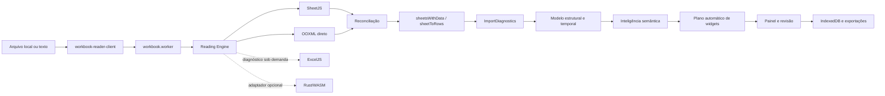

Warning: truncated output (original token count: 153396)
Total output lines: 11102

# Auditoria do estado atual — 2026-08-13

Base auditada: `main` em `4ec3ae0`, imediatamente antes da primeira correção
desta etapa. O código e os testes são a fonte de verdade; este documento registra
o mapa, as lacunas e a ordem recomendada de evolução.

## Resumo executivo

O projeto já possui uma arquitetura de leitura em camadas: SheetJS como leitor
principal, inspeção OOXML direta, ExcelJS como verificador sob demanda e um
contrato opcional para Rust/WASM. A importação preserva uma grade de origem
limitada para revisão, representações especiais de células, fórmulas, períodos,
comentários, regiões e diagnósticos. A geração automática de widgets ocorre
depois da importação e da classificação semântica.

As três maiores lacunas são: o inventário OOXML ainda não cobre vários recursos
estruturais, a pontuação de fidelidade não diferencia tudo que foi validado do
que não é suportado, e o parsing OOXML ainda descompacta e percorre XML inteiro
em memória. Antes desta etapa, a reconciliação também ignorava silenciosamente
uma aba inteira ausente no leitor principal. A primeira implementação corrige
essa perda.

## 1. Mapa da arquitetura atual



| Camada               | Componentes principais                                                    | Responsabilidade atual                                                   |
| -------------------- | ------------------------------------------------------------------------- | ------------------------------------------------------------------------ |
| Entrada              | `workbook-reader-client.ts`, `workbook.worker.ts`                         | valida tamanho, transfere bytes e publica progresso                      |
| Segurança            | `workbook-reader.ts`                                                      | limites de ZIP, abas, células e formatos de texto                        |
| Leitores             | `workbook-reader.ts`, `ooxml-reader.ts`, `workbook-verifier.ts`           | SheetJS, OOXML direto e verificação ExcelJS                              |
| Motor                | `workbook-reading-engine.ts`                                              | tempos, leitor usado, fallback e ponto de extensão WASM                  |
| Importação           | `import.ts`                                                               | cabeçalhos, mesclagens, linhas ocultas, blocos e formatos especializados |
| Diagnóstico          | `import-intelligence.ts`, `quality-audit.ts`                              | fórmulas, tipos, regiões, notas, qualidade e confiança                   |
| Modelo intermediário | `spreadsheet-intelligence.ts`, `structural-model.ts`, `temporal-model.ts` | células canônicas, papéis semânticos, regiões e períodos                 |
| Visualização         | `auto-dashboard.ts`, `widgets.ts`, `operational-widgets.ts`               | recomendações explicáveis e widgets por estrutura                        |
| Orquestração         | `routes/index.tsx`                                                        | revisão, painel, filtros, configurações e exportações                    |
| Persistência         | `storage.ts`, `encrypted-backup.ts`                                       | IndexedDB local e backup criptografado                                   |

O grafo estrutural existente confirma os maiores pontos de acoplamento:
`types.ts`, `routes/index.tsx`, `import-intelligence.ts`,
`spreadsheet-intelligence.ts`, `import-workbench.ts`, `data-pipeline.ts`,
`widgets.ts`, `import.ts` e `auto-dashboard.ts`.

## 2. Lacunas de fidelidade

| Prioridade                             | Lacuna                                                                      | Evidência                                                                                                                                       | Impacto                                                                                           |
| -------------------------------------- | --------------------------------------------------------------------------- | ----------------------------------------------------------------------------------------------------------------------------------------------- | ------------------------------------------------------------------------------------------------- |
| P0, corrigida nesta etapa              | Aba ausente era ignorada pela reconciliação                                 | `compareAndRepairWithOoxml` seguia para a próxima aba quando `primary.Sheets[name]` não existia                                                 | perda silenciosa de aba e pontuação enganosa                                                      |
| P0, corrigida na seção 22              | Pontuação mede principalmente divergências celulares com severidade `error` | `fidelity-meter.ts` deduplica erros por endereço; avisos e recursos não suportados não entravam no denominador nem em lugar nenhum do relatório | “100%” podia significar apenas valores comparáveis sem erro                                       |
| P0                                     | Inspeção OOXML usa `unzipSync` e regex sobre XML completo                   | `ooxml-reader.ts` e `workbook-metadata.ts` descompactam o pacote separadamente                                                                  | memória duplicada e risco em arquivos grandes                                                     |
| P1, sistema 1904 corrigido na seção 25 | Leitor OOXML não preserva colunas ocultas nem estado de abas                | `readSheet` lê linhas ocultas e formatos, mas não `cols` nem `sheet state`; `workbookPr date1904` já é lido e propagado                         | visibilidade ainda pode divergir no fallback; datas já respeitam o sistema 1904                   |
| P1                                     | Estilo preservado é principalmente formato numérico/texto exibido           | `ReaderCell` não carrega preenchimento, fonte, borda ou proteção                                                                                | cores com significado não entram na reconciliação                                                 |
| P1                                     | Limites de diagnósticos truncam sem contabilizar excedente                  | divergências: 2.000; representações/notas: 500; períodos: 2.000                                                                                 | auditoria pode parecer completa quando foi limitada                                               |
| P1                                     | ExcelJS não participa do fluxo normal de cada importação                    | é usado por `fidelity-meter.ts` e testes, não pelo worker de leitura                                                                            | terceira opinião existe apenas sob demanda                                                        |
| P2                                     | Recursos OOXML apenas detectados ou ainda não inventariados                 | tabelas e pivôs são diagnosticados; imagens, gráficos nativos, validações, nomes definidos, links externos e desenhos não têm modelo completo   | o valor visível pode sobreviver, mas o recurso não é explicável                                   |
| P2                                     | Fórmulas entre abas e funções fora da lista dependem do cache               | `formula.ts` recusa referências externas/entre abas não suportadas                                                                              | resultado sem cache fica indisponível, corretamente sem invenção                                  |
| P2                                     | Abas vazias são removidas da lista analítica                                | `sheetsWithData` retorna somente opções com linhas                                                                                              | útil para painel, mas exige inventário separado para afirmar que todas as abas foram reconhecidas |

“Não suportado” deve virar um estado explícito na auditoria; não deve reduzir
automaticamente a nota como “incorreto”, nem ser contado como “validado”.

## 3. Inventário de formatos e recursos

### Formatos aceitos

- Excel/OOXML: XLSX, XLSM, XLSB, XLS, XLTX e XLTM.
- OpenDocument: ODS e FODS.
- Texto: CSV, TSV e TXT, com detecção de delimitador e codificação.
- Outros leitores SheetJS: XML, HTML/HTM e Numbers.

### Recursos preservados ou diagnosticados

- abas e células com valor bruto, texto exibido e formato numérico;
- fórmulas e valores armazenados, com recálculo local limitado e seguro;
- datas e períodos, incluindo meses nomeados e cabeçalhos temporais;
- células mescladas e cabeçalhos hierárquicos;
- linhas ocultas excluídas de registros/widgets, mas preservadas na origem;
- colunas ocultas detectadas em diagnóstico;
- comentários e blocos textuais de observação;
- filtros, tabelas estruturadas, colunas calculadas e tabelas dinâmicas em diagnóstico;
- regiões independentes, blocos repetidos, formulários, matrizes e cronogramas;
- origem por aba/endereço nas células canônicas e nas exceções;
- limites de ZIP, dimensões, número de abas e células.

### Parcial ou não suportado de forma completa

Reauditado em 2026-08-15 (seção 50) — verificado por código, não por
memória do documento; a lista abaixo reflete o estado real de hoje:

- fills, fontes, bordas e cores semânticas na reconciliação — sem mudança;
- imagens, desenhos, objetos e gráficos nativos — sem mudança, zero inventário;
- validações de dados, agrupamentos/outlines e segmentações (slicers) — sem mudança;
- **hyperlinks: parcialmente evoluído.** Parsing estruturado existe
  (`parseHyperlinks`, `workbook-metadata.ts:117-143`, endereço + destino +
  tooltip), mas só alimenta `cell.l` do SheetJS célula a célula — não vira
  inventário consultável em lugar nenhum (nenhuma UI, relatório ou
  diagnóstico lista os hyperlinks do arquivo);
- nomes definidos e links externos: zero leitura, sem mudança;
- macros VBA: nunca executadas e ainda sem inventário detalhado — sem mudança;
- recálculo integral de fórmulas do Excel: escopo cresceu marginalmente
  (`SUMIF`/`COUNTIF` além do aritmético/lógico/`SUM`/`AVERAGE`/`COUNT`/
  `MIN`/`MAX`), mas continua sem referência entre abas, sem lookup
  (`VLOOKUP`/`XLOOKUP`/`INDEX`/`MATCH`) e sem motor completo;
- arquivos XLS/Numbers/ODS parcialmente corrompidos sem leitor alternativo — sem mudança;
- auditoria de abas vazias/ocultas separada das opções analíticas — sem
  mudança; `buildSheetConfidenceMatrix` (seção 28) não resolve isso, porque
  opera só sobre abas já filtradas por `sheetsWithData` (que continua
  excluindo abas sem dado por definição); não existe leitura de
  visibilidade de aba (`Hidden`/`SheetVisibility`) em nenhum lugar.

## 4. Matriz de cobertura dos leitores

Legenda: **P** principal, **V** verificação/reconciliação, **D** diagnóstico sob
demanda/teste, **C** contrato sem implementação e **—** sem cobertura.

| Formato      | SheetJS | OOXML direto |   ExcelJS | Rust/WASM |
| ------------ | ------: | -----------: | --------: | --------: |
| XLSX         |       P |            V |         D |         C |
| XLSM         |       P |            V | D parcial |         C |
| XLTX/XLTM    |       P |            V | D parcial |         C |
| XLS/XLSB     |       P |            — |         — |         — |
| ODS          |       P |            — |         — |         D |
| FODS         |       P |            — |         — |         — |
| CSV/TSV/TXT  |       P |            — |         — |         — |
| XML/HTML/HTM |       P |            — |         — |         — |
| Numbers      |       P |            — |         — |         — |

| Recurso                | SheetJS |            OOXML direto |   ExcelJS | Resultado atual                 |
| ---------------------- | ------: | ----------------------: | --------: | ------------------------------- |
| valor e tipo           |       P |                       V |         D | reconciliado por endereço       |
| fórmula/cache          |       P |                       V | D parcial | preservado; recálculo limitado  |
| texto formatado/numFmt |       P |                       V |         D | comparável                      |
| mesclagens             |       P |                 parcial |         D | importador reconstrói estrutura |
| linhas ocultas         |       P |                       V |         D | removidas da saída analítica    |
| colunas ocultas        |       P |                       — |         D | apenas diagnosticadas           |
| comentários            |       P |                       — |         D | preservados via SheetJS         |
| tabelas/pivôs          | parcial | inventário complementar |   parcial | diagnóstico, sem recálculo      |
| estilos visuais        | parcial |                  numFmt |   parcial | sem reconciliação completa      |
| desenhos/gráficos      | parcial |                       — |   parcial | sem modelo intermediário        |

## 5. Riscos de regressão

1. `routes/index.tsx` concentra 41 relações e grande parte do estado visual;
   mudanças de widget podem afetar importação, filtros e persistência.
2. `import.ts` contém muitas heurísticas especializadas; uma regra genérica de
   cabeçalho ou região pode quebrar cronogramas e formulários já cobertos.
3. Mesclagens e preenchimento de valores exigem distinguir rótulo estrutural de
   observação; replicar texto longo cria dados falsos.
4. Linhas/colunas ocultas não podem alimentar widgets sem decisão explícita;
   a regressão `4s` prova o risco.
5. Datas dependem de valor, formato, texto exibido e fuso; usar apenas serial
   volta a criar anos ou dias errados.
6. A promoção do WASM sem corpus de paridade pode trocar um fallback estável por
   um leitor mais rápido, porém menos fiel.
7. Limites de amostragem para UI não podem ser reutilizados pela auditoria.
8. A separação automática de regiões pode dividir uma tabela com espaçadores ou
   misturar blocos se a confiança não for respeitada.

## 6. Gargalos de desempenho

- O parsing principal já roda em worker, mas SheetJS, `inspectOoxml` e
  `attachWorkbookFeatures` podem descompactar/percorrer o mesmo arquivo em fases
  distintas.
- `unzipSync` mantém o pacote expandido inteiro em memória; XML streaming ainda
  não existe.
- `sheetMeta` percorre toda a dimensão declarada, inclusive células vazias, para
  contar fórmulas e montar diagnósticos. Dimensões infladas custam CPU mesmo sob
  o limite global.
- O armazenamento de representações, notas e períodos tem limites, mas o laço
  continua percorrendo a dimensão completa.
- `routes/index.tsx` continua sendo o maior chunk e o maior ponto de renderização.
- Baseline medido: `workbook.worker` 442,86 kB; maior chunk inicial 302,03 kB;
  XLSX tardio 492,63 kB; Leaflet tardio 813,55 kB.
- O orçamento de produção passa, mas o build alerta para módulos acima de 500 kB
  no servidor; esses módulos devem permanecer fora do caminho inicial.

Métricas que ainda precisam ser registradas por importação: ~~bytes compactados
e expandidos~~, ~~tempo por leitor~~ — registrados desde a seção 37 —, células
realmente visitadas, pico estimado de memória, tempo de reconciliação,
truncamentos de diagnóstico e cancelamento (cancelamento por `AbortError` é
deliberadamente excluído do registro de falhas, ver seção 37).

## 7. Plano incremental para o núcleo Rust

1. Congelar um contrato JSON versionado para inventário de workbook, abas,
   dimensões, visibilidade e limites de recursos.
2. Criar crate isolado, sem integrar a UI, usando ZIP com limites e XML pull/stream.
3. Entregar primeiro apenas inventário OOXML: partes, abas, relações, estado,
   sistema de datas e dimensões declaradas/reais.
4. Adicionar shared strings, células, fórmulas/cache, numFmt, mesclagens e regiões
   ocultas, mantendo valores bruto e exibido separados.
5. Compilar para WASM e implementar o contrato já aceito por
   `registeredWasmWorkbookReader`.
6. Executar Rust e TypeScript lado a lado; nunca promover o resultado Rust antes
   da paridade por formato e fixture.
7. Acrescentar comentários, hyperlinks, tabelas, pivôs, desenhos e nomes
   definidos como inventário, sem executar conteúdo.
8. Medir tempo, memória e tamanho WASM; promover por formato com fallback.

Bibliotecas devem ser escolhidas por cobertura e manutenção, não por
popularidade. Critérios mínimos: ZIP com limites, XML streaming sem entidades,
Serde, WASM estável, datas 1900/1904, fórmulas/cache, estilos e relações OOXML.

## 8. Plano de testes de paridade

1. Definir manifesto JSON por fixture com hash, abas, estados, dimensões reais,
   células críticas, fórmulas, mesclagens, ocultos, notas e recursos conhecidos.
2. Rodar SheetJS, OOXML TypeScript, ExcelJS e Rust sobre os mesmos bytes.
3. Comparar existência, tipo, bruto, cache, display, fórmula, numFmt, visibilidade,
   comentário e hyperlink por endereço.
4. Classificar cada diferença como incorreta, representação equivalente,
   não suportada ou não validável.
5. Exigir zero perda silenciosa e registrar todo truncamento.
6. Manter fixtures sintéticas pequenas para cada recurso e fixtures reais apenas
   locais/sanitizadas, sempre com `skipIf` seguro.
7. Cobrir arquivos pequeno, largo, profundo, muitas abas, estilos vazios,
   mesclagens, fórmulas, corrompido e ZIP bomb simulada segura.
8. Coletar tempo e memória por leitor; falha de desempenho não deve alterar a
   decisão de fidelidade.

Gate de promoção Rust: todos os manifests críticos iguais ou com divergências
explicitamente aceitas, sem regressão de segurança, e ganho medido no corpus de
arquivos grandes.

## 9. Três melhorias de maior impacto

1. **Relatório de fidelidade explicável:** separar validado, divergente,
   reparado, não suportado e truncado por aba/bloco/célula.
2. **Inventário OOXML seguro e único:** uma descompactação limitada, XML
   streaming e cobertura de visibilidade, datas 1904, relações e recursos.
3. **Núcleo Rust em shadow mode:** inventário e células lado a lado com o motor
   atual, promovidos apenas após paridade.

## 10. Primeira implementação mensurável

A reconciliação agora recupera uma aba inteira encontrada pelo OOXML e ausente
no SheetJS. A aba é anexada ao workbook principal e cada célula recuperada gera
uma `ReaderDivergence` com aba, endereço, valor independente, severidade `error`
e `repaired: true`.

Prova sintética adicionada em `workbook-fidelity.test.ts`:

- começa com workbook principal sem abas;
- reconcilia contra a fixture pública OOXML;
- confirma a restauração de `Cabeçalho deslocado`;
- confirma o valor `Data` em `A4`;
- confirma diagnóstico rastreável e reparado para `A4`.

Resultado mensurável: o cenário passou de **zero abas e zero divergências
registradas** para **aba restaurada e uma divergência reparada por célula de
origem**. O limite global de 2.000 divergências continua sendo uma lacuna a ser
tratada no relatório de fidelidade.

## Baseline de validação

Antes da mudança, no ambiente Windows isolado:

- TypeScript: aprovado;
- build de produção: aprovado após evitar o mapeamento de unidade de rede do
  Vite, uma limitação do sandbox;
- testes: 45 arquivos, 42 aprovados e 3 ignorados com segurança; 388 testes
  aprovados e 11 ignorados;
- lint: 10 diferenças de formatação preexistentes em 5 arquivos, a normalizar
  antes da publicação desta etapa.

O briefing citava 404 testes. O checkout atual em `4ec3ae0` possui 399 testes
contabilizados antes desta implementação; a nova regressão eleva o inventário
para 400. A diferença deve ser tratada como mudança de inventário, não como
evidência automática de perda de cobertura.

Após a implementação e a normalização estritamente mecânica dos cinco arquivos:

- testes: 45 arquivos, 42 aprovados e 3 ignorados; 389 testes aprovados e 11
  ignorados, total de 400;
- TypeScript: aprovado;
- ESLint/Prettier: aprovado com adaptação de fim de linha do checkout Windows;
- build de produção: aprovado;
- orçamento de desempenho: aprovado;
- dependências de produção: zero vulnerabilidades no `npm audit --omit=dev`;
- dependências de desenvolvimento: duas vulnerabilidades moderadas herdadas de
  `exceljs -> uuid`, sem correção disponível no inventário atual.

## 11. Núcleo Rust de inventário OOXML — fase 1

O primeiro recorte do plano incremental foi implementado no crate isolado
`rust/oli-ooxml-core`, ainda fora do leitor produtivo e do adaptador WASM. O
contrato JSON `1.0.0` está congelado em
`contracts/ooxml-inventory.schema.json`.

Cobertura entregue:

- validação prévia de quantidade de entradas, tamanho individual e agregado,
  razão de compactação, criptografia e caminhos inseguros/duplicados no ZIP;
- leitura XML orientada a eventos, limitada também por número de eventos;
- ordem, nome, identificador, relação, caminho e estado
  `visible`/`hidden`/`veryHidden` das abas;
- sistema de datas 1900/1904;
- dimensão declarada e dimensão real calculada pelas referências de células;
- métricas do pacote, limites aplicados e diagnósticos estruturados;
- CLI JSON para inspeção local e workflow dedicado no GitHub.

Os testes incluem fixture sintética com abas ocultas e data 1904, caminho ZIP
inseguro, limite de recurso reduzido e paridade de inventário com
`test-fixtures/problematic-import.xlsx`. A fase seguinte de shared strings,
células, fórmulas/cache e formatos é registrada abaixo; o crate ainda não foi
compilado para WASM nem executado lado a lado com o leitor atual.

## 12. Núcleo Rust de células OOXML — fase 2

O crate `oli-ooxml-core` passou a emitir o contrato JSON `2.0.0`. A mudança de
versão é intencional porque cada aba agora inclui o inventário de células, além
dos metadados da fase 1.

Cobertura acrescentada:

- shared strings simples e rich text, preservando a concatenação dos trechos;
- strings inline, strings armazenadas, números, booleanos, erros e datas ISO;
- fórmula separada do valor em cache, mantendo `rawValue` e `displayValue`;
- índice de estilo, formatos numéricos nativos conhecidos e formatos customizados;
- exibição conservadora para inteiros, decimais e percentuais, sem inventar a
  renderização de formatos Excel ainda não implementados;
- limites de 2 milhões de células, 2 milhões de shared strings e 256 MiB de
  texto por parte XML, além dos limites de ZIP e eventos já existentes;
- rejeição de entidades XML não predefinidas, mantendo DOCTYPE proibido.

A paridade da fixture pública agora verifica também as 34 células da primeira
aba, o cabeçalho `A4`, a fórmula `G5` e seu cache numérico. A fixture sintética
cobre rich text, entidade XML, booleano, percentual, formato customizado, erro
e data. O crate permanece fora do caminho produtivo; a cobertura de
datas/formatos, mesclagens e regiões ocultas foi concluída abaixo antes do
adaptador WASM em shadow mode.

## 13. Núcleo Rust de fidelidade estrutural OOXML — fase 3

O contrato JSON passa para `3.0.0`, pois cada aba agora exige também os campos
`mergedRanges`, `hiddenRows` e `hiddenColumns`. O crate passa da versão `0.2.0`
para `0.3.0` e continua isolado do caminho produtivo.

Cobertura acrescentada:

- conversão de datas seriais nos sistemas Excel 1900 e 1904, preservando o
  valor numérico bruto e emitindo `dateValue` local normalizado;
- tratamento explícito do dia fictício 29/02/1900: a exibição compatível é
  preservada, o valor ISO inválido não é emitido e um diagnóstico é registrado;
- reconhecimento conservador de formatos de data/hora, formatos nativos 14–22
  e 45–47, duração `[h]:mm:ss` e formatos customizados comuns;
- inventário validado de mesclagens, linhas ocultas e intervalos compactos de
  colunas ocultas, sem expandir intervalos potencialmente grandes;
- limite configurável de 500 mil registros estruturais por aba, somado aos
  limites de células, texto, eventos XML e pacote ZIP;
- regressões sintéticas para data 1904, duração, formato customizado, mesclagem,
  estruturas ocultas e limite reduzido, além da paridade estrutural da fixture
  pública.

A etapa de compilação e shadow mode foi concluída abaixo.

## 14. Adaptador WASM em shadow mode — fase 4

O crate `oli-ooxml-core` passa à versão `0.4.0` e gera um módulo WebAssembly
para navegador. O contrato de inventário permanece `3.0.0`; não houve mudança
incompatível na saída JSON.

Integração entregue:

- exportação `inventory_ooxml_json` restrita ao alvo `wasm32`, mantendo a API
  Rust nativa e a CLI existentes;
- pacote web gerado por `wasm-pack --target web`, versionado em `src/wasm` para
  que o deploy da Vercel não dependa de uma toolchain Rust;
- registro automático dentro do worker de leitura para XLSX, XLSM, XLTX e XLTM;
- execução somente depois que SheetJS e o verificador OOXML TypeScript já
  produziram o resultado validado;
- comparação de nomes de abas e, por endereço, valor bruto, texto exibido e
  fórmula, com tolerância numérica mínima;
- relatório separado de disponibilidade, estado (`matched`, `diverged`,
  `failed` ou `unavailable`), tempo, células comparadas, células/abas divergentes
  e versão do contrato;
- falha, contrato inválido ou divergência no WASM nunca altera linhas, reparos,
  diagnósticos produtivos nem impede a importação;
- smoke test do binário real contra `problematic-import.xlsx`, além de testes de
  paridade simulada e de falha não bloqueante;
- CI ampliada com compilação para `wasm32-unknown-unknown` e execução do smoke
  test sobre o artefato versionado.

O próximo passo seguro é coletar a distribuição das divergências no corpus de
produção e definir critérios objetivos de promoção por formato antes de permitir
que o Rust participe do resultado produtivo.


## 15. Medição de corpus e gate de promoção — fase 5

O shadow mode agora possui amostragem determinística configurável por
`VITE_WASM_SHADOW_SAMPLE_RATE`. Arquivos fora da amostra são identificados como
`sampled-out`; o Rust continua sem alterar o resultado produtivo em qualquer
estado.

O binário WASM real passou a integrar um teste de corpus no Vitest e na CI. A
medição registra contrato, tempo, células comparadas, células divergentes e abas
divergentes. O avaliador agrega essas observações, calcula taxa de divergência e
latência p95 e informa todos os motivos que impedem a promoção.

Os critérios padrão exigem contrato `3.0.0`, no mínimo 25 arquivos e 10.000
células, zero falhas e divergências e p95 de até 1.500 ms. A fixture pública
isolada é deliberadamente classificada como corpus insuficiente. Os critérios e
o processo de decisão estão documentados em `docs/WASM_PROMOTION_CRITERIA.md`.

## 16. Corpus reproduzível e paridade estrutural — fase 6

O corpus WASM agora é gerado de forma determinística a partir de um manifesto
versionado. São 25 arquivos XLSX e 13.200 células cobrindo strings, números,
booleanos, fórmulas, datas nos sistemas 1900/1904, mesclagens e regiões ocultas.
Os binários gerados não são versionados; a CI os recria e publica o relatório de
medição como artefato.

O inspetor OOXML TypeScript passou a preservar mesclagens, linhas ocultas e
colunas ocultas também no workbook de fallback. O shadow mode confronta essas
estruturas com o inventário Rust e reporta quantidades comparadas e divergentes.

Na medição de referência, os 25 arquivos, 13.200 células e 24 estruturas tiveram
paridade total, sem falhas ou divergências e com p95 abaixo do limite. O gate
permanece corretamente bloqueado: corpus sintético comprova cobertura, mas a
promoção exige pelo menos cinco arquivos reais sanitizados por formato.

## 17. Sanitização local do corpus real — fase 7

Foi adicionado um fluxo local e determinístico para transformar planilhas XLSX
reais em fixtures adequadas à medição de paridade sem versionar originais ou
cópias. Textos, números, datas, nomes de abas e literais de fórmula são
pseudonimizados; metadados, links, comentários, nomes definidos, macros e
referências externas são removidos ou neutralizados.

O sanitizador preserva os tipos das células, fórmulas internas, formatos,
mesclagens e regiões ocultas. Ele aceita somente XLSX, exige chave local via
ambiente, não altera a origem e recusa destinos não vazios. O manifesto gerado
não contém nomes ou caminhos de origem nem a chave. Quando presente em
`test-fixtures/sanitized-real`, o corpus local passa a integrar automaticamente
o relatório e o gate por formato; a CI continua usando apenas as fixtures
sintéticas reproduzíveis.

## 18. Candidate mode com fallback automático — fase 8

Foi preparado o controle de ativação gradual do Rust/WASM para XLSX. O padrão
continua sendo `shadow`, e a allowlist de formatos nasce vazia. Apenas a
combinação explícita de `VITE_WASM_READER_MODE=candidate` com
`VITE_WASM_CANDIDATE_FORMATS=xlsx` permite que um match integral seja marcado
como `sheetjs-wasm-verified`.

Candidate mode mede 100% dos arquivos do formato liberado, independentemente da
taxa de shadow. Contrato incompatível, divergência, falha do adaptador ou
indisponibilidade acionam fallback automático para o leitor TypeScript validado.
O relatório registra modo, estado do candidato e motivo do fallback. O inventário
Rust ainda não cria, substitui ou repara células; publicar a allowlist continua
condicionado ao gate real sanitizado e a uma decisão humana por formato.

## 19. XLSX Rust/WASM primário com fallback validado — fase 9

O modo candidato e a allowlist `xlsx` passaram a ser os padrões. O inventário
Rust agora é materializado como workbook e percorre o pipeline real de
importação. Sua saída só é usada quando células, estruturas e o resultado final
são idênticos ao caminho TypeScript, sendo identificada como `rust-wasm`.

Filtros, tabelas, comentários e links já validados são preservados na
materialização. `VITE_WASM_READER_MODE=shadow` continua disponível como rollback
imediato. O corpus real sanitizado ainda é necessário antes de remover a
validação dupla e obter ganho efetivo de desempenho.

## 20. Metadados OOXML independentes no candidato Rust — fase 10

O workbook materializado pelo inventário Rust deixou de copiar metadados do
workbook SheetJS. Filtros automáticos, tabelas estruturadas, Pivot Tables,
comentários clássicos e hyperlinks internos ou externos agora são reconstruídos
diretamente das partes e relacionamentos do pacote XLSX.

O leitor TypeScript continua executando como oráculo de paridade e fallback: a
saída Rust somente é publicada quando o resultado final permanece idêntico. Isso
remove um acoplamento da materialização sem antecipar a promoção independente,
que ainda depende de cinco arquivos XLSX reais sanitizados e do gate completo.

## 21. Inventário ODS complementar — fase 11

O crate `oli-ooxml-core` ganhou um segundo leitor, isolado do fluxo XLSX, para
OpenDocument Spreadsheet (ODS), o formato universal ISO/IEC 26300 que hoje só
tinha cobertura via SheetJS no caminho TypeScript (linha "ODS" da matriz de
formatos, coluna Rust/WASM: de contrato sem implementação para diagnóstico
testado). O contrato JSON continua `3.0.0`; o campo `format` passa a aceitar
`"ooxml"` ou `"ods"`, mantendo o restante do formato do inventário.

Cobertura entregue pelo módulo `src/ods.rs`:

- reaproveita a validação de pacote ZIP, os limites de recursos e o modelo de
  inventário (abas, dimensões, mesclagens, ocultos, células) já usados pelo
  núcleo OOXML, sem duplicar a lógica de segurança;
- abas, células tipadas (texto, número, booleano, data/hora, percentual,
  moeda), fórmulas (`table:formula`, normalizadas para o mesmo prefixo `=`
  usado no XLSX) e mesclagens por `number-columns/rows-spanned`;
- colunas e linhas ocultas via `table:visibility="collapse"/"filter"`;
- datas ODF já vêm como texto ISO em `office:date-value`; quando o arquivo
  grava só a data, o horário é normalizado para meia-noite para manter o
  mesmo formato `dateValue` do contrato compartilhado.

Células e linhas repetidas (`table:number-columns-repeated`,
`table:number-rows-repeated`, usadas pelo ODF sobretudo para preencher
espaço vazio à direita/abaixo, com contadores que podem chegar a centenas
de milhares) são representadas de forma **compacta e sem perda**: cada
bloco retangular de células idênticas vira um único registro de célula com
os novos campos `repeatColumns`/`repeatRows` (contrato JSON, ambos
opcionais, omitidos quando o valor é 1). `actualDimension` e a contagem de
células da aba refletem a extensão lógica real do bloco, não apenas a
âncora — corrigindo uma limitação da primeira versão deste leitor, em que
somente a primeira ocorrência era materializada e a dimensão/contagem
podiam parecer menores que a estrutura declarada. O custo de processar um
bloco repetido continua O(1) por elemento do XML (nenhum laço proporcional
ao contador de repetição), e o limite de células do pacote passa a ser
aplicado sobre a extensão lógica total, não sobre o número de registros
JSON.

Testes em `tests/ods_inventory.rs` cobrem tipos de célula e dimensão real,
fórmula e mesclagem preservadas com linha/coluna oculta, e a representação
compacta de blocos repetidos (incluindo um caso de 1.000.000 de linhas
repetidas vazias), confirmando `repeatColumns`/`repeatRows`, a dimensão
real completa e a contagem de células lógica — sem materializar nem
descartar nenhuma célula.

O leitor ODS ainda não está integrado ao `workbook.worker` nem ao adaptador
WASM em shadow mode; é uma capacidade isolada do crate, seguindo a mesma
progressão incremental usada para o XLSX (fases 1 a 10 acima) antes de
qualquer integração no caminho produtivo. Os próximos passos seguros são:
compilar para `wasm32-unknown-unknown`, expor `inventory_ods_json` ao
worker como leitor adicional (não substituto do SheetJS) e só então avaliar
paridade contra um corpus real de arquivos ODS sanitizados.

## 22. "Não suportado" como estado explícito na pontuação de fidelidade

Corrige a lacuna P0 registrada na seção 2: `fidelity-meter.ts` deduplicava
apenas divergências de severidade `error` num único mapa e descartava
qualquer coisa de severidade `warning` sem registrar em lugar nenhum do
relatório. Um score de 100% podia então significar tanto "tudo comparado e
igual" quanto "vários avisos silenciados". Não havia, além disso, nenhum
jeito de o relatório dizer que fills, imagens, validações de dados, nomes
definidos/hyperlinks, macros VBA e recálculo integral de fórmulas nunca são
comparados célula a célula por nenhum leitor — esses recursos eram
invisíveis ao medidor de fidelidade, nem contados como validados nem como
divergentes.

`WorkbookFidelityReport` ganhou dois campos, sem alterar a fórmula da
pontuação nem o campo `divergences` existente (que continua sendo apenas
erros, preservando os testes de meta mínima de 99%):

- `warnings`: as divergências de severidade `warning`, deduplicadas por
  endereço como antes, agora visíveis em vez de descartadas;
- `unsupportedFeatures`: lista estática e explícita dos recursos da seção 3
  que nenhum leitor reconcilia hoje. Por decisão de projeto, "não suportado"
  não soma nem subtrai da pontuação — é um estado próprio, nem "validado"
  nem "incorreto", como já estava registrado como princípio neste documento
  mas ainda não implementado.

Teste adicionado em `workbook-fidelity.test.ts` confirma que `warnings` só
contém severidade `warning`, que `divergences` só contém severidade `error`
e que `unsupportedFeatures` inclui "Macros VBA". Nenhum consumidor de
produção usa `fidelity-meter.ts` hoje (só os dois arquivos de teste), então
a mudança de forma do retorno não tem risco de regressão na UI.

## 23. Duas falhas reais encontradas com planilhas de produção

Seis arquivos XLSX reais fornecidos pelo usuário (fora do repositório, nunca
versionados) foram medidos com `measureWorkbookFidelity`. Três continham
apenas texto/números e já fechavam em 100% com zero divergências. Os outros
três — todos contendo imagens/logotipos — expuseram duas falhas que nenhum
teste sintético havia coberto:

1. **`verifyWorkbookWithExcelJs` derrubava a medição inteira.** ExcelJS tem
   bugs conhecidos ao carregar certos desenhos/âncoras de imagem em XLSX real
   (`Cannot read properties of undefined (reading 'name')` e `(reading
'anchors')`, lançados de dentro de `workbook.xlsx.load`). Como
   `measureWorkbookFidelity` não capturava essa exceção, o relatório inteiro
   quebrava — nenhuma pontuação, nenhum diagnóstico, só um erro não tratado.
   Corrigido isolando a chamada em `try/catch`: uma falha de leitor agora vira
   `failedReaders: ["ExcelJS"]`, um estado explícito e visível, em vez de
   "0 divergências" silencioso ou um crash. Como nenhum código de produção usa
   `ExcelJS` no caminho de importação (só `fidelity-meter.ts` e testes), não
   havia risco de regressão na UI, mas a medição em si ficava inutilizável
   para esses arquivos.
2. **`ooxml-reader.ts` não decodificava referências numéricas de caractere.**
   A função `xmlText` só tratava as cinco entidades nomeadas do XML (`&lt;`,
   `&gt;`, `&quot;`, `&apos;`, `&amp;`). Referências numéricas válidas
   (`&#199;`, `&#xC7;`) — usadas por algumas ferramentas de exportação para
   acentos — passavam intactas, produzindo texto corrompido como
   `SOLICITA&#199;&#213;ES` em vez de `SOLICITAÇÕES`. Isso gerava até 850
   avisos por arquivo real. Corrigido com decodificação hex/decimal antes do
   `&amp;` final, preservando o caso em que `&amp;#38;` é texto escapado de
   propósito (não deve virar `&`).

Testes de regressão: `workbook-fidelity.test.ts` cobre a decodificação
numérica com um pacote OOXML sintético mínimo; `fidelity-meter-resilience.test.ts`
mocka `verifyWorkbookWithExcelJs` para lançar e confirma que a medição
continua, reportando `failedReaders` em vez de propagar a exceção.

Depois das duas correções, os seis arquivos reais fecham em 100%, zero
divergências de erro. As diferenças de `\n` vs `\r\n` entre leitores
continuam aparecendo como `warning` — representação equivalente, não erro,
consistente com a regra já registrada neste documento.

## 24. Representação compacta de repetições e sistema de datas do ODS

Revisão da fase 11 (seção 21) apontou dois problemas antes de o leitor ODS
poder integrar o shadow mode:

1. **Perda de fidelidade em células/linhas repetidas.** A primeira versão
   materializava só a primeira ocorrência de um bloco repetido e descartava
   o resto com um diagnóstico de "truncagem". Isso fazia a dimensão real e
   a contagem de células parecerem menores que a estrutura declarada — o
   próprio problema que a seção 23 corrige para outro leitor, agora
   corrigido aqui na origem. `CellInventory` ganhou os campos opcionais
   `repeatColumns`/`repeatRows` (contrato compartilhado com o XLSX, que
   nunca os emite): um único registro representa um bloco retangular de
   células idênticas de forma compacta e sem perda, com `address` no canto
   superior esquerdo. `actualDimension` e a contagem de células da aba
   passaram a somar a extensão lógica real do bloco, não apenas a âncora.
   O custo de processar um bloco continua O(1) por elemento do XML — não é
   um laço de materialização, é aritmética sobre o tamanho declarado — e o
   limite de células do pacote agora é aplicado sobre essa extensão lógica.
   Os diagnósticos `ods-repeated-cell-truncated`/`ods-repeated-row-truncated`
   foram removidos por não haver mais truncagem para relatar.
2. **`dateSystem` afirmava "1900" para um formato que não usa esse
   conceito.** ODF grava data/hora como texto ISO 8601 direto; não há
   série numérica 1900/1904 a resolver. `DateSystem` ganhou a variante
   `NotApplicable` (JSON `"notApplicable"`), e o leitor ODS a emite em vez
   de um `Excel1900` que nunca é interpretado. `parse_excel_serial` trata
   essa variante devolvendo "sem data" em vez de assumir uma convenção
   Excel — ela nunca é chamada para ODS hoje, mas o comportamento fica
   seguro mesmo que isso mude.

`tests/ods_inventory.rs` foi atualizado: o teste de repetição agora chama-se
`represents_repeated_cells_and_rows_compactly_without_loss` e confirma
`repeatColumns`/`repeatRows`, a dimensão real completa e a contagem lógica
de células para um bloco de 5.000 colunas repetidas e uma linha repetida
10.000 vezes, sem descartar nada.

O leitor continua isolado do `workbook.worker`. Os itens restantes da
revisão — corpus real ODS sanitizado, e manter SheetJS como resultado
produtivo até paridade comprovada — seguem como pré-condição para
qualquer integração em shadow mode, na mesma ordem recomendada.

## 25. Etapa 5 — auditoria de corpus de regressão e duas falhas reais

Antes de ampliar fixtures, uma auditoria comparou 20 cenários de leitura
universal contra a suíte existente. Bem cobertos: cabeçalho deslocado,
múltiplas tabelas empilhadas/lado a lado, mesclagens, linhas/colunas
ocultas, células de erro, delimitadores de CSV ambíguos. Parciais: filtros
sem congelamento, fórmulas cacheadas vs. recalculadas, grandes planilhas
(só o caminho de rejeição), ZIP hostil (só limites de dimensão/tamanho),
codificação de CSV, ODS/XLS além de um smoke test básico. Lacunas claras:
cabeçalho repetido inline, sistema de datas 1904 no leitor OOXML
independente, shared strings rich text, imagens/gráficos incorporados.

Escrever os testes das duas primeiras lacunas expôs bugs reais, não só
ausência de cobertura:

1. **`ooxml-reader.ts` nunca lia `workbookPr date1904`.** `serialDate`
   sempre assumia o sistema 1900 (`XLSX.SSF.parse_date_code` sem opções).
   Num arquivo de origem Mac (1904), qualquer data reconciliada por este
   leitor — usado na reparação de abas/células ausentes e como referência
   do shadow mode — saía ~4 anos errada, silenciosamente. Corrigido lendo
   `date1904` do `workbookPr` em `inspectOoxml` e propagando para
   `serialDate` e `XLSX.SSF.format` (que também precisa da opção para
   exibir a data certa). Teste em `workbook-fidelity.test.ts` confirma
   serial `1` virando `1900-01-01`/`"1/1/00"` sem a flag e
   `1904-01-02`/`"1/2/04"` com ela.
2. **Repetição literal do cabeçalho no meio dos dados virava um registro
   de dado.** Relatórios paginados/exportados costumam repetir a linha de
   cabeçalho a cada quebra de página, sem linha em branco nem título
   separando um bloco novo — por isso a detecção de blocos empilhados (que
   já lida com um caso relacionado, mas diferente) não pegava esse caso.
   `sheetToRows` agora filtra uma linha de dado que repete o cabeçalho
   original em pelo menos duas colunas (exigência deliberada para não
   descartar por engano um item de catálogo que só coincide numa coluna),
   registra a contagem em `audit.repeatedHeaderRowsIgnored` e explica no
   aviso ao usuário, em vez de silenciosamente incluir
   `{"Nome": "Nome", "Valor": "Valor"}` como se fosse um registro.

A lacuna de shared strings rich text (múltiplos `<r>` num `<si>`) já
estava implementada corretamente (`sharedStrings` concatena todo `<t>`
dentro do `<si>`, dentro ou fora de `<r>`); ganhou um teste travando o
comportamento, sem precisar de correção. Imagens/gráficos incorporados
continuam como lacuna registrada na seção 3, não abordada nesta etapa.

Três lacunas adicionais foram fechadas com testes, todas confirmando
comportamento já correto (nenhuma correção necessária):

- **BOM UTF-8 em CSV** (`decodeText` já removia o marcador U+FEFF do
  início do texto decodificado): teste confirma que o nome da primeira
  coluna sai limpo, sem o BOM grudado.
- **ZIP hostil** (`validateZipWorkbook` já recusava contagem de entradas
  acima de `MAX_ZIP_ENTRIES` e razão de compressão suspeita acima de
  `MAX_SUSPICIOUS_COMPRESSION_RATIO`): dois testes constroem um registro
  EOCD/diretório central hostil sem precisar de dados comprimidos reais
  (a checagem só lê os campos declarados no cabeçalho), confirmando a
  rejeição de "arquivos internos demais" e de uma razão ~1 milhão:1
  característica de zip bomb.
- **Planilha grande com sucesso**: só existia o teste do caminho de
  rejeição (dimensão declarada abusiva). Novo teste lê 5.000 linhas por 3
  colunas e confirma integridade da primeira e da última linha.

## 26. Etapa 6 — leitor usado e fallback agora aparecem na interface

Uma auditoria de explicabilidade mapeou 11 itens do relatório de leitura
contra o que já é calculado e contra o que chega à interface. A maioria já
estava exposta (estrutura detectada, cabeçalho escolhido e motivo,
regiões/blocos encontrados, células recuperadas, confiança por
região/coluna, ações conservadoras, sugestões de revisão) — nenhuma delas
foi tocada. Dois itens computados por toda importação nunca chegavam ao
usuário: qual leitor produziu o resultado (`WorkbookReadReport.reader`) e
se houve fallback do Rust para o TypeScript (`.fallbackUsed`). Essa
informação de confiança existia só no objeto de relatório interno.

A lógica de descrição foi extraída para `describeReaderOutcome` em
`workbook-reading-engine.ts` (função pura, sem estado), em vez de inline
no componente de rota — só assim dá para testar sem precisar simular
upload de arquivo num navegador de verdade, algo que a ferramenta de
automação deste ambiente não suporta (só dispara eventos de mudança em
`<input type="file">`, não abre o diálogo do sistema operacional). A
função só produz mensagem nos estados informativos: o caminho comum
(`sheetjs-verified`, sem reparo, sem fallback) continua silencioso, sem
poluir toda importação. `routes/index.tsx` chama essa função e junta o
resultado à mesma caixa de aviso já existente na revisão.

Não descoberto nenhum bug aqui — os dois campos já estavam corretos e
testados no motor; a lacuna era puramente de interface. Verificado com
`npx vitest run` (441 passou, 11 pulados, era 436), `npx tsc --noEmit` e
`npm run build`, mas **não foi possível verificar visualmente no
navegador**: a ferramenta de automação deste sandbox não consegue simular
o diálogo de seleção de arquivo do sistema operacional, e uma injeção via
`DataTransfer`/evento `change` sintético não foi concluída de forma
confiável. Risco considerado baixo: é concatenação de string reaproveitando
uma caixa de aviso já renderizada e testada, sobre campos já tipados e
cobertos por teste no motor de leitura — mas fica registrado como
verificação pendente, não como confirmado.

Itens da auditoria de explicabilidade da seção 26: a matriz de confiança
por aba foi implementada na seção 28, e regiões descartadas e o motivo na
seção 29.

## 27. Etapa 3 — teste de rollback dedicado e documentação do desligamento do candidato Rust

Fechava a lacuna registrada na seção 19: o modo candidato e a allowlist
`xlsx` já eram o padrão de produção, e `VITE_WASM_READER_MODE=shadow` já
existia como variável de rollback, mas não havia teste que provasse esse
comportamento isoladamente nem documentação explícita do procedimento.

Nenhum bug foi encontrado — a lógica em `readWorkbookBytesWithEngine`
(`src/lib/workbook-reader.ts`) já garantia que a materialização Rust só
ocorre dentro do bloco condicionado a `candidateEligible`, que por sua vez
exige `wasmReaderMode === "candidate"`. A lacuna era puramente de prova e
de documentação:

- **Teste** (`src/lib/workbook-reader.test.ts`): registra o mesmo adaptador
  Rust simulado, com dados que dariam paridade total, e roda o mesmo
  arquivo duas vezes — uma em modo candidato (confirma promoção a
  `reader: "rust-wasm"`) e outra alterando somente `wasmReaderMode` para
  `"shadow"` (confirma reversão para `reader: "sheetjs-verified"`,
  `wasmOutputUsed: false`, linhas importadas idênticas, e que a medição de
  paridade continua ativa via `wasmShadowStatus: "matched"`). Isso prova
  que o único parâmetro que precisa mudar é o modo, sem depender de
  desregistrar o adaptador ou reverter qualquer outro código.
- **Documentação** (`docs/WASM_PROMOTION_CRITERIA.md`, nova seção "Como
  desativar o candidato Rust (rollback)"): explicita que
  `VITE_WASM_READER_MODE` é lido via `import.meta.env`, ou seja, é
  substituído em **tempo de build** pelo Vite, não é um flag dinâmico de
  execução. Isso corrige uma imprecisão do texto anterior ("rollback
  operacional é imediato"): a mudança de variável não exige nenhuma
  alteração de código, PR ou commit novo, mas ainda exige um novo
  build/deploy (na Vercel, basta redeploy do commit atual, sem novo
  commit) para que o valor embutido no bundle publicado mude.
  `.env.example` recebeu a mesma correção de forma resumida.

Verificado com `npx vitest run src/lib/workbook-reader.test.ts` (37 testes,
todos passando) e a suíte completa (`npx vitest run`, 442 passou/11
pulados, era 441 — o novo teste soma um caso, sem alterar nenhum
pré-existente, incluindo o teste de shadow mode genérico já registrado na
seção 26).

## 28. Matriz de confiança por aba

Fechava parte da lacuna registrada ao final da seção 26: "uma matriz de
confiança por aba/sheet (hoje só há confiança global e por região/coluna)".

Como no caso do leitor/fallback da seção 26, não havia bug nem lacuna de
cálculo — `sheetsWithData` (`import.ts`) já roda `diagnoseImportedSheet`
para **toda** aba com dado no workbook, não só a aba ativa, então
`SheetOption.diagnostics.confidence` e `.confidenceReasons` já existiam
para todas as abas simultaneamente. A lacuna era puramente de agregação e
exibição: nada juntava esses valores num lugar comparável lado a lado, e a
interface só mostrava a confiança da aba selecionada no momento.

- **Função pura nova**: `buildSheetConfidenceMatrix` em
  `import-intelligence.ts`, ao lado do tipo `ImportDiagnostics` que ela
  consome. Recebe `Array<{ name; diagnostics? }>` (compatível
  estruturalmente com `SheetOption`, sem criar dependência circular com
  `import.ts`) e devolve, por aba: `confidence` (número ou `null` quando
  não há diagnóstico), `level` (`"alta"` ≥85, `"média"` ≥60, `"baixa"`
  abaixo disso, ou `"sem diagnóstico"`), os `reasons` já calculados e a
  contagem de divergências do leitor daquela aba especificamente. Não
  recalcula nada — só lê e classifica o que já existe.
- **Interface**: a barra de abas da revisão (`routes/index.tsx`, dentro de
  `Review`) ganhou um indicador colorido por aba (verde/âmbar/vermelho,
  omitido quando não há diagnóstico) com `title` explicando o percentual e
  os motivos, sem alterar a navegação entre abas nem nenhum cálculo
  existente.

Testes em `import-intelligence.test.ts` (`describe("matriz de confiança por
aba")`) cobrem: classificação alta/média/baixa a partir de diagnósticos
reais gerados por `diagnoseImportedSheet` (não valores inventados), aba sem
diagnóstico retornando `null`/`"sem diagnóstico"` sem quebrar, e contagem de
divergências do leitor isolada por aba.

Verificado com `npx vitest run` (444 passou, 11 pulados, era 442 após a
Etapa 3 da seção 27), `npx tsc --noEmit` sem erros e `npm run build`
aprovado. **Não foi possível verificar
visualmente no navegador** — mesma limitação já registrada na seção 26: a
ferramenta de automação deste sandbox não simula o diálogo de upload de
arquivo do sistema operacional, e o indicador só aparece depois de importar
um workbook com mais de uma aba. Confirmado que a página carrega sem erros
de console antes e depois da mudança; a integração em si é composição de
JSX sobre uma função pura já testada, seguindo o mesmo padrão de risco
baixo da seção 26 — mas fica registrado como verificação pendente, não como
confirmado.

## 29. Regiões independentes mantidas juntas por segurança, agora auditadas

Fechava parte da lacuna registrada ao final da seção 26: "regiões
descartadas e o motivo (não existe nenhum modelo de dados para isso hoje,
não é só falta de exibição)".

`import-intelligence.ts` já detecta regiões independentes por aba
(`ImportDiagnostics.tableRegions`), e `regionsAreSafeToSplit` (`import.ts`)
decide, com vários critérios de segurança (matriz de identificadores +
períodos, cabeçalho numérico, poucas linhas de dado, cobertura insuficiente
da área ocupada), se essas regiões viram opções de importação separadas.
Quando a resposta é não — o caso mais comum é justamente o correto, uma
matriz de identificadores à esquerda com colunas de período à direita, que
`regionsAreSafeToSplit` recusa deliberadamente para não quebrar a relação
entre item e seus valores — a aba continuava importando como uma única
tabela sem nenhum registro de que a separação automática foi considerada e
recusada. `diagnostics.tableRegions` continuava existindo internamente, mas
nada da decisão chegava ao usuário nem à auditoria.

Este recorte é deliberadamente menor que "modelo de dados para regiões
descartadas": em vez de decompor `regionsAreSafeToSplit` num motivo
nomeado por critério de recusa (o que exigiria reescrever uma função
delicada com muitos ramos de retorno antecipado, usada pelos testes já
existentes de separação de tabelas), a mudança é só observabilidade —
registra que N regiões foram detectadas e mantidas juntas, sem alterar
nenhuma decisão de separação:

- `ImportAudit` (`import.ts`) ganha o campo opcional
  `regionsKeptTogether?: number`.
- `sheetsWithData` grava esse número quando `diagnostics.tableRegions.length
  > 1` e a aba não foi dividida acima (nem por `regionsAreSafeToSplit`, nem
  pela separação por seções tituladas) — sem mudar a condição de divisão em
  si, só observando o resultado dela.
- A interface (`routes/index.tsx`, grade "Balanço verificável da
  importação") ganha o item "Regiões mantidas juntas", exibido apenas
  quando o valor é maior que zero, no mesmo padrão dos outros contadores já
  existentes.

Teste em `import.test.ts` estende o caso já existente "mantém
identificadores e períodos na mesma tabela quando há só uma coluna de
respiro" (`regionsAreSafeToSplit` recusa por critério temporal) para
confirmar `audit.regionsKeptTogether === diagnostics.tableRegions.length`
(2), e um novo teste confirma que uma aba com uma única região não recebe o
campo (`undefined`, não `0` ou `1`).

O motivo específico da recusa (qual dos vários critérios de
`regionsAreSafeToSplit` disparou) continua não exposto — decompor essa
função em motivos nomeados é trabalho futuro maior, de maior risco de
regressão por tocar a lógica de separação em si, não só observá-la.

Verificado com `npx vitest run` (445 passou, 11 pulados, era 444 após as
etapas 27/28), `npx tsc --noEmit` sem erros e `npm run build` aprovado.
Assim como as seções 26 e anterior, **não foi possível verificar
visualmente no navegador** pela mesma limitação de upload de arquivo do
sandbox; a mudança é só leitura de dado já computado mais um item
condicional na grade de auditoria já renderizada e testada.

## 30. Etapa 4 — XLSM entra no corpus determinístico; XLTX/XLTM seguem sem medição

Primeira avaliação de propósito de outros formatos OOXML para promoção do
Rust (o roteiro original listava XLSM, XLTX, XLTM, XLS, CSV e ODS; esta
etapa cobre só os três primeiros, os únicos que o adaptador Rust já tenta
em shadow mode hoje via `shouldTryWasm`).

- **XLSM**: `test-fixtures/wasm-corpus-manifest.json` ganhou quatro perfis
  (`baseline-xlsm`, `formulas-xlsm`, `structure-xlsm`,
  `date-system-1904-xlsm`), 25 arquivos e mais de 10.000 células — mesmo
  volume de rigor já aplicado ao XLSX. `scripts/generate-workbook-corpus.mjs`
  não precisou de nenhuma mudança (SheetJS já escreve `bookType: "xlsm"`).
  Medição real: 1 dos 25 arquivos diverge em 12 células, sempre a mesma
  causa determinística — números "General" com dízima longa
  (`111.03999999999999`) são exibidos pelo Rust como valor bruto em vez do
  arredondamento de exibição do Excel/SheetJS (`111.04`); o valor bruto em
  si é idêntico. Não é um bug novo: é a lacuna já registrada na seção 12
  ("exibição conservadora... sem inventar a renderização de formatos Excel
  ainda não implementados"), só nunca antes exposta porque as sementes
  fixas do corpus XLSX original não geravam esse padrão de ponto
  flutuante — o mesmo pode acontecer com XLSX real e não foi corrigido
  aqui. Em produção isso não corrompe dado: candidate mode trata qualquer
  `wasmShadowStatus === "diverged"` como fallback automático, sem tentar
  materializar a saída — a medição confirma esse mecanismo funcionando
  como projetado, não uma falha silenciosa. Detalhe completo em
  `docs/WASM_PROMOTION_CRITERIA.md`, seção "Outros formatos OOXML (Etapa
  4)".
- **XLTX e XLTM**: não avaliados. O SheetJS instalado só escreve
  `bookType` `"xlsx"`/`"xlsm"`; `XLSX.write({ bookType: "xltx" })` lança
  `Unrecognized bookType |xltx|`. Sem gerador sintético, e sem arquivos
  reais `.xltx`/`.xltm` disponíveis, esses dois formatos continuam sem
  nenhuma medição — nem sintética, nem real. Isso é a mesma categoria de
  bloqueio "arquivo real indisponível" já registrada nas regras do
  projeto; não inventado nem contornado.
- **XLS, CSV, ODS**: fora do escopo desta etapa. XLS (binário, não
  ZIP/XML) e CSV (texto puro) não têm nenhum leitor Rust — não é uma
  questão de corpus, é ausência de implementação. ODS tem um leitor Rust
  isolado (`rust/oli-ooxml-core/src/ods.rs`, seção 21/24) mas nunca foi
  ligado ao `workbook.worker`/shadow mode; avaliá-lo para promoção exigiria
  primeiro essa integração, que continua como pré-condição registrada nas
  seções 21/24, não decidida nesta etapa.

Nenhuma allowlist de candidato mudou (`VITE_WASM_CANDIDATE_FORMATS`
continua só `xlsx`); esta etapa é só medição, sem promover nenhum formato
novo.

Testes em `wasm-shadow-corpus.test.ts` foram atualizados para o novo total
de 50 arquivos (25 xlsx + 25 xlsm) e para afirmar exatamente o resultado
real por formato (`divergentWorkbooks: 1`, `divergentCells: 12` para
xlsm) — deliberadamente não zerado para não esconder o achado, seguindo a
regra do projeto contra reduzir critério para forçar verde.

Verificado com `npx vitest run` (445 passou, 11 pulados), `npx tsc
--noEmit` sem erros e `npm run build` aprovado.

## 31. Etapa 8 — bug real de chave duplicada no widget de ranking; auditoria de exportação parcialmente bloqueada pelo ambiente

A ferramenta de "Colar dados"/"Ver demonstração" contorna a limitação de
upload de arquivo já registrada nas etapas anteriores: dá para navegar até
um painel real com widgets renderizados e testar exportação PNG/PDF de
ponta a ponta. Duas descobertas, uma corrigida e uma documentada como
bloqueio de ambiente.

**Bug real corrigido**: o widget "ranking" (`w.type === "ranking"`), em
modo `dataMode: "raw"` (linha a linha, sem agregar por grupo — o padrão
sugerido pelo dashboard automático), renderizava sua lista Top N com
`<li key={g.name}>` (`routes/index.tsx`), usando só o nome da categoria
como chave React. Como o modo raw produz uma entrada por linha da
planilha, a mesma categoria (ex.: "Linha A", "Manhã") aparece várias vezes
no Top N sempre que o mesmo grupo tiver os valores mais altos — um cenário
comum, não um caso extremo. React avisava "Encontrado two children with
the same key" e "pode causar duplicação ou omissão" dos itens
renderizados; capturado consistentemente no console do navegador com o
painel de demonstração (`Ranking de Unidade/Turno por Resultado`).
Corrigido reaproveitando o campo `sourceRow` que `chartSeries()`
(`data-pipeline.ts`) já emite por linha em modo raw — mesmo padrão já
usado para o gráfico de barras e de pizza (`entry.sourceRow ?? index`),
só nunca aplicado a este widget: `key={`${g.name}-${g.sourceRow ?? i}`}`.

Como o widget-porta de exportação PNG/PDF captura o DOM renderizado via
`html2canvas`, uma renderização com itens duplicados/omitidos por chave
colidida afetaria também o conteúdo exportado, não só a tela ao vivo —
por isso esse achado entra no escopo da Etapa 8, mesmo sendo um bug de
renderização geral, não específico do módulo de exportação.

**Também ajustado, sem confirmação completa**: quatro usos de
`dot`/`activeDot` do Recharts (gráficos de área e linha) passavam
`{...dotProps}` diretamente para `<ChartDot>`, incluindo silenciosamente
o campo `key` que o Recharts injeta no objeto de props — o antipadrão que
o próprio React avisa ("A props object containing a 'key' prop is being
spread into JSX"), porque `key` espalhado via `{...props}` não é lido
corretamente pelo React como identificador de lista. Corrigido
desestruturando `key` explicitamente e passando como atributo JSX direto
(`key={key}`), o padrão oficialmente recomendado. **Esse aviso específico
continuou aparecendo no console mesmo depois da correção** — indício de
que o Recharts, internamente, também manipula/clona esses elementos com
seu próprio `key`, fora do controle direto do código da aplicação. A
mudança é mantida por seguir a prática correta e não ter nenhum efeito
colateral negativo, mas fica registrado que não eliminou o aviso.

**Bloqueio de ambiente descoberto**: `document.hidden` é `true` e
`document.visibilityState` é `"hidden"` neste sandbox — o painel do
navegador não compõe frames (mesma causa raiz já documentada para
`computer{action:"screenshot"}`). Como consequência, `requestAnimationFrame`
nunca dispara neste ambiente, o que trava indefinidamente qualquer código
que dependa dele: o contador animado dos KPIs (`AnimatedNumber`,
`routes/index.tsx`) fica congelado em "0", e `settleExportLayout()`
(`dashboard-export.ts`, que usa duas chamadas de RAF) nunca resolve,
deixando a classe `oliam-export-mode` presa no DOM porque o `finally` da
captura nunca é alcançado. Confirmado que isso é puramente um artefato
deste sandbox — não um bug do produto — aplicando um polyfill temporário
de `requestAnimationFrame` (via `setTimeout`) só para inspeção: com o RAF
funcionando, a exportação PNG completa normalmente e a classe é removida
corretamente. Consequência prática: não foi possível auditar visualmente
o conteúdo exportado (textos longos, tabelas largas, modo escuro,
acentos, layout A4) neste ambiente — os downloads não são inspecionáveis
e capturas de tela não funcionam com o painel oculto. Essa auditoria
visual completa da Etapa 8 continua pendente e exigiria um navegador real
e visível (ex.: preview da Vercel testado manualmente).

Verificado com `npx vitest run` (445 passou, 11 pulados, mesma contagem —
correção de JSX sem cobertura de teste de componente disponível no
projeto, que não usa `@testing-library/react`), `npx tsc --noEmit` sem
erros, `npm run build` aprovado e reprodução/correção confirmada
manualmente no navegador via console (antes: aviso presente a cada
carregamento do painel de demonstração; depois: aviso do ranking
desaparece, aviso do ChartDot persiste pelo motivo explicado acima).

## 32. Etapa 9 — responsividade mobile: sólida no essencial, alvos de toque abaixo do recomendado

Auditoria do painel real (via "Ver demonstração") em viewport 375×812
(preset mobile), usando `resize_window` e inspeção via `javascript_tool`
em vez de captura de tela — a limitação de compositação de frames deste
sandbox (seção anterior) também impede `computer{action:"screenshot"}`,
mas não impede leitura de layout computado via DOM/CSSOM, que não depende
de pintura real.

**Funciona corretamente:**

- Sem overflow horizontal acidental na página: `document.documentElement
  .scrollWidth === window.innerWidth` mesmo com 13 widgets carregados.
- Grade de widgets usa `grid-cols-1` em mobile e `lg:grid-cols-3` a partir
  do breakpoint largo — empilhamento de coluna única correto.
- Gráficos largos e a tabela detalhada (`Base detalhada`) rolam
  horizontalmente **dentro do próprio contêiner** (`overflow-x-auto`,
  classe `oliam-chart-drag-scroll`/`oliam-data-table`), sem vazar para a
  página — padrão já comunicado ao usuário via "use as setas, arraste ou
  role para os lados".
- A barra lateral (`.oliam-sidebar`) é `position: fixed` com
  `left: -260px` por padrão em mobile (fora da tela) e desliza para
  `left: 0` ao alternar — padrão de gaveta (drawer) funcional, não
  empurra o conteúdo.
- O painel de insights (`.oliam-insight-sidebar`, "Visão geral") usa
  `hidden lg:block` — corretamente ausente em mobile em vez de
  espremido.

**Achado real, não corrigido nesta etapa:** os botões de gerenciamento de
widget (copiar, colar, mover para trás/frente, remover — ex.: aria-label
"Copiar Resultado") são fixados em `size-7` (28×28px do Tailwind), sem
nenhuma variante responsiva (`sm:size-9` ou equivalente) para aumentar o
alvo de toque em telas estreitas. 28px está abaixo dos ~44px recomendados
pelas diretrizes de acessibilidade móvel (Apple HIG/Material Design), e
esses botões ficam agrupados lado a lado (5 por widget), aumentando o
risco de toque errado num dispositivo real. Confirmado que os botões
estão sempre visíveis e clicáveis (`opacity: 1`, `pointer-events: auto`,
não dependem de hover) — o problema é só o tamanho do alvo, não
visibilidade. Não corrigido nesta etapa porque é um padrão de design
compartilhado por toda a interface (não um widget isolado); mudar o
tamanho de ícone globalmente exige verificação visual em várias telas que
este sandbox não consegue fazer (sem captura de tela funcional). Fica
registrado como recomendação para uma etapa dedicada, com verificação
visual num navegador real.

## 33. Etapa 10 — auditoria semântica dos widgets: sistema já maduro, nenhum bug novo encontrado

Revisão da coerência entre operação de agregação oferecida e o papel
semântico da coluna (`semanticAggregationOps`, `relevantAggregationOps`
em `data-pipeline.ts`), aplicada a partir de `routes/index.tsx` nos seis
tipos de widget que agregam (`metric-trend`, `bar`, `pie`, `line`,
`area`, `ranking`, `pivot-table`/`matrix-heatmap`).

Verificado, sem bug encontrado:

- `semanticAggregationOps` já remove soma/multiplicação/divisão de
  colunas não aditivas (percentuais, resultados, metas, notas, médias,
  temperatura, concentração — por papel semântico, família de unidade ou
  nome da coluna via regex), mantendo médias/contagem/faixa. Já coberto
  por `describe("semanticAggregationOps", …)` em `data-pipeline.test.ts`.
- `relevantAggregationOps` já evita oferecer 7 operações equivalentes
  quando os dados não sustentam a distinção (ex.: uma aba já pré-agregada
  com uma linha por grupo) — reduz para as operações que realmente mudam
  o resultado.
- `numericKinds` (`number`/`currency`/`percentage`) e `groupableKinds`
  (`category`/`text`/`date`) são aplicados de forma consistente: nenhuma
  coluna de texto/categoria aparece como métrica somável, nenhuma coluna
  numérica aparece como dimensão de agrupamento por padrão.
- Gráfico de pizza só é sugerido automaticamente pelo dashboard
  automático (`auto-dashboard.ts`) quando a cardinalidade da dimensão
  está entre 2 e 8 categorias — evita pizzas ilegíveis com dezenas de
  fatias; cardinalidade alta gera aviso explícito em vez de sugestão
  silenciosa.
- Os quatro tipos de gráfico (`bar`, `pie`, `line`, `area`) compartilham
  o mesmo bloco de código e a mesma chamada de `semanticAggregationOps` —
  não há caminho onde um tipo aplica o filtro semântico e outro não.

Nenhuma mudança de código nesta seção — é uma auditoria de confirmação,
não uma correção. Fica registrado como base de referência: se um bug
semântico for reportado no futuro (operação nonsensical oferecida para
uma coluna), o ponto de partida é `semanticAggregationOps`/
`relevantAggregationOps`, já testados e já aplicados de forma uniforme —
o bug mais provável estaria na *classificação* da coluna (perfil
semântico incorreto vindo de `spreadsheet-intelligence.ts`), não na
lógica de filtragem de operações em si.

## 34. Alvos de toque dos botões de widget aumentados só em dispositivos de toque

Corrige o achado registrado na seção 32: os cinco botões de gerenciamento
de widget (copiar, colar, mover para trás/frente, remover — componente
`WidgetHead` em `routes/index.tsx`) eram fixados em `size-7` (28×28px do
Tailwind) em qualquer dispositivo, abaixo dos ~44px recomendados para
alvos de toque.

Correção usando a media feature CSS `pointer: coarse` (variante nativa do
Tailwind v4, `pointer-coarse:`), que distingue o tipo de ponteiro
primário do dispositivo — coarse para toque, fine para mouse/trackpad —
em vez de um breakpoint de largura, que erraria tanto para uma janela
desktop estreita quanto para um tablet grande com mouse conectado:

- Botões passam de `size-7` para `pointer-coarse:size-9` (28px → 36px em
  toque; mouse/trackpad continuam em 28px, zero mudança visual em
  desktop).
- O espaçamento entre os botões cresce de `gap-0.5` para
  `pointer-coarse:gap-1`.
- O cabeçalho do widget (`h-12` fixo, 48px) ganha
  `pointer-coarse:h-auto pointer-coarse:min-h-12` porque o crescimento
  dos botões, em títulos mais longos (ex.: "Resultado por linha de
  Turno"), empurra o grupo de botões para quebrar numa segunda linha
  (`flex-wrap` já existente no contêiner) — sem essa mudança, a altura
  fixa cortava a segunda linha. Em desktop essa quebra nunca ocorre (os
  botões continuam pequenos o suficiente para caber numa linha só), então
  a altura automática não tem efeito lá.

Verificado manualmente no navegador redimensionando para 375×812 (preset
mobile deste sandbox emula corretamente `pointer: coarse` — confirmado
via `matchMedia`, ao contrário da limitação de composição de frames que
bloqueia `requestAnimationFrame`/screenshot): botões em 36×36px, nenhum
cabeçalho de widget com `scrollHeight > clientHeight` (sem corte) entre os
13 widgets do painel de demonstração, incluindo os 10 com título longo o
suficiente para quebrar linha. Em desktop, confirmado que os botões
permanecem em 28×28px e a altura do cabeçalho em 48px, idêntico ao
comportamento anterior à mudança.

Verificado com `npx vitest run` (445 passou, 11 pulados, sem mudança —
CSS/JSX sem cobertura de teste de componente disponível), `npx tsc
--noEmit` sem erros e `npm run build` aprovado.

## 35. Correção do formato "General" no Rust — divergência do corpus XLSM eliminada

Corrige o gap identificado nas seções 12 e 30: `display_cell_value`
(`rust/oli-ooxml-core/src/lib.rs`) só arredondava formatos numéricos
explícitos (`0`, `0.00`, `0%`, `0.00%`); fora deles, caía em
`value.to_string()`, expondo ruído de ponto flutuante binário que o
Excel/SheetJS arredondam para exibição (`111.03999999999999` em vez de
`111.04`). O valor bruto (`rawValue`) do contrato nunca foi afetado — só
a representação textual estava errada.

- `format_general_number()`: arredonda a 11 dígitos significativos, a
  mesma convenção documentada do Excel para o formato "General" (Excel
  guarda mais precisão internamente, mas limita a exibição em "General"
  a 11 dígitos), depois remove zeros à direita e o ponto decimal
  sobrando. Testado com o ruído binário real do corpus, inteiros,
  decimais simples, negativos, o limite de 11 dígitos e o caminho
  completo via `display_cell_value`.
- `Cargo.toml`: `0.4.0` → `0.4.1` (correção de comportamento; o
  contrato JSON `3.0.0` não muda — mesmo formato de saída, só o valor
  textual de células "General" com muitas casas decimais muda).

**Processo de validação, dado que este sandbox não linka nem roda
`cargo test` de verdade (seção "Armadilhas de ambiente" do prompt desta
sessão):**

1. Matemática de arredondamento cross-validada em Node.js antes de
   escrever os testes Rust (mesma fórmula, mesmos casos de teste).
2. `cargo fmt --check` e `cargo clippy` via toolchain `gnullvm` local:
   valida tipos e lints, sem rodar os testes de verdade.
3. Disparado `.github/workflows/wasm-build.yml` manualmente
   (`gh workflow run wasm-build.yml --ref fix-rust-general-format`) —
   esse workflow builda em Ubuntu e roda `cargo test --locked` de
   verdade como um dos passos. **Passou** (`Test Rust core ✓`),
   confirmando os testes unitários novos (incluindo o caso do ruído
   binário real) executados de fato, não só compilados.
4. Artefato `oli-ooxml-core-wasm` baixado da execução da CI e usado
   para substituir `src/wasm/oli-ooxml-core/` localmente.
5. `npm run wasm:corpus` re-executado com o binário corrigido: o XLSM
   que antes divergia em 1/25 arquivos e 12 células agora fecha em
   **zero divergências** (`divergentWorkbooks: 0`, `divergentCells: 0`),
   confirmando a correção contra o mesmo corpus que expôs o bug.
   `wasm-shadow-corpus.test.ts` atualizado para afirmar o resultado
   limpo. O gate de promoção do XLSM continua bloqueado pelo motivo já
   conhecido (corpus real sanitizado insuficiente, 0/5), não mais por
   divergência.

O binário WASM reconstruído (`src/wasm/oli-ooxml-core/`) é commitado
junto com a mudança de fonte, seguindo o mesmo processo já documentado
em `WASM_PROMOTION_CRITERIA.md`/seção 14: o pacote web é versionado
porque `wasm-pack` não funciona de forma confiável em todo ambiente
local (incluindo este sandbox).

Verificado com `npx vitest run` (445 passou, 11 pulados, mesma
contagem — só a asserção de um teste existente mudou, refletindo o
resultado real e não mais o bug), `npx tsc --noEmit` sem erros e
`npm run build` aprovado.

## 36. Quebra estrutural de `routes/index.tsx` (10.282 → 3.715 linhas)

Prioridade "Média" do roteiro de melhorias: `src/routes/index.tsx` tinha
10.282 linhas (429 KB) e concentrava o fluxo de importação/revisão, a
orquestração do painel e o editor de widgets num único arquivo — a
maior fonte de risco de regressão do projeto (seção 5, item 1 deste
documento). Nenhuma linha de comportamento foi alterada nesta etapa;
é reorganização estrutural pura, verificada a cada corte com a suíte
completa.

**Mapeamento prévio** (via agente de exploração, sem editar nada):
identificou clusters por responsabilidade e ordem de extração por
risco crescente — componentes-folha sem estado compartilhado primeiro,
depois o fluxo de importação/revisão (prop-driven), depois as peças de
suporte de widget e o próprio `WidgetCard` (o maior bloco, ~3.060
linhas, mas também prop-driven e sem closures sobre o estado de
`Dashboard`), deixando `Dashboard` (~2.500 linhas, dezenas de
`useState` locais) e `OliAm` (a raiz de orquestração) para uma etapa
futura dedicada — extrair `Dashboard` exigiria primeiro consolidar seu
estado (ex.: um reducer), risco maior que mover código já isolado.

**Técnica de extração**: para os dois primeiros cortes (componentes-
folha e fluxo de importação/revisão, juntos ~1.780 linhas), o código foi
lido e reescrito diretamente. A partir do corte de `WidgetCard` (~3.060
linhas sozinho), a técnica mudou para reduzir risco de erro de
transcrição num bloco desse tamanho: `sed` corta o intervalo de linhas
exato do componente (sem retranscrição manual do JSX), e um script Node
(`gen-imports.mjs`, descartável, não commitado) cruza cada identificador
do bloco de import original de `index.tsx` com o uso real no corpo
extraído, gerando a lista de imports do novo arquivo por interseção —
em vez de "o que pode ser necessário", é "o que o texto realmente usa".
Isso pega tanto import faltando quanto import morto automaticamente.
Falsos positivos do script (identificador citado só em comentário, ex.:
`useTheme`, `X`, `toggleClickFilter`) foram confirmados manualmente
antes de descartar; o sinal mais forte de correção, porém, foi rodar
`npx tsc --noEmit` logo após montar cada arquivo — import faltando vira
erro de tipo imediato, e o projeto desliga
`@typescript-eslint/no-unused-vars` (`eslint.config.*`), então import
sobrando não quebra lint, só fica como limpeza de legibilidade
(feita à parte, com outro script que compara cada nome importado contra
o uso no restante do arquivo).

**Arquivos criados** em `src/components/oliam/`:

- Componentes-folha: `mark.tsx`, `oli-loader.tsx`, `oli-welcome-scene.tsx`,
  `oli-face.tsx`, `theme-toggle.tsx`, `animated-number.tsx`,
  `onboarding.tsx`, `sheet-picker-dialog.tsx`, `gemini-chat-panel.tsx`.
- Fluxo de importação/revisão: `home.tsx`, `empty.tsx`,
  `import-workbench.tsx`, `review.tsx` (este último importa
  `ImportWorkbench` e renderiza a matriz de confiança por aba da
  seção 28).
- Editor de widget: `widget-support.tsx` (peças compartilhadas entre
  `Dashboard` e `WidgetCard` — `FieldDropSlot`, `WidgetHead`,
  `WidgetPickerIcon`, tooltips/eixos de gráfico, `CalculationButton`,
  `PieLegend`, `MapWidgetBody`, `ChartDot` — tudo exportado porque
  ambos os consumidores precisavam), `widget-card.tsx` (`WidgetCard` +
  `EmptyWidget`, único consumidor de `widget-support.tsx` que sobrou em
  `index.tsx`), `format-rules-editor.tsx`.

`index.tsx` hoje contém só `OliAm` (orquestração de rota/estágio) e
`Dashboard` (o maior estado local restante).

**Regressão real de bundle, encontrada e corrigida antes do commit
final**: depois do corte de `WidgetCard`, `npm run performance:check`
acusou um chunk `format-rules-editor-*.js` de 961,1 KiB — mais que o
dobro do limite de 420 KiB por chunk genérico. Isolado comparando o
build desta branch contra `main` sem nenhuma mudança de código (branch
trocada com os dois arquivos novos, ainda não commitados, temporariamente
fora de `src/` para não contaminar o build de `main`): `main` fecha em
295 KiB no maior chunk genérico compartilhado entre as rotas `/` e
`/painel/$id`; a mesma quantidade de código, só reorganizada em mais
arquivos sem alterar o grafo de módulos em si, faz o bundler (Rolldown,
via Vite) escolher um "módulo fachada" diferente para nomear esse
mesmo chunk compartilhado — e, ao fazer isso, consolida `recharts`
inteiro e vários pacotes `@radix-ui`/`@floating-ui`/`cmdk`/`sonner`
dentro dele, que antes ficavam distribuídos entre os chunks de rota.
Nada foi duplicado nem ficou maior em bytes totais (o total de JS do
build até caiu, de 3,6 MB para 3,4 MB, por deduplicação real de código
antes espalhado por três chunks de rota) — o problema é puramente de
qual *um* chunk concentra esse peso.

Corrigido com `manualChunks` explícito em `vite.config.ts`, isolando
`recharts`/`d3-*` num chunk `recharts-vendor` (407 KiB) e
`@radix-ui`/`@floating-ui`/`cmdk`/`sonner` num chunk `radix-vendor`
(154 KiB), sem introduzir nenhum carregamento tardio novo — é só
reorganização de chunk de vendor. O carregamento sob demanda já
existente (Leaflet, xlsx, jsPDF, html2canvas) não foi tocado e continua
funcionando como antes. Resultado final: maior chunk genérico
`format-rules-editor-*.js` em 400,4 KiB, dentro do limite de 420 KiB.

**Lição registrada para o futuro**: mover código entre arquivos sem
mudar o que ele faz *pode* ainda assim quebrar o orçamento de bundle,
porque o nome/composição de um chunk compartilhado depende de detalhes
internos do bundler sensíveis à estrutura de arquivos, não só ao grafo
de dependências lógico. `npm run performance:check` precisa rodar
depois de qualquer reorganização de arquivos que mova código
significativo entre módulos, não só depois de mudanças de
comportamento.

Verificado a cada um dos quatro commits desta refatoração com
`npx vitest run` (445 passou, 11 pulados, contagem idêntica em todos —
nenhum teste foi criado, modificado ou removido, confirmando que
nenhum comportamento mudou), `npx tsc --noEmit` sem erros, `npm run
build` aprovado, e `npm run performance:check` aprovado no commit
final (400,4 KiB no maior chunk genérico, abaixo do limite de 420 KiB).

## 37. Métricas reais de importação (sem dado de planilha)

Fecha parte da lacuna registrada na seção 6 ("Métricas que ainda
precisam ser registradas por importação"): tempo por leitor já existia
por importação em `WorkbookReadReport` (`workbook-reading-engine.ts`),
mas nunca era persistido nem agregado entre importações — cada
relatório vivia e morria dentro de uma única chamada, sem histórico
para responder "o candidato Rust/WASM está ajudando ou só custando
mais caro, ao longo do tempo?".

**Bytes compactados/expandidos, novo no relatório**: `validateZipWorkbook`
(`workbook-reader.ts`) já calculava `totalUncompressed` para aplicar o
limite de segurança pós-descompactação, mas descartava o valor.
Passou a retornar `{ totalUncompressedBytes }`; `readWorkbookBytesWithEngine`
grava isso em dois campos novos de `WorkbookReadReport`: `sourceBytes`
(tamanho do arquivo como recebido) e `expandedBytes` (soma declarada no
diretório central do ZIP; igual a `sourceBytes` para CSV/TXT, que não
tem camada de compressão). Importante: `expandedBytes` não é
necessariamente maior que `sourceBytes` para arquivos pequenos — o
contêiner ZIP tem overhead estrutural por entrada (cabeçalhos locais,
diretório central, ~30-70 bytes cada) que não entra nessa soma, então
um XLSX minúsculo com muitas partes internas pequenas pode ter
`sourceBytes` maior. O teste de regressão usa o valor exato calculado
por `validateZipWorkbook`, não uma comparação de maior/menor.

**Novo módulo `src/lib/import-metrics.ts`**: constrói uma
`ImportMetricEntry` a partir de um `WorkbookReadReport` bem-sucedido
(`buildImportMetricEntry`) ou de um erro capturado
(`buildFailedImportMetricEntry`) — nunca a partir de linhas/células da
planilha. Mensagens de erro são truncadas a 200 caracteres por
segurança, mas na prática todas as mensagens lançadas pelo pipeline de
leitura são estáticas (auditado: nenhuma interpola nome de arquivo ou
conteúdo de célula, só constantes de limite como "mais de 100 abas").
`recordImportMetric` acumula no IndexedDB local (via
`storage.ts`, mesmo idioma de `loadGeocodeCache`/`saveGeocodeCache`),
mantendo só as últimas 200 entradas, e respeita modo privado (grava só
em `sessionStorage`, some ao fechar a aba — `setPrivateMode(false)`
já limpa essa chave junto com `PRIVATE_DASH_KEY`).
`summarizeImportMetrics` agrega por leitor (contagem, tempo médio),
taxa de fallback e estados do shadow mode WASM (`matched`/`diverged`/
`failed`) — a agregação pensada especificamente para a pergunta "o
WASM ajuda ou só custa" citada acima; ainda sem consumidor de UI (fica
para uma etapa futura, um pequeno painel de diagnóstico).

**Ponto de gravação único**: `readWorkbook` em `routes/index.tsx`
(usado tanto pela importação principal quanto pela ressincronização de
pasta monitorada) grava a métrica de sucesso logo após
`readWorkbookFileWithReport` retornar, e a métrica de falha no
`catch`, antes de relançar o erro para o tratamento existente (que
continua intacto — a gravação de métrica não muda nenhuma mensagem de
erro exibida ao usuário). Cancelamento pelo usuário
(`DOMException`/`AbortError`, ex.: botão "Cancelar importação") é
deliberadamente excluído do registro de falha — não é uma falha do
leitor, e contá-lo junto inflaria artificialmente a taxa de erro.

Testado em `workbook-reader.test.ts` (bytes de origem/expandidos,
inclusive o caso CSV sem compressão) e `import-metrics.test.ts`
(construção de entrada de sucesso/falha, truncamento de mensagem,
acumulação e limite de 200 entradas, comportamento em modo privado via
o mesmo padrão de `vi.stubGlobal` de `storage-privacy.test.ts`,
limpeza do histórico, e agregação por leitor/fallback/shadow status).

Verificado com `npx vitest run` (455 passou, 11 pulados — 10 testes
novos, nenhum teste existente alterado além dos dois `baseReport`
fixtures que ganharam `sourceBytes`/`expandedBytes`), `npx tsc --noEmit`
sem erros, `npm run build` aprovado e `npm run performance:check`
aprovado (402,2 KiB no maior chunk genérico, dentro do limite de
420 KiB — os dois campos novos e o módulo de métricas não têm peso
relevante no bundle).

## 38. Captura de erro do servidor por requisição (era global e racy)

Corrige o item "Média" da lista de melhorias trazida pelo usuário:
`error-capture.ts` (`src/lib/`) guardava o último erro capturado numa
única variável de módulo (`lastCapturedError`), compartilhada por
todas as invocações concorrentes de `fetch` no mesmo isolado/worker do
servidor. `server.ts` usa isso para recuperar o erro real quando h3
"engole" um throw interno e devolve um 500 genérico
(`{"unhandled":true,"message":"HTTPError"}`, sem stack nem causa) —
ver `normalizeCatastrophicSsrResponse`.

**Bug real de concorrência, não só um cheiro de código**: sob duas
requisições que falham ao mesmo tempo no mesmo processo, a segunda
chamada a `record()` (disparada pelo próprio `console.error` interno
do h3) sobrescrevia o erro da primeira antes dela conseguir
`consumeLastCapturedError()`. Resultado possível: a requisição A loga
o stack trace da requisição B (atribuição cruzada, confunde
investigação de incidente), ou nenhuma das duas encontra seu próprio
erro (cai no fallback genérico `new Error("h3 swallowed SSR error: ...")`,
perdendo o stack de verdade). Como o erro já tinha sido *consumido*
por quem chegou primeiro, não é só "podia ficar melhor" — é perda de
informação de diagnóstico sob carga concorrente real, exatamente o
cenário em que mais se precisa do log correto.

**Correção**: substituída a variável global por
`AsyncLocalStorage<RequestErrorContext>` (`node:async_hooks`, nativo
do runtime Node do Vercel confirmado em
`.vercel/output/functions/__server.func/.vc-config.json` →
`"runtime": "nodejs24.x"`). `runWithErrorCapture(secrets, fn)` cria um
contexto isolado por chamada; `server.ts` envolve o corpo inteiro de
`fetch` nele. `AsyncLocalStorage` propaga automaticamente por toda a
cadeia de `await` dentro de `fn`, então `record()`/`consumeLastCapturedError()`
chamados em qualquer profundidade da mesma requisição enxergam o
mesmo slot, isolado de outras requisições paralelas no mesmo processo.
Limitação aceita: os listeners globais de `error`/`unhandledrejection`
(erros verdadeiramente não tratados, por definição não amarrados a
uma cadeia de `await` específica) agora só gravam quando disparam
dentro de algum `runWithErrorCapture` ativo — antes gravavam sempre,
mas podiam contaminar a requisição errada; o novo comportamento troca
"sempre grava, às vezes errado" por "só grava quando pode ser
atribuído corretamente", mesmo trade-off que motivou o resto da
mudança.

**Logs estruturados com redação de segredos** (segunda parte pedida
pelo usuário): `runWithErrorCapture` recebe também a lista de segredos
conhecidos da requisição (`OLI_SESSION_SECRET`, `OLI_CHAT_AUTH_TOKEN`,
`GEMINI_API_KEY` — os três valores sensíveis que passam pelo `fetch`
do servidor, lidos de `env`/`process.env` do jeito que
`handleGeminiChat` já lia). `describeError` compara o texto do log por
igualdade exata contra cada segredo (não regex de "parece um token" —
mais confiável, já que o valor exato é conhecido) e substitui por
`[REDACTED]`; strings com menos de 6 caracteres são ignoradas para não
redigir texto comum por engano. `console.error` continua sendo o único
canal de log (não foi trocado por uma lib de logging estruturado, fora
de escopo desta correção) — "estruturado" aqui significa que o mesmo
formato de saída (mensagem + stack + cadeia de causas) agora nunca
carrega segredo em claro, não que o formato de linha mudou.

Testado em `error-capture.test.ts`: duas "requisições" concorrentes
(uma com atraso artificial via `setTimeout`, outra síncrona) confirmam
que cada uma só vê seu próprio erro mesmo executando em paralelo —
esse é o teste de regressão do bug de concorrência descrito acima;
consumo único (segunda chamada retorna `undefined`); expiração por TTL
com `vi.useFakeTimers()`; redação de segredo conhecido; segredos
vazios/indefinidos e strings curtas não quebram nem redigem à toa;
cadeia de causas e status preservados no texto do erro.

Verificado com `npx vitest run` (465 passou, 11 pulados — 10 testes
novos), `npx tsc --noEmit` sem erros, `npm run build` aprovado
(confirma que `node:async_hooks` empacota corretamente para o preset
Vercel configurado) e `npm run performance:check` aprovado (mesmos
402,2 KiB no maior chunk genérico — mudança é só no bundle de
servidor, que este orçamento não mede).

## 39. `test:security-smoke` passa a rodar na CI

`scripts/security-smoke.mjs` já existia (confere cabeçalhos de
segurança CSP/`x-content-type-options`/`x-frame-options`/`referrer-policy`
contra um servidor rodando, o cookie de sessão de chat quando
`OLI_EXPECT_CHAT_SESSION=1`, e que uma origem cross-site recebe 403 em
`/api/gemini/chat`), mas nunca era executado automaticamente —
`.github/workflows/application.yml` só rodava `npm run lint` e
`npm run verify` (testes + build + orçamento de desempenho), nenhum
dos dois sobe um servidor de verdade para testar cabeçalhos HTTP reais.

Novo job `security-smoke` (paralelo ao job `quality` existente,
mesmo runner/Node): sobe `npm run dev` em segundo plano com
`OLI_SESSION_SECRET` de CI (valor fixo só para essa execução efêmera,
nunca um segredo real, existe só para exercitar o ramo de código que
assina o cookie de sessão), espera o servidor responder em
`http://127.0.0.1:3000/` com um laço de repetição de até 30 segundos,
roda `npm run test:security-smoke` com `OLI_EXPECT_CHAT_SESSION=1`
(cobrindo também a asserção do cookie, não só os cabeçalhos), e
encerra o servidor no fim (`if: always()`, mesmo se o smoke test
falhar).

**Por que `npm run dev`, não o build de produção do preset Vercel**:
o `server.ts` exporta um handler `fetch` padrão Web, mas o build
gerado por `nitro({ preset: "vercel" })` (`.vercel/output/functions/__server.func/`)
está no formato específico de runtime Node da Vercel (`NodeResponse`
do h3, `.vc-config.json` com `"launcherType": "Nodejs"`) — rodar isso
fora da própria plataforma Vercel exigiria replicar o contrato de
invocação deles, fora de escopo aqui. `vite dev` executa o mesmo
`server.ts` através do pipeline de SSR de desenvolvimento do TanStack
Start, no mesmo processo — os cabeçalhos de segurança não têm nenhum
branch condicional a build/dev (`http-security.ts`/`chat-session.ts`
auditados, sem `NODE_ENV`/`import.meta.env`), então o smoke test
exercita o mesmo código de produção mesmo não sendo o artefato exato
implantado.

**Validado sem rodar de fato pela CI** (o ambiente local não linka
com o servidor de dev de forma alcançável por `curl` do lado do Bash
neste sandbox — limitação já conhecida de rede isolada entre
ferramentas): os cabeçalhos e o status da requisição cross-origin
foram conferidos manualmente contra `npm run dev` através do
`fetch()` da própria página no navegador do preview deste ambiente
(via `javascript_tool`), confirmando CSP com `frame-ancestors 'none'`,
`x-content-type-options: nosniff`, `x-frame-options: DENY` e
`referrer-policy: strict-origin-when-cross-origin` presentes. A
asserção de 403 cross-origin não pôde ser confirmada dessa forma —
`fetch()` de dentro de uma página não pode sobrescrever o cabeçalho
`Origin` (é um cabeçalho proibido pela spec Fetch para requisições de
página), então o navegador sempre envia a origem real; o script Node
não tem essa restrição (só o `fetch` de navegador a impõe), então essa
parte só é validável de fato rodando o script pela CI real — o YAML do
workflow foi validado sintaticamente (`npx js-yaml`), mas o
comportamento fim a fim da nova etapa `security-smoke` deve ser
conferido no primeiro run real da CI depois deste PR.

**Duas falhas reais só visíveis rodando a CI de verdade** (não
reproduzíveis neste sandbox, que não alcança o servidor de dev via
Bash — ver limitação de rede isolada já registrada): a primeira
tentativa de wiring falhou porque `curl -sf --max-time 3` cortava
antes do primeiro pré-empacotamento frio de dependências (recharts/
xlsx/leaflet/radix-ui, sem cache de `.vite` numa checkout nova)
terminar — corrigido subindo para `--max-time 60`. A segunda tentativa
ainda falhou, agora com toda chamada de `curl` recusada mesmo depois
do Vite já ter impresso "ready" — o próprio banner do Vite avisa
"Network: use --host to expose"; sem esse flag, a porta não fica
alcançável em todas as interfaces locais do runner da GitHub Actions.
Corrigido com `npm run dev -- --host`. Terceira execução: os dois jobs
passam (`security-smoke` em 31s), incluindo a asserção de 403
cross-origin que só era validável rodando de verdade.

## 40. Painel de diagnóstico de importação (consumidor de `import-metrics.ts`)

A coleta de métricas (seção 37) não tinha nenhum consumidor de UI —
era coleta silenciosa em segundo plano. Novo componente
`src/components/oliam/import-diagnostics-dialog.tsx`
(`ImportDiagnosticsDialog`) fecha essa lacuna: carrega
`loadImportMetrics()` sob demanda (só quando o diálogo abre, sem
manter nada em cache entre aberturas) e exibe, via
`summarizeImportMetrics()`, quatro cartões de KPI (importações
registradas, falhas, quantas usaram fallback para o leitor padrão,
paridade do shadow mode Rust/WASM: correspondeu/divergiu/falhou) mais
uma tabela pequena de contagem e tempo médio por leitor. Segue o
padrão visual já usado em `import-workbench.tsx` ("Balanço verificável
da importação") para os cartões, não introduz um padrão novo. Um botão
"Limpar histórico" abre um `AlertDialog` de confirmação idêntico ao
já usado em `home.tsx` para excluir painel, chamando
`clearImportMetrics()`.

Acessível pela paleta de comandos (`⌘K`), novo item "Diagnóstico de
importação" logo depois de "Atalhos de teclado" — mesmo padrão de
entrada que os outros diálogos utilitários do painel (`CommandItem` +
`Dialog` controlado por um `useState` booleano em `Dashboard`).

**Verificação neste ambiente foi parcial e inconclusiva por
instabilidade do próprio servidor de desenvolvimento**, não por
suspeita de bug no código: a sessão de teste sofreu repetidos erros
`NitroViteError: Vite environment "nitro" is unavailable` (503) e
`[vite] server connection lost. Polling for restart...`, quebrando a
navegação SSR de forma intermitente mesmo depois de reiniciar o
servidor de preview várias vezes — sintoma novo, não documentado nas
sessões anteriores. Apesar disso, duas confirmações diretas foram
obtidas: (1) o item "Diagnóstico de importação" apareceu corretamente
e foi selecionável na paleta de comandos na primeira tentativa bem-
sucedida desta sessão, antes da instabilidade se instalar; (2) com a
navegação quebrada, `fetch()` direto contra `/src/routes/index.tsx` e
`/src/components/oliam/import-diagnostics-dialog.tsx` (via
`javascript_tool`, contornando o router) confirmou os dois módulos
sendo transformados e servidos pelo Vite sem erro (200, conteúdo
esperado presente), o que descarta erro de sintaxe/transformação como
causa da instabilidade observada. `npx tsc --noEmit` e `npx eslint`
também sem erros. Fica registrado como verificação visual pendente
para quando o ambiente estiver estável (preview da Vercel ou nova
sessão deste sandbox).

Verificado com `npx vitest run` (465 passou, 11 pulados, mesma
contagem — nenhum teste novo; o projeto não usa
`@testing-library/react`, então mudanças de UI aqui seguem o mesmo
padrão de risco das seções 26/28/29, verificação manual em vez de
teste automatizado), `npx tsc --noEmit` sem erros, `npm run build`
aprovado e `npm run performance:check` aprovado — mas com margem menor
que antes: o chunk que virou "fachada" do grafo compartilhado (mesma
característica de nomeação de chunk documentada na seção 36, agora
recaindo sobre `import-diagnostics-dialog-*.js`) subiu para 406,8 KiB,
contra 402,2 KiB antes desta mudança, ficando a só 13,2 KiB do limite
de 420 KiB. Não é um bug novo — é a mesma consolidação de código
compartilhado entre `/` e `/painel/$id` de sempre, só que agora com
menos margem. Se a próxima mudança em `Dashboard`/`WidgetCard`
adicionar bytes relevantes, o orçamento pode estourar de novo e exigir
mais uma categoria de `manualChunks` em `vite.config.ts`.

## 41. Duas falhas reais na exportação PDF/PNG, encontradas por screenshots reais do usuário

A auditoria visual completa de exportação (seção "Estado conhecido",
`SECOND_BRAIN.md`) continuava bloqueada neste sandbox por falta de
RAF/screenshot funcional. O usuário trouxe screenshots reais de um PDF
exportado (fixture FRS-QA-BR-405) que expuseram dois bugs genuínos,
nenhum deles hipotético.

**1. Colapso vertical letra-por-letra na linha de comparação da fatia
selecionada do gráfico de pizza.** A palavra "Água Potável" (e outros
textos da linha: "Filtrar", os valores de KPI) apareciam quebrados em
uma letra por linha, empilhados verticalmente por toda a página —
sintoma clássico de uma coluna de grid espremida a quase 0px de
largura combinada com quebra de palavra forçada. Causa raiz, em
`widget-card.tsx` (bloco `w.type === "pie"`, painel de comparação
`selectedPieComparison`/`pieComparisonFor`, `data-pipeline.ts:522-553`):
a grade `sm:grid-cols-[minmax(0,1.4fr)_repeat(3,minmax(7rem,0.7fr))_auto]`
tem a primeira coluna (nome + "Posição X de Y categorias") com mínimo
explícito `0`. Na tela normal isso é inofensivo porque `.truncate`
(`white-space: nowrap` + reticências) simplesmente corta o texto sem
quebrar layout. Mas `.oliam-export-mode .truncate` (`styles.css:1356`)
desliga deliberadamente essa proteção — `white-space: normal` +
`overflow-wrap: anywhere !important` — para nunca perder texto num
PDF. Sem essa proteção, e com a grade de exportação forçando 3 colunas
fixas a 1440px (`EXPORT_SURFACE_WIDTH`, `export-layout.ts`), um widget
"pie" de largura 1/3 (~450px) não tem espaço para as 3 colunas de
valor (mínimo 7rem/112px cada) + botão, então a coluna de nome com
mínimo 0 é espremida até quase desaparecer, e o texto sem `nowrap`
não tem alternativa a não ser quebrar entre cada caractere.

Corrigido em du…103396 tokens truncated…aceitando
uma fonte de grade. Cada uma testada, nenhuma ligada. Esta seção é a ligação, e
é o ponto em que o ganho medido vira ganho para quem importa.

### O que o coordenador faz

`csv-progressive-import.ts` faz o caminho inteiro: reconhece o conteúdo pelos
primeiros 8 KiB, decide a codificação, lê o arquivo em blocos direto do `Blob`,
monta a grade e chama a normalização com uma worksheet mínima. Nenhum
`ArrayBuffer` do arquivo, nenhum ZIP, nenhuma worksheet do SheetJS.

O worker continua obrigatório. O que mudou é o que ele recebe: o `File`
atravessa o `postMessage` como referência ao conteúdo no disco. Mandar bytes ali
anularia o trabalho antes de ele começar, e um teste do cliente guarda
exatamente isso, com um arquivo cujo `arrayBuffer()` lança se for chamado.

### A medição, do código que é entregue

`src/lib/csv-progressive-benchmark.test.ts` mede os dois caminhos sobre o mesmo
arquivo, no ponto mais largo de cada um: o instante em que a aba fica pronta. É
ali que tudo o que o caminho precisou coexiste, e medir no fim mediria só o que
sobrou, que é a mesma coisa nos dois lados.

120 mil linhas por 8 colunas, arquivo de 8,4 MiB, 960 mil células:

| Caminho | Pico | Tempo |
| --- | ---: | ---: |
| Atual | 141,8 MiB | 6.974 ms |
| Progressivo, blocos de 1.000 | **34,9 MiB** | 6.421 ms |
| Progressivo, blocos de 2.000 | 42,9 MiB | 6.514 ms |
| Progressivo, blocos de 5.000 | 41,8 MiB | 6.867 ms |

**75% menos memória, com o mesmo resultado e sem custo de tempo.**

O benchmark mede o código entregue, e não uma réplica montada para ele: é por
isso que ele mora num teste desligado por variável de ambiente, e não num script
`.mjs`, que não resolveria os módulos do projeto.

### O tamanho de bloco saiu de medida, e o critério não é o tempo

`progressive-import.ts` guardava 1.000, 2.000 e 5.000 como candidatos, com a
decisão adiada para a PR do CSV. Os três tempos ficam dentro de 2% uns dos
outros e qual deles sai na frente muda a cada execução; os picos se repetem até
a décima de MiB entre execuções. Por isso o critério é o pico, e o escolhido é o
menor: **mil linhas por bloco**.

### Duas divergências silenciosas encontradas ao ligar

A primeira, e a mais séria. O leitor de streaming decidia o delimitador com o
texto retido até a **primeira** quebra de linha, enquanto `detectDelimiter`
pontua os candidatos ao longo de **25 linhas** e penaliza o candidato ausente em
parte delas. Com uma linha só essa penalidade não existe. Um arquivo cuja
primeira linha é um título com ponto e vírgula, seguido de dados separados por
vírgula, seria analisado com o separador errado e viraria uma tabela de uma
coluna, sem nada na tela indicando. A janela passou a ser a mesma da função que
decide, com teto de 64 KiB para a espera não virar uma cópia do arquivo.

A segunda, menor mas do mesmo tipo. A checagem de relatório de compatibilidade
do Excel lia as doze primeiras linhas **da worksheet**, e numa worksheet mínima
não há célula nenhuma: a aba passaria sem ser checada. A checagem passou a vir
da grade quando existe uma.

Nenhuma das duas apareceria num teste de unidade das peças isoladas. As duas
apareceram ao confrontar os dois caminhos sobre as mesmas 23 formas de CSV.

### O bloco virou um teto de verdade

Com a janela de 25 linhas, o começo do arquivo retém mais texto antes de começar
a analisar, e a entrega mandava tudo o que tivesse acumulado de uma vez.
`readCsvInBlocks` passou a entregar em blocos de no máximo `blockSize` linhas, e
a conferir o sinal de cancelamento **a cada bloco**, e não só a cada leitura do
`Blob`: uma leitura só pode render vários blocos, e quem cancelou no meio não
pode continuar recebendo o resto deles. Isso é correção, e não detalhe do
refactor: antes, cancelar no meio de um lote grande continuava entregando o lote
inteiro.

### Recusa e indisponibilidade são coisas diferentes

Um PDF renomeado para `.csv` precisa ser recusado, com a mesma mensagem dos dois
lados. Um pacote OOXML renomeado para `.csv` precisa do caminho atual, que sabe
lê-lo, e a pessoa não pode ver nada disso. As duas situações levam a coisas
opostas, então elas não podem ser o mesmo erro: `ProgressiveImportFallback` marca
a segunda, e o worker a devolve numa mensagem própria, porque tipo de erro não
sobrevive à fronteira do `postMessage`.

O cliente só aceita o fallback enquanto nenhuma aba tiver sido escoada. Hoje isso
só acontece no reconhecimento do conteúdo, antes de qualquer leitura, mas a
garantia mora no cliente e não na ordem interna do coordenador.

### O teto de células é conferido durante a leitura

O caminho atual confere as 2 milhões de células depois de o workbook estar
montado. O progressivo confere enquanto lê, sobre o mesmo retângulo declarado,
para os dois recusarem exatamente os mesmos arquivos. Recusar só no fim
significaria ter montado a planilha inteira na memória antes de dizer que ela não
cabe. A mensagem virou uma constante só, porque duas cópias do mesmo texto são
duas mensagens que podem divergir sem ninguém notar.

### Uma etapa nova na barra, porque ela sabe medir

`parsing` não tem fração de propósito: é uma chamada única ao SheetJS, que não
expõe progresso. A leitura em blocos sabe medir: o denominador é o tamanho do
arquivo e o numerador são os bytes já lidos. Ela entrou como etapa própria
(`streaming`, "Lendo o arquivo em blocos") em vez de emprestar o rótulo de
`parsing`, que fala de fórmulas e formatação que um CSV não tem.

A passagem de reconhecimento de codificação também passou a reportar bytes. Ela
percorre o arquivo inteiro, e sem isso seria uma espera sem medida na tela.

### Estimativa de pico própria, porque a fórmula antiga descreve outro programa

`estimateWorkbookPeakMemoryBytes` soma o pacote de origem e duas representações
descompactadas, porque no caminho atual as três existem ao mesmo tempo. No
progressivo nenhuma delas existe. Reaproveitá-la mostraria no diagnóstico de
importação um pico várias vezes maior do que o programa produz.
`estimateProgressiveCsvPeakMemoryBytes` usa os 38,1 bytes por célula medidos,
arredondados para cima pelo mesmo motivo conservador da razão de 6x do seletor.

### Vocabulário

A leitura do arquivo aqui é streaming de verdade no sentido da seção 146: o
arquivo não entra num `ArrayBuffer` e nenhum ZIP é expandido. A **grade** não é
ilimitada: a normalização precisa da aba inteira para achar cabeçalho e regiões,
então grade e linhas ficam vivas ao mesmo tempo. É isso que os 34,9 MiB
contabilizam, e nada disto deve ser descrito como memória constante.

### O que continua igual

XLSX não mudou nada: o seletor devolve `caminho-progressivo-indisponivel` para
OOXML, que é a verdade. CSV pequeno continua no caminho atual, que é o validado
pelo corpus. A rede de paridade sobre 110 abas de 25 arquivos reais foi gravada
antes e conferida depois da mudança em `import.ts`, com resultado idêntico.

### Custo

O chunk `global-search` foi de 403,0 para 411,0 KiB de um teto de 450,0. O
coordenador e o leitor de CSV passaram a ser alcançáveis a partir do cliente de
importação. Continua aprovado, com 39 KiB de folga.

### Verificação

`npm run verify` com 1.136 testes. Os novos: 23 formas de CSV confrontadas linha
tipada a linha tipada entre os dois caminhos, mais windows-1252, marcador de
ordem de bytes, todo tamanho de pedaço contra todo tamanho de bloco, progresso
monotônico que fecha em 100% nas duas etapas mensuráveis, recusa com mensagem
idêntica à do caminho atual, fallback por conteúdo não textual, teto de células
durante a leitura, cancelamento, escoamento sem segunda cópia, campos do
relatório, e no cliente: o arquivo indo ao worker como referência, o CSV pequeno
continuando no caminho atual e o fallback repetindo a leitura pelo leitor
validado.

### Versão

`0.10.0-beta.12` para `0.10.0-beta.13`.
## 150. O ZIP lido por posição, e a medida que disse onde isso não ajuda

Primeira peça do caminho progressivo de OOXML. A seção 146 já tinha registrado
que os dois primeiros passos existiam: `validateZipWorkbook` localiza o registro
de fim e percorre o diretório central sem descompactar nada. Faltava operá-los
sobre `Blob.slice()` em vez de sobre um `Uint8Array` completo. É isso, e só
isso, que esta seção entrega.

### As regras do formato passaram a morar num lugar só

`zip-directory.ts` é o formato e os limites, sem saber de onde os bytes vieram.
`validateZipWorkbook` foi reescrito em cima dele e `zip-blob-reader.ts` nasce em
cima dele. A alternativa seria duas cópias das mesmas regras de segurança, e
duas cópias são dois lugares onde o critério pode divergir sem ninguém notar,
justamente nas conferências que existem para recusar uma bomba de
descompactação.

O comportamento de `validateZipWorkbook` não mudou: mesmas mensagens, mesma
ordem de recusa, e os 44 testes do leitor continuam passando sem alteração.

### O leitor por posição

`openZipFromBlob` abre o pacote com duas leituras pequenas, a cauda onde o
registro de fim pode estar e o índice que ele aponta, e a partir daí entrega uma
entrada por vez. O arquivo nunca entra num `ArrayBuffer` e nenhuma entrada que
ninguém pediu é expandida.

Uma armadilha do formato que o código evita explicitamente: o índice aponta para
o cabeçalho local, não para o conteúdo, e o cabeçalho local tem nome e campo
extra com tamanhos **próprios**, que não precisam coincidir com os do índice.
Confiar nos tamanhos do índice ali é o erro clássico de quem lê ZIP à mão, e
produz bytes deslocados em alguns pacotes.

Um teste pegou um desperdício antes de ele ser publicado: o leitor lia até 131
KiB para descobrir onde o conteúdo começava, quando os 30 bytes fixos do
cabeçalho local já trazem os dois tamanhos. São duas leituras por entrada, e a
primeira precisa ser barata.

### A equivalência

25 pacotes reais locais, **756 entradas conferidas byte a byte** contra
`unzipSync` sobre o pacote inteiro, mais o total expandido declarado conferido
contra o do caminho atual em cada um. Um XML deslocado ainda é um XML que quase
analisa, então a comparação é de bytes e não de resultado.

Nos sintéticos: nome com acentuação, entrada vazia, entrada guardada sem
compressão, comentário no fim do pacote deslocando o registro final, pacote
truncado, teto de entradas e índice que não cabe no arquivo. As três últimas
conferem que a recusa é a mesma dos dois caminhos, com a mesma mensagem.

### A medida, e o que ela desmentiu

| Pacote | Entradas | Expandido total | Maior entrada |
| --- | ---: | ---: | ---: |
| 1 aba x 120 mil linhas | 10 | 37,2 MiB | 37,2 MiB (**100%**) |
| 12 abas x 10 mil linhas | 21 | 35,9 MiB | 3,0 MiB (**8%**) |

Os dois pacotes têm 13,9 MiB de arquivo e o mesmo total de linhas. A diferença
entre eles é a resposta inteira: **expandir uma entrada por vez só ajuda quando
existem várias entradas grandes.** Numa planilha de aba única, a maior entrada é
o pacote inteiro, e não há o que economizar.

Isso limita o alcance desta peça mais do que a intuição sugeria, e limita de um
jeito específico: o caso que motivou toda esta frente, o arquivo grande de uma
tabela só, é exatamente o caso em que ela não paga. O ganho real para OOXML
continua dependendo do que a seção 146 já dizia, que o workbook do SheetJS
deixe de ser materializado, e agora com um detalhe a mais: para uma aba só,
nem o acesso por entrada nem o índice barato mudam alguma coisa.

### Duas medições descartadas, e por quê

A primeira comparava memória viva entre um `Blob` de teste e a expansão inteira.
O `Blob` de teste **copia** a cada fatia, então ela media a cópia do teste, e
não o programa. Trocada por `fs.openAsBlob` sobre um arquivo real.

A segunda comparava memória viva com `--expose-gc` em dois cenários seguidos, e
chegou a reportar um caminho consumindo **menos vinte e dois MiB**: o lixo do
primeiro cenário era coletado durante a medição do segundo, e a subtração saía
negativa. Um número que pode sair negativo não estava medindo o que dizia medir.

A medida que ficou não observa o coletor: ela usa os tamanhos que o próprio
pacote declara, que são exatos, e para descobri-los nada precisa ser expandido,
que é justamente a capacidade em teste. Fica registrado porque a tentação de
medir memória com uma subtração simples reaparece toda vez.

### O que isto não faz

Nada chama o leitor novo ainda. A importação de OOXML continua idêntica,
expandindo o pacote inteiro com `unzipSync`. O que falta para o caminho
progressivo de OOXML existir é o XML da aba virar grade e alimentar
`sheetsWithData(wb, { gridFor })`, como o CSV já faz. `inspectOoxml` já lê o
pacote entrada por entrada e é o candidato natural a receber este leitor, mas
ele é síncrono e o acesso por `Blob` é assíncrono, o que é a próxima decisão de
desenho.

### Versão

Sem avanço de versão e sem entrada no Centro de Atualizações: nada aqui é
visível para quem usa, pela mesma razão das seções 146 a 148.
## 151. A grade de OOXML existe, e o corpus provou que ela ainda não serve

Segunda peça do caminho progressivo de OOXML, e a mais informativa até agora,
porque o resultado foi negativo e o número que o mostra é grande: **25 de 25
planilhas reais divergem**.

### O que foi construído

`readOoxmlSheetGrid` lê o XML de uma aba direto para uma grade densa, sem
construir worksheet nenhuma. É o equivalente OOXML do que `csv-stream.ts` faz
para CSV, e existe pela mesma medida: a worksheet do SheetJS é a cópia que
domina o pico, e a normalização já sabe trabalhar sobre uma grade.

Ao contrário do CSV, aqui `aoa` e `textAoa` **não** coincidem: um número com
formato de data aparece como `Date` numa e como texto formatado na outra. É
exatamente por isso que `SheetGridSource` tem os dois campos separados.

A leitura de célula, que o corpus real conferiu célula a célula ao longo de
várias seções, não foi reescrita: ela virou `parseSheetCells`, e tanto a
worksheet do verificador quanto a grade consomem o mesmo gerador. Duas leituras
seriam dois lugares onde a interpretação de tipo, formato e data pode divergir
sem ninguém notar.

### O teste que primeiro mediu errado

A comparação óbvia é `grade.aoa` contra `sheet_to_json` da worksheet. Ela
acusa divergências que **não existem no resultado**, e as duas primeiras que
apareceram foram instrutivas.

Numa planilha do corpus, uma célula de texto com formato de data (`t="s"` com
`z="d-mmm"`) faz o `sheet_to_json` produzir `Date { NaN }`, enquanto a grade
entrega o texto certo. E numa data válida, o `sheet_to_json` aplica um
deslocamento de fuso que a grade não aplica. Nos dois casos quem conserta é
`normalizeRawRow`, que consulta a célula de origem antes de aceitar a data.

Ou seja, a grade intermediária dos dois caminhos legitimamente difere, e o que
precisa coincidir é o que a normalização produz. O teste passou a comparar
`sheetsWithData` contra `sheetsWithData`, com o mesmo comparador da
equivalência do CSV.

### O achado

Corrigido o nível da comparação, o corpus respondeu de forma dura:

```text
25 planilhas reais com data
25 ainda divergem, em: celula, colunas, nome-de-aba, quantidade-de-abas, quantidade-de-linhas
0 já coincidem
```

A causa é única e está localizada. `formatTemporalCell` decide granularidade,
fuso e formato a partir de `cell.z` e `cell.w` **da célula de origem**. Numa
worksheet mínima não existe célula, então `formatTemporalCell` devolve vazio e
a data é descartada. A coluna de data perde valor; quando ela era só data,
desaparece inteira; e a coluna que some desloca a detecção de cabeçalho, o que
muda a contagem de linhas e chega a mudar quais abas sobrevivem.

Vale dizer o tamanho disso sem suavizar: **a grade de OOXML, como está, não
substitui a worksheet em nenhuma planilha real do corpus.**

### A garantia positiva que não pôde ser escrita

O teste natural seria "em planilha real sem célula de data, a grade é
substituível". Ele não existe porque não existe planilha assim: as 25 do corpus
têm data. Num corpus de planilhas de qualidade isso não é acidente, é o formato
do domínio. Ficou um teste registrando essa ausência, para ninguém procurar o
outro e concluir que foi esquecido.

A substituibilidade está provada nos casos sintéticos: números, textos, vazios,
booleanos, célula só com formatação, mesclagem e linha oculta, mais o caso de
texto com formato de data que o corpus revelou.

### O que isso muda no plano

A seção 150 já tinha limitado o alcance do acesso ao ZIP por posição. Esta
limita o passo seguinte, e junto as duas dizem o que falta de verdade para o
OOXML progressivo: **a grade precisa carregar o formato numérico e o texto
exibido das células de data**, e `sheetToRows` precisa aceitá-los sem
worksheet.

Isso é uma mudança em `import.ts`, e trazia uma pergunta de custo: guardar
formato e texto por célula de data reintroduz parte exata do que a grade existe
para remover. Numa coluna de data de 120 mil linhas, são 120 mil pares.

### O custo, medido antes de escrever o código

| Representação | Memória viva |
| --- | ---: |
| Worksheet, como o leitor monta hoje | 235,5 MiB |
| Grade de valores e de texto | 61,3 MiB |
| Grade mais o formato e o texto das datas | **72,2 MiB** |

O formato custa **10,8 MiB**, e a grade completa fica em **69% menos** que a
worksheet. A pergunta estava certa e a resposta é favorável: o par por célula de
data é barato perto do que ele destrava. Medido em 120 mil linhas por 8 colunas,
com uma coluna de data de verdade, e reproduzido até a décima de MiB entre
execuções (`OLI_GRID_BENCHMARK=1`).

Ou seja, a lacuna vale a pena fechar, e o próximo incremento tem número para
justificar-se antes de começar.

### Onde os pares moram, também medido antes de escolher

O mapa por endereço com o par completo é o mais simples de escrever, e não é o
mais barato. Duas observações o encolhem, e as duas foram medidas antes de virar
código.

A primeira é que o texto exibido **já** está na grade: `textAoa` guarda
exatamente o `w` que `formatTemporalCell` consulta, então guardá-lo de novo é
pagar duas vezes pela mesma string. A segunda é que o formato numérico repete:
uma coluna de data costuma ter um formato só, e o próprio pacote OOXML guarda
formatos por índice de estilo, e não por célula.

| Desenho | Custo sobre a grade |
| --- | ---: |
| Mapa por célula, com formato e texto | 10,8 MiB |
| Mapa por célula, só o formato | 6,3 MiB |
| Um formato por coluna | ~0 MiB |

O formato por coluna é praticamente de graça, mas só vale se a coluna for
homogênea, e isso é afirmação sobre planilha real, não sobre o formato OOXML.
Quem respondeu foi o corpus: **214 colunas de data, 13 com mais de um formato**,
ou seja 6%.

O desenho, então, está decidido e tem número: **formato por coluna quando ela é
homogênea, e por célula só nas que não são.** Os 94% saem de graça, e os 6%
pagam 6,3 MiB no pior caso. O texto exibido nunca é duplicado, porque a grade já
o tem.

### Uma inconsistência de tipo encontrada de passagem

`SheetSourceGrid`, em `import.ts`, está declarado sem `boolean`, embora o
caminho atual já produza `true`/`false`: uma célula `t="b"` chega assim pelo
`sheet_to_json`, e a anotação genérica ali é uma asserção, não uma conversão.
Alargar o tipo cascateia pelas assinaturas internas do arquivo do qual todo o
corpus depende, então não foi feito aqui. Ficou para a seção seguinte, que o
corrigiu e descobriu que eram 33 assinaturas, e não oito. Ver
[[CURRENT_STATE_AUDIT#152. O tipo da grade omitia o booleano, e o caminho atual sempre o produziu]].

### Versão

Sem avanço de versão e sem entrada no Centro de Atualizações: nada aqui é
visível para quem usa. Nenhum chamador usa a grade nova, e o comportamento da
importação de OOXML é o mesmo, verificado pela rede de paridade sobre 110 abas
de 25 arquivos reais.
## 152. O tipo da grade omitia o booleano, e o caminho atual sempre o produziu

Correção encontrada de passagem na seção 151, e fechada aqui antes da ligação
que ia esbarrar nela.

### O que estava errado

`SheetSourceGrid` declarava `(string | number | Date | null)[][]`. Uma célula
`t="b"` do Excel chega como `true` ou `false` através de
`sheet_to_json(ws, { header: 1, defval: null })`, e o parâmetro de tipo daquela
chamada é uma **asserção**, não uma conversão. Ou seja, o caminho atual sempre
entregou booleanos ali, e o tipo dizia o contrário desde que existe.

Não era erro de comportamento, e não havia defeito visível: `normalizeRawRow`
deixa passar tudo o que não é `Date`, e as funções seguintes só fazem `String()`
do valor. O que existia era uma anotação falsa, no arquivo do qual todo o corpus
depende, esperando a primeira pessoa que confiasse nela.

### Por que a omissão sobreviveu tanto

A união estava repetida à mão em **33 assinaturas internas** de `import.ts`.
Corrigir uma delas sem corrigir as outras 32 não compila, então a alternativa
prática era não corrigir nenhuma. Duas uniões repetidas viram dois lugares onde
o tipo pode divergir; trinta e três viram uma barreira.

A correção, então, não é só acrescentar `boolean`: é dar nome ao que estava
repetido.

| Tipo | O que é |
| --- | --- |
| `SheetSourceGrid` | A grade como entra, com `Date` |
| `SheetSourceRow` | Uma linha dela |
| `NormalizedCellValue` | Um valor depois de `normalizeRawRow`: sem `Date`, com booleano |
| `NormalizedSheetRow` | Uma linha depois dela |

Com os nomes, acrescentar um valor ao conjunto passa a ser uma linha, e não
trinta e três.

### Duas assinaturas que também mentiam

`isRepeatedHeaderRow` declarava receber `Date`, e recebe linha já normalizada,
onde data virou texto: o `Date` nunca chegou a acontecer ali, e o booleano
sempre chegou. E um acumulador de células de cabeçalho estava tipado como
`(string | number)[]` num ponto que recebe valor de célula qualquer.

### Verificação

A rede de paridade foi gravada antes e conferida depois: **110 abas de 25
arquivos reais, resultado idêntico**. Isso importa mais que o normal aqui,
porque uma mudança só de tipo que altera comportamento seria justamente a que
passaria despercebida.

O diff em `import.ts` foi conferido linha a linha e **não tem nenhuma alteração
fora de tipo e comentário**. Suíte completa com 1.159 testes, build e orçamento
aprovados.

O elenco que a seção 151 tinha deixado no teste da grade de OOXML, marcando esta
lacuna, saiu junto: os dois tipos agora coincidem de verdade.

### Versão

Sem avanço de versão e sem entrada no Centro de Atualizações: nada aqui é
visível para quem usa, e nenhum byte de comportamento mudou.
## 153. A grade de OOXML ligada à normalização: de 25 divergências para 8

A seção 151 encontrou o bloqueio e mediu que valia a pena fechá-lo. Esta fecha.

### O que a normalização passou a aceitar

`formatTemporalCell` decide granularidade, fuso e formato a partir de `cell.z` e
`cell.w` da célula de origem, e numa worksheet mínima não existe célula. Agora
existe uma fonte de reserva: `SheetCellFormatLookup`, uma consulta por
coordenada da grade que devolve exatamente esses dois campos, e nada mais.

O tipo é estreito de propósito. `SheetCellFormat` tem só `z` e `w`, então uma
`XLSX.CellObject` continua servindo sem conversão, e uma fonte de grade
consegue responder sem inventar uma célula inteira. A worksheet, quando tem a
célula, continua tendo precedência: a consulta é reserva, não substituição.

Ela desce por `SheetToRowsOptions.cellFormats` e por `SheetGridSource.cellFormats`,
e os recortes a remapeiam: `sliceCellFormatsRegion` desloca linha e coluna, e
`sliceCellFormatsSection` escolhe as linhas pela mesma lista que
`sliceGridSection` usa, agora extraída em `sectionGridRows`. Sem o remapeamento,
um recorte consultaria o formato da célula errada e a data sairia com a
granularidade de outra coluna.

### O que a grade de OOXML passou a carregar

Só as células de data, e no armazenamento que a seção 151 mediu: um formato por
coluna quando ela é homogênea, e um mapa por célula só nas que não são. O texto
exibido não é guardado de novo, porque `textAoa` já o tem.

### O resultado

| | Antes | Depois |
| --- | ---: | ---: |
| Planilhas reais que normalizam igual pela grade | 0 de 25 | **17 de 25** |

E o custo do que foi acrescentado, medido em 120 mil linhas por 8 colunas com
uma coluna de data:

| Representação | Memória viva |
| --- | ---: |
| Worksheet, como o leitor monta hoje | 235,8 MiB |
| Grade, antes de carregar formato | 61,3 MiB |
| **Grade como é entregue, com o formato ligado** | **61,3 MiB** |

**O desenho por coluna saiu de graça**, como a medição da seção 151 previa: a
grade completa fica **74% abaixo** da worksheet. O mapa por célula, que custaria
6,3 MiB, só é usado nas colunas heterogêneas, que no corpus são 13 de 214.

### As duas causas do que ainda diverge

**Fórmula volátil.** O caminho atual **recalcula** uma fórmula que depende de
hoje, para um cronograma de 2023 não mostrar o número de dias que faltavam
quando o arquivo foi salvo. Foi isso que apareceu nas colunas de "dias
restantes", com o caminho atual dizendo `-836` e a grade `-548`. Recalcular
exige o texto da fórmula **e** acesso às outras células, que é justamente o que
uma grade não é. Esta não se fecha carregando mais um campo, e é a fronteira
real da representação.

**Divisão em seções que nunca começa.** Num plano de ação, o caminho atual
entrega `Causa 1` em duas opções e a grade entrega uma. A investigação está
abaixo, e ela desmentiu o diagnóstico inicial: não é o recorte que falha, é a
detecção que nunca roda.

Nenhuma das duas perde dado. As linhas continuam lá, agrupadas de outro jeito ou
com um número recalculado a menos, e o teste do corpus cobra isso: nenhuma
divergência pode ser de um tipo fora da lista conhecida.

### A terceira causa, e por que consertá-la sozinha piora

Depois de registrar as duas causas acima, a segunda foi investigada até o fim, e
o resultado desmentiu o diagnóstico inicial duas vezes seguidas. Fica registrado
com esse detalhe porque a próxima pessoa vai chegar exatamente aqui.

O primeiro palpite foi que o recorte perdia mesclagem e linha oculta, porque
`minimalWorksheetForGrid` leva só o `!ref`. Fazer o recorte passar pelos
fatiadores de worksheet, que já remapeiam esse metadado, **não mudou nada**: as
25 planilhas continuaram com o mesmo resultado. O palpite estava errado, e a
mudança foi desfeita em vez de ficar no repositório sem evidência.

A causa real está antes do recorte. `detectIndependentSections` decide se uma
linha é banner perguntando se a **célula de origem da mesclagem tem valor**, e
pergunta isso à worksheet. Numa fonte de grade não há célula nenhuma, então a
resposta é sempre não, nenhum banner é reconhecido, e **a aba nunca é dividida
em seções**. Não é o recorte que falha: é a detecção que nunca começa.

Isso foi confirmado instrumentando a função: sobre a mesma aba, a worksheet
encontra duas seções e a grade encontra zero.

O conserto do mecanismo é pequeno e segue o mesmo padrão da consulta de formato,
com a worksheet tendo precedência e a grade respondendo por reserva, já que
`cellHasValue` só olha para presença e o texto da grade responde a mesma
pergunta. Ele foi escrito, e o efeito medido foi **negativo**: as planilhas que
normalizam igual caíram de 17 para 16.

O motivo é que ele destrava a divisão sem alinhá-la. Sem o conserto a grade
nunca divide, e por acaso isso coincide com o caminho atual nas abas que ele
também não divide. Com o conserto ela passa a dividir, e a divisão às vezes sai
diferente, o que troca um tipo de divergência por outro.

Por isso o conserto não foi embarcado. A rede de paridade confirma que ele não
tocaria o caminho atual, então ele é seguro; o que faltava não era segurança.

A medição que faltava foi feita na seção seguinte, e ela encerra a questão: com
a régua certa, o conserto não faz **nenhuma** aba a mais coincidir, e o que ele
muda é o tipo do erro. Ver
[[CURRENT_STATE_AUDIT#154. A régua por aba, e a resposta definitiva sobre a divisão em seções]].

### Um erro de leitura de código que quase virou conclusão errada

Ao investigar as abas que "sumiam", a primeira hipótese foi perda de dado. Ela
estava errada: as abas não sumiam, a aba deixava de ser **dividida**, e as
linhas apareciam juntas em vez de separadas. A diferença entre as duas
descrições é o que separa um defeito grave de uma diferença de agrupamento, e
custou uma sonda para ficar clara.

A segunda hipótese, de que a grade de texto divergia, também estava errada: as
duas grades são idênticas, célula a célula. O que diverge vem depois, na
construção da worksheet do recorte.

### Verificação

Rede de paridade gravada antes e conferida depois: **110 abas de 25 arquivos
reais, resultado idêntico**. Isso vale mais que o normal aqui, porque a mudança
é dentro de `normalizeRawRow`, que é onde toda data de toda importação passa.

Suíte completa com 1.161 testes. Os novos: coluna de data sobrevivendo pela
grade, a consulta respondendo por coluna e não guardando o texto de novo, e no
corpus o piso de 17 planilhas que precisam continuar coincidindo.

### Versão

Sem avanço de versão e sem entrada no Centro de Atualizações: nenhum chamador
usa a fonte de grade para OOXML ainda, e o comportamento da importação é o
mesmo.
## 154. A régua por aba, e a resposta definitiva sobre a divisão em seções

A seção 153 terminou com um próximo passo declarado: medir a divisão dos dois
lados antes de escrever mais código. Isto é esse passo, e ele encerra a questão.

### A régua estava errada

A contagem que vinha sendo usada é por arquivo: uma planilha conta como
divergente quando qualquer aba dela diverge. Ela serviu para dizer que a lacuna
da data tinha fechado, porque ali o efeito era grosso. Ela não serve para
decidir uma mudança que altera **quantas abas** cada caminho produz, porque um
arquivo de doze abas sai do numerador inteiro quando uma única aba muda.

A régua nova conta abas: quantas o caminho atual produz, quantas a grade produz,
e quantas são idênticas nome a nome e linha a linha. O nome entra na comparação
porque a divisão em seções o muda, e é justamente a divisão que está em
avaliação.

Estado de hoje: **110 abas pelo caminho atual, 101 pela grade, 87 idênticas**,
ou 79%.

### A resposta

Com a régua certa, o conserto proposto na seção 153 foi medido de novo:

| | Abas pela grade | Abas idênticas |
| --- | ---: | ---: |
| Sem o conserto | 101 | **87** |
| Com o conserto | 113 | **87** |

**Ele não faz nenhuma aba a mais coincidir.** O que muda é o tipo do erro: sem
ele a grade divide de menos, com ele divide de mais, e passa das 110 do caminho
atual para 113. A contagem por arquivo tinha mostrado 17 contra 16, o que
sugeria uma piora pequena; a contagem por aba mostra que não há troca nenhuma a
fazer, e a decisão deixa de depender de julgamento.

O conserto foi descartado em definitivo. Ele fica descrito na seção 153 para
ninguém reescrevê-lo achando que é a peça que falta.

### O que isso diz sobre o caminho

A detecção de seções não é um campo que faltava na grade. Ela lê a planilha por
um caminho que uma grade responde diferente, e destravá-la produz uma divisão
que não é a mesma. Alinhar as duas divisões é um trabalho próprio, com o seu
próprio critério de pronto, e não um detalhe da ligação.

Enquanto isso, o que a grade entrega é conhecido e medido: 79% das abas iguais,
e o que difere concentrado em duas coisas nomeadas, fórmula volátil e divisão em
seções.

### Por que a régua fica no repositório

Porque ela é o instrumento que faltava. As duas conclusões erradas desta frente,
a de que o recorte perdia metadado e a de que o conserto do banner era o próximo
passo, sobreviveram enquanto a única medida disponível era grossa demais para
contradizê-las. O piso de 87 abas está escrito no teste, e sobe quando o próximo
incremento melhorar de verdade.

### Versão

Sem avanço de versão e sem entrada no Centro de Atualizações: nenhuma mudança de
comportamento, e nenhuma linha de código de produção alterada. O que entra é
medição.
## 155. O orçamento de 60s virou medida, e o alvo mudou de lugar

O projeto vinha citando um número da seção 145: um arquivo dentro de todos os
limites consome 30s do prazo de 60s do leitor. Era uma medição avulsa, feita
uma vez, antes de várias mudanças no caminho de leitura, e continuava sendo
repetida como se ainda valesse. Agora ela é reproduzível.

```bash
OLI_BUDGET_BENCHMARK=1 npx vitest run src/lib/import-budget-benchmark.test.ts
```

### O número se confirma

| Fase | Seção 145 | Hoje |
| --- | ---: | ---: |
| Parse do leitor principal | 9.445 ms (32%) | 8.996 ms (30%) |
| Verificação | 12.386 ms (41%) | 13.010 ms (43%) |
| Análise | 8.031 ms (27%) | 8.160 ms (27%) |
| **Total** | **29.866 ms** | **30.168 ms** |

Metade do prazo, com 1,44 milhão de células. A limitação continua real, e agora
o teste falha se ela piorar a ponto de o arquivo não caber.

### Uma correção de registro: o custo é de célula, não de byte

A seção 145 descreve a fixture como "um XLSX de 61 MiB". A fixture equivalente
aqui, com o mesmo número de abas e de células, tem **20,7 MiB**. A diferença é
de compressão, e o tempo é praticamente o mesmo.

Ou seja, o que custa são as células, e não os bytes. Isso não é detalhe de
redação: `import-strategy.ts` decide a estratégia **pelo tamanho em bytes**, e a
razão de memória de 6x que ele usa foi medida em arquivos densos, onde as duas
grandezas andam juntas. Para tempo elas não andam. Um arquivo pequeno em bytes e
denso em células gasta o prazo do mesmo jeito, e o seletor não tem como saber
disso antes de abrir o arquivo.

O acesso ao índice do ZIP por posição, da seção 150, dá justamente essa
informação sem descompactar nada: o diretório central declara o tamanho
expandido de cada entrada, e o XML da aba é proporcional às células. Fica
registrado como o caminho para o seletor decidir por densidade, e não só por
tamanho.

### O alvo mudou de lugar

A verificação era a maior fase, com 43%, e a suposição natural é que o custo
esteja em comparar. Medido por dentro:

| Dentro da verificação | Tempo | Fração dela |
| --- | ---: | ---: |
| Leitura independente do XML | 9.897 ms | **76%** |
| Comparação e reparo | 788 ms | **6%** |

**O custo é ler o pacote uma segunda vez.** A comparação que justifica essa
segunda leitura custa menos de um segundo. Somando com o parse do leitor
principal, o arquivo é lido duas vezes por completo, e as duas leituras juntas
são 63% do prazo consumido.

Isso derruba a otimização óbvia antes de ela ser escrita. Acelerar a comparação
não daria quase nada; amostrar a verificação daria tempo às custas de segurança,
que não é uma troca aceitável aqui.

### O que a medida aponta como caminho

As duas leituras produzem coisas diferentes do mesmo XML: o leitor principal
produz o workbook do SheetJS, e a verificação produz o inventário por célula.
Desde a seção 151 as duas passam pelo mesmo `parseSheetCells`, e desde a 153 a
leitura independente já sabe produzir a grade que a normalização consome.

O caminho, então, não é acelerar uma das leituras: é uma leitura só alimentar as
duas coisas. Isso é a mesma peça que o caminho progressivo de OOXML precisa, e
os dois trabalhos convergem no mesmo lugar em vez de competir.

Ainda não é uma proposta pronta: a verificação existe para **comparar** dois
leitores independentes, e ela perde o sentido se os dois virarem um. O que a
medida diz é onde o tempo está, e que a resposta passa por essa pergunta de
desenho, e não por microotimização.

### Verificação

O benchmark afirma duas coisas além de imprimir: que as fases medidas explicam
a maior parte do tempo, senão o que ele mostra não é o que a leitura faz, e que
o arquivo cabe no prazo nesta máquina. Se um dia não couber, a importação passa
a ser recusada por tempo e não por tamanho, e é melhor descobrir aqui.

### Versão

Sem avanço de versão e sem entrada no Centro de Atualizações: nenhuma linha de
código de produção alterada. O que entra é medição.
## 156. O histograma configurado era destruído ao recarregar o painel

Achado enquanto se investigava por que a migração para Recharts 3 reprovava no
Playwright. A falha não era da migração, e o que estava por trás dela é um
defeito de produto que existe na `main` há tempo.

### O que acontecia

`repairInvalidWidgets` existe para consertar painel salvo cuja planilha mudou:
se um widget aponta para uma coluna que não existe mais, ele sai e o painel
volta a ter um conjunto que funciona. Quem decide isso é `widgetCompatible`, e
ela exigia `groupKey` de todo tipo sem ramo próprio:

```ts
const group = byKey(widget.groupKey);
const value = byKey(widget.valueKey);
return Boolean(group && value && ...);
```

Histograma e dispersão **não têm `groupKey` por definição**. O histograma mostra
a distribuição de uma coluna numérica e a dispersão cruza duas, e o próprio
`createWidget` diz isso em comentário e implementa assim. Os dois caíam na regra
geral, eram julgados incompatíveis com a planilha que os originou, e o conserto
os destruía.

Medido com um histograma configurado à mão, antes da correção:

| | Como foi configurado | Depois de recarregar |
| --- | --- | --- |
| Título | "Distribuição escolhida por mim" | "Distribuição de Valor" |
| Coluna | `indice` | `valor` |
| Faixas | 15 | perdido |
| O widget | existe | substituído |
| Total de widgets no painel | 1 | 9 |

A última linha é o efeito colateral que deixava o defeito ainda mais visível:
bastava um widget parecer incompatível para a grade inteira de recomendações ser
acrescentada ao painel, toda vez que ele fosse aberto.

### Por que passou despercebido

Porque um histograma continuava aparecendo. A recomendação repunha um widget do
mesmo tipo, então "existe um histograma no painel" seguia verdadeiro enquanto o
trabalho da pessoa sumia. Um teste que olhasse tipo, e não identidade, passaria.

É por isso que o teste novo compara id, título, coluna e contagem de faixas, e
não a presença do tipo.

### A correção

Dois ramos em `widgetCompatible`, seguindo os que já existem para tabela,
métrica, mapa de calor e os operacionais: o histograma exige uma `valueKey`
numérica, e a dispersão exige as duas numéricas.

A rede que a função existe para dar continua valendo, e isso está coberto: um
histograma sobre coluna que sumiu, uma dispersão cujo segundo eixo sumiu e um
histograma sobre coluna de texto continuam sendo retirados.

### Como apareceu

A PR da migração para Recharts 3 acrescentou um teste de regressão visual que
monta um painel com nove widgets e espera cada um desenhar. Ele reprovava
sempre, no sexto, e a leitura fácil seria culpar o Recharts 3.

Duas hipóteses minhas estavam erradas antes desta. A primeira foi
`content-visibility: auto` nos widgets, que de fato impede o navegador de
desenhar o que está fora da viewport; forçá-lo a visível não mudou nada. A
segunda foi o próprio componente do histograma sob Recharts 3; renderizado
direto em teste de componente com a 3.10.1, ele desenha normalmente.

O que resolveu a dúvida foi sondar a página e listar os widgets realmente
renderizados: `metric, bar, pie, radar, area, pareto` e dez com id gerado. Não
havia `histogram` nem `scatter` para desenhar.

Fica registrado como método: quando um teste de interface falha depois de uma
troca de dependência, listar o que existe na página separa "a biblioteca
quebrou" de "o dado nunca chegou lá", e as duas conclusões levam a trabalhos
completamente diferentes.

### Verificação

Os três testes que descrevem o defeito falham sem a correção e passam com ela;
os três que descrevem a rede de proteção passam dos dois lados. Suíte completa
com 1.168 testes, e a rede de paridade da importação sem alteração.

### Versão

`0.10.0-beta.13` → `0.10.0-beta.14`, com entrada no Centro de Atualizações: é
correção visível, e vale para painel já salvo, sem precisar remontar nada.
## 157. O Centro de Atualizações reescrevia o passado a cada versão

O sino mostra a versão de cada entrega ao lado da entrega. As 34 entradas
declaravam `version: APP_VERSION`, ou seja, a versão **de hoje**, não a versão em
que aquela mudança saiu.

O efeito era o histórico inteiro se renomear a cada release. Uma correção de
datas brasileiras entregue em `0.1.0-beta.2` aparecia como se tivesse saído em
`0.10.0-beta.14`, e a coluna de versão, que existe para situar a pessoa no
tempo, não dizia nada. A regra escrita no `SECOND_BRAIN` sempre foi outra: "o
centro de atualizações mostra a versão atual no cabeçalho **e a versão de cada
registro**".

### Por que sobreviveu tanto

Porque um teste exigia o erro:

```ts
expect(PRODUCT_UPDATES.every((update) => update.version === APP_VERSION)).toBe(true);
```

Qualquer tentativa de dar a uma entrada a versão correta reprovava a suíte. O
teste que deveria proteger o registro era o que o apagava, e a cada release ele
confirmava que estava tudo certo.

### Como a versão de cada entrada foi determinada

O histórico do Git sozinho não serve. A seção 116 conta que as entradas de
várias PRs ficaram para trás e foram consolidadas depois, num commit só: o
commit que introduziu a entrada carrega a versão da consolidação, e não a da
entrega. Conferindo, ele erra em três casos, todos para mais
(`acabamento-de-leitura`, `linhas-de-total` e `busca-global` saíram uma versão
antes do que o Git sugere).

A fonte usada foi a lista "Versionamento público do produto" do `SECOND_BRAIN`,
que registra a decisão de versão de cada entrega com o link para a seção do
audit. As três entradas de 2026-08-23 são anteriores ao versionamento público,
que começa em `0.1.0-beta.1`, e receberam essa versão.

### As garantias que ficaram no lugar

Três, e nenhuma delas é a que existia:

- toda entrada tem uma versão no formato esperado;
- existe mais de uma versão distinta no histórico, que é o que falha se alguém
  voltar a carimbar tudo com a versão de hoje;
- a entrada mais nova é a da versão atual, porque `CURRENT_UPDATE_ID` é
  `APP_VERSION` e é ele que acende o sino. Sem isso, uma release sem entrada
  própria acenderia o sino para mostrar o que já estava lido.

### Versão

`0.10.0-beta.14` → `0.10.0-beta.15`, junto da entrada da migração dos gráficos
para a versão 3 da biblioteca de desenho, que veio na seção anterior sem
marcador próprio.
## 158. A verificação carregava uma worksheet de reparo que quase nunca é lida

Achado ao medir a segunda das duas decisões pendentes da sessão anterior, a de
fundir as duas leituras do pacote. A decisão foi não fundir, e a medida feita
para instruí-la encontrou outra coisa no caminho.

### O que a verificação monta

Toda planilha do Excel é lida duas vezes, por leitores independentes, e o
resultado é comparado célula a célula. A segunda leitura produzia duas coisas
por aba:

| Estrutura | Para quê |
| --- | --- |
| Inventário por célula | É o que a comparação lê, em toda aba |
| Worksheet completa do SheetJS | Só é consultada quando há reparo |

A worksheet era montada para **toda aba de todo arquivo**. Ela é lida em dois
casos, e os dois são exceção: quando o leitor principal perdeu uma célula, e
quando perdeu uma aba inteira.

### O custo, medido pelo código entregue

`OLI_BUDGET_BENCHMARK=1` passou a medir também isto, sobre a mesma fixture de 12
abas e 1,44 milhão de células que ele já usava:

| | Custo |
| --- | ---: |
| Worksheet de reparo, montada de véspera | **105,5 MiB** |
| O mesmo, sob demanda | 0, enquanto ninguém repara |

O número se repete até a décima de MiB entre execuções. A medida sai de
`inspection.workbook`, que materializa exatamente o que era montado antes, então
ela é do programa entregue e não de uma réplica.

Em tempo o ganho é pequeno e precisa ser dito como tal: 943 ms de 9.078 ms da
leitura independente, ou 3% do prazo de 60s. **Isto é memória, não tempo.**
Apresentá-lo como resposta ao gargalo de tempo da seção 155 seria falso: aquele
continua sendo as duas leituras completas do pacote, e a decisão registrada
nesta sessão foi não fundi-las.

### Por que reconstruir, e não guardar

O inventário já carrega tudo o que a célula da worksheet leva: valor cru, texto
exibido, formato numérico e fórmula. A data é a única que não viaja pronta, e
ela é recalculável do valor cru mais o formato, que é exatamente o que a leitura
original faz. O `!ref` passou a viajar na estrutura da aba, ao lado de
mesclagens e linhas ocultas, que já estavam lá.

Ou seja, **reconstruir não retém nada a mais**: tudo o que ela lê já está vivo.
As duas alternativas foram descartadas por isso mesmo. Guardar o XML da aba
mantém dezenas de MiB de string viva. Segurar o pacote descompactado devolve
cerca de 1x o arquivo, e nos caminhos em que `inspectOoxml` descompacta por
conta própria essa retenção seria nova.

Três portas entraram, uma por consumidor, em vez de uma porta grande:
`cellFor` monta uma célula, `worksheetFor` monta uma aba, e `workbook` monta
tudo. Só o fallback usa a última, e ali o workbook **é** o produto: o leitor
principal falhou e é ele que vai ser importado. Por isso ele é memoizado — o
fallback marca cada aba com um diagnóstico, e uma cópia nova a cada leitura
perderia a marca.

### A rede de paridade não cobre este caminho

Vale registrar, porque é fácil supor o contrário. `import-parity.test.ts` lê com
`XLSX.read` e chama `sheetsWithData`: ele nunca passa pela verificação. Rodá-lo
aqui confirma que nada em volta quebrou, e não confirma nada sobre a mudança.

A prova foi feita contra a implementação anterior, copiada da `main` para o lado
e executada no mesmo processo, sobre o corpus real: **25 arquivos, 110 abas,
312.392 células de inventário, zero divergências**, em três níveis — a worksheet
reconstruída idêntica à que era montada, as divergências relatadas idênticas, e
o workbook depois do reparo idêntico célula a célula.

Essa comparação não fica no repositório porque ela precisa das duas
implementações vivas. O que fica é a garantia que se sustenta sozinha, e ela é
sobre custo, então precisa ser observável: uma inspeção cujo `workbook` **lança**
ao ser lido, com a verificação passando por cima dela. Um teste que apenas
confirmasse que a comparação funciona passaria antes e depois, e não separaria
montar de não montar.

### Um estouro real encontrado de passagem, e não corrigido aqui

A comparação acima estourou nos dois lados, com `Invalid time value`, num
arquivo real do corpus. Ou seja, é defeito que já existe na `main` e não veio
desta mudança. Em produção o bloco inteiro da verificação é envolvido por um
`try/catch` que existe para um arquivo legível não ser recusado por falha da
conferência, então o efeito é que **aquele arquivo é importado sem verificação
nenhuma, em silêncio**: sem comparação, sem reparo e sem nada na tela dizendo
que a segunda leitura não aconteceu.

Fica para uma correção própria, porque é outro assunto: o que está errado é
`comparable` chamar `toISOString()` numa data inválida. Ver
[[CURRENT_STATE_AUDIT#159. A verificação era pulada inteira, em silêncio, por uma data inválida]].

### O mapa de cópias estava incompleto

`docs/IMPORT_ARCHITECTURE.md` diz que o pico da importação é o workbook do
SheetJS, com a soma viva entre 5,8x e 6,5x o arquivo. Esses números vêm de
`npm run benchmark:import`, que percorre descompactação, `XLSX.read` e linhas, e
**não passa pela verificação**. As duas estruturas acima ficam vivas ao mesmo
tempo que o workbook principal, porque é contra ele que elas são comparadas, e
nenhuma das duas aparecia na tabela.

Uma saiu. A outra, o inventário por célula, continua lá e continua sem ser
medida no baseline. Ficou registrada no documento como a maior lacuna conhecida
dele, em vez de a tabela seguir sendo lida como se fosse o pico inteiro.

### Verificação

Suíte completa com 1.188 testes, build e orçamento de desempenho aprovados. A
rede de paridade gravada antes e conferida depois, com resultado idêntico, pelo
que ela cobre. O chunk `global-search` foi de 415,4 para 415,9 KiB de um teto de
450,0.

Um teste de estrutura precisou ser atualizado, porque `OoxmlSheetStructure`
ganhou o `!ref`, e a asserção comparava o objeto inteiro. E
`compareWasmInventory` teve o tipo do parâmetro estreitado para o que ela de
fato lê: ela nunca tocou no workbook, e pedir a inspeção inteira a tornava
dependente justamente da parte que ninguém deve mais tocar.

### Versão

`0.10.0-beta.15` para `0.10.0-beta.16`, com entrada no Centro de Atualizações:
menos memória durante a importação é menos chance de a aba do navegador ser
encerrada no meio dela, o que é visível para quem importa planilha grande.
## 159. A verificação era pulada inteira, em silêncio, por uma data inválida

Achado pela rede montada para provar a mudança da seção 158, e não por ela: a
comparação entre a implementação nova e a da `main` estourou nos **dois** lados,
sobre um arquivo real. Ou seja, é defeito que já existia, e que nenhuma suíte
apontava.

### O que acontecia

`comparable` reduz o valor de uma célula à forma que a comparação usa, e fazia
isto:

```ts
if (value instanceof Date) return value.toISOString();
```

`toISOString()` numa data inválida lança `RangeError: Invalid time value`. A
verificação inteira é envolvida por um `try/catch` em `workbook-reader.ts`, que
existe por uma razão boa — um arquivo legível não pode ser recusado porque a
conferência falhou. O efeito combinado, porém, é o pior possível: **uma única
célula derrubava a verificação do arquivo inteiro, e o arquivo era importado sem
conferência nenhuma, em silêncio.** Sem comparação, sem reparo, sem nada na tela.

Vale medir o tamanho disso sem suavizar. A verificação é o que recupera célula
que o leitor principal perdeu e aba que ele não enxergou; ela é 40% do prazo da
leitura justamente porque lê o pacote de novo. Perdê-la não degrada o resultado
de forma visível: ela some, e o que ela teria consertado simplesmente não é
consertado.

### A célula, encontrada

`RESINAS PCR!D1309`, num arquivo real de recebimento de resinas:

| | Valor |
| --- | --- |
| Valor cru | `10005384491` |
| Formato numérico | `d-mmm` |
| Leitor principal | `t="d"`, `v = Invalid Date`, `w = ""` |
| Leitor independente | `rawValue = 10005384491`, `displayValue = ""` |

É um código de material gravado com formato de data. Dez bilhões de dias não
cabem no calendário, então `XLSX.SSF.parse_date_code` devolve `null` e o
SheetJS produz `Invalid Date`. O leitor independente não cai nisso porque
`serialDate` já trata o `null`, e a célula fica como número.

**1 das 25 planilhas reais do corpus** caía nisso.

### A correção, e por que vazio

```ts
if (value instanceof Date) return Number.isNaN(value.getTime()) ? "" : value.toISOString();
```

Vazio, e não um marcador do tipo `"data-invalida"`. Uma data inválida não
carrega valor nenhum, exatamente como `null` e como célula ausente, que já viram
vazio ali. Com isso a célula passa a seguir as regras que já existem, em vez de
precisar de regra própria:

- se os dois leitores exibem o mesmo texto, não há divergência — que é o caso
  desta célula, porque os dois exibem nada;
- se o outro leitor tem valor e o texto difere, a célula é tratada como ausente
  no principal e **reparada** com o valor dele, que é melhor que uma data
  inválida.

Um marcador não vazio faria a primeira regra falhar e produziria uma divergência
inventada em toda célula desse tipo.

### A garantia

Três testes, e o que eles afirmam importa mais que a quantidade.

O primeiro é a premissa: o leitor principal **realmente** produz uma data
inválida nessa forma. Sem ele, os outros dois poderiam passar por não haver data
inválida nenhuma, e não por a verificação lidar com ela.

O segundo é o defeito, e ele mede a coisa certa. Não é "a comparação não
estoura": é que **uma célula que vem depois da célula inválida continua sendo
reparada**. O defeito nunca foi sobre a célula ruim, e sim sobre tudo o que vem
depois dela.

O terceiro fecha o outro lado: a própria célula inválida não vira divergência
inventada.

Os dois últimos reprovam sem a correção e passam com ela. O primeiro passa dos
dois lados, porque é premissa e não consequência.

Sobre o corpus real, medido antes e depois: **24 de 25 arquivos verificavam sem
estouro; agora são 25 de 25**, e nenhum deles produz divergência.

### O método que encontrou isto, e que a suíte não tinha

A rede foi montada para outra coisa: comparar duas implementações da mesma
função sobre o corpus real. Ela achou este defeito porque **executa o caminho de
verificação sobre arquivo real**, e nenhum teste do repositório fazia isso.
`import-parity.test.ts` chama `sheetsWithData` sobre o workbook do leitor
principal e nunca passa pela verificação; `workbook-fidelity.test.ts` passa, mas
sobre uma fixture sintética.

O `try/catch` é o que torna essa lacuna cara: ele transforma qualquer estouro na
verificação em ausência silenciosa de verificação. Enquanto ninguém rodar a
verificação sobre arquivo real, um estouro desses pode existir por tempo
indeterminado sem nenhum sinal.

### Verificação

Suíte completa com 1.191 testes, build e orçamento de desempenho aprovados. A
rede de paridade gravada na `main` e conferida nesta branch, resultado idêntico.
O chunk `global-search` ficou em 415,9 KiB de um teto de 450,0.

### Versão

`0.10.0-beta.16` para `0.10.0-beta.17`, com entrada no Centro de Atualizações: a
conferência que recupera dado perdido voltou a acontecer numa planilha em que ela
não acontecia, e isso é visível para quem importa esse tipo de arquivo.

A seção 158 saiu antes desta, e levou o `0.10.0-beta.16`. As duas foram escritas
na mesma sessão e as duas apontavam para essa versão; quem entrou depois avançou
mais uma iteração, em vez de as duas dividirem o mesmo número.
## 160. A seleção dos widgets era guardada por posição, e escorregava com o filtro

Reportado pelo usuário junto de uma lista de regressões visuais dos widgets. As
afirmações da lista foram conferidas uma a uma antes de qualquer código, e todas
as verificáveis se confirmaram. Esta seção fecha a mais grave, que é a única de
comportamento e não de apresentação.

### O defeito

Quatro widgets guardavam a seleção pelo **índice** do item: pizza, histograma,
Pareto e dispersão. Nenhum dos quatro tem `useEffect`, ou seja, **não havia
invalidação nenhuma** quando a série mudava.

A sequência que quebra é a do uso normal: a pessoa seleciona um item, aplica um
filtro, a série encolhe ou troca de ordem, e a posição guardada passa a apontar
para outro item.

Reproduzido em teste, com o painel de detalhe inteiro trocando de alvo:

```text
selecionado: "Gama"
filtro remove "Alfa"
detalhe passa a mostrar:
  "Delta — Posição 3 de 3 categorias visíveis · comparação com Beta...
   Valor de Delta 100 · Participação 16,7% do total"
```

Não é só o destaque: é o valor, a participação, a comparação e o botão de
filtrar, todos descrevendo uma categoria que ninguém escolheu.

No histograma o efeito é outro e igualmente ruim. Mudar de 8 para 3 faixas faz a
posição 5 deixar de existir, nenhuma barra casa com o destaque, e **todas** as
barras ficam esmaecidas ao mesmo tempo — medido no teste, 3 de 3 — num estado
que só um clique novo desfaz.

### A correção

Cada widget passou a guardar a identidade do que foi selecionado, e a derivar a
posição a partir dela a cada renderização:

| Widget | Identidade |
| --- | --- |
| Pizza | Nome da categoria |
| Pareto | Nome da categoria |
| Histograma | Rótulo da faixa |
| Dispersão | Linha de origem, com o par de coordenadas como reserva |

Quando a identidade não está mais na série, `findIndex` devolve -1 e a seleção
deixa de existir. **Melhor nenhuma seleção do que a seleção de outra coisa**, e
essa é a regra que o conserto aplica nos quatro.

O estado de `hover` continua por índice de propósito, e vale dizer por quê: ele
nasce e morre dentro da mesma renderização, então não existe mudança de série
para ele atravessar. Trocá-lo junto seria mudar o que não está quebrado.

A identidade da dispersão prefere a linha de origem, e não as coordenadas,
porque é ela que a pessoa selecionou de fato: é o que "Ver linhas de origem"
abre, e é o que continua sendo o mesmo registro se a coluna de um dos eixos
mudar. Duas linhas distintas com o mesmo par de valores continuam
distinguíveis.

### Os testes comparam identidade, e não presença

O teste que já existia para a pizza afirmava que **existe** uma fatia destacada.
Ele passa nos dois lados: com o defeito, existe uma fatia destacada, só que a
errada. É exatamente a forma do defeito da seção 156, e ela reapareceu aqui.

Os três testes novos comparam quem está selecionado, e todos os três reprovam
sem a correção:

- a pizza, depois de uma categoria sair, não pode passar a descrever a vizinha;
- o Pareto, que **reordena** por contribuição, não pode trocar de categoria
  quando um valor muda e nada sai da série;
- o histograma não pode terminar com todas as barras esmaecidas.

### Uma cobertura que foi escrita, medida e descartada

O teste de componente da dispersão foi escrito e não ficou. O gráfico dela não
redesenha os símbolos depois de uma troca de dado no jsdom: eles vão a zero e o
bloco de detalhe some junto, então o teste passa igual antes e depois da
correção. **Um teste que não separa os dois lados é pior que teste nenhum**,
porque dá aparência de cobertura.

No lugar dele ficou a garantia da regra de identidade, com a ausência registrada
no próprio arquivo para ninguém procurar o teste que falta e concluir que foi
esquecido.

### Duas coisas que entraram junto, e por quê

`renderWidget` ganhou `rerenderWidget`. O `rerender` cru exige que quem chama
repita a árvore de provedores, e é por essa segunda renderização que se observa
o que sobrevive a uma mudança de dado. Sem isso, cada teste que precise de duas
passagens espalha o detalhe do provedor.

`WidgetDetailStrip` ganhou a classe `oliam-widget-detail`, sem estilo. A faixa
de detalhe não tinha gancho estável, e uma busca pelo item selecionado esbarrava
primeiro no painel de métricas, que usa a mesma marcação de painel e também tem
título. Foi assim que a primeira versão do teste do Pareto afirmou `"Categorias"`
em vez do nome da categoria.

### O que esta seção não faz

A lista relatada tem outros seis pontos, todos de apresentação, e nenhum deles
entra aqui. Eles compartilham as mesmas imagens de referência da regressão
visual, que precisam ser regeneradas na CI e conferidas à mão, e regenerá-las
uma vez por correção custaria várias idas. Ficam para a PR seguinte, com as duas
decisões de desenho já tomadas pelo usuário: **altura por tamanho do widget com
rolagem interna** para os cards, e **mascote recolhido durante a interação** com
o gráfico no celular.

Vale registrar o que a conferência encontrou, porque é evidência que já existe no
repositório e não precisa ser levantada de novo. As imagens de referência
**gravaram os defeitos como resultado esperado**: em 320 px as datas do gráfico
de área aparecem colididas (`2025-0` sobre `2025-02-01`) e o mascote cobre o
rodapé do card; na pizza o tooltip ultrapassa a borda (`... : R$ 2` cortado) e o
texto `1 categorias agrupadas` aparece duas vezes. Um achado não estava na lista:
a legenda da pizza é **cortada** no meio, o que é o mesmo problema de altura pelo
lado oposto — uns cards sobram espaço e outros não cabem.

### Verificação

Suíte completa com 1.195 testes, build e orçamento de desempenho aprovados. A
rede de paridade da importação não é afetada por esta mudança, que é de
interface.

### Versão

`0.10.0-beta.17` para `0.10.0-beta.18`, com entrada no Centro de Atualizações: a
seleção passar a descrever outra categoria depois de um filtro é visível para
quem usa, e o histograma inteiro apagado também.
## 161. A estabilização visual dos widgets, e a régua que faltava para o eixo

Segunda parte da lista de regressões relatada pelo usuário. A seção 160 fechou o
único ponto de comportamento; esta fecha os de apresentação, que compartilham as
mesmas imagens de referência e por isso vieram juntos.

As duas decisões de desenho foram do usuário: **altura por tamanho do widget com
rolagem interna**, e **mascote recolhido durante a interação**.

### O eixo: a colisão não era de data comprida, era de âncora

A hipótese natural, e a que o relato sugeria, é que `2025-01-01` é longo demais.
Medido, não era isso.

```text
23 rótulos, largura 63px cada, passo entre eles 69px
distância entre o 1º e o 2º: 38px
```

Os rótulos do meio ficam com 6 px de folga. Quem colide é o **primeiro e o
último**, porque `AxisTick` usa âncora `start` e `end` neles para não vazarem do
SVG, e isso desloca o rótulo para dentro em cerca de meia largura. Ou seja, a
garantia que existia — "os ticks extremos ficam dentro do SVG" — criava a
colisão que nenhuma garantia media.

Duas mudanças saíram daí, e as duas têm número:

- o orçamento de largura passou a **reservar 8 px de folga** entre um rótulo e o
  vizinho, em vez de aprovar um rótulo que ocupa a fatia inteira encostado no
  seguinte;
- data que não cabe vira `jan/25` em vez de `2025-01-`. Truncar uma data ocupa
  quase o mesmo espaço e apaga justamente o que distingue um ponto do seguinte.
  São 6 caracteres contra 10, e é essa diferença que absorve o deslocamento das
  pontas. O valor inteiro continua no `<title>`.

### A régua nova, e por que a antiga passava

O teste do eixo verificava se o primeiro e o último rótulo estavam dentro do
SVG. Dois rótulos podem estar os dois dentro da área e escritos um por cima do
outro, e era exatamente esse o estado gravado nas imagens de referência.

A garantia nova percorre os rótulos por posição e reprova qualquer par com menos
de 2 px entre eles, nos seis viewports. Ela reprova antes da correção e passa
depois. A mensagem de falha nomeia os rótulos e o tamanho da invasão, porque
sem isso a falha é um par de coordenadas que não explica nada:

```text
"2025-01-01" invade "2025-02-01" em 22px
```

### A altura dos cards, e uma primeira tentativa que regrediu

O card é item de grade, e a grade estica todo item da linha até a altura do mais
alto. Uma métrica ao lado de um gráfico de barras virava um card com o dobro de
vazio dentro.

A primeira implementação trocou o piso `min-h` por altura declarada, com os
mesmos valores. **Reprovou na inspeção visual**: os gráficos apareceram cortados
no meio em todos os cards. A medição explicou por quê, e o número é grande:

| Widget `md` | Altura do conteúdo |
| --- | ---: |
| Dispersão | 440 px |
| Pareto | 569 px |
| Radar | 571 px |
| Barras | 635 px |
| Área | 647 px |
| Histograma | 815 px |
| Pizza | 833 px |

O `min-h` de um `md` era **256 px**. Ele nunca foi um orçamento de conteúdo, e
lê-lo como tal encolhia todo card a menos da metade do que ele precisa.

A implementação que ficou usa o intervalo, e não um valor: `min-h` continua o
piso, entra um **teto medido** por tamanho, e quem para de esticar é
`items-start` na grade.

O teto de um `md` é 672 px, e esse número também saiu de medida, e não de
arredondamento: com 640 px o gráfico de área excedia por **7 px** e ganhava barra
de rolagem por causa deles. Com 672 px, medido na galeria:

| Widget | Caixa | Conteúdo | Rola |
| --- | ---: | ---: | --- |
| Métrica | 287 | 285 | não |
| Dispersão | 442 | 440 | não |
| Pareto | 571 | 569 | não |
| Radar | 573 | 571 | não |
| Barras | 637 | 635 | não |
| Área | 649 | 647 | não |
| Histograma | 672 | 815 | sim |
| Pizza | 672 | 833 | sim |

Seis cabem exatos, dois rolam de verdade, e **nenhum é esticado pelo vizinho**.

### O teto vale só no desktop, e a captura de 320 px é que disse isso

Abaixo de `lg` a grade tem **uma coluna**, ou seja, uma linha por card. Não
existe vizinho para esticar contra, então não há nada a corrigir naquela largura,
e limitar a altura ali só acrescenta rolagem dentro do card competindo com a
rolagem da página.

Isso não veio de raciocínio: veio de olhar a imagem de referência de 320 px na
conferência, e ver o rodapé do gráfico de área sair do alcance por causa de um
teto que naquela largura não resolvia problema nenhum. O piso `min-h` continua
valendo em toda largura; o teto passou a ser `lg:`.

É o segundo erro desta mesma correção encontrado por inspeção visual, e os dois
teriam passado por qualquer suíte: a primeira versão cortava o gráfico de todo
card, esta cortava o rodapé só no celular.
Foi essa medida que respondeu a dúvida de leitura da imagem: o bloco "Outros" da
pizza parece ficar fora do card, e está dentro — é conteúdo rolável recortado no
limite, com a borda clara contra fundo branco.

Fica registrado porque a tentativa errada é a leitura mais natural do enunciado,
e a próxima pessoa vai chegar nela.

### O corte que era o mesmo problema pelo lado oposto

`.oliam-widget` tinha `overflow: hidden`. A legenda da pizza terminava no meio
de uma linha, sem nenhuma forma de alcançar o resto — não era um card sobrando
espaço, era um card faltando. Passou a `hidden auto`: horizontal continua
escondido, porque o gráfico que rola de lado tem o próprio container e um
segundo competiria com ele; vertical rola.

Teto e rolagem não fazem sentido separados: teto sem rolagem só mudaria o corte
de lugar.

O papel não rola, então a exportação desfaz os dois (`height: auto`,
`overflow: visible`), senão o PNG e o PDF sairiam com o conteúdo cortado.

### O tooltip que ultrapassava o card

O balão nasce do tamanho do texto, numa linha só, e `100% do total · 1 categoria
agrupada : R$ 240,00` fica mais largo que a área do gráfico. O Recharts só
consegue encaixar o balão dentro da área quando ele **cabe** nela, então limitar
a largura é o que faz o encaixe voltar a funcionar.

Entrou só a contenção — largura máxima, quebra de linha — e não o estilo inteiro:
os balões do projeto têm três aparências diferentes de raio, fonte e sombra, e
unificá-las mudaria o desenho de quatro deles sem que ninguém tenha pedido. São
sete pontos de chamada compartilhando a mesma constante.

### O mascote

Ele mora fixo no canto inferior direito, e em 320 px isso cai em cima do rodapé
do card. As outras duas saídas foram recusadas pelo usuário com razão: esconder
no celular tira o assistente de onde a leitura rápida acontece, e ancorá-lo na
barra inferior gasta altura permanente, que é o que falta nessas telas.

Recolhido, ele encolhe para uma aba na borda enquanto a pessoa mexe num gráfico,
e volta ao primeiro toque fora dele. Só no toque: no desktop o ponteiro não fica
em cima do que está sendo lido.

A garantia é **geométrica**, e não de atributo: o teste compara a largura ocupada
antes e depois. Afirmar que o atributo mudou passaria mesmo que nada se movesse
na tela.

### O plural

`1 categorias agrupadas` aparecia em três lugares — tooltip, legenda e tabela
alternativa para leitor de tela — e duas vezes na mesma imagem de referência. A
fatia "Outros" junta o que sobra depois das cinco maiores, então uma planilha com
sete categorias produz exatamente uma. Virou uma função só, porque três cópias
do mesmo texto são três lugares onde ele pode divergir.

### O que esta seção não faz

Dois itens da lista relatada ficaram de fora, e vale dizer qual é o estado de
cada um.

**Reteste da exportação depois de interações** não entrou. A exportação já
desfaz o teto e a rolagem, o que é a parte que esta mudança podia quebrar, mas
não há teste percorrendo interagir e depois exportar.

**Captura do widget móvel inteiro** já era verdade antes: a captura de 320 px é
do widget inteiro, com cabeçalho, filtro, métrica, gráfico, detalhe e rodapé. Foi
conferido nas próprias imagens de referência.

### As imagens de referência

Todas as onze mudam, porque quase toda mudança aqui é de pixel. Elas são geradas
na CI, porque o Playwright as nomeia com o sufixo da plataforma e uma gerada no
Windows nunca casa. **Precisam ser conferidas visualmente antes de versionar**: a
primeira leva desta série saiu quase em branco e quase foi versionada assim.

### Verificação

Suíte completa com 1.199 testes, build e orçamento aprovados. O chunk
`global-search` ficou em 416,7 KiB de um teto de 450,0. A galeria de regressão
visual caiu de 3.386 para 3.004 px de altura, com o mesmo conteúdo.

Um teste de unidade precisou mudar de número: `axisLabelPresentation` passou a
devolver 6 caracteres onde devolvia 7, que é o efeito direto da folga reservada.

### Versão

`0.10.0-beta.18` para `0.10.0-beta.19`, com entrada no Centro de Atualizações:
tudo aqui é visível para quem usa.
## 162. Os widgets piscavam ao rolar, e o número do meio da pizza tinha sumido

Dois defeitos relatados pelo usuário depois da entrega da seção 161, e os dois
já existiam antes dela.

### A hipótese que foi testada e descartada primeiro

O usuário levantou que a interface estivesse desajustada com a leitura por
streaming entregue nas seções 149 a 159. Isso é testável, e foi testado antes de
qualquer conserto: a sonda monta o painel **direto no armazenamento local**, sem
passar por importação nenhuma, e os dois defeitos aparecem lá.

A leitura não é a causa, e vale registrar que a pergunta foi respondida por
medição e não por argumento.

### O número do meio da pizza

`<Label position="center">` decidia se desenhava a partir de `viewBox.cx`. Foi
sondado o que o Recharts 3 de fato entrega ali:

```text
props: ["x","y","position","angle","offset","zIndex","textBreakAll","viewBox"]
viewBox: {"x":6,"y":6,"upperWidth":191,"lowerWidth":191,"width":191,"height":196}
```

É um viewBox **cartesiano**. A versão 2 entregava um polar, com `cx` e `cy`. Sem
`cx`, a guarda devolvia `null` em toda renderização e o texto do centro
desaparecia sem erro nenhum.

Confirmado pela sonda antes do conserto: a pizza tinha 6 setores desenhados e
**zero elementos `<text>`** no SVG.

Isto é regressão da migração da seção 148, e ela chegou às imagens de referência
da seção 161 gravada como resultado esperado. É a terceira vez nesta série que
uma imagem de referência documenta um defeito, e reforça o que já estava escrito:
conferir a imagem não é formalidade.

`chartLabelCenter` passou a aceitar as duas formas, a polar porque é a que a
documentação promete e a cartesiana porque é a que chega. Devolve `null` só
quando nenhuma das duas dá um par finito, para o SVG nunca receber `NaN`.

### O piscar ao rolar

`.oliam-widget` tinha `content-visibility: auto`. O que ele faz é exatamente o
que o usuário descreveu: o navegador **descarta a subárvore** do widget quando
ela sai da viewport e a reconstrói quando volta. O `ResponsiveContainer` do
gráfico remede do zero a cada volta, e o widget pisca.

O mesmo mecanismo já tinha obrigado o teste de regressão visual a forçar
`content-visibility: visible` para os gráficos existirem, o que era um sinal
registrado e não lido.

Antes de remover, o que ele comprava foi medido, com 18 widgets de gráfico:

| | Até o primeiro gráfico | Desenhados |
| --- | ---: | ---: |
| Com `content-visibility` | 4.792 ms | 18 de 18 |
| Sem `content-visibility` | 4.940 ms | 18 de 18 |

A diferença está dentro do ruído, e **os 18 são desenhados nos dois casos**: ele
não estava pulando nada, e cobrava o piscar. Saiu.

### O que não foi possível verificar aqui

O piscar não reproduz em Playwright headless nem no painel de navegador desta
sessão, que reporta `document.hidden` e viewport `[0,0]`. Sem viewport visível
não há "fora da tela", que é a condição que dispara o mecanismo.

Ou seja: a causa é mecânica e a medição do custo é real, mas **a confirmação de
que o piscar acabou depende de olhar na máquina de quem relatou**. Fica dito, em
vez de a correção ser apresentada como verificada.

### Verificação

Suíte completa com 1.202 testes, build e orçamento aprovados. O centro da pizza
foi conferido na captura: a rosca passou a mostrar `R$ 1.526,67 / Total`.

As onze imagens de referência foram removidas de novo, porque gravavam a
ausência do número do centro. Precisam ser regeneradas na CI e conferidas antes
de versionar.

### Versão

`0.10.0-beta.19` para `0.10.0-beta.21`, com entrada no Centro de Atualizações:
os dois são visíveis para quem usa. A `beta.20` foi pulada: a primeira tentativa
de conserto do piscar não resolveu, e a seção continua abaixo.

### A primeira tentativa não resolveu, e o que ela ensinou

Publicada a correção acima, o usuário respondeu que **os widgets continuam
piscando**. Ou seja, `content-visibility` não era a causa, ou não era a única.

Isso importa registrar por dois motivos. O primeiro é que a remoção dele
continua certa pelo próprio mérito: a medição mostrou que ele não pulava nada.
O segundo é o erro de método: a correção foi publicada com a causa **inferida**,
e não observada, porque o ambiente desta sessão não tem viewport visível.

### As duas causas reais, e por que nenhuma sonda as via

Nenhuma das sondas escritas aqui mediu `transform`. Elas mediram opacidade,
visibilidade, identidade do elemento e presença da superfície do gráfico — e
todas deram estáveis, o que reforçou a hipótese errada.

**O card se deslocava ao receber o mouse.**

```css
.oliam-widget:hover { transform: translateY(-3px) }
```

O card sobe três pixels. Se o ponteiro estiver nessa faixa perto da borda, o card
sai de baixo dele, o hover termina, o card desce, o ponteiro volta a estar em
cima: laço. Ao rolar, o ponteiro fica parado e são os cards que passam por baixo
dele, então acontece com um atrás do outro — que é exatamente "todos ficam
sumindo e aparecendo". Uma causa explica os **dois** gatilhos relatados.

O destaque virou só cor de borda e sombra, que dizem a mesma coisa sem mexer na
geometria.

**Todo card era container de rolagem.** O teto de altura da seção 161 obrigava o
excesso a rolar dentro do card. Girar a roda com o ponteiro sobre um card rola o
card antes da página, e o painel parece pular. Isso foi introduzido na
`beta.19`, ou seja, por esta mesma série.

O teto saiu. O vazio que ele ajudava a resolver já estava resolvido por
`items-start` sozinho, e o corte da legenda continua resolvido pelo outro lado,
com `overflow-y: auto` e o card crescendo até o conteúdo. Conferido na captura: a
legenda da pizza aparece inteira com o bloco "Outros", o histograma mostra os
botões do rodapé, e a métrica continua terminando onde termina.

### O que continua sem verificação, e o que fazer com isso

O piscar não reproduz aqui. Playwright headless não dispara `:hover` por
movimento sintético — a sonda de `transform` registrou identidade em 105 quadros
seguidos, ou seja, o hover nunca chegou a aplicar. O modo headed falha ao abrir
(`browserType.launch: spawn UNKNOWN`), e o painel de navegador reporta
`document.hidden` com viewport `[0,0]`.

Então a regra que fica: **num ambiente sem viewport visível, defeito de
renderização por ponteiro não se confirma, só se descarta por raciocínio.** A
confirmação tem de vir da pré-visualização, na máquina de quem relatou. Publicar
como verificado o que só foi inferido foi o erro da primeira tentativa.
## 163. O vídeo do painel real, e o que ele mostrou que nenhuma sonda mostrava

O usuário gravou o painel dele em vídeo. Sem `ffmpeg` na máquina, os quadros
foram extraídos pelo próprio navegador: o arquivo foi servido pelo servidor de
desenvolvimento e o Playwright buscou catorze instantes, salvando cada um em
disco. Fica registrado porque é a forma de ler um vídeo aqui.

### O que o vídeo mostrou

Três coisas, e só a primeira estava no relato.

**A rosca da pizza desenha como um arco parcial.** Em repouso, sem mouse em
cima, ela ocupa cerca de 115 por 65 pixels numa área de gráfico de cerca de 440
por 230. Não é quadro de animação: dois instantes separados por quatro segundos
mostram o mesmo.

**O número do meio ficou longe do desenho.** A correção da seção 162 calcula o
centro a partir do `viewBox`, que é a **caixa de plotagem**. Isso só coincide com
o centro da rosca enquanto a rosca estiver centrada nela, e no painel real ela
não está. Ou seja, aquela correção trouxe o número de volta e o pôs no lugar
errado quando a geometria já estava errada.

**A legenda chamava registros de categorias.** Embaixo de "Periféricos" lia-se
"29 categorias agrupadas", e 29 é a quantidade de **linhas** daquela categoria.
`collapsePieSeries` só acrescenta `count` com o sentido de "categorias reunidas"
na fatia sintética "Outros"; nas demais, `count` vem de `groupAndAggregate` e é
contagem de linhas. Os dois usavam o mesmo campo, e a legenda lia o errado.

### O que foi corrigido

A fatia sintética passou a ser marcada com `grouped`, e o texto só aparece nela —
na legenda, no tooltip e na leitura para leitor de tela. `count` sozinho não
distinguia as duas coisas, e é por isso que a marca existe em vez de uma
comparação por nome.

O rótulo do meio passou a usar o centro **anotado pelos setores** enquanto eles
desenham, com o cálculo pelo `viewBox` como reserva para a primeira renderização.
O centro do setor é onde a rosca está, independentemente de onde a caixa de
plotagem esteja. Conferido no reprodutor: rosca centrada em (478, 461), texto em
(477, 460).

### O que não foi corrigido, e o que falta para corrigir

**A rosca parcial continua.** Um reprodutor com a mesma forma de dados do painel
do vídeo — 100 linhas, quatro categorias, soma de quantidade, viewport de 1900
por 948, tema escuro — desenha uma rosca **completa e centrada**, de 149 pixels
numa área de 409 por 208. Ou seja, a causa não está na forma dos dados nem no
tamanho da janela.

Também foram descartados por medição, cada um com sonda própria: reinício da
animação por hover (envelope estável entre 156 e 158 pixels ao passear sobre os
setores), reinício por mudança de largura (mesma estabilidade ao redimensionar a
janela em nove passos), remontagem do elemento pelo React, e mudança de opacidade
ou de visibilidade.

O que resta suspeitar é a medição do contêiner do gráfico na máquina de quem
relatou: a proporção observada, 115 de largura por 65 de altura, é compatível com
um anel desenhado para uma caixa mais alta do que a que o SVG tem, e portanto
cortado embaixo. Isso é hipótese, não conclusão.

**O que falta é medida da máquina certa.** Fica registrado o que pedir: a
geometria do SVG, o envelope dos setores e o centro do texto, tirados no painel
onde o defeito acontece. Três números respondem o que catorze quadros de vídeo
não responderam.

### Verificação

Suíte completa com 1.203 testes, build e orçamento aprovados. O teste novo fixa
que só a fatia sintética é marcada como agrupada, e que as comuns mantêm o
`count` delas sem virar agrupadas por engano.

### Versão

`0.10.0-beta.21` para `0.10.0-beta.22`, com entrada no Centro de Atualizações: o
texto errado na legenda é visível para quem usa.
## 164. Os botões de rolagem eram remontados a cada desenho, e piscavam sobre o gráfico

O usuário estreitou o relato: o piscar é pior **no gráfico de barras e no
histograma**. Isso é informação, e não repetição — os dois compartilham uma coisa
que os outros não têm.

### O que os dois têm em comum

`useChartHorizontalScroll`, o hook da rolagem horizontal. Ele é usado por barras,
histograma e Pareto, e por mais nenhum widget de gráfico.

### O defeito

`ChartScrollButtons` era declarado **dentro do corpo do hook**:

```tsx
export function useChartHorizontalScroll() {
  ...
  const ChartScrollButtons = ({ label, compact }) => ( ... );
  return { chartScrollRef, handleChartScrollPointerDown, ChartScrollButtons };
}
```

O hook roda a cada renderização, então a função é nova a cada renderização. O
React compara tipos por identidade: função nova é tipo novo, e tipo novo faz ele
**desmontar a subárvore e montar outra**. Os botões ficam posicionados sobre o
gráfico, então cada renderização os apagava e redesenhava.

Passar o mouse por um card dispara renderização várias vezes por segundo, que é
exatamente o gatilho relatado.

### A medida, antes e depois

A sonda marca cada elemento na primeira vez que o vê e observa a marca quadro a
quadro. Marca que some é elemento trocado.

| Elemento | Antes | Depois |
| --- | ---: | ---: |
| Botões de rolagem | **22 identidades** | 1 |
| `svg` do gráfico | 1 | 1 |
| `wrapper` do Recharts | 1 | 1 |
| Largura do container | estável | estável |

Ou seja, **nunca foi o gráfico que remontava**: era a camada sobreposta a ele. As
sondas anteriores olhavam o gráfico, e por isso não viam nada.

### A correção

O componente foi para o escopo do módulo, com o que ele precisa entrando por
prop. O hook devolve uma referência estável, memoizada, para que quem chama
continue escrevendo `<ChartScrollButtons ... />` sem saber de nada disso.

O padrão foi procurado no resto do projeto e não existe em outro lugar:
`join-sheet-dialog` e `presentation-mode` devolvem **elementos** já construídos,
e não tipos de componente, o que não tem esse problema.

### A garantia

Compara **identidade do elemento** entre dois desenhos, e não presença: afirmar
que os botões existem depois de redesenhar passaria dos dois lados. O teste
reprova sem a correção e passa com ela.

### O que isto encerra, e o que não

Esta é a primeira causa de piscar que foi **reproduzida e verificada corrigida**
no mesmo ambiente, sem depender de olhar na máquina de quem relatou. As duas
anteriores — o card que se deslocava no hover e o card que virava container de
rolagem — continuam consertadas por raciocínio mecânico, sem confirmação
independente.

A rosca parcial da pizza, da seção 163, continua em aberto e sem reprodução.

### Verificação

Suíte completa com 1.204 testes, build e orçamento aprovados.

### Versão

`0.10.0-beta.22` para `0.10.0-beta.23`, com entrada no Centro de Atualizações.
## 165. O filtro de fundo, e o limite do que este ambiente consegue ver

Quinta rodada sobre o mesmo relato, depois de o usuário dizer que continua
piscando e sugerir procurar em PRs antigas ou refazer a lógica dos widgets. A
sugestão foi seguida: em vez de atacar outro mecanismo isolado, a pergunta
passou a ser o que **reage à rolagem**.

### O que foi eliminado por medição, e é bastante

Antes desta seção, cinco hipóteses já tinham caído com sonda própria. Nesta,
duas a mais:

| Hipótese | Como foi medida | Resultado |
| --- | --- | --- |
| `content-visibility` descartando conteúdo | tempo até desenhar, com e sem | não pulava nada |
| Card se deslocando no hover | inspeção do CSS | causa real, corrigida |
| Card como container de rolagem | inspeção do CSS | causa real, corrigida |
| Remontagem dos botões de rolagem | marca por elemento, quadro a quadro | 22 identidades, corrigido |
| Remontagem do gráfico | mesma sonda | 1 identidade, nunca foi |
| Reanimação do desenho ao rolar | geometria do `path` em 165 quadros | **zero trocas** |
| Ouvinte de rolagem mudando estado | busca no código | não existe |

A sonda de reanimação é a mais informativa das novas: ela amostra o `d` da
primeira forma de cada gráfico a cada quadro durante rolagem e hover. Se o
Recharts reanimasse por identidade nova do array de série, a geometria mudaria.
Não muda, em nenhum dos três gráficos.

### O que sobra, e por que não aparece aqui

Sobra o nível de **compositor**, que este ambiente não tem: Playwright headless
não rasteriza por GPU, e o painel de navegador desta sessão roda com
`document.hidden` e viewport `[0,0]`.

Dois elementos do projeto fazem exatamente o que produz repintura visível
durante rolagem no Chromium, e os dois estavam presentes:

**`backdrop-filter` sobre conteúdo que rola.** A barra do topo e a barra do
painel ficam por cima da área que rola, com `blur(10px)`. Um filtro de fundo ali
obriga o compositor a reler e desfocar o que passa por baixo **a cada quadro**.
Os botões de seta dos gráficos tinham o mesmo, e ficam sobre o próprio desenho —
nos três widgets que o usuário nomeou: barras, histograma e Pareto.

O fundo era 92% opaco com desfoque, e passou a opaco com a mesma cor. Na tela é
praticamente o mesmo resultado.

**Animação aplicada para sempre.** `.oliam-widget` usava `animation: ... both`.
`both` é `backwards` mais `forwards`, e o `forwards` mantém a animação aplicada
depois de terminar, o que mantém o elemento como candidato a camada própria de
composição. Num painel com muitos cards, é uma camada permanente por card.

O `forwards` não comprava nada: o último quadro de `oliam-in` é
`opacity: 1; transform: none`, que é o estado padrão do elemento. O `backwards`
é o que importa, porque é ele que segura o card invisível durante o atraso
escalonado da entrada.

### O que este registro precisa deixar claro

Estas duas correções **não foram verificadas**. Elas são causas conhecidas e
específicas do sintoma, e atingem exatamente os widgets nomeados, mas o ambiente
não consegue observá-las. É a mesma limitação da seção 162, e ela já custou uma
versão publicada como resolvida sem ter sido.

Se depois delas ainda piscar, o caminho deixa de ser inspeção de código e passa a
ser o gravador de desempenho do navegador na máquina de quem relata, com a aba
de camadas aberta durante a rolagem. Isso mostra promoção e descarte de camada,
que é a única coisa que ainda não foi olhada.

### Verificação

Suíte completa com 1.204 testes, build e orçamento aprovados. As imagens de
referência saem de novo, porque o fundo dos botões deixou de ser translúcido.

### Versão

`0.10.0-beta.23` para `0.10.0-beta.24`, com entrada no Centro de Atualizações.

### A PR do Recharts 3 foi verificada, a pedido do usuário

O usuário levantou que o piscar começou depois da migração da seção 148, e a
suspeita tinha base: aquela PR trocou as `<Cell>` filhas por
`shape={(props) => ...}` inline, que é uma função nova a cada renderização.
Como o Recharts trata a forma como tipo de componente, o padrão é o mesmo que
causava a remontagem dos botões de rolagem da seção 164.

Medido, e o resultado **não confirma**. A sonda marca cada elemento SVG e observa
a marca quadro a quadro:

| Cenário | Elementos criados | Conjuntos de identidade |
| --- | ---: | ---: |
| Passando o mouse sobre as barras | 138 | 15 |
| Com a forma estabilizada por referência | 146 | 16 |
| **Parado, sem interação nenhuma** | 42 | 3 |

Duas conclusões saem daí, e as duas são negativas.

A primeira: estabilizar a identidade da função **não muda nada**. A refatoração
foi escrita, medida e descartada, em vez de ficar no repositório sem evidência.

A segunda, mais importante: as formas são recriadas **sem interação nenhuma**, e
a marcação de tempo mostra quando — 4.917 ms, 6.384 ms e 6.440 ms de vida da
página, e depois silêncio pelos cinco segundos seguintes. Ou seja, é acomodação
depois da montagem, e não um laço. Um comportamento que para sozinho não é o que
alguém vê como piscar contínuo ao rolar.

A hipótese do usuário estava bem formulada e foi respondida por medida: a PR do
Recharts 3 introduziu o padrão, e o padrão não produz o sintoma.
## 166. A gravação do usuário mudou o diagnóstico: era saturação da thread, não compositor

O usuário mandou uma gravação de desempenho da produção. Ela desmentiu a
hipótese da seção 165 e apontou o lugar certo.

### O que a gravação dizia

| Métrica | Valor |
| --- | --- |
| INP | **1.137 ms** (bom é abaixo de 200) |
| Scripting | 9.846 ms de 22.700 |
| Rendering | 6.191 ms |
| Thread principal | 11.387 ms |

Setenta por cento do tempo em script e layout, contínuo, com o DevTools
apontando "Forced reflow" e "Optimize DOM size". Isso não é camada de
composição sendo descartada: é a thread principal ocupada.

E, ao contrário de tudo o que foi tentado nas seções 162 a 165, **isto este
ambiente consegue medir**.

### A medição, e o achado

Um painel de sete gráficos mais tabela, com `PerformanceObserver` de `longtask`:

| Estado | Tarefas longas | Soma |
| --- | ---: | ---: |
| Parado | 0 | 0 ms |
| Rolando | 18 | 3.687 ms |

Parado não custa nada; rolar custa quase quatro segundos de thread bloqueada,
com tarefas isoladas de até 417 ms. Uma tarefa longa é qualquer coisa acima de
50 ms, e meio segundo de bloqueio derruba dezenas de quadros — que é como o
piscar aparece.

O que discrimina não é o método de rolagem, e sim **onde está o ponteiro**:

| Cenário | Tarefas longas | Mutações de DOM |
| --- | ---: | ---: |
| Ponteiro sobre o painel | 8 | 357 |
| Ponteiro fora do painel | **0** | **0** |

A causa fica evidente descrita assim: ao rolar, o ponteiro fica **parado** e são
os widgets que passam por baixo dele. Cada barra, fatia e ponto que cruza o
cursor dispara `mouseenter` e `mouseleave`, cada um muda estado, cada mudança
re-renderiza o widget, e o Recharts troca os elementos do desenho. Rolar com o
cursor sobre o painel é a forma normal de rolar.

### Uma comparação viciada, corrigida a tempo

A primeira versão desta medida comparava "ponteiro sobre, roda do mouse" com
"ponteiro fora, rolagem por script" — duas variáveis de uma vez. A conclusão
teria sido a mesma, mas por sorte. Rodar o cruzamento que faltava, ponteiro
sobre o painel com rolagem por script, é o que separou de verdade: 304 mutações,
ou seja o método não importa e a posição importa.

### O conserto, e por que é por `pointer-events`

Enquanto a página rola, `body.oliam-rolando .oliam-widget` recebe
`pointer-events: none`, e a classe sai 150 ms depois do último evento.

O corte é no evento e não dentro de cada manipulador porque **boa parte do
trabalho não é nossa**: o Recharts tem o próprio rastreamento de mouse para
tooltip e ponto ativo, e uma trava nos nossos manipuladores não o alcançaria.

A classe entra por manipulação direta do DOM, sem estado do React: o ouvinte
roda a cada quadro de rolagem, e re-renderizar por causa dele trocaria o
problema pelo mesmo problema.

### Uma correção medida duas vezes, porque a primeira não bastou

Armada só no `scroll`, a guarda quase não mudou nada: 357 mutações contra 371.
A amostragem quadro a quadro mostrou por quê — a guarda alternava entre ligada e
desligada durante a mesma rolagem, porque o `scroll` chega **depois** de o
navegador já ter reposicionado o conteúdo e refeito o teste de acerto sob o
ponteiro.

Armada também no `wheel` e no `touchmove`, que chegam antes:

| | Antes | Depois |
| --- | ---: | ---: |
| Tarefas longas | 8 | **3** |
| Thread bloqueada | 3.064 ms | **854 ms** |
| Mutações de DOM | 357 | **197** |
| Trocas de filhos nos widgets | 168 | **42** |

**72% menos tempo bloqueado.** Vale registrar que a primeira versão foi medida e
reprovada em vez de ser publicada como conserto, que é o erro cometido na seção
162.

### O que continua

As 98 mudanças de `cx` no gráfico de área são constantes em toda medição, com ou
sem guarda, e não foram explicadas. São atualizações de atributo em elementos que
já existem, muito mais baratas que troca de filho, mas ficam registradas como o
que sobra.

### Verificação

Suíte completa com 1.204 testes, build e orçamento aprovados.

### Versão

`0.10.0-beta.24` para `0.10.0-beta.25`, com entrada no Centro de Atualizações.
## 167. A troca de `both` por `backwards` fez a página inteira ganhar rolagem

Regressão introduzida por mim na seção 165 e relatada pelo usuário com a
descrição exata: "a tela ta descendo, nao tinha isso antes".

### O que quebrou

`.oliam-widget` usava `animation: ... both`. O raciocínio da troca para
`backwards` era que o `forwards` não compraria nada, porque o último quadro de
`oliam-in` é `opacity: 1; transform: none`, que é o estado padrão do elemento.

Medido, o raciocínio estava errado. Numa janela de 1.080 px:

| Commit | `documentElement.scrollHeight` |
| --- | ---: |
| `2556b11`, antes desta série | 1.080 |
| `758c3b8`, estabilização visual | 1.080 |
| `d72459b` | 1.080 |
| **`4cf21ae`, o filtro de fundo** | **1.843** |
| `8f42ebc` | 1.843 |

A página ganhou 763 px de rolagem externa que não existiam. Ao rolar, o painel
subia para fora da tela: o elemento de conteúdo ia de `top: 160` para
`top: -603`, deixando uma faixa vazia embaixo.

Isolado dentro da própria `4cf21ae`, que trazia duas mudanças: restaurar o
`backdrop-filter` **não** corrige, e restaurar `animation-fill-mode: both`
corrige. Ou seja, a culpa é da animação, e não do filtro.

### Por que acontece

Um `transform` **aplicado por animação**, mesmo valendo `none`, faz do elemento
um bloco de contenção para descendentes posicionados. Com `forwards` isso vale
para sempre depois da entrada; sem ele, cai quando a animação termina, e algum
descendente escapa e passa a somar altura ao documento.

O `both` voltou, com o registro no próprio CSS, porque a troca é tentadora e o
efeito colateral não é óbvio.

### A animação em câmera lenta

O usuário também relatou que o gráfico de área passou a aparecer "em câmera
lenta". Medido: a curva leva **904 ms** para assentar depois do carregamento.

A causa não é reinício — contando as mudanças da curva durante a rolagem, são
duas. É a duração: **só a pizza declarava `animationDuration`**, com 680 ms.
Área, linha e barras herdavam o padrão do Recharts, que é 1.500 ms. A diferença
entre um widget e o vizinho era visível.

Os sete pontos passaram a usar a mesma constante, com o valor que a pizza já
usava. Uniformiza para baixo em vez de inventar um número.

### O piscar ao inspecionar, medido e corrigido

A guarda da seção 166 corta o hover **durante a rolagem**, e o relato agora era
sobre **inspecionar**: hover sem rolar, onde ela não age por desenho. Medido com
o instrumento que faltava — passear o ponteiro sobre um gráfico de 25 barras sem
rolar nada:

| Cenário | Tarefas longas | Tempo bloqueado | Trocas de filhos |
| --- | ---: | ---: | ---: |
| Como estava | 14 | 2.883 ms | 105 |
| **Sem hover nenhum**, o teto do ganho | 2 | 504 ms | — |

Ou seja, **o hover respondia por 83% do custo**. O perfil de CPU nomeou onde:
`React.createElement` com 743 ms e `jsxDEV` com 335, que é a árvore inteira do
gráfico — eixos, grade, vinte e cinco formas, legenda e painel — sendo recriada a
cada barra que o ponteiro atravessa, só para trocar qual delas está destacada.

Duas mudanças, e o interessante é que **só valem juntas**:

**O índice sob o ponteiro espera 90 ms.** Atravessar não é inspecionar: quem
arrasta o ponteiro de um lado ao outro não está lendo cada barra do caminho, e
quem quer ler para. A saída de hover não espera, porque atraso ali apareceria
como destaque preso.

**O pipeline da série é memoizado.** O array chega ao Recharts como `data`, e
recalculado a cada renderização ele tem identidade nova toda vez, o que faz o
Recharts destruir e recriar os elementos do desenho.

Medido separadamente, a memoização **sozinha não mudava nada** — com tudo sendo
reconstruído a cada hover, a identidade estável do array não ajudava. Com o
amortecimento no lugar, ela derruba o restante quase pela metade. As duas
juntas:

| | Antes | Depois | Teto |
| --- | ---: | ---: | ---: |
| Tarefas longas | 14 | **3** | 2 |
| Tempo bloqueado | 2.883 ms | **~700 ms** | 504 ms |
| Trocas de filhos | 105 | **8** | — |

Três execuções seguidas do resultado final deram 725, 682 e 709 ms, ou seja o
número é estável. A primeira execução depois de mexer no arquivo deu 1.095 ms e
foi descartada como ruído de recompilação — vale registrar, porque uma amostra só
teria sugerido metade do ganho real.

O destaque da barra, o tooltip e o painel de leitura continuam funcionando,
conferido na captura de regressão visual.

### Verificação

Suíte completa com 1.204 testes, build e orçamento aprovados. A altura do
documento volta a 1.080 antes e depois de rolar, e o painel não sai mais do
lugar.

### Versão

`0.10.0-beta.25` para `0.10.0-beta.26`, com entrada no Centro de Atualizações.
## 168. O amortecimento do hover ainda criava um quadro de piscar entre barras

O relato seguinte foi específico: gráficos de barras e histogramas ainda
"piscavam muito" ao inspecionar. A correção da seção 167 reduziu custo, mas não
eliminava uma transição visual criada pelo próprio hook de hover.

### O quadro intermediário

Ao cruzar de uma barra para a vizinha, o navegador emite saída da primeira antes
da entrada na segunda. `useHoverIndex` limpava o índice imediatamente na saída e
esperava 90 ms na entrada. Nesse intervalo, nenhuma barra era ativa: todas
voltavam à opacidade normal e depois escureciam de novo para destacar a nova.

O hook agora agenda também a limpeza. Se a entrada seguinte acontecer dentro dos
90 ms, ela cancela a limpeza e o destaque anterior permanece até o próximo estar
pronto. O teste do hook atravessa duas barras e exige que nunca exista o estado
intermediário sem destaque.

### O histograma ainda recriava a série

O gráfico de barras principal já memoizava o array entregue ao Recharts, mas o
histograma ainda recalculava valores válidos, faixas e objetos de série em toda
renderização. Um hover local mudava o estado e entregava uma referência `data`
nova ao Recharts, capaz de remontar as barras mesmo sem mudar a planilha.

Esse pipeline passou a ser memoizado por dados, coluna e quantidade de faixas.
Hover não é dependência da série.

### Animação de entrada não é animação de inspeção

`.oliam-chart-bar-cell` iniciava com opacidade zero. Quando uma montagem do SVG
ocorria por atualização legítima, essa regra fazia a barra sumir e reaparecer.
O efeito foi removido das barras, mantendo transições curtas de opacidade, borda
e brilho para comunicar o destaque sem esconder o dado.

### Cobertura e limite conhecido

Os screenshots de regressão usam movimento reduzido e desligam animações, por
isso não podiam capturar este defeito. A nova cobertura de componente usa relógio
falso para verificar a sequência de hover. A confirmação visual completa segue
no CI com navegadores instalados e deve incluir movimento habilitado em trabalho
posterior.

### Versão

`0.10.0-beta.26` para `0.10.0-beta.27`, com entrada no Centro de Atualizações.
