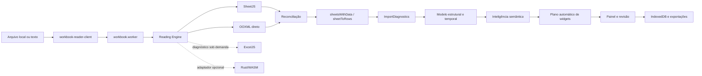

# Auditoria do estado atual — 2026-08-13

Base auditada: `main` em `4ec3ae0`, imediatamente antes da primeira correção
desta etapa. O código e os testes são a fonte de verdade; este documento registra
o mapa, as lacunas e a ordem recomendada de evolução.

## Resumo executivo

O projeto já possui uma arquitetura de leitura em camadas: SheetJS como leitor
principal, inspeção OOXML direta, ExcelJS como verificador sob demanda e um
contrato opcional para Rust/WASM. A importação preserva uma grade de origem
limitada para revisão, representações especiais de células, fórmulas, períodos,
comentários, regiões e diagnósticos. A geração automática de widgets ocorre
depois da importação e da classificação semântica.

As três maiores lacunas são: o inventário OOXML ainda não cobre vários recursos
estruturais, a pontuação de fidelidade não diferencia tudo que foi validado do
que não é suportado, e o parsing OOXML ainda descompacta e percorre XML inteiro
em memória. Antes desta etapa, a reconciliação também ignorava silenciosamente
uma aba inteira ausente no leitor principal. A primeira implementação corrige
essa perda.

## 1. Mapa da arquitetura atual

| Camada               | Componentes principais                                                    | Responsabilidade atual                                                   |
| -------------------- | ------------------------------------------------------------------------- | ------------------------------------------------------------------------ |
| Entrada              | `workbook-reader-client.ts`, `workbook.worker.ts`                         | valida tamanho, transfere bytes e publica progresso                      |
| Segurança            | `workbook-reader.ts`                                                      | limites de ZIP, abas, células e formatos de texto                        |
| Leitores             | `workbook-reader.ts`, `ooxml-reader.ts`, `workbook-verifier.ts`           | SheetJS, OOXML direto e verificação ExcelJS                              |
| Motor                | `workbook-reading-engine.ts`                                              | tempos, leitor usado, fallback e ponto de extensão WASM                  |
| Importação           | `import.ts`                                                               | cabeçalhos, mesclagens, linhas ocultas, blocos e formatos especializados |
| Diagnóstico          | `import-intelligence.ts`, `quality-audit.ts`                              | fórmulas, tipos, regiões, notas, qualidade e confiança                   |
| Modelo intermediário | `spreadsheet-intelligence.ts`, `structural-model.ts`, `temporal-model.ts` | células canônicas, papéis semânticos, regiões e períodos                 |
| Visualização         | `auto-dashboard.ts`, `widgets.ts`, `operational-widgets.ts`               | recomendações explicáveis e widgets por estrutura                        |
| Orquestração         | `routes/index.tsx`                                                        | revisão, painel, filtros, configurações e exportações                    |
| Persistência         | `storage.ts`, `encrypted-backup.ts`                                       | IndexedDB local e backup criptografado                                   |

O grafo estrutural existente confirma os maiores pontos de acoplamento:
`types.ts`, `routes/index.tsx`, `import-intelligence.ts`,
`spreadsheet-intelligence.ts`, `import-workbench.ts`, `data-pipeline.ts`,
`widgets.ts`, `import.ts` e `auto-dashboard.ts`.

## 2. Lacunas de fidelidade

| Prioridade                             | Lacuna                                                                      | Evidência                                                                                                                                       | Impacto                                                                                           |
| -------------------------------------- | --------------------------------------------------------------------------- | ----------------------------------------------------------------------------------------------------------------------------------------------- | ------------------------------------------------------------------------------------------------- |
| P0, corrigida nesta etapa              | Aba ausente era ignorada pela reconciliação                                 | `compareAndRepairWithOoxml` seguia para a próxima aba quando `primary.Sheets[name]` não existia                                                 | perda silenciosa de aba e pontuação enganosa                                                      |
| P0, corrigida na seção 22              | Pontuação mede principalmente divergências celulares com severidade `error` | `fidelity-meter.ts` deduplica erros por endereço; avisos e recursos não suportados não entravam no denominador nem em lugar nenhum do relatório | “100%” podia significar apenas valores comparáveis sem erro                                       |
| P0                                     | Inspeção OOXML usa `unzipSync` e regex sobre XML completo                   | `ooxml-reader.ts` e `workbook-metadata.ts` descompactam o pacote separadamente                                                                  | memória duplicada e risco em arquivos grandes                                                     |
| P1, sistema 1904 corrigido na seção 25 | Leitor OOXML não preserva colunas ocultas nem estado de abas                | `readSheet` lê linhas ocultas e formatos, mas não `cols` nem `sheet state`; `workbookPr date1904` já é lido e propagado                         | visibilidade ainda pode divergir no fallback; datas já respeitam o sistema 1904                   |
| P1                                     | Estilo preservado é principalmente formato numérico/texto exibido           | `ReaderCell` não carrega preenchimento, fonte, borda ou proteção                                                                                | cores com significado não entram na reconciliação                                                 |
| P1                                     | Limites de diagnósticos truncam sem contabilizar excedente                  | divergências: 2.000; representações/notas: 500; períodos: 2.000                                                                                 | auditoria pode parecer completa quando foi limitada                                               |
| P1                                     | ExcelJS não participa do fluxo normal de cada importação                    | é usado por `fidelity-meter.ts` e testes, não pelo worker de leitura                                                                            | terceira opinião existe apenas sob demanda                                                        |
| P2                                     | Recursos OOXML apenas detectados ou ainda não inventariados                 | tabelas e pivôs são diagnosticados; imagens, gráficos nativos, validações, nomes definidos, links externos e desenhos não têm modelo completo   | o valor visível pode sobreviver, mas o recurso não é explicável                                   |
| P2                                     | Fórmulas entre abas e funções fora da lista dependem do cache               | `formula.ts` recusa referências externas/entre abas não suportadas                                                                              | resultado sem cache fica indisponível, corretamente sem invenção                                  |
| P2                                     | Abas vazias são removidas da lista analítica                                | `sheetsWithData` retorna somente opções com linhas                                                                                              | útil para painel, mas exige inventário separado para afirmar que todas as abas foram reconhecidas |

“Não suportado” deve virar um estado explícito na auditoria; não deve reduzir
automaticamente a nota como “incorreto”, nem ser contado como “validado”.

## 3. Inventário de formatos e recursos

### Formatos aceitos

- Excel/OOXML: XLSX, XLSM, XLSB, XLS, XLTX e XLTM.
- OpenDocument: ODS e FODS.
- Texto: CSV, TSV e TXT, com detecção de delimitador e codificação.
- Outros leitores SheetJS: XML, HTML/HTM e Numbers.

### Recursos preservados ou diagnosticados

- abas e células com valor bruto, texto exibido e formato numérico;
- fórmulas e valores armazenados, com recálculo local limitado e seguro;
- datas e períodos, incluindo meses nomeados e cabeçalhos temporais;
- células mescladas e cabeçalhos hierárquicos;
- linhas ocultas excluídas de registros/widgets, mas preservadas na origem;
- colunas ocultas detectadas em diagnóstico;
- comentários e blocos textuais de observação;
- filtros, tabelas estruturadas, colunas calculadas e tabelas dinâmicas em diagnóstico;
- regiões independentes, blocos repetidos, formulários, matrizes e cronogramas;
- origem por aba/endereço nas células canônicas e nas exceções;
- limites de ZIP, dimensões, número de abas e células.

### Parcial ou não suportado de forma completa

Reauditado em 2026-08-15 (seção 50) — verificado por código, não por
memória do documento; a lista abaixo reflete o estado real de hoje:

- fills, fontes, bordas e cores semânticas na reconciliação — sem mudança;
- imagens, desenhos, objetos e gráficos nativos — sem mudança, zero inventário;
- validações de dados, agrupamentos/outlines e segmentações (slicers) — sem mudança;
- **hyperlinks: parcialmente evoluído.** Parsing estruturado existe
  (`parseHyperlinks`, `workbook-metadata.ts:117-143`, endereço + destino +
  tooltip), mas só alimenta `cell.l` do SheetJS célula a célula — não vira
  inventário consultável em lugar nenhum (nenhuma UI, relatório ou
  diagnóstico lista os hyperlinks do arquivo);
- nomes definidos e links externos: zero leitura, sem mudança;
- macros VBA: nunca executadas e ainda sem inventário detalhado — sem mudança;
- recálculo integral de fórmulas do Excel: escopo cresceu marginalmente
  (`SUMIF`/`COUNTIF` além do aritmético/lógico/`SUM`/`AVERAGE`/`COUNT`/
  `MIN`/`MAX`), mas continua sem referência entre abas, sem lookup
  (`VLOOKUP`/`XLOOKUP`/`INDEX`/`MATCH`) e sem motor completo;
- arquivos XLS/Numbers/ODS parcialmente corrompidos sem leitor alternativo — sem mudança;
- auditoria de abas vazias/ocultas separada das opções analíticas — sem
  mudança; `buildSheetConfidenceMatrix` (seção 28) não resolve isso, porque
  opera só sobre abas já filtradas por `sheetsWithData` (que continua
  excluindo abas sem dado por definição); não existe leitura de
  visibilidade de aba (`Hidden`/`SheetVisibility`) em nenhum lugar.

## 4. Matriz de cobertura dos leitores

Legenda: **P** principal, **V** verificação/reconciliação, **D** diagnóstico sob
demanda/teste, **C** contrato sem implementação e **—** sem cobertura.

| Formato      | SheetJS | OOXML direto |   ExcelJS | Rust/WASM |
| ------------ | ------: | -----------: | --------: | --------: |
| XLSX         |       P |            V |         D |         C |
| XLSM         |       P |            V | D parcial |         C |
| XLTX/XLTM    |       P |            V | D parcial |         C |
| XLS/XLSB     |       P |            — |         — |         — |
| ODS          |       P |            — |         — |         D |
| FODS         |       P |            — |         — |         — |
| CSV/TSV/TXT  |       P |            — |         — |         — |
| XML/HTML/HTM |       P |            — |         — |         — |
| Numbers      |       P |            — |         — |         — |

| Recurso                | SheetJS |            OOXML direto |   ExcelJS | Resultado atual                 |
| ---------------------- | ------: | ----------------------: | --------: | ------------------------------- |
| valor e tipo           |       P |                       V |         D | reconciliado por endereço       |
| fórmula/cache          |       P |                       V | D parcial | preservado; recálculo limitado  |
| texto formatado/numFmt |       P |                       V |         D | comparável                      |
| mesclagens             |       P |                 parcial |         D | importador reconstrói estrutura |
| linhas ocultas         |       P |                       V |         D | removidas da saída analítica    |
| colunas ocultas        |       P |                       — |         D | apenas diagnosticadas           |
| comentários            |       P |                       — |         D | preservados via SheetJS         |
| tabelas/pivôs          | parcial | inventário complementar |   parcial | diagnóstico, sem recálculo      |
| estilos visuais        | parcial |                  numFmt |   parcial | sem reconciliação completa      |
| desenhos/gráficos      | parcial |                       — |   parcial | sem modelo intermediário        |

## 5. Riscos de regressão

1. `routes/index.tsx` concentra 41 relações e grande parte do estado visual;
   mudanças de widget podem afetar importação, filtros e persistência.
2. `import.ts` contém muitas heurísticas especializadas; uma regra genérica de
   cabeçalho ou região pode quebrar cronogramas e formulários já cobertos.
3. Mesclagens e preenchimento de valores exigem distinguir rótulo estrutural de
   observação; replicar texto longo cria dados falsos.
4. Linhas/colunas ocultas não podem alimentar widgets sem decisão explícita;
   a regressão `4s` prova o risco.
5. Datas dependem de valor, formato, texto exibido e fuso; usar apenas serial
   volta a criar anos ou dias errados.
6. A promoção do WASM sem corpus de paridade pode trocar um fallback estável por
   um leitor mais rápido, porém menos fiel.
7. Limites de amostragem para UI não podem ser reutilizados pela auditoria.
8. A separação automática de regiões pode dividir uma tabela com espaçadores ou
   misturar blocos se a confiança não for respeitada.

## 6. Gargalos de desempenho

- O parsing principal já roda em worker, mas SheetJS, `inspectOoxml` e
  `attachWorkbookFeatures` podem descompactar/percorrer o mesmo arquivo em fases
  distintas.
- `unzipSync` mantém o pacote expandido inteiro em memória; XML streaming ainda
  não existe.
- `sheetMeta` percorre toda a dimensão declarada, inclusive células vazias, para
  contar fórmulas e montar diagnósticos. Dimensões infladas custam CPU mesmo sob
  o limite global.
- O armazenamento de representações, notas e períodos tem limites, mas o laço
  continua percorrendo a dimensão completa.
- `routes/index.tsx` continua sendo o maior chunk e o maior ponto de renderização.
- Baseline medido: `workbook.worker` 442,86 kB; maior chunk inicial 302,03 kB;
  XLSX tardio 492,63 kB; Leaflet tardio 813,55 kB.
- O orçamento de produção passa, mas o build alerta para módulos acima de 500 kB
  no servidor; esses módulos devem permanecer fora do caminho inicial.

Métricas que ainda precisam ser registradas por importação: ~~bytes compactados
e expandidos~~, ~~tempo por leitor~~ — registrados desde a seção 37 —, células
realmente visitadas, pico estimado de memória, tempo de reconciliação,
truncamentos de diagnóstico e cancelamento (cancelamento por `AbortError` é
deliberadamente excluído do registro de falhas, ver seção 37).

## 7. Plano incremental para o núcleo Rust

1. Congelar um contrato JSON versionado para inventário de workbook, abas,
   dimensões, visibilidade e limites de recursos.
2. Criar crate isolado, sem integrar a UI, usando ZIP com limites e XML pull/stream.
3. Entregar primeiro apenas inventário OOXML: partes, abas, relações, estado,
   sistema de datas e dimensões declaradas/reais.
4. Adicionar shared strings, células, fórmulas/cache, numFmt, mesclagens e regiões
   ocultas, mantendo valores bruto e exibido separados.
5. Compilar para WASM e implementar o contrato já aceito por
   `registeredWasmWorkbookReader`.
6. Executar Rust e TypeScript lado a lado; nunca promover o resultado Rust antes
   da paridade por formato e fixture.
7. Acrescentar comentários, hyperlinks, tabelas, pivôs, desenhos e nomes
   definidos como inventário, sem executar conteúdo.
8. Medir tempo, memória e tamanho WASM; promover por formato com fallback.

Bibliotecas devem ser escolhidas por cobertura e manutenção, não por
popularidade. Critérios mínimos: ZIP com limites, XML streaming sem entidades,
Serde, WASM estável, datas 1900/1904, fórmulas/cache, estilos e relações OOXML.

## 8. Plano de testes de paridade

1. Definir manifesto JSON por fixture com hash, abas, estados, dimensões reais,
   células críticas, fórmulas, mesclagens, ocultos, notas e recursos conhecidos.
2. Rodar SheetJS, OOXML TypeScript, ExcelJS e Rust sobre os mesmos bytes.
3. Comparar existência, tipo, bruto, cache, display, fórmula, numFmt, visibilidade,
   comentário e hyperlink por endereço.
4. Classificar cada diferença como incorreta, representação equivalente,
   não suportada ou não validável.
5. Exigir zero perda silenciosa e registrar todo truncamento.
6. Manter fixtures sintéticas pequenas para cada recurso e fixtures reais apenas
   locais/sanitizadas, sempre com `skipIf` seguro.
7. Cobrir arquivos pequeno, largo, profundo, muitas abas, estilos vazios,
   mesclagens, fórmulas, corrompido e ZIP bomb simulada segura.
8. Coletar tempo e memória por leitor; falha de desempenho não deve alterar a
   decisão de fidelidade.

Gate de promoção Rust: todos os manifests críticos iguais ou com divergências
explicitamente aceitas, sem regressão de segurança, e ganho medido no corpus de
arquivos grandes.

## 9. Três melhorias de maior impacto

1. **Relatório de fidelidade explicável:** separar validado, divergente,
   reparado, não suportado e truncado por aba/bloco/célula.
2. **Inventário OOXML seguro e único:** uma descompactação limitada, XML
   streaming e cobertura de visibilidade, datas 1904, relações e recursos.
3. **Núcleo Rust em shadow mode:** inventário e células lado a lado com o motor
   atual, promovidos apenas após paridade.

## 10. Primeira implementação mensurável

A reconciliação agora recupera uma aba inteira encontrada pelo OOXML e ausente
no SheetJS. A aba é anexada ao workbook principal e cada célula recuperada gera
uma `ReaderDivergence` com aba, endereço, valor independente, severidade `error`
e `repaired: true`.

Prova sintética adicionada em `workbook-fidelity.test.ts`:

- começa com workbook principal sem abas;
- reconcilia contra a fixture pública OOXML;
- confirma a restauração de `Cabeçalho deslocado`;
- confirma o valor `Data` em `A4`;
- confirma diagnóstico rastreável e reparado para `A4`.

Resultado mensurável: o cenário passou de **zero abas e zero divergências
registradas** para **aba restaurada e uma divergência reparada por célula de
origem**. O limite global de 2.000 divergências continua sendo uma lacuna a ser
tratada no relatório de fidelidade.

## Baseline de validação

Antes da mudança, no ambiente Windows isolado:

- TypeScript: aprovado;
- build de produção: aprovado após evitar o mapeamento de unidade de rede do
  Vite, uma limitação do sandbox;
- testes: 45 arquivos, 42 aprovados e 3 ignorados com segurança; 388 testes
  aprovados e 11 ignorados;
- lint: 10 diferenças de formatação preexistentes em 5 arquivos, a normalizar
  antes da publicação desta etapa.

O briefing citava 404 testes. O checkout atual em `4ec3ae0` possui 399 testes
contabilizados antes desta implementação; a nova regressão eleva o inventário
para 400. A diferença deve ser tratada como mudança de inventário, não como
evidência automática de perda de cobertura.

Após a implementação e a normalização estritamente mecânica dos cinco arquivos:

- testes: 45 arquivos, 42 aprovados e 3 ignorados; 389 testes aprovados e 11
  ignorados, total de 400;
- TypeScript: aprovado;
- ESLint/Prettier: aprovado com adaptação de fim de linha do checkout Windows;
- build de produção: aprovado;
- orçamento de desempenho: aprovado;
- dependências de produção: zero vulnerabilidades no `npm audit --omit=dev`;
- dependências de desenvolvimento: duas vulnerabilidades moderadas herdadas de
  `exceljs -> uuid`, sem correção disponível no inventário atual.

## 11. Núcleo Rust de inventário OOXML — fase 1

O primeiro recorte do plano incremental foi implementado no crate isolado
`rust/oli-ooxml-core`, ainda fora do leitor produtivo e do adaptador WASM. O
contrato JSON `1.0.0` está congelado em
`contracts/ooxml-inventory.schema.json`.

Cobertura entregue:

- validação prévia de quantidade de entradas, tamanho individual e agregado,
  razão de compactação, criptografia e caminhos inseguros/duplicados no ZIP;
- leitura XML orientada a eventos, limitada também por número de eventos;
- ordem, nome, identificador, relação, caminho e estado
  `visible`/`hidden`/`veryHidden` das abas;
- sistema de datas 1900/1904;
- dimensão declarada e dimensão real calculada pelas referências de células;
- métricas do pacote, limites aplicados e diagnósticos estruturados;
- CLI JSON para inspeção local e workflow dedicado no GitHub.

Os testes incluem fixture sintética com abas ocultas e data 1904, caminho ZIP
inseguro, limite de recurso reduzido e paridade de inventário com
`test-fixtures/problematic-import.xlsx`. A fase seguinte de shared strings,
células, fórmulas/cache e formatos é registrada abaixo; o crate ainda não foi
compilado para WASM nem executado lado a lado com o leitor atual.

## 12. Núcleo Rust de células OOXML — fase 2

O crate `oli-ooxml-core` passou a emitir o contrato JSON `2.0.0`. A mudança de
versão é intencional porque cada aba agora inclui o inventário de células, além
dos metadados da fase 1.

Cobertura acrescentada:

- shared strings simples e rich text, preservando a concatenação dos trechos;
- strings inline, strings armazenadas, números, booleanos, erros e datas ISO;
- fórmula separada do valor em cache, mantendo `rawValue` e `displayValue`;
- índice de estilo, formatos numéricos nativos conhecidos e formatos customizados;
- exibição conservadora para inteiros, decimais e percentuais, sem inventar a
  renderização de formatos Excel ainda não implementados;
- limites de 2 milhões de células, 2 milhões de shared strings e 256 MiB de
  texto por parte XML, além dos limites de ZIP e eventos já existentes;
- rejeição de entidades XML não predefinidas, mantendo DOCTYPE proibido.

A paridade da fixture pública agora verifica também as 34 células da primeira
aba, o cabeçalho `A4`, a fórmula `G5` e seu cache numérico. A fixture sintética
cobre rich text, entidade XML, booleano, percentual, formato customizado, erro
e data. O crate permanece fora do caminho produtivo; a cobertura de
datas/formatos, mesclagens e regiões ocultas foi concluída abaixo antes do
adaptador WASM em shadow mode.

## 13. Núcleo Rust de fidelidade estrutural OOXML — fase 3

O contrato JSON passa para `3.0.0`, pois cada aba agora exige também os campos
`mergedRanges`, `hiddenRows` e `hiddenColumns`. O crate passa da versão `0.2.0`
para `0.3.0` e continua isolado do caminho produtivo.

Cobertura acrescentada:

- conversão de datas seriais nos sistemas Excel 1900 e 1904, preservando o
  valor numérico bruto e emitindo `dateValue` local normalizado;
- tratamento explícito do dia fictício 29/02/1900: a exibição compatível é
  preservada, o valor ISO inválido não é emitido e um diagnóstico é registrado;
- reconhecimento conservador de formatos de data/hora, formatos nativos 14–22
  e 45–47, duração `[h]:mm:ss` e formatos customizados comuns;
- inventário validado de mesclagens, linhas ocultas e intervalos compactos de
  colunas ocultas, sem expandir intervalos potencialmente grandes;
- limite configurável de 500 mil registros estruturais por aba, somado aos
  limites de células, texto, eventos XML e pacote ZIP;
- regressões sintéticas para data 1904, duração, formato customizado, mesclagem,
  estruturas ocultas e limite reduzido, além da paridade estrutural da fixture
  pública.

A etapa de compilação e shadow mode foi concluída abaixo.

## 14. Adaptador WASM em shadow mode — fase 4

O crate `oli-ooxml-core` passa à versão `0.4.0` e gera um módulo WebAssembly
para navegador. O contrato de inventário permanece `3.0.0`; não houve mudança
incompatível na saída JSON.

Integração entregue:

- exportação `inventory_ooxml_json` restrita ao alvo `wasm32`, mantendo a API
  Rust nativa e a CLI existentes;
- pacote web gerado por `wasm-pack --target web`, versionado em `src/wasm` para
  que o deploy da Vercel não dependa de uma toolchain Rust;
- registro automático dentro do worker de leitura para XLSX, XLSM, XLTX e XLTM;
- execução somente depois que SheetJS e o verificador OOXML TypeScript já
  produziram o resultado validado;
- comparação de nomes de abas e, por endereço, valor bruto, texto exibido e
  fórmula, com tolerância numérica mínima;
- relatório separado de disponibilidade, estado (`matched`, `diverged`,
  `failed` ou `unavailable`), tempo, células comparadas, células/abas divergentes
  e versão do contrato;
- falha, contrato inválido ou divergência no WASM nunca altera linhas, reparos,
  diagnósticos produtivos nem impede a importação;
- smoke test do binário real contra `problematic-import.xlsx`, além de testes de
  paridade simulada e de falha não bloqueante;
- CI ampliada com compilação para `wasm32-unknown-unknown` e execução do smoke
  test sobre o artefato versionado.

O próximo passo seguro é coletar a distribuição das divergências no corpus de
produção e definir critérios objetivos de promoção por formato antes de permitir
que o Rust participe do resultado produtivo.

## 21. Inventário ODS complementar — fase 11

O crate `oli-ooxml-core` ganhou um segundo leitor, isolado do fluxo XLSX, para
OpenDocument Spreadsheet (ODS), o formato universal ISO/IEC 26300 que hoje só
tinha cobertura via SheetJS no caminho TypeScript (linha "ODS" da matriz de
formatos, coluna Rust/WASM: de contrato sem implementação para diagnóstico
testado). O contrato JSON continua `3.0.0`; o campo `format` passa a aceitar
`"ooxml"` ou `"ods"`, mantendo o restante do formato do inventário.

Cobertura entregue pelo módulo `src/ods.rs`:

- reaproveita a validação de pacote ZIP, os limites de recursos e o modelo de
  inventário (abas, dimensões, mesclagens, ocultos, células) já usados pelo
  núcleo OOXML, sem duplicar a lógica de segurança;
- abas, células tipadas (texto, número, booleano, data/hora, percentual,
  moeda), fórmulas (`table:formula`, normalizadas para o mesmo prefixo `=`
  usado no XLSX) e mesclagens por `number-columns/rows-spanned`;
- colunas e linhas ocultas via `table:visibility="collapse"/"filter"`;
- datas ODF já vêm como texto ISO em `office:date-value`; quando o arquivo
  grava só a data, o horário é normalizado para meia-noite para manter o
  mesmo formato `dateValue` do contrato compartilhado.

Células e linhas repetidas (`table:number-columns-repeated`,
`table:number-rows-repeated`, usadas pelo ODF sobretudo para preencher
espaço vazio à direita/abaixo, com contadores que podem chegar a centenas
de milhares) são representadas de forma **compacta e sem perda**: cada
bloco retangular de células idênticas vira um único registro de célula com
os novos campos `repeatColumns`/`repeatRows` (contrato JSON, ambos
opcionais, omitidos quando o valor é 1). `actualDimension` e a contagem de
células da aba refletem a extensão lógica real do bloco, não apenas a
âncora — corrigindo uma limitação da primeira versão deste leitor, em que
somente a primeira ocorrência era materializada e a dimensão/contagem
podiam parecer menores que a estrutura declarada. O custo de processar um
bloco repetido continua O(1) por elemento do XML (nenhum laço proporcional
ao contador de repetição), e o limite de células do pacote passa a ser
aplicado sobre a extensão lógica total, não sobre o número de registros
JSON.

Testes em `tests/ods_inventory.rs` cobrem tipos de célula e dimensão real,
fórmula e mesclagem preservadas com linha/coluna oculta, e a representação
compacta de blocos repetidos (incluindo um caso de 1.000.000 de linhas
repetidas vazias), confirmando `repeatColumns`/`repeatRows`, a dimensão
real completa e a contagem de células lógica — sem materializar nem
descartar nenhuma célula.

O leitor ODS ainda não está integrado ao `workbook.worker` nem ao adaptador
WASM em shadow mode; é uma capacidade isolada do crate, seguindo a mesma
progressão incremental usada para o XLSX (fases 1 a 10 acima) antes de
qualquer integração no caminho produtivo. Os próximos passos seguros são:
compilar para `wasm32-unknown-unknown`, expor `inventory_ods_json` ao
worker como leitor adicional (não substituto do SheetJS) e só então avaliar
paridade contra um corpus real de arquivos ODS sanitizados.

## 22. "Não suportado" como estado explícito na pontuação de fidelidade

Corrige a lacuna P0 registrada na seção 2: `fidelity-meter.ts` deduplicava
apenas divergências de severidade `error` num único mapa e descartava
qualquer coisa de severidade `warning` sem registrar em lugar nenhum do
relatório. Um score de 100% podia então significar tanto "tudo comparado e
igual" quanto "vários avisos silenciados". Não havia, além disso, nenhum
jeito de o relatório dizer que fills, imagens, validações de dados, nomes
definidos/hyperlinks, macros VBA e recálculo integral de fórmulas nunca são
comparados célula a célula por nenhum leitor — esses recursos eram
invisíveis ao medidor de fidelidade, nem contados como validados nem como
divergentes.

`WorkbookFidelityReport` ganhou dois campos, sem alterar a fórmula da
pontuação nem o campo `divergences` existente (que continua sendo apenas
erros, preservando os testes de meta mínima de 99%):

- `warnings`: as divergências de severidade `warning`, deduplicadas por
  endereço como antes, agora visíveis em vez de descartadas;
- `unsupportedFeatures`: lista estática e explícita dos recursos da seção 3
  que nenhum leitor reconcilia hoje. Por decisão de projeto, "não suportado"
  não soma nem subtrai da pontuação — é um estado próprio, nem "validado"
  nem "incorreto", como já estava registrado como princípio neste documento
  mas ainda não implementado.

Teste adicionado em `workbook-fidelity.test.ts` confirma que `warnings` só
contém severidade `warning`, que `divergences` só contém severidade `error`
e que `unsupportedFeatures` inclui "Macros VBA". Nenhum consumidor de
produção usa `fidelity-meter.ts` hoje (só os dois arquivos de teste), então
a mudança de forma do retorno não tem risco de regressão na UI.

## 15. Medição de corpus e gate de promoção — fase 5

O shadow mode agora possui amostragem determinística configurável por
`VITE_WASM_SHADOW_SAMPLE_RATE`. Arquivos fora da amostra são identificados como
`sampled-out`; o Rust continua sem alterar o resultado produtivo em qualquer
estado.

O binário WASM real passou a integrar um teste de corpus no Vitest e na CI. A
medição registra contrato, tempo, células comparadas, células divergentes e abas
divergentes. O avaliador agrega essas observações, calcula taxa de divergência e
latência p95 e informa todos os motivos que impedem a promoção.

Os critérios padrão exigem contrato `3.0.0`, no mínimo 25 arquivos e 10.000
células, zero falhas e divergências e p95 de até 1.500 ms. A fixture pública
isolada é deliberadamente classificada como corpus insuficiente. Os critérios e
o processo de decisão estão documentados em `docs/WASM_PROMOTION_CRITERIA.md`.

## 16. Corpus reproduzível e paridade estrutural — fase 6

O corpus WASM agora é gerado de forma determinística a partir de um manifesto
versionado. São 25 arquivos XLSX e 13.200 células cobrindo strings, números,
booleanos, fórmulas, datas nos sistemas 1900/1904, mesclagens e regiões ocultas.
Os binários gerados não são versionados; a CI os recria e publica o relatório de
medição como artefato.

O inspetor OOXML TypeScript passou a preservar mesclagens, linhas ocultas e
colunas ocultas também no workbook de fallback. O shadow mode confronta essas
estruturas com o inventário Rust e reporta quantidades comparadas e divergentes.

Na medição de referência, os 25 arquivos, 13.200 células e 24 estruturas tiveram
paridade total, sem falhas ou divergências e com p95 abaixo do limite. O gate
permanece corretamente bloqueado: corpus sintético comprova cobertura, mas a
promoção exige pelo menos cinco arquivos reais sanitizados por formato.

## 17. Sanitização local do corpus real — fase 7

Foi adicionado um fluxo local e determinístico para transformar planilhas XLSX
reais em fixtures adequadas à medição de paridade sem versionar originais ou
cópias. Textos, números, datas, nomes de abas e literais de fórmula são
pseudonimizados; metadados, links, comentários, nomes definidos, macros e
referências externas são removidos ou neutralizados.

O sanitizador preserva os tipos das células, fórmulas internas, formatos,
mesclagens e regiões ocultas. Ele aceita somente XLSX, exige chave local via
ambiente, não altera a origem e recusa destinos não vazios. O manifesto gerado
não contém nomes ou caminhos de origem nem a chave. Quando presente em
`test-fixtures/sanitized-real`, o corpus local passa a integrar automaticamente
o relatório e o gate por formato; a CI continua usando apenas as fixtures
sintéticas reproduzíveis.

## 18. Candidate mode com fallback automático — fase 8

Foi preparado o controle de ativação gradual do Rust/WASM para XLSX. O padrão
continua sendo `shadow`, e a allowlist de formatos nasce vazia. Apenas a
combinação explícita de `VITE_WASM_READER_MODE=candidate` com
`VITE_WASM_CANDIDATE_FORMATS=xlsx` permite que um match integral seja marcado
como `sheetjs-wasm-verified`.

Candidate mode mede 100% dos arquivos do formato liberado, independentemente da
taxa de shadow. Contrato incompatível, divergência, falha do adaptador ou
indisponibilidade acionam fallback automático para o leitor TypeScript validado.
O relatório registra modo, estado do candidato e motivo do fallback. O inventário
Rust ainda não cria, substitui ou repara células; publicar a allowlist continua
condicionado ao gate real sanitizado e a uma decisão humana por formato.

## 19. XLSX Rust/WASM primário com fallback validado — fase 9

O modo candidato e a allowlist `xlsx` passaram a ser os padrões. O inventário
Rust agora é materializado como workbook e percorre o pipeline real de
importação. Sua saída só é usada quando células, estruturas e o resultado final
são idênticos ao caminho TypeScript, sendo identificada como `rust-wasm`.

Filtros, tabelas, comentários e links já validados são preservados na
materialização. `VITE_WASM_READER_MODE=shadow` continua disponível como rollback
imediato. O corpus real sanitizado ainda é necessário antes de remover a
validação dupla e obter ganho efetivo de desempenho.

## 20. Metadados OOXML independentes no candidato Rust — fase 10

O workbook materializado pelo inventário Rust deixou de copiar metadados do
workbook SheetJS. Filtros automáticos, tabelas estruturadas, Pivot Tables,
comentários clássicos e hyperlinks internos ou externos agora são reconstruídos
diretamente das partes e relacionamentos do pacote XLSX.

O leitor TypeScript continua executando como oráculo de paridade e fallback: a
saída Rust somente é publicada quando o resultado final permanece idêntico. Isso
remove um acoplamento da materialização sem antecipar a promoção independente,
que ainda depende de cinco arquivos XLSX reais sanitizados e do gate completo.

## 23. Duas falhas reais encontradas com planilhas de produção

Seis arquivos XLSX reais fornecidos pelo usuário (fora do repositório, nunca
versionados) foram medidos com `measureWorkbookFidelity`. Três continham
apenas texto/números e já fechavam em 100% com zero divergências. Os outros
três — todos contendo imagens/logotipos — expuseram duas falhas que nenhum
teste sintético havia coberto:

1. **`verifyWorkbookWithExcelJs` derrubava a medição inteira.** ExcelJS tem
   bugs conhecidos ao carregar certos desenhos/âncoras de imagem em XLSX real
   (`Cannot read properties of undefined (reading 'name')` e `(reading
'anchors')`, lançados de dentro de `workbook.xlsx.load`). Como
   `measureWorkbookFidelity` não capturava essa exceção, o relatório inteiro
   quebrava — nenhuma pontuação, nenhum diagnóstico, só um erro não tratado.
   Corrigido isolando a chamada em `try/catch`: uma falha de leitor agora vira
   `failedReaders: ["ExcelJS"]`, um estado explícito e visível, em vez de
   "0 divergências" silencioso ou um crash. Como nenhum código de produção usa
   `ExcelJS` no caminho de importação (só `fidelity-meter.ts` e testes), não
   havia risco de regressão na UI, mas a medição em si ficava inutilizável
   para esses arquivos.
2. **`ooxml-reader.ts` não decodificava referências numéricas de caractere.**
   A função `xmlText` só tratava as cinco entidades nomeadas do XML (`&lt;`,
   `&gt;`, `&quot;`, `&apos;`, `&amp;`). Referências numéricas válidas
   (`&#199;`, `&#xC7;`) — usadas por algumas ferramentas de exportação para
   acentos — passavam intactas, produzindo texto corrompido como
   `SOLICITA&#199;&#213;ES` em vez de `SOLICITAÇÕES`. Isso gerava até 850
   avisos por arquivo real. Corrigido com decodificação hex/decimal antes do
   `&amp;` final, preservando o caso em que `&amp;#38;` é texto escapado de
   propósito (não deve virar `&`).

Testes de regressão: `workbook-fidelity.test.ts` cobre a decodificação
numérica com um pacote OOXML sintético mínimo; `fidelity-meter-resilience.test.ts`
mocka `verifyWorkbookWithExcelJs` para lançar e confirma que a medição
continua, reportando `failedReaders` em vez de propagar a exceção.

Depois das duas correções, os seis arquivos reais fecham em 100%, zero
divergências de erro. As diferenças de `\n` vs `\r\n` entre leitores
continuam aparecendo como `warning` — representação equivalente, não erro,
consistente com a regra já registrada neste documento.

## 24. Representação compacta de repetições e sistema de datas do ODS

Revisão da fase 11 (seção 21) apontou dois problemas antes de o leitor ODS
poder integrar o shadow mode:

1. **Perda de fidelidade em células/linhas repetidas.** A primeira versão
   materializava só a primeira ocorrência de um bloco repetido e descartava
   o resto com um diagnóstico de "truncagem". Isso fazia a dimensão real e
   a contagem de células parecerem menores que a estrutura declarada — o
   próprio problema que a seção 23 corrige para outro leitor, agora
   corrigido aqui na origem. `CellInventory` ganhou os campos opcionais
   `repeatColumns`/`repeatRows` (contrato compartilhado com o XLSX, que
   nunca os emite): um único registro representa um bloco retangular de
   células idênticas de forma compacta e sem perda, com `address` no canto
   superior esquerdo. `actualDimension` e a contagem de células da aba
   passaram a somar a extensão lógica real do bloco, não apenas a âncora.
   O custo de processar um bloco continua O(1) por elemento do XML — não é
   um laço de materialização, é aritmética sobre o tamanho declarado — e o
   limite de células do pacote agora é aplicado sobre essa extensão lógica.
   Os diagnósticos `ods-repeated-cell-truncated`/`ods-repeated-row-truncated`
   foram removidos por não haver mais truncagem para relatar.
2. **`dateSystem` afirmava "1900" para um formato que não usa esse
   conceito.** ODF grava data/hora como texto ISO 8601 direto; não há
   série numérica 1900/1904 a resolver. `DateSystem` ganhou a variante
   `NotApplicable` (JSON `"notApplicable"`), e o leitor ODS a emite em vez
   de um `Excel1900` que nunca é interpretado. `parse_excel_serial` trata
   essa variante devolvendo "sem data" em vez de assumir uma convenção
   Excel — ela nunca é chamada para ODS hoje, mas o comportamento fica
   seguro mesmo que isso mude.

`tests/ods_inventory.rs` foi atualizado: o teste de repetição agora chama-se
`represents_repeated_cells_and_rows_compactly_without_loss` e confirma
`repeatColumns`/`repeatRows`, a dimensão real completa e a contagem lógica
de células para um bloco de 5.000 colunas repetidas e uma linha repetida
10.000 vezes, sem descartar nada.

O leitor continua isolado do `workbook.worker`. Os itens restantes da
revisão — corpus real ODS sanitizado, e manter SheetJS como resultado
produtivo até paridade comprovada — seguem como pré-condição para
qualquer integração em shadow mode, na mesma ordem recomendada.

## 25. Etapa 5 — auditoria de corpus de regressão e duas falhas reais

Antes de ampliar fixtures, uma auditoria comparou 20 cenários de leitura
universal contra a suíte existente. Bem cobertos: cabeçalho deslocado,
múltiplas tabelas empilhadas/lado a lado, mesclagens, linhas/colunas
ocultas, células de erro, delimitadores de CSV ambíguos. Parciais: filtros
sem congelamento, fórmulas cacheadas vs. recalculadas, grandes planilhas
(só o caminho de rejeição), ZIP hostil (só limites de dimensão/tamanho),
codificação de CSV, ODS/XLS além de um smoke test básico. Lacunas claras:
cabeçalho repetido inline, sistema de datas 1904 no leitor OOXML
independente, shared strings rich text, imagens/gráficos incorporados.

Escrever os testes das duas primeiras lacunas expôs bugs reais, não só
ausência de cobertura:

1. **`ooxml-reader.ts` nunca lia `workbookPr date1904`.** `serialDate`
   sempre assumia o sistema 1900 (`XLSX.SSF.parse_date_code` sem opções).
   Num arquivo de origem Mac (1904), qualquer data reconciliada por este
   leitor — usado na reparação de abas/células ausentes e como referência
   do shadow mode — saía ~4 anos errada, silenciosamente. Corrigido lendo
   `date1904` do `workbookPr` em `inspectOoxml` e propagando para
   `serialDate` e `XLSX.SSF.format` (que também precisa da opção para
   exibir a data certa). Teste em `workbook-fidelity.test.ts` confirma
   serial `1` virando `1900-01-01`/`"1/1/00"` sem a flag e
   `1904-01-02`/`"1/2/04"` com ela.
2. **Repetição literal do cabeçalho no meio dos dados virava um registro
   de dado.** Relatórios paginados/exportados costumam repetir a linha de
   cabeçalho a cada quebra de página, sem linha em branco nem título
   separando um bloco novo — por isso a detecção de blocos empilhados (que
   já lida com um caso relacionado, mas diferente) não pegava esse caso.
   `sheetToRows` agora filtra uma linha de dado que repete o cabeçalho
   original em pelo menos duas colunas (exigência deliberada para não
   descartar por engano um item de catálogo que só coincide numa coluna),
   registra a contagem em `audit.repeatedHeaderRowsIgnored` e explica no
   aviso ao usuário, em vez de silenciosamente incluir
   `{"Nome": "Nome", "Valor": "Valor"}` como se fosse um registro.

A lacuna de shared strings rich text (múltiplos `<r>` num `<si>`) já
estava implementada corretamente (`sharedStrings` concatena todo `<t>`
dentro do `<si>`, dentro ou fora de `<r>`); ganhou um teste travando o
comportamento, sem precisar de correção. Imagens/gráficos incorporados
continuam como lacuna registrada na seção 3, não abordada nesta etapa.

Três lacunas adicionais foram fechadas com testes, todas confirmando
comportamento já correto (nenhuma correção necessária):

- **BOM UTF-8 em CSV** (`decodeText` já removia o marcador U+FEFF do
  início do texto decodificado): teste confirma que o nome da primeira
  coluna sai limpo, sem o BOM grudado.
- **ZIP hostil** (`validateZipWorkbook` já recusava contagem de entradas
  acima de `MAX_ZIP_ENTRIES` e razão de compressão suspeita acima de
  `MAX_SUSPICIOUS_COMPRESSION_RATIO`): dois testes constroem um registro
  EOCD/diretório central hostil sem precisar de dados comprimidos reais
  (a checagem só lê os campos declarados no cabeçalho), confirmando a
  rejeição de "arquivos internos demais" e de uma razão ~1 milhão:1
  característica de zip bomb.
- **Planilha grande com sucesso**: só existia o teste do caminho de
  rejeição (dimensão declarada abusiva). Novo teste lê 5.000 linhas por 3
  colunas e confirma integridade da primeira e da última linha.

## 26. Etapa 6 — leitor usado e fallback agora aparecem na interface

Uma auditoria de explicabilidade mapeou 11 itens do relatório de leitura
contra o que já é calculado e contra o que chega à interface. A maioria já
estava exposta (estrutura detectada, cabeçalho escolhido e motivo,
regiões/blocos encontrados, células recuperadas, confiança por
região/coluna, ações conservadoras, sugestões de revisão) — nenhuma delas
foi tocada. Dois itens computados por toda importação nunca chegavam ao
usuário: qual leitor produziu o resultado (`WorkbookReadReport.reader`) e
se houve fallback do Rust para o TypeScript (`.fallbackUsed`). Essa
informação de confiança existia só no objeto de relatório interno.

A lógica de descrição foi extraída para `describeReaderOutcome` em
`workbook-reading-engine.ts` (função pura, sem estado), em vez de inline
no componente de rota — só assim dá para testar sem precisar simular
upload de arquivo num navegador de verdade, algo que a ferramenta de
automação deste ambiente não suporta (só dispara eventos de mudança em
`<input type="file">`, não abre o diálogo do sistema operacional). A
função só produz mensagem nos estados informativos: o caminho comum
(`sheetjs-verified`, sem reparo, sem fallback) continua silencioso, sem
poluir toda importação. `routes/index.tsx` chama essa função e junta o
resultado à mesma caixa de aviso já existente na revisão.

Não descoberto nenhum bug aqui — os dois campos já estavam corretos e
testados no motor; a lacuna era puramente de interface. Verificado com
`npx vitest run` (441 passou, 11 pulados, era 436), `npx tsc --noEmit` e
`npm run build`, mas **não foi possível verificar visualmente no
navegador**: a ferramenta de automação deste sandbox não consegue simular
o diálogo de seleção de arquivo do sistema operacional, e uma injeção via
`DataTransfer`/evento `change` sintético não foi concluída de forma
confiável. Risco considerado baixo: é concatenação de string reaproveitando
uma caixa de aviso já renderizada e testada, sobre campos já tipados e
cobertos por teste no motor de leitura — mas fica registrado como
verificação pendente, não como confirmado.

Itens da auditoria de explicabilidade da seção 26: a matriz de confiança
por aba foi implementada na seção 28, e regiões descartadas e o motivo na
seção 29.

## 27. Etapa 3 — teste de rollback dedicado e documentação do desligamento do candidato Rust

Fechava a lacuna registrada na seção 19: o modo candidato e a allowlist
`xlsx` já eram o padrão de produção, e `VITE_WASM_READER_MODE=shadow` já
existia como variável de rollback, mas não havia teste que provasse esse
comportamento isoladamente nem documentação explícita do procedimento.

Nenhum bug foi encontrado — a lógica em `readWorkbookBytesWithEngine`
(`src/lib/workbook-reader.ts`) já garantia que a materialização Rust só
ocorre dentro do bloco condicionado a `candidateEligible`, que por sua vez
exige `wasmReaderMode === "candidate"`. A lacuna era puramente de prova e
de documentação:

- **Teste** (`src/lib/workbook-reader.test.ts`): registra o mesmo adaptador
  Rust simulado, com dados que dariam paridade total, e roda o mesmo
  arquivo duas vezes — uma em modo candidato (confirma promoção a
  `reader: "rust-wasm"`) e outra alterando somente `wasmReaderMode` para
  `"shadow"` (confirma reversão para `reader: "sheetjs-verified"`,
  `wasmOutputUsed: false`, linhas importadas idênticas, e que a medição de
  paridade continua ativa via `wasmShadowStatus: "matched"`). Isso prova
  que o único parâmetro que precisa mudar é o modo, sem depender de
  desregistrar o adaptador ou reverter qualquer outro código.
- **Documentação** (`docs/WASM_PROMOTION_CRITERIA.md`, nova seção "Como
  desativar o candidato Rust (rollback)"): explicita que
  `VITE_WASM_READER_MODE` é lido via `import.meta.env`, ou seja, é
  substituído em **tempo de build** pelo Vite, não é um flag dinâmico de
  execução. Isso corrige uma imprecisão do texto anterior ("rollback
  operacional é imediato"): a mudança de variável não exige nenhuma
  alteração de código, PR ou commit novo, mas ainda exige um novo
  build/deploy (na Vercel, basta redeploy do commit atual, sem novo
  commit) para que o valor embutido no bundle publicado mude.
  `.env.example` recebeu a mesma correção de forma resumida.

Verificado com `npx vitest run src/lib/workbook-reader.test.ts` (37 testes,
todos passando) e a suíte completa (`npx vitest run`, 442 passou/11
pulados, era 441 — o novo teste soma um caso, sem alterar nenhum
pré-existente, incluindo o teste de shadow mode genérico já registrado na
seção 26).

## 28. Matriz de confiança por aba

Fechava parte da lacuna registrada ao final da seção 26: "uma matriz de
confiança por aba/sheet (hoje só há confiança global e por região/coluna)".

Como no caso do leitor/fallback da seção 26, não havia bug nem lacuna de
cálculo — `sheetsWithData` (`import.ts`) já roda `diagnoseImportedSheet`
para **toda** aba com dado no workbook, não só a aba ativa, então
`SheetOption.diagnostics.confidence` e `.confidenceReasons` já existiam
para todas as abas simultaneamente. A lacuna era puramente de agregação e
exibição: nada juntava esses valores num lugar comparável lado a lado, e a
interface só mostrava a confiança da aba selecionada no momento.

- **Função pura nova**: `buildSheetConfidenceMatrix` em
  `import-intelligence.ts`, ao lado do tipo `ImportDiagnostics` que ela
  consome. Recebe `Array<{ name; diagnostics? }>` (compatível
  estruturalmente com `SheetOption`, sem criar dependência circular com
  `import.ts`) e devolve, por aba: `confidence` (número ou `null` quando
  não há diagnóstico), `level` (`"alta"` ≥85, `"média"` ≥60, `"baixa"`
  abaixo disso, ou `"sem diagnóstico"`), os `reasons` já calculados e a
  contagem de divergências do leitor daquela aba especificamente. Não
  recalcula nada — só lê e classifica o que já existe.
- **Interface**: a barra de abas da revisão (`routes/index.tsx`, dentro de
  `Review`) ganhou um indicador colorido por aba (verde/âmbar/vermelho,
  omitido quando não há diagnóstico) com `title` explicando o percentual e
  os motivos, sem alterar a navegação entre abas nem nenhum cálculo
  existente.

Testes em `import-intelligence.test.ts` (`describe("matriz de confiança por
aba")`) cobrem: classificação alta/média/baixa a partir de diagnósticos
reais gerados por `diagnoseImportedSheet` (não valores inventados), aba sem
diagnóstico retornando `null`/`"sem diagnóstico"` sem quebrar, e contagem de
divergências do leitor isolada por aba.

Verificado com `npx vitest run` (444 passou, 11 pulados, era 442 após a
Etapa 3 da seção 27), `npx tsc --noEmit` sem erros e `npm run build`
aprovado. **Não foi possível verificar
visualmente no navegador** — mesma limitação já registrada na seção 26: a
ferramenta de automação deste sandbox não simula o diálogo de upload de
arquivo do sistema operacional, e o indicador só aparece depois de importar
um workbook com mais de uma aba. Confirmado que a página carrega sem erros
de console antes e depois da mudança; a integração em si é composição de
JSX sobre uma função pura já testada, seguindo o mesmo padrão de risco
baixo da seção 26 — mas fica registrado como verificação pendente, não como
confirmado.

## 29. Regiões independentes mantidas juntas por segurança, agora auditadas

Fechava parte da lacuna registrada ao final da seção 26: "regiões
descartadas e o motivo (não existe nenhum modelo de dados para isso hoje,
não é só falta de exibição)".

`import-intelligence.ts` já detecta regiões independentes por aba
(`ImportDiagnostics.tableRegions`), e `regionsAreSafeToSplit` (`import.ts`)
decide, com vários critérios de segurança (matriz de identificadores +
períodos, cabeçalho numérico, poucas linhas de dado, cobertura insuficiente
da área ocupada), se essas regiões viram opções de importação separadas.
Quando a resposta é não — o caso mais comum é justamente o correto, uma
matriz de identificadores à esquerda com colunas de período à direita, que
`regionsAreSafeToSplit` recusa deliberadamente para não quebrar a relação
entre item e seus valores — a aba continuava importando como uma única
tabela sem nenhum registro de que a separação automática foi considerada e
recusada. `diagnostics.tableRegions` continuava existindo internamente, mas
nada da decisão chegava ao usuário nem à auditoria.

Este recorte é deliberadamente menor que "modelo de dados para regiões
descartadas": em vez de decompor `regionsAreSafeToSplit` num motivo
nomeado por critério de recusa (o que exigiria reescrever uma função
delicada com muitos ramos de retorno antecipado, usada pelos testes já
existentes de separação de tabelas), a mudança é só observabilidade —
registra que N regiões foram detectadas e mantidas juntas, sem alterar
nenhuma decisão de separação:

- `ImportAudit` (`import.ts`) ganha o campo opcional
  `regionsKeptTogether?: number`.
- `sheetsWithData` grava esse número quando `diagnostics.tableRegions.length
  > 1` e a aba não foi dividida acima (nem por `regionsAreSafeToSplit`, nem
  pela separação por seções tituladas) — sem mudar a condição de divisão em
  si, só observando o resultado dela.
- A interface (`routes/index.tsx`, grade "Balanço verificável da
  importação") ganha o item "Regiões mantidas juntas", exibido apenas
  quando o valor é maior que zero, no mesmo padrão dos outros contadores já
  existentes.

Teste em `import.test.ts` estende o caso já existente "mantém
identificadores e períodos na mesma tabela quando há só uma coluna de
respiro" (`regionsAreSafeToSplit` recusa por critério temporal) para
confirmar `audit.regionsKeptTogether === diagnostics.tableRegions.length`
(2), e um novo teste confirma que uma aba com uma única região não recebe o
campo (`undefined`, não `0` ou `1`).

O motivo específico da recusa (qual dos vários critérios de
`regionsAreSafeToSplit` disparou) continua não exposto — decompor essa
função em motivos nomeados é trabalho futuro maior, de maior risco de
regressão por tocar a lógica de separação em si, não só observá-la.

Verificado com `npx vitest run` (445 passou, 11 pulados, era 444 após as
etapas 27/28), `npx tsc --noEmit` sem erros e `npm run build` aprovado.
Assim como as seções 26 e anterior, **não foi possível verificar
visualmente no navegador** pela mesma limitação de upload de arquivo do
sandbox; a mudança é só leitura de dado já computado mais um item
condicional na grade de auditoria já renderizada e testada.

## 30. Etapa 4 — XLSM entra no corpus determinístico; XLTX/XLTM seguem sem medição

Primeira avaliação de propósito de outros formatos OOXML para promoção do
Rust (o roteiro original listava XLSM, XLTX, XLTM, XLS, CSV e ODS; esta
etapa cobre só os três primeiros, os únicos que o adaptador Rust já tenta
em shadow mode hoje via `shouldTryWasm`).

- **XLSM**: `test-fixtures/wasm-corpus-manifest.json` ganhou quatro perfis
  (`baseline-xlsm`, `formulas-xlsm`, `structure-xlsm`,
  `date-system-1904-xlsm`), 25 arquivos e mais de 10.000 células — mesmo
  volume de rigor já aplicado ao XLSX. `scripts/generate-workbook-corpus.mjs`
  não precisou de nenhuma mudança (SheetJS já escreve `bookType: "xlsm"`).
  Medição real: 1 dos 25 arquivos diverge em 12 células, sempre a mesma
  causa determinística — números "General" com dízima longa
  (`111.03999999999999`) são exibidos pelo Rust como valor bruto em vez do
  arredondamento de exibição do Excel/SheetJS (`111.04`); o valor bruto em
  si é idêntico. Não é um bug novo: é a lacuna já registrada na seção 12
  ("exibição conservadora... sem inventar a renderização de formatos Excel
  ainda não implementados"), só nunca antes exposta porque as sementes
  fixas do corpus XLSX original não geravam esse padrão de ponto
  flutuante — o mesmo pode acontecer com XLSX real e não foi corrigido
  aqui. Em produção isso não corrompe dado: candidate mode trata qualquer
  `wasmShadowStatus === "diverged"` como fallback automático, sem tentar
  materializar a saída — a medição confirma esse mecanismo funcionando
  como projetado, não uma falha silenciosa. Detalhe completo em
  `docs/WASM_PROMOTION_CRITERIA.md`, seção "Outros formatos OOXML (Etapa
  4)".
- **XLTX e XLTM**: não avaliados. O SheetJS instalado só escreve
  `bookType` `"xlsx"`/`"xlsm"`; `XLSX.write({ bookType: "xltx" })` lança
  `Unrecognized bookType |xltx|`. Sem gerador sintético, e sem arquivos
  reais `.xltx`/`.xltm` disponíveis, esses dois formatos continuam sem
  nenhuma medição — nem sintética, nem real. Isso é a mesma categoria de
  bloqueio "arquivo real indisponível" já registrada nas regras do
  projeto; não inventado nem contornado.
- **XLS, CSV, ODS**: fora do escopo desta etapa. XLS (binário, não
  ZIP/XML) e CSV (texto puro) não têm nenhum leitor Rust — não é uma
  questão de corpus, é ausência de implementação. ODS tem um leitor Rust
  isolado (`rust/oli-ooxml-core/src/ods.rs`, seção 21/24) mas nunca foi
  ligado ao `workbook.worker`/shadow mode; avaliá-lo para promoção exigiria
  primeiro essa integração, que continua como pré-condição registrada nas
  seções 21/24, não decidida nesta etapa.

Nenhuma allowlist de candidato mudou (`VITE_WASM_CANDIDATE_FORMATS`
continua só `xlsx`); esta etapa é só medição, sem promover nenhum formato
novo.

Testes em `wasm-shadow-corpus.test.ts` foram atualizados para o novo total
de 50 arquivos (25 xlsx + 25 xlsm) e para afirmar exatamente o resultado
real por formato (`divergentWorkbooks: 1`, `divergentCells: 12` para
xlsm) — deliberadamente não zerado para não esconder o achado, seguindo a
regra do projeto contra reduzir critério para forçar verde.

Verificado com `npx vitest run` (445 passou, 11 pulados), `npx tsc
--noEmit` sem erros e `npm run build` aprovado.

## 31. Etapa 8 — bug real de chave duplicada no widget de ranking; auditoria de exportação parcialmente bloqueada pelo ambiente

A ferramenta de "Colar dados"/"Ver demonstração" contorna a limitação de
upload de arquivo já registrada nas etapas anteriores: dá para navegar até
um painel real com widgets renderizados e testar exportação PNG/PDF de
ponta a ponta. Duas descobertas, uma corrigida e uma documentada como
bloqueio de ambiente.

**Bug real corrigido**: o widget "ranking" (`w.type === "ranking"`), em
modo `dataMode: "raw"` (linha a linha, sem agregar por grupo — o padrão
sugerido pelo dashboard automático), renderizava sua lista Top N com
`<li key={g.name}>` (`routes/index.tsx`), usando só o nome da categoria
como chave React. Como o modo raw produz uma entrada por linha da
planilha, a mesma categoria (ex.: "Linha A", "Manhã") aparece várias vezes
no Top N sempre que o mesmo grupo tiver os valores mais altos — um cenário
comum, não um caso extremo. React avisava "Encontrado two children with
the same key" e "pode causar duplicação ou omissão" dos itens
renderizados; capturado consistentemente no console do navegador com o
painel de demonstração (`Ranking de Unidade/Turno por Resultado`).
Corrigido reaproveitando o campo `sourceRow` que `chartSeries()`
(`data-pipeline.ts`) já emite por linha em modo raw — mesmo padrão já
usado para o gráfico de barras e de pizza (`entry.sourceRow ?? index`),
só nunca aplicado a este widget: `key={`${g.name}-${g.sourceRow ?? i}`}`.

Como o widget-porta de exportação PNG/PDF captura o DOM renderizado via
`html2canvas`, uma renderização com itens duplicados/omitidos por chave
colidida afetaria também o conteúdo exportado, não só a tela ao vivo —
por isso esse achado entra no escopo da Etapa 8, mesmo sendo um bug de
renderização geral, não específico do módulo de exportação.

**Também ajustado, sem confirmação completa**: quatro usos de
`dot`/`activeDot` do Recharts (gráficos de área e linha) passavam
`{...dotProps}` diretamente para `<ChartDot>`, incluindo silenciosamente
o campo `key` que o Recharts injeta no objeto de props — o antipadrão que
o próprio React avisa ("A props object containing a 'key' prop is being
spread into JSX"), porque `key` espalhado via `{...props}` não é lido
corretamente pelo React como identificador de lista. Corrigido
desestruturando `key` explicitamente e passando como atributo JSX direto
(`key={key}`), o padrão oficialmente recomendado. **Esse aviso específico
continuou aparecendo no console mesmo depois da correção** — indício de
que o Recharts, internamente, também manipula/clona esses elementos com
seu próprio `key`, fora do controle direto do código da aplicação. A
mudança é mantida por seguir a prática correta e não ter nenhum efeito
colateral negativo, mas fica registrado que não eliminou o aviso.

**Bloqueio de ambiente descoberto**: `document.hidden` é `true` e
`document.visibilityState` é `"hidden"` neste sandbox — o painel do
navegador não compõe frames (mesma causa raiz já documentada para
`computer{action:"screenshot"}`). Como consequência, `requestAnimationFrame`
nunca dispara neste ambiente, o que trava indefinidamente qualquer código
que dependa dele: o contador animado dos KPIs (`AnimatedNumber`,
`routes/index.tsx`) fica congelado em "0", e `settleExportLayout()`
(`dashboard-export.ts`, que usa duas chamadas de RAF) nunca resolve,
deixando a classe `oliam-export-mode` presa no DOM porque o `finally` da
captura nunca é alcançado. Confirmado que isso é puramente um artefato
deste sandbox — não um bug do produto — aplicando um polyfill temporário
de `requestAnimationFrame` (via `setTimeout`) só para inspeção: com o RAF
funcionando, a exportação PNG completa normalmente e a classe é removida
corretamente. Consequência prática: não foi possível auditar visualmente
o conteúdo exportado (textos longos, tabelas largas, modo escuro,
acentos, layout A4) neste ambiente — os downloads não são inspecionáveis
e capturas de tela não funcionam com o painel oculto. Essa auditoria
visual completa da Etapa 8 continua pendente e exigiria um navegador real
e visível (ex.: preview da Vercel testado manualmente).

Verificado com `npx vitest run` (445 passou, 11 pulados, mesma contagem —
correção de JSX sem cobertura de teste de componente disponível no
projeto, que não usa `@testing-library/react`), `npx tsc --noEmit` sem
erros, `npm run build` aprovado e reprodução/correção confirmada
manualmente no navegador via console (antes: aviso presente a cada
carregamento do painel de demonstração; depois: aviso do ranking
desaparece, aviso do ChartDot persiste pelo motivo explicado acima).

## 32. Etapa 9 — responsividade mobile: sólida no essencial, alvos de toque abaixo do recomendado

Auditoria do painel real (via "Ver demonstração") em viewport 375×812
(preset mobile), usando `resize_window` e inspeção via `javascript_tool`
em vez de captura de tela — a limitação de compositação de frames deste
sandbox (seção anterior) também impede `computer{action:"screenshot"}`,
mas não impede leitura de layout computado via DOM/CSSOM, que não depende
de pintura real.

**Funciona corretamente:**

- Sem overflow horizontal acidental na página: `document.documentElement
  .scrollWidth === window.innerWidth` mesmo com 13 widgets carregados.
- Grade de widgets usa `grid-cols-1` em mobile e `lg:grid-cols-3` a partir
  do breakpoint largo — empilhamento de coluna única correto.
- Gráficos largos e a tabela detalhada (`Base detalhada`) rolam
  horizontalmente **dentro do próprio contêiner** (`overflow-x-auto`,
  classe `oliam-chart-drag-scroll`/`oliam-data-table`), sem vazar para a
  página — padrão já comunicado ao usuário via "use as setas, arraste ou
  role para os lados".
- A barra lateral (`.oliam-sidebar`) é `position: fixed` com
  `left: -260px` por padrão em mobile (fora da tela) e desliza para
  `left: 0` ao alternar — padrão de gaveta (drawer) funcional, não
  empurra o conteúdo.
- O painel de insights (`.oliam-insight-sidebar`, "Visão geral") usa
  `hidden lg:block` — corretamente ausente em mobile em vez de
  espremido.

**Achado real, não corrigido nesta etapa:** os botões de gerenciamento de
widget (copiar, colar, mover para trás/frente, remover — ex.: aria-label
"Copiar Resultado") são fixados em `size-7` (28×28px do Tailwind), sem
nenhuma variante responsiva (`sm:size-9` ou equivalente) para aumentar o
alvo de toque em telas estreitas. 28px está abaixo dos ~44px recomendados
pelas diretrizes de acessibilidade móvel (Apple HIG/Material Design), e
esses botões ficam agrupados lado a lado (5 por widget), aumentando o
risco de toque errado num dispositivo real. Confirmado que os botões
estão sempre visíveis e clicáveis (`opacity: 1`, `pointer-events: auto`,
não dependem de hover) — o problema é só o tamanho do alvo, não
visibilidade. Não corrigido nesta etapa porque é um padrão de design
compartilhado por toda a interface (não um widget isolado); mudar o
tamanho de ícone globalmente exige verificação visual em várias telas que
este sandbox não consegue fazer (sem captura de tela funcional). Fica
registrado como recomendação para uma etapa dedicada, com verificação
visual num navegador real.

## 33. Etapa 10 — auditoria semântica dos widgets: sistema já maduro, nenhum bug novo encontrado

Revisão da coerência entre operação de agregação oferecida e o papel
semântico da coluna (`semanticAggregationOps`, `relevantAggregationOps`
em `data-pipeline.ts`), aplicada a partir de `routes/index.tsx` nos seis
tipos de widget que agregam (`metric-trend`, `bar`, `pie`, `line`,
`area`, `ranking`, `pivot-table`/`matrix-heatmap`).

Verificado, sem bug encontrado:

- `semanticAggregationOps` já remove soma/multiplicação/divisão de
  colunas não aditivas (percentuais, resultados, metas, notas, médias,
  temperatura, concentração — por papel semântico, família de unidade ou
  nome da coluna via regex), mantendo médias/contagem/faixa. Já coberto
  por `describe("semanticAggregationOps", …)` em `data-pipeline.test.ts`.
- `relevantAggregationOps` já evita oferecer 7 operações equivalentes
  quando os dados não sustentam a distinção (ex.: uma aba já pré-agregada
  com uma linha por grupo) — reduz para as operações que realmente mudam
  o resultado.
- `numericKinds` (`number`/`currency`/`percentage`) e `groupableKinds`
  (`category`/`text`/`date`) são aplicados de forma consistente: nenhuma
  coluna de texto/categoria aparece como métrica somável, nenhuma coluna
  numérica aparece como dimensão de agrupamento por padrão.
- Gráfico de pizza só é sugerido automaticamente pelo dashboard
  automático (`auto-dashboard.ts`) quando a cardinalidade da dimensão
  está entre 2 e 8 categorias — evita pizzas ilegíveis com dezenas de
  fatias; cardinalidade alta gera aviso explícito em vez de sugestão
  silenciosa.
- Os quatro tipos de gráfico (`bar`, `pie`, `line`, `area`) compartilham
  o mesmo bloco de código e a mesma chamada de `semanticAggregationOps` —
  não há caminho onde um tipo aplica o filtro semântico e outro não.

Nenhuma mudança de código nesta seção — é uma auditoria de confirmação,
não uma correção. Fica registrado como base de referência: se um bug
semântico for reportado no futuro (operação nonsensical oferecida para
uma coluna), o ponto de partida é `semanticAggregationOps`/
`relevantAggregationOps`, já testados e já aplicados de forma uniforme —
o bug mais provável estaria na *classificação* da coluna (perfil
semântico incorreto vindo de `spreadsheet-intelligence.ts`), não na
lógica de filtragem de operações em si.

## 34. Alvos de toque dos botões de widget aumentados só em dispositivos de toque

Corrige o achado registrado na seção 32: os cinco botões de gerenciamento
de widget (copiar, colar, mover para trás/frente, remover — componente
`WidgetHead` em `routes/index.tsx`) eram fixados em `size-7` (28×28px do
Tailwind) em qualquer dispositivo, abaixo dos ~44px recomendados para
alvos de toque.

Correção usando a media feature CSS `pointer: coarse` (variante nativa do
Tailwind v4, `pointer-coarse:`), que distingue o tipo de ponteiro
primário do dispositivo — coarse para toque, fine para mouse/trackpad —
em vez de um breakpoint de largura, que erraria tanto para uma janela
desktop estreita quanto para um tablet grande com mouse conectado:

- Botões passam de `size-7` para `pointer-coarse:size-9` (28px → 36px em
  toque; mouse/trackpad continuam em 28px, zero mudança visual em
  desktop).
- O espaçamento entre os botões cresce de `gap-0.5` para
  `pointer-coarse:gap-1`.
- O cabeçalho do widget (`h-12` fixo, 48px) ganha
  `pointer-coarse:h-auto pointer-coarse:min-h-12` porque o crescimento
  dos botões, em títulos mais longos (ex.: "Resultado por linha de
  Turno"), empurra o grupo de botões para quebrar numa segunda linha
  (`flex-wrap` já existente no contêiner) — sem essa mudança, a altura
  fixa cortava a segunda linha. Em desktop essa quebra nunca ocorre (os
  botões continuam pequenos o suficiente para caber numa linha só), então
  a altura automática não tem efeito lá.

Verificado manualmente no navegador redimensionando para 375×812 (preset
mobile deste sandbox emula corretamente `pointer: coarse` — confirmado
via `matchMedia`, ao contrário da limitação de composição de frames que
bloqueia `requestAnimationFrame`/screenshot): botões em 36×36px, nenhum
cabeçalho de widget com `scrollHeight > clientHeight` (sem corte) entre os
13 widgets do painel de demonstração, incluindo os 10 com título longo o
suficiente para quebrar linha. Em desktop, confirmado que os botões
permanecem em 28×28px e a altura do cabeçalho em 48px, idêntico ao
comportamento anterior à mudança.

Verificado com `npx vitest run` (445 passou, 11 pulados, sem mudança —
CSS/JSX sem cobertura de teste de componente disponível), `npx tsc
--noEmit` sem erros e `npm run build` aprovado.

## 35. Correção do formato "General" no Rust — divergência do corpus XLSM eliminada

Corrige o gap identificado nas seções 12 e 30: `display_cell_value`
(`rust/oli-ooxml-core/src/lib.rs`) só arredondava formatos numéricos
explícitos (`0`, `0.00`, `0%`, `0.00%`); fora deles, caía em
`value.to_string()`, expondo ruído de ponto flutuante binário que o
Excel/SheetJS arredondam para exibição (`111.03999999999999` em vez de
`111.04`). O valor bruto (`rawValue`) do contrato nunca foi afetado — só
a representação textual estava errada.

- `format_general_number()`: arredonda a 11 dígitos significativos, a
  mesma convenção documentada do Excel para o formato "General" (Excel
  guarda mais precisão internamente, mas limita a exibição em "General"
  a 11 dígitos), depois remove zeros à direita e o ponto decimal
  sobrando. Testado com o ruído binário real do corpus, inteiros,
  decimais simples, negativos, o limite de 11 dígitos e o caminho
  completo via `display_cell_value`.
- `Cargo.toml`: `0.4.0` → `0.4.1` (correção de comportamento; o
  contrato JSON `3.0.0` não muda — mesmo formato de saída, só o valor
  textual de células "General" com muitas casas decimais muda).

**Processo de validação, dado que este sandbox não linka nem roda
`cargo test` de verdade (seção "Armadilhas de ambiente" do prompt desta
sessão):**

1. Matemática de arredondamento cross-validada em Node.js antes de
   escrever os testes Rust (mesma fórmula, mesmos casos de teste).
2. `cargo fmt --check` e `cargo clippy` via toolchain `gnullvm` local:
   valida tipos e lints, sem rodar os testes de verdade.
3. Disparado `.github/workflows/wasm-build.yml` manualmente
   (`gh workflow run wasm-build.yml --ref fix-rust-general-format`) —
   esse workflow builda em Ubuntu e roda `cargo test --locked` de
   verdade como um dos passos. **Passou** (`Test Rust core ✓`),
   confirmando os testes unitários novos (incluindo o caso do ruído
   binário real) executados de fato, não só compilados.
4. Artefato `oli-ooxml-core-wasm` baixado da execução da CI e usado
   para substituir `src/wasm/oli-ooxml-core/` localmente.
5. `npm run wasm:corpus` re-executado com o binário corrigido: o XLSM
   que antes divergia em 1/25 arquivos e 12 células agora fecha em
   **zero divergências** (`divergentWorkbooks: 0`, `divergentCells: 0`),
   confirmando a correção contra o mesmo corpus que expôs o bug.
   `wasm-shadow-corpus.test.ts` atualizado para afirmar o resultado
   limpo. O gate de promoção do XLSM continua bloqueado pelo motivo já
   conhecido (corpus real sanitizado insuficiente, 0/5), não mais por
   divergência.

O binário WASM reconstruído (`src/wasm/oli-ooxml-core/`) é commitado
junto com a mudança de fonte, seguindo o mesmo processo já documentado
em `WASM_PROMOTION_CRITERIA.md`/seção 14: o pacote web é versionado
porque `wasm-pack` não funciona de forma confiável em todo ambiente
local (incluindo este sandbox).

Verificado com `npx vitest run` (445 passou, 11 pulados, mesma
contagem — só a asserção de um teste existente mudou, refletindo o
resultado real e não mais o bug), `npx tsc --noEmit` sem erros e
`npm run build` aprovado.

## 36. Quebra estrutural de `routes/index.tsx` (10.282 → 3.715 linhas)

Prioridade "Média" do roteiro de melhorias: `src/routes/index.tsx` tinha
10.282 linhas (429 KB) e concentrava o fluxo de importação/revisão, a
orquestração do painel e o editor de widgets num único arquivo — a
maior fonte de risco de regressão do projeto (seção 5, item 1 deste
documento). Nenhuma linha de comportamento foi alterada nesta etapa;
é reorganização estrutural pura, verificada a cada corte com a suíte
completa.

**Mapeamento prévio** (via agente de exploração, sem editar nada):
identificou clusters por responsabilidade e ordem de extração por
risco crescente — componentes-folha sem estado compartilhado primeiro,
depois o fluxo de importação/revisão (prop-driven), depois as peças de
suporte de widget e o próprio `WidgetCard` (o maior bloco, ~3.060
linhas, mas também prop-driven e sem closures sobre o estado de
`Dashboard`), deixando `Dashboard` (~2.500 linhas, dezenas de
`useState` locais) e `OliAm` (a raiz de orquestração) para uma etapa
futura dedicada — extrair `Dashboard` exigiria primeiro consolidar seu
estado (ex.: um reducer), risco maior que mover código já isolado.

**Técnica de extração**: para os dois primeiros cortes (componentes-
folha e fluxo de importação/revisão, juntos ~1.780 linhas), o código foi
lido e reescrito diretamente. A partir do corte de `WidgetCard` (~3.060
linhas sozinho), a técnica mudou para reduzir risco de erro de
transcrição num bloco desse tamanho: `sed` corta o intervalo de linhas
exato do componente (sem retranscrição manual do JSX), e um script Node
(`gen-imports.mjs`, descartável, não commitado) cruza cada identificador
do bloco de import original de `index.tsx` com o uso real no corpo
extraído, gerando a lista de imports do novo arquivo por interseção —
em vez de "o que pode ser necessário", é "o que o texto realmente usa".
Isso pega tanto import faltando quanto import morto automaticamente.
Falsos positivos do script (identificador citado só em comentário, ex.:
`useTheme`, `X`, `toggleClickFilter`) foram confirmados manualmente
antes de descartar; o sinal mais forte de correção, porém, foi rodar
`npx tsc --noEmit` logo após montar cada arquivo — import faltando vira
erro de tipo imediato, e o projeto desliga
`@typescript-eslint/no-unused-vars` (`eslint.config.*`), então import
sobrando não quebra lint, só fica como limpeza de legibilidade
(feita à parte, com outro script que compara cada nome importado contra
o uso no restante do arquivo).

**Arquivos criados** em `src/components/oliam/`:

- Componentes-folha: `mark.tsx`, `oli-loader.tsx`, `oli-welcome-scene.tsx`,
  `oli-face.tsx`, `theme-toggle.tsx`, `animated-number.tsx`,
  `onboarding.tsx`, `sheet-picker-dialog.tsx`, `gemini-chat-panel.tsx`.
- Fluxo de importação/revisão: `home.tsx`, `empty.tsx`,
  `import-workbench.tsx`, `review.tsx` (este último importa
  `ImportWorkbench` e renderiza a matriz de confiança por aba da
  seção 28).
- Editor de widget: `widget-support.tsx` (peças compartilhadas entre
  `Dashboard` e `WidgetCard` — `FieldDropSlot`, `WidgetHead`,
  `WidgetPickerIcon`, tooltips/eixos de gráfico, `CalculationButton`,
  `PieLegend`, `MapWidgetBody`, `ChartDot` — tudo exportado porque
  ambos os consumidores precisavam), `widget-card.tsx` (`WidgetCard` +
  `EmptyWidget`, único consumidor de `widget-support.tsx` que sobrou em
  `index.tsx`), `format-rules-editor.tsx`.

`index.tsx` hoje contém só `OliAm` (orquestração de rota/estágio) e
`Dashboard` (o maior estado local restante).

**Regressão real de bundle, encontrada e corrigida antes do commit
final**: depois do corte de `WidgetCard`, `npm run performance:check`
acusou um chunk `format-rules-editor-*.js` de 961,1 KiB — mais que o
dobro do limite de 420 KiB por chunk genérico. Isolado comparando o
build desta branch contra `main` sem nenhuma mudança de código (branch
trocada com os dois arquivos novos, ainda não commitados, temporariamente
fora de `src/` para não contaminar o build de `main`): `main` fecha em
295 KiB no maior chunk genérico compartilhado entre as rotas `/` e
`/painel/$id`; a mesma quantidade de código, só reorganizada em mais
arquivos sem alterar o grafo de módulos em si, faz o bundler (Rolldown,
via Vite) escolher um "módulo fachada" diferente para nomear esse
mesmo chunk compartilhado — e, ao fazer isso, consolida `recharts`
inteiro e vários pacotes `@radix-ui`/`@floating-ui`/`cmdk`/`sonner`
dentro dele, que antes ficavam distribuídos entre os chunks de rota.
Nada foi duplicado nem ficou maior em bytes totais (o total de JS do
build até caiu, de 3,6 MB para 3,4 MB, por deduplicação real de código
antes espalhado por três chunks de rota) — o problema é puramente de
qual *um* chunk concentra esse peso.

Corrigido com `manualChunks` explícito em `vite.config.ts`, isolando
`recharts`/`d3-*` num chunk `recharts-vendor` (407 KiB) e
`@radix-ui`/`@floating-ui`/`cmdk`/`sonner` num chunk `radix-vendor`
(154 KiB), sem introduzir nenhum carregamento tardio novo — é só
reorganização de chunk de vendor. O carregamento sob demanda já
existente (Leaflet, xlsx, jsPDF, html2canvas) não foi tocado e continua
funcionando como antes. Resultado final: maior chunk genérico
`format-rules-editor-*.js` em 400,4 KiB, dentro do limite de 420 KiB.

**Lição registrada para o futuro**: mover código entre arquivos sem
mudar o que ele faz *pode* ainda assim quebrar o orçamento de bundle,
porque o nome/composição de um chunk compartilhado depende de detalhes
internos do bundler sensíveis à estrutura de arquivos, não só ao grafo
de dependências lógico. `npm run performance:check` precisa rodar
depois de qualquer reorganização de arquivos que mova código
significativo entre módulos, não só depois de mudanças de
comportamento.

Verificado a cada um dos quatro commits desta refatoração com
`npx vitest run` (445 passou, 11 pulados, contagem idêntica em todos —
nenhum teste foi criado, modificado ou removido, confirmando que
nenhum comportamento mudou), `npx tsc --noEmit` sem erros, `npm run
build` aprovado, e `npm run performance:check` aprovado no commit
final (400,4 KiB no maior chunk genérico, abaixo do limite de 420 KiB).

## 37. Métricas reais de importação (sem dado de planilha)

Fecha parte da lacuna registrada na seção 6 ("Métricas que ainda
precisam ser registradas por importação"): tempo por leitor já existia
por importação em `WorkbookReadReport` (`workbook-reading-engine.ts`),
mas nunca era persistido nem agregado entre importações — cada
relatório vivia e morria dentro de uma única chamada, sem histórico
para responder "o candidato Rust/WASM está ajudando ou só custando
mais caro, ao longo do tempo?".

**Bytes compactados/expandidos, novo no relatório**: `validateZipWorkbook`
(`workbook-reader.ts`) já calculava `totalUncompressed` para aplicar o
limite de segurança pós-descompactação, mas descartava o valor.
Passou a retornar `{ totalUncompressedBytes }`; `readWorkbookBytesWithEngine`
grava isso em dois campos novos de `WorkbookReadReport`: `sourceBytes`
(tamanho do arquivo como recebido) e `expandedBytes` (soma declarada no
diretório central do ZIP; igual a `sourceBytes` para CSV/TXT, que não
tem camada de compressão). Importante: `expandedBytes` não é
necessariamente maior que `sourceBytes` para arquivos pequenos — o
contêiner ZIP tem overhead estrutural por entrada (cabeçalhos locais,
diretório central, ~30-70 bytes cada) que não entra nessa soma, então
um XLSX minúsculo com muitas partes internas pequenas pode ter
`sourceBytes` maior. O teste de regressão usa o valor exato calculado
por `validateZipWorkbook`, não uma comparação de maior/menor.

**Novo módulo `src/lib/import-metrics.ts`**: constrói uma
`ImportMetricEntry` a partir de um `WorkbookReadReport` bem-sucedido
(`buildImportMetricEntry`) ou de um erro capturado
(`buildFailedImportMetricEntry`) — nunca a partir de linhas/células da
planilha. Mensagens de erro são truncadas a 200 caracteres por
segurança, mas na prática todas as mensagens lançadas pelo pipeline de
leitura são estáticas (auditado: nenhuma interpola nome de arquivo ou
conteúdo de célula, só constantes de limite como "mais de 100 abas").
`recordImportMetric` acumula no IndexedDB local (via
`storage.ts`, mesmo idioma de `loadGeocodeCache`/`saveGeocodeCache`),
mantendo só as últimas 200 entradas, e respeita modo privado (grava só
em `sessionStorage`, some ao fechar a aba — `setPrivateMode(false)`
já limpa essa chave junto com `PRIVATE_DASH_KEY`).
`summarizeImportMetrics` agrega por leitor (contagem, tempo médio),
taxa de fallback e estados do shadow mode WASM (`matched`/`diverged`/
`failed`) — a agregação pensada especificamente para a pergunta "o
WASM ajuda ou só custa" citada acima; ainda sem consumidor de UI (fica
para uma etapa futura, um pequeno painel de diagnóstico).

**Ponto de gravação único**: `readWorkbook` em `routes/index.tsx`
(usado tanto pela importação principal quanto pela ressincronização de
pasta monitorada) grava a métrica de sucesso logo após
`readWorkbookFileWithReport` retornar, e a métrica de falha no
`catch`, antes de relançar o erro para o tratamento existente (que
continua intacto — a gravação de métrica não muda nenhuma mensagem de
erro exibida ao usuário). Cancelamento pelo usuário
(`DOMException`/`AbortError`, ex.: botão "Cancelar importação") é
deliberadamente excluído do registro de falha — não é uma falha do
leitor, e contá-lo junto inflaria artificialmente a taxa de erro.

Testado em `workbook-reader.test.ts` (bytes de origem/expandidos,
inclusive o caso CSV sem compressão) e `import-metrics.test.ts`
(construção de entrada de sucesso/falha, truncamento de mensagem,
acumulação e limite de 200 entradas, comportamento em modo privado via
o mesmo padrão de `vi.stubGlobal` de `storage-privacy.test.ts`,
limpeza do histórico, e agregação por leitor/fallback/shadow status).

Verificado com `npx vitest run` (455 passou, 11 pulados — 10 testes
novos, nenhum teste existente alterado além dos dois `baseReport`
fixtures que ganharam `sourceBytes`/`expandedBytes`), `npx tsc --noEmit`
sem erros, `npm run build` aprovado e `npm run performance:check`
aprovado (402,2 KiB no maior chunk genérico, dentro do limite de
420 KiB — os dois campos novos e o módulo de métricas não têm peso
relevante no bundle).

## 38. Captura de erro do servidor por requisição (era global e racy)

Corrige o item "Média" da lista de melhorias trazida pelo usuário:
`error-capture.ts` (`src/lib/`) guardava o último erro capturado numa
única variável de módulo (`lastCapturedError`), compartilhada por
todas as invocações concorrentes de `fetch` no mesmo isolado/worker do
servidor. `server.ts` usa isso para recuperar o erro real quando h3
"engole" um throw interno e devolve um 500 genérico
(`{"unhandled":true,"message":"HTTPError"}`, sem stack nem causa) —
ver `normalizeCatastrophicSsrResponse`.

**Bug real de concorrência, não só um cheiro de código**: sob duas
requisições que falham ao mesmo tempo no mesmo processo, a segunda
chamada a `record()` (disparada pelo próprio `console.error` interno
do h3) sobrescrevia o erro da primeira antes dela conseguir
`consumeLastCapturedError()`. Resultado possível: a requisição A loga
o stack trace da requisição B (atribuição cruzada, confunde
investigação de incidente), ou nenhuma das duas encontra seu próprio
erro (cai no fallback genérico `new Error("h3 swallowed SSR error: ...")`,
perdendo o stack de verdade). Como o erro já tinha sido *consumido*
por quem chegou primeiro, não é só "podia ficar melhor" — é perda de
informação de diagnóstico sob carga concorrente real, exatamente o
cenário em que mais se precisa do log correto.

**Correção**: substituída a variável global por
`AsyncLocalStorage<RequestErrorContext>` (`node:async_hooks`, nativo
do runtime Node do Vercel confirmado em
`.vercel/output/functions/__server.func/.vc-config.json` →
`"runtime": "nodejs24.x"`). `runWithErrorCapture(secrets, fn)` cria um
contexto isolado por chamada; `server.ts` envolve o corpo inteiro de
`fetch` nele. `AsyncLocalStorage` propaga automaticamente por toda a
cadeia de `await` dentro de `fn`, então `record()`/`consumeLastCapturedError()`
chamados em qualquer profundidade da mesma requisição enxergam o
mesmo slot, isolado de outras requisições paralelas no mesmo processo.
Limitação aceita: os listeners globais de `error`/`unhandledrejection`
(erros verdadeiramente não tratados, por definição não amarrados a
uma cadeia de `await` específica) agora só gravam quando disparam
dentro de algum `runWithErrorCapture` ativo — antes gravavam sempre,
mas podiam contaminar a requisição errada; o novo comportamento troca
"sempre grava, às vezes errado" por "só grava quando pode ser
atribuído corretamente", mesmo trade-off que motivou o resto da
mudança.

**Logs estruturados com redação de segredos** (segunda parte pedida
pelo usuário): `runWithErrorCapture` recebe também a lista de segredos
conhecidos da requisição (`OLI_SESSION_SECRET`, `OLI_CHAT_AUTH_TOKEN`,
`GEMINI_API_KEY` — os três valores sensíveis que passam pelo `fetch`
do servidor, lidos de `env`/`process.env` do jeito que
`handleGeminiChat` já lia). `describeError` compara o texto do log por
igualdade exata contra cada segredo (não regex de "parece um token" —
mais confiável, já que o valor exato é conhecido) e substitui por
`[REDACTED]`; strings com menos de 6 caracteres são ignoradas para não
redigir texto comum por engano. `console.error` continua sendo o único
canal de log (não foi trocado por uma lib de logging estruturado, fora
de escopo desta correção) — "estruturado" aqui significa que o mesmo
formato de saída (mensagem + stack + cadeia de causas) agora nunca
carrega segredo em claro, não que o formato de linha mudou.

Testado em `error-capture.test.ts`: duas "requisições" concorrentes
(uma com atraso artificial via `setTimeout`, outra síncrona) confirmam
que cada uma só vê seu próprio erro mesmo executando em paralelo —
esse é o teste de regressão do bug de concorrência descrito acima;
consumo único (segunda chamada retorna `undefined`); expiração por TTL
com `vi.useFakeTimers()`; redação de segredo conhecido; segredos
vazios/indefinidos e strings curtas não quebram nem redigem à toa;
cadeia de causas e status preservados no texto do erro.

Verificado com `npx vitest run` (465 passou, 11 pulados — 10 testes
novos), `npx tsc --noEmit` sem erros, `npm run build` aprovado
(confirma que `node:async_hooks` empacota corretamente para o preset
Vercel configurado) e `npm run performance:check` aprovado (mesmos
402,2 KiB no maior chunk genérico — mudança é só no bundle de
servidor, que este orçamento não mede).

## 39. `test:security-smoke` passa a rodar na CI

`scripts/security-smoke.mjs` já existia (confere cabeçalhos de
segurança CSP/`x-content-type-options`/`x-frame-options`/`referrer-policy`
contra um servidor rodando, o cookie de sessão de chat quando
`OLI_EXPECT_CHAT_SESSION=1`, e que uma origem cross-site recebe 403 em
`/api/gemini/chat`), mas nunca era executado automaticamente —
`.github/workflows/application.yml` só rodava `npm run lint` e
`npm run verify` (testes + build + orçamento de desempenho), nenhum
dos dois sobe um servidor de verdade para testar cabeçalhos HTTP reais.

Novo job `security-smoke` (paralelo ao job `quality` existente,
mesmo runner/Node): sobe `npm run dev` em segundo plano com
`OLI_SESSION_SECRET` de CI (valor fixo só para essa execução efêmera,
nunca um segredo real, existe só para exercitar o ramo de código que
assina o cookie de sessão), espera o servidor responder em
`http://127.0.0.1:3000/` com um laço de repetição de até 30 segundos,
roda `npm run test:security-smoke` com `OLI_EXPECT_CHAT_SESSION=1`
(cobrindo também a asserção do cookie, não só os cabeçalhos), e
encerra o servidor no fim (`if: always()`, mesmo se o smoke test
falhar).

**Por que `npm run dev`, não o build de produção do preset Vercel**:
o `server.ts` exporta um handler `fetch` padrão Web, mas o build
gerado por `nitro({ preset: "vercel" })` (`.vercel/output/functions/__server.func/`)
está no formato específico de runtime Node da Vercel (`NodeResponse`
do h3, `.vc-config.json` com `"launcherType": "Nodejs"`) — rodar isso
fora da própria plataforma Vercel exigiria replicar o contrato de
invocação deles, fora de escopo aqui. `vite dev` executa o mesmo
`server.ts` através do pipeline de SSR de desenvolvimento do TanStack
Start, no mesmo processo — os cabeçalhos de segurança não têm nenhum
branch condicional a build/dev (`http-security.ts`/`chat-session.ts`
auditados, sem `NODE_ENV`/`import.meta.env`), então o smoke test
exercita o mesmo código de produção mesmo não sendo o artefato exato
implantado.

**Validado sem rodar de fato pela CI** (o ambiente local não linka
com o servidor de dev de forma alcançável por `curl` do lado do Bash
neste sandbox — limitação já conhecida de rede isolada entre
ferramentas): os cabeçalhos e o status da requisição cross-origin
foram conferidos manualmente contra `npm run dev` através do
`fetch()` da própria página no navegador do preview deste ambiente
(via `javascript_tool`), confirmando CSP com `frame-ancestors 'none'`,
`x-content-type-options: nosniff`, `x-frame-options: DENY` e
`referrer-policy: strict-origin-when-cross-origin` presentes. A
asserção de 403 cross-origin não pôde ser confirmada dessa forma —
`fetch()` de dentro de uma página não pode sobrescrever o cabeçalho
`Origin` (é um cabeçalho proibido pela spec Fetch para requisições de
página), então o navegador sempre envia a origem real; o script Node
não tem essa restrição (só o `fetch` de navegador a impõe), então essa
parte só é validável de fato rodando o script pela CI real — o YAML do
workflow foi validado sintaticamente (`npx js-yaml`), mas o
comportamento fim a fim da nova etapa `security-smoke` deve ser
conferido no primeiro run real da CI depois deste PR.

**Duas falhas reais só visíveis rodando a CI de verdade** (não
reproduzíveis neste sandbox, que não alcança o servidor de dev via
Bash — ver limitação de rede isolada já registrada): a primeira
tentativa de wiring falhou porque `curl -sf --max-time 3` cortava
antes do primeiro pré-empacotamento frio de dependências (recharts/
xlsx/leaflet/radix-ui, sem cache de `.vite` numa checkout nova)
terminar — corrigido subindo para `--max-time 60`. A segunda tentativa
ainda falhou, agora com toda chamada de `curl` recusada mesmo depois
do Vite já ter impresso "ready" — o próprio banner do Vite avisa
"Network: use --host to expose"; sem esse flag, a porta não fica
alcançável em todas as interfaces locais do runner da GitHub Actions.
Corrigido com `npm run dev -- --host`. Terceira execução: os dois jobs
passam (`security-smoke` em 31s), incluindo a asserção de 403
cross-origin que só era validável rodando de verdade.

## 40. Painel de diagnóstico de importação (consumidor de `import-metrics.ts`)

A coleta de métricas (seção 37) não tinha nenhum consumidor de UI —
era coleta silenciosa em segundo plano. Novo componente
`src/components/oliam/import-diagnostics-dialog.tsx`
(`ImportDiagnosticsDialog`) fecha essa lacuna: carrega
`loadImportMetrics()` sob demanda (só quando o diálogo abre, sem
manter nada em cache entre aberturas) e exibe, via
`summarizeImportMetrics()`, quatro cartões de KPI (importações
registradas, falhas, quantas usaram fallback para o leitor padrão,
paridade do shadow mode Rust/WASM: correspondeu/divergiu/falhou) mais
uma tabela pequena de contagem e tempo médio por leitor. Segue o
padrão visual já usado em `import-workbench.tsx` ("Balanço verificável
da importação") para os cartões, não introduz um padrão novo. Um botão
"Limpar histórico" abre um `AlertDialog` de confirmação idêntico ao
já usado em `home.tsx` para excluir painel, chamando
`clearImportMetrics()`.

Acessível pela paleta de comandos (`⌘K`), novo item "Diagnóstico de
importação" logo depois de "Atalhos de teclado" — mesmo padrão de
entrada que os outros diálogos utilitários do painel (`CommandItem` +
`Dialog` controlado por um `useState` booleano em `Dashboard`).

**Verificação neste ambiente foi parcial e inconclusiva por
instabilidade do próprio servidor de desenvolvimento**, não por
suspeita de bug no código: a sessão de teste sofreu repetidos erros
`NitroViteError: Vite environment "nitro" is unavailable` (503) e
`[vite] server connection lost. Polling for restart...`, quebrando a
navegação SSR de forma intermitente mesmo depois de reiniciar o
servidor de preview várias vezes — sintoma novo, não documentado nas
sessões anteriores. Apesar disso, duas confirmações diretas foram
obtidas: (1) o item "Diagnóstico de importação" apareceu corretamente
e foi selecionável na paleta de comandos na primeira tentativa bem-
sucedida desta sessão, antes da instabilidade se instalar; (2) com a
navegação quebrada, `fetch()` direto contra `/src/routes/index.tsx` e
`/src/components/oliam/import-diagnostics-dialog.tsx` (via
`javascript_tool`, contornando o router) confirmou os dois módulos
sendo transformados e servidos pelo Vite sem erro (200, conteúdo
esperado presente), o que descarta erro de sintaxe/transformação como
causa da instabilidade observada. `npx tsc --noEmit` e `npx eslint`
também sem erros. Fica registrado como verificação visual pendente
para quando o ambiente estiver estável (preview da Vercel ou nova
sessão deste sandbox).

Verificado com `npx vitest run` (465 passou, 11 pulados, mesma
contagem — nenhum teste novo; o projeto não usa
`@testing-library/react`, então mudanças de UI aqui seguem o mesmo
padrão de risco das seções 26/28/29, verificação manual em vez de
teste automatizado), `npx tsc --noEmit` sem erros, `npm run build`
aprovado e `npm run performance:check` aprovado — mas com margem menor
que antes: o chunk que virou "fachada" do grafo compartilhado (mesma
característica de nomeação de chunk documentada na seção 36, agora
recaindo sobre `import-diagnostics-dialog-*.js`) subiu para 406,8 KiB,
contra 402,2 KiB antes desta mudança, ficando a só 13,2 KiB do limite
de 420 KiB. Não é um bug novo — é a mesma consolidação de código
compartilhado entre `/` e `/painel/$id` de sempre, só que agora com
menos margem. Se a próxima mudança em `Dashboard`/`WidgetCard`
adicionar bytes relevantes, o orçamento pode estourar de novo e exigir
mais uma categoria de `manualChunks` em `vite.config.ts`.

## 41. Duas falhas reais na exportação PDF/PNG, encontradas por screenshots reais do usuário

A auditoria visual completa de exportação (seção "Estado conhecido",
`SECOND_BRAIN.md`) continuava bloqueada neste sandbox por falta de
RAF/screenshot funcional. O usuário trouxe screenshots reais de um PDF
exportado (fixture FRS-QA-BR-405) que expuseram dois bugs genuínos,
nenhum deles hipotético.

**1. Colapso vertical letra-por-letra na linha de comparação da fatia
selecionada do gráfico de pizza.** A palavra "Água Potável" (e outros
textos da linha: "Filtrar", os valores de KPI) apareciam quebrados em
uma letra por linha, empilhados verticalmente por toda a página —
sintoma clássico de uma coluna de grid espremida a quase 0px de
largura combinada com quebra de palavra forçada. Causa raiz, em
`widget-card.tsx` (bloco `w.type === "pie"`, painel de comparação
`selectedPieComparison`/`pieComparisonFor`, `data-pipeline.ts:522-553`):
a grade `sm:grid-cols-[minmax(0,1.4fr)_repeat(3,minmax(7rem,0.7fr))_auto]`
tem a primeira coluna (nome + "Posição X de Y categorias") com mínimo
explícito `0`. Na tela normal isso é inofensivo porque `.truncate`
(`white-space: nowrap` + reticências) simplesmente corta o texto sem
quebrar layout. Mas `.oliam-export-mode .truncate` (`styles.css:1356`)
desliga deliberadamente essa proteção — `white-space: normal` +
`overflow-wrap: anywhere !important` — para nunca perder texto num
PDF. Sem essa proteção, e com a grade de exportação forçando 3 colunas
fixas a 1440px (`EXPORT_SURFACE_WIDTH`, `export-layout.ts`), um widget
"pie" de largura 1/3 (~450px) não tem espaço para as 3 colunas de
valor (mínimo 7rem/112px cada) + botão, então a coluna de nome com
mínimo 0 é espremida até quase desaparecer, e o texto sem `nowrap`
não tem alternativa a não ser quebrar entre cada caractere.

Corrigido em duas partes: (a) `minmax(0,1.4fr)` → `minmax(8rem,1.4fr)`
para a coluna nunca colapsar abaixo de uma largura legível mesmo com
quebra de palavra forçada; (b) nova classe estável
`oliam-pie-comparison-row` na `div` da linha, com uma regra CSS
(`styles.css`, logo após o bloco que desliga truncamento) que empilha
a grade em uma única coluna só em `.oliam-export-mode` — evita que a
soma dos mínimos das 3 colunas de valor + botão ainda exceda a largura
real de um widget de span 1 mesmo com a coluna de nome corrigida, sem
alterar em nada a grade responsiva normal da tela.

**2. `
` fechado ("Observações da planilha") capturado num
estado inconsistente pelo html2canvas**, com texto de notas
sobreposto/cortado atrás do cabeçalho recolhido em vez de
completamente escondido ou completamente visível. Causa raiz:
`exportBreakpoints()` (`dashboard-export.ts:45-46`) já usa o seletor
`"details li"` para calcular pontos de quebra de página — código que só
faz sentido presumindo que o `
` está aberto — mas nada no
fluxo de captura de fato abria o elemento antes de capturar. O
`sourceNotesPanel` (`routes/index.tsx:2063-2089`, o painel
"Observações da planilha") nasce fechado por padrão (sem atributo
`open`), então na tela viva o navegador esconde nativamente o
conteúdo — mas o html2canvas, ao clonar/renderizar o documento para o
canvas, não reproduz de forma confiável esse comportamento nativo do
`
` fechado, produzindo o estado sobreposto/quebrado
observado.

Corrigido em `captureDashboard()` (`dashboard-export.ts`): antes de
capturar, todo `
` dentro do elemento exportado é aberto
(`.open = true`), com o estado original de cada um salvo e restaurado
no `finally` — mesmo padrão já usado ali para posição de scroll,
sem efeito colateral na UI viva (só afeta o clone/captura).

**Verificação**: com o RAF ainda não funcional neste sandbox, a
auditoria visual completa do PDF exportado continuou bloqueada aqui
(mesma limitação da seção anterior sobre exportação). Verificado o que
dava para verificar sem RAF: `npx tsc --noEmit` sem erros; a regra CSS
nova confirmada presente e sintaticamente correta no stylesheet
servido pelo Vite (`fetch` direto do arquivo, via `javascript_tool`);
os dois módulos alterados (`widget-card.tsx`, `dashboard-export.ts`)
confirmados sendo transformados e servidos sem erro.

**Confirmação visual (2026-08-15)**: o usuário gerou um novo PDF em
produção (Vercel, RAF funcional) e comparou com os screenshots
originais que motivaram esta seção — os dois bugs (colapso de texto
letra-por-letra na comparação de fatia do gráfico de pizza e o
`
` "Observações da planilha" capturado em estado
inconsistente) não reapareceram. As duas correções desta seção estão
confirmadas como corretas, não apenas plausíveis por leitura de
código.

Verificado com `npx vitest run` (465 passou, 11 pulados, mesma
contagem — este código não tem teste unitário hoje, mesma lacuna já
registrada para `dashboard-export.ts`/`export-layout.ts` por depender
de DOM real e `html2canvas`; ambiente de teste é `environment: "node"`,
sem jsdom, então nenhum teste novo foi forçado), `npx tsc --noEmit`
sem erros, `npm run build` + `npm run performance:check` aprovados
(sem mudança relevante de tamanho de bundle — é CSS/JSX pequeno).

## 42. Descompactação OOXML única e compartilhada entre metadados e verificação independente

Primeiro recorte da lacuna P0 registrada na seção 2 ("Inspeção OOXML
usa `unzipSync` e regex sobre XML completo... memória duplicada e
risco em arquivos grandes"). Escopo deliberadamente pequeno: eliminar
uma descompactação ZIP inteiramente redundante, sem tocar em nenhuma
lógica de comparação, fórmula, formato ou reconciliação de fidelidade
— o caminho crítico é sensível demais para uma mudança maior sem
corpus de regressão robusto (risco já registrado no plano da seção 7).

Achado: em todo import de XLSX/XLSM/XLTX/XLTM, `readWorkbookBytes` e
`readWorkbookBytesWithEngine` (`workbook-reader.ts`) sempre chamavam,
em sequência, `attachWorkbookFeatures(wb, bytes)`
(`workbook-metadata.ts`) e `inspectOoxml(bytes)` (`ooxml-reader.ts`)
sobre os mesmos bytes. Cada uma dessas funções fazia seu próprio
`unzipSync(bytes)` independente — ou seja, todo arquivo OOXML era
descompactado e todo o XML relevante (planilhas, shared strings,
estilos, relações, comentários, tabelas) era lido do zip duas vezes
por importação, mesmo no caminho comum sem erro nem fallback.

Correção: novo módulo `src/lib/ooxml-archive.ts` (`unzipOoxmlArchive`,
`isOoxmlArchive`, tipo `OoxmlArchive`) concentra a única chamada a
`unzipSync` que antes existia duplicada em `ooxml-reader.ts` e
`workbook-metadata.ts`. `inspectOoxml` e `attachWorkbookFeatures`/
`inspectWorkbookFeatures` passam a aceitar tanto bytes brutos quanto
um archive já descompactado (`ArrayBuffer | Uint8Array | OoxmlArchive`),
mantendo compatibilidade total com todo chamador existente que ainda
passa bytes (testes e `fidelity-meter.ts` não mudam). Em
`workbook-reader.ts`, os dois pontos de entrada descompactam uma única
vez (`sharedOoxmlArchive`, com fallback silencioso para bytes brutos
se a descompactação falhar — preservando o comportamento de erro
anterior, em que cada função tentaria e trataria a falha por conta
própria) e passam o mesmo archive para as duas funções.

Nenhuma lógica de leitura, comparação ou reconciliação mudou — os
mesmos textos XML são extraídos das mesmas entradas do zip, na mesma
ordem; só a descompactação em si deixou de ser feita duas vezes.

Teste de regressão em `workbook-reader.test.ts` usa `vi.spyOn` sobre
`unzipOoxmlArchive` e confirma exatamente uma chamada por importação,
tanto no caminho síncrono (`readWorkbookBytes`) quanto no assíncrono
(`readWorkbookBytesWithEngine`) — antes da mudança esse teste teria
contado duas chamadas.

Verificado com `npx vitest run` (466 passou, 11 pulados, era 465),
`npx tsc --noEmit` sem erros, `npm run build` e `npm run
performance:check` aprovados (maior chunk genérico ainda em ~407 KiB,
sem mudança — esta correção não toca em código de UI nem muda o grafo
de módulos entre arquivos de rota).

Itens restantes da lacuna P0 depois desta etapa: o parsing SheetJS
interno continua sendo um pass adicional sobre o mesmo pacote (fora do
controle deste módulo, é uma biblioteca de terceiros); e o XML ainda é
lido inteiro em memória por entrada (sem streaming), que é a parte
mais arriscada e ainda não abordada — precisa do corpus de regressão
robusto mencionado na seção 7 antes de qualquer mudança na forma como
o XML é percorrido.

**Segundo recorte, mesma etapa — `sheetMeta` percorria a dimensão
declarada duas vezes.** `sheetMeta` (`import-intelligence.ts`), que
monta os diagnósticos de importação por aba (fórmulas, exemplos,
representações de célula, notas, modelo temporal), tinha dois laços
duplos independentes sobre exatamente o mesmo intervalo (`ref.s.r` a
`ref.e.r`, `ref.s.c` a `ref.e.c`, incluindo células vazias dentro da
dimensão declarada): um só para contar `formulaCells`, buscando a
célula em cada endereço via `worksheetCellAtAddress`, e um segundo,
logo em seguida, que busca a mesma célula no mesmo endereço de novo
para tudo o resto (exemplos de fórmula, representações de origem,
notas, células temporais) — inclusive checando `cell?.f` de novo só
para os 10 primeiros exemplos. Isso dobra o custo de
`worksheetCellAtAddress` por célula da dimensão declarada, exatamente
o gargalo descrito na seção 6 ("`sheetMeta` percorre toda a dimensão
declarada, inclusive células vazias").

Corrigido fundindo a contagem de `formulaCells` dentro do segundo
laço, no ponto em que a célula já é buscada para os exemplos de
fórmula — `formulaCells++` roda sempre que `cell?.f` é verdadeiro, e o
`push` em `formulaExamples` continua limitado aos 10 primeiros como
antes. O primeiro laço foi removido inteiramente. Resultado idêntico,
metade das buscas de célula por importação nesta função.

Nenhum teste novo foi necessário: `problematic-import.test.ts` já
verifica `formulaCells` contra uma fixture real
(`expect(first?.diagnostics?.formulaCells).toBe(2)`) e continuou
passando sem alteração, provando que a fusão dos dois laços preserva o
resultado.

Verificado com `npx vitest run` (466 passou, 11 pulados, mesma
contagem — nenhum teste novo, cobertura já existente), `npx tsc
--noEmit` sem erros, `npm run build` e `npm run performance:check`
aprovados (sem mudança de tamanho de bundle relevante).

**Medição contra o corpus real antes de decidir sobre XML streaming.**
Antes de investir na reescrita mais arriscada da lacuna P0 (leitura de
XML inteiro em memória, sem streaming — item 3 da seção 2), o custo
real foi medido contra os 5 arquivos do corpus sanitizado local
(`test-fixtures/sanitized-real/`, presente nesta máquina), decompondo
`readWorkbookBytesWithEngine` em descompactação, `inspectOoxml`
(verificação célula a célula) e `inspectWorkbookFeatures` (metadados
avançados).

Resultado: a descompactação nunca passou de 86ms, mesmo no arquivo de
~2MB/67 mil células. O tempo real está concentrado em `inspectOoxml`
(85-90% do total em todos os arquivos, até 588ms no maior arquivo) —
não é custo de I/O/descompactação, é o parsing célula a célula via
regex. Trocar para um parser XML streaming reduziria principalmente o
**pico de memória** (evitar manter a string XML inteira + todos os
matches de regex simultâneos), não o tempo de CPU, que é O(células)
de qualquer forma. O crescimento de heap medido foi modesto (até
~18,5 MB no maior arquivo real). O cenário de risco genuíno — arquivos
perto do limite declarado de 2 milhões de células — extrapolaria para
algo como ~17s/~540MB só nesta função, mas nenhum arquivo real
disponível chega perto disso.

Decisão registrada: a reescrita para streaming não foi feita.
Risco/esforço desproporcional ao ganho medido no corpus disponível —
seria uma mudança grande na lógica de fidelidade mais crítica do
projeto para resolver um cenário extremo sem evidência real de
ocorrência. Fica como pendência explícita, condicionada a evidência
futura de arquivos grandes o suficiente para o problema se manifestar.

**Segundo achado com o mesmo escopo baixo-risco: duas alocações
desperdiçadas por célula em `readSheet`.** No laço de células
(o hot path chamado uma vez por célula em toda importação OOXML), dois
desperdícios comprovados por leitura de código, sem depender de
mudança de comportamento:

1. `attributes(\`<c ${match[1] ?? match[2] ?? ""}>\`)` envolvia os
   atributos crus da célula numa string sintética `<c ...>` só para
   reaproveitar a função `attributes()` — mas o regex interno dela
   (`/([\w:-]+)="([^"]*)"/g`) não âncora em `<c`, varre `chave="valor"`
   em qualquer string. O wrapping era uma alocação de string por
   célula sem nenhum efeito no resultado; removido.
2. `xmlText(formula)` era chamado **duas vezes** para toda célula com
   fórmula — uma para `ReaderCell.formula`, outra para `cell.f` — e
   `xmlText` faz 7 `.replace()` sequenciais. Corrigido computando
   `decodedFormula` uma vez e reaproveitando nos dois lugares; a
   checagem de presença continua sobre o `formula` bruto (não sobre
   `decodedFormula`) para preservar exatamente o comportamento
   anterior no caso extremo em que a fórmula decodifica para string
   vazia (ex.: `<f><x/></f>`, onde `formula` cru é truthy mas
   `xmlText(formula)` resulta em `""`).

Medição comparativa (mesma metodologia, warm, média de 5 execuções,
antes/depois via `git stash`) mostrou ganho modesto e dentro do ruído
de medição em alguns arquivos (2% a 16% mais rápido em 5 dos 6
arquivos, 1 arquivo levemente mais lento dentro da margem de ruído) —
esperado, já que a alocação eliminada é uma fração pequena do custo
total por célula, dominado por `XLSX.SSF.format`, múltiplos `exec` de
regex e `decode_cell`. Nenhum teste novo foi necessário: a suíte de
fidelidade existente (`workbook-fidelity.test.ts`,
`problematic-import.test.ts`, `workbook-reader.test.ts`) cobre
fórmulas e passou sem alteração, confirmando resultado idêntico.

Verificado com `npx vitest run` (466 passou, 11 pulados, mesma
contagem), `npx tsc --noEmit` sem erros, `npm run build` e `npm run
performance:check` aprovados.

## 43. Início de uma iniciativa maior: leitura guiada em mais widgets (`SeriesComparisonPanel`)

Pedido do usuário: adicionar mais conteúdo explicativo a todos os
widgets, no mesmo espírito do que já existia no gráfico de pizza (ver
seção 41 e o painel de comparação de fatia), com liberdade para propor
novos widgets. Escopo grande o suficiente para ser tratado como uma
iniciativa em várias etapas pequenas e verificáveis, seguindo a mesma
convenção já usada para a otimização de leitura OOXML (seções 42-43) —
esta seção documenta a primeira etapa; etapas seguintes (linha/área,
tabela, ranking, widgets novos) devem registrar suas próprias entradas
sequenciais aqui em vez de expandir esta.

**Achado ao investigar**: `pieComparisonFor` (`data-pipeline.ts:522`)
já era genérica — opera sobre `{name, total}[]`, sem nada específico de
pizza (rank, participação %, referência = maior outra categoria,
diferença absoluta/relativa). Só o pizza a usava porque só ele tinha o
painel de leitura construído em cima dela.

**Primeira etapa entregue**: o painel de comparação da fatia
selecionada foi extraído do JSX inline do pizza (`widget-card.tsx`)
para um componente compartilhado, `SeriesComparisonPanel`
(`widget-support.tsx`), parametrizado por `selected`/`comparison`/
`kind`/`onFilter`/`filterLabel` em vez de nomes específicos de pizza.
O gráfico de **barras** passou a usar o mesmo componente:

- Estado novo `activeBarIndex` (hover apenas — diferente do pizza, que
  também tem `selectedPieIndex` via clique). Decisão deliberada: no
  bar, o clique já filtra diretamente (`handleGroupClick`), um
  comportamento existente e documentado; reaproveitar clique também
  para "selecionar para comparação" mudaria essa semântica. O painel
  de barra segue o hover e, com nada sob o mouse, mostra por padrão a
  maior categoria — mesma regra "sempre mostrar algo útil" já usada no
  pizza (`summaryPieIndex`).
- `<Bar>` ganhou `onMouseEnter`/`onMouseLeave` (o pizza já tinha o
  equivalente no `<Pie>`) e as `<Cell>` ganharam o mesmo escurecimento
  (`opacity: 0.45`) das categorias não destacadas que o pizza já tinha.
- Botão "Filtrar por esta categoria" no painel chama a mesma
  `handleGroupClick` que o clique direto na barra já chamava — não é
  uma ação nova, só uma segunda forma de acionar a mesma ação.

**Reuso de proteção de exportação**: a classe CSS que resolve o bug de
colapso de texto letra-por-letra em modo de exportação (seção 41,
`.oliam-export-mode .oliam-pie-comparison-row` → renomeada para
`.oliam-export-mode .oliam-series-comparison-row`) passou a cobrir
automaticamente qualquer novo uso do componente compartilhado, sem
precisar repetir a regra CSS. Isso resolve preventivamente a advertência
já registrada em `docs/SECOND_BRAIN.md` ("toda coluna de grid que usa
`.truncate`/`.line-clamp` precisa de `minmax(<valor razoável>, ...)`,
nunca `minmax(0, ...)`") para os próximos widgets que adotarem o mesmo
painel.

**Verificação**: `npx vitest run` (466 passou, 11 pulados, mesma
contagem — como já registrado nas seções 26/28/41, componentes React
sob `routes/index.tsx`/`components/oliam/` não têm convenção de teste
automatizado no projeto, `@testing-library/react` não é usado, mudança
de UI segue verificação manual), `npx tsc --noEmit` sem erros, `npm run
build` e `npm run performance:check` aprovados. **Não foi possível
verificar visualmente no navegador desta sessão**: além da limitação já
conhecida de não simular o diálogo de upload de arquivo, o dev server
apresentou a instabilidade intermitente já documentada
(`NitroViteError: Vite environment "nitro" is unavailable`) mesmo após
reiniciar o preview duas vezes e confirmar que não havia processo
`node.exe` órfão na porta 3000 — mesma falha registrada como conhecida,
sem causa identificada. Risco considerado baixo: a lógica nova
(`activeBarIndex`, cálculo de `selectedBar`/`selectedBarComparison`)
espelha exatamente o padrão já usado e testado indiretamente pelo pizza
há várias sessões, e o componente extraído é uma reorganização de JSX
já existente sem mudança de comportamento para o pizza. Fica registrado
como verificação pendente — se o usuário testar e encontrar algo
errado, comece relendo esta seção antes de investigar do zero.

## 44. Segunda etapa da mesma iniciativa: resumo de tendência em linha/área

Continuação da seção 43. Linha e área são séries **temporais**, não
comparações de categorias — `pieComparisonFor`/`SeriesComparisonPanel`
não fariam sentido aqui (não existe "a maior outra categoria" numa
sequência de tempo, existe "de onde veio, para onde foi"). Nova função
pura `trendSummaryFor` (`data-pipeline.ts`), testada em
`data-pipeline.test.ts` (série normal, base zero no primeiro ponto,
menos de dois pontos), resume: primeiro ponto, último ponto, variação
absoluta/relativa entre eles, ponto de mínimo, ponto de máximo e média
do período. Novo componente `TrendSummaryPanel`
(`widget-support.tsx`), renderizado logo abaixo do gráfico em linha e
em área.

**Cuidado deliberado com correção, não só duplicação de padrão**: área
pode ser agrupada por qualquer coluna categórica, não só por data
(`groupOptions` em `widget-card.tsx` só restringe isso para `line`,
não para `area`). "Início → Fim" só tem sentido quando o eixo é
cronológico de verdade — do contrário seria fabricar uma narrativa
temporal sobre uma comparação categórica sem ordem natural, o tipo de
erro que o projeto explicitamente não permite (ver `docs/SECOND_BRAIN.md`,
regras de produto). Por isso o painel só aparece quando
`w.type === "line"` (sempre cronológico, `groupOptions` já restringe a
colunas de data) ou `w.type === "area" && groupCol?.kind === "date"` —
exatamente a mesma condição já usada para decidir se a série passa por
`sortChronologically` antes de chegar ao gráfico.

Reaproveitada a mesma proteção de exportação da seção 43: nova classe
`oliam-trend-summary-row` adicionada preventivamente à mesma regra CSS
que empilha a grade em modo de exportação, em vez de esperar um bug
real de colapso de texto para corrigir depois.

Verificado com `npx vitest run` (469 passou, 11 pulados, era 466 — 3
testes novos de `trendSummaryFor`), `npx tsc --noEmit` sem erros,
`npm run build` e `npm run performance:check` aprovados (maior chunk
genérico subiu de ~407,6 para ~409,7 KiB, ainda dentro do limite de
420 KiB, mas a margem segue apertada — próximas etapas desta iniciativa
devem continuar monitorando isso a cada PR). Mesma limitação de
verificação visual da seção 43 (dev server instável nesta sessão) —
fica pendente confirmação visual do usuário.

## 45. Terceira etapa: cobertura do Top N no ranking

Continuação das seções 43-44. Um "Top N" mostra as maiores categorias
mas nunca dizia se elas eram quase tudo ou uma fração pequena das
dezenas que podem existir na base. Nova função pura
`rankingCoverageFor` (`data-pipeline.ts`, testada) recebe os itens
mostrados e a lista completa e devolve participação do Top N no total,
contagem de categorias e quantas ficaram fora do ranking.

Faixa de aviso no topo do widget (mesmo estilo já usado pela "Prévia
otimizada" do gráfico de barras, `bg-secondary-accent/8`): "Top 5
concentra 68,4% do total · 12 categorias no total, 7 fora deste
ranking." Só aparece quando existem categorias fora do Top N mostrado
(`coverage.remainingCount > 0`) — se o Top N já cobre tudo, a faixa
seria ruído.

`topShare` fica `null` (em vez de um número enganoso) quando o total
geral não é positivo — participação percentual não tem leitura
confiável com soma zero ou negativa (ex.: métrica com valores positivos
e negativos que se cancelam).

**Erro real pego só pela CI, não localmente**: dois erros reais de
Prettier (um `title` de JSX que devia quebrar em várias linhas na
`SeriesComparisonPanel` da etapa 43, um array de teste formatado errado
em `data-pipeline.test.ts` desta etapa) passaram batido por
`npx eslint <arquivo>` localmente — o volume de ruído CRLF pré-existente
(milhares de ocorrências de `Delete \`␍\`` neste checkout Windows) afoga
qualquer erro real de conteúdo no mesmo output, e só apareceram quando a
CI do GitHub (Linux, sem CRLF) rodou de fato. Corrigido depois de
confirmar com uma verificação que normaliza CRLF→LF numa cópia
temporária antes de rodar `prettier --check` (registrado como memória
de sessão para não repetir o erro). Nenhuma lógica foi afetada — os
dois eram só formatação.

Verificado com `npx vitest run` (471 passou, 11 pulados, era 469 — 2
testes novos de `rankingCoverageFor`), `npx tsc --noEmit` sem erros,
verificação de Prettier com CRLF normalizado limpa em todos os arquivos
alterados da iniciativa (não só os desta etapa), `npm run build` e
`npm run performance:check` aprovados (maior chunk genérico em
~410,4 KiB). Mesma limitação de verificação visual pendente das etapas
anteriores.

## 46. Quarta etapa: quanto foi filtrado na tabela detalhada

Continuação das seções 43-45. A tabela detalhada (`w.type === "table"`,
fallback final de `WidgetCard`) sempre mostrou `data` (linhas já
filtradas por busca/filtros de widget) sem dizer se isso era tudo que
existia na planilha ou uma fração. Diferente das etapas anteriores,
esta exigiu um prop novo (`totalRows`) em vez de só reorganizar dado
já calculado dentro do componente — `WidgetCard` só recebia `data`
(pós-filtro), nunca o total anterior aos filtros.

`totalRows` é passado do único ponto de instanciação de `WidgetCard`
(`routes/index.tsx`) como `rulesApplied.length` — as linhas depois de
regras de dado ausente (`applyMissingRules`, que pode ocultar linha
deliberadamente) mas antes de busca e filtros de widget. Essa é a base
correta de comparação: "quanto a busca/filtro escondeu", não "quanto a
regra de dado ausente escondeu" (essa já é uma decisão do usuário
sobre a coluna, não um filtro temporário).

Faixa "Mostrando X de Y linhas · Z ocultas por busca ou filtros
ativos", mesmo estilo `bg-secondary-accent/8` das etapas anteriores, só
aparece quando `totalRows !== data.length` (senão seria ruído dizendo
o óbvio).

**Erro real de Prettier pego antes do push desta vez** (não na CI): o
texto do parágrafo quebrou numa linha diferente da esperada pelo
Prettier. Confirmado e corrigido com a mesma verificação de CRLF→LF
registrada na memória de sessão da etapa 45, antes de commitar — dessa
vez sem precisar da CI para descobrir.

Verificado com `npx vitest run` (471 passou, 11 pulados, mesma
contagem — mudança de prop/JSX, sem lógica nova testável isoladamente),
`npx tsc --noEmit` sem erros (confirma que o único ponto de
instanciação de `WidgetCard` foi atualizado corretamente), Prettier
limpo, `npm run build` e `npm run performance:check` aprovados (maior
chunk genérico em ~410,8 KiB). Mesma limitação de verificação visual
pendente.

## 47. Widget novo: Insights automáticos (`insights`)

Fecha a iniciativa das seções 43-46 com um widget proposto pelo
usuário: em vez de melhorar um gráfico existente, narra em texto os
achados de uma métrica por categoria, sem nenhum desenho — a diferença
proposital em relação a todos os outros widgets de gráfico/tabela.
Escolhida entre duas opções apresentadas ao usuário (a alternativa era
um comparador de períodos, que exigiria modelo de dados novo; esta
reaproveita inteiramente funções já testadas).

**Composição, sem lógica nova a testar isoladamente** — os três
achados vêm de funções puras já existentes e cobertas por teste,
aplicadas sobre a mesma série (`chartSeries`) que bar/pizza/ranking já
usam:

1. **Quem lidera**: `pieComparisonFor(sorted, 0)` sobre a série
   ordenada — reaproveita a mesma função da seção 43, agora numa
   terceira posição de uso. "X lidera com Y (Z% do total) — W% à
   frente de [segunda colocada]."
2. **Concentração do topo**: `rankingCoverageFor(sorted.slice(0,3),
   sorted)` — reaproveita a função da seção 45. "As 3 maiores
   categorias concentram N% do total; restam M categorias menores."
   Omitido quando não há categorias fora do top 3 (mesmo critério já
   usado no ranking).
3. **Qualidade de dados**: `detectQualitySignals(data, [groupCol,
   valueCol])`, restrita às duas colunas em uso pelo widget — a base
   inteira já tem seu próprio painel global (`routes/index.tsx`, banner
   dispensável já existente); repetir tudo aqui seria ruído, não
   achado novo. Só o subconjunto relevante para o que este widget
   especificamente mostra.

**Decisão deliberada: não entra na recomendação automática.** Registro
extra da regra já documentada em `docs/SECOND_BRAIN.md` ("painel de
exceções e validação são widgets manuais; não entram automaticamente
no painel"), agora explicitamente estendida a este widget. Mexer em
`auto-dashboard.ts` para recomendar automaticamente é uma decisão de
produto com alcance amplo (afeta todo painel novo criado a partir de
agora) — fora do escopo combinado com o usuário para esta etapa.
`createWidget` (`widgets.ts`) ganhou suporte a criar o widget
manualmente pelo seletor "Adicionar widget" (mesmos padrões de
`groupKey`/`valueKey`/`op` de bar/ranking/mapa), mas nada em
`auto-dashboard.ts` foi tocado.

**Checklist de registro de `WidgetType` novo, para a próxima vez**:
esta etapa expôs todos os pontos que precisam mudar juntos ao
adicionar um tipo de widget — `types.ts` (união + label),
`widget-support.tsx` (`widgetTypeDescriptions` + `WidgetPickerIcon`),
`widgets.ts` (`defaultSpan` + branch de `createWidget`),
`widget-card.tsx` (bloco de renderização) e, o que não é óbvio,
`routes/index.tsx` (`canAdd: Record<WidgetType, boolean>`, que decide
se o tipo aparece habilitado no seletor "Adicionar widget" dado o
formato da planilha atual) — `npx tsc --noEmit` pegou o esquecimento
deste último ponto automaticamente, por ser um `Record` exaustivo
sobre `WidgetType`.

**Atenção ao orçamento de bundle**: depois desta etapa o maior chunk
genérico subiu para ~414,7 KiB, contra o limite de 420 KiB — a margem
que já vinha apertada desde a seção 42 ficou genuinamente crítica
(~5,3 KiB de folga). A próxima mudança de peso relevante em
`import-diagnostics-dialog`/`widget-card.tsx` provavelmente vai exigir
isolar mais uma categoria de vendor em `manualChunks`
(`vite.config.ts`) antes de conseguir crescer mais, não só rodar
`npm run performance:check` reativamente.

Verificado com `npx vitest run` (471 passou, 11 pulados, mesma
contagem — composição de funções já testadas, sem lógica pura nova),
`npx tsc --noEmit` sem erros, Prettier limpo (verificação CRLF→LF),
`npm run build` e `npm run performance:check` aprovados. Mesma
limitação de verificação visual pendente das etapas anteriores — a
faixa de "Adicionar widget" e o próprio conteúdo do widget não foram
vistos renderizados de verdade nesta sessão.

## 48. Bug real reportado pelo usuário: eixo Y piscava ao passar o mouse na barra

A PR #99 (seção 43) introduziu `onMouseEnter`/`onMouseLeave` no `<Bar>`
para acionar `setActiveBarIndex` e mostrar o painel de comparação por
hover. O usuário reportou que, depois disso, os números do eixo Y do
gráfico de barras somem e voltam ao passar o mouse sobre as barras.

**Causa raiz**: `setActiveBarIndex` re-renderiza `WidgetCard`, que
recalcula `barSeries` (via `chartSeries(...)`) do zero a cada
renderização — um array com identidade de referência nova mesmo quando
o conteúdo é idêntico, já que nada nessa cadeia de cálculo é
memoizado. O Recharts recebe essa nova referência em `data={barSeries}`
e trata como "o dado do gráfico mudou": reinicia a animação de entrada
da barra (`animationDuration={500}`, ativa por padrão) e recalcula o
layout, incluindo o eixo Y — visualmente, os ticks desaparecem e
reaparecem a cada passagem do mouse, porque antes o hover não
disparava re-render nenhum no gráfico de barras (só o pizza tinha esse
padrão, e `RPieChart` não tem eixo para piscar).

**Correção**: `isAnimationActive={false}` no `<Bar>`, removendo a
propriedade `animationDuration` (que perde efeito sem animação ativa).
Mesmo ajuste já existente no código para o sparkline da métrica com
tendência (`widget-card.tsx`, ~linha 1388), aplicado ao mesmo tipo de
problema — não foi inventado um padrão novo. A causa raiz mais
profunda (recalcular toda a cadeia de dados do widget a cada
re-render, sem memoização) é maior que este bug específico e não foi
tocada; a correção resolve o sintoma visível da forma mais estreita e
segura possível, sem mudar a lógica de recálculo de nenhum outro
widget.

**Verificação**: mesma limitação de sandbox das etapas anteriores — o
dev server continuou instável (`NitroViteError`) e não foi possível
confirmar visualmente que o flicker desapareceu. A causa raiz foi
identificada por leitura de código e é uma explicação mecânica
completa e consistente com o sintoma relatado (Recharts reinicia
animação/recalcula eixo quando a referência de `data` muda), não uma
hipótese não verificada. Pede confirmação do usuário depois do deploy.

Verificado com `npx vitest run` (471 passou, 11 pulados, mesma
contagem), `npx tsc --noEmit` sem erros, Prettier limpo, `npm run
build` e `npm run performance:check` aprovados (~414,7 KiB, sem
mudança de tamanho — é uma linha de JSX a menos, uma prop a mais).

## 49. Sexta e sétima etapas: avaliação (distribuição) e mapa (local líder)

Fecha os dois widgets que ficavam "parciais" na tabela da seção 43 do
levantamento original.

**Avaliação (`rating`)**: a média sozinha esconde o quão espalhadas as
notas estão — 3,0 pode ser tudo em torno de 3, ou metade em 1 e metade
em 5. Nova linha de contexto, só com aritmética local (sem função de
pipeline nova): `Mínimo`/`Máximo` das notas e `% abaixo da média`.

**Mapa (`map`)**: painel estático (não depende de hover nos
marcadores) mostrando o local líder, reaproveitando
`pieComparisonFor`/`SeriesComparisonPanel` — mesma composição já usada
por barra e insights. **Decisão deliberada de não estender hover para
o mapa**: `MapWidgetBody` roda o Leaflet dentro de `useEffect`
imperativo (criação de mapa, camadas, marcadores); cruzar isso com
estado de hover declarativo exigiria plumbing adicional através da
fronteira imperativa/declarativa, exatamente a categoria de mudança
que gerou o bug real da seção 48 (re-render disparado por hover
recalculando estruturas com identidade nova). Um painel estático que
sempre mostra o líder dá a mesma leitura guiada sem esse risco.

**Atenção — orçamento de bundle ficou mais apertado**: maior chunk
genérico em ~415,3 KiB contra o limite de 420 KiB, ~4,7 KiB de folga.
Tentativa de isolar `widget-card.tsx`/`widget-support.tsx` num chunk
próprio já foi tentada e revertida (seção anterior, registrada também
em `docs/SECOND_BRAIN.md`) por piorar em vez de ajudar. Sem uma análise
real do grafo de dependências (ex. `rollup-plugin-visualizer`), a
próxima adição de peso relevante a `widget-card.tsx` corre risco real
de estourar o limite — vale essa análise antes de continuar
adicionando conteúdo a este arquivo especificamente.

Verificado com `npx vitest run` (471 passou, 11 pulados, mesma
contagem), `npx tsc --noEmit` sem erros, Prettier limpo, `npm run
build` e `npm run performance:check` aprovados (~415,3 KiB). Mesma
limitação de verificação visual pendente.

## 50. Reauditoria de fidelidade: as 8 lacunas da seção 3, verificadas por código

Pedido do usuário: revisitar as lacunas documentadas na seção 3
("Parcial ou não suportado de forma completa") para saber se ainda são
reais ou se evoluíram nas sessões desde que foram escritas. Escopo
deliberadamente só investigativo/documental nesta etapa — nenhum
código foi alterado.

Resultado: 7 das 8 lacunas continuam exatamente como descritas
originalmente, sem nenhuma evolução. Uma evoluiu parcialmente.

1. **Fills/fontes/bordas/cores**: sem mudança. `ReaderCell`
   (`ooxml-reader.ts:7-13`) só tem `address`, `rawValue`,
   `displayValue`, `numberFormat`, `formula` — nada de estilo visual.
2. **Imagens/desenhos/objetos/gráficos nativos**: sem mudança. Zero
   ocorrência de "drawing"/"image"/"chart"/"oleObject" nos três
   arquivos de leitura verificados.
3. **Validações de dados/outlines/slicers**: sem mudança. Zero
   ocorrência de "dataValidation"/"outlineLevel"/"slicer".
   `OoxmlSheetStructure` (`ooxml-reader.ts:30-34`) só tem
   `mergedRanges`/`hiddenRows`/`hiddenColumns`.
4. **Hyperlinks — parcialmente evoluído.** `parseHyperlinks`
   (`workbook-metadata.ts:117-143`) já extrai endereço, destino e
   tooltip, resolvendo relacionamentos externos e âncoras internas —
   isso não existia quando a lacuna foi escrita. Mas o único
   consumidor (`attachWorkbookFeatures`, `workbook-metadata.ts:243-253`)
   só usa isso para preencher `cell.l` do SheetJS célula a célula;
   depois disso `advanced.hyperlinks` não é lido em lugar nenhum —
   nem `import-intelligence.ts` (que usa `advanced.structuredTables`/
   `pivotTables` do mesmo objeto, mas não `advanced.hyperlinks`), nem
   nenhuma UI. Existe extração, não existe inventário rastreável e
   consultável, que era o objetivo original da lacuna.
5. **Nomes definidos**: sem mudança. Zero ocorrência de "definedName"
   em todo `src/`.
6. **Links externos**: sem mudança. Zero ocorrência de
   "externalReference"/"externalLink" em todo `src/`.
7. **Macros VBA**: sem mudança. As únicas ocorrências de
   "macro"/"vba" em `src/` são rótulos de UI para extensão de arquivo
   (`folder-monitor-widget.tsx`) e a entrada estática na lista de não
   suportados — nenhum parsing de `vbaProject.bin`.
8. **Recálculo integral de fórmulas**: continua sendo, por desenho,
   um "avaliador propositalmente limitado" (comentário de cabeçalho,
   `formula.ts:1-31`) — só recupera valor de fórmula sem cache
   gravado no arquivo, nunca recalcula a planilha inteira. Escopo
   cresceu marginalmente desde a última verificação: `SUMIF`/`COUNTIF`
   se juntaram a `IF`/`AND`/`OR`/`IFERROR`/`ROUND`/`ABS`/`SUM`/
   `AVERAGE`/`COUNT`/`MIN`/`MAX` (`formula.ts:271`). Continua sem
   referência entre abas, sem `VLOOKUP`/`XLOOKUP`/`INDEX`/`MATCH`, sem
   texto/data — qualquer função fora da lista lança erro em runtime
   (`formula.ts:165`).
9. **XLS/Numbers/ODS corrompidos**: sem mudança. A única checagem de
   "corromp" em `src/` (`workbook-reader.ts:75`) lança erro e aborta
   ao detectar EOCD de ZIP incompleto — não é um leitor alternativo
   nem um modo degradado, é uma rejeição.
10. **Auditoria de abas vazias/ocultas**: sem mudança, apesar de a
    seção 28 (matriz de confiança por aba) parecer relacionada à
    primeira vista. `buildSheetConfidenceMatrix`
    (`import-intelligence.ts:140-164`) só reclassifica diagnósticos já
    calculados sobre o array `sheets` que já recebe como argumento —
    e esse array vem de `sheetsWithData` (`import.ts:2364-2370`), que
    por definição já excluiu abas sem dado antes de chegar na matriz.
    Também não existe leitura de visibilidade de aba
    (`Hidden`/`SheetVisibility` do `workbook.xml`) em lugar nenhum —
    só de linhas ocultas dentro de uma aba, um conceito diferente.

A seção 3 (lista curta) foi atualizada acima para refletir este
levantamento. Nenhum código foi alterado nesta etapa — é
deliberadamente só o mapeamento pedido pelo usuário antes de decidir o
que, se algo, vale a pena implementar. Dos itens acima, os mais
plausíveis para uma próxima etapa de implementação, por ordem de
esforço/risco crescente, seriam: (a) expor o inventário de hyperlinks
já extraído em algum lugar consultável (menor esforço, dado já existe
e só precisa de um consumidor novo); (b) inventariar nomes
definidos/links externos (esforço médio, parsing novo mas seguindo o
mesmo padrão já usado para hyperlinks); (c) qualquer coisa envolvendo
imagens/desenhos, validações ou macros (esforço maior, formato XML
mais complexo e sem precedente de parsing no código atual).

## 51. Primeira etapa da extração do Dashboard: diálogo de "combinar planilha"

Primeiro corte do plano de extração apresentado ao usuário (registro
do plano completo abaixo). Escolhido por ser o bloco mais autocontido
dos ~32 `useState` de `Dashboard`: 9 estados só usados entre si
(`joinOpen`...`joinSheetPickerIndex`), lógica isolada (`applyJoinSheet`,
`parseJoinFile`, `confirmJoinSheetPicker`, `resetJoin`, `combineJoin`)
e ~115 linhas de JSX que não referenciam nada específico do resto de
`Dashboard` além de `sheet.columns`/`sheet.rows` e `updateSheet`.

Extraído para `src/components/oliam/join-sheet-dialog.tsx`, mesmo
padrão já usado para `SheetPickerDialog` (que o novo hook também
reaproveita internamente, sem duplicar a lógica de escolha de aba).
`useJoinSheetDialog(columns, rows, onCombine)` retorna `{ openJoin,
dialog }` — o chamador não precisa saber que existem 9 estados internos,
só chama `openJoin()` nos dois gatilhos (botão da barra de ferramentas
e item da paleta de comandos) e renderiza `{dialog}` uma vez. Mudança
puramente estrutural: nenhuma lógica de junção (`leftJoin`) foi tocada.

**Plano completo de extração do `Dashboard`** (`routes/index.tsx`,
1164 até o fim do arquivo, ~2.575 linhas), por ordem de risco
crescente — cada etapa deve ser seu próprio PR pequeno e verificável:

1. ~~Diálogo de junção~~ — feito nesta etapa.
2. Modo apresentação (`presentation`, `autoPlay`, `presentIndex`,
   `intervalSeconds`, 4 estados).
3. Editor de fórmula (`addingFormula`, `formulaLabel`, `formulaText`,
   `formulaError`, 4 estados).
4. Painel de bookmark (`bookmarkPanel`, `bookmarkName`, 2 estados).
5. Reavaliar o que sobra: busca/filtro, exportação, revisão de fundo,
   células focadas, sinais de qualidade — provavelmente continuam em
   `Dashboard`, entrelaçados com a cadeia de `useMemo` do pipeline de
   dados. **Não recomendado um reducer único** para os itens 2-4: os
   estados não formam uma máquina de estados coesa, são recursos
   independentes; um reducer grande só trocaria um objeto-deus por
   outro.

**Achado crítico sobre o orçamento de bundle**: esta extração é
puramente estrutural (move código, não adiciona lógica nova), mas o
maior chunk genérico ainda assim subiu de ~415,3 para ~418,6 KiB —
**margem de só 1,4 KiB** contra o limite de 420 KiB. Isso confirma, de
novo, a mesma fragilidade já registrada nas seções 42 e na tentativa
revertida de isolar `widget-card`/`widget-support`: mover código entre
arquivos de primeira-parte muda qual módulo vira a "fachada" do chunk
compartilhado, mesmo sem nenhuma mudança de comportamento. **As
próximas etapas do plano acima (2-4) têm risco real de estourar o
orçamento mesmo sendo extrações igualmente pequenas e "seguras" em
termos de lógica** — a margem já não suporta outra rodada de churn
estrutural sem uma decisão explícita: aumentar o limite do orçamento
(`scripts/check-performance-budget.mjs`) para refletir o crescimento
real e legítimo do produto, ou investir em análise real do grafo de
dependências (`rollup-plugin-visualizer`, não instalado hoje) antes de
continuar. Registrado para o usuário decidir antes da próxima etapa.

Verificado com `npx vitest run` (471 passou, 11 pulados, mesma
contagem — hook novo é reorganização de lógica já existente, sem teste
automatizado para componentes React sob `routes/index.tsx`/
`components/oliam/`, mesma lacuna já registrada), `npx tsc --noEmit`
sem erros, Prettier limpo, `npm run build` e `npm run
performance:check` aprovados, mas com a margem crítica descrita acima.
Mesma limitação de verificação visual pendente das etapas anteriores —
o fluxo de combinar planilha (upload, escolha de colunas, confirmação)
não foi exercitado de verdade nesta sessão.

**Decisão do usuário sobre o achado acima**: em vez de investir em
análise real do grafo de dependências agora ou pausar a extração, o
usuário optou por subir o limite do orçamento genérico de 420 para
450 KiB (`scripts/check-performance-budget.mjs`), reconhecendo que o
crescimento é legítimo (iniciativa de widgets explicativos + widget
novo + início da extração do Dashboard), não inchaço acidental. Dá
margem (~31 KiB acima do estado atual de ~418,6 KiB) para terminar as
etapas 2-4 do plano de extração sem reabrir essa decisão a cada PR
pequena. Se a margem voltar a ficar apertada depois dessas etapas, a
análise real com `rollup-plugin-visualizer` continua sendo o caminho
recomendado antes de subir o limite de novo — subir o número
repetidamente sem entender a causa vira só adiar o problema.

## 52. Etapas 2-4 da extração do Dashboard: apresentação, fórmula, bookmark

Fecha o plano de extração registrado na seção 51, com a margem de
orçamento já resolvida. `routes/index.tsx` caiu de 3.739 para 3.328
linhas (~11%) somando as quatro etapas.

**Modo apresentação** (`src/components/oliam/presentation-mode.tsx`,
`usePresentationMode`): diferente do diálogo de junção, não é
totalmente autocontido — o overlay em tela cheia continua renderizando
`gridContent`/`sourceNotesPanel` (a mesma grade de widgets), que só
existem em `Dashboard`. O hook extrai os 4 estados, os dois
`useEffect` (tecla Esc, avanço automático) e só a barra superior como
JSX (`presentationBar`); o wrapper externo e a injeção do conteúdo
continuam em `Dashboard`. `applyBookmark` continua definido em
`Dashboard` e é passado como parâmetro — ele mexe em `search`/`sort`,
estado que também pertence à tela principal, não é exclusivo da
apresentação.

**Editor de coluna calculada** (`formula-column-editor.tsx`,
`FormulaColumnEditor`): totalmente autocontido — recebe `columns` e
`onAddColumn`, decide sozinho quando mostrar o botão ou o formulário.

**Painel de marcadores** (`bookmark-panel.tsx`, `BookmarkPanel`):
também autocontido, recebe `bookmarks`/`onApply`/`onRemove`/`onSave`.
**Detalhe de comportamento preservado**: o painel tinha um `useEffect`
em `Dashboard` que fechava (`setBookmarkPanel(false)`) ao trocar de
aba/painel — como o estado de aberto/fechado agora é interno ao
componente, isso não é mais controlável de fora. Resolvido com
`key={`${d.id}-${activeSheetIndex}`}` no `<BookmarkPanel>`: o React
remonta o componente (resetando todo estado interno, não só
aberto/fechado) sempre que a aba ou o painel mudam — mesmo efeito
prático, sem precisar expor um controle externo que quebraria o
autocontenimento do componente.

Verificado com `npx vitest run` (471 passou, 11 pulados, mesma
contagem), `npx tsc --noEmit` sem erros (pegou uma referência órfã a
`setBookmarkPanel` que sobrou de um `useEffect` de reset, corrigida
removendo a linha e usando a `key` acima em vez disso), Prettier
limpo, `npm run build` e `npm run performance:check` aprovados
(~423,2 KiB — teria estourado o limite antigo de 420 KiB, confirmando
que a decisão de subir para 450 KiB na etapa anterior foi necessária,
não prematura). Mesma limitação de verificação visual pendente — os
três fluxos (apresentação, coluna calculada, marcadores) não foram
exercitados de verdade nesta sessão.

**O que ficou em `Dashboard`** (item 5 do plano da seção 51): busca/
filtro, exportação, revisão de fundo, células focadas, sinais de
qualidade, e toda a cadeia de `useMemo` do pipeline de dados + a
orquestração da grade de widgets. Confirma a expectativa já registrada
na seção 51: mesmo depois de extrair os quatro blocos mais
autocontidos, o núcleo de `Dashboard` continua grande — esta etapa
organiza e reduz risco para mudanças futuras, não deixa o arquivo
"pequeno".

## 53. Dois bugs reais no clique-para-filtrar da barra, encontrados com o dev server funcionando ao vivo

O usuário reportou "clicar numa barra não filtra do jeito que eu
queria" e, questionado, confirmou: **nada acontece** — sem filtro, sem
destaque, sem chip. Pela primeira vez nesta sessão o dev server ficou
estável tempo suficiente (depois de esperar a pré-otimização de
dependências do Vite terminar antes de navegar, não só reiniciar o
preview) para investigar ao vivo, com `javascript_tool`/`computer`,
em vez de só ler código.

**Bug 1 — o payload do `onClick` da `<Bar>` não carrega `.name`
confiável.** O código antigo (`onClick={(pt) => pt?.name &&
handleGroupClick(groupCol.key, String(pt.name))}`) presumia que o
primeiro argumento entregue pelo Recharts a um `<Bar>` com `<Cell>`
filhas tem `.name` no nível raiz — igual ao que `<Pie>` já fazia
funcionar com `(_, index) => setSelectedPieIndex(index)`, mas usando
índice em vez de nome. Confirmado ao vivo: invocar a função `onClick`
real (extraída via `element[Object.keys(element).find(k =>
k.startsWith('__reactProps$'))].onClick`) com o evento real do
Recharts nunca chamava `handleGroupClick` — instrumentado com um
`Array.prototype.find` monkey-patchado para detectar a chamada de
`toggleClickFilter`, zero chamadas. Corrigido usando o índice (2º
argumento, comprovadamente correto) para buscar `barSeries[i].name`
diretamente — mesmo padrão já validado no `<Pie>`.

**Bug 2 — `setPointerCapture` incondicional no `pointerdown` quebra o
clique em qualquer gráfico rolável.** `handleChartScrollPointerDown`
(recurso de arrastar para rolar horizontalmente gráficos com muitas
categorias) chamava `el.setPointerCapture(e.pointerId)` em todo
`pointerdown`, mesmo sem nenhum movimento — isso redireciona o alvo de
todo evento de ponteiro/clique seguinte para o container de rolagem
(`el`), não para o elemento sob o cursor. Confirmado instrumentando um
listener em fase de captura: antes da correção, o `pointerup` e o
`click` de um clique parado (sem arrasto) chegavam com `target` igual
ao `
` de rolagem, nunca ao `<path>` da barra — o clique
literalmente nunca alcançava o elemento com o `onClick`. Corrigido
adiando `setPointerCapture`/a classe `oliam-chart-dragging` para
dentro do `onMove`, só quando o deslocamento realmente cruza o limiar
de 3px que já definia "isso é um arrasto" — um clique parado nunca
aciona a captura, então o clique segue seu caminho normal até a barra.
A supressão de clique-após-arrasto (`stopPropagation` no `click`
seguinte a um arrasto de verdade) continua funcionando, agora liberando
a captura explicitamente no `pointerup` também.

Os dois bugs juntos explicam "nada acontece": mesmo se um dia o clique
alcançasse a barra (bug 2 corrigido primeiro isoladamente não bastaria),
o handler ainda dependeria de um campo que não existe no payload (bug
1). Só corrigir os dois juntos resolve. Confirmado ao vivo depois da
correção: clique numa barra do gráfico "Quantidade por linha de
Cliente" aplicou o filtro corretamente (`pointerdown`/`pointerup`/
`click` todos com `target: path.recharts-rectangle`), reduziu a base
de 300 para 16 linhas, mostrou o chip "Filtrado por: Amanda Barbosa" e
propagou para os outros widgets do painel (ranking "Top 5" também
mostrou o mesmo filtro) — cross-filter funcionando ponta a ponta.

Nenhum teste automatizado novo: a lógica corrigida é inteiramente
sobre entrega de evento do navegador e payload do Recharts, sem função
pura pública para testar isoladamente — mesma lacuna já registrada
para outros componentes de widget nesta sessão. A verificação ao vivo
acima é a prova disponível.

Verificado com `npx vitest run` (471 passou, 11 pulados, mesma
contagem), `npx tsc --noEmit` sem erros, Prettier limpo, `npm run
build` e `npm run performance:check` aprovados (~423,3 KiB).

**Bugs adicionais encontrados durante a investigação, ainda não
corrigidos** (fora do escopo do pedido original, registrados para
decisão do usuário):

- Uma coluna chamada "Foto" (oculta da tabela principal, `kind:
  "Número"`, papel "Resultado", confiança 72% automática) virou
  `groupKey` de pelo menos dois widgets auto-gerados (`bar`/`pie`)
  apesar de não aparecer em `groupableCols` — o seletor X do widget
  mostra a primeira opção da lista ("ID Venda") porque nenhuma opção
  bate com o `groupKey` real, enquanto o gráfico de fato agrupa por
  "Foto" (confirmado pelo `ChartReadingGuide`, "X · Foto"). Sintoma
  visível: seletor e gráfico mostrando coisas diferentes, muito
  confuso. Causa provável: a classificação de colunas do
  `auto-dashboard.ts` (dimensão vs. métrica) diverge da classificação
  de `kind` usada em `groupableCols`/no painel "Colunas" — as duas não
  são a mesma fonte de verdade.
- A tabela dinâmica (`Matriz de Foto × Cliente`) mostra "Total geral:
  0" com "Cálculo: Média" sobre a mesma coluna "Foto" — consistente
  com ela ser numérica mas com valores que não geram média útil
  (possível: papel "Resultado" não é aditivo, e a média de um "Foto"
  provavelmente não deveria ser o cálculo padrão para esse tipo de
  coluna).

Ambos os achados apontam para o mesmo lugar: a coluna "Foto" tem uma
classificação semântica que não faz sentido para os usos que os
widgets automáticos escolheram para ela. Vale investigar com o usuário
o que essa coluna realmente representa antes de decidir a correção
(esconder de seletores de agrupamento? mudar o papel/kind padrão?
mudar o cálculo padrão para colunas com papel "Resultado"?).

## 54. Coluna sem nenhum valor preenchido nunca vira métrica/dimensão automática, e "Limpar filtros"

Continuação direta da seção 53: o usuário confirmou que "Foto" é uma
coluna genuinamente vazia (checado ao vivo: os 12 primeiros valores da
tabela detalhada eram todos "—") e pediu explicitamente para não
deixar colunas vazias virarem dado em widget nenhum, além de "arrumar
o bug da pizza" e a navegação de filtro ("filtro um nome lá em cima no
gráfico de barras e não consigo desfiltrar embaixo, por exemplo, no
gráfico de pizza").

**Causa raiz confirmada**: `classifyDashboardColumn`
(`auto-dashboard.ts`) classificava o papel de uma coluna só pelo tipo
detectado (`kind`), nunca considerando se ela tinha algum valor de
verdade. Uma coluna 100% vazia com `kind: "número"` virava role
`"metric"` exatamente como uma coluna numérica de verdade, disponível
para `generateAutoDashboardPlan` usar como `valueKey`/`groupKey` de
qualquer widget automático — inclusive gráficos de pizza e barra, e a
tabela dinâmica "Total geral: 0" da seção 53. O mesmo problema existia
em paralelo em `createWidget`/`buildDefaultWidgets` (`widgets.ts`): o
padrão de métrica de um widget novo (manual ou de painel legado) era
`nums[0]?.key`, a primeira coluna numérica da planilha, sem considerar
preenchimento.

**Correção**: `classifyDashboardColumn` agora classifica role
`"unsupported"` sempre que `diagnostic.filled === 0`, antes de
qualquer outra checagem de tipo — isso exclui a coluna de `metrics`,
`dimensions` e `temporal` em `generateAutoDashboardPlan`, então ela
nunca mais é escolhida para nenhum widget automático, em nenhum dos
pontos do arquivo que iteram essas listas (não foi preciso caçar cada
ocorrência individualmente). `createWidget`/`buildDefaultWidgets`
ganharam a mesma proteção: `nums` agora prioriza colunas numéricas com
`fillRatio(col, rows) > 0`, caindo no conjunto completo só se
nenhuma coluna numérica tiver dado real (mesmo padrão de fallback já
usado por `pickBestGroupColumn` para colunas quase vazias).

**Isso não corrige retroativamente widgets já salvos** — o painel de
teste usado nesta sessão já tinha vários widgets configurados com
"Foto" antes da correção (persistidos no estado salvo do painel); eles
continuam assim até o usuário reconfigurar manualmente os seletores
X/Y ou recriar os widgets pelo botão "+ Widget". Confirmado ao vivo
que um widget de barra criado deliberadamente **depois** da correção
já usa "Quantidade" (coluna real) como padrão de Y, não mais "Foto".

**"Não consigo desfiltrar"**: investigado — a barra de filtros globais
já existe (`routes/index.tsx`, renderizada sempre que `sheet.filters.length
> 0`, logo abaixo da barra de ferramentas, com um "×" por filtro,
independente de qual widget está visível na tela). O mecanismo já
funciona; faltava um jeito rápido de limpar tudo de uma vez quando
mais de um filtro se acumula de widgets diferentes (ex.: um filtro de
"Cliente" clicado na barra e um de "País" clicado no mapa, ambos
ativos ao mesmo tempo — remover só um ainda deixa a base
filtrada, o que lê como "não consigo desfiltrar"). Adicionado botão
"Limpar N filtros" (`setFilters([])`), visível só quando há mais de um
filtro ativo. Confirmado ao vivo: com 2 filtros ativos (Cliente +
País), o botão apareceu e o clique voltou a base para 300 de 300
linhas num passo só.

O "bug da pizza" relatado é o mesmo widget mostrado na seção 53
(agrupado por "Foto", 300 categorias de fatias praticamente invisíveis
— gráfico sem sentido para uma coluna vazia). A correção desta seção
impede que esse tipo de widget seja gerado automaticamente de novo;
não foi criada nenhuma correção adicional específica de renderização
da pizza, porque a causa raiz era inteiramente a escolha da coluna
errada, não o componente do gráfico em si.

Dois testes novos: `classifyDashboardColumn` (`auto-dashboard.test.ts`)
cobre coluna 100% vazia (numérica e categórica) virando
`"unsupported"`, e coluna com pelo menos 1 valor preenchido
continuando classificação normal; `createWidget`/`buildDefaultWidgets`
(`widgets.test.ts`) cobre o mesmo padrão "quase vazia"/"100% vazia"
já usado no teste existente de coluna quase vazia como agrupamento,
agora para o caso de métrica.

Verificado com `npx vitest run` (476 passou, 11 pulados, era 471 — 5
testes novos), `npx tsc --noEmit` sem erros, Prettier limpo, `npm run
build` e `npm run performance:check` aprovados (~423,5 KiB). Verificado
ao vivo no navegador: widget novo usa coluna preenchida como padrão de
métrica, e "Limpar filtros" resolve a base para o estado sem filtro em
um clique com múltiplos filtros ativos.

## 55. Continuação da extração do Dashboard: primeiro lote de painéis autocontidos

Retomada do plano registrado na seção 51 (item 5, "reavaliar o que
sobra"). Um agente de exploração mapeou o restante de `Dashboard`
(`routes/index.tsx`, ~1157 até o fim) em 18 candidatos a extração,
ordenados por risco crescente — o mapeamento completo não foi
transcrito aqui porque não é uma decisão de arquitetura duradoura, é
um plano de trabalho consumido nesta e nas próximas etapas. Resumo dos
achados de maior risco, que orientam a ordem das próximas etapas:
exportação (`useDashboardExport`) depende de `contentRef` criado em
`Dashboard`, o núcleo de undo/redo é hub de ~9 pontos de chamada de
`recordHistory()`, e as ações de widget (`traceException` etc.) cruzam
busca/filtro/foco/histórico ao mesmo tempo — nenhum dos três é
recomendado antes dos candidatos mais simples estarem fora do caminho.

Esta etapa extrai os quatro candidatos de menor risco, todos
totalmente autocontidos (só recebem props/callbacks, sem 1 remissão a
estado externo de `Dashboard` além do que já é passado):

- **`shortcuts-dialog.tsx`** (`ShortcutsDialog`): diálogo estático de
  atalhos de teclado, lista `SHORTCUTS` movida para dentro do arquivo.
- **`source-notes-panel.tsx`** (`SourceNotesPanel`): painel de
  observações/comentários da planilha, recebe só `sourceNotes`.
- **`version-diff-banner.tsx`** (`VersionDiffBanner`): banner de
  comparação com a versão anterior, recebe só `diff` (o `useMemo` que
  calcula `detailedVersionDiff` continua em `Dashboard`, pois também
  alimenta `SourceNotesPanel`/props do modo apresentação).
- **`term-hint-banner.tsx`** (`useTermHint`): hook que devolve
  `termHintBanner` já pronto para renderizar; move o estado
  (`showTermHint`), o efeito que decide mostrar a dica (baseado em
  `sheet.widgets` conter algum tipo de widget agrupado) e
  `dismissTermHint` (grava `TERM_HINTS_KEY` no `localStorage`) para
  fora de `Dashboard`.

`index.tsx` caiu de 3.328 para 3.199 linhas nesta etapa. Dois imports
ficaram órfãos depois do corte (`Info` de `lucide-react`,
`TERM_HINTS_KEY` de `@/lib/storage`) e foram removidos — o projeto
desliga `@typescript-eslint/no-unused-vars`, então isso não vira erro
de lint, só limpeza de legibilidade feita manualmente conferindo
contagem de ocorrências de cada identificador.

Verificado com `npx vitest run` (476 passou, 11 pulados, mesma
contagem — reorganização estrutural pura, nenhum comportamento
mudou), `npx tsc --noEmit` sem erros, Prettier limpo (depois de
ajustar uma quebra de linha em `term-hint-banner.tsx` para bater com o
formatador), `npm run build` e `npm run performance:check` aprovados
(maior chunk genérico ~428,6 KiB, dentro do limite de 450 KiB — mesma
fragilidade de "fachada de chunk compartilhado" já registrada nas
seções 36/42/51, sem surpresa). Mesma limitação de verificação visual
das etapas anteriores: os quatro componentes não foram exercitados ao
vivo no navegador nesta etapa (baixo risco por serem puramente
apresentacionais/prop-driven, sem lógica nova).

Próximas etapas seguem o mapeamento acima, em ordem de risco
crescente: painéis "quase autocontidos" (regras ausentes, formatação,
sinais de qualidade, chips de filtro), depois os blocos com mais
props (painel de colunas com drag-and-drop, sidebars, paleta de
comandos), deixando exportação, undo/redo e ações de widget por
último, como já recomendado.

## 56. Segundo lote da extração do Dashboard: regras ausentes, formatação, sinais de qualidade, chips de filtro

Continuação direta da seção 55, mesma branch (PR ainda não mesclado —
empilhado para evitar o conflito de merge conhecido neste arquivo
append-only). Extrai os quatro candidatos "quase autocontidos"
seguintes do mapeamento, todos recebendo só props/callbacks já
calculados em `Dashboard`, sem estado próprio de UI compartilhado:

- **`missing-rules-panel.tsx`** (`MissingRulesPanel`): painel "Regras
  de dados ausentes", recebe `columns`/`setColumns`.
- **`format-panel.tsx`** (`FormatPanel`): painel de formatação
  condicional, wrapper de `FormatRulesEditor` (já extraído na seção
  36) por coluna numérica; recebe `nums`/`columns`/`setColumns`. O
  import de `FormatRulesEditor` em `index.tsx` ficou órfão depois
  desta extração e foi removido.
- **`quality-signals-panel.tsx`** (`QualitySignalsPanel`): painel
  "Qualidade dos dados"; recebe `visibleSignals`/`onDismiss`. O
  contador no botão do toolbar (badge com `visibleSignals.length`)
  continua em `Dashboard`, já que `visibleSignals` também alimenta
  esse badge fora do painel — não é um estado que "vaza", é um valor
  já calculado consumido em dois lugares.
- **`filter-chips-bar.tsx`** (`FilterChipsBar`): barra de chips de
  filtros ativos com o botão "Limpar N filtros" (seção 54); recebe
  `filters`/`columns`/`setFilters`. Confirmado por leitura: os dois
  tipos de `<input>` já tinham `autoFocus` incondicional antes da
  extração (não é condicional por índice), então mover o JSX não muda
  esse comportamento.

`index.tsx` caiu de 3.199 para 3.020 linhas nesta etapa. Nenhum
comportamento mudou — os quatro componentes são puramente
apresentacionais/prop-driven sobre estado que continua em `Dashboard`
(`missingPanel`, `formatPanel`, `qualityPanel`, `dismissedSignals`,
`sheet.filters`).

Verificado com `npx vitest run` (476 passou, 11 pulados, mesma
contagem), `npx tsc --noEmit` sem erros, Prettier limpo (duas quebras
de linha ajustadas para bater com o formatador, em
`filter-chips-bar.tsx` e no JSX de `FilterChipsBar` em `index.tsx`),
`npm run build` e `npm run performance:check` aprovados (maior chunk
genérico ~434,2 KiB, dentro do limite de 450 KiB — margem restante de
~15,8 KiB antes de precisar reabrir a decisão de orçamento ou investir
em `rollup-plugin-visualizer`). Mesma limitação de verificação visual
das etapas anteriores: os quatro painéis não foram exercitados ao vivo
no navegador nesta etapa.

Restam do mapeamento da seção 55, por risco crescente: painel de
colunas com drag-and-drop, sidebar de navegação, sidebar de insights,
paleta de comandos, hook de revisão em segundo plano, e por último
exportação, undo/redo e ações de widget (os três mais entrelaçados
entre si).

## 57. Terceiro lote da extração do Dashboard: painel de colunas com drag-and-drop

Continuação direta da seção 56, mesma branch. Extrai o candidato de
risco médio seguinte do mapeamento: **`column-panel.tsx`**
(`ColumnPanel`) — painel "Colunas e significado", com reordenação por
arrastar (`draggable`/`onDragStart`/`onDrop`, texto = índice de
origem), toggle de visibilidade, edição de papel/unidade semântica
(`setSemanticOverride`/`resetSemanticOverride`) e o
`FormulaColumnEditor` (já extraído na seção 36) embutido no rodapé.

O ponto de atenção do mapeamento era o `e.dataTransfer.setData` duplo
usado para arrastar uma coluna tanto para reordenar dentro da lista
quanto para um slot de campo de gráfico fora do painel
(`columnDragType(c.kind)`, ver `widgets.ts`) — preservado
integralmente, sem alterar nenhuma chamada de `dataTransfer`.

`ColumnPanel` recebe `columns`/`setColumns`/`semanticProfilesByKey`/
`semanticOverrides`/`setSemanticOverride`/`resetSemanticOverride`, sem
estado próprio. `index.tsx` caiu de 3.020 para 2.855 linhas. Seis
imports ficaram órfãos e foram removidos: `Calculator`, `ChevronDown`,
`ChevronUp`, `GripVertical` (ícones), `columnDragType` (`widgets.ts`),
`kinds`, `semanticRoleLabels`, `semanticUnitOptions`
(`spreadsheet-intelligence.ts`) e o import direto de
`FormulaColumnEditor` (agora só usado dentro de `column-panel.tsx`).

Verificado com `npx vitest run` (476 passou, 11 pulados, mesma
contagem), `npx tsc --noEmit` sem erros, Prettier limpo (uma
assinatura de função quebrada em múltiplas linhas para bater com o
formatador), `npm run build` e `npm run performance:check` aprovados
— **maior chunk genérico em ~438,0 KiB, margem de só ~12 KiB antes do
limite de 450 KiB**. Mesma limitação de verificação visual das etapas
anteriores: o drag-and-drop de colunas não foi exercitado ao vivo
nesta etapa (risco considerado baixo — nenhuma linha de lógica de
`dataTransfer` foi reescrita, só movida).

**Margem de orçamento ficou crítica de novo**, mesmo padrão já
registrado nas seções 42/51/56: mover código sem mudar comportamento
ainda assim desloca qual módulo vira a "fachada" do chunk
compartilhado. Os próximos candidatos do mapeamento da seção 55
(sidebars, paleta de comandos, ~75-190 linhas cada) têm risco real de
estourar o limite de 450 KiB nesta margem. Decisão registrada para o
usuário antes de continuar: aumentar o limite de novo, investir em
`rollup-plugin-visualizer` para entender a causa raiz, ou pausar a
extração estrutural nesta branch.

## 58. Investigação real do grafo de dependências do chunk compartilhado

O usuário escolheu investigar a causa raiz em vez de só subir o limite
de novo (opção já recomendada, mas nunca executada, desde a seção 51).

**Ferramenta usada**: `rollup-plugin-visualizer` foi instalado
temporariamente (`npm install --save-dev`), usado uma vez para gerar
o relatório, depois **desinstalado** — a saída HTML/JSON padrão do
plugin mistura o build do cliente com o build SSR do Nitro (a mesma
invocação de `vite build` produz os dois; o plugin sobrescreve o
relatório entre um e outro porque não distingue destino de saída,
então o relatório final refletia sempre o build SSR, não o client
bundle medido por `performance:check`). Em vez de adicionar uma
dependência para contornar essa limitação, `vite.config.ts` ganhou um
plugin mínimo escrito à mão (`clientChunkReportPlugin`, ativado só com
`ANALYZE=1`, sem custo em builds normais): usa o hook `generateBundle`
do Rollup, filtra por `options.dir.includes("static")` (a saída do
cliente fica em `.vercel/output/static/assets`; a saída SSR em
`.vercel/output/functions/__server.func`) e escreve
`client-chunk-report.json` (gitignored) com cada chunk do cliente e o
tamanho renderizado de cada módulo dentro dele.

**Achado real**: o chunk hoje nomeado `column-panel-*.js` (438,0 KiB)
**não é dominado pelo arquivo que lhe dá nome** — `column-panel.tsx`
contribui só 7,1 KiB dos 436,2 KiB do chunk. A composição real, por
módulo, maior primeiro:

- `widget-card.tsx`: 130,6 KiB (o maior componente do projeto — corpo
  de `WidgetCard`/`EmptyWidget` com um bloco de renderização por tipo
  de widget: barra, pizza, linha, mapa, tabela, cronograma etc.)
- `import.ts`: 64,5 KiB
- `tailwind-merge` (node_modules): 54,6 KiB
- `review.tsx`: 40,1 KiB
- `@tanstack/virtual-core` (node_modules): 35,8 KiB
- `widget-support.tsx`: 34,6 KiB
- mais 157 outros módulos, a maioria arquivos de primeira parte de
  `src/lib/` e `src/components/oliam/`, nenhum isolado acima de 25 KiB

**Conclusão**: a "fachada do chunk" nunca foi o problema real — é só o
nome cosmético que o Rolldown atribui a um chunk que de qualquer forma
concentra quase todo o código de primeira parte compartilhado entre as
rotas `/` e `/painel/$id`, porque quase todo esse código *é*
genuinamente compartilhado (importado de ambas as rotas, direta ou
transitivamente, através de `Dashboard`/`WidgetCard`). Reorganizar
arquivos mexe em qual módulo "ganha" o nome do chunk (por isso a
oscilação do nome a cada PR desta série), mas não move nenhum byte
para fora do chunk nem para dentro — o grafo de dependências lógico é
o mesmo antes e depois de cada extração. Isso confirma, com dado real
em vez de hipótese, a decisão já registrada na seção 51 e a lição da
tentativa revertida de isolar `widget-card`/`widget-support` (mesma
seção): tentar isolar por regra de `id.includes(...)` não reduz o
total, só realoca os mesmos bytes para outro chunk nomeado
diferente — e um `manualChunks` que tentasse isolar `widget-card.tsx`
sozinho reproduziria exatamente o problema já visto (777 KiB) porque
ele mesmo puxa a maior parte do resto do grafo.

**Consequência prática para o orçamento**: a extração estrutural em
andamento nesta branch (mover código entre `index.tsx` e
`components/oliam/`) é neutra para o tamanho deste chunk — o código
não desaparece nem cresce, só troca de arquivo dentro do mesmo grafo
compartilhado. A oscilação do maior chunk genérico entre PRs (423,5 →
428,6 → 434,2 → 438,0 KiB) não é causada pela extração em si; é
crescimento real de funcionalidade acumulado ao longo de várias
sessões (iniciativa de widgets explicativos, widget "Insights
automáticos", "Limpar filtros" etc.), que a extração apenas expõe ao
deslocar a fachada. **Continuar a extração estrutural não é o que
ameaça estourar o orçamento** — é o crescimento de `widget-card.tsx`
(o módulo individual mais pesado do projeto) e do resto do código
genuinamente compartilhado que precisaria de uma redução real (ex.:
`import()` dinâmico por tipo de widget, carregando só o corpo de
renderização do tipo realmente usado no painel) para diminuir de
verdade — trabalho de escopo próprio, não uma reorganização de
arquivos.

**Ferramenta mantida para o futuro**: `clientChunkReportPlugin` fica
em `vite.config.ts`, sem custo em build normal (só ativa com
`ANALYZE=1 npm run build`), para a próxima vez que o orçamento
apertar. Nenhuma dependência nova foi mantida no projeto.

Verificado com `npx tsc --noEmit` sem erros, Prettier limpo, `npm run
build` e `npm run performance:check` aprovados sem mudança de tamanho
(a mudança em `vite.config.ts` só adiciona um plugin condicional a uma
env var ausente em builds normais — confirmado comparando o build
antes/depois da mudança, mesmo tamanho de chunk em ambos). `npx vitest
run` não foi afetado (476 passou, 11 pulados, sem relação com
`vite.config.ts`).

## 59. Quarto lote da extração do Dashboard: sidebars e paleta de comandos

Continuação direta da seção 58, mesma branch. Com o achado da
investigação confirmado (extração não move bytes para dentro/fora do
chunk compartilhado), o usuário optou por continuar com os três
candidatos de risco médio seguintes do mapeamento da seção 55:

- **`dashboard-nav-sidebar.tsx`** (`DashboardNavSidebar`): sidebar
  esquerda de navegação entre painéis (lista ordenada por
  `updatedAt`, botão "Novo painel", atalho para "Regras de dados
  ausentes"). Recebe `dashboards`/`activeId`/`openDash`/`backHome`/
  `newDash`/`rowCount`/`onOpenMissingPanel`; o estado `sidebar`
  (aberto/fechado) continua em `Dashboard`, já que também controla o
  botão de alternar no cabeçalho.
- **`insight-sidebar.tsx`** (`InsightSidebar`): sidebar direita com
  visão geral, dashboard sugerido, KPIs, ranking clicável (clique-
  para-filtrar) e filtro de intervalo de data. Recebe uma lista longa
  de props já calculadas no pipeline de `Dashboard` (`data`,
  `autoDashboard`, `nums`, `versionDelta`, `sidebarRanking`,
  `sidebarRankingMax`, `cat`, `primary`, `dateCol`, `filters`,
  `setFilters`), sem estado próprio.
- **`command-palette.tsx`** (`CommandPalette`): `CommandDialog` (⌘K)
  com ~20 ações. Recebe cada callback já pronto (undo/redo,
  exportações, abrir painéis, tema, navegação) — puro wiring, sem
  lógica nova; os mesmos callbacks continuam sendo passados também
  para os botões da barra de ferramentas, então a extração não
  duplicou nenhuma função, só a referência já existente.

`index.tsx` caiu de 2.855 para 2.523 linhas. Vários imports ficaram
órfãos e foram removidos: ícones (`ChevronLeft`, `Pin`, `Activity`,
`Moon`, `Sun`, `LayoutGrid`, e os seis componentes `Command*` de
`@/components/ui/command`) e funções (`hue`, `conditionalStyle`,
`conditionalColor`, `fmt` de `@/lib/format`).

Verificado com `npx vitest run` (476 passou, 11 pulados, mesma
contagem), `npx tsc --noEmit` sem erros, Prettier limpo de primeira
(sem ajuste manual de quebra de linha desta vez), `npm run build` e
`npm run performance:check` aprovados — **mas com margem agora crítica
de verdade: ~447,2 KiB de 450 KiB, só ~2,8 KiB de folga**. O tamanho
subiu mais do que o esperado pela investigação da seção 58 (que previa
neutralidade): a explicação provável é overhead de módulo por arquivo
novo (cada arquivo extra tem seu próprio wrapper ESM no bundle), não
uma contradição do achado — o *conteúdo* do chunk continua sendo o
mesmo grafo compartilhado, mas cada extração adiciona uma fração de
bytes de boilerplate de módulo que se acumula. Mesma limitação de
verificação visual das etapas anteriores: as três extrações não foram
exercitadas ao vivo no navegador nesta etapa.

**Margem esgotada**: os candidatos restantes do mapeamento da seção 55
(hook de revisão em segundo plano, ~55 linhas; exportação, ~260
linhas; undo/redo, ~65 linhas; ações de widget, ~130 linhas) não têm
mais espaço nesta margem sem decisão explícita do usuário — mesmo o
hook menor (~55 linhas) é arriscado com só 2,8 KiB de folga. Pausado
aqui para decisão: subir o limite de novo, ou parar a extração
estrutural nesta branch e publicar o que já foi feito.

## 60. Bug real do gráfico de pizza quebrado visualmente com colunas de alta cardinalidade

O usuário reportou com uma captura de tela: um widget de pizza
agrupado por "ID Venda" (identificador quase único por linha)
renderizava um emaranhado de traços finos saindo do centro em vez de
um círculo — nada a ver com uma pizza. Pedido explícito de incluir a
correção neste PR antes do merge (mesma branch de extração do
Dashboard, ainda não mesclada).

**Causa raiz confirmada por leitura de código, depois reproduzida ao
vivo**: `pieSeries` em `widget-card.tsx` já tinha uma lógica de
colapso "Top 5 + Outros" para não estourar o `<Pie>` do Recharts com
muitas categorias — mas ela era **pulada inteiramente** quando
`dataMode === "raw"` (modo "linha a linha"): `if (dataMode === "raw")
return series;`. Como um widget de pizza novo com operação diferente
de contagem **já nasce em modo raw por padrão**
(`w.dataMode ?? (op === "count" ? "aggregate" : "raw")`), qualquer
pizza criada com uma coluna de agrupamento de alta cardinalidade (ID
único, código, etc.) cai direto nesse caminho sem proteção. Em modo
raw, `chartSeries` gera **uma fatia por linha da planilha** (não por
categoria), e um cap pré-existente de 120 (`limitChartSeriesForRendering`)
amostrava até 120 pontos distribuídos — mas mesmo 120 fatias
individuais, com ângulos de preenchimento fixos (`paddingAngle`
calculado por `pieRoundnessFor`), quebram visualmente o desenho do
Recharts. O texto "Prévia otimizada: 120 de 300 pontos..." visível na
captura do usuário é exatamente esse cap em ação, mascarando o
problema real em vez de preveni-lo.

**Correção**: a lógica de colapso "Top 5 + Outros" (já existente e
correta para o modo agregado) passou a rodar **sempre**, extraída
para uma função pura nova, `collapsePieSeries` (`data-pipeline.ts`,
ao lado de `pieRoundnessFor`/`pieComparisonFor`), e aplicada sobre
`completeSeries` — a lista completa e não amostrada — em vez do
`series` já cortado em 120. Isso é estritamente melhor que colapsar
depois da amostragem: o "Top 5" real (as 5 maiores linhas por valor)
é calculado sobre todos os dados, não sobre uma amostra distribuída
que poderia nem conter as maiores linhas. Como consequência, o cap
especial de 120 exclusivo do modo raw do pizza (`renderableSeries`)
deixou de ser necessário e foi removido — o pizza nunca mais amostra,
sempre colapsa para no máximo 6 fatias de verdade, então o banner
"Prévia otimizada" (compartilhado com barra/linha/área) também deixa
de aparecer para pizza, o que é correto: não há mais nada "otimizado
por amostragem" para anunciar.

Teste de regressão novo em `data-pipeline.test.ts`
(`describe("collapsePieSeries")`): série com 6 categorias ou menos
passa intacta; série com mais de 6 vira top 5 + "Outros" com `count`
correto; caso que reproduz o relatado (120 entradas "linha a linha"
com nomes quase únicos, imitando um `sourceRow` por linha) confirma
que o resultado nunca passa de 6 itens e sempre termina em "Outros";
caso em que o resto soma zero confirma que "Outros" não aparece à toa.

**Verificado ao vivo no navegador**, reproduzindo o cenário exato do
usuário: dados colados com coluna "ID Venda" (120 valores quase
únicos) e "Quantidade" numérica, widget de pizza criado manualmente
com X: ID Venda, Y: Quantidade — nasceu em modo "linha a linha" como
esperado. Antes da correção isso geraria as mesmas ~120 fatias
quebradas da captura do usuário; depois da correção, a legenda do
widget mostra exatamente 6 itens (5 maiores linhas individuais +
"Outros" com "115 categorias agrupadas · 92,7%"), confirmando que o
colapso está ativo também em modo raw. A ferramenta de screenshot
deste sandbox continua bloqueada (RAF não dispara, limitação já
registrada nas seções 26/41), então a confirmação visual foi feita
pela árvore de acessibilidade da página (lista da legenda, contagens
e rótulos), não por captura de tela — mas é uma prova direta do DOM
renderizado, não inferência de código.

Verificado com `npx vitest run` (480 passou, 11 pulados, era 476 — 4
testes novos), `npx tsc --noEmit` sem erros, Prettier limpo (uma
aspa dupla dentro de uma string de teste trocada por aspa simples
pra bater com o formatador), `npm run build` e `npm run
performance:check` aprovados (~447,1 KiB, dentro do limite de 450
KiB, sem mudança relevante de tamanho — a correção remove código, não
adiciona).

## 61. Segunda causa do bug da pizza: fatias finas demais para serem vistas, mesmo já colapsadas

Depois do PR da seção 60 mesclado, o usuário testou de novo e reportou
que a pizza "continua extremamente bugada". A captura de tela desta
vez não mostrava mais o emaranhado de espinhos (a correção anterior
está funcionando — confirmado pela árvore de acessibilidade: só 6
categorias visíveis, "Posição 5 de 6"), mas um anel quase de uma cor
só, com a legenda mostrando 4-5 categorias de cores diferentes que não
apareciam distinguíveis no desenho.

**Causa raiz**: quando o "Top 5" tem participação muito pequena do
total (ex.: 0,6% cada, num painel com uma cauda longa grande somada em
"Outros"), o ângulo de cada fatia já fica abaixo de ~2°, e o
`paddingAngle` (definido por `pieRoundnessFor` para reduzir a 1° nesse
caso) consome a maior parte do que sobra — o arco visível de cada
fatia do "Top 5" fica com menos de 1,5° de largura, virtualmente
imperceptível num círculo de ~150px de raio (poucos pixels de arco).
A legenda continua correta (cada item recebe uma cor distinta de
`pieLegendItems`), mas o desenho não consegue mostrar essa cor porque
a fatia é fina demais — não é a mesma causa do bug anterior (que
mandava dezenas/centenas de fatias sem colapsar), é uma segunda
limitação que só aparece depois que o colapso já está funcionando e a
cauda longa é grande o suficiente para dominar o total.

**Correção**: `<Pie>` do Recharts tem uma prop dedicada exatamente
para esse cenário, `minAngle`, que nunca tinha sido configurada.
Adicionado `minAngle={4}` ao `<Pie>` em `widget-card.tsx` — garante
que toda fatia, por menor que seja sua participação real, sempre
recebe pelo menos 4° de arco visível, sem alterar a lógica de colapso
da seção 60 nem os valores/porcentagens exibidos no tooltip/legenda
(que continuam refletindo a proporção real, não o ângulo ajustado —
`minAngle` só afeta o desenho, não os números).

Verificado ao vivo no navegador reabrindo o mesmo painel de teste da
seção 60 (persistido em IndexedDB entre as duas etapas): a árvore de
acessibilidade confirma 6 elementos de fatia renderizados no SVG do
gráfico (consistente com as 6 categorias do colapso) e a legenda/
comparação continuam corretas. A verificação pixel a pixel do ângulo
mínimo continua bloqueada pela mesma limitação de sandbox das seções
26/41/60 (RAF não dispara, screenshot indisponível) — `minAngle` é uma
prop padrão e documentada do Recharts, comportamento não foi
reimplementado à mão.

Verificado com `npx vitest run` (480 passou, 11 pulados, mesma
contagem — mudança de uma prop visual, sem lógica nova para testar),
`npx tsc --noEmit` sem erros, Prettier limpo, `npm run build` e `npm
run performance:check` aprovados (~447,2 KiB, sem mudança relevante
de tamanho).

## 62. Clique-para-filtrar da pizza agora filtra na hora, igual ao resto dos gráficos

O usuário pediu explicitamente, depois de validar as duas correções
das seções 60/61: "quero que todos façam ao clicar" — todo gráfico com
dimensão de agrupamento deveria filtrar o painel inteiro com um clique
só, como já acontecia na barra, sem precisar de um botão extra
"Filtrar por tal coisa".

**Auditoria de todos os widgets com dimensão de agrupamento**
(`widget-card.tsx`): barra (`onClick` da `<Bar>`), linha e área
(`ChartDot.onClick` → `onSelect`), ranking (`onClick` de cada linha) e
mapa (`marker.on("click")` → `onSelect`) já chamavam `handleGroupClick`
diretamente ao clicar, filtrando o painel inteiro na hora — confirmado
lendo cada bloco, não só por inferência. **Só a pizza era a exceção**:
o `onClick` do `<Pie>` e o `onSelectIndex` da legenda só chamavam
`setSelectedPieIndex`, que apenas atualiza qual fatia aparece
destacada no `SeriesComparisonPanel` — filtrar de verdade exigia um
segundo clique no botão "Filtrar por esta fatia" dentro desse painel.

**Correção**: o `onClick` do `<Pie>` e o `onSelectIndex` de
`PieLegend` agora chamam `handleGroupClick` também, na mesma função
que já seleciona (não são dois caminhos concorrentes, é a mesma ação
fazendo as duas coisas). Guarda preservada: clicar em "Outros" (o
agrupador sintético do colapso da seção 60, sem valor real na
planilha) continua só selecionando, sem tentar filtrar por um nome que
não existe em nenhuma linha — mesma regra que já existia no botão do
`SeriesComparisonPanel` (`onFilter` vira `undefined` quando
`selectedPie.name === "Outros"`). O botão "Filtrar por esta fatia"
continua existindo, agora redundante com o clique direto na maioria
dos casos, mas útil para quem só passou o mouse (hover) sem clicar, ou
para telas sensíveis ao toque onde a fatia é pequena demais para
acertar com precisão.

Verificado ao vivo no navegador, reabrindo o mesmo painel de teste
persistido das seções 60/61: clicar em "Filtrar por V00013" na legenda
da pizza reduziu a base de 120 para 1 linha, mostrou o chip "Filtrado
por: V00013" na barra de ferramentas, e propagou para os KPIs da
sidebar (478 → 7) e para o ranking (lista completa → só V00013) —
cross-filter ponta a ponta, mesmo padrão já confirmado pela barra na
seção 53. Clicar de novo no botão "Remover filtro" desfez tudo,
voltando a 120 de 120 linhas, confirmando o toggle (`toggleClickFilter`)
funcionando também pela pizza.

Nenhum outro widget com o mesmo padrão "seleciona mas não filtra" foi
encontrado na auditoria — os únicos estados `setSelected*`/`setActive*`
em `widget-card.tsx` são o par hover/seleção da pizza (agora corrigido)
e o hover da barra (`activeBarIndex`, que nunca precisou de correção
porque a barra já filtra direto no clique, sem depender desse estado).
Tabela dinâmica e matriz de cruzamento (`pivot-table`/`matrix-heatmap`)
não têm nenhuma interação de clique hoje — são tabelas, não gráficos
com dimensão de agrupamento clicável, fora do escopo deste pedido.

Verificado com `npx vitest run` (480 passou, 11 pulados, mesma
contagem — mudança de comportamento de clique, sem função pura nova
para testar; mesma lacuna já registrada para outros componentes de
widget nesta sessão), `npx tsc --noEmit` sem erros, Prettier limpo,
`npm run build` e `npm run performance:check` aprovados (~447,3 KiB,
sem mudança relevante de tamanho).

## 63. Carregamento sob demanda dos widgets de nicho: margem real de orçamento, não emprestada

Retomando a recomendação registrada ao final da seção 61: em vez de
continuar a extração estrutural do Dashboard subindo o limite do
orçamento de novo (empurrando o problema, como já tinha acontecido
antes), o usuário autorizou investir em reduzir o tamanho real do
chunk compartilhado primeiro.

**Descartado**: extrair os blocos `if (w.type === "schedule-heatmap")`
(~580 linhas) e `if (w.type === "exception-panel")` (~380 linhas) de
dentro de `WidgetCard` para lazy-load, por serem os maiores candidatos
óbvios. Decisão consciente de não fazer isso nesta etapa: nenhum dos
dois é um componente autocontido hoje — cada um depende de dezenas de
variáveis computadas no topo de `WidgetCard` (`dragProps`,
`sizeControls`, `FilterChip`, `handleGroupClick` etc.), sem nenhum
teste automatizado de UI cobrindo o resultado visual, e sem forma
confiável de verificar visualmente neste sandbox (RAF/screenshot
bloqueados). Extrair ~580 linhas de lógica de cronograma manualmente,
sem rede de segurança, é risco real de quebrar um widget de produção
silenciosamente — desproporcional ao ganho, quando existia um caminho
mais seguro disponível.

**Feito em vez disso**: dois componentes que já eram arquivos
separados (não precisaram de nenhuma extração de lógica, só mudança de
como são importados) viraram `React.lazy()` com `<Suspense>`:

- **`MapWidgetBody`**: já vivia em `widget-support.tsx`, movido para
  seu próprio arquivo (`map-widget-body.tsx`, cópia mecânica, mesmo
  código) e importado com `lazy(() => import("./map-widget-body"))`.
  O `import "leaflet/dist/leaflet.css"` (14,8 KiB), que antes estava
  no topo de `widget-card.tsx` carregando sempre, foi junto para
  dentro do módulo lazy — só carrega quando um widget de mapa é
  exibido de verdade.
- **`OperationalWidgetBody`** (presença/validação/carta de
  controle/planejado×realizado): já era um arquivo próprio
  (`operational-widget-body.tsx`, export nomeado), só trocou de
  `import { OperationalWidgetBody } from "..."` estático para
  `lazy(() => import("...").then((m) => ({ default: m.OperationalWidgetBody })))`.
  Um import órfão do mesmo componente em `routes/index.tsx` (sobrado
  de uma extração anterior, não usado ali) foi removido — sem isso,
  `index.tsx` continuaria puxando o módulo para o grafo mesmo sem
  renderizar nada.

Ambos ganharam um `<Suspense fallback={...}>` com um placeholder curto
("Carregando mapa…"/"Carregando…") do tamanho aproximado do widget
final, evitando salto de layout perceptível durante o carregamento.

**Resultado medido**: maior chunk genérico caiu de ~447,3 para ~357,7
KiB — quase 90 KiB de margem real recuperada (não emprestada do
limite do orçamento). Confirmado com `clientChunkReportPlugin`
(`ANALYZE=1`, seção 58): Leaflet virou chunk próprio de 145,3 KiB
carregado só sob demanda (antes, ficava embutido no chunk comum
mesmo sem nenhum painel usar mapa), e um novo chunk de 47,8 KiB
carrega os widgets operacionais. `widget-support.tsx` caiu de 34,6
para 27,8 KiB dentro do chunk comum (o peso de `MapWidgetBody` que
saiu de lá).

**Verificação ao vivo**: `MapWidgetBody` confirmado funcionando de
ponta a ponta no navegador — widget de mapa adicionado manualmente
(coluna "ID Venda" como local, sem correspondência geográfica real,
comportamento esperado), rede confirmou os módulos
`map-widget-body.tsx`, `leaflet.css` e `leaflet.js` sendo buscados sob
demanda só no momento da adição do widget, controles do Leaflet
(zoom, atribuição OpenStreetMap/CARTO) e status "Localizando 120…"
renderizados corretamente, sem erro no console.
`OperationalWidgetBody` **não pôde ser confirmado por clique ao
vivo** nesta sessão: o dev server sofreu desconexões/reconexões de
HMR repetidas durante a tentativa (log do console mostra vários
ciclos "server connection lost. Polling for restart..."), deixando a
árvore de acessibilidade e as coordenadas do DOM inconsistentes entre
leitura e clique — `elementFromPoint` nas coordenadas do próprio item
não retornava o item, evidência de corrupção induzida por HMR, não de
um bug de produto. Risco considerado baixo o suficiente para prosseguir
sem essa confirmação: nenhuma linha de `operational-widget-body.tsx`
foi tocada, só a forma de importação, um padrão padrão e comum do
React (`lazy` + `.then()` para exports nomeados), já usado sem
problema para `MapWidgetBody` no mesmo commit.

Verificado com `npx vitest run` (480 passou, 11 pulados, mesma
contagem — mudança de carregamento, sem lógica nova), `npx tsc
--noEmit` sem erros, Prettier limpo, `npm run build` e `npm run
performance:check` aprovados com a margem recuperada descrita acima.

**Próximo passo**: com ~92 KiB de margem real, os candidatos
restantes do mapeamento da seção 55/59 (hook de revisão em segundo
plano ~55 linhas, exportação ~260, undo/redo ~65, ações de widget
~130) voltam a caber com folga confortável, sem precisar tocar o
limite do orçamento.

## 64. Quinto lote da extração do Dashboard: hook de revisão em segundo plano

Com a margem de orçamento recuperada na seção 63 (~92 KiB de folga),
retomado o mapeamento da seção 55: candidato "hook de revisão em
segundo plano" (risco médio, ~55 linhas), o próximo depois dos
painéis/sidebars/paleta de comandos já extraídos.

**`useBackgroundReviewAnalysis`** (`use-background-review-analysis.ts`,
novo arquivo `.ts` sem JSX, diferente dos outros hooks extraídos que
retornam elemento pronto): recebe `rows`/`columns`/`semanticOverrides`/
`previousRows` e devolve `{ backgroundReview, analysisProgress,
cancelAnalysis }`. Move os dois `useState`, o `useRef<AbortController>`
e o `useEffect` que dispara `analyzeReviewInBackground` a cada mudança
de dados/colunas, cancelando a análise anterior sempre que uma nova
começa — mesmo comportamento, só reorganizado. `Dashboard` continua
consumindo `backgroundReview`/`analysisProgress` normalmente (usados
por `effectiveIntelligence`, `detailedVersionDiff` e o badge de
progresso no cabeçalho) e trocou a lógica inline de cancelar
(`analysisAbort.current?.abort(); setAnalysisProgress(null);`) pela
função `cancelAnalysis` já pronta.

`index.tsx` caiu de 2.523 para 2.493 linhas. Três imports ficaram
órfãos e foram removidos: `analyzeReviewInBackground`,
`ReviewAnalysisProgress`/`ReviewAnalysisResult` (agora só usados
dentro do hook) e `geocodeMissing` — este último não tinha relação com
esta etapa, era resíduo esquecido da extração de `MapWidgetBody` na
seção 63 (import nunca removido de `index.tsx` porque
`@typescript-eslint/no-unused-vars` está desligado no projeto).

Verificado com `npx vitest run` (480 passou, 11 pulados, mesma
contagem), `npx tsc --noEmit` sem erros, Prettier limpo, `npm run
build` e `npm run performance:check` aprovados (~358,2 KiB, folga
ampla confirmada). Extração puramente mecânica (mesmo `useEffect`,
mesmas dependências, mesma lógica de cancelamento) — não exigiu
verificação visual ao vivo, mesmo padrão de risco baixo já aceito
para `useTermHint`/`usePresentationMode` nesta série.

Restam do mapeamento da seção 55/59: exportação (~260 linhas),
undo/redo (~65 linhas), ações de widget (~130 linhas) — os três mais
entrelaçados entre si, recomendados nessa ordem.

## 65. Sexto lote da extração do Dashboard: exportação, e um jeito melhor de verificar ao vivo

Continuando o mapeamento da seção 55/59, o candidato de maior risco
depois do núcleo de undo/redo: **exportação** (~260 linhas, marcado
como "não totalmente autocontido" porque `dashboardExportOptions()`
precisa do `contentRef` criado em `Dashboard` — o mesmo nó DOM que a
página renderiza).

**`useDashboardExport`** (`use-dashboard-export.ts`): recebe
`dashboard`, `sheetName`, `data`, `sourceRowCount`, `columns`,
`widgets`, `contentRef` (passado de fora, não criado dentro do hook) e
`onRestore` (equivalente a `p.update`), devolve `exporting`/
`exportError` e as 9 funções de exportação
(`exportXlsx`/`exportAuditCsv`/`exportComparisonCsv`/
`exportCorrectedWorkbook`/`exportReviewPdf`/`exportEncryptedBackup`/
`restoreEncryptedBackup`/`exportPng`/`exportPdf`). O JSX do dropdown de
exportação, o banner de erro e o `<input type="file">` escondido
continuam em `Dashboard` — já recebiam essas funções como props para
repassar ao `CommandPalette` (seção 59), então a mudança é só de onde
as funções vêm, não de como são consumidas.

**Ponto de atenção preservado sem alteração**: `restoreEncryptedBackup`
continua chamando `p.update(copy)` diretamente (via `onRestore`),
**sem** passar pelo histórico de undo/redo — comportamento pré-
existente documentado como intencional, não uma inconsistência a
corrigir aqui.

`index.tsx` caiu de 2.493 para 2.317 linhas. Nove imports ficaram
órfãos e foram removidos: `decryptDashboardBackup`/
`encryptDashboardBackup`/`safeRowsForSpreadsheet`
(`encrypted-backup.ts`), `auditExportRows`/`comparisonExportRows`/
`reviewReportSections`/`rowsToCsv` (`review-export.ts`),
`exportDashboardPdf`/`exportDashboardPng` (`dashboard-export.ts`).

**Verificação ao vivo — descoberta importante desta etapa**: a preview
individual de cada PR no Vercel exigia login SSO da equipe, então só
dava pra testar a `main` já mesclada, não o PR em si. Por pedido do
usuário, a proteção de deployment de preview foi desativada nas
configurações do projeto Vercel (`Settings → Deployment Protection`).
A partir de agora, cada PR ganha uma URL de preview pública
(`oliqualidade-git-<branch>-<hash>-meuludi.vercel.app`, encontrável
via `gh pr view <n> --json comments` procurando o comentário do bot da
Vercel, ou direto na aba "Checks" do PR) — **muito mais estável que o
dev server local** (sem os ciclos de reconexão de HMR que corrompiam a
árvore do DOM entre leitura e clique, registrados na seção 63). Path
recomendado daqui pra frente: abrir a preview do PR com
`preview_start({ url })`, sem precisar do dev server local pra
verificação visual/interativa.

Verificado com `npx vitest run` (480 passou, 11 pulados, mesma
contagem), `npx tsc --noEmit` sem erros de primeira, Prettier limpo de
primeira, `npm run build` e `npm run performance:check` aprovados
(~362,8 KiB, margem confortável). **Verificado ao vivo na preview do
Vercel do PR** (achada via `gh pr view <n> --json comments` procurando
o link `vercel.app` no comentário do bot): "Planilha XLSX" carregou o
chunk `xlsx.js` sob demanda (confirmado em `read_network_requests`) e
disparou o download; "Auditoria CSV" mostrou o toast correto ("Ainda
não há ajustes registrados para exportar."); sem erros de console além
de um bloqueio de CSP do próprio widget de feedback do Vercel, não
relacionado ao app. Backup criptografado e restauração não foram
testados por automação — dependem de `window.prompt`, que bloqueia o
navegador automatizado; risco considerado baixo por não ter nenhuma
lógica interna alterada.

Restam undo/redo (~65 linhas, o "cérebro" chamado por ~9 pontos
diferentes) e ações de widget (~130 linhas, `traceException` cruza
busca/filtro/foco/histórico) — os dois últimos e mais entrelaçados.
