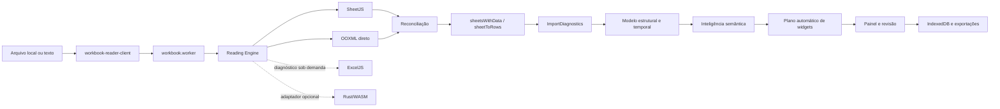

# Auditoria do estado atual — 2026-08-13

Base auditada: `main` em `4ec3ae0`, imediatamente antes da primeira correção
desta etapa. O código e os testes são a fonte de verdade; este documento registra
o mapa, as lacunas e a ordem recomendada de evolução.

## Resumo executivo

O projeto já possui uma arquitetura de leitura em camadas: SheetJS como leitor
principal, inspeção OOXML direta, ExcelJS como verificador sob demanda e um
contrato opcional para Rust/WASM. A importação preserva uma grade de origem
limitada para revisão, representações especiais de células, fórmulas, períodos,
comentários, regiões e diagnósticos. A geração automática de widgets ocorre
depois da importação e da classificação semântica.

As três maiores lacunas são: o inventário OOXML ainda não cobre vários recursos
estruturais, a pontuação de fidelidade não diferencia tudo que foi validado do
que não é suportado, e o parsing OOXML ainda descompacta e percorre XML inteiro
em memória. Antes desta etapa, a reconciliação também ignorava silenciosamente
uma aba inteira ausente no leitor principal. A primeira implementação corrige
essa perda.

## 1. Mapa da arquitetura atual

| Camada               | Componentes principais                                                    | Responsabilidade atual                                                   |
| -------------------- | ------------------------------------------------------------------------- | ------------------------------------------------------------------------ |
| Entrada              | `workbook-reader-client.ts`, `workbook.worker.ts`                         | valida tamanho, transfere bytes e publica progresso                      |
| Segurança            | `workbook-reader.ts`                                                      | limites de ZIP, abas, células e formatos de texto                        |
| Leitores             | `workbook-reader.ts`, `ooxml-reader.ts`, `workbook-verifier.ts`           | SheetJS, OOXML direto e verificação ExcelJS                              |
| Motor                | `workbook-reading-engine.ts`                                              | tempos, leitor usado, fallback e ponto de extensão WASM                  |
| Importação           | `import.ts`                                                               | cabeçalhos, mesclagens, linhas ocultas, blocos e formatos especializados |
| Diagnóstico          | `import-intelligence.ts`, `quality-audit.ts`                              | fórmulas, tipos, regiões, notas, qualidade e confiança                   |
| Modelo intermediário | `spreadsheet-intelligence.ts`, `structural-model.ts`, `temporal-model.ts` | células canônicas, papéis semânticos, regiões e períodos                 |
| Visualização         | `auto-dashboard.ts`, `widgets.ts`, `operational-widgets.ts`               | recomendações explicáveis e widgets por estrutura                        |
| Orquestração         | `routes/index.tsx`                                                        | revisão, painel, filtros, configurações e exportações                    |
| Persistência         | `storage.ts`, `encrypted-backup.ts`                                       | IndexedDB local e backup criptografado                                   |

O grafo estrutural existente confirma os maiores pontos de acoplamento:
`types.ts`, `routes/index.tsx`, `import-intelligence.ts`,
`spreadsheet-intelligence.ts`, `import-workbench.ts`, `data-pipeline.ts`,
`widgets.ts`, `import.ts` e `auto-dashboard.ts`.

## 2. Lacunas de fidelidade

| Prioridade                             | Lacuna                                                                      | Evidência                                                                                                                                       | Impacto                                                                                           |
| -------------------------------------- | --------------------------------------------------------------------------- | ----------------------------------------------------------------------------------------------------------------------------------------------- | ------------------------------------------------------------------------------------------------- |
| P0, corrigida nesta etapa              | Aba ausente era ignorada pela reconciliação                                 | `compareAndRepairWithOoxml` seguia para a próxima aba quando `primary.Sheets[name]` não existia                                                 | perda silenciosa de aba e pontuação enganosa                                                      |
| P0, corrigida na seção 22              | Pontuação mede principalmente divergências celulares com severidade `error` | `fidelity-meter.ts` deduplica erros por endereço; avisos e recursos não suportados não entravam no denominador nem em lugar nenhum do relatório | “100%” podia significar apenas valores comparáveis sem erro                                       |
| P0                                     | Inspeção OOXML usa `unzipSync` e regex sobre XML completo                   | `ooxml-reader.ts` e `workbook-metadata.ts` descompactam o pacote separadamente                                                                  | memória duplicada e risco em arquivos grandes                                                     |
| P1, sistema 1904 corrigido na seção 25 | Leitor OOXML não preserva colunas ocultas nem estado de abas                | `readSheet` lê linhas ocultas e formatos, mas não `cols` nem `sheet state`; `workbookPr date1904` já é lido e propagado                         | visibilidade ainda pode divergir no fallback; datas já respeitam o sistema 1904                   |
| P1                                     | Estilo preservado é principalmente formato numérico/texto exibido           | `ReaderCell` não carrega preenchimento, fonte, borda ou proteção                                                                                | cores com significado não entram na reconciliação                                                 |
| P1                                     | Limites de diagnósticos truncam sem contabilizar excedente                  | divergências: 2.000; representações/notas: 500; períodos: 2.000                                                                                 | auditoria pode parecer completa quando foi limitada                                               |
| P1                                     | ExcelJS não participa do fluxo normal de cada importação                    | é usado por `fidelity-meter.ts` e testes, não pelo worker de leitura                                                                            | terceira opinião existe apenas sob demanda                                                        |
| P2                                     | Recursos OOXML apenas detectados ou ainda não inventariados                 | tabelas e pivôs são diagnosticados; imagens, gráficos nativos, validações, nomes definidos, links externos e desenhos não têm modelo completo   | o valor visível pode sobreviver, mas o recurso não é explicável                                   |
| P2                                     | Fórmulas entre abas e funções fora da lista dependem do cache               | `formula.ts` recusa referências externas/entre abas não suportadas                                                                              | resultado sem cache fica indisponível, corretamente sem invenção                                  |
| P2                                     | Abas vazias são removidas da lista analítica                                | `sheetsWithData` retorna somente opções com linhas                                                                                              | útil para painel, mas exige inventário separado para afirmar que todas as abas foram reconhecidas |

“Não suportado” deve virar um estado explícito na auditoria; não deve reduzir
automaticamente a nota como “incorreto”, nem ser contado como “validado”.

## 3. Inventário de formatos e recursos

### Formatos aceitos

- Excel/OOXML: XLSX, XLSM, XLSB, XLS, XLTX e XLTM.
- OpenDocument: ODS e FODS.
- Texto: CSV, TSV e TXT, com detecção de delimitador e codificação.
- Outros leitores SheetJS: XML, HTML/HTM e Numbers.

### Recursos preservados ou diagnosticados

- abas e células com valor bruto, texto exibido e formato numérico;
- fórmulas e valores armazenados, com recálculo local limitado e seguro;
- datas e períodos, incluindo meses nomeados e cabeçalhos temporais;
- células mescladas e cabeçalhos hierárquicos;
- linhas ocultas excluídas de registros/widgets, mas preservadas na origem;
- colunas ocultas detectadas em diagnóstico;
- comentários e blocos textuais de observação;
- filtros, tabelas estruturadas, colunas calculadas e tabelas dinâmicas em diagnóstico;
- regiões independentes, blocos repetidos, formulários, matrizes e cronogramas;
- origem por aba/endereço nas células canônicas e nas exceções;
- limites de ZIP, dimensões, número de abas e células.

### Parcial ou não suportado de forma completa

- fills, fontes, bordas e cores semânticas na reconciliação;
- imagens, desenhos, objetos e gráficos nativos;
- validações de dados, agrupamentos/outlines e segmentações;
- nomes definidos, links externos e hyperlinks como inventário rastreável;
- macros VBA: nunca executadas e ainda sem inventário detalhado;
- recálculo integral de fórmulas do Excel;
- arquivos XLS/Numbers/ODS parcialmente corrompidos sem leitor alternativo;
- auditoria de abas vazias/ocultas separada das opções analíticas.

## 4. Matriz de cobertura dos leitores

Legenda: **P** principal, **V** verificação/reconciliação, **D** diagnóstico sob
demanda/teste, **C** contrato sem implementação e **—** sem cobertura.

| Formato      | SheetJS | OOXML direto |   ExcelJS | Rust/WASM |
| ------------ | ------: | -----------: | --------: | --------: |
| XLSX         |       P |            V |         D |         C |
| XLSM         |       P |            V | D parcial |         C |
| XLTX/XLTM    |       P |            V | D parcial |         C |
| XLS/XLSB     |       P |            — |         — |         — |
| ODS          |       P |            — |         — |         D |
| FODS         |       P |            — |         — |         — |
| CSV/TSV/TXT  |       P |            — |         — |         — |
| XML/HTML/HTM |       P |            — |         — |         — |
| Numbers      |       P |            — |         — |         — |

| Recurso                | SheetJS |            OOXML direto |   ExcelJS | Resultado atual                 |
| ---------------------- | ------: | ----------------------: | --------: | ------------------------------- |
| valor e tipo           |       P |                       V |         D | reconciliado por endereço       |
| fórmula/cache          |       P |                       V | D parcial | preservado; recálculo limitado  |
| texto formatado/numFmt |       P |                       V |         D | comparável                      |
| mesclagens             |       P |                 parcial |         D | importador reconstrói estrutura |
| linhas ocultas         |       P |                       V |         D | removidas da saída analítica    |
| colunas ocultas        |       P |                       — |         D | apenas diagnosticadas           |
| comentários            |       P |                       — |         D | preservados via SheetJS         |
| tabelas/pivôs          | parcial | inventário complementar |   parcial | diagnóstico, sem recálculo      |
| estilos visuais        | parcial |                  numFmt |   parcial | sem reconciliação completa      |
| desenhos/gráficos      | parcial |                       — |   parcial | sem modelo intermediário        |

## 5. Riscos de regressão

1. `routes/index.tsx` concentra 41 relações e grande parte do estado visual;
   mudanças de widget podem afetar importação, filtros e persistência.
2. `import.ts` contém muitas heurísticas especializadas; uma regra genérica de
   cabeçalho ou região pode quebrar cronogramas e formulários já cobertos.
3. Mesclagens e preenchimento de valores exigem distinguir rótulo estrutural de
   observação; replicar texto longo cria dados falsos.
4. Linhas/colunas ocultas não podem alimentar widgets sem decisão explícita;
   a regressão `4s` prova o risco.
5. Datas dependem de valor, formato, texto exibido e fuso; usar apenas serial
   volta a criar anos ou dias errados.
6. A promoção do WASM sem corpus de paridade pode trocar um fallback estável por
   um leitor mais rápido, porém menos fiel.
7. Limites de amostragem para UI não podem ser reutilizados pela auditoria.
8. A separação automática de regiões pode dividir uma tabela com espaçadores ou
   misturar blocos se a confiança não for respeitada.

## 6. Gargalos de desempenho

- O parsing principal já roda em worker, mas SheetJS, `inspectOoxml` e
  `attachWorkbookFeatures` podem descompactar/percorrer o mesmo arquivo em fases
  distintas.
- `unzipSync` mantém o pacote expandido inteiro em memória; XML streaming ainda
  não existe.
- `sheetMeta` percorre toda a dimensão declarada, inclusive células vazias, para
  contar fórmulas e montar diagnósticos. Dimensões infladas custam CPU mesmo sob
  o limite global.
- O armazenamento de representações, notas e períodos tem limites, mas o laço
  continua percorrendo a dimensão completa.
- `routes/index.tsx` continua sendo o maior chunk e o maior ponto de renderização.
- Baseline medido: `workbook.worker` 442,86 kB; maior chunk inicial 302,03 kB;
  XLSX tardio 492,63 kB; Leaflet tardio 813,55 kB.
- O orçamento de produção passa, mas o build alerta para módulos acima de 500 kB
  no servidor; esses módulos devem permanecer fora do caminho inicial.

Métricas que ainda precisam ser registradas por importação: ~~bytes compactados
e expandidos~~, ~~tempo por leitor~~ — registrados desde a seção 37 —, células
realmente visitadas, pico estimado de memória, tempo de reconciliação,
truncamentos de diagnóstico e cancelamento (cancelamento por `AbortError` é
deliberadamente excluído do registro de falhas, ver seção 37).

## 7. Plano incremental para o núcleo Rust

1. Congelar um contrato JSON versionado para inventário de workbook, abas,
   dimensões, visibilidade e limites de recursos.
2. Criar crate isolado, sem integrar a UI, usando ZIP com limites e XML pull/stream.
3. Entregar primeiro apenas inventário OOXML: partes, abas, relações, estado,
   sistema de datas e dimensões declaradas/reais.
4. Adicionar shared strings, células, fórmulas/cache, numFmt, mesclagens e regiões
   ocultas, mantendo valores bruto e exibido separados.
5. Compilar para WASM e implementar o contrato já aceito por
   `registeredWasmWorkbookReader`.
6. Executar Rust e TypeScript lado a lado; nunca promover o resultado Rust antes
   da paridade por formato e fixture.
7. Acrescentar comentários, hyperlinks, tabelas, pivôs, desenhos e nomes
   definidos como inventário, sem executar conteúdo.
8. Medir tempo, memória e tamanho WASM; promover por formato com fallback.

Bibliotecas devem ser escolhidas por cobertura e manutenção, não por
popularidade. Critérios mínimos: ZIP com limites, XML streaming sem entidades,
Serde, WASM estável, datas 1900/1904, fórmulas/cache, estilos e relações OOXML.

## 8. Plano de testes de paridade

1. Definir manifesto JSON por fixture com hash, abas, estados, dimensões reais,
   células críticas, fórmulas, mesclagens, ocultos, notas e recursos conhecidos.
2. Rodar SheetJS, OOXML TypeScript, ExcelJS e Rust sobre os mesmos bytes.
3. Comparar existência, tipo, bruto, cache, display, fórmula, numFmt, visibilidade,
   comentário e hyperlink por endereço.
4. Classificar cada diferença como incorreta, representação equivalente,
   não suportada ou não validável.
5. Exigir zero perda silenciosa e registrar todo truncamento.
6. Manter fixtures sintéticas pequenas para cada recurso e fixtures reais apenas
   locais/sanitizadas, sempre com `skipIf` seguro.
7. Cobrir arquivos pequeno, largo, profundo, muitas abas, estilos vazios,
   mesclagens, fórmulas, corrompido e ZIP bomb simulada segura.
8. Coletar tempo e memória por leitor; falha de desempenho não deve alterar a
   decisão de fidelidade.

Gate de promoção Rust: todos os manifests críticos iguais ou com divergências
explicitamente aceitas, sem regressão de segurança, e ganho medido no corpus de
arquivos grandes.

## 9. Três melhorias de maior impacto

1. **Relatório de fidelidade explicável:** separar validado, divergente,
   reparado, não suportado e truncado por aba/bloco/célula.
2. **Inventário OOXML seguro e único:** uma descompactação limitada, XML
   streaming e cobertura de visibilidade, datas 1904, relações e recursos.
3. **Núcleo Rust em shadow mode:** inventário e células lado a lado com o motor
   atual, promovidos apenas após paridade.

## 10. Primeira implementação mensurável

A reconciliação agora recupera uma aba inteira encontrada pelo OOXML e ausente
no SheetJS. A aba é anexada ao workbook principal e cada célula recuperada gera
uma `ReaderDivergence` com aba, endereço, valor independente, severidade `error`
e `repaired: true`.

Prova sintética adicionada em `workbook-fidelity.test.ts`:

- começa com workbook principal sem abas;
- reconcilia contra a fixture pública OOXML;
- confirma a restauração de `Cabeçalho deslocado`;
- confirma o valor `Data` em `A4`;
- confirma diagnóstico rastreável e reparado para `A4`.

Resultado mensurável: o cenário passou de **zero abas e zero divergências
registradas** para **aba restaurada e uma divergência reparada por célula de
origem**. O limite global de 2.000 divergências continua sendo uma lacuna a ser
tratada no relatório de fidelidade.

## Baseline de validação

Antes da mudança, no ambiente Windows isolado:

- TypeScript: aprovado;
- build de produção: aprovado após evitar o mapeamento de unidade de rede do
  Vite, uma limitação do sandbox;
- testes: 45 arquivos, 42 aprovados e 3 ignorados com segurança; 388 testes
  aprovados e 11 ignorados;
- lint: 10 diferenças de formatação preexistentes em 5 arquivos, a normalizar
  antes da publicação desta etapa.

O briefing citava 404 testes. O checkout atual em `4ec3ae0` possui 399 testes
contabilizados antes desta implementação; a nova regressão eleva o inventário
para 400. A diferença deve ser tratada como mudança de inventário, não como
evidência automática de perda de cobertura.

Após a implementação e a normalização estritamente mecânica dos cinco arquivos:

- testes: 45 arquivos, 42 aprovados e 3 ignorados; 389 testes aprovados e 11
  ignorados, total de 400;
- TypeScript: aprovado;
- ESLint/Prettier: aprovado com adaptação de fim de linha do checkout Windows;
- build de produção: aprovado;
- orçamento de desempenho: aprovado;
- dependências de produção: zero vulnerabilidades no `npm audit --omit=dev`;
- dependências de desenvolvimento: duas vulnerabilidades moderadas herdadas de
  `exceljs -> uuid`, sem correção disponível no inventário atual.

## 11. Núcleo Rust de inventário OOXML — fase 1

O primeiro recorte do plano incremental foi implementado no crate isolado
`rust/oli-ooxml-core`, ainda fora do leitor produtivo e do adaptador WASM. O
contrato JSON `1.0.0` está congelado em
`contracts/ooxml-inventory.schema.json`.

Cobertura entregue:

- validação prévia de quantidade de entradas, tamanho individual e agregado,
  razão de compactação, criptografia e caminhos inseguros/duplicados no ZIP;
- leitura XML orientada a eventos, limitada também por número de eventos;
- ordem, nome, identificador, relação, caminho e estado
  `visible`/`hidden`/`veryHidden` das abas;
- sistema de datas 1900/1904;
- dimensão declarada e dimensão real calculada pelas referências de células;
- métricas do pacote, limites aplicados e diagnósticos estruturados;
- CLI JSON para inspeção local e workflow dedicado no GitHub.

Os testes incluem fixture sintética com abas ocultas e data 1904, caminho ZIP
inseguro, limite de recurso reduzido e paridade de inventário com
`test-fixtures/problematic-import.xlsx`. A fase seguinte de shared strings,
células, fórmulas/cache e formatos é registrada abaixo; o crate ainda não foi
compilado para WASM nem executado lado a lado com o leitor atual.

## 12. Núcleo Rust de células OOXML — fase 2

O crate `oli-ooxml-core` passou a emitir o contrato JSON `2.0.0`. A mudança de
versão é intencional porque cada aba agora inclui o inventário de células, além
dos metadados da fase 1.

Cobertura acrescentada:

- shared strings simples e rich text, preservando a concatenação dos trechos;
- strings inline, strings armazenadas, números, booleanos, erros e datas ISO;
- fórmula separada do valor em cache, mantendo `rawValue` e `displayValue`;
- índice de estilo, formatos numéricos nativos conhecidos e formatos customizados;
- exibição conservadora para inteiros, decimais e percentuais, sem inventar a
  renderização de formatos Excel ainda não implementados;
- limites de 2 milhões de células, 2 milhões de shared strings e 256 MiB de
  texto por parte XML, além dos limites de ZIP e eventos já existentes;
- rejeição de entidades XML não predefinidas, mantendo DOCTYPE proibido.

A paridade da fixture pública agora verifica também as 34 células da primeira
aba, o cabeçalho `A4`, a fórmula `G5` e seu cache numérico. A fixture sintética
cobre rich text, entidade XML, booleano, percentual, formato customizado, erro
e data. O crate permanece fora do caminho produtivo; a cobertura de
datas/formatos, mesclagens e regiões ocultas foi concluída abaixo antes do
adaptador WASM em shadow mode.

## 13. Núcleo Rust de fidelidade estrutural OOXML — fase 3

O contrato JSON passa para `3.0.0`, pois cada aba agora exige também os campos
`mergedRanges`, `hiddenRows` e `hiddenColumns`. O crate passa da versão `0.2.0`
para `0.3.0` e continua isolado do caminho produtivo.

Cobertura acrescentada:

- conversão de datas seriais nos sistemas Excel 1900 e 1904, preservando o
  valor numérico bruto e emitindo `dateValue` local normalizado;
- tratamento explícito do dia fictício 29/02/1900: a exibição compatível é
  preservada, o valor ISO inválido não é emitido e um diagnóstico é registrado;
- reconhecimento conservador de formatos de data/hora, formatos nativos 14–22
  e 45–47, duração `[h]:mm:ss` e formatos customizados comuns;
- inventário validado de mesclagens, linhas ocultas e intervalos compactos de
  colunas ocultas, sem expandir intervalos potencialmente grandes;
- limite configurável de 500 mil registros estruturais por aba, somado aos
  limites de células, texto, eventos XML e pacote ZIP;
- regressões sintéticas para data 1904, duração, formato customizado, mesclagem,
  estruturas ocultas e limite reduzido, além da paridade estrutural da fixture
  pública.

A etapa de compilação e shadow mode foi concluída abaixo.

## 14. Adaptador WASM em shadow mode — fase 4

O crate `oli-ooxml-core` passa à versão `0.4.0` e gera um módulo WebAssembly
para navegador. O contrato de inventário permanece `3.0.0`; não houve mudança
incompatível na saída JSON.

Integração entregue:

- exportação `inventory_ooxml_json` restrita ao alvo `wasm32`, mantendo a API
  Rust nativa e a CLI existentes;
- pacote web gerado por `wasm-pack --target web`, versionado em `src/wasm` para
  que o deploy da Vercel não dependa de uma toolchain Rust;
- registro automático dentro do worker de leitura para XLSX, XLSM, XLTX e XLTM;
- execução somente depois que SheetJS e o verificador OOXML TypeScript já
  produziram o resultado validado;
- comparação de nomes de abas e, por endereço, valor bruto, texto exibido e
  fórmula, com tolerância numérica mínima;
- relatório separado de disponibilidade, estado (`matched`, `diverged`,
  `failed` ou `unavailable`), tempo, células comparadas, células/abas divergentes
  e versão do contrato;
- falha, contrato inválido ou divergência no WASM nunca altera linhas, reparos,
  diagnósticos produtivos nem impede a importação;
- smoke test do binário real contra `problematic-import.xlsx`, além de testes de
  paridade simulada e de falha não bloqueante;
- CI ampliada com compilação para `wasm32-unknown-unknown` e execução do smoke
  test sobre o artefato versionado.

O próximo passo seguro é coletar a distribuição das divergências no corpus de
produção e definir critérios objetivos de promoção por formato antes de permitir
que o Rust participe do resultado produtivo.

## 21. Inventário ODS complementar — fase 11

O crate `oli-ooxml-core` ganhou um segundo leitor, isolado do fluxo XLSX, para
OpenDocument Spreadsheet (ODS), o formato universal ISO/IEC 26300 que hoje só
tinha cobertura via SheetJS no caminho TypeScript (linha "ODS" da matriz de
formatos, coluna Rust/WASM: de contrato sem implementação para diagnóstico
testado). O contrato JSON continua `3.0.0`; o campo `format` passa a aceitar
`"ooxml"` ou `"ods"`, mantendo o restante do formato do inventário.

Cobertura entregue pelo módulo `src/ods.rs`:

- reaproveita a validação de pacote ZIP, os limites de recursos e o modelo de
  inventário (abas, dimensões, mesclagens, ocultos, células) já usados pelo
  núcleo OOXML, sem duplicar a lógica de segurança;
- abas, células tipadas (texto, número, booleano, data/hora, percentual,
  moeda), fórmulas (`table:formula`, normalizadas para o mesmo prefixo `=`
  usado no XLSX) e mesclagens por `number-columns/rows-spanned`;
- colunas e linhas ocultas via `table:visibility="collapse"/"filter"`;
- datas ODF já vêm como texto ISO em `office:date-value`; quando o arquivo
  grava só a data, o horário é normalizado para meia-noite para manter o
  mesmo formato `dateValue` do contrato compartilhado.

Células e linhas repetidas (`table:number-columns-repeated`,
`table:number-rows-repeated`, usadas pelo ODF sobretudo para preencher
espaço vazio à direita/abaixo, com contadores que podem chegar a centenas
de milhares) são representadas de forma **compacta e sem perda**: cada
bloco retangular de células idênticas vira um único registro de célula com
os novos campos `repeatColumns`/`repeatRows` (contrato JSON, ambos
opcionais, omitidos quando o valor é 1). `actualDimension` e a contagem de
células da aba refletem a extensão lógica real do bloco, não apenas a
âncora — corrigindo uma limitação da primeira versão deste leitor, em que
somente a primeira ocorrência era materializada e a dimensão/contagem
podiam parecer menores que a estrutura declarada. O custo de processar um
bloco repetido continua O(1) por elemento do XML (nenhum laço proporcional
ao contador de repetição), e o limite de células do pacote passa a ser
aplicado sobre a extensão lógica total, não sobre o número de registros
JSON.

Testes em `tests/ods_inventory.rs` cobrem tipos de célula e dimensão real,
fórmula e mesclagem preservadas com linha/coluna oculta, e a representação
compacta de blocos repetidos (incluindo um caso de 1.000.000 de linhas
repetidas vazias), confirmando `repeatColumns`/`repeatRows`, a dimensão
real completa e a contagem de células lógica — sem materializar nem
descartar nenhuma célula.

O leitor ODS ainda não está integrado ao `workbook.worker` nem ao adaptador
WASM em shadow mode; é uma capacidade isolada do crate, seguindo a mesma
progressão incremental usada para o XLSX (fases 1 a 10 acima) antes de
qualquer integração no caminho produtivo. Os próximos passos seguros são:
compilar para `wasm32-unknown-unknown`, expor `inventory_ods_json` ao
worker como leitor adicional (não substituto do SheetJS) e só então avaliar
paridade contra um corpus real de arquivos ODS sanitizados.

## 22. "Não suportado" como estado explícito na pontuação de fidelidade

Corrige a lacuna P0 registrada na seção 2: `fidelity-meter.ts` deduplicava
apenas divergências de severidade `error` num único mapa e descartava
qualquer coisa de severidade `warning` sem registrar em lugar nenhum do
relatório. Um score de 100% podia então significar tanto "tudo comparado e
igual" quanto "vários avisos silenciados". Não havia, além disso, nenhum
jeito de o relatório dizer que fills, imagens, validações de dados, nomes
definidos/hyperlinks, macros VBA e recálculo integral de fórmulas nunca são
comparados célula a célula por nenhum leitor — esses recursos eram
invisíveis ao medidor de fidelidade, nem contados como validados nem como
divergentes.

`WorkbookFidelityReport` ganhou dois campos, sem alterar a fórmula da
pontuação nem o campo `divergences` existente (que continua sendo apenas
erros, preservando os testes de meta mínima de 99%):

- `warnings`: as divergências de severidade `warning`, deduplicadas por
  endereço como antes, agora visíveis em vez de descartadas;
- `unsupportedFeatures`: lista estática e explícita dos recursos da seção 3
  que nenhum leitor reconcilia hoje. Por decisão de projeto, "não suportado"
  não soma nem subtrai da pontuação — é um estado próprio, nem "validado"
  nem "incorreto", como já estava registrado como princípio neste documento
  mas ainda não implementado.

Teste adicionado em `workbook-fidelity.test.ts` confirma que `warnings` só
contém severidade `warning`, que `divergences` só contém severidade `error`
e que `unsupportedFeatures` inclui "Macros VBA". Nenhum consumidor de
produção usa `fidelity-meter.ts` hoje (só os dois arquivos de teste), então
a mudança de forma do retorno não tem risco de regressão na UI.

## 15. Medição de corpus e gate de promoção — fase 5

O shadow mode agora possui amostragem determinística configurável por
`VITE_WASM_SHADOW_SAMPLE_RATE`. Arquivos fora da amostra são identificados como
`sampled-out`; o Rust continua sem alterar o resultado produtivo em qualquer
estado.

O binário WASM real passou a integrar um teste de corpus no Vitest e na CI. A
medição registra contrato, tempo, células comparadas, células divergentes e abas
divergentes. O avaliador agrega essas observações, calcula taxa de divergência e
latência p95 e informa todos os motivos que impedem a promoção.

Os critérios padrão exigem contrato `3.0.0`, no mínimo 25 arquivos e 10.000
células, zero falhas e divergências e p95 de até 1.500 ms. A fixture pública
isolada é deliberadamente classificada como corpus insuficiente. Os critérios e
o processo de decisão estão documentados em `docs/WASM_PROMOTION_CRITERIA.md`.

## 16. Corpus reproduzível e paridade estrutural — fase 6

O corpus WASM agora é gerado de forma determinística a partir de um manifesto
versionado. São 25 arquivos XLSX e 13.200 células cobrindo strings, números,
booleanos, fórmulas, datas nos sistemas 1900/1904, mesclagens e regiões ocultas.
Os binários gerados não são versionados; a CI os recria e publica o relatório de
medição como artefato.

O inspetor OOXML TypeScript passou a preservar mesclagens, linhas ocultas e
colunas ocultas também no workbook de fallback. O shadow mode confronta essas
estruturas com o inventário Rust e reporta quantidades comparadas e divergentes.

Na medição de referência, os 25 arquivos, 13.200 células e 24 estruturas tiveram
paridade total, sem falhas ou divergências e com p95 abaixo do limite. O gate
permanece corretamente bloqueado: corpus sintético comprova cobertura, mas a
promoção exige pelo menos cinco arquivos reais sanitizados por formato.

## 17. Sanitização local do corpus real — fase 7

Foi adicionado um fluxo local e determinístico para transformar planilhas XLSX
reais em fixtures adequadas à medição de paridade sem versionar originais ou
cópias. Textos, números, datas, nomes de abas e literais de fórmula são
pseudonimizados; metadados, links, comentários, nomes definidos, macros e
referências externas são removidos ou neutralizados.

O sanitizador preserva os tipos das células, fórmulas internas, formatos,
mesclagens e regiões ocultas. Ele aceita somente XLSX, exige chave local via
ambiente, não altera a origem e recusa destinos não vazios. O manifesto gerado
não contém nomes ou caminhos de origem nem a chave. Quando presente em
`test-fixtures/sanitized-real`, o corpus local passa a integrar automaticamente
o relatório e o gate por formato; a CI continua usando apenas as fixtures
sintéticas reproduzíveis.

## 18. Candidate mode com fallback automático — fase 8

Foi preparado o controle de ativação gradual do Rust/WASM para XLSX. O padrão
continua sendo `shadow`, e a allowlist de formatos nasce vazia. Apenas a
combinação explícita de `VITE_WASM_READER_MODE=candidate` com
`VITE_WASM_CANDIDATE_FORMATS=xlsx` permite que um match integral seja marcado
como `sheetjs-wasm-verified`.

Candidate mode mede 100% dos arquivos do formato liberado, independentemente da
taxa de shadow. Contrato incompatível, divergência, falha do adaptador ou
indisponibilidade acionam fallback automático para o leitor TypeScript validado.
O relatório registra modo, estado do candidato e motivo do fallback. O inventário
Rust ainda não cria, substitui ou repara células; publicar a allowlist continua
condicionado ao gate real sanitizado e a uma decisão humana por formato.

## 19. XLSX Rust/WASM primário com fallback validado — fase 9

O modo candidato e a allowlist `xlsx` passaram a ser os padrões. O inventário
Rust agora é materializado como workbook e percorre o pipeline real de
importação. Sua saída só é usada quando células, estruturas e o resultado final
são idênticos ao caminho TypeScript, sendo identificada como `rust-wasm`.

Filtros, tabelas, comentários e links já validados são preservados na
materialização. `VITE_WASM_READER_MODE=shadow` continua disponível como rollback
imediato. O corpus real sanitizado ainda é necessário antes de remover a
validação dupla e obter ganho efetivo de desempenho.

## 20. Metadados OOXML independentes no candidato Rust — fase 10

O workbook materializado pelo inventário Rust deixou de copiar metadados do
workbook SheetJS. Filtros automáticos, tabelas estruturadas, Pivot Tables,
comentários clássicos e hyperlinks internos ou externos agora são reconstruídos
diretamente das partes e relacionamentos do pacote XLSX.

O leitor TypeScript continua executando como oráculo de paridade e fallback: a
saída Rust somente é publicada quando o resultado final permanece idêntico. Isso
remove um acoplamento da materialização sem antecipar a promoção independente,
que ainda depende de cinco arquivos XLSX reais sanitizados e do gate completo.

## 23. Duas falhas reais encontradas com planilhas de produção

Seis arquivos XLSX reais fornecidos pelo usuário (fora do repositório, nunca
versionados) foram medidos com `measureWorkbookFidelity`. Três continham
apenas texto/números e já fechavam em 100% com zero divergências. Os outros
três — todos contendo imagens/logotipos — expuseram duas falhas que nenhum
teste sintético havia coberto:

1. **`verifyWorkbookWithExcelJs` derrubava a medição inteira.** ExcelJS tem
   bugs conhecidos ao carregar certos desenhos/âncoras de imagem em XLSX real
   (`Cannot read properties of undefined (reading 'name')` e `(reading
'anchors')`, lançados de dentro de `workbook.xlsx.load`). Como
   `measureWorkbookFidelity` não capturava essa exceção, o relatório inteiro
   quebrava — nenhuma pontuação, nenhum diagnóstico, só um erro não tratado.
   Corrigido isolando a chamada em `try/catch`: uma falha de leitor agora vira
   `failedReaders: ["ExcelJS"]`, um estado explícito e visível, em vez de
   "0 divergências" silencioso ou um crash. Como nenhum código de produção usa
   `ExcelJS` no caminho de importação (só `fidelity-meter.ts` e testes), não
   havia risco de regressão na UI, mas a medição em si ficava inutilizável
   para esses arquivos.
2. **`ooxml-reader.ts` não decodificava referências numéricas de caractere.**
   A função `xmlText` só tratava as cinco entidades nomeadas do XML (`&lt;`,
   `&gt;`, `&quot;`, `&apos;`, `&amp;`). Referências numéricas válidas
   (`&#199;`, `&#xC7;`) — usadas por algumas ferramentas de exportação para
   acentos — passavam intactas, produzindo texto corrompido como
   `SOLICITA&#199;&#213;ES` em vez de `SOLICITAÇÕES`. Isso gerava até 850
   avisos por arquivo real. Corrigido com decodificação hex/decimal antes do
   `&amp;` final, preservando o caso em que `&amp;#38;` é texto escapado de
   propósito (não deve virar `&`).

Testes de regressão: `workbook-fidelity.test.ts` cobre a decodificação
numérica com um pacote OOXML sintético mínimo; `fidelity-meter-resilience.test.ts`
mocka `verifyWorkbookWithExcelJs` para lançar e confirma que a medição
continua, reportando `failedReaders` em vez de propagar a exceção.

Depois das duas correções, os seis arquivos reais fecham em 100%, zero
divergências de erro. As diferenças de `\n` vs `\r\n` entre leitores
continuam aparecendo como `warning` — representação equivalente, não erro,
consistente com a regra já registrada neste documento.

## 24. Representação compacta de repetições e sistema de datas do ODS

Revisão da fase 11 (seção 21) apontou dois problemas antes de o leitor ODS
poder integrar o shadow mode:

1. **Perda de fidelidade em células/linhas repetidas.** A primeira versão
   materializava só a primeira ocorrência de um bloco repetido e descartava
   o resto com um diagnóstico de "truncagem". Isso fazia a dimensão real e
   a contagem de células parecerem menores que a estrutura declarada — o
   próprio problema que a seção 23 corrige para outro leitor, agora
   corrigido aqui na origem. `CellInventory` ganhou os campos opcionais
   `repeatColumns`/`repeatRows` (contrato compartilhado com o XLSX, que
   nunca os emite): um único registro representa um bloco retangular de
   células idênticas de forma compacta e sem perda, com `address` no canto
   superior esquerdo. `actualDimension` e a contagem de células da aba
   passaram a somar a extensão lógica real do bloco, não apenas a âncora.
   O custo de processar um bloco continua O(1) por elemento do XML — não é
   um laço de materialização, é aritmética sobre o tamanho declarado — e o
   limite de células do pacote agora é aplicado sobre essa extensão lógica.
   Os diagnósticos `ods-repeated-cell-truncated`/`ods-repeated-row-truncated`
   foram removidos por não haver mais truncagem para relatar.
2. **`dateSystem` afirmava "1900" para um formato que não usa esse
   conceito.** ODF grava data/hora como texto ISO 8601 direto; não há
   série numérica 1900/1904 a resolver. `DateSystem` ganhou a variante
   `NotApplicable` (JSON `"notApplicable"`), e o leitor ODS a emite em vez
   de um `Excel1900` que nunca é interpretado. `parse_excel_serial` trata
   essa variante devolvendo "sem data" em vez de assumir uma convenção
   Excel — ela nunca é chamada para ODS hoje, mas o comportamento fica
   seguro mesmo que isso mude.

`tests/ods_inventory.rs` foi atualizado: o teste de repetição agora chama-se
`represents_repeated_cells_and_rows_compactly_without_loss` e confirma
`repeatColumns`/`repeatRows`, a dimensão real completa e a contagem lógica
de células para um bloco de 5.000 colunas repetidas e uma linha repetida
10.000 vezes, sem descartar nada.

O leitor continua isolado do `workbook.worker`. Os itens restantes da
revisão — corpus real ODS sanitizado, e manter SheetJS como resultado
produtivo até paridade comprovada — seguem como pré-condição para
qualquer integração em shadow mode, na mesma ordem recomendada.

## 25. Etapa 5 — auditoria de corpus de regressão e duas falhas reais

Antes de ampliar fixtures, uma auditoria comparou 20 cenários de leitura
universal contra a suíte existente. Bem cobertos: cabeçalho deslocado,
múltiplas tabelas empilhadas/lado a lado, mesclagens, linhas/colunas
ocultas, células de erro, delimitadores de CSV ambíguos. Parciais: filtros
sem congelamento, fórmulas cacheadas vs. recalculadas, grandes planilhas
(só o caminho de rejeição), ZIP hostil (só limites de dimensão/tamanho),
codificação de CSV, ODS/XLS além de um smoke test básico. Lacunas claras:
cabeçalho repetido inline, sistema de datas 1904 no leitor OOXML
independente, shared strings rich text, imagens/gráficos incorporados.

Escrever os testes das duas primeiras lacunas expôs bugs reais, não só
ausência de cobertura:

1. **`ooxml-reader.ts` nunca lia `workbookPr date1904`.** `serialDate`
   sempre assumia o sistema 1900 (`XLSX.SSF.parse_date_code` sem opções).
   Num arquivo de origem Mac (1904), qualquer data reconciliada por este
   leitor — usado na reparação de abas/células ausentes e como referência
   do shadow mode — saía ~4 anos errada, silenciosamente. Corrigido lendo
   `date1904` do `workbookPr` em `inspectOoxml` e propagando para
   `serialDate` e `XLSX.SSF.format` (que também precisa da opção para
   exibir a data certa). Teste em `workbook-fidelity.test.ts` confirma
   serial `1` virando `1900-01-01`/`"1/1/00"` sem a flag e
   `1904-01-02`/`"1/2/04"` com ela.
2. **Repetição literal do cabeçalho no meio dos dados virava um registro
   de dado.** Relatórios paginados/exportados costumam repetir a linha de
   cabeçalho a cada quebra de página, sem linha em branco nem título
   separando um bloco novo — por isso a detecção de blocos empilhados (que
   já lida com um caso relacionado, mas diferente) não pegava esse caso.
   `sheetToRows` agora filtra uma linha de dado que repete o cabeçalho
   original em pelo menos duas colunas (exigência deliberada para não
   descartar por engano um item de catálogo que só coincide numa coluna),
   registra a contagem em `audit.repeatedHeaderRowsIgnored` e explica no
   aviso ao usuário, em vez de silenciosamente incluir
   `{"Nome": "Nome", "Valor": "Valor"}` como se fosse um registro.

A lacuna de shared strings rich text (múltiplos `<r>` num `<si>`) já
estava implementada corretamente (`sharedStrings` concatena todo `<t>`
dentro do `<si>`, dentro ou fora de `<r>`); ganhou um teste travando o
comportamento, sem precisar de correção. Imagens/gráficos incorporados
continuam como lacuna registrada na seção 3, não abordada nesta etapa.

Três lacunas adicionais foram fechadas com testes, todas confirmando
comportamento já correto (nenhuma correção necessária):

- **BOM UTF-8 em CSV** (`decodeText` já removia o marcador U+FEFF do
  início do texto decodificado): teste confirma que o nome da primeira
  coluna sai limpo, sem o BOM grudado.
- **ZIP hostil** (`validateZipWorkbook` já recusava contagem de entradas
  acima de `MAX_ZIP_ENTRIES` e razão de compressão suspeita acima de
  `MAX_SUSPICIOUS_COMPRESSION_RATIO`): dois testes constroem um registro
  EOCD/diretório central hostil sem precisar de dados comprimidos reais
  (a checagem só lê os campos declarados no cabeçalho), confirmando a
  rejeição de "arquivos internos demais" e de uma razão ~1 milhão:1
  característica de zip bomb.
- **Planilha grande com sucesso**: só existia o teste do caminho de
  rejeição (dimensão declarada abusiva). Novo teste lê 5.000 linhas por 3
  colunas e confirma integridade da primeira e da última linha.

## 26. Etapa 6 — leitor usado e fallback agora aparecem na interface

Uma auditoria de explicabilidade mapeou 11 itens do relatório de leitura
contra o que já é calculado e contra o que chega à interface. A maioria já
estava exposta (estrutura detectada, cabeçalho escolhido e motivo,
regiões/blocos encontrados, células recuperadas, confiança por
região/coluna, ações conservadoras, sugestões de revisão) — nenhuma delas
foi tocada. Dois itens computados por toda importação nunca chegavam ao
usuário: qual leitor produziu o resultado (`WorkbookReadReport.reader`) e
se houve fallback do Rust para o TypeScript (`.fallbackUsed`). Essa
informação de confiança existia só no objeto de relatório interno.

A lógica de descrição foi extraída para `describeReaderOutcome` em
`workbook-reading-engine.ts` (função pura, sem estado), em vez de inline
no componente de rota — só assim dá para testar sem precisar simular
upload de arquivo num navegador de verdade, algo que a ferramenta de
automação deste ambiente não suporta (só dispara eventos de mudança em
`<input type="file">`, não abre o diálogo do sistema operacional). A
função só produz mensagem nos estados informativos: o caminho comum
(`sheetjs-verified`, sem reparo, sem fallback) continua silencioso, sem
poluir toda importação. `routes/index.tsx` chama essa função e junta o
resultado à mesma caixa de aviso já existente na revisão.

Não descoberto nenhum bug aqui — os dois campos já estavam corretos e
testados no motor; a lacuna era puramente de interface. Verificado com
`npx vitest run` (441 passou, 11 pulados, era 436), `npx tsc --noEmit` e
`npm run build`, mas **não foi possível verificar visualmente no
navegador**: a ferramenta de automação deste sandbox não consegue simular
o diálogo de seleção de arquivo do sistema operacional, e uma injeção via
`DataTransfer`/evento `change` sintético não foi concluída de forma
confiável. Risco considerado baixo: é concatenação de string reaproveitando
uma caixa de aviso já renderizada e testada, sobre campos já tipados e
cobertos por teste no motor de leitura — mas fica registrado como
verificação pendente, não como confirmado.

Itens da auditoria de explicabilidade da seção 26: a matriz de confiança
por aba foi implementada na seção 28, e regiões descartadas e o motivo na
seção 29.

## 27. Etapa 3 — teste de rollback dedicado e documentação do desligamento do candidato Rust

Fechava a lacuna registrada na seção 19: o modo candidato e a allowlist
`xlsx` já eram o padrão de produção, e `VITE_WASM_READER_MODE=shadow` já
existia como variável de rollback, mas não havia teste que provasse esse
comportamento isoladamente nem documentação explícita do procedimento.

Nenhum bug foi encontrado — a lógica em `readWorkbookBytesWithEngine`
(`src/lib/workbook-reader.ts`) já garantia que a materialização Rust só
ocorre dentro do bloco condicionado a `candidateEligible`, que por sua vez
exige `wasmReaderMode === "candidate"`. A lacuna era puramente de prova e
de documentação:

- **Teste** (`src/lib/workbook-reader.test.ts`): registra o mesmo adaptador
  Rust simulado, com dados que dariam paridade total, e roda o mesmo
  arquivo duas vezes — uma em modo candidato (confirma promoção a
  `reader: "rust-wasm"`) e outra alterando somente `wasmReaderMode` para
  `"shadow"` (confirma reversão para `reader: "sheetjs-verified"`,
  `wasmOutputUsed: false`, linhas importadas idênticas, e que a medição de
  paridade continua ativa via `wasmShadowStatus: "matched"`). Isso prova
  que o único parâmetro que precisa mudar é o modo, sem depender de
  desregistrar o adaptador ou reverter qualquer outro código.
- **Documentação** (`docs/WASM_PROMOTION_CRITERIA.md`, nova seção "Como
  desativar o candidato Rust (rollback)"): explicita que
  `VITE_WASM_READER_MODE` é lido via `import.meta.env`, ou seja, é
  substituído em **tempo de build** pelo Vite, não é um flag dinâmico de
  execução. Isso corrige uma imprecisão do texto anterior ("rollback
  operacional é imediato"): a mudança de variável não exige nenhuma
  alteração de código, PR ou commit novo, mas ainda exige um novo
  build/deploy (na Vercel, basta redeploy do commit atual, sem novo
  commit) para que o valor embutido no bundle publicado mude.
  `.env.example` recebeu a mesma correção de forma resumida.

Verificado com `npx vitest run src/lib/workbook-reader.test.ts` (37 testes,
todos passando) e a suíte completa (`npx vitest run`, 442 passou/11
pulados, era 441 — o novo teste soma um caso, sem alterar nenhum
pré-existente, incluindo o teste de shadow mode genérico já registrado na
seção 26).

## 28. Matriz de confiança por aba

Fechava parte da lacuna registrada ao final da seção 26: "uma matriz de
confiança por aba/sheet (hoje só há confiança global e por região/coluna)".

Como no caso do leitor/fallback da seção 26, não havia bug nem lacuna de
cálculo — `sheetsWithData` (`import.ts`) já roda `diagnoseImportedSheet`
para **toda** aba com dado no workbook, não só a aba ativa, então
`SheetOption.diagnostics.confidence` e `.confidenceReasons` já existiam
para todas as abas simultaneamente. A lacuna era puramente de agregação e
exibição: nada juntava esses valores num lugar comparável lado a lado, e a
interface só mostrava a confiança da aba selecionada no momento.

- **Função pura nova**: `buildSheetConfidenceMatrix` em
  `import-intelligence.ts`, ao lado do tipo `ImportDiagnostics` que ela
  consome. Recebe `Array<{ name; diagnostics? }>` (compatível
  estruturalmente com `SheetOption`, sem criar dependência circular com
  `import.ts`) e devolve, por aba: `confidence` (número ou `null` quando
  não há diagnóstico), `level` (`"alta"` ≥85, `"média"` ≥60, `"baixa"`
  abaixo disso, ou `"sem diagnóstico"`), os `reasons` já calculados e a
  contagem de divergências do leitor daquela aba especificamente. Não
  recalcula nada — só lê e classifica o que já existe.
- **Interface**: a barra de abas da revisão (`routes/index.tsx`, dentro de
  `Review`) ganhou um indicador colorido por aba (verde/âmbar/vermelho,
  omitido quando não há diagnóstico) com `title` explicando o percentual e
  os motivos, sem alterar a navegação entre abas nem nenhum cálculo
  existente.

Testes em `import-intelligence.test.ts` (`describe("matriz de confiança por
aba")`) cobrem: classificação alta/média/baixa a partir de diagnósticos
reais gerados por `diagnoseImportedSheet` (não valores inventados), aba sem
diagnóstico retornando `null`/`"sem diagnóstico"` sem quebrar, e contagem de
divergências do leitor isolada por aba.

Verificado com `npx vitest run` (444 passou, 11 pulados, era 442 após a
Etapa 3 da seção 27), `npx tsc --noEmit` sem erros e `npm run build`
aprovado. **Não foi possível verificar
visualmente no navegador** — mesma limitação já registrada na seção 26: a
ferramenta de automação deste sandbox não simula o diálogo de upload de
arquivo do sistema operacional, e o indicador só aparece depois de importar
um workbook com mais de uma aba. Confirmado que a página carrega sem erros
de console antes e depois da mudança; a integração em si é composição de
JSX sobre uma função pura já testada, seguindo o mesmo padrão de risco
baixo da seção 26 — mas fica registrado como verificação pendente, não como
confirmado.

## 29. Regiões independentes mantidas juntas por segurança, agora auditadas

Fechava parte da lacuna registrada ao final da seção 26: "regiões
descartadas e o motivo (não existe nenhum modelo de dados para isso hoje,
não é só falta de exibição)".

`import-intelligence.ts` já detecta regiões independentes por aba
(`ImportDiagnostics.tableRegions`), e `regionsAreSafeToSplit` (`import.ts`)
decide, com vários critérios de segurança (matriz de identificadores +
períodos, cabeçalho numérico, poucas linhas de dado, cobertura insuficiente
da área ocupada), se essas regiões viram opções de importação separadas.
Quando a resposta é não — o caso mais comum é justamente o correto, uma
matriz de identificadores à esquerda com colunas de período à direita, que
`regionsAreSafeToSplit` recusa deliberadamente para não quebrar a relação
entre item e seus valores — a aba continuava importando como uma única
tabela sem nenhum registro de que a separação automática foi considerada e
recusada. `diagnostics.tableRegions` continuava existindo internamente, mas
nada da decisão chegava ao usuário nem à auditoria.

Este recorte é deliberadamente menor que "modelo de dados para regiões
descartadas": em vez de decompor `regionsAreSafeToSplit` num motivo
nomeado por critério de recusa (o que exigiria reescrever uma função
delicada com muitos ramos de retorno antecipado, usada pelos testes já
existentes de separação de tabelas), a mudança é só observabilidade —
registra que N regiões foram detectadas e mantidas juntas, sem alterar
nenhuma decisão de separação:

- `ImportAudit` (`import.ts`) ganha o campo opcional
  `regionsKeptTogether?: number`.
- `sheetsWithData` grava esse número quando `diagnostics.tableRegions.length
  > 1` e a aba não foi dividida acima (nem por `regionsAreSafeToSplit`, nem
  pela separação por seções tituladas) — sem mudar a condição de divisão em
  si, só observando o resultado dela.
- A interface (`routes/index.tsx`, grade "Balanço verificável da
  importação") ganha o item "Regiões mantidas juntas", exibido apenas
  quando o valor é maior que zero, no mesmo padrão dos outros contadores já
  existentes.

Teste em `import.test.ts` estende o caso já existente "mantém
identificadores e períodos na mesma tabela quando há só uma coluna de
respiro" (`regionsAreSafeToSplit` recusa por critério temporal) para
confirmar `audit.regionsKeptTogether === diagnostics.tableRegions.length`
(2), e um novo teste confirma que uma aba com uma única região não recebe o
campo (`undefined`, não `0` ou `1`).

O motivo específico da recusa (qual dos vários critérios de
`regionsAreSafeToSplit` disparou) continua não exposto — decompor essa
função em motivos nomeados é trabalho futuro maior, de maior risco de
regressão por tocar a lógica de separação em si, não só observá-la.

Verificado com `npx vitest run` (445 passou, 11 pulados, era 444 após as
etapas 27/28), `npx tsc --noEmit` sem erros e `npm run build` aprovado.
Assim como as seções 26 e anterior, **não foi possível verificar
visualmente no navegador** pela mesma limitação de upload de arquivo do
sandbox; a mudança é só leitura de dado já computado mais um item
condicional na grade de auditoria já renderizada e testada.

## 30. Etapa 4 — XLSM entra no corpus determinístico; XLTX/XLTM seguem sem medição

Primeira avaliação de propósito de outros formatos OOXML para promoção do
Rust (o roteiro original listava XLSM, XLTX, XLTM, XLS, CSV e ODS; esta
etapa cobre só os três primeiros, os únicos que o adaptador Rust já tenta
em shadow mode hoje via `shouldTryWasm`).

- **XLSM**: `test-fixtures/wasm-corpus-manifest.json` ganhou quatro perfis
  (`baseline-xlsm`, `formulas-xlsm`, `structure-xlsm`,
  `date-system-1904-xlsm`), 25 arquivos e mais de 10.000 células — mesmo
  volume de rigor já aplicado ao XLSX. `scripts/generate-workbook-corpus.mjs`
  não precisou de nenhuma mudança (SheetJS já escreve `bookType: "xlsm"`).
  Medição real: 1 dos 25 arquivos diverge em 12 células, sempre a mesma
  causa determinística — números "General" com dízima longa
  (`111.03999999999999`) são exibidos pelo Rust como valor bruto em vez do
  arredondamento de exibição do Excel/SheetJS (`111.04`); o valor bruto em
  si é idêntico. Não é um bug novo: é a lacuna já registrada na seção 12
  ("exibição conservadora... sem inventar a renderização de formatos Excel
  ainda não implementados"), só nunca antes exposta porque as sementes
  fixas do corpus XLSX original não geravam esse padrão de ponto
  flutuante — o mesmo pode acontecer com XLSX real e não foi corrigido
  aqui. Em produção isso não corrompe dado: candidate mode trata qualquer
  `wasmShadowStatus === "diverged"` como fallback automático, sem tentar
  materializar a saída — a medição confirma esse mecanismo funcionando
  como projetado, não uma falha silenciosa. Detalhe completo em
  `docs/WASM_PROMOTION_CRITERIA.md`, seção "Outros formatos OOXML (Etapa
  4)".
- **XLTX e XLTM**: não avaliados. O SheetJS instalado só escreve
  `bookType` `"xlsx"`/`"xlsm"`; `XLSX.write({ bookType: "xltx" })` lança
  `Unrecognized bookType |xltx|`. Sem gerador sintético, e sem arquivos
  reais `.xltx`/`.xltm` disponíveis, esses dois formatos continuam sem
  nenhuma medição — nem sintética, nem real. Isso é a mesma categoria de
  bloqueio "arquivo real indisponível" já registrada nas regras do
  projeto; não inventado nem contornado.
- **XLS, CSV, ODS**: fora do escopo desta etapa. XLS (binário, não
  ZIP/XML) e CSV (texto puro) não têm nenhum leitor Rust — não é uma
  questão de corpus, é ausência de implementação. ODS tem um leitor Rust
  isolado (`rust/oli-ooxml-core/src/ods.rs`, seção 21/24) mas nunca foi
  ligado ao `workbook.worker`/shadow mode; avaliá-lo para promoção exigiria
  primeiro essa integração, que continua como pré-condição registrada nas
  seções 21/24, não decidida nesta etapa.

Nenhuma allowlist de candidato mudou (`VITE_WASM_CANDIDATE_FORMATS`
continua só `xlsx`); esta etapa é só medição, sem promover nenhum formato
novo.

Testes em `wasm-shadow-corpus.test.ts` foram atualizados para o novo total
de 50 arquivos (25 xlsx + 25 xlsm) e para afirmar exatamente o resultado
real por formato (`divergentWorkbooks: 1`, `divergentCells: 12` para
xlsm) — deliberadamente não zerado para não esconder o achado, seguindo a
regra do projeto contra reduzir critério para forçar verde.

Verificado com `npx vitest run` (445 passou, 11 pulados), `npx tsc
--noEmit` sem erros e `npm run build` aprovado.

## 31. Etapa 8 — bug real de chave duplicada no widget de ranking; auditoria de exportação parcialmente bloqueada pelo ambiente

A ferramenta de "Colar dados"/"Ver demonstração" contorna a limitação de
upload de arquivo já registrada nas etapas anteriores: dá para navegar até
um painel real com widgets renderizados e testar exportação PNG/PDF de
ponta a ponta. Duas descobertas, uma corrigida e uma documentada como
bloqueio de ambiente.

**Bug real corrigido**: o widget "ranking" (`w.type === "ranking"`), em
modo `dataMode: "raw"` (linha a linha, sem agregar por grupo — o padrão
sugerido pelo dashboard automático), renderizava sua lista Top N com
`<li key={g.name}>` (`routes/index.tsx`), usando só o nome da categoria
como chave React. Como o modo raw produz uma entrada por linha da
planilha, a mesma categoria (ex.: "Linha A", "Manhã") aparece várias vezes
no Top N sempre que o mesmo grupo tiver os valores mais altos — um cenário
comum, não um caso extremo. React avisava "Encontrado two children with
the same key" e "pode causar duplicação ou omissão" dos itens
renderizados; capturado consistentemente no console do navegador com o
painel de demonstração (`Ranking de Unidade/Turno por Resultado`).
Corrigido reaproveitando o campo `sourceRow` que `chartSeries()`
(`data-pipeline.ts`) já emite por linha em modo raw — mesmo padrão já
usado para o gráfico de barras e de pizza (`entry.sourceRow ?? index`),
só nunca aplicado a este widget: `key={`${g.name}-${g.sourceRow ?? i}`}`.

Como o widget-porta de exportação PNG/PDF captura o DOM renderizado via
`html2canvas`, uma renderização com itens duplicados/omitidos por chave
colidida afetaria também o conteúdo exportado, não só a tela ao vivo —
por isso esse achado entra no escopo da Etapa 8, mesmo sendo um bug de
renderização geral, não específico do módulo de exportação.

**Também ajustado, sem confirmação completa**: quatro usos de
`dot`/`activeDot` do Recharts (gráficos de área e linha) passavam
`{...dotProps}` diretamente para `<ChartDot>`, incluindo silenciosamente
o campo `key` que o Recharts injeta no objeto de props — o antipadrão que
o próprio React avisa ("A props object containing a 'key' prop is being
spread into JSX"), porque `key` espalhado via `{...props}` não é lido
corretamente pelo React como identificador de lista. Corrigido
desestruturando `key` explicitamente e passando como atributo JSX direto
(`key={key}`), o padrão oficialmente recomendado. **Esse aviso específico
continuou aparecendo no console mesmo depois da correção** — indício de
que o Recharts, internamente, também manipula/clona esses elementos com
seu próprio `key`, fora do controle direto do código da aplicação. A
mudança é mantida por seguir a prática correta e não ter nenhum efeito
colateral negativo, mas fica registrado que não eliminou o aviso.

**Bloqueio de ambiente descoberto**: `document.hidden` é `true` e
`document.visibilityState` é `"hidden"` neste sandbox — o painel do
navegador não compõe frames (mesma causa raiz já documentada para
`computer{action:"screenshot"}`). Como consequência, `requestAnimationFrame`
nunca dispara neste ambiente, o que trava indefinidamente qualquer código
que dependa dele: o contador animado dos KPIs (`AnimatedNumber`,
`routes/index.tsx`) fica congelado em "0", e `settleExportLayout()`
(`dashboard-export.ts`, que usa duas chamadas de RAF) nunca resolve,
deixando a classe `oliam-export-mode` presa no DOM porque o `finally` da
captura nunca é alcançado. Confirmado que isso é puramente um artefato
deste sandbox — não um bug do produto — aplicando um polyfill temporário
de `requestAnimationFrame` (via `setTimeout`) só para inspeção: com o RAF
funcionando, a exportação PNG completa normalmente e a classe é removida
corretamente. Consequência prática: não foi possível auditar visualmente
o conteúdo exportado (textos longos, tabelas largas, modo escuro,
acentos, layout A4) neste ambiente — os downloads não são inspecionáveis
e capturas de tela não funcionam com o painel oculto. Essa auditoria
visual completa da Etapa 8 continua pendente e exigiria um navegador real
e visível (ex.: preview da Vercel testado manualmente).

Verificado com `npx vitest run` (445 passou, 11 pulados, mesma contagem —
correção de JSX sem cobertura de teste de componente disponível no
projeto, que não usa `@testing-library/react`), `npx tsc --noEmit` sem
erros, `npm run build` aprovado e reprodução/correção confirmada
manualmente no navegador via console (antes: aviso presente a cada
carregamento do painel de demonstração; depois: aviso do ranking
desaparece, aviso do ChartDot persiste pelo motivo explicado acima).

## 32. Etapa 9 — responsividade mobile: sólida no essencial, alvos de toque abaixo do recomendado

Auditoria do painel real (via "Ver demonstração") em viewport 375×812
(preset mobile), usando `resize_window` e inspeção via `javascript_tool`
em vez de captura de tela — a limitação de compositação de frames deste
sandbox (seção anterior) também impede `computer{action:"screenshot"}`,
mas não impede leitura de layout computado via DOM/CSSOM, que não depende
de pintura real.

**Funciona corretamente:**

- Sem overflow horizontal acidental na página: `document.documentElement
  .scrollWidth === window.innerWidth` mesmo com 13 widgets carregados.
- Grade de widgets usa `grid-cols-1` em mobile e `lg:grid-cols-3` a partir
  do breakpoint largo — empilhamento de coluna única correto.
- Gráficos largos e a tabela detalhada (`Base detalhada`) rolam
  horizontalmente **dentro do próprio contêiner** (`overflow-x-auto`,
  classe `oliam-chart-drag-scroll`/`oliam-data-table`), sem vazar para a
  página — padrão já comunicado ao usuário via "use as setas, arraste ou
  role para os lados".
- A barra lateral (`.oliam-sidebar`) é `position: fixed` com
  `left: -260px` por padrão em mobile (fora da tela) e desliza para
  `left: 0` ao alternar — padrão de gaveta (drawer) funcional, não
  empurra o conteúdo.
- O painel de insights (`.oliam-insight-sidebar`, "Visão geral") usa
  `hidden lg:block` — corretamente ausente em mobile em vez de
  espremido.

**Achado real, não corrigido nesta etapa:** os botões de gerenciamento de
widget (copiar, colar, mover para trás/frente, remover — ex.: aria-label
"Copiar Resultado") são fixados em `size-7` (28×28px do Tailwind), sem
nenhuma variante responsiva (`sm:size-9` ou equivalente) para aumentar o
alvo de toque em telas estreitas. 28px está abaixo dos ~44px recomendados
pelas diretrizes de acessibilidade móvel (Apple HIG/Material Design), e
esses botões ficam agrupados lado a lado (5 por widget), aumentando o
risco de toque errado num dispositivo real. Confirmado que os botões
estão sempre visíveis e clicáveis (`opacity: 1`, `pointer-events: auto`,
não dependem de hover) — o problema é só o tamanho do alvo, não
visibilidade. Não corrigido nesta etapa porque é um padrão de design
compartilhado por toda a interface (não um widget isolado); mudar o
tamanho de ícone globalmente exige verificação visual em várias telas que
este sandbox não consegue fazer (sem captura de tela funcional). Fica
registrado como recomendação para uma etapa dedicada, com verificação
visual num navegador real.

## 33. Etapa 10 — auditoria semântica dos widgets: sistema já maduro, nenhum bug novo encontrado

Revisão da coerência entre operação de agregação oferecida e o papel
semântico da coluna (`semanticAggregationOps`, `relevantAggregationOps`
em `data-pipeline.ts`), aplicada a partir de `routes/index.tsx` nos seis
tipos de widget que agregam (`metric-trend`, `bar`, `pie`, `line`,
`area`, `ranking`, `pivot-table`/`matrix-heatmap`).

Verificado, sem bug encontrado:

- `semanticAggregationOps` já remove soma/multiplicação/divisão de
  colunas não aditivas (percentuais, resultados, metas, notas, médias,
  temperatura, concentração — por papel semântico, família de unidade ou
  nome da coluna via regex), mantendo médias/contagem/faixa. Já coberto
  por `describe("semanticAggregationOps", …)` em `data-pipeline.test.ts`.
- `relevantAggregationOps` já evita oferecer 7 operações equivalentes
  quando os dados não sustentam a distinção (ex.: uma aba já pré-agregada
  com uma linha por grupo) — reduz para as operações que realmente mudam
  o resultado.
- `numericKinds` (`number`/`currency`/`percentage`) e `groupableKinds`
  (`category`/`text`/`date`) são aplicados de forma consistente: nenhuma
  coluna de texto/categoria aparece como métrica somável, nenhuma coluna
  numérica aparece como dimensão de agrupamento por padrão.
- Gráfico de pizza só é sugerido automaticamente pelo dashboard
  automático (`auto-dashboard.ts`) quando a cardinalidade da dimensão
  está entre 2 e 8 categorias — evita pizzas ilegíveis com dezenas de
  fatias; cardinalidade alta gera aviso explícito em vez de sugestão
  silenciosa.
- Os quatro tipos de gráfico (`bar`, `pie`, `line`, `area`) compartilham
  o mesmo bloco de código e a mesma chamada de `semanticAggregationOps` —
  não há caminho onde um tipo aplica o filtro semântico e outro não.

Nenhuma mudança de código nesta seção — é uma auditoria de confirmação,
não uma correção. Fica registrado como base de referência: se um bug
semântico for reportado no futuro (operação nonsensical oferecida para
uma coluna), o ponto de partida é `semanticAggregationOps`/
`relevantAggregationOps`, já testados e já aplicados de forma uniforme —
o bug mais provável estaria na *classificação* da coluna (perfil
semântico incorreto vindo de `spreadsheet-intelligence.ts`), não na
lógica de filtragem de operações em si.

## 34. Alvos de toque dos botões de widget aumentados só em dispositivos de toque

Corrige o achado registrado na seção 32: os cinco botões de gerenciamento
de widget (copiar, colar, mover para trás/frente, remover — componente
`WidgetHead` em `routes/index.tsx`) eram fixados em `size-7` (28×28px do
Tailwind) em qualquer dispositivo, abaixo dos ~44px recomendados para
alvos de toque.

Correção usando a media feature CSS `pointer: coarse` (variante nativa do
Tailwind v4, `pointer-coarse:`), que distingue o tipo de ponteiro
primário do dispositivo — coarse para toque, fine para mouse/trackpad —
em vez de um breakpoint de largura, que erraria tanto para uma janela
desktop estreita quanto para um tablet grande com mouse conectado:

- Botões passam de `size-7` para `pointer-coarse:size-9` (28px → 36px em
  toque; mouse/trackpad continuam em 28px, zero mudança visual em
  desktop).
- O espaçamento entre os botões cresce de `gap-0.5` para
  `pointer-coarse:gap-1`.
- O cabeçalho do widget (`h-12` fixo, 48px) ganha
  `pointer-coarse:h-auto pointer-coarse:min-h-12` porque o crescimento
  dos botões, em títulos mais longos (ex.: "Resultado por linha de
  Turno"), empurra o grupo de botões para quebrar numa segunda linha
  (`flex-wrap` já existente no contêiner) — sem essa mudança, a altura
  fixa cortava a segunda linha. Em desktop essa quebra nunca ocorre (os
  botões continuam pequenos o suficiente para caber numa linha só), então
  a altura automática não tem efeito lá.

Verificado manualmente no navegador redimensionando para 375×812 (preset
mobile deste sandbox emula corretamente `pointer: coarse` — confirmado
via `matchMedia`, ao contrário da limitação de composição de frames que
bloqueia `requestAnimationFrame`/screenshot): botões em 36×36px, nenhum
cabeçalho de widget com `scrollHeight > clientHeight` (sem corte) entre os
13 widgets do painel de demonstração, incluindo os 10 com título longo o
suficiente para quebrar linha. Em desktop, confirmado que os botões
permanecem em 28×28px e a altura do cabeçalho em 48px, idêntico ao
comportamento anterior à mudança.

Verificado com `npx vitest run` (445 passou, 11 pulados, sem mudança —
CSS/JSX sem cobertura de teste de componente disponível), `npx tsc
--noEmit` sem erros e `npm run build` aprovado.

## 35. Correção do formato "General" no Rust — divergência do corpus XLSM eliminada

Corrige o gap identificado nas seções 12 e 30: `display_cell_value`
(`rust/oli-ooxml-core/src/lib.rs`) só arredondava formatos numéricos
explícitos (`0`, `0.00`, `0%`, `0.00%`); fora deles, caía em
`value.to_string()`, expondo ruído de ponto flutuante binário que o
Excel/SheetJS arredondam para exibição (`111.03999999999999` em vez de
`111.04`). O valor bruto (`rawValue`) do contrato nunca foi afetado — só
a representação textual estava errada.

- `format_general_number()`: arredonda a 11 dígitos significativos, a
  mesma convenção documentada do Excel para o formato "General" (Excel
  guarda mais precisão internamente, mas limita a exibição em "General"
  a 11 dígitos), depois remove zeros à direita e o ponto decimal
  sobrando. Testado com o ruído binário real do corpus, inteiros,
  decimais simples, negativos, o limite de 11 dígitos e o caminho
  completo via `display_cell_value`.
- `Cargo.toml`: `0.4.0` → `0.4.1` (correção de comportamento; o
  contrato JSON `3.0.0` não muda — mesmo formato de saída, só o valor
  textual de células "General" com muitas casas decimais muda).

**Processo de validação, dado que este sandbox não linka nem roda
`cargo test` de verdade (seção "Armadilhas de ambiente" do prompt desta
sessão):**

1. Matemática de arredondamento cross-validada em Node.js antes de
   escrever os testes Rust (mesma fórmula, mesmos casos de teste).
2. `cargo fmt --check` e `cargo clippy` via toolchain `gnullvm` local:
   valida tipos e lints, sem rodar os testes de verdade.
3. Disparado `.github/workflows/wasm-build.yml` manualmente
   (`gh workflow run wasm-build.yml --ref fix-rust-general-format`) —
   esse workflow builda em Ubuntu e roda `cargo test --locked` de
   verdade como um dos passos. **Passou** (`Test Rust core ✓`),
   confirmando os testes unitários novos (incluindo o caso do ruído
   binário real) executados de fato, não só compilados.
4. Artefato `oli-ooxml-core-wasm` baixado da execução da CI e usado
   para substituir `src/wasm/oli-ooxml-core/` localmente.
5. `npm run wasm:corpus` re-executado com o binário corrigido: o XLSM
   que antes divergia em 1/25 arquivos e 12 células agora fecha em
   **zero divergências** (`divergentWorkbooks: 0`, `divergentCells: 0`),
   confirmando a correção contra o mesmo corpus que expôs o bug.
   `wasm-shadow-corpus.test.ts` atualizado para afirmar o resultado
   limpo. O gate de promoção do XLSM continua bloqueado pelo motivo já
   conhecido (corpus real sanitizado insuficiente, 0/5), não mais por
   divergência.

O binário WASM reconstruído (`src/wasm/oli-ooxml-core/`) é commitado
junto com a mudança de fonte, seguindo o mesmo processo já documentado
em `WASM_PROMOTION_CRITERIA.md`/seção 14: o pacote web é versionado
porque `wasm-pack` não funciona de forma confiável em todo ambiente
local (incluindo este sandbox).

Verificado com `npx vitest run` (445 passou, 11 pulados, mesma
contagem — só a asserção de um teste existente mudou, refletindo o
resultado real e não mais o bug), `npx tsc --noEmit` sem erros e
`npm run build` aprovado.

## 36. Quebra estrutural de `routes/index.tsx` (10.282 → 3.715 linhas)

Prioridade "Média" do roteiro de melhorias: `src/routes/index.tsx` tinha
10.282 linhas (429 KB) e concentrava o fluxo de importação/revisão, a
orquestração do painel e o editor de widgets num único arquivo — a
maior fonte de risco de regressão do projeto (seção 5, item 1 deste
documento). Nenhuma linha de comportamento foi alterada nesta etapa;
é reorganização estrutural pura, verificada a cada corte com a suíte
completa.

**Mapeamento prévio** (via agente de exploração, sem editar nada):
identificou clusters por responsabilidade e ordem de extração por
risco crescente — componentes-folha sem estado compartilhado primeiro,
depois o fluxo de importação/revisão (prop-driven), depois as peças de
suporte de widget e o próprio `WidgetCard` (o maior bloco, ~3.060
linhas, mas também prop-driven e sem closures sobre o estado de
`Dashboard`), deixando `Dashboard` (~2.500 linhas, dezenas de
`useState` locais) e `OliAm` (a raiz de orquestração) para uma etapa
futura dedicada — extrair `Dashboard` exigiria primeiro consolidar seu
estado (ex.: um reducer), risco maior que mover código já isolado.

**Técnica de extração**: para os dois primeiros cortes (componentes-
folha e fluxo de importação/revisão, juntos ~1.780 linhas), o código foi
lido e reescrito diretamente. A partir do corte de `WidgetCard` (~3.060
linhas sozinho), a técnica mudou para reduzir risco de erro de
transcrição num bloco desse tamanho: `sed` corta o intervalo de linhas
exato do componente (sem retranscrição manual do JSX), e um script Node
(`gen-imports.mjs`, descartável, não commitado) cruza cada identificador
do bloco de import original de `index.tsx` com o uso real no corpo
extraído, gerando a lista de imports do novo arquivo por interseção —
em vez de "o que pode ser necessário", é "o que o texto realmente usa".
Isso pega tanto import faltando quanto import morto automaticamente.
Falsos positivos do script (identificador citado só em comentário, ex.:
`useTheme`, `X`, `toggleClickFilter`) foram confirmados manualmente
antes de descartar; o sinal mais forte de correção, porém, foi rodar
`npx tsc --noEmit` logo após montar cada arquivo — import faltando vira
erro de tipo imediato, e o projeto desliga
`@typescript-eslint/no-unused-vars` (`eslint.config.*`), então import
sobrando não quebra lint, só fica como limpeza de legibilidade
(feita à parte, com outro script que compara cada nome importado contra
o uso no restante do arquivo).

**Arquivos criados** em `src/components/oliam/`:

- Componentes-folha: `mark.tsx`, `oli-loader.tsx`, `oli-welcome-scene.tsx`,
  `oli-face.tsx`, `theme-toggle.tsx`, `animated-number.tsx`,
  `onboarding.tsx`, `sheet-picker-dialog.tsx`, `gemini-chat-panel.tsx`.
- Fluxo de importação/revisão: `home.tsx`, `empty.tsx`,
  `import-workbench.tsx`, `review.tsx` (este último importa
  `ImportWorkbench` e renderiza a matriz de confiança por aba da
  seção 28).
- Editor de widget: `widget-support.tsx` (peças compartilhadas entre
  `Dashboard` e `WidgetCard` — `FieldDropSlot`, `WidgetHead`,
  `WidgetPickerIcon`, tooltips/eixos de gráfico, `CalculationButton`,
  `PieLegend`, `MapWidgetBody`, `ChartDot` — tudo exportado porque
  ambos os consumidores precisavam), `widget-card.tsx` (`WidgetCard` +
  `EmptyWidget`, único consumidor de `widget-support.tsx` que sobrou em
  `index.tsx`), `format-rules-editor.tsx`.

`index.tsx` hoje contém só `OliAm` (orquestração de rota/estágio) e
`Dashboard` (o maior estado local restante).

**Regressão real de bundle, encontrada e corrigida antes do commit
final**: depois do corte de `WidgetCard`, `npm run performance:check`
acusou um chunk `format-rules-editor-*.js` de 961,1 KiB — mais que o
dobro do limite de 420 KiB por chunk genérico. Isolado comparando o
build desta branch contra `main` sem nenhuma mudança de código (branch
trocada com os dois arquivos novos, ainda não commitados, temporariamente
fora de `src/` para não contaminar o build de `main`): `main` fecha em
295 KiB no maior chunk genérico compartilhado entre as rotas `/` e
`/painel/$id`; a mesma quantidade de código, só reorganizada em mais
arquivos sem alterar o grafo de módulos em si, faz o bundler (Rolldown,
via Vite) escolher um "módulo fachada" diferente para nomear esse
mesmo chunk compartilhado — e, ao fazer isso, consolida `recharts`
inteiro e vários pacotes `@radix-ui`/`@floating-ui`/`cmdk`/`sonner`
dentro dele, que antes ficavam distribuídos entre os chunks de rota.
Nada foi duplicado nem ficou maior em bytes totais (o total de JS do
build até caiu, de 3,6 MB para 3,4 MB, por deduplicação real de código
antes espalhado por três chunks de rota) — o problema é puramente de
qual *um* chunk concentra esse peso.

Corrigido com `manualChunks` explícito em `vite.config.ts`, isolando
`recharts`/`d3-*` num chunk `recharts-vendor` (407 KiB) e
`@radix-ui`/`@floating-ui`/`cmdk`/`sonner` num chunk `radix-vendor`
(154 KiB), sem introduzir nenhum carregamento tardio novo — é só
reorganização de chunk de vendor. O carregamento sob demanda já
existente (Leaflet, xlsx, jsPDF, html2canvas) não foi tocado e continua
funcionando como antes. Resultado final: maior chunk genérico
`format-rules-editor-*.js` em 400,4 KiB, dentro do limite de 420 KiB.

**Lição registrada para o futuro**: mover código entre arquivos sem
mudar o que ele faz *pode* ainda assim quebrar o orçamento de bundle,
porque o nome/composição de um chunk compartilhado depende de detalhes
internos do bundler sensíveis à estrutura de arquivos, não só ao grafo
de dependências lógico. `npm run performance:check` precisa rodar
depois de qualquer reorganização de arquivos que mova código
significativo entre módulos, não só depois de mudanças de
comportamento.

Verificado a cada um dos quatro commits desta refatoração com
`npx vitest run` (445 passou, 11 pulados, contagem idêntica em todos —
nenhum teste foi criado, modificado ou removido, confirmando que
nenhum comportamento mudou), `npx tsc --noEmit` sem erros, `npm run
build` aprovado, e `npm run performance:check` aprovado no commit
final (400,4 KiB no maior chunk genérico, abaixo do limite de 420 KiB).

## 37. Métricas reais de importação (sem dado de planilha)

Fecha parte da lacuna registrada na seção 6 ("Métricas que ainda
precisam ser registradas por importação"): tempo por leitor já existia
por importação em `WorkbookReadReport` (`workbook-reading-engine.ts`),
mas nunca era persistido nem agregado entre importações — cada
relatório vivia e morria dentro de uma única chamada, sem histórico
para responder "o candidato Rust/WASM está ajudando ou só custando
mais caro, ao longo do tempo?".

**Bytes compactados/expandidos, novo no relatório**: `validateZipWorkbook`
(`workbook-reader.ts`) já calculava `totalUncompressed` para aplicar o
limite de segurança pós-descompactação, mas descartava o valor.
Passou a retornar `{ totalUncompressedBytes }`; `readWorkbookBytesWithEngine`
grava isso em dois campos novos de `WorkbookReadReport`: `sourceBytes`
(tamanho do arquivo como recebido) e `expandedBytes` (soma declarada no
diretório central do ZIP; igual a `sourceBytes` para CSV/TXT, que não
tem camada de compressão). Importante: `expandedBytes` não é
necessariamente maior que `sourceBytes` para arquivos pequenos — o
contêiner ZIP tem overhead estrutural por entrada (cabeçalhos locais,
diretório central, ~30-70 bytes cada) que não entra nessa soma, então
um XLSX minúsculo com muitas partes internas pequenas pode ter
`sourceBytes` maior. O teste de regressão usa o valor exato calculado
por `validateZipWorkbook`, não uma comparação de maior/menor.

**Novo módulo `src/lib/import-metrics.ts`**: constrói uma
`ImportMetricEntry` a partir de um `WorkbookReadReport` bem-sucedido
(`buildImportMetricEntry`) ou de um erro capturado
(`buildFailedImportMetricEntry`) — nunca a partir de linhas/células da
planilha. Mensagens de erro são truncadas a 200 caracteres por
segurança, mas na prática todas as mensagens lançadas pelo pipeline de
leitura são estáticas (auditado: nenhuma interpola nome de arquivo ou
conteúdo de célula, só constantes de limite como "mais de 100 abas").
`recordImportMetric` acumula no IndexedDB local (via
`storage.ts`, mesmo idioma de `loadGeocodeCache`/`saveGeocodeCache`),
mantendo só as últimas 200 entradas, e respeita modo privado (grava só
em `sessionStorage`, some ao fechar a aba — `setPrivateMode(false)`
já limpa essa chave junto com `PRIVATE_DASH_KEY`).
`summarizeImportMetrics` agrega por leitor (contagem, tempo médio),
taxa de fallback e estados do shadow mode WASM (`matched`/`diverged`/
`failed`) — a agregação pensada especificamente para a pergunta "o
WASM ajuda ou só custa" citada acima; ainda sem consumidor de UI (fica
para uma etapa futura, um pequeno painel de diagnóstico).

**Ponto de gravação único**: `readWorkbook` em `routes/index.tsx`
(usado tanto pela importação principal quanto pela ressincronização de
pasta monitorada) grava a métrica de sucesso logo após
`readWorkbookFileWithReport` retornar, e a métrica de falha no
`catch`, antes de relançar o erro para o tratamento existente (que
continua intacto — a gravação de métrica não muda nenhuma mensagem de
erro exibida ao usuário). Cancelamento pelo usuário
(`DOMException`/`AbortError`, ex.: botão "Cancelar importação") é
deliberadamente excluído do registro de falha — não é uma falha do
leitor, e contá-lo junto inflaria artificialmente a taxa de erro.

Testado em `workbook-reader.test.ts` (bytes de origem/expandidos,
inclusive o caso CSV sem compressão) e `import-metrics.test.ts`
(construção de entrada de sucesso/falha, truncamento de mensagem,
acumulação e limite de 200 entradas, comportamento em modo privado via
o mesmo padrão de `vi.stubGlobal` de `storage-privacy.test.ts`,
limpeza do histórico, e agregação por leitor/fallback/shadow status).

Verificado com `npx vitest run` (455 passou, 11 pulados — 10 testes
novos, nenhum teste existente alterado além dos dois `baseReport`
fixtures que ganharam `sourceBytes`/`expandedBytes`), `npx tsc --noEmit`
sem erros, `npm run build` aprovado e `npm run performance:check`
aprovado (402,2 KiB no maior chunk genérico, dentro do limite de
420 KiB — os dois campos novos e o módulo de métricas não têm peso
relevante no bundle).

## 38. Captura de erro do servidor por requisição (era global e racy)

Corrige o item "Média" da lista de melhorias trazida pelo usuário:
`error-capture.ts` (`src/lib/`) guardava o último erro capturado numa
única variável de módulo (`lastCapturedError`), compartilhada por
todas as invocações concorrentes de `fetch` no mesmo isolado/worker do
servidor. `server.ts` usa isso para recuperar o erro real quando h3
"engole" um throw interno e devolve um 500 genérico
(`{"unhandled":true,"message":"HTTPError"}`, sem stack nem causa) —
ver `normalizeCatastrophicSsrResponse`.

**Bug real de concorrência, não só um cheiro de código**: sob duas
requisições que falham ao mesmo tempo no mesmo processo, a segunda
chamada a `record()` (disparada pelo próprio `console.error` interno
do h3) sobrescrevia o erro da primeira antes dela conseguir
`consumeLastCapturedError()`. Resultado possível: a requisição A loga
o stack trace da requisição B (atribuição cruzada, confunde
investigação de incidente), ou nenhuma das duas encontra seu próprio
erro (cai no fallback genérico `new Error("h3 swallowed SSR error: ...")`,
perdendo o stack de verdade). Como o erro já tinha sido *consumido*
por quem chegou primeiro, não é só "podia ficar melhor" — é perda de
informação de diagnóstico sob carga concorrente real, exatamente o
cenário em que mais se precisa do log correto.

**Correção**: substituída a variável global por
`AsyncLocalStorage<RequestErrorContext>` (`node:async_hooks`, nativo
do runtime Node do Vercel confirmado em
`.vercel/output/functions/__server.func/.vc-config.json` →
`"runtime": "nodejs24.x"`). `runWithErrorCapture(secrets, fn)` cria um
contexto isolado por chamada; `server.ts` envolve o corpo inteiro de
`fetch` nele. `AsyncLocalStorage` propaga automaticamente por toda a
cadeia de `await` dentro de `fn`, então `record()`/`consumeLastCapturedError()`
chamados em qualquer profundidade da mesma requisição enxergam o
mesmo slot, isolado de outras requisições paralelas no mesmo processo.
Limitação aceita: os listeners globais de `error`/`unhandledrejection`
(erros verdadeiramente não tratados, por definição não amarrados a
uma cadeia de `await` específica) agora só gravam quando disparam
dentro de algum `runWithErrorCapture` ativo — antes gravavam sempre,
mas podiam contaminar a requisição errada; o novo comportamento troca
"sempre grava, às vezes errado" por "só grava quando pode ser
atribuído corretamente", mesmo trade-off que motivou o resto da
mudança.

**Logs estruturados com redação de segredos** (segunda parte pedida
pelo usuário): `runWithErrorCapture` recebe também a lista de segredos
conhecidos da requisição (`OLI_SESSION_SECRET`, `OLI_CHAT_AUTH_TOKEN`,
`GEMINI_API_KEY` — os três valores sensíveis que passam pelo `fetch`
do servidor, lidos de `env`/`process.env` do jeito que
`handleGeminiChat` já lia). `describeError` compara o texto do log por
igualdade exata contra cada segredo (não regex de "parece um token" —
mais confiável, já que o valor exato é conhecido) e substitui por
`[REDACTED]`; strings com menos de 6 caracteres são ignoradas para não
redigir texto comum por engano. `console.error` continua sendo o único
canal de log (não foi trocado por uma lib de logging estruturado, fora
de escopo desta correção) — "estruturado" aqui significa que o mesmo
formato de saída (mensagem + stack + cadeia de causas) agora nunca
carrega segredo em claro, não que o formato de linha mudou.

Testado em `error-capture.test.ts`: duas "requisições" concorrentes
(uma com atraso artificial via `setTimeout`, outra síncrona) confirmam
que cada uma só vê seu próprio erro mesmo executando em paralelo —
esse é o teste de regressão do bug de concorrência descrito acima;
consumo único (segunda chamada retorna `undefined`); expiração por TTL
com `vi.useFakeTimers()`; redação de segredo conhecido; segredos
vazios/indefinidos e strings curtas não quebram nem redigem à toa;
cadeia de causas e status preservados no texto do erro.

Verificado com `npx vitest run` (465 passou, 11 pulados — 10 testes
novos), `npx tsc --noEmit` sem erros, `npm run build` aprovado
(confirma que `node:async_hooks` empacota corretamente para o preset
Vercel configurado) e `npm run performance:check` aprovado (mesmos
402,2 KiB no maior chunk genérico — mudança é só no bundle de
servidor, que este orçamento não mede).

## 39. `test:security-smoke` passa a rodar na CI

`scripts/security-smoke.mjs` já existia (confere cabeçalhos de
segurança CSP/`x-content-type-options`/`x-frame-options`/`referrer-policy`
contra um servidor rodando, o cookie de sessão de chat quando
`OLI_EXPECT_CHAT_SESSION=1`, e que uma origem cross-site recebe 403 em
`/api/gemini/chat`), mas nunca era executado automaticamente —
`.github/workflows/application.yml` só rodava `npm run lint` e
`npm run verify` (testes + build + orçamento de desempenho), nenhum
dos dois sobe um servidor de verdade para testar cabeçalhos HTTP reais.

Novo job `security-smoke` (paralelo ao job `quality` existente,
mesmo runner/Node): sobe `npm run dev` em segundo plano com
`OLI_SESSION_SECRET` de CI (valor fixo só para essa execução efêmera,
nunca um segredo real, existe só para exercitar o ramo de código que
assina o cookie de sessão), espera o servidor responder em
`http://127.0.0.1:3000/` com um laço de repetição de até 30 segundos,
roda `npm run test:security-smoke` com `OLI_EXPECT_CHAT_SESSION=1`
(cobrindo também a asserção do cookie, não só os cabeçalhos), e
encerra o servidor no fim (`if: always()`, mesmo se o smoke test
falhar).

**Por que `npm run dev`, não o build de produção do preset Vercel**:
o `server.ts` exporta um handler `fetch` padrão Web, mas o build
gerado por `nitro({ preset: "vercel" })` (`.vercel/output/functions/__server.func/`)
está no formato específico de runtime Node da Vercel (`NodeResponse`
do h3, `.vc-config.json` com `"launcherType": "Nodejs"`) — rodar isso
fora da própria plataforma Vercel exigiria replicar o contrato de
invocação deles, fora de escopo aqui. `vite dev` executa o mesmo
`server.ts` através do pipeline de SSR de desenvolvimento do TanStack
Start, no mesmo processo — os cabeçalhos de segurança não têm nenhum
branch condicional a build/dev (`http-security.ts`/`chat-session.ts`
auditados, sem `NODE_ENV`/`import.meta.env`), então o smoke test
exercita o mesmo código de produção mesmo não sendo o artefato exato
implantado.

**Validado sem rodar de fato pela CI** (o ambiente local não linka
com o servidor de dev de forma alcançável por `curl` do lado do Bash
neste sandbox — limitação já conhecida de rede isolada entre
ferramentas): os cabeçalhos e o status da requisição cross-origin
foram conferidos manualmente contra `npm run dev` através do
`fetch()` da própria página no navegador do preview deste ambiente
(via `javascript_tool`), confirmando CSP com `frame-ancestors 'none'`,
`x-content-type-options: nosniff`, `x-frame-options: DENY` e
`referrer-policy: strict-origin-when-cross-origin` presentes. A
asserção de 403 cross-origin não pôde ser confirmada dessa forma —
`fetch()` de dentro de uma página não pode sobrescrever o cabeçalho
`Origin` (é um cabeçalho proibido pela spec Fetch para requisições de
página), então o navegador sempre envia a origem real; o script Node
não tem essa restrição (só o `fetch` de navegador a impõe), então essa
parte só é validável de fato rodando o script pela CI real — o YAML do
workflow foi validado sintaticamente (`npx js-yaml`), mas o
comportamento fim a fim da nova etapa `security-smoke` deve ser
conferido no primeiro run real da CI depois deste PR.
