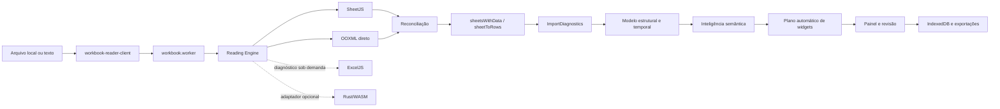

# Auditoria do estado atual — 2026-08-13

Base auditada: `main` em `4ec3ae0`, imediatamente antes da primeira correção
desta etapa. O código e os testes são a fonte de verdade; este documento registra
o mapa, as lacunas e a ordem recomendada de evolução.

## Resumo executivo

O projeto já possui uma arquitetura de leitura em camadas: SheetJS como leitor
principal, inspeção OOXML direta, ExcelJS como verificador sob demanda e um
contrato opcional para Rust/WASM. A importação preserva uma grade de origem
limitada para revisão, representações especiais de células, fórmulas, períodos,
comentários, regiões e diagnósticos. A geração automática de widgets ocorre
depois da importação e da classificação semântica.

As três maiores lacunas são: o inventário OOXML ainda não cobre vários recursos
estruturais, a pontuação de fidelidade não diferencia tudo que foi validado do
que não é suportado, e o parsing OOXML ainda descompacta e percorre XML inteiro
em memória. Antes desta etapa, a reconciliação também ignorava silenciosamente
uma aba inteira ausente no leitor principal. A primeira implementação corrige
essa perda.

## 1. Mapa da arquitetura atual

| Camada               | Componentes principais                                                    | Responsabilidade atual                                                   |
| -------------------- | ------------------------------------------------------------------------- | ------------------------------------------------------------------------ |
| Entrada              | `workbook-reader-client.ts`, `workbook.worker.ts`                         | valida tamanho, transfere bytes e publica progresso                      |
| Segurança            | `workbook-reader.ts`                                                      | limites de ZIP, abas, células e formatos de texto                        |
| Leitores             | `workbook-reader.ts`, `ooxml-reader.ts`, `workbook-verifier.ts`           | SheetJS, OOXML direto e verificação ExcelJS                              |
| Motor                | `workbook-reading-engine.ts`                                              | tempos, leitor usado, fallback e ponto de extensão WASM                  |
| Importação           | `import.ts`                                                               | cabeçalhos, mesclagens, linhas ocultas, blocos e formatos especializados |
| Diagnóstico          | `import-intelligence.ts`, `quality-audit.ts`                              | fórmulas, tipos, regiões, notas, qualidade e confiança                   |
| Modelo intermediário | `spreadsheet-intelligence.ts`, `structural-model.ts`, `temporal-model.ts` | células canônicas, papéis semânticos, regiões e períodos                 |
| Visualização         | `auto-dashboard.ts`, `widgets.ts`, `operational-widgets.ts`               | recomendações explicáveis e widgets por estrutura                        |
| Orquestração         | `routes/index.tsx`                                                        | revisão, painel, filtros, configurações e exportações                    |
| Persistência         | `storage.ts`, `encrypted-backup.ts`                                       | IndexedDB local e backup criptografado                                   |

O grafo estrutural existente confirma os maiores pontos de acoplamento:
`types.ts`, `routes/index.tsx`, `import-intelligence.ts`,
`spreadsheet-intelligence.ts`, `import-workbench.ts`, `data-pipeline.ts`,
`widgets.ts`, `import.ts` e `auto-dashboard.ts`.

## 2. Lacunas de fidelidade

| Prioridade                | Lacuna                                                                      | Evidência                                                                                                                                       | Impacto                                                                                           |
| ------------------------- | --------------------------------------------------------------------------- | ----------------------------------------------------------------------------------------------------------------------------------------------- | ------------------------------------------------------------------------------------------------- |
| P0, corrigida nesta etapa | Aba ausente era ignorada pela reconciliação                                 | `compareAndRepairWithOoxml` seguia para a próxima aba quando `primary.Sheets[name]` não existia                                                 | perda silenciosa de aba e pontuação enganosa                                                      |
| P0, corrigida na seção 22 | Pontuação mede principalmente divergências celulares com severidade `error` | `fidelity-meter.ts` deduplica erros por endereço; avisos e recursos não suportados não entravam no denominador nem em lugar nenhum do relatório | “100%” podia significar apenas valores comparáveis sem erro                                       |
| P0                        | Inspeção OOXML usa `unzipSync` e regex sobre XML completo                   | `ooxml-reader.ts` e `workbook-metadata.ts` descompactam o pacote separadamente                                                                  | memória duplicada e risco em arquivos grandes                                                     |
| P1, sistema 1904 corrigido na seção 25 | Leitor OOXML não preserva colunas ocultas nem estado de abas          | `readSheet` lê linhas ocultas e formatos, mas não `cols` nem `sheet state`; `workbookPr date1904` já é lido e propagado            | visibilidade ainda pode divergir no fallback; datas já respeitam o sistema 1904                   |
| P1                        | Estilo preservado é principalmente formato numérico/texto exibido           | `ReaderCell` não carrega preenchimento, fonte, borda ou proteção                                                                                | cores com significado não entram na reconciliação                                                 |
| P1                        | Limites de diagnósticos truncam sem contabilizar excedente                  | divergências: 2.000; representações/notas: 500; períodos: 2.000                                                                                 | auditoria pode parecer completa quando foi limitada                                               |
| P1                        | ExcelJS não participa do fluxo normal de cada importação                    | é usado por `fidelity-meter.ts` e testes, não pelo worker de leitura                                                                            | terceira opinião existe apenas sob demanda                                                        |
| P2                        | Recursos OOXML apenas detectados ou ainda não inventariados                 | tabelas e pivôs são diagnosticados; imagens, gráficos nativos, validações, nomes definidos, links externos e desenhos não têm modelo completo   | o valor visível pode sobreviver, mas o recurso não é explicável                                   |
| P2                        | Fórmulas entre abas e funções fora da lista dependem do cache               | `formula.ts` recusa referências externas/entre abas não suportadas                                                                              | resultado sem cache fica indisponível, corretamente sem invenção                                  |
| P2                        | Abas vazias são removidas da lista analítica                                | `sheetsWithData` retorna somente opções com linhas                                                                                              | útil para painel, mas exige inventário separado para afirmar que todas as abas foram reconhecidas |

“Não suportado” deve virar um estado explícito na auditoria; não deve reduzir
automaticamente a nota como “incorreto”, nem ser contado como “validado”.

## 3. Inventário de formatos e recursos

### Formatos aceitos

- Excel/OOXML: XLSX, XLSM, XLSB, XLS, XLTX e XLTM.
- OpenDocument: ODS e FODS.
- Texto: CSV, TSV e TXT, com detecção de delimitador e codificação.
- Outros leitores SheetJS: XML, HTML/HTM e Numbers.

### Recursos preservados ou diagnosticados

- abas e células com valor bruto, texto exibido e formato numérico;
- fórmulas e valores armazenados, com recálculo local limitado e seguro;
- datas e períodos, incluindo meses nomeados e cabeçalhos temporais;
- células mescladas e cabeçalhos hierárquicos;
- linhas ocultas excluídas de registros/widgets, mas preservadas na origem;
- colunas ocultas detectadas em diagnóstico;
- comentários e blocos textuais de observação;
- filtros, tabelas estruturadas, colunas calculadas e tabelas dinâmicas em diagnóstico;
- regiões independentes, blocos repetidos, formulários, matrizes e cronogramas;
- origem por aba/endereço nas células canônicas e nas exceções;
- limites de ZIP, dimensões, número de abas e células.

### Parcial ou não suportado de forma completa

- fills, fontes, bordas e cores semânticas na reconciliação;
- imagens, desenhos, objetos e gráficos nativos;
- validações de dados, agrupamentos/outlines e segmentações;
- nomes definidos, links externos e hyperlinks como inventário rastreável;
- macros VBA: nunca executadas e ainda sem inventário detalhado;
- recálculo integral de fórmulas do Excel;
- arquivos XLS/Numbers/ODS parcialmente corrompidos sem leitor alternativo;
- auditoria de abas vazias/ocultas separada das opções analíticas.

## 4. Matriz de cobertura dos leitores

Legenda: **P** principal, **V** verificação/reconciliação, **D** diagnóstico sob
demanda/teste, **C** contrato sem implementação e **—** sem cobertura.

| Formato      | SheetJS | OOXML direto |   ExcelJS | Rust/WASM |
| ------------ | ------: | -----------: | --------: | --------: |
| XLSX         |       P |            V |         D |         C |
| XLSM         |       P |            V | D parcial |         C |
| XLTX/XLTM    |       P |            V | D parcial |         C |
| XLS/XLSB     |       P |            — |         — |         — |
| ODS          |       P |            — |         — |         D |
| FODS         |       P |            — |         — |         — |
| CSV/TSV/TXT  |       P |            — |         — |         — |
| XML/HTML/HTM |       P |            — |         — |         — |
| Numbers      |       P |            — |         — |         — |

| Recurso                | SheetJS |            OOXML direto |   ExcelJS | Resultado atual                 |
| ---------------------- | ------: | ----------------------: | --------: | ------------------------------- |
| valor e tipo           |       P |                       V |         D | reconciliado por endereço       |
| fórmula/cache          |       P |                       V | D parcial | preservado; recálculo limitado  |
| texto formatado/numFmt |       P |                       V |         D | comparável                      |
| mesclagens             |       P |                 parcial |         D | importador reconstrói estrutura |
| linhas ocultas         |       P |                       V |         D | removidas da saída analítica    |
| colunas ocultas        |       P |                       — |         D | apenas diagnosticadas           |
| comentários            |       P |                       — |         D | preservados via SheetJS         |
| tabelas/pivôs          | parcial | inventário complementar |   parcial | diagnóstico, sem recálculo      |
| estilos visuais        | parcial |                  numFmt |   parcial | sem reconciliação completa      |
| desenhos/gráficos      | parcial |                       — |   parcial | sem modelo intermediário        |

## 5. Riscos de regressão

1. `routes/index.tsx` concentra 41 relações e grande parte do estado visual;
   mudanças de widget podem afetar importação, filtros e persistência.
2. `import.ts` contém muitas heurísticas especializadas; uma regra genérica de
   cabeçalho ou região pode quebrar cronogramas e formulários já cobertos.
3. Mesclagens e preenchimento de valores exigem distinguir rótulo estrutural de
   observação; replicar texto longo cria dados falsos.
4. Linhas/colunas ocultas não podem alimentar widgets sem decisão explícita;
   a regressão `4s` prova o risco.
5. Datas dependem de valor, formato, texto exibido e fuso; usar apenas serial
   volta a criar anos ou dias errados.
6. A promoção do WASM sem corpus de paridade pode trocar um fallback estável por
   um leitor mais rápido, porém menos fiel.
7. Limites de amostragem para UI não podem ser reutilizados pela auditoria.
8. A separação automática de regiões pode dividir uma tabela com espaçadores ou
   misturar blocos se a confiança não for respeitada.

## 6. Gargalos de desempenho

- O parsing principal já roda em worker, mas SheetJS, `inspectOoxml` e
  `attachWorkbookFeatures` podem descompactar/percorrer o mesmo arquivo em fases
  distintas.
- `unzipSync` mantém o pacote expandido inteiro em memória; XML streaming ainda
  não existe.
- `sheetMeta` percorre toda a dimensão declarada, inclusive células vazias, para
  contar fórmulas e montar diagnósticos. Dimensões infladas custam CPU mesmo sob
  o limite global.
- O armazenamento de representações, notas e períodos tem limites, mas o laço
  continua percorrendo a dimensão completa.
- `routes/index.tsx` continua sendo o maior chunk e o maior ponto de renderização.
- Baseline medido: `workbook.worker` 442,86 kB; maior chunk inicial 302,03 kB;
  XLSX tardio 492,63 kB; Leaflet tardio 813,55 kB.
- O orçamento de produção passa, mas o build alerta para módulos acima de 500 kB
  no servidor; esses módulos devem permanecer fora do caminho inicial.

Métricas que ainda precisam ser registradas por importação: bytes compactados e
expandidos, células realmente visitadas, pico estimado de memória, tempo por
leitor, tempo de reconciliação, truncamentos de diagnóstico e cancelamento.

## 7. Plano incremental para o núcleo Rust

1. Congelar um contrato JSON versionado para inventário de workbook, abas,
   dimensões, visibilidade e limites de recursos.
2. Criar crate isolado, sem integrar a UI, usando ZIP com limites e XML pull/stream.
3. Entregar primeiro apenas inventário OOXML: partes, abas, relações, estado,
   sistema de datas e dimensões declaradas/reais.
4. Adicionar shared strings, células, fórmulas/cache, numFmt, mesclagens e regiões
   ocultas, mantendo valores bruto e exibido separados.
5. Compilar para WASM e implementar o contrato já aceito por
   `registeredWasmWorkbookReader`.
6. Executar Rust e TypeScript lado a lado; nunca promover o resultado Rust antes
   da paridade por formato e fixture.
7. Acrescentar comentários, hyperlinks, tabelas, pivôs, desenhos e nomes
   definidos como inventário, sem executar conteúdo.
8. Medir tempo, memória e tamanho WASM; promover por formato com fallback.

Bibliotecas devem ser escolhidas por cobertura e manutenção, não por
popularidade. Critérios mínimos: ZIP com limites, XML streaming sem entidades,
Serde, WASM estável, datas 1900/1904, fórmulas/cache, estilos e relações OOXML.

## 8. Plano de testes de paridade

1. Definir manifesto JSON por fixture com hash, abas, estados, dimensões reais,
   células críticas, fórmulas, mesclagens, ocultos, notas e recursos conhecidos.
2. Rodar SheetJS, OOXML TypeScript, ExcelJS e Rust sobre os mesmos bytes.
3. Comparar existência, tipo, bruto, cache, display, fórmula, numFmt, visibilidade,
   comentário e hyperlink por endereço.
4. Classificar cada diferença como incorreta, representação equivalente,
   não suportada ou não validável.
5. Exigir zero perda silenciosa e registrar todo truncamento.
6. Manter fixtures sintéticas pequenas para cada recurso e fixtures reais apenas
   locais/sanitizadas, sempre com `skipIf` seguro.
7. Cobrir arquivos pequeno, largo, profundo, muitas abas, estilos vazios,
   mesclagens, fórmulas, corrompido e ZIP bomb simulada segura.
8. Coletar tempo e memória por leitor; falha de desempenho não deve alterar a
   decisão de fidelidade.

Gate de promoção Rust: todos os manifests críticos iguais ou com divergências
explicitamente aceitas, sem regressão de segurança, e ganho medido no corpus de
arquivos grandes.

## 9. Três melhorias de maior impacto

1. **Relatório de fidelidade explicável:** separar validado, divergente,
   reparado, não suportado e truncado por aba/bloco/célula.
2. **Inventário OOXML seguro e único:** uma descompactação limitada, XML
   streaming e cobertura de visibilidade, datas 1904, relações e recursos.
3. **Núcleo Rust em shadow mode:** inventário e células lado a lado com o motor
   atual, promovidos apenas após paridade.

## 10. Primeira implementação mensurável

A reconciliação agora recupera uma aba inteira encontrada pelo OOXML e ausente
no SheetJS. A aba é anexada ao workbook principal e cada célula recuperada gera
uma `ReaderDivergence` com aba, endereço, valor independente, severidade `error`
e `repaired: true`.

Prova sintética adicionada em `workbook-fidelity.test.ts`:

- começa com workbook principal sem abas;
- reconcilia contra a fixture pública OOXML;
- confirma a restauração de `Cabeçalho deslocado`;
- confirma o valor `Data` em `A4`;
- confirma diagnóstico rastreável e reparado para `A4`.

Resultado mensurável: o cenário passou de **zero abas e zero divergências
registradas** para **aba restaurada e uma divergência reparada por célula de
origem**. O limite global de 2.000 divergências continua sendo uma lacuna a ser
tratada no relatório de fidelidade.

## Baseline de validação

Antes da mudança, no ambiente Windows isolado:

- TypeScript: aprovado;
- build de produção: aprovado após evitar o mapeamento de unidade de rede do
  Vite, uma limitação do sandbox;
- testes: 45 arquivos, 42 aprovados e 3 ignorados com segurança; 388 testes
  aprovados e 11 ignorados;
- lint: 10 diferenças de formatação preexistentes em 5 arquivos, a normalizar
  antes da publicação desta etapa.

O briefing citava 404 testes. O checkout atual em `4ec3ae0` possui 399 testes
contabilizados antes desta implementação; a nova regressão eleva o inventário
para 400. A diferença deve ser tratada como mudança de inventário, não como
evidência automática de perda de cobertura.

Após a implementação e a normalização estritamente mecânica dos cinco arquivos:

- testes: 45 arquivos, 42 aprovados e 3 ignorados; 389 testes aprovados e 11
  ignorados, total de 400;
- TypeScript: aprovado;
- ESLint/Prettier: aprovado com adaptação de fim de linha do checkout Windows;
- build de produção: aprovado;
- orçamento de desempenho: aprovado;
- dependências de produção: zero vulnerabilidades no `npm audit --omit=dev`;
- dependências de desenvolvimento: duas vulnerabilidades moderadas herdadas de
  `exceljs -> uuid`, sem correção disponível no inventário atual.

## 11. Núcleo Rust de inventário OOXML — fase 1

O primeiro recorte do plano incremental foi implementado no crate isolado
`rust/oli-ooxml-core`, ainda fora do leitor produtivo e do adaptador WASM. O
contrato JSON `1.0.0` está congelado em
`contracts/ooxml-inventory.schema.json`.

Cobertura entregue:

- validação prévia de quantidade de entradas, tamanho individual e agregado,
  razão de compactação, criptografia e caminhos inseguros/duplicados no ZIP;
- leitura XML orientada a eventos, limitada também por número de eventos;
- ordem, nome, identificador, relação, caminho e estado
  `visible`/`hidden`/`veryHidden` das abas;
- sistema de datas 1900/1904;
- dimensão declarada e dimensão real calculada pelas referências de células;
- métricas do pacote, limites aplicados e diagnósticos estruturados;
- CLI JSON para inspeção local e workflow dedicado no GitHub.

Os testes incluem fixture sintética com abas ocultas e data 1904, caminho ZIP
inseguro, limite de recurso reduzido e paridade de inventário com
`test-fixtures/problematic-import.xlsx`. A fase seguinte de shared strings,
células, fórmulas/cache e formatos é registrada abaixo; o crate ainda não foi
compilado para WASM nem executado lado a lado com o leitor atual.

## 12. Núcleo Rust de células OOXML — fase 2

O crate `oli-ooxml-core` passou a emitir o contrato JSON `2.0.0`. A mudança de
versão é intencional porque cada aba agora inclui o inventário de células, além
dos metadados da fase 1.

Cobertura acrescentada:

- shared strings simples e rich text, preservando a concatenação dos trechos;
- strings inline, strings armazenadas, números, booleanos, erros e datas ISO;
- fórmula separada do valor em cache, mantendo `rawValue` e `displayValue`;
- índice de estilo, formatos numéricos nativos conhecidos e formatos customizados;
- exibição conservadora para inteiros, decimais e percentuais, sem inventar a
  renderização de formatos Excel ainda não implementados;
- limites de 2 milhões de células, 2 milhões de shared strings e 256 MiB de
  texto por parte XML, além dos limites de ZIP e eventos já existentes;
- rejeição de entidades XML não predefinidas, mantendo DOCTYPE proibido.

A paridade da fixture pública agora verifica também as 34 células da primeira
aba, o cabeçalho `A4`, a fórmula `G5` e seu cache numérico. A fixture sintética
cobre rich text, entidade XML, booleano, percentual, formato customizado, erro
e data. O crate permanece fora do caminho produtivo; a cobertura de
datas/formatos, mesclagens e regiões ocultas foi concluída abaixo antes do
adaptador WASM em shadow mode.

## 13. Núcleo Rust de fidelidade estrutural OOXML — fase 3

O contrato JSON passa para `3.0.0`, pois cada aba agora exige também os campos
`mergedRanges`, `hiddenRows` e `hiddenColumns`. O crate passa da versão `0.2.0`
para `0.3.0` e continua isolado do caminho produtivo.

Cobertura acrescentada:

- conversão de datas seriais nos sistemas Excel 1900 e 1904, preservando o
  valor numérico bruto e emitindo `dateValue` local normalizado;
- tratamento explícito do dia fictício 29/02/1900: a exibição compatível é
  preservada, o valor ISO inválido não é emitido e um diagnóstico é registrado;
- reconhecimento conservador de formatos de data/hora, formatos nativos 14–22
  e 45–47, duração `[h]:mm:ss` e formatos customizados comuns;
- inventário validado de mesclagens, linhas ocultas e intervalos compactos de
  colunas ocultas, sem expandir intervalos potencialmente grandes;
- limite configurável de 500 mil registros estruturais por aba, somado aos
  limites de células, texto, eventos XML e pacote ZIP;
- regressões sintéticas para data 1904, duração, formato customizado, mesclagem,
  estruturas ocultas e limite reduzido, além da paridade estrutural da fixture
  pública.

A etapa de compilação e shadow mode foi concluída abaixo.

## 14. Adaptador WASM em shadow mode — fase 4

O crate `oli-ooxml-core` passa à versão `0.4.0` e gera um módulo WebAssembly
para navegador. O contrato de inventário permanece `3.0.0`; não houve mudança
incompatível na saída JSON.

Integração entregue:

- exportação `inventory_ooxml_json` restrita ao alvo `wasm32`, mantendo a API
  Rust nativa e a CLI existentes;
- pacote web gerado por `wasm-pack --target web`, versionado em `src/wasm` para
  que o deploy da Vercel não dependa de uma toolchain Rust;
- registro automático dentro do worker de leitura para XLSX, XLSM, XLTX e XLTM;
- execução somente depois que SheetJS e o verificador OOXML TypeScript já
  produziram o resultado validado;
- comparação de nomes de abas e, por endereço, valor bruto, texto exibido e
  fórmula, com tolerância numérica mínima;
- relatório separado de disponibilidade, estado (`matched`, `diverged`,
  `failed` ou `unavailable`), tempo, células comparadas, células/abas divergentes
  e versão do contrato;
- falha, contrato inválido ou divergência no WASM nunca altera linhas, reparos,
  diagnósticos produtivos nem impede a importação;
- smoke test do binário real contra `problematic-import.xlsx`, além de testes de
  paridade simulada e de falha não bloqueante;
- CI ampliada com compilação para `wasm32-unknown-unknown` e execução do smoke
  test sobre o artefato versionado.

O próximo passo seguro é coletar a distribuição das divergências no corpus de
produção e definir critérios objetivos de promoção por formato antes de permitir
que o Rust participe do resultado produtivo.

## 21. Inventário ODS complementar — fase 11

O crate `oli-ooxml-core` ganhou um segundo leitor, isolado do fluxo XLSX, para
OpenDocument Spreadsheet (ODS), o formato universal ISO/IEC 26300 que hoje só
tinha cobertura via SheetJS no caminho TypeScript (linha "ODS" da matriz de
formatos, coluna Rust/WASM: de contrato sem implementação para diagnóstico
testado). O contrato JSON continua `3.0.0`; o campo `format` passa a aceitar
`"ooxml"` ou `"ods"`, mantendo o restante do formato do inventário.

Cobertura entregue pelo módulo `src/ods.rs`:

- reaproveita a validação de pacote ZIP, os limites de recursos e o modelo de
  inventário (abas, dimensões, mesclagens, ocultos, células) já usados pelo
  núcleo OOXML, sem duplicar a lógica de segurança;
- abas, células tipadas (texto, número, booleano, data/hora, percentual,
  moeda), fórmulas (`table:formula`, normalizadas para o mesmo prefixo `=`
  usado no XLSX) e mesclagens por `number-columns/rows-spanned`;
- colunas e linhas ocultas via `table:visibility="collapse"/"filter"`;
- datas ODF já vêm como texto ISO em `office:date-value`; quando o arquivo
  grava só a data, o horário é normalizado para meia-noite para manter o
  mesmo formato `dateValue` do contrato compartilhado.

Células e linhas repetidas (`table:number-columns-repeated`,
`table:number-rows-repeated`, usadas pelo ODF sobretudo para preencher
espaço vazio à direita/abaixo, com contadores que podem chegar a centenas
de milhares) são representadas de forma **compacta e sem perda**: cada
bloco retangular de células idênticas vira um único registro de célula com
os novos campos `repeatColumns`/`repeatRows` (contrato JSON, ambos
opcionais, omitidos quando o valor é 1). `actualDimension` e a contagem de
células da aba refletem a extensão lógica real do bloco, não apenas a
âncora — corrigindo uma limitação da primeira versão deste leitor, em que
somente a primeira ocorrência era materializada e a dimensão/contagem
podiam parecer menores que a estrutura declarada. O custo de processar um
bloco repetido continua O(1) por elemento do XML (nenhum laço proporcional
ao contador de repetição), e o limite de células do pacote passa a ser
aplicado sobre a extensão lógica total, não sobre o número de registros
JSON.

Testes em `tests/ods_inventory.rs` cobrem tipos de célula e dimensão real,
fórmula e mesclagem preservadas com linha/coluna oculta, e a representação
compacta de blocos repetidos (incluindo um caso de 1.000.000 de linhas
repetidas vazias), confirmando `repeatColumns`/`repeatRows`, a dimensão
real completa e a contagem de células lógica — sem materializar nem
descartar nenhuma célula.

O leitor ODS ainda não está integrado ao `workbook.worker` nem ao adaptador
WASM em shadow mode; é uma capacidade isolada do crate, seguindo a mesma
progressão incremental usada para o XLSX (fases 1 a 10 acima) antes de
qualquer integração no caminho produtivo. Os próximos passos seguros são:
compilar para `wasm32-unknown-unknown`, expor `inventory_ods_json` ao
worker como leitor adicional (não substituto do SheetJS) e só então avaliar
paridade contra um corpus real de arquivos ODS sanitizados.

## 22. "Não suportado" como estado explícito na pontuação de fidelidade

Corrige a lacuna P0 registrada na seção 2: `fidelity-meter.ts` deduplicava
apenas divergências de severidade `error` num único mapa e descartava
qualquer coisa de severidade `warning` sem registrar em lugar nenhum do
relatório. Um score de 100% podia então significar tanto "tudo comparado e
igual" quanto "vários avisos silenciados". Não havia, além disso, nenhum
jeito de o relatório dizer que fills, imagens, validações de dados, nomes
definidos/hyperlinks, macros VBA e recálculo integral de fórmulas nunca são
comparados célula a célula por nenhum leitor — esses recursos eram
invisíveis ao medidor de fidelidade, nem contados como validados nem como
divergentes.

`WorkbookFidelityReport` ganhou dois campos, sem alterar a fórmula da
pontuação nem o campo `divergences` existente (que continua sendo apenas
erros, preservando os testes de meta mínima de 99%):

- `warnings`: as divergências de severidade `warning`, deduplicadas por
  endereço como antes, agora visíveis em vez de descartadas;
- `unsupportedFeatures`: lista estática e explícita dos recursos da seção 3
  que nenhum leitor reconcilia hoje. Por decisão de projeto, "não suportado"
  não soma nem subtrai da pontuação — é um estado próprio, nem "validado"
  nem "incorreto", como já estava registrado como princípio neste documento
  mas ainda não implementado.

Teste adicionado em `workbook-fidelity.test.ts` confirma que `warnings` só
contém severidade `warning`, que `divergences` só contém severidade `error`
e que `unsupportedFeatures` inclui "Macros VBA". Nenhum consumidor de
produção usa `fidelity-meter.ts` hoje (só os dois arquivos de teste), então
a mudança de forma do retorno não tem risco de regressão na UI.

## 15. Medição de corpus e gate de promoção — fase 5

O shadow mode agora possui amostragem determinística configurável por
`VITE_WASM_SHADOW_SAMPLE_RATE`. Arquivos fora da amostra são identificados como
`sampled-out`; o Rust continua sem alterar o resultado produtivo em qualquer
estado.

O binário WASM real passou a integrar um teste de corpus no Vitest e na CI. A
medição registra contrato, tempo, células comparadas, células divergentes e abas
divergentes. O avaliador agrega essas observações, calcula taxa de divergência e
latência p95 e informa todos os motivos que impedem a promoção.

Os critérios padrão exigem contrato `3.0.0`, no mínimo 25 arquivos e 10.000
células, zero falhas e divergências e p95 de até 1.500 ms. A fixture pública
isolada é deliberadamente classificada como corpus insuficiente. Os critérios e
o processo de decisão estão documentados em `docs/WASM_PROMOTION_CRITERIA.md`.

## 16. Corpus reproduzível e paridade estrutural — fase 6

O corpus WASM agora é gerado de forma determinística a partir de um manifesto
versionado. São 25 arquivos XLSX e 13.200 células cobrindo strings, números,
booleanos, fórmulas, datas nos sistemas 1900/1904, mesclagens e regiões ocultas.
Os binários gerados não são versionados; a CI os recria e publica o relatório de
medição como artefato.

O inspetor OOXML TypeScript passou a preservar mesclagens, linhas ocultas e
colunas ocultas também no workbook de fallback. O shadow mode confronta essas
estruturas com o inventário Rust e reporta quantidades comparadas e divergentes.

Na medição de referência, os 25 arquivos, 13.200 células e 24 estruturas tiveram
paridade total, sem falhas ou divergências e com p95 abaixo do limite. O gate
permanece corretamente bloqueado: corpus sintético comprova cobertura, mas a
promoção exige pelo menos cinco arquivos reais sanitizados por formato.

## 17. Sanitização local do corpus real — fase 7

Foi adicionado um fluxo local e determinístico para transformar planilhas XLSX
reais em fixtures adequadas à medição de paridade sem versionar originais ou
cópias. Textos, números, datas, nomes de abas e literais de fórmula são
pseudonimizados; metadados, links, comentários, nomes definidos, macros e
referências externas são removidos ou neutralizados.

O sanitizador preserva os tipos das células, fórmulas internas, formatos,
mesclagens e regiões ocultas. Ele aceita somente XLSX, exige chave local via
ambiente, não altera a origem e recusa destinos não vazios. O manifesto gerado
não contém nomes ou caminhos de origem nem a chave. Quando presente em
`test-fixtures/sanitized-real`, o corpus local passa a integrar automaticamente
o relatório e o gate por formato; a CI continua usando apenas as fixtures
sintéticas reproduzíveis.

## 18. Candidate mode com fallback automático — fase 8

Foi preparado o controle de ativação gradual do Rust/WASM para XLSX. O padrão
continua sendo `shadow`, e a allowlist de formatos nasce vazia. Apenas a
combinação explícita de `VITE_WASM_READER_MODE=candidate` com
`VITE_WASM_CANDIDATE_FORMATS=xlsx` permite que um match integral seja marcado
como `sheetjs-wasm-verified`.

Candidate mode mede 100% dos arquivos do formato liberado, independentemente da
taxa de shadow. Contrato incompatível, divergência, falha do adaptador ou
indisponibilidade acionam fallback automático para o leitor TypeScript validado.
O relatório registra modo, estado do candidato e motivo do fallback. O inventário
Rust ainda não cria, substitui ou repara células; publicar a allowlist continua
condicionado ao gate real sanitizado e a uma decisão humana por formato.

## 19. XLSX Rust/WASM primário com fallback validado — fase 9

O modo candidato e a allowlist `xlsx` passaram a ser os padrões. O inventário
Rust agora é materializado como workbook e percorre o pipeline real de
importação. Sua saída só é usada quando células, estruturas e o resultado final
são idênticos ao caminho TypeScript, sendo identificada como `rust-wasm`.

Filtros, tabelas, comentários e links já validados são preservados na
materialização. `VITE_WASM_READER_MODE=shadow` continua disponível como rollback
imediato. O corpus real sanitizado ainda é necessário antes de remover a
validação dupla e obter ganho efetivo de desempenho.

## 20. Metadados OOXML independentes no candidato Rust — fase 10

O workbook materializado pelo inventário Rust deixou de copiar metadados do
workbook SheetJS. Filtros automáticos, tabelas estruturadas, Pivot Tables,
comentários clássicos e hyperlinks internos ou externos agora são reconstruídos
diretamente das partes e relacionamentos do pacote XLSX.

O leitor TypeScript continua executando como oráculo de paridade e fallback: a
saída Rust somente é publicada quando o resultado final permanece idêntico. Isso
remove um acoplamento da materialização sem antecipar a promoção independente,
que ainda depende de cinco arquivos XLSX reais sanitizados e do gate completo.

## 23. Duas falhas reais encontradas com planilhas de produção

Seis arquivos XLSX reais fornecidos pelo usuário (fora do repositório, nunca
versionados) foram medidos com `measureWorkbookFidelity`. Três continham
apenas texto/números e já fechavam em 100% com zero divergências. Os outros
três — todos contendo imagens/logotipos — expuseram duas falhas que nenhum
teste sintético havia coberto:

1. **`verifyWorkbookWithExcelJs` derrubava a medição inteira.** ExcelJS tem
   bugs conhecidos ao carregar certos desenhos/âncoras de imagem em XLSX real
   (`Cannot read properties of undefined (reading 'name')` e `(reading
'anchors')`, lançados de dentro de `workbook.xlsx.load`). Como
   `measureWorkbookFidelity` não capturava essa exceção, o relatório inteiro
   quebrava — nenhuma pontuação, nenhum diagnóstico, só um erro não tratado.
   Corrigido isolando a chamada em `try/catch`: uma falha de leitor agora vira
   `failedReaders: ["ExcelJS"]`, um estado explícito e visível, em vez de
   "0 divergências" silencioso ou um crash. Como nenhum código de produção usa
   `ExcelJS` no caminho de importação (só `fidelity-meter.ts` e testes), não
   havia risco de regressão na UI, mas a medição em si ficava inutilizável
   para esses arquivos.
2. **`ooxml-reader.ts` não decodificava referências numéricas de caractere.**
   A função `xmlText` só tratava as cinco entidades nomeadas do XML (`&lt;`,
   `&gt;`, `&quot;`, `&apos;`, `&amp;`). Referências numéricas válidas
   (`&#199;`, `&#xC7;`) — usadas por algumas ferramentas de exportação para
   acentos — passavam intactas, produzindo texto corrompido como
   `SOLICITA&#199;&#213;ES` em vez de `SOLICITAÇÕES`. Isso gerava até 850
   avisos por arquivo real. Corrigido com decodificação hex/decimal antes do
   `&amp;` final, preservando o caso em que `&amp;#38;` é texto escapado de
   propósito (não deve virar `&`).

Testes de regressão: `workbook-fidelity.test.ts` cobre a decodificação
numérica com um pacote OOXML sintético mínimo; `fidelity-meter-resilience.test.ts`
mocka `verifyWorkbookWithExcelJs` para lançar e confirma que a medição
continua, reportando `failedReaders` em vez de propagar a exceção.

Depois das duas correções, os seis arquivos reais fecham em 100%, zero
divergências de erro. As diferenças de `\n` vs `\r\n` entre leitores
continuam aparecendo como `warning` — representação equivalente, não erro,
consistente com a regra já registrada neste documento.

## 24. Representação compacta de repetições e sistema de datas do ODS

Revisão da fase 11 (seção 21) apontou dois problemas antes de o leitor ODS
poder integrar o shadow mode:

1. **Perda de fidelidade em células/linhas repetidas.** A primeira versão
   materializava só a primeira ocorrência de um bloco repetido e descartava
   o resto com um diagnóstico de "truncagem". Isso fazia a dimensão real e
   a contagem de células parecerem menores que a estrutura declarada — o
   próprio problema que a seção 23 corrige para outro leitor, agora
   corrigido aqui na origem. `CellInventory` ganhou os campos opcionais
   `repeatColumns`/`repeatRows` (contrato compartilhado com o XLSX, que
   nunca os emite): um único registro representa um bloco retangular de
   células idênticas de forma compacta e sem perda, com `address` no canto
   superior esquerdo. `actualDimension` e a contagem de células da aba
   passaram a somar a extensão lógica real do bloco, não apenas a âncora.
   O custo de processar um bloco continua O(1) por elemento do XML — não é
   um laço de materialização, é aritmética sobre o tamanho declarado — e o
   limite de células do pacote agora é aplicado sobre essa extensão lógica.
   Os diagnósticos `ods-repeated-cell-truncated`/`ods-repeated-row-truncated`
   foram removidos por não haver mais truncagem para relatar.
2. **`dateSystem` afirmava "1900" para um formato que não usa esse
   conceito.** ODF grava data/hora como texto ISO 8601 direto; não há
   série numérica 1900/1904 a resolver. `DateSystem` ganhou a variante
   `NotApplicable` (JSON `"notApplicable"`), e o leitor ODS a emite em vez
   de um `Excel1900` que nunca é interpretado. `parse_excel_serial` trata
   essa variante devolvendo "sem data" em vez de assumir uma convenção
   Excel — ela nunca é chamada para ODS hoje, mas o comportamento fica
   seguro mesmo que isso mude.

`tests/ods_inventory.rs` foi atualizado: o teste de repetição agora chama-se
`represents_repeated_cells_and_rows_compactly_without_loss` e confirma
`repeatColumns`/`repeatRows`, a dimensão real completa e a contagem lógica
de células para um bloco de 5.000 colunas repetidas e uma linha repetida
10.000 vezes, sem descartar nada.

O leitor continua isolado do `workbook.worker`. Os itens restantes da
revisão — corpus real ODS sanitizado, e manter SheetJS como resultado
produtivo até paridade comprovada — seguem como pré-condição para
qualquer integração em shadow mode, na mesma ordem recomendada.

## 25. Etapa 5 — auditoria de corpus de regressão e duas falhas reais

Antes de ampliar fixtures, uma auditoria comparou 20 cenários de leitura
universal contra a suíte existente. Bem cobertos: cabeçalho deslocado,
múltiplas tabelas empilhadas/lado a lado, mesclagens, linhas/colunas
ocultas, células de erro, delimitadores de CSV ambíguos. Parciais: filtros
sem congelamento, fórmulas cacheadas vs. recalculadas, grandes planilhas
(só o caminho de rejeição), ZIP hostil (só limites de dimensão/tamanho),
codificação de CSV, ODS/XLS além de um smoke test básico. Lacunas claras:
cabeçalho repetido inline, sistema de datas 1904 no leitor OOXML
independente, shared strings rich text, imagens/gráficos incorporados.

Escrever os testes das duas primeiras lacunas expôs bugs reais, não só
ausência de cobertura:

1. **`ooxml-reader.ts` nunca lia `workbookPr date1904`.** `serialDate`
   sempre assumia o sistema 1900 (`XLSX.SSF.parse_date_code` sem opções).
   Num arquivo de origem Mac (1904), qualquer data reconciliada por este
   leitor — usado na reparação de abas/células ausentes e como referência
   do shadow mode — saía ~4 anos errada, silenciosamente. Corrigido lendo
   `date1904` do `workbookPr` em `inspectOoxml` e propagando para
   `serialDate` e `XLSX.SSF.format` (que também precisa da opção para
   exibir a data certa). Teste em `workbook-fidelity.test.ts` confirma
   serial `1` virando `1900-01-01`/`"1/1/00"` sem a flag e
   `1904-01-02`/`"1/2/04"` com ela.
2. **Repetição literal do cabeçalho no meio dos dados virava um registro
   de dado.** Relatórios paginados/exportados costumam repetir a linha de
   cabeçalho a cada quebra de página, sem linha em branco nem título
   separando um bloco novo — por isso a detecção de blocos empilhados (que
   já lida com um caso relacionado, mas diferente) não pegava esse caso.
   `sheetToRows` agora filtra uma linha de dado que repete o cabeçalho
   original em pelo menos duas colunas (exigência deliberada para não
   descartar por engano um item de catálogo que só coincide numa coluna),
   registra a contagem em `audit.repeatedHeaderRowsIgnored` e explica no
   aviso ao usuário, em vez de silenciosamente incluir
   `{"Nome": "Nome", "Valor": "Valor"}` como se fosse um registro.

A lacuna de shared strings rich text (múltiplos `<r>` num `<si>`) já
estava implementada corretamente (`sharedStrings` concatena todo `<t>`
dentro do `<si>`, dentro ou fora de `<r>`); ganhou um teste travando o
comportamento, sem precisar de correção. Imagens/gráficos incorporados
continuam como lacuna registrada na seção 3, não abordada nesta etapa.
