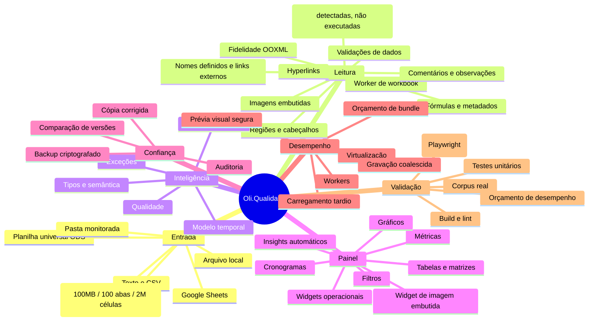
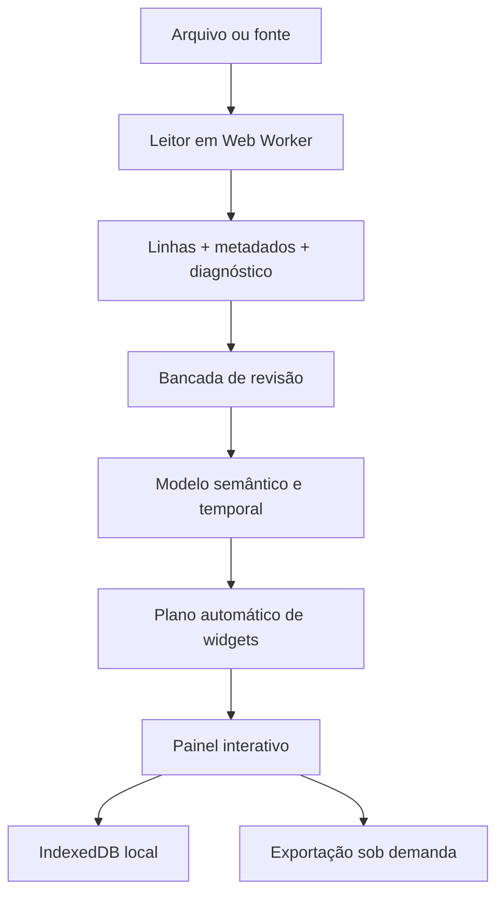

---
tags:
  - second-brain
  - oliqualidade
  - arquitetura
  - painel-central
aliases:
  - Second Brain
  - Mapa Mental
  - Oli.Qualidade
---

# Oli.Qualidade — Second Brain

Este documento é a fonte de orientação do projeto: explica o que existe, por
que existe, onde alterar e como provar que uma mudança não quebrou a leitura.
O código e os testes continuam sendo a fonte de verdade técnica.

A auditoria detalhada da base, lacunas, matriz de leitores e plano Rust está em
[[CURRENT_STATE_AUDIT|CURRENT_STATE_AUDIT.md]]. Este vault (`docs/`) é aberto
diretamente no Obsidian — ver [[#Como usar este vault no Obsidian]] antes de
editar, para manter os links e o Canvas funcionando.

## Como usar este vault no Obsidian

- **Vault = `docs/`**. `docs/.obsidian/` guarda a configuração local (grafo,
  canvas, backlinks e propriedades ligados) e é gitignored — não é
  compartilhado entre máquinas, só o conteúdo em Markdown/Canvas importa.
- **Wikilinks `[[...]]`** são preferidos a links Markdown relativos dentro
  deste vault: sobrevivem a renomear arquivo (Obsidian atualiza sozinho) e
  aparecem no painel de backlinks. Links para uma seção específica usam
  `[[CURRENT_STATE_AUDIT#74. Bug real de produto...]]` (título completo do
  `##`, sensível a como o heading está escrito no arquivo alvo).
- **Canvas como mapa mental navegável**: [[oliqualidade-mapa-mental.canvas]]
  é a versão interativa (zoom, arrastar, abrir nota com duplo clique) do
  mapa estático em [[#Mapa mental]] abaixo. `docs/*.canvas` é gitignored de
  propósito — é um artefato de navegação local, não fonte de verdade;
  reconstrua a partir deste documento se for perdido, não o contrário.
- **Tags** (`#pendente`, `#armadilha`, `#decisão`) aparecem no painel de tags
  do Obsidian e servem para filtrar rapidamente por tipo de conteúdo sem
  precisar abrir cada tabela.
- **Grafo de notas** (`graphify-out/graph.json`, gerado por
  `npm run graph:build`) é um artefato *derivado do código*, diferente do
  grafo do Obsidian (que é *derivado dos links entre notas Markdown*). Não
  confundir os dois: o grafo do Obsidian nunca vai mostrar dependências de
  módulo TypeScript, só a estrutura da documentação.

## Mapa mental



Versão navegável (zoom, arrastar, abrir arquivo com duplo clique):
[[oliqualidade-mapa-mental.canvas]].

## Fluxo principal



1. `workbook-reader-client.ts` valida tamanho e transfere a leitura pesada ao
   `workbook.worker`.
2. `workbook-reader.ts`, `ooxml-reader.ts`, `import.ts` e
   `import-intelligence.ts` preservam conteúdo, estrutura e diagnóstico.
3. A revisão permite selecionar abas/regiões, corrigir células e registrar
   auditoria antes de criar o painel.
4. `spreadsheet-intelligence.ts`, `structural-model.ts` e
   `temporal-model.ts` acrescentam significado sem alterar a origem.
5. `auto-dashboard.ts` recomenda widgets; `routes/index.tsx` coordena a
   experiência e a configuração manual.
6. `storage.ts` persiste localmente. Nenhuma planilha é enviada para IA sem a
   ação e os controles previstos no fluxo de análise inteligente.

## Glossário rápido

Para quem chega numa sessão nova e precisa de contexto rápido sem reler o
audit inteiro.

| Termo | Significado neste projeto |
| --- | --- |
| OOXML | Formato XML zipado por trás de `.xlsx`/`.xlsm` (Office Open XML). O leitor próprio (`ooxml-reader.ts`) parseia o XML bruto como segunda fonte, independente do SheetJS. |
| Fidelidade | Métrica célula-a-célula que compara o valor lido por dois motores (SheetJS vs. leitor OOXML próprio, ou TS vs. Rust). `UNSUPPORTED_FIDELITY_FEATURES` (`fidelity-meter.ts`) lista o que é deliberadamente fora dessa comparação. |
| Inventário rastreável | Um recurso do Excel (hyperlinks, nomes definidos, validações, imagens...) que deixou de ser só "lido mas ignorado" e passou a aparecer como painel `<details>` navegável em `review.tsx`. |
| `!oliAdvanced` | Convenção de nome de propriedade interna do SheetJS onde o projeto guarda metadados próprios extraídos do ZIP (não é uma API pública do SheetJS). |
| Reading Engine v2 | Camada de leitura com registro de leitor/tempo/divergência por importação, que aceita hoje SheetJS+OOXML e um adaptador Rust/WASM opcional (ver seção "Estado conhecido"). |
| Shadow mode | Rodar o leitor Rust/WASM em paralelo ao leitor TS sem afetar o resultado mostrado ao usuário, só para acumular evidência de divergência antes de promover. |
| `dataMode` (original/agregado) | Todo widget de gráfico guarda se está mostrando linha a linha (`raw`) ou uma operação de agregação (`sum`/`avg`/...) — nunca decide isso implicitamente. |
| `parseNumericValue` | Função central em `format.ts` para converter `Value` de célula em número tolerando vírgula decimal brasileira; substitui `Number(v)` direto em todo o código que lê valor de célula (ver [[CURRENT_STATE_AUDIT#74. Bug real de produto reportado pelo usuário: NaN generalizado por vírgula decimal brasileira, e widget novo para mostrar imagens embutidas]]). |
| Fachada de chunk | Quando o bundler (Rollup/Vite) escolhe um arquivo de primeira-parte como "nome" de um chunk compartilhado; mover código entre arquivos pode trocar a fachada e mudar o tamanho relatado sem mudar bytes reais. |
| `security-smoke` | Job de CI que testa cabeçalhos de segurança e CORS contra um servidor já de pé, usando um laço de `curl` — o mesmo padrão reaproveitado pelo job `e2e` via `OLI_E2E_BASE_URL`. |

## Onde mexer

| Necessidade                                 | Fonte principal                                                       | Prova mínima                                 |
| ------------------------------------------- | --------------------------------------------------------------------- | --------------------------------------------- |
| Novo formato ou fidelidade de Excel         | `workbook-reader.ts`, `ooxml-reader.ts`, `ooxml-archive.ts`, `import.ts` | fixture + teste de corpus                    |
| Inventário Rust de planilha universal (ODS) | `rust/oli-ooxml-core/src/ods.rs`                                      | `rust/oli-ooxml-core/tests/ods_inventory.rs` |
| Sanitização local de corpus real (para preencher o gate de promoção Rust/WASM por formato) | `scripts/workbook-sanitizer.mjs` (`sanitizeWorkbookBytes`, aceita `bookType` `xlsx`/`xlsm`/`xltx`/`xltm` — os dois últimos via patch pontual no `[Content_Types].xml` depois do `XLSX.write`, `TEMPLATE_CONTENT_TYPE_PATCH`), `scripts/sanitize-workbook-corpus.mjs` (CLI, `bookType` = extensão de origem) | `src/lib/workbook-sanitizer.test.ts` |
| Cabeçalhos, blocos e regiões                | `import.ts`, `structural-model.ts`                                    | `import.test.ts`                             |
| Tipos, fórmulas e semântica                 | `format.ts`, `formula.ts`, `spreadsheet-intelligence.ts`              | teste dedicado                               |
| Widget novo ou recomendação                 | `types.ts`, `widgets.ts`, `auto-dashboard.ts`, `components/oliam/widget-card.tsx` (dispatcher por `w.type`), `components/oliam/widget-support.tsx` (chrome/hooks compartilhados: `WidgetHead`, `EmptyWidget`, `FilterChip`, `WidgetDragProps`) | widgets + auto-dashboard                     |
| Corpo de um tipo específico de widget (todos os 14 tipos originais, exceto os que já delegavam pra componente lazy) | `components/oliam/{ranking,insights,rating,version-compare,pivot,exception-panel,schedule-heatmap,metric,chart}-widget-body.tsx` — cada um autocontido (`<article>`+`WidgetHead` próprios), chamado por `WidgetCard`; `chart-widget-body.tsx` cobre `bar`/`pie`/`line`/`area` juntos (compartilham estado de interação) | verificação manual no navegador (sem teste unitário ainda) |
| Rolagem horizontal por arrasto num gráfico (sparkline ou gráfico principal) | `components/oliam/use-chart-horizontal-scroll.tsx` — hook compartilhado, precisa ser `.tsx` (contém JSX do botão) | verificação manual no navegador |
| Coluna vazia entrando/saindo de métrica ou dimensão automática | `classifyDashboardColumn` (`auto-dashboard.ts`), `nums`/`fillRatio` em `createWidget`/`buildDefaultWidgets` (`widgets.ts`) | `auto-dashboard.test.ts`, `widgets.test.ts` |
| Painel de leitura guiada de categoria em destaque (comparação vs. maior outra categoria) | `pieComparisonFor` (`data-pipeline.ts`), `SeriesComparisonPanel` (`components/oliam/widget-support.tsx`) — genérico sobre `{name, total}[]`, usado hoje por pizza e barra | `data-pipeline.test.ts` (a função) + verificação manual do widget |
| Resumo de tendência (início→fim, mínimo, máximo, média) para séries temporais | `trendSummaryFor` (`data-pipeline.ts`), `TrendSummaryPanel` (`components/oliam/widget-support.tsx`) — usado por linha e área agrupada por data | `data-pipeline.test.ts` (a função) + verificação manual do widget |
| Cobertura do Top N no ranking (participação, categorias fora do ranking) | `rankingCoverageFor` (`data-pipeline.ts`), faixa inline no widget `ranking` (`components/oliam/widget-card.tsx`) | `data-pipeline.test.ts` (a função) |
| Quantas fatias o gráfico de pizza mostra (colapso Top 5 + Outros) | `collapsePieSeries` (`data-pipeline.ts`), chamado por `pieSeries` em `widget-card.tsx` — roda sempre, inclusive em modo "linha a linha" | `data-pipeline.test.ts` (`describe("collapsePieSeries")`) |
| Clique-para-filtrar em qualquer widget de gráfico | `handleGroupClick`/`toggleClickFilter` (`widget-card.tsx`) — todo widget com dimensão de agrupamento (barra, pizza, linha, área, ranking, mapa) chama direto no clique, sem botão intermediário; guarda especial só para "Outros" na pizza (agrupador sintético, não filtra) | verificação manual do widget + `data-pipeline.test.ts` (`toggleClickFilter`) |
| Widget de mapa (Leaflet) ou widgets operacionais (presença/validação/carta de controle/planejado×realizado) | `map-widget-body.tsx`, `operational-widget-body.tsx` — carregados via `React.lazy()`+`Suspense` em `widget-card.tsx`, fora do chunk comum | `npm run build` + `ANALYZE=1 npm run build` confirma o chunk separado |
| Inventário de hyperlinks do Excel por aba (endereço, destino, tooltip) | `parseHyperlinks`/`inspectWorkbookFeatures` (`workbook-metadata.ts`) extrai; `ImportDiagnostics.hyperlinks` (`import-intelligence.ts`) expõe; painel `<details>` em `review.tsx` lista | `import-intelligence.test.ts` (`!oliAdvanced` sintético) + `workbook-metadata.test.ts` (parsing) — ver [[CURRENT_STATE_AUDIT#68. Inventário de hyperlinks exposto na revisão (item de menor esforço da reauditoria da seção 50)]] |
| Inventário de nomes definidos (por escopo) e referências a arquivos externos | `parseDefinedNames`/`parseExternalLinks`/`inspectWorkbookFeatures` (`workbook-metadata.ts`); `ImportDiagnostics.definedNames`/`externalLinks` (`import-intelligence.ts`); dois painéis `<details>` em `review.tsx` | `import-intelligence.test.ts` + `workbook-metadata.test.ts` (escopo global vs. local, nomes `_xlnm.` ignorados) — ver [[CURRENT_STATE_AUDIT#69. Inventário de nomes definidos e links externos (próximo item por esforço da lista pendente)]] |
| Validações de dados do Excel por intervalo (lista, numérico, data etc.) | `parseDataValidations` (`workbook-metadata.ts`, lê `<dataValidation>` do próprio XML da aba); `ImportDiagnostics.dataValidations` (`import-intelligence.ts`); painel `<details>` em `review.tsx` | `import-intelligence.test.ts` + `workbook-metadata.test.ts` — ver [[CURRENT_STATE_AUDIT#70. Validações de dados do Excel (Data Validation), terceiro item da lista pendente]] |
| Detecção de macros VBA (presença apenas, nunca executadas) | `hasVbaMacros` (`workbook-metadata.ts`, `Boolean(zip["xl/vbaProject.bin"])`); `ImportDiagnostics.hasVbaMacros`; aviso em `warnings`, sem painel próprio (é um booleano, não uma coleção) | `import-intelligence.test.ts` + `workbook-metadata.test.ts` — ver [[CURRENT_STATE_AUDIT#71. Detecção de macros VBA, e correção de uma lista desatualizada pelas próprias seções 68-70]] |
| O que a métrica de fidelidade célula-a-célula deliberadamente não mede | `UNSUPPORTED_FIDELITY_FEATURES` (`fidelity-meter.ts`) — manter em sincronia com o que já virou inventário rastreável na revisão (hyperlinks/nomes definidos/links externos/validações não estão mais nesta lista; tabelas/pivôs nunca estiveram) | `workbook-fidelity.test.ts` (`unsupportedFeatures`) |
| Inventário de imagens embutidas (só `xdr:pic`, não formas/gráficos) | `parseImages` (`workbook-metadata.ts`, resolve aba→drawing→media em dois níveis de `.rels` encadeados); `ImportDiagnostics.images`; painel `<details>` em `review.tsx` | `import-intelligence.test.ts` + `workbook-metadata.test.ts` (cadeia completa de 3 relacionamentos) — ver [[CURRENT_STATE_AUDIT#72. Inventário de imagens embutidas (fecha a lista de itens de esforço maior pedidos pelo usuário nesta sessão)]] |
| Exportação (XLSX, cópia corrigida, CSVs, PDF de revisão, PNG/PDF do painel, backup criptografado e restauração) | `use-dashboard-export.ts` — hook, recebe `contentRef` de fora; `restoreEncryptedBackup` grava direto via `onRestore` (`p.update`), sem passar pelo undo/redo, de propósito | verificação manual do fluxo de exportação |
| Núcleo de undo/redo (pilha, `recordHistory`) | `use-undo-redo-history.ts` — hook | verificação manual (editar, desfazer, refazer) |
| Ações de widget (adicionar, copiar/colar, atualizar, remover, mover, reordenar) e `traceException` | `use-widget-actions.ts` — hook, recebe `setSearch`/`setSort`/`setFilters`/`setFocusedCell` como parâmetros porque `traceException` cruza todos eles; `canAdd` fica em `Dashboard` (só lê o pipeline, não muta nada) | verificação manual do fluxo de widgets |
| Mutações de dados da aba (filtros, colunas, overrides semânticos, decisões de exceção, correção de célula) | `use-sheet-mutations.ts` — hook, mesmo padrão de `use-widget-actions.ts`; todos os 7 mutadores chamam `recordHistory()` antes de mudar dado, preservando as duas guardas condicionais originais (`Object.is(before, after)` em `correctException`/`editTableCell`) | verificação manual (editar célula, desfazer) — ver [[CURRENT_STATE_AUDIT#84. Extraído \`useSheetMutations\`: os 7 mutadores de dados que sobravam soltos em \`Dashboard\`]] |
| Quanto foi filtrado na tabela detalhada | prop `totalRows` de `WidgetCard`, passado como `rulesApplied.length` em `routes/index.tsx` | `npx tsc --noEmit` confirma o único call site atualizado |
| Widget "Insights automáticos" (`insights`), narra achados em texto | `widget-card.tsx` (bloco `w.type === "insights"`), compõe `pieComparisonFor`/`rankingCoverageFor`/`detectQualitySignals` já testadas | `npx tsc --noEmit` (checklist completo de registro de `WidgetType` na seção 47 do audit) |
| Importação/revisão (UI)                     | `components/oliam/{home,empty,import-workbench,review}.tsx`          | `routes/index.tsx` orquestra via props        |
| Combinar planilha, apresentação, coluna calculada, marcadores, atalhos, notas de origem, diff de versão, dica de termos, regras ausentes, formatação, sinais de qualidade, chips de filtro, colunas (drag-and-drop), sidebars, paleta de comandos, revisão em segundo plano (UI/lógica do Dashboard) | `components/oliam/{join-sheet-dialog,presentation-mode,formula-column-editor,bookmark-panel,shortcuts-dialog,source-notes-panel,version-diff-banner,term-hint-banner,missing-rules-panel,format-panel,quality-signals-panel,filter-chips-bar,column-panel,dashboard-nav-sidebar,insight-sidebar,command-palette,use-background-review-analysis}.tsx` | extraídos de `Dashboard`; `tsc` pega referências órfãs se algo ficar pra trás |
| Cálculos e séries                           | `data-pipeline.ts`                                                    | `data-pipeline.test.ts`                      |
| Cronograma                                  | `schedule-normalizer.ts`, `operational-widgets.ts`                    | testes dos dois módulos                      |
| Revisão, auditoria e versões                | `data-review.ts`, `import-workbench.ts`, `review-export.ts`           | testes de revisão/exportação                 |
| Armazenamento e privacidade                 | `storage.ts`, `encrypted-backup.ts`                                   | storage/privacy + backup                     |
| IA                                          | `gemini-security.ts`, `gemini-server.ts`, `assistant-context.ts`      | segurança + contexto                          |
| Erro do servidor (500, recuperação de stack) | `error-capture.ts` (`AsyncLocalStorage` por requisição), `server.ts`  | `error-capture.test.ts`                      |
| Exportação PNG/PDF e tabelas                | `dashboard-export.ts`, `data-table-widget.tsx`, CSS `.oliam-export-*` | layout + teste de exportação                 |
| Desempenho                                  | workers, `latest-task-queue.ts`, CSS `.oliam-widget`, budgets         | `npm run verify`                             |
| Métricas de importação (leitor, tempo, bytes, fallback) | `import-metrics.ts`, `storage.ts` (`loadImportMetrics`/`saveImportMetrics`), painel em `components/oliam/import-diagnostics-dialog.tsx` | `import-metrics.test.ts`, `workbook-reader.test.ts` |
| Testes E2E reais de navegador | `e2e/*.spec.ts` (Playwright), `playwright.config.ts` — usar `OLI_E2E_BASE_URL` para apontar a um servidor já pronto (evita o probe nativo do Playwright, que colide com uma corrida real do dev server) | `npm run test:e2e`; CI roda em job próprio (`application.yml`, job `e2e`) — ver [[CURRENT_STATE_AUDIT#73. Primeiro teste E2E real (Playwright), e um bug real de corrida de hidratação SSR encontrado no processo]] |
| Interpretar um Value como número tolerando vírgula decimal brasileira, sem nunca virar NaN | `parseNumericValue` (`format.ts`) — usado em `fmt`, `evalFormula`, `resolveConditionalFormat`, e em todo `data-pipeline.ts`/`operational-widgets.ts`/`widget-card.tsx`/`format-rules-editor.tsx` que antes fazia `Number(valorDeCelula)` direto | `format.test.ts`, `data-pipeline.test.ts`, `operational-widgets.test.ts` |
| Widget "Imagem embutida" (`image`), mostra uma imagem da planilha original dentro do painel | `WorkbookImageDiagnostic.dataUrl` (`workbook-metadata.ts`, extraído por `parseImages`/`bytesToDataUrl`); `SheetData.sourceImages`; renderização em `widget-card.tsx` (`w.type === "image"`) | `widgets.test.ts` (`createWidget("image", ...)`), `workbook-metadata.test.ts` (EMF sem `dataUrl`) — ver [[CURRENT_STATE_AUDIT#74. Bug real de produto reportado pelo usuário: NaN generalizado por vírgula decimal brasileira, e widget novo para mostrar imagens embutidas]] |
| Inventário de formas nativas do Excel com texto (caixas de texto, retângulos com legenda) | `parseShapes`/`shapeText` (`workbook-metadata.ts`, só formas com `xdr:txBody` não vazio; conectores/decorativas sem texto ficam de fora); `ImportDiagnostics.shapes`; painel `<details>` em `review.tsx` | `workbook-metadata.test.ts` — ver [[CURRENT_STATE_AUDIT#76. Inventário de formas nativas com texto e gráficos nativos do Excel (item 2 do backlog, com achado novo de lacuna arquitetural)]] |
| Inventário de gráficos nativos do Excel (tipo + título, não recalculados nem renderizados) | `parseCharts`/`chartType`/`chartTitle` (`workbook-metadata.ts`, resolve `xdr:graphicFrame` → `c:chart r:id` → `xl/charts/chartN.xml`, mesma cadeia de `.rels` já usada por imagens); `ImportDiagnostics.charts`; painel `<details>` em `review.tsx` | `workbook-metadata.test.ts` (tipo desconhecido, título vinculado a célula vira `null`) — ver seção 76 do audit |
| Inventário de cor de preenchimento sólido por célula (só RGB direto) | `parseFillRgbByFillId`/`parseFillIdByCellXf`/`parseCellFills` (`workbook-metadata.ts`, cruza `xl/styles.xml` `<fills>`→`<cellXfs>` com o atributo `s` de cada `<c>`); `ImportDiagnostics.cellFills`; painel `<details>` em `review.tsx` | `workbook-metadata.test.ts` (RGB direto resolvido, cor de tema fica de fora) — ver [[CURRENT_STATE_AUDIT#79. Diagnosticado o widget "Matriz" mal configurado do usuário; inventário novo de cor de preenchimento de célula (metade 1 de 2)]] |
| Widget Tabela colorido com a cor original do Excel, em abas simples (sem linha pulada entre cabeçalho e dado) | `resolveSourceCellFills` (`cell-fill-provenance.ts`), calculado em `confirmReview`/`buildImportedSheets` (`routes/index.tsx`); `SheetData.sourceCellFills`; consumido em `DataTable` (`data-table-widget.tsx`, prioridade menor que `conditionalStyle` explícito) | `cell-fill-provenance.test.ts` (gates de segurança) + verificação ao vivo reproduzindo as cores do Excel original — ver [[CURRENT_STATE_AUDIT#80. Metade 2: cor de preenchimento original ligada ao widget Tabela, via rastreamento de endereço restrito a abas simples]] |
| Tolerância a namespace OOXML prefixada (`<x:dataValidation>`) e `Target` de relacionamento absoluto (`/xl/worksheets/sheet1.xml`) no inventário avançado | fragmento `NS` (`workbook-metadata.ts`, tolera prefixo opcional em toda regra da namespace principal do spreadsheetML) + `normalizePart` (usa `Target` direto quando começa com `/`, sem combinar com a pasta base) | `workbook-metadata.test.ts` (pacote OOXML mínimo prefixado+Target absoluto) — ver [[CURRENT_STATE_AUDIT#83. Usuário trouxe corpus sintético de 6 planilhas próprias: bug real de dois estágios no inventário avançado OOXML (namespace prefixada + Target absoluto)]] |
| Aba sem linha de dado (só gráficos/formas/imagens nativos do Excel) virar opção de importação e persistir o inventário no painel final | `hasVisualOnlyContent`/filtro em `sheetsWithData` (`import.ts`) + filtro espelhado em `prepare()` (`routes/index.tsx`); `SheetData.sourceCharts`/`sourceShapes`; `SourceVisualsPanel` (mesmo padrão de `SourceNotesPanel`) | `import.test.ts` (`sheetsWithData`) + `real-upload-validation.test.ts` (aba real "Tendência 2", 14 gráficos) — ver [[CURRENT_STATE_AUDIT#85. Abas só com gráficos/formas/imagens nativos (sem linha de dado tabular) agora são importáveis]] |
| Banner de título mesclado reconhecido mesmo quando o gerador repete o texto em toda célula da mesclagem (não só na célula de origem, como o Excel real serializa) | `bannerRows` em `sheetToRows` (`import.ts`) — segunda checagem além de `originalFilledCount === 1`: mesclagem de largura inteira com todas as células preenchidas iguais | `import.test.ts` — ver [[CURRENT_STATE_AUDIT#86. Usuário trouxe modelos .xltx reais em cima do mesmo corpus: cabeçalho hierárquico virava registro fantasma em planilha sem dado]] |
| Cabeçalho hierárquico (grupo + subcoluna) estende pra segunda camada mesmo sem nenhuma linha de dado abaixo (modelo `.xltx`/`.xltm` vazio), inclusive quando a linha pai mistura colunas simples com colunas agrupadas | `findHierarchicalHeaderEnd` (`import.ts`) — sinal estrutural `noDataAnywhereBelowForLayer`: mesclagem horizontal real na camada atual + zero dado em qualquer lugar abaixo, reaproveitado nas duas travas da função | `import.test.ts` — ver seções 86 e [[CURRENT_STATE_AUDIT#87. Usuário trouxe mais 5 modelos .xltx reais (06-10): cabeçalho misto e data fantasma "31/12/1899"]] |
| Célula de fórmula não calculada (`t="s"`, `v=""`) com formato de data não vira data fantasma "31/12/1899" | `normalizeRawRow` (`import.ts`) — checa o tipo original da célula (`sourceCell.t === "s"`) antes de tentar formatar como data, não depois (SheetJS 0.20 sintetiza `new Date(0)` a partir de string vazia + formato numérico de data) | `import.test.ts` — mesma seção 87 |

## Regras de produto que não podem regredir

- O dado original e o agregado são modos diferentes e explicitamente
  selecionáveis nos gráficos coerentes.
- O botão de calculadora concentra as operações; o painel não deve exibir uma
  sequência confusa de verbos de cálculo.
- Métrica, eixo/grupo e forma de cálculo precisam estar visíveis no contexto do
  widget. X/Y usam rótulos compactos e o nome completo fica no seletor/tooltip;
  não repetir títulos longos dentro do gráfico.
- Painel de exceções e validação são widgets manuais; não entram
  automaticamente no painel.
- Cronogramas são apresentados por blocos/segmentos detectados na planilha.
- Códigos de frequência (`D`, `S`, `M`, `T`, `A`, `SM`) são planejamento, não
  resultado. As métricas do cronograma separam programados, resultados,
  cobertura, conformidade, não conformidade, lacunas e observações.
- Comentários de célula e blocos textuais de observação são metadados da origem:
  devem permanecer rastreáveis por endereço sem virar linhas falsas da tabela.
- A prévia visual pode ser reduzida para proteger o navegador, mas nunca deve
  alterar, descartar ou sobrescrever as linhas importadas. A tabela detalhada é
  o caminho para todos os registros.
- Correções geram auditoria e cópia nova; o arquivo original permanece intacto.

## Modelo de desempenho

| Risco                                             | Proteção                                               |
| ------------------------------------------------- | -------------------------------------------------------- |
| Parse grande bloqueando a interface               | leitura e revisão em Web Workers                       |
| Uma biblioteca interpreta errado um XLSX          | motor compara SheetJS com leitor OOXML independente    |
| O leitor principal perde uma aba OOXML inteira    | reconciliação restaura a aba e audita cada célula      |
| Evoluir para Rust/WASM sem ruptura                | contrato de adaptador + fallback automático validado   |
| Bibliotecas pesadas no primeiro acesso            | Excel, PDF, captura e mapa carregados quando usados    |
| Painel longo renderizando fora da tela            | `content-visibility` nos cartões                       |
| Tabela enorme criando milhares de nós             | virtualização com `@tanstack/react-virtual`            |
| SVG com dezenas de milhares de marcas             | prévia distribuída; dados completos na tabela          |
| Edições rápidas disparando snapshots concorrentes | fila que mantém somente o estado completo mais recente |
| Bundle crescendo silenciosamente                  | `npm run performance:check`                            |

### Medição de 2026-08-13

| Artefato/caminho          | Antes               | Depois                    | Resultado                               |
| ------------------------- | ------------------- | -------------------------- | ---------------------------------------- |
| Excel no módulo da rota   | importação estática | chunk tardio de 481,1 KiB | só baixa ao colar, conectar ou exportar |
| Leaflet sob demanda       | 1.275,1 KiB         | 785,0 KiB                  | continua fora do caminho sem mapa       |
| Worker de workbook        | 429,7 KiB           | 429,7 KiB                  | custo isolado da interface              |
| Maior chunk comum da tela | 295,0 KiB           | 295,0 KiB                  | sem regressão                           |

Os tamanhos são minificados e medidos em `.vercel/output/static/assets`. O
orçamento verifica os artefatos depois de cada build, com limites distintos
para chunks comuns, workers e módulos grandes carregados sob demanda. Depois
da extração do diálogo de junção o limite comum subiu de 420 para 450 KiB
(decisão do usuário, ver tabela de decisões); a última medição conhecida
(sessão do PR #121) ficou em ~375,7 KiB — margem confortável.

Limites funcionais atuais: arquivo de até 100 MB, até 100 abas e até 2 milhões
de células por workbook. Arquivos ZIP/OOXML também passam por limites de
entradas, tamanho expandido e razão de compressão para evitar arquivos hostis.

## Corpus de confiança

Os testes de corpus cobrem os modelos reais enviados durante o desenvolvimento,
incluindo cronogramas microbiológicos, planos de produção, política de segurança,
pesagens/testes GREEN PCR e validação de inspetores automáticos. Os arquivos
ficam em `upload/` apenas como fixtures locais; os testes devem pular de forma
explicável quando uma fixture privada não estiver presente no clone.

“100%” significa que todos os critérios automatizados definidos para essas
planilhas passam. Não significa compatibilidade matemática universal com cada
recurso já criado em toda versão do Excel. Macros VBA não são executadas e
fórmulas não suportadas dependem do valor armazenado no arquivo.

No cronograma FRS-QA-BR-405 usado como fixture, a prova inclui 18 tabelas úteis,
validade integral, fidelidade mínima de 90% e 21 notas preservadas (20 comentários
de célula + 1 bloco textual de observações).

Cobertura de corpus por formato (gate do Reading Engine v2, ver
[[#Estado conhecido]]): XLSX/XLSM têm fixtures reais mas o gate pede cinco
fontes reais sanitizadas e únicas por formato antes de promover o leitor
Rust/WASM fora de shadow mode; XLTX/XLTM ainda não têm nenhum corpus real.
#pendente

## Backlog priorizado

Lista viva; cada item tem a evidência que já existe e o que falta para
desbloquear. Atualizar aqui em vez de duplicar em conversas de handoff.

1. ~~Corrida de hidratação SSR do TanStack Start~~ **Corrigido** — os 5
   botões e a checkbox de tema da tela `Empty` agora saem com `disabled=""`
   nativo já no HTML do servidor (`hydrated` em `OliAm`, prop `hydrated` em
   `Empty`), então nenhum clique pré-hidratação chega a ser processado pelo
   navegador. Confirmado com `curl` no HTML bruto do servidor (disabled
   presente) e via `javascript_tool` pós-hidratação (disabled some, fluxo
   "Ver demonstração" → revisão continua funcionando). Ver
   [[CURRENT_STATE_AUDIT#75. Corrigida a corrida de hidratação SSR sinalizada nas seções 73/74: botões da tela Empty desabilitados nativamente até o React conectar]].
2. ~~Formas/gráficos nativos do Excel~~ **Parcialmente entregue** — formas
   com texto e gráficos nativos agora são inventariados (painéis `<details>`
   em `review.tsx`), verificado com o arquivo real. Achado novo, não
   corrigido por decisão do usuário: `!oliAdvanced` não sobrevive quando uma
   aba é dividida em regiões/seções independentes (`import.ts`), e abas sem
   nenhuma linha de dado tabular são descartadas inteiras por
   `sheetsWithData` mesmo tendo só gráficos. Agrupamentos/outlines e
   segmentações continuam sem parsing — sem evidência real no arquivo
   inspecionado. Ver [[CURRENT_STATE_AUDIT#76. Inventário de formas nativas com texto e gráficos nativos do Excel (item 2 do backlog, com achado novo de lacuna arquitetural)]].
2b. ~~Propagar `!oliAdvanced` através da divisão de regiões/seções~~
   **Corrigido** — `sliceAdvancedMetadata` (`workbook-metadata.ts`) filtra e
   remapeia hyperlinks/comentários/imagens/formas/gráficos/cor de
   preenchimento pros limites exatos de cada região, sem tocar na lógica de
   corte do `import.ts`. Testado nos dois caminhos de divisão (região
   geométrica e título de seção), caso positivo com endereço exato conferido
   e caso negativo (âncora órfã não vaza pra região nenhuma). Ver
   [[CURRENT_STATE_AUDIT#81. Item 2b do backlog: propaga !oliAdvanced através da divisão de regiões/seções independentes]].
2c. ~~Abas sem linha de dado, só gráficos/formas/imagens~~ **Corrigido** —
   decisão de produto confirmada com o usuário: viram opção de importação
   normal, painel final persiste o inventário (`SourceVisualsPanel`, não só
   revisão efêmera). Dois filtros idênticos precisaram de correção
   (`sheetsWithData` em `import.ts` e `prepare()` em `routes/index.tsx`).
   Verificado com arquivo real: aba "Tendência 2" do FRS-QA-BR-405 (14
   gráficos, 0 linhas) só aparece depois desta correção. Ver
   [[CURRENT_STATE_AUDIT#85. Abas só com gráficos/formas/imagens nativos (sem linha de dado tabular) agora são importáveis]].
3. **Corpus real sanitizado** `#pendente` — XLSX tem 6 fontes (acima do
   mínimo de 5, gate fechado). XLSM, XLTX e XLTM: os dois bloqueios
   estruturais do sanitizador que existiam foram corrigidos (seções 90 e
   91) — `.xlsm`/`.xltx`/`.xltm` já são aceitos como entrada, e a saída
   preserva o formato real (inclusive Content-Type de modelo pra
   `.xltx`/`.xltm`, via patch pontual no `[Content_Types].xml` depois do
   `XLSX.write`, já que o SheetJS instalado só sabe escrever `bookType`
   `xlsx`/`xlsm`). Os três gates continuam em 0/5 só por falta de arquivo
   real do usuário — mesmo tipo de lacuna que XLSX já fechou, não mais
   recusa estrutural. Os arquivos `.xltx` reais trazidos até agora eram
   duplicata exata de fontes já no corpus. Bloqueado em arquivo real do
   usuário que ainda não esteja coberto; parar e perguntar antes de
   tentar sintetizar substitutos. Ver [[CURRENT_STATE_AUDIT#90. Corrigido bloqueio estrutural do gate XLSM: sanitizador recusava .xlsm/.xltm por política, não por lacuna real]]
   e [[CURRENT_STATE_AUDIT#91. Corrigido o segundo bloqueio "permanente": XLTX/XLTM agora preservam o Content-Type de modelo de verdade, não viram .xlsx/.xlsm disfarçado]].
5. ~~Núcleo restante de `Dashboard`~~ **Parcialmente resolvido** —
   investigação concluiu que um `useReducer` genérico não compensa (13
   `useState` de UI são independentes; reducer só trocaria forma sem ganho
   real, e teria que reproduzir manualmente duas exceções comportamentais
   deliberadas do undo/redo, com risco de quebrar o Ctrl+Z visível ao
   usuário). Os 7 mutadores de dados que ainda estavam soltos foram
   extraídos para `use-sheet-mutations.ts`, seguindo o padrão já provado em
   `use-widget-actions.ts` — `Dashboard` caiu de ~1.089 para ~940 linhas.
   Restante do núcleo (pipeline `useMemo` + orquestração da grade de
   widgets) continua deliberadamente não extraído — é pipeline funcional,
   não mutação de estado, sem candidato natural a hook. Ver
   [[CURRENT_STATE_AUDIT#84. Extraído \`useSheetMutations\`: os 7 mutadores de dados que sobravam soltos em \`Dashboard\`]].
6. ~~Separação de regiões independentes falha em modelo vazio com título
   de seção mesclado parcialmente~~ **Investigado, já resolvido sem
   código novo** — `regionsAreSafeToSplit` de fato exige evidência de
   dado que um modelo vazio não tem, mas as correções das seções 86/87
   (banner com texto repetido + cabeçalho hierárquico misto) já eliminam
   o sintoma observável *antes* dessa função entrar em jogo: o caminho
   sem split já reconhece o cabeçalho combinado corretamente, então o
   resultado final (0 linhas) é idêntico com ou sem a divisão em regiões.
   Mudança tentada em `regionsAreSafeToSplit` (mesmo padrão
   `noDataAnywhere` das seções 86/87) não teve nenhum efeito observável em
   nenhum cenário testado — revertida por falta de benefício demonstrável.
   Ver [[CURRENT_STATE_AUDIT#89. Item 6 do backlog investigado: já estava resolvido como efeito colateral das seções 86/87]].
7. ~~Apertar `script-src` do CSP removendo `unsafe-inline`~~ **Corrigido**
   — a versão instalada do TanStack Start já suportava `ssr.nonce` de
   verdade. Nonce gerado uma vez por requisição em `server.ts`
   (`lib/csp-nonce.ts`, `AsyncLocalStorage`, mesmo padrão de
   `error-capture.ts`), propagado até `router.tsx` (`getRouter()`,
   compartilhado servidor/cliente — módulo server-only carregado só via
   `import()` dinâmico atrás de `import.meta.env.SSR`, confirmado sem
   vazamento no bundle do cliente depois do build) e até o header CSP
   (`buildSecurityHeaders(nonce)`). Verificado end-to-end com dev server
   real (meta tag, header, zero violação de CSP, clique funcional
   pós-hidratação) e suíte E2E completa. `security-smoke.mjs` (roda na
   CI) fortalecido pra falhar se `script-src` não tiver nonce ou ainda
   tiver `'unsafe-inline'`. Ver [[CURRENT_STATE_AUDIT#93. Item 7 do backlog implementado: script-src do CSP agora usa nonce por requisição, sem unsafe-inline]].
8. ~~Divisão de `widget-card.tsx`~~ **Concluída** — arquivo era uma
   função única de ~3543 linhas/151 KB com 14 branches de tipo de
   widget, zero `useMemo`/`useCallback` e zero teste. Todos os tipos
   extraídos em duas fatias: `version-compare-widget-body.tsx`,
   `pivot-widget-body.tsx`, `ranking-widget-body.tsx`,
   `insights-widget-body.tsx`, `rating-widget-body.tsx`,
   `exception-panel-widget-body.tsx`, `schedule-heatmap-widget-body.tsx`,
   `metric-widget-body.tsx`, `chart-widget-body.tsx` (`bar`/`pie`/`line`/
   `area`, o maior). `EmptyWidget`/`FilterChip` movidos pra
   `widget-support.tsx` (deduplicação real — `FilterChip` era closure
   implícita, virou componente com props explícitas); novo hook
   `use-chart-horizontal-scroll.tsx` compartilhado entre o sparkline do
   metric-trend e o bloco de gráficos principal (mesma lógica de
   arrastar-pra-rolar, achada duplicada durante a extração). `WidgetCard`
   caiu de 3543 para **738 linhas** (-79%) — ficou só um dispatcher por
   `w.type` + chrome compartilhado + os 2 branches pequenos que nunca
   precisaram de extração. Cada extração verificada com
   `tsc`+`eslint`+`vitest`+`build`+E2E+navegador real (clique
   programático em barra/pizza confirmando cross-filter nas duas
   direções) antes de seguir pra próxima — sem teste unitário
   pré-existente pra confiar. Ver [[CURRENT_STATE_AUDIT#94. Primeira fatia da divisão de widget-card.tsx (151 KB, ~3543 linhas numa função só): 5 tipos de widget extraídos, 783 linhas removidas]]
   e [[CURRENT_STATE_AUDIT#95. Divisão de widget-card.tsx concluída: os 9 branches restantes extraídos, arquivo cai de 3543 para 738 linhas (-79%)]].

## Comandos operacionais

```bash
npm run dev                 # desenvolvimento
npm test                    # suíte automatizada
npm run lint                # qualidade estática
npm run build               # typecheck + produção
npm run performance:check   # orçamento dos artefatos gerados
npm run verify              # testes + build + orçamento de desempenho
npm run graph:build         # graphify-out/graph.json + relatório + HTML
npm run test:security-smoke # cabeçalhos de segurança + CORS contra um servidor rodando (roda na CI, job security-smoke)
npm run test:e2e            # E2E real via Playwright (roda na CI, job e2e); localmente sobe o dev server sozinho, ou use OLI_E2E_BASE_URL para apontar a um servidor já pronto
ANALYZE=1 npm run build     # gera client-chunk-report.json (gitignored) com módulo->chunk->tamanho real do bundle do cliente, sem SSR misturado; ver seção 58 do CURRENT_STATE_AUDIT.md
```

**Verificação ao vivo de PR**: a preview de deployment de cada PR no
Vercel (proteção de SSO desativada nas configurações do projeto — ver
seção 65 do audit) é bem mais estável que `npm run dev` local para
verificação visual/interativa (sem os ciclos de reconexão de HMR que
corrompem a árvore do DOM). Achar a URL:
`gh pr view <n> --json comments -q '.comments[] | select(.body | contains("vercel.app")) | .body'`
(procurar `previewUrl` no comentário do bot da Vercel).

**Verificação ao vivo com arquivo real do usuário**: quando o teste precisa
de um arquivo real (não uma fixture pequena), o caminho mais direto é subir o
dev server local, copiar o arquivo para `public/_temp-<nome>.xlsx` (Vite
serve `public/` estaticamente) e injetar via `DataTransfer` no
`<input type=file>` pelo console do navegador — evita o limite de tamanho de
injeção base64 inline (~200 KB). Sempre apagar o arquivo temporário depois;
nunca commitar dado do usuário. Detalhe completo em
[[CURRENT_STATE_AUDIT#74. Bug real de produto reportado pelo usuário: NaN generalizado por vírgula decimal brasileira, e widget novo para mostrar imagens embutidas]].

## Diagnóstico rápido

| Sintoma                     | Verifique primeiro                                                    |
| ---------------------------- | ------------------------------------------------------------------------ |
| Importação parece parada    | progresso do worker, tamanho, extensão e limites ZIP                  |
| Colunas erradas             | região, cabeçalho detectado e `SourceGrid` na revisão                 |
| Números divergem do Excel   | modo original/agregado, operação, filtros e unidade semântica         |
| Cronograma vira traços/“4s” | normalização temporal, blocos e células mescladas                     |
| Gráfico trava               | quantidade renderizada, largura calculada e texto acessível duplicado |
| Alteração não persiste      | IndexedDB, modo privado, limite e retorno de `SaveResult`             |
| Exportação falha            | carregamento tardio do módulo e limite de pixels/páginas              |
| Número aparece como "NaN" na tabela ou some de um total | valor de célula com vírgula decimal brasileira passando por `Number()` puro em vez de `parseNumericValue` (ver [[#Glossário rápido]]) |
| Botão da tela Empty parece travado antes de hidratar | corrigido (seção 75 do audit) — nativamente `disabled` até `hydrated` virar `true`; se voltar a acontecer, checar se algum controle novo na tela ficou de fora da lista de `disabled={!p.hydrated}` |
| `DropdownMenu` não abre/aciona em teste automatizado | gatilho precisa de clique real (`computer` do Browser pane com `ref`), não `.click()` sintético |

## Armadilhas de ambiente conhecidas

Não redescobrir — cada uma já custou tempo real numa sessão anterior.

- `npm run dev` sobe na porta 3000 (`.claude/launch.json`, config
  `oliqualidade-dev`). Esperar ~10-15s após `preview_start` antes do
  primeiro `navigate`, senão cai em `NitroViteError`/503.
- O `webServer` nativo do Playwright trava contra este dev server (mesma
  corrida do Nitro). Usar `OLI_E2E_BASE_URL=http://127.0.0.1:3000` apontando
  para um servidor já confirmado pronto via o mesmo laço de `curl` do job
  `security-smoke`.
- Bash e o Browser pane (`preview_start`) rodam em namespaces de rede
  isolados.
- `cargo build`/`cargo test` nativos MSVC não linkam neste sandbox Windows.
  Usar `rustup run stable-x86_64-pc-windows-gnullvm cargo clippy --target
  x86_64-pc-windows-gnullvm --all-targets -- -D warnings` para checagem
  local, e `gh workflow run wasm-build.yml --ref <branch>` para rodar
  `cargo test` de verdade na CI.
- `wasm-pack` está quebrado neste sandbox — sempre usar o workflow manual
  acima para reconstruir o pacote WASM.
- Verificação de Prettier local esconde erros reais neste checkout Windows:
  normalizar CRLF→LF numa cópia temporária antes de rodar
  `prettier --check`. `docs/SECOND_BRAIN.md` e `docs/CURRENT_STATE_AUDIT.md`
  têm falhas de Prettier pré-existentes — não corrigir como parte de outra
  tarefa, é ruído fora de escopo.
- Nunca rodar `git add -A` genérico sem revisar `git status` antes.
  `docs/*.canvas` já está no `.gitignore` (propositalmente — ver
  [[#Como usar este vault no Obsidian]]).
- `npm install` local (npm 11) gera lockfile incompatível com a CI (npm 10,
  bundlado no Node 22). Qualquer mudança de dependências deve rodar
  `npx npm@10 install`, e sempre confirmar com
  `rm -rf node_modules && npm ci` limpo antes de considerar pronto.
- Empilhar branches não mescladas causa conflito de merge em
  `docs/CURRENT_STATE_AUDIT.md` (arquivo append-only). Preferir mesclar uma
  PR antes de criar a próxima branch quando ambas forem tocar nos docs.

## Decisões registradas

| Decisão                                                      | Motivo                                                          | Consequência                                                                                  |
| ------------------------------------------------------------ | ----------------------------------------------------------------- | ------------------------------------------------------------------------------------------------- |
| Processar workbook fora da thread principal                  | planilhas grandes congelavam a UI                               | worker é parte obrigatória do caminho de importação                                           |
| Preservar original e agregado                                | soma automática distorcia planilhas já consolidadas             | widgets guardam `dataMode` e operação                                                           |
| Exceções/validação apenas manuais                            | criavam ruído e pouca explicação no painel inicial              | continuam disponíveis no catálogo                                                               |
| Calculadora como controle progressivo                        | operações expostas ocupavam espaço e confundiam                 | cálculo abre sob demanda                                                                        |
| Notas fora da matriz de dados                                | observações soltas não são registros nem métricas               | painel preserva texto, autor e célula sem contaminar cálculos                                 |
| Métricas semânticas no cronograma                            | códigos planejados pareciam resultados executados               | cobertura e conformidade usam estados distintos e limites por linha                             |
| Prévia visual segura                                         | SVG/DOM não escala para milhares de pontos                      | tabela mantém acesso integral                                                                   |
| Persistência latest-wins                                     | snapshots completos intermediários são desperdício              | primeira e última versão são gravadas, intermediárias podem ser coalescidas                     |
| "Não suportado" não altera a pontuação                       | recurso nunca comparado não é validado nem incorreto            | `fidelity-meter.ts` expõe `unsupportedFeatures` e `warnings` à parte do score                 |
| Repetição literal do cabeçalho vira linha ignorada, não dado | relatórios paginados repetem o cabeçalho sem separador de bloco | `sheetToRows` filtra e reporta em `audit.repeatedHeaderRowsIgnored`, exige 2+ colunas batendo |
| Rollback do candidato Rust é só variável de ambiente, mas exige rebuild | `VITE_WASM_READER_MODE` é lido via `import.meta.env`, substituído em tempo de build pelo Vite | rollback não pede código/PR, mas pede novo deploy; documentado em `WASM_PROMOTION_CRITERIA.md` e provado em `workbook-reader.test.ts` |
| Confiança por aba já existia para todas as abas, só não era agregada | `sheetsWithData` roda diagnóstico em toda aba com dado, não só na ativa | `buildSheetConfidenceMatrix` em `import-intelligence.ts` só lê e classifica o que já é calculado |
| Regiões detectadas mas não separadas viram auditoria, não silêncio | `regionsAreSafeToSplit` recusa por segurança (ex: matriz id+período) sem registrar em lugar nenhum | `audit.regionsKeptTogether` conta as regiões, sem mudar a decisão de separar |
| Rust "General" agora arredonda a 11 dígitos significativos como o Excel | `display_cell_value` caía em `value.to_string()` bruto fora dos formatos explícitos | corrigido; validado rodando `cargo test` de verdade via workflow manual da CI (sandbox não linka localmente), corpus XLSM fecha em zero divergências |
| Widget "linha a linha" precisa de chave composta, nunca só o nome da categoria | modo raw repete a mesma categoria várias vezes no Top N/eixo; `key={g.name}` sozinho colide | seguir o padrão já usado no gráfico de barras/pizza: `sourceRow` de `chartSeries` ou índice como desempate |
| `requestAnimationFrame` nunca dispara neste sandbox (`document.hidden === true`) | o painel do navegador não compõe frames, mesma causa do bloqueio de screenshot | qualquer código dependente de RAF (animações, `settleExportLayout`) trava aqui; confirmado sandbox-only via polyfill temporário, não é bug de produção |
| Alvos de toque de 28px nos botões de widget ficam abaixo do recomendado | `size-7` do Tailwind sem variante responsiva, 5 botões agrupados por widget | corrigido com `pointer-coarse:` (media feature de ponteiro, não largura): 36px em toque, 28px em mouse, cabeçalho com `h-auto` em toque para acomodar quebra de linha |
| `pointer: coarse` (Tailwind `pointer-coarse:`) é verificável neste sandbox, ao contrário de RAF/screenshot | preset mobile emula corretamente a media feature via `matchMedia`, mesmo sem compor frames | preferir variantes de mídia CSS a testes que dependam de pintura real para ajustes específicos de toque |
| Filtro semântico de operação por coluna já é maduro e testado | `semanticAggregationOps`/`relevantAggregationOps` aplicados uniformemente em 6+ tipos de widget | bug semântico futuro provavelmente está na classificação da coluna, não na lógica de filtragem |
| Dividir `routes/index.tsx` em vários arquivos, sem mudar o grafo de módulos, pode estourar o orçamento de bundle | o bundler escolhe o "módulo fachada" de um chunk compartilhado por algum critério interno; qual arquivo vira fachada muda ao reorganizar imports, mesmo com o mesmo código | `vite.config.ts` ganhou `manualChunks` explícito para `recharts`/`d3-*` e `@radix-ui`/`@floating-ui`/`cmdk`/`sonner`; sempre rodar `npm run performance:check` depois de mover código entre arquivos, não só depois de mudar o que o código faz |
| Métricas de importação nunca guardam nome de arquivo nem dado de célula/linha | histórico persiste localmente (IndexedDB) e por tempo indefinido (200 entradas), então qualquer campo livre vira risco de retenção de dado sensível | `import-metrics.ts` só grava contagens, durações, bytes e identificadores fixos já calculados pelo motor; mensagem de erro é truncada a 200 caracteres por segurança, mas as mensagens do pipeline já são estáticas (auditado) |
| Cancelamento de importação (`AbortError`) não conta como falha nas métricas | usuário cancelar deliberadamente não é um sintoma de leitor com problema | `readWorkbook` (`routes/index.tsx`) checa `DOMException`/`AbortError` antes de chamar `buildFailedImportMetricEntry` |
| Captura de erro do servidor era uma variável global, racy sob requisições concorrentes | duas requisições falhando ao mesmo tempo podiam trocar de erro entre si ou perder o stack de ambas | `error-capture.ts` usa `AsyncLocalStorage` por requisição (`node:async_hooks`, confirmado disponível no runtime `nodejs24.x` do Vercel); também redige segredos conhecidos (`OLI_SESSION_SECRET`/`OLI_CHAT_AUTH_TOKEN`/`GEMINI_API_KEY`) do texto logado |
| Coluna de grid com `minmax(0, ...)` some sem aviso na tela viva, mas colapsa em texto quebrado letra-por-letra na exportação | `.oliam-export-mode .truncate` desliga `nowrap`/reticências de propósito (para nunca perder texto no PDF); sem um mínimo de largura, essa mesma coluna que só "cortava silenciosamente" na tela vira `overflow-wrap: anywhere` sobre ~0px | toda coluna de grid que usa `.truncate`/`.line-clamp` precisa de um `minmax(<valor razoável>, ...)`, nunca `minmax(0, ...)` — a proteção de truncamento não existe mais em modo de exportação |
| `<details>` fechado captura em estado inconsistente no html2canvas (conteúdo sobreposto/cortado, nem escondido nem visível) | `exportBreakpoints()` já presumia `<details>` aberto (usa `"details li"` para paginar) sem nunca de fato abrir o elemento antes de capturar | `captureDashboard()` agora abre todo `<details>` do elemento antes de capturar e restaura o estado original no `finally`, mesmo padrão já usado ali para a posição de scroll |
| Recusa de `.xlsm`/`.xltm` no sanitizador de corpus era política redundante, não proteção real | `sanitizeWorkbookBytes` já lia com `bookVBA: false` (VBA nunca decodificado) e já removia `workbook.vbaraw` antes de gravar — a camada de cima recusava o arquivo inteiro por cima de uma função que já era segura | gate XLSM (0/5) estava estruturalmente impossível de fechar mesmo com arquivo real disponível; corrigido preservando `bookType` real (`xlsx`/`xlsm`) na saída em vez de hardcoded — ver [[CURRENT_STATE_AUDIT#90. Corrigido bloqueio estrutural do gate XLSM: sanitizador recusava .xlsm/.xltm por política, não por lacuna real]] |
| `attachWorkbookFeatures` e `inspectOoxml` faziam `unzipSync` independente sobre os mesmos bytes em todo import OOXML | duas descompactações + duas leituras completas do XML do mesmo pacote, sempre, mesmo no caminho comum sem erro | `ooxml-archive.ts` centraliza a descompactação; `workbook-reader.ts` descompacta uma vez e compartilha o archive entre as duas funções, sem alterar nenhuma lógica de comparação/reconciliação |
| Painel de comparação do pizza foi extraído para `SeriesComparisonPanel`, reaproveitado pelo bar | `pieComparisonFor` já era genérica sobre `{name, total}[]`, só o pizza tinha o painel construído em cima dela | bar usa hover (`activeBarIndex`) em vez de clique-para-selecionar, porque no bar o clique já filtra diretamente — clique não muda de significado; próximos widgets categóricos (ranking, etc.) devem seguir o mesmo cuidado de não sobrepor uma interação já existente |
| Resumo de tendência (linha/área) usa função e componente próprios, não reaproveita `SeriesComparisonPanel` | série temporal não tem "maior outra categoria" para comparar, tem "de onde veio, para onde foi" — forçar o mesmo painel fabricaria uma narrativa de comparação sem sentido | painel só aparece quando o eixo é cronológico de verdade (`line`, ou `area` agrupada por coluna de data) — área agrupada por categoria não temporal não ganha o painel |
| Widget "Insights automáticos" não entra na recomendação automática (`auto-dashboard.ts`) | mesma regra já aplicada a `exception-panel`/`validation-overview`: mudar o que é recomendado por padrão é decisão de produto de alcance amplo, fora do escopo combinado para esta etapa | só pode ser adicionado manualmente pelo seletor "Adicionar widget"; se decidir automatizar depois, é uma decisão separada, não implícita |
| `onClick` de `<Bar>` não pode confiar em `pt.name` do payload do Recharts; usar índice | confirmado ao vivo: invocar o handler real com o evento real do Recharts nunca chamava `handleGroupClick` — `pt.name` não existe de forma confiável no payload de uma `<Bar>` com `<Cell>` filhas | usar `barSeries[index]` (2º argumento do onClick, sempre correto) em vez do 1º argumento — mesmo padrão já usado no `<Pie>` |
| Coluna sem nenhum valor preenchido nunca vira métrica/dimensão automática | `classifyDashboardColumn` e `createWidget`/`buildDefaultWidgets` só olhavam o tipo detectado, nunca se a coluna tinha algum dado — uma coluna 100% vazia virava "Total geral: 0" ou groupKey de gráfico sem sentido | `classifyDashboardColumn` força role `"unsupported"` quando `diagnostic.filled === 0`; `nums` em `widgets.ts` prioriza colunas com `fillRatio > 0`, caindo no conjunto completo só se não sobrar nenhuma — não corrige widgets já persistidos, só a geração daqui pra frente |
| Botão "Limpar filtros" quando há mais de um filtro ativo | a barra de filtros globais já existia e funcionava, mas remover filtros um a um quando vêm de widgets diferentes lia como "não consigo desfiltrar" | `setFilters([])` num botão visível só com `sheet.filters.length > 1`, ao lado dos chips individuais |
| `setPointerCapture` no drag-to-scroll de gráficos só pode ser chamado depois de confirmar arrasto real (>3px), nunca no `pointerdown` | capturar incondicionalmente redireciona o alvo de todo clique/ponteiro seguinte para o container de rolagem, quebrando cliques parados em qualquer gráfico com muitas categorias | `handleChartScrollPointerDown` (`widget-card.tsx`) só chama `setPointerCapture` dentro do `onMove`, quando o deslocamento cruza o limiar de arrasto |
| Isolar `widget-card.tsx`/`widget-support.tsx` num `manualChunks` próprio, tentado e revertido | criou um chunk de 777 KiB (estourou os 420 KiB) — os dois arquivos puxam consigo tanta coisa de primeira-parte (data-pipeline, format, widgets, data-table-widget, operational-widget-body etc.) que isolá-los sozinhos concentra tudo isso num único chunk em vez de distribuir | orçamento voltou a passar (~414,7 KiB) revertendo para só recharts/radix isolados; qualquer tentativa futura de isolar precisa de análise real do grafo de dependências (ex. `rollup-plugin-visualizer`), não uma regra de `id.includes(...)` por tentativa e erro |
| Extração do diálogo de junção (`useJoinSheetDialog`) é puramente estrutural, mas ainda assim reduziu a margem de bundle de ~415,3 para ~418,6 KiB | mesma fragilidade de "fachada de chunk compartilhado" das duas linhas acima — mover código entre arquivos de primeira-parte muda o resultado do chunking mesmo sem nova lógica | limite do orçamento subido de 420 para 450 KiB (decisão do usuário) — crescimento reconhecido como legítimo; se voltar a apertar, `rollup-plugin-visualizer` é o caminho antes de subir o número de novo |
| Fachada de chunk nunca foi a causa real da margem de orçamento apertando | medição real com plugin próprio (`ANALYZE=1`, ver seção 58 do audit) mostrou que o chunk é quase todo `widget-card.tsx` e outro código de primeira parte genuinamente compartilhado entre rotas — reorganizar arquivos desloca o nome do chunk, não move bytes | extração estrutural do Dashboard é neutra para esse tamanho; só reduzir de verdade (ex. `import()` dinâmico por tipo de widget) mudaria o número |
| Colapso "Top 5 + Outros" do gráfico de pizza precisa rodar sempre, inclusive em modo "linha a linha" | pizza nasce em modo raw por padrão para operações que não são contagem; sem o colapso, uma coluna de alta cardinalidade (ID único por linha) manda uma fatia por linha pro Recharts, que quebra visualmente com muitas fatias finas | `collapsePieSeries` (`data-pipeline.ts`) roda incondicionalmente sobre a série completa não amostrada; cap especial de 120 exclusivo do raw do pizza foi removido por não ser mais necessário |
| Pizza precisa de `minAngle` além do colapso Top 5 + Outros | mesmo já colapsada em 6 fatias, uma participação muito pequena do "Top 5" (cauda longa grande em "Outros") deixa o ângulo de cada fatia abaixo de ~1,5°, invisível mesmo com cor distinta na legenda | `minAngle={4}` no `<Pie>` (`widget-card.tsx`) garante arco mínimo visível sem alterar valores/porcentagens exibidos |
| Dado de hyperlinks já existia em `!oliAdvanced` desde a fase 3 do núcleo Rust, mas nunca virava inventário consultável | único consumidor era célula a célula (`cell.l`, compatibilidade SheetJS); ninguém lia o array agregado, ao contrário de `structuredTables`/`pivotTables` que já tinham painel na revisão | `ImportDiagnostics.hyperlinks` + painel `<details>` em `review.tsx` seguem exatamente o padrão já usado por `sourceNotes`, sem parsing novo |
| SheetJS já expõe nomes definidos nativamente (`wb.Workbook.Names`), mas não foi usado para o inventário | essa API não filtra por escopo de aba nem é acessível de dentro de `attachWorkbookFeatures` (que só vê os bytes do ZIP, não o `wb` já lido); parsing próprio de `<definedName>` mantém uma única fonte de verdade (XML bruto) com o resto do arquivo | `parseDefinedNames` filtra `_xlnm.*` (nomes internos do Excel: área de impressão, banco de filtro) e resolve `localSheetId` contra a ordem real das abas |
| Nomes definidos/links externos são dados de workbook inteiro, mas ficaram dentro de `AdvancedSheetMetadata` (estrutura por aba) | threadar um objeto "nível workbook" até `review.tsx` exigiria mexer no worker de leitura e no estado de `routes/index.tsx` — risco maior que o esforço estimado | calculados uma vez por workbook em `inspectWorkbookFeatures`, depois filtrados por aba (`scope === null` ou `=== nomeDaAba`) na hora de popular o `Map`; `externalLinks` é idêntico em todas as abas, por não ter dono natural |
| Validação de dados é genuinamente por aba (ao contrário de nomes definidos/links externos) | cada `<dataValidation>` mora no próprio `xl/worksheets/sheetN.xml`, sem indireção de relacionamento | entrou direto em `AdvancedSheetMetadata`, mesmo mecanismo simples de `hyperlinks`; `formula1`/`formula2` mostrados como texto bruto, sem tentar interpretar a restrição |
| Detectar presença de macro VBA não é o mesmo que ela virar "suportada" na métrica de fidelidade | `UNSUPPORTED_FIDELITY_FEATURES` mede reconciliação célula-a-célula entre leitores, não exposição de inventário na revisão — mesma lógica já aplicada a "Recálculo integral de fórmulas" (fórmulas são diagnosticadas, mas recálculo completo continua fora de escopo) | "Macros VBA" permanece na lista (com qualificação "detectadas, mas nunca executadas"); hyperlinks/nomes definidos/links externos/validações saíram da lista porque viraram inventário rastreável de verdade (seções 68-70 do audit) |
| Imagens do Excel exigem dois níveis de `.rels` encadeados (aba→drawing, drawing→media), e o único XML desta sessão com prefixo de namespace real (`xdr:`) | `xl/drawings/drawingN.xml` combina os namespaces `xdr:` (posição na grade) e `a:` (desenho vetorial), diferente de todo o resto do parsing que vive dentro do XML sem prefixo da própria aba | `parseImages` reaproveita `relationships()` duas vezes em sequência, sem dependência nova; só `xdr:pic` é inventariado — formas/gráficos nativos ficam de fora, sem precedente de parsing |
| `webServer` nativo do Playwright trava contra este dev server; usar `OLI_E2E_BASE_URL` + o mesmo laço de `curl` do job `security-smoke` | probe HTTP do Playwright colide com uma corrida real do `nitro`/Vite (mesmo fenômeno documentado de "espere ~10-15s após `preview_start`"), a conexão fica pendurada dezenas de segundos e nunca converge dentro do timeout, mesmo o servidor ficando pronto logo depois | `playwright.config.ts` desativa o `webServer` nativo quando `OLI_E2E_BASE_URL` está definida |
| Clique no botão "Ver demonstração" antes da hidratação SSR terminar é silenciosamente perdido — só o segundo clique funciona | confirmado com script de depuração isolado (clique duplo + captura de console): HTML já visível, `onClick` do React ainda não conectado, sem erro em lugar nenhum | testes E2E precisam de `page.waitForLoadState("networkidle")` antes de interagir; risco real de UX em produção (conexões lentas) concentrado na tela `Empty` |
| Corrigir a corrida de hidratação com `disabled={!hydrated}` (atributo HTML nativo), não com uma guarda `if (!hydrated) return` dentro do `onClick` | uma guarda no início do handler teria a mesma janela de corrida do bug original — o `onClick` só existe depois que o React hidrata de qualquer forma; o `disabled` nativo, ao contrário, já sai marcado no HTML gerado pelo servidor, então o navegador ignora o clique sem precisar de nenhum JavaScript ter rodado | `hydrated` (estado em `OliAm`, `false` até um `useEffect` de deps vazias rodar) vira prop `hydrated` de `Empty`; aplicado a upload, modo privado, os dois toggles de expandir, "Pasta monitorada", "Ver demonstração", o botão de voltar e a checkbox de tema (`ThemeToggle` ganhou `disabled?: boolean` opcional) — confirmado com `curl` no HTML bruto do servidor (`disabled=""` presente) antes de qualquer hidratação |
| `npm install` local (npm 11) gera um `package-lock.json` que quebra `npm ci` na CI (npm 10, bundlado no Node 22) | ambos resolvem diferente uma peer dependency opcional (`lru-cache` de `nitro`/`unstorage`); só apareceu rodando de verdade no GitHub Actions, nunca localmente | mudança de dependências sempre via `npx npm@10 install` (a versão real da CI), confirmado com `rm -rf node_modules && npm ci` limpo antes de considerar pronto |
| `Number(valorDeCelula)` sobre texto em vírgula decimal brasileira ("0,69") não gera erro visível na maioria dos casos — o valor é silenciosamente descartado da agregação | os `.filter(Number.isFinite)` já existentes em 6 arquivos removiam o NaN sem aviso; só a tabela detalhada (`fmt()`) de fato mostrava "NaN" literal | qualquer `Number(v)` sobre um valor de célula (não sobre input de formulário) é suspeito neste projeto — usar `parseNumericValue` (`format.ts`) |
| Clique em item de `DropdownMenu` (Radix) via `.click()` sintético não abre/aciona o menu de forma confiável | o gatilho (`DropdownMenuTrigger`) precisa de um clique "de verdade" — usar `computer` do Browser pane com `ref` real; o item do menu já aceitou uma sequência `pointerdown`/`pointerup`/`click` sintética disparada via `dispatchEvent` | verificação ao vivo de qualquer fluxo que passe por um `DropdownMenu`/seletor de widget deve usar `computer`, não só `javascript_tool` |
| Só formas do Excel com texto entram no inventário; conectores e decorativas ficam de fora | `xdr:cxnSp` e `xdr:sp` sem `xdr:txBody` não carregam informação própria pro usuário revisar — mesmo critério já usado pra nomes internos do Excel (`_xlnm.*`) não virarem ruído no inventário de nomes definidos | `shapeText` (`workbook-metadata.ts`) retorna string vazia quando não há `<a:t>`; `parseShapes` descarta a forma nesse caso |
| `sliceAdvancedMetadata` filtra e remapeia `!oliAdvanced` através da divisão de região/seção, sem mexer na lógica de corte | as duas funções de corte (`independentRegionWorksheet`/`independentSectionWorksheet`) já calculavam os limites exatos de linha/coluna de cada região antes de fatiar — só faltava usar isso pra filtrar+remapear metadados com âncora, em vez de reescrever a lógica de corte | só campos com âncora de célula única (hyperlinks/comentários/imagens/formas/gráficos/cor); `dataValidations`/`structuredTables`/`pivotTables` (baseados em intervalo) saem vazios por segurança; âncora desconhecida é descartada ao fatiar, nunca duplicada em toda sub-região — ver [[CURRENT_STATE_AUDIT#81. Item 2b do backlog: propaga !oliAdvanced através da divisão de regiões/seções independentes]] |
| Aba sem nenhuma linha de dado tabular é descartada inteira por `sheetsWithData`, mesmo tendo só gráficos nativos | o filtro de abas vazias existia pra esconder abas de template sem conteúdo — nunca precisou considerar "conteúdo visual sem tabela" até existir inventário de gráficos | confirmado com arquivo real: aba com 14 gráficos nativos e zero linhas nunca aparece nem como opção de importação; corrigir exigiria decisão de produto sobre o que uma aba "só gráfico" deveria virar no app |
| `xmlText` (`ooxml-reader.ts`) normaliza `\r\n`/`\r` para `\n`, igualando o SheetJS | texto multilinha (`xml:space="preserve"`) de arquivo gerado no Windows guardava `\r\n` literal no XML; o leitor OOXML independente preservava isso, o SheetJS não — mesmo texto virava divergência de severidade `warning` só pelo fim de linha, penalizando a pontuação de fidelidade sem nenhuma perda real de dado | confirmado com arquivo real: as 9 divergências da aba "FRS QA BR 405 Brasil" eram todas esse mesmo padrão; corrigido na função central de decodificação, cobre shared strings/inline strings/fórmula/valores `str`/`e` de uma vez — ver [[CURRENT_STATE_AUDIT#77. Investigado e corrigido o achado à parte da seção 76: as 9 divergências de fidelidade eram todas o mesmo falso positivo de fim de linha]] |
| `unresolvedReaderDivergences` (`import-intelligence.ts`) conta toda divergência não reparada, inclusive severidade `warning` | ao contrário de `fidelity-meter.ts`, que já decide explicitamente não penalizar avisos (só erros) | inconsistência teórica que continua existindo pra qualquer divergência de aviso que não seja de fim de linha; não alterada porque a correção da causa raiz (linha acima) zerou o único caso real conhecido — considerar se aparecer um novo tipo de divergência de aviso recorrente |
| `parseCellFills` só resolve cor RGB direta (`fgColor rgb=`); cor de tema (`theme=`) e paleta indexada legada (`indexed=`) ficam de fora | mapear índice de tema pra RGB exige ler `xl/theme/theme1.xml`, e a ordem de `<clrScheme>` no XML não é a mesma ordem usada pelos índices de estilo de célula — risco de resolver cor errada silenciosamente | no arquivo real, cor de tema só aparecia em sombreamento decorativo de cabeçalho, nunca na cor de negócio (vermelho/amarelo/verde de zona de risco); se aparecer um caso real que precise de cor de tema, resolver com evidência própria, não especular |
| `resolveSourceCellFills` reconstrói endereço (linha+coluna) só por casamento de rótulo de cabeçalho + suposição sequencial sem lacuna, nunca mexendo em `import.ts` | rastrear proveniência de coluna de verdade tocaria ~15 estágios de transformação por string dentro do núcleo de toda importação do app (~2.500 linhas) — risco desproporcional; a alternativa conservadora resolve os casos reais sem esse risco | recusa completamente (`[]`) quando `audit` mostra qualquer linha pulada (oculta/em branco/rodapé/cabeçalho repetido) ou `SourceGrid` truncado — nunca associa cor a célula errada; verificado ao vivo reproduzindo exatamente as cores do Excel original — ver [[CURRENT_STATE_AUDIT#80. Metade 2: cor de preenchimento original ligada ao widget Tabela, via rastreamento de endereço restrito a abas simples]] |
| Widget "Matriz" (cross-tab) não consegue representar uma tabela já pré-pivotada (várias colunas de valor lado a lado, ex. Baixa(1)/Média(2)/Alta(3)) | o widget cruza duas colunas categóricas e agrega uma terceira — não existe uma segunda coluna categórica quando a "categoria de coluna" já virou 3 colunas de valor separadas no formato largo original | widget certo pra esse formato é "Tabela" simples, sem nenhuma transformação; não é um bug do widget Matriz, é descompasso de formato de dado — sinalizar ao usuário em vez de forçar o Matrix a fazer algo que a estrutura não permite |
| Preenchimento de mesclagem só entra numa linha se ela já tinha algum valor independente antes de qualquer preenchimento | linha 100% vazia antes do preenchimento é esticamento visual da linha de origem (comum em matriz de risco), não um registro novo; preencher mesmo assim triplicava contagens/somas | `originalFilledCount.get(r) === 0` (métrica que já existia) bloqueia o preenchimento pra essa linha; linha cai no filtro já existente de linha em branco em vez de virar registro fantasma — não afeta o caso legítimo (fornecedores concorrentes com dado próprio por linha) — ver [[CURRENT_STATE_AUDIT#82. Usuário trouxe o mesmo arquivo real de novo: 3 bugs reais corrigidos, 1 investigado sem defeito, item de corpus com achado de duplicata]] |
| Coluna genérica "Coluna N" só conta como redundante de outra genérica quando são vizinhas diretas no cabeçalho | nomes genéricos coincidentemente iguais entre colunas distantes são plausíveis (proteção original); adjacência direta é o sinal de mesclagem horizontal transbordando pra coluna seguinte, coincidência deixa de ser plausível | resolve "Coluna 7" duplicada de "Coluna 6" (nota de rodapé mesclada); "Coluna 6" em si (a cópia canônica) continua aparecendo — sem evidência (só 3 linhas) pra generalizar remoção automática sem risco em outro arquivo real |
| `SeriesComparisonPanel`/`TrendSummaryPanel` usam `flex flex-wrap`, não `grid` com media query de viewport | a largura real desses painéis é a do card do widget (pode ser 1/3 da grade), não a da tela — `sm:grid-cols-[...]` cortava texto num widget estreito mesmo em viewport desktop | flex-wrap reflui pela largura real do container; verificado ao vivo sem overflow (`scrollWidth === clientWidth`) numa pizza real em ~231px |
| Todo parser regex de `workbook-metadata.ts` (namespace principal do spreadsheetML) tolera um prefixo de namespace opcional (`<x:dataValidation>` além de `<dataValidation>`); `normalizePart` usa o `Target` de relacionamento direto quando começa com `/` (absoluto, raiz do pacote) em vez de sempre combinar com a pasta base | um gerador de OOXML fora do Excel/openpyxl/exceljs (script próprio do usuário) produziu arquivos espec-válidos com prefixo explícito de namespace e `Target` absoluto — a combinação zerava hyperlinks/validações/cores/comentários/tabelas em silêncio, sem nenhum erro, porque a parte do worksheet resolvia pra um caminho de ZIP inexistente | não se aplica às namespaces de desenho/gráfico (`xdr:`/`a:`/`c:`), sempre prefixadas por convenção mesmo em arquivos do Excel — sem evidência de quebra ali; ver [[CURRENT_STATE_AUDIT#83. Usuário trouxe corpus sintético de 6 planilhas próprias: bug real de dois estágios no inventário avançado OOXML (namespace prefixada + Target absoluto)]] |

## Checklist antes de publicar

1. Adicionar ou atualizar um teste que reproduza a mudança.
2. Confirmar que a planilha de origem não foi mutada.
3. Verificar modos original/agregado, filtros, valores nulos, zeros e negativos.
4. Testar um conjunto pequeno e outro acima do limite visual.
5. Executar `npm run verify` e o lint nos arquivos alterados.
6. Regenerar `npm run graph:build` quando a arquitetura mudar.
7. Registrar neste documento uma nova regra ou decisão que um futuro
   mantenedor precisará conhecer — incluir wikilink para a seção nova do
   `CURRENT_STATE_AUDIT.md`, e atualizar o [[#Backlog priorizado]] se o item
   resolvido estava lá.

## Estado conhecido

- A aplicação é deliberadamente local-first e usa IndexedDB no navegador.
- Leitura pesada, análise de revisão e exportações pesadas são separadas do
  caminho interativo sempre que possível.
- `src/routes/index.tsx` caiu de 10.282 para 2.195 linhas (79%) numa
  refatoração puramente estrutural, em etapas sucessivas ao longo de duas
  sessões: `Home`, `Empty`, `ImportWorkbench`, `Review`,
  `WidgetCard`/`EmptyWidget`, as peças de suporte de widget
  (`FieldDropSlot`, `WidgetHead`, tooltips/eixos de gráfico,
  `MapWidgetBody` etc.), `FormatRulesEditor`, o diálogo de combinar
  planilha, o modo apresentação, o editor de coluna calculada, o painel de
  marcadores, o diálogo de atalhos, o painel de notas de origem, o banner de
  diff de versão, a dica de termos, os painéis de regras ausentes/
  formatação/qualidade/filtros, o painel de colunas, as sidebars, a paleta
  de comandos, e por fim os três hooks mais entrelaçados (revisão em
  segundo plano, exportação, undo/redo, ações de widget) foram movidos
  para arquivos próprios em `src/components/oliam/`, sem mudar
  comportamento. **O plano de extração mapeado nas seções 51/55/59 do
  `CURRENT_STATE_AUDIT.md` está completo** — todos os candidatos
  identificados foram extraídos. O que resta em `index.tsx` é `OliAm`
  (orquestração de rota/estágio) e o núcleo genuíno de `Dashboard`: a
  cadeia de `useMemo` do pipeline de dados e a orquestração da grade de
  widgets (renderização de cada `WidgetCard`, `canAdd`,
  `assistantContext` etc.) — não separável sem uma reestruturação maior
  (ex.: reducer central), decisão já registrada como fora do escopo desta
  série. Ver seções 36, 51, 52, 55, 56, 58, 63, 64, 65, 66 e 67 do
  `CURRENT_STATE_AUDIT.md` para o histórico completo.
- O mapa estrutural gerado em `graphify-out/` é um artefato derivado. Este
  documento explica intenção; o grafo mostra dependências extraídas do código.
- O Reading Engine v2 registra leitor, tempos, divergências e recuperações por
  importação. Ele usa SheetJS verificado por OOXML hoje e aceita um adaptador
  Rust/WASM opcional no cliente quando este estiver disponível e aprovado pelo
  corpus. O gate exige cinco fontes reais sanitizadas e únicas por formato;
  duplicatas e fontes sem identidade privada não contam. O fallback TypeScript
  continua obrigatório para compatibilidade.
- O crate Rust também inventaria ODS (planilha universal ISO/IEC 26300) de
  forma isolada em `rust/oli-ooxml-core/src/ods.rs`. Ainda não está ligado ao
  worker de leitura; segue a mesma progressão incremental usada para o XLSX
  antes de qualquer shadow mode. Ver [[CURRENT_STATE_AUDIT#21. Inventário ODS complementar — fase 11]].

## Notas relacionadas

- [[CURRENT_STATE_AUDIT|CURRENT_STATE_AUDIT.md]] — auditoria completa,
  numerada sequencialmente, append-only.
- [[WASM_PROMOTION_CRITERIA]] — critério formal para promover o leitor
  Rust/WASM de shadow mode a leitor ativo.
- [[WASM_CORPUS_SANITIZATION]] — como sanitizar um arquivo real do usuário
  antes de virar fixture de corpus (remoção de dado privado preservando
  estrutura).
- [[oliqualidade-mapa-mental.canvas]] — versão interativa do
  [[#Mapa mental]] e do [[#Fluxo principal]] acima, com os quatro documentos
  do vault conectados como notas-arquivo.
