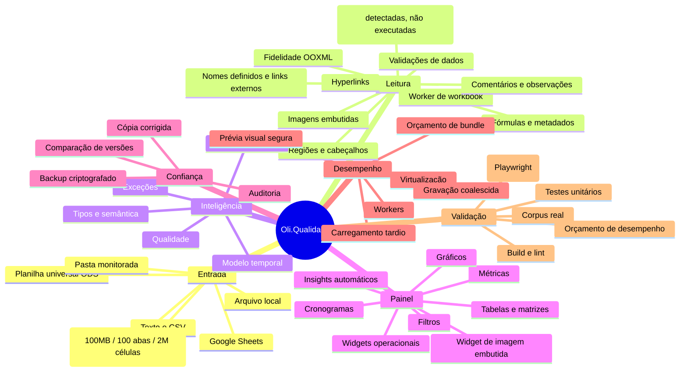
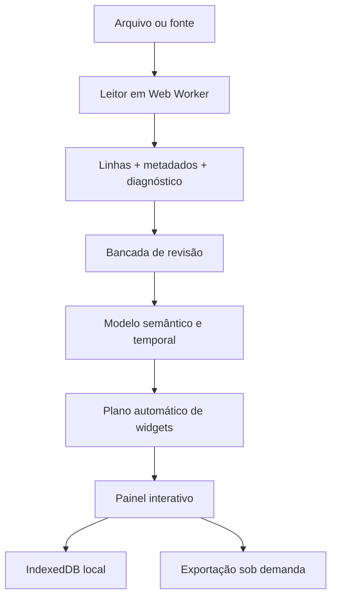

---
tags:
  - second-brain
  - oliqualidade
  - arquitetura
  - painel-central
aliases:
  - Second Brain
  - Mapa Mental
  - Oli.Qualidade
---

# Oli.Qualidade — Second Brain

Este documento é a fonte de orientação do projeto: explica o que existe, por
que existe, onde alterar e como provar que uma mudança não quebrou a leitura.
O código e os testes continuam sendo a fonte de verdade técnica.

A auditoria detalhada da base, lacunas, matriz de leitores e plano Rust está em
[[CURRENT_STATE_AUDIT|CURRENT_STATE_AUDIT.md]]. Este vault (`docs/`) é aberto
diretamente no Obsidian — ver [[#Como usar este vault no Obsidian]] antes de
editar, para manter os links e o Canvas funcionando.

## Como usar este vault no Obsidian

- **Vault = `docs/`**. `docs/.obsidian/` guarda a configuração local (grafo,
  canvas, backlinks e propriedades ligados) e é gitignored — não é
  compartilhado entre máquinas, só o conteúdo em Markdown/Canvas importa.
- **Wikilinks `[[...]]`** são preferidos a links Markdown relativos dentro
  deste vault: sobrevivem a renomear arquivo (Obsidian atualiza sozinho) e
  aparecem no painel de backlinks. Links para uma seção específica usam
  `[[CURRENT_STATE_AUDIT#74. Bug real de produto...]]` (título completo do
  `##`, sensível a como o heading está escrito no arquivo alvo).
- **Canvas como mapa mental navegável**: [[oliqualidade-mapa-mental.canvas]]
  é a versão interativa (zoom, arrastar, abrir nota com duplo clique) do
  mapa estático em [[#Mapa mental]] abaixo. `docs/*.canvas` é gitignored de
  propósito — é um artefato de navegação local, não fonte de verdade;
  reconstrua a partir deste documento se for perdido, não o contrário.
- **Tags** (`#pendente`, `#armadilha`, `#decisão`) aparecem no painel de tags
  do Obsidian e servem para filtrar rapidamente por tipo de conteúdo sem
  precisar abrir cada tabela.
- **Grafo de notas**: o grafo do Obsidian é *derivado dos links entre notas
  Markdown* e mostra a estrutura da documentação, não dependências de módulo
  TypeScript. Já existiu aqui um segundo grafo, derivado do código
  (`graphify-out/`), removido na v0.10.0-beta.10 — ver
  [[CURRENT_STATE_AUDIT#143. O grafo de código versionado foi removido]].

## Mapa mental



Versão navegável (zoom, arrastar, abrir arquivo com duplo clique):
[[oliqualidade-mapa-mental.canvas]].

## Fluxo principal



1. `workbook-reader-client.ts` valida tamanho e transfere a leitura pesada ao
   `workbook.worker`.
2. `workbook-reader.ts`, `ooxml-reader.ts`, `import.ts` e
   `import-intelligence.ts` preservam conteúdo, estrutura e diagnóstico.
3. A revisão permite selecionar abas/regiões, corrigir células e registrar
   auditoria antes de criar o painel.
4. `spreadsheet-intelligence.ts`, `structural-model.ts` e
   `temporal-model.ts` acrescentam significado sem alterar a origem.
5. `auto-dashboard.ts` recomenda widgets; `routes/index.tsx` coordena a
   experiência e a configuração manual.
6. `storage.ts` persiste localmente. Nenhuma planilha é enviada para IA sem a
   ação e os controles previstos no fluxo de análise inteligente.

## Glossário rápido

Para quem chega numa sessão nova e precisa de contexto rápido sem reler o
audit inteiro.

| Termo | Significado neste projeto |
| --- | --- |
| OOXML | Formato XML zipado por trás de `.xlsx`/`.xlsm` (Office Open XML). O leitor próprio (`ooxml-reader.ts`) parseia o XML bruto como segunda fonte, independente do SheetJS. |
| Fidelidade | Métrica célula-a-célula que compara o valor lido por dois motores (SheetJS vs. leitor OOXML próprio, ou TS vs. Rust). `UNSUPPORTED_FIDELITY_FEATURES` (`fidelity-meter.ts`) lista o que é deliberadamente fora dessa comparação. |
| Inventário rastreável | Um recurso do Excel (hyperlinks, nomes definidos, validações, imagens...) que deixou de ser só "lido mas ignorado" e passou a aparecer como painel `<details>` navegável em `review.tsx`. |
| `!oliAdvanced` | Convenção de nome de propriedade interna do SheetJS onde o projeto guarda metadados próprios extraídos do ZIP (não é uma API pública do SheetJS). |
| Reading Engine v2 | Camada de leitura com registro de leitor/tempo/divergência por importação, que aceita hoje SheetJS+OOXML e um adaptador Rust/WASM opcional (ver seção "Estado conhecido"). |
| Shadow mode | Rodar o leitor Rust/WASM em paralelo ao leitor TS sem afetar o resultado mostrado ao usuário, só para acumular evidência de divergência antes de promover. |
| `dataMode` (original/agregado) | Todo widget de gráfico guarda se está mostrando linha a linha (`raw`) ou uma operação de agregação (`sum`/`avg`/...) — nunca decide isso implicitamente. |
| `parseNumericValue` | Função central em `format.ts` para converter `Value` de célula em número tolerando vírgula decimal brasileira; substitui `Number(v)` direto em todo o código que lê valor de célula (ver [[CURRENT_STATE_AUDIT#74. Bug real de produto reportado pelo usuário: NaN generalizado por vírgula decimal brasileira, e widget novo para mostrar imagens embutidas]]). |
| Fachada de chunk | Quando o bundler (Rollup/Vite) escolhe um arquivo de primeira-parte como "nome" de um chunk compartilhado; mover código entre arquivos pode trocar a fachada e mudar o tamanho relatado sem mudar bytes reais. |
| `security-smoke` | Job de CI que testa cabeçalhos de segurança e CORS contra um servidor já de pé, usando um laço de `curl` — o mesmo padrão reaproveitado pelo job `e2e` via `OLI_E2E_BASE_URL`. |

## Onde mexer

| Ler XML no núcleo Rust (OOXML e ODS) | `quick_xml` 0.42 em `lib.rs` e `ods.rs`: nomes de elemento são `&str` (`local_name().as_ref() == "row"`), não há `Reader::decoder()` e os eventos de texto expõem `&str` direto | migração da 0.41, que usava `&[u8]` em tudo; conferida contra o corpus real (65 planilhas, 223.444 células, zero divergências) porque teste unitário não prova leitura de planilha; ver [[CURRENT_STATE_AUDIT#141. quick-xml 0.42: a API inteira trocou bytes por texto]] |

| Atualização do Vite entra sozinha, fora do grupo do Dependabot | `exclude-patterns: ["vite"]` no grupo `minor-and-patch` de `.github/dependabot.yml` | 8.1.5 → 8.2.2 fundiu 9 chunks e levou o pacote de entrada de 296 KiB para 1.053 KiB **com o total de bytes igual** (3,86 MB): o que era sob demanda virou primeiro carregamento; ver [[CURRENT_STATE_AUDIT#140. O Vite 8.2 funde chunks e triplica o pacote de entrada]] |

| Versão de Node da CI e do ambiente local | `node-version: 24` nos dois workflows e `engines.node: ">=24"` no `package.json`; a produção é o runtime `nodejs24.x` da Vercel | ficar numa major atrás da produção deixa uma faixa sem verificação, e faz o npm da CI escrever o `package-lock` diferente do de todo mundo — foi o que quebrou **todas** as PRs do Dependabot com `Missing: lru-cache@11.5.2`; ver [[CURRENT_STATE_AUDIT#139. A CI testava numa major de Node mais antiga que a produção]] |

| Formatar número pelo código de formato no núcleo Rust | `format_from_section_code` (`rust/oli-ooxml-core/src/lib.rs`): seções por `;`, literal entre aspas, escape, milhar, percentual; o caminho de decimais fixos vem antes e só o que virava `General` chega aqui | a referência é `XLSX.SSF.format`, **não** o Excel: `R$ #,##0.00` sem aspas o SSF recusa (`unrecognized character R`) e cai no valor cru, então **toda letra fora de aspas devolve `None`**; ver [[CURRENT_STATE_AUDIT#138. Novo lote real de qualidade expõe formatos monetário e contábil no Reading Engine]] |
| Garantir que o WASM versionado veio do Rust versionado | job `wasm-provenance` (`.github/workflows/rust.yml`) reconstrói e compara com `git diff --exit-code`; `rust-toolchain.toml` fixa o canal porque a comparação é byte a byte | publica o pacote reconstruído quando diverge, porque `wasm-pack` não roda em toda máquina (falta a CRT no Windows); ver [[CURRENT_STATE_AUDIT#138. Novo lote real de qualidade expõe formatos monetário e contábil no Reading Engine]] |
| Conferir o corpus real sanitizado sem ter os originais | `sanitized-corpus-privacy.test.ts` (sha256 do manifesto, nenhum arquivo solto, varredura de e-mail/CPF/CNPJ/telefone/URL/caminho) | **a CI nunca vê o corpus real** (`sanitized-real/` está no `.gitignore`), então o gate de paridade lá mede só as 50 geradas — divergência em planilha real só aparece rodando `npm run wasm:corpus` localmente; ver [[CURRENT_STATE_AUDIT#138. Novo lote real de qualidade expõe formatos monetário e contábil no Reading Engine]] |

| Necessidade                                 | Fonte principal                                                       | Prova mínima                                 |
| ------------------------------------------- | --------------------------------------------------------------------- | --------------------------------------------- |
| Novo formato ou fidelidade de Excel         | `workbook-reader.ts`, `ooxml-reader.ts`, `ooxml-archive.ts`, `import.ts` | fixture + teste de corpus                    |
| Inventário Rust de planilha universal (ODS) | `rust/oli-ooxml-core/src/ods.rs`                                      | `rust/oli-ooxml-core/tests/ods_inventory.rs` |
| Sanitização local de corpus real (para preencher o gate de promoção Rust/WASM por formato) | `scripts/workbook-sanitizer.mjs` (`sanitizeWorkbookBytes`, aceita `bookType` `xlsx`/`xlsm`/`xltx`/`xltm` — os dois últimos via patch pontual no `[Content_Types].xml` depois do `XLSX.write`, `TEMPLATE_CONTENT_TYPE_PATCH`), `scripts/sanitize-workbook-corpus.mjs` (CLI, `bookType` = extensão de origem) | `src/lib/workbook-sanitizer.test.ts` |
| Cabeçalhos, blocos e regiões                | `import.ts`, `structural-model.ts`                                    | `import.test.ts`                             |
| Tipos, fórmulas e semântica                 | `format.ts`, `formula.ts`, `spreadsheet-intelligence.ts`              | teste dedicado                               |
| Widget novo ou recomendação                 | `types.ts`, `widgets.ts`, `auto-dashboard.ts`, `components/oliam/widget-card.tsx` (dispatcher por `w.type`), `components/oliam/widget-support.tsx` (chrome/hooks compartilhados: `WidgetHead`, `EmptyWidget`, `FilterChip`, `WidgetDragProps`) | widgets + auto-dashboard                     |
| Corpo de um tipo específico de widget (todos os 14 tipos originais, exceto os que já delegavam pra componente lazy) | `components/oliam/{ranking,insights,rating,version-compare,pivot,exception-panel,schedule-heatmap,metric,chart}-widget-body.tsx` — cada um autocontido (`<article>`+`WidgetHead` próprios), chamado por `WidgetCard`; `chart-widget-body.tsx` cobre `bar`/`pie`/`line`/`area` juntos (compartilham estado de interação) | verificação manual no navegador (sem teste unitário ainda) |
| Rolagem horizontal por arrasto num gráfico (sparkline ou gráfico principal) | `components/oliam/use-chart-horizontal-scroll.tsx` — hook compartilhado, precisa ser `.tsx` (contém JSX do botão) | verificação manual no navegador |
| Coluna vazia entrando/saindo de métrica ou dimensão automática | `classifyDashboardColumn` (`auto-dashboard.ts`), `nums`/`fillRatio` em `createWidget`/`buildDefaultWidgets` (`widgets.ts`) | `auto-dashboard.test.ts`, `widgets.test.ts` |
| Painel de leitura guiada de categoria em destaque (comparação vs. maior outra categoria) | `pieComparisonFor` (`data-pipeline.ts`), `SeriesComparisonPanel` (`components/oliam/widget-support.tsx`) — genérico sobre `{name, total}[]`, usado hoje por pizza e barra | `data-pipeline.test.ts` (a função) + verificação manual do widget |
| Resumo de tendência (início→fim, mínimo, máximo, média) para séries temporais | `trendSummaryFor` (`data-pipeline.ts`), `TrendSummaryPanel` (`components/oliam/widget-support.tsx`) — usado por linha e área agrupada por data | `data-pipeline.test.ts` (a função) + verificação manual do widget |
| Cobertura do Top N no ranking (participação, categorias fora do ranking) | `rankingCoverageFor` (`data-pipeline.ts`), faixa inline no widget `ranking` (`components/oliam/widget-card.tsx`) | `data-pipeline.test.ts` (a função) |
| Quantas fatias o gráfico de pizza mostra (colapso Top 5 + Outros) | `collapsePieSeries` (`data-pipeline.ts`), chamado por `pieSeries` em `widget-card.tsx` — roda sempre, inclusive em modo "linha a linha" | `data-pipeline.test.ts` (`describe("collapsePieSeries")`) |
| Clique-para-filtrar em qualquer widget de gráfico | `handleGroupClick`/`toggleClickFilter` (`widget-card.tsx`) — todo widget com dimensão de agrupamento (barra, pizza, linha, área, ranking, mapa) chama direto no clique, sem botão intermediário; guarda especial só para "Outros" na pizza (agrupador sintético, não filtra) | verificação manual do widget + `data-pipeline.test.ts` (`toggleClickFilter`) |
| Widget de mapa (Leaflet) ou widgets operacionais (presença/validação/carta de controle/planejado×realizado) | `map-widget-body.tsx`, `operational-widget-body.tsx` — carregados via `React.lazy()`+`Suspense` em `widget-card.tsx`, fora do chunk comum | `npm run build` + `ANALYZE=1 npm run build` confirma o chunk separado |
| Inventário de hyperlinks do Excel por aba (endereço, destino, tooltip) | `parseHyperlinks`/`inspectWorkbookFeatures` (`workbook-metadata.ts`) extrai; `ImportDiagnostics.hyperlinks` (`import-intelligence.ts`) expõe; painel `<details>` em `review.tsx` lista | `import-intelligence.test.ts` (`!oliAdvanced` sintético) + `workbook-metadata.test.ts` (parsing) — ver [[CURRENT_STATE_AUDIT#68. Inventário de hyperlinks exposto na revisão (item de menor esforço da reauditoria da seção 50)]] |
| Inventário de nomes definidos (por escopo) e referências a arquivos externos | `parseDefinedNames`/`parseExternalLinks`/`inspectWorkbookFeatures` (`workbook-metadata.ts`); `ImportDiagnostics.definedNames`/`externalLinks` (`import-intelligence.ts`); dois painéis `<details>` em `review.tsx` | `import-intelligence.test.ts` + `workbook-metadata.test.ts` (escopo global vs. local, nomes `_xlnm.` ignorados) — ver [[CURRENT_STATE_AUDIT#69. Inventário de nomes definidos e links externos (próximo item por esforço da lista pendente)]] |
| Validações de dados do Excel por intervalo (lista, numérico, data etc.) | `parseDataValidations` (`workbook-metadata.ts`, lê `<dataValidation>` do próprio XML da aba); `ImportDiagnostics.dataValidations` (`import-intelligence.ts`); painel `<details>` em `review.tsx` | `import-intelligence.test.ts` + `workbook-metadata.test.ts` — ver [[CURRENT_STATE_AUDIT#70. Validações de dados do Excel (Data Validation), terceiro item da lista pendente]] |
| Detecção de macros VBA (presença apenas, nunca executadas) | `hasVbaMacros` (`workbook-metadata.ts`, `Boolean(zip["xl/vbaProject.bin"])`); `ImportDiagnostics.hasVbaMacros`; aviso em `warnings`, sem painel próprio (é um booleano, não uma coleção) | `import-intelligence.test.ts` + `workbook-metadata.test.ts` — ver [[CURRENT_STATE_AUDIT#71. Detecção de macros VBA, e correção de uma lista desatualizada pelas próprias seções 68-70]] |
| O que a métrica de fidelidade célula-a-célula deliberadamente não mede | `UNSUPPORTED_FIDELITY_FEATURES` (`fidelity-meter.ts`) — manter em sincronia com o que já virou inventário rastreável na revisão (hyperlinks/nomes definidos/links externos/validações não estão mais nesta lista; tabelas/pivôs nunca estiveram) | `workbook-fidelity.test.ts` (`unsupportedFeatures`) |
| Inventário de imagens embutidas (só `xdr:pic`, não formas/gráficos) | `parseImages` (`workbook-metadata.ts`, resolve aba→drawing→media em dois níveis de `.rels` encadeados); `ImportDiagnostics.images`; painel `<details>` em `review.tsx` | `import-intelligence.test.ts` + `workbook-metadata.test.ts` (cadeia completa de 3 relacionamentos) — ver [[CURRENT_STATE_AUDIT#72. Inventário de imagens embutidas (fecha a lista de itens de esforço maior pedidos pelo usuário nesta sessão)]] |
| Exportação (XLSX, cópia corrigida, CSVs, PDF de revisão, PNG/PDF do painel, backup criptografado e restauração) | `use-dashboard-export.ts` — hook, recebe `contentRef` de fora; `restoreEncryptedBackup` grava direto via `onRestore` (`p.update`), sem passar pelo undo/redo, de propósito | verificação manual do fluxo de exportação |
| Núcleo de undo/redo (pilha, `recordHistory`) | `use-undo-redo-history.ts` — hook | verificação manual (editar, desfazer, refazer) |
| Ações de widget (adicionar, copiar/colar, atualizar, remover, mover, reordenar) e `traceException` | `use-widget-actions.ts` — hook, recebe `setSearch`/`setSort`/`setFilters`/`setFocusedCell` como parâmetros porque `traceException` cruza todos eles; `canAdd` fica em `Dashboard` (só lê o pipeline, não muta nada) | verificação manual do fluxo de widgets |
| Mutações de dados da aba (filtros, colunas, overrides semânticos, decisões de exceção, correção de célula) | `use-sheet-mutations.ts` — hook, mesmo padrão de `use-widget-actions.ts`; todos os 7 mutadores chamam `recordHistory()` antes de mudar dado, preservando as duas guardas condicionais originais (`Object.is(before, after)` em `correctException`/`editTableCell`) | verificação manual (editar célula, desfazer) — ver [[CURRENT_STATE_AUDIT#84. Extraído \`useSheetMutations\`: os 7 mutadores de dados que sobravam soltos em \`Dashboard\`]] |
| Quanto foi filtrado na tabela detalhada | prop `totalRows` de `WidgetCard`, passado como `rulesApplied.length` em `routes/index.tsx` | `npx tsc --noEmit` confirma o único call site atualizado |
| Widget "Insights automáticos" (`insights`), narra achados em texto | `widget-card.tsx` (bloco `w.type === "insights"`), compõe `pieComparisonFor`/`rankingCoverageFor`/`detectQualitySignals` já testadas | `npx tsc --noEmit` (checklist completo de registro de `WidgetType` na seção 47 do audit) |
| Widget "Radar" (`radar`), compara as maiores categorias em eixos radiais | `radar-widget-body.tsx` (arquivo próprio, Recharts `RadarChart`/`Radar`), reaproveita `chartSeries` igual ao ranking; registrado nos mesmos 6 pontos do checklist da seção 47 (tamanho igual à pizza) | `npx tsc --noEmit` — ver [[CURRENT_STATE_AUDIT#110. Correção do tooltip da barra, pop de hover em barra/pizza, glow no ranking, e novo widget "Radar"]] |
| Tooltip do gráfico de barras só aparecer sobre a barra renderizada, não no espaço vazio da coluna | `content` do `<ChartTooltip>` em `chart-widget-body.tsx` gated por `activeBarIndex !== null` (já setado com precisão por barra real via `onMouseEnter` do `<Bar>`); `cursor={false}` remove o retângulo de fundo que cobria a coluna inteira | verificação manual despachando eventos de mouse no elemento da barra — ver seção 110 do audit |
| Importação/revisão (UI)                     | `components/oliam/{home,empty,import-workbench,review}.tsx`          | `routes/index.tsx` orquestra via props        |
| Combinar planilha, apresentação, coluna calculada, marcadores, atalhos, notas de origem, diff de versão, dica de termos, regras ausentes, formatação, sinais de qualidade, chips de filtro, colunas (drag-and-drop), sidebars, paleta de comandos, revisão em segundo plano (UI/lógica do Dashboard) | `components/oliam/{join-sheet-dialog,presentation-mode,formula-column-editor,bookmark-panel,shortcuts-dialog,source-notes-panel,version-diff-banner,term-hint-banner,missing-rules-panel,format-panel,quality-signals-panel,filter-chips-bar,column-panel,dashboard-nav-sidebar,insight-sidebar,command-palette,use-background-review-analysis}.tsx` | extraídos de `Dashboard`; `tsc` pega referências órfãs se algo ficar pra trás |
| Cálculos e séries                           | `data-pipeline.ts`                                                    | `data-pipeline.test.ts`                      |
| Cronograma                                  | `schedule-normalizer.ts`, `operational-widgets.ts`                    | testes dos dois módulos                      |
| Revisão, auditoria e versões                | `data-review.ts`, `import-workbench.ts`, `review-export.ts`           | testes de revisão/exportação                 |
| Armazenamento e privacidade                 | `storage.ts`, `encrypted-backup.ts`                                   | storage/privacy + backup                     |
| IA                                          | `gemini-security.ts`, `gemini-server.ts`, `gemini-client.ts`, `server-sent-events.ts`, `assistant-stream.ts`, `assistant-context.ts` | segurança + contexto + streaming ponta a ponta |
| Prazos e tetos do assistente                | `assistant-stream.ts` é o único lugar onde os números moram: teto por evento (512 KiB), por stream (8 MiB) e por texto de resposta (256 KiB); prazo até os cabeçalhos (20s), de inatividade (25s) e de duração total (55s) | `gemini-stream.test.ts` (temporizador falso nos três prazos), `server-sent-events.test.ts` (tetos) — ver [[CURRENT_STATE_AUDIT#144. Endurecimento do streaming do assistente: prazos, tetos, cancelamento e agrupamento de quadros]] |
| Erro do servidor (500, recuperação de stack) | `error-capture.ts` (`AsyncLocalStorage` por requisição), `server.ts`  | `error-capture.test.ts`                      |
| Exportação PNG/PDF e tabelas                | `dashboard-export.ts`, `data-table-widget.tsx`, CSS `.oliam-export-*` | layout + teste de exportação                 |
| Desempenho                                  | workers, `latest-task-queue.ts`, CSS `.oliam-widget`, budgets         | `npm run verify`                             |
| Leitura de CSV por streaming                 | `csv-stream.ts`: reconhecimento de codificação em passagem própria (com progresso em bytes), analisador que guarda estado entre pedaços, delimitador decidido sobre 25 linhas como `detectDelimiter` faz, blocos de no máximo `blockSize` com um em voo por vez | `csv-stream.test.ts` (corte em toda posição, multibyte partido, equivalência com o SheetJS) — ver [[CURRENT_STATE_AUDIT#147. Streaming de CSV de verdade: o arquivo nunca entra inteiro na memória]] |
| Estratégia e limites de importação          | `import-strategy.ts` é o único lugar com limite numérico de importação; `progressive-import.ts` traz o contrato de blocos, backpressure e equivalência; `docs/IMPORT_ARCHITECTURE.md` explica o caminho inteiro e o mapa de cópias | `import-strategy.test.ts`, `progressive-import.test.ts`, `npm run benchmark:import` — ver [[CURRENT_STATE_AUDIT#146. Baseline da importação: o pico não é o ZIP, é o workbook do SheetJS]] |
| Qual caminho lê um CSV grande, e a ligação das três peças | `csv-progressive-import.ts` coordena: `chooseImportStrategy` decide, `csv-stream.ts` lê em blocos direto do `Blob`, `sheetsWithData(wb, { gridFor })` normaliza sobre uma worksheet mínima; o `File` vai ao worker como referência, nunca como bytes | `csv-progressive-import.test.ts` (23 formas de CSV confrontadas com o caminho atual nas linhas tipadas), `workbook-reader-client.test.ts` (escolha, fallback), `csv-progressive-benchmark.test.ts` (pico e tamanho de bloco) — ver [[CURRENT_STATE_AUDIT#149. O coordenador liga o CSV progressivo: pico de 141,8 para 34,9 MiB]] |
| Formato do pacote ZIP: limites, índice e leitura de uma entrada por vez | `zip-directory.ts` traz o formato e os limites, sem saber de onde vêm os bytes; `validateZipWorkbook` (pacote em memória) e `zip-blob-reader.ts` (`openZipFromBlob`, lê por posição) são os dois consumidores | `zip-blob-reader.test.ts`: 25 pacotes reais e 756 entradas byte a byte contra `unzipSync`, mais recusas com a mesma mensagem dos dois lados; medida com `OLI_ZIP_BENCHMARK=1` — ver [[CURRENT_STATE_AUDIT#150. O ZIP lido por posição, e a medida que disse onde isso não ajuda]] |
| Ler o XML de uma aba OOXML como grade, sem worksheet | `parseSheetCells` é o gerador de células que a worksheet do verificador e a grade compartilham; `readOoxmlSheetGrid`/`readOoxmlSheetGrids` (`ooxml-reader.ts`) montam a grade densa, com `aoa` e `textAoa` separados porque data é `Date` numa e texto na outra | `ooxml-sheet-grid.test.ts` compara `sheetsWithData` contra `sheetsWithData`; a grade substitui a worksheet em 17 das 25 planilhas reais, e as 8 restantes têm duas causas conhecidas, ver [[CURRENT_STATE_AUDIT#151. A grade de OOXML existe, e o corpus provou que ela ainda não serve]] |
| Progresso da importação na tela             | `workbook-reader.ts` emite `{ stage, completed?, total? }`; `import-progress.ts` traduz para rótulo, percentual e fração; `empty.tsx` desenha a barra só quando há medida | `import-progress.test.ts`, `empty.test.tsx`, `workbook-reader.test.ts` — ver [[CURRENT_STATE_AUDIT#145. Progresso medido na leitura de planilha, e as abas saindo do worker uma a uma]] |
| Onde vai o orçamento de 60s da leitura | `import-budget-benchmark.test.ts`, ligado por `OLI_BUDGET_BENCHMARK=1`; ele mede as fases que o próprio relatório do leitor reporta e separa a verificação em leitura independente e comparação | 1,44 milhão de células consome 30,2s de 60s: parse 30%, verificação 43%, análise 27%, e dentro da verificação a leitura independente é 76% contra 6% da comparação — ver [[CURRENT_STATE_AUDIT#155. O orçamento de 60s virou medida, e o alvo mudou de lugar]] |
| Métricas de importação (leitor, tempo, bytes, fallback) | `import-metrics.ts`, `storage.ts` (`loadImportMetrics`/`saveImportMetrics`), painel em `components/oliam/import-diagnostics-dialog.tsx` | `import-metrics.test.ts`, `workbook-reader.test.ts` |
| Testes E2E reais de navegador | `e2e/*.spec.ts` (Playwright), `playwright.config.ts` — usar `OLI_E2E_BASE_URL` para apontar a um servidor já pronto (evita o probe nativo do Playwright, que colide com uma corrida real do dev server) | `npm run test:e2e`; CI roda em job próprio (`application.yml`, job `e2e`) — ver [[CURRENT_STATE_AUDIT#73. Primeiro teste E2E real (Playwright), e um bug real de corrida de hidratação SSR encontrado no processo]] |
| Interpretar um Value como número tolerando vírgula decimal brasileira, sem nunca virar NaN | `parseNumericValue` (`format.ts`) — usado em `fmt`, `evalFormula`, `resolveConditionalFormat`, e em todo `data-pipeline.ts`/`operational-widgets.ts`/`widget-card.tsx`/`format-rules-editor.tsx` que antes fazia `Number(valorDeCelula)` direto | `format.test.ts`, `data-pipeline.test.ts`, `operational-widgets.test.ts` |
| Widget "Imagem embutida" (`image`), mostra uma imagem da planilha original dentro do painel | `WorkbookImageDiagnostic.dataUrl` (`workbook-metadata.ts`, extraído por `parseImages`/`bytesToDataUrl`); `SheetData.sourceImages`; renderização em `widget-card.tsx` (`w.type === "image"`) | `widgets.test.ts` (`createWidget("image", ...)`), `workbook-metadata.test.ts` (EMF sem `dataUrl`) — ver [[CURRENT_STATE_AUDIT#74. Bug real de produto reportado pelo usuário: NaN generalizado por vírgula decimal brasileira, e widget novo para mostrar imagens embutidas]] |
| Aba formada por vários blocos com a mesma estrutura virar uma tabela com o bloco como coluna | `detectTableBlockGroup`/`buildTableBlocksGrid` (`excel-table-blocks.ts`), oferecidos como opção "Blocos unificados" por `unifiedBlocksOption` (`import.ts`); a leitura da aba inteira continua como segunda opção | `excel-table-blocks.test.ts` — ver [[CURRENT_STATE_AUDIT#121. Abas montadas em blocos: o nome da tabela do Excel vira dimensão]] |
| Linhas de total das Tabelas do Excel ficarem fora dos registros | `tableTotalsRegions` (`excel-table-totals.ts`) a partir de `totalsRowCount` lido em `parseTable` (`workbook-metadata.ts`); limpeza por célula na cópia de análise em `sheetToRows`, ao lado do tratamento de linhas ocultas | `excel-table-totals.test.ts` — ver [[CURRENT_STATE_AUDIT#120. Linhas de total das Tabelas do Excel entravam como registro e dobravam qualquer soma]] |
| Cabeçalhos de segurança da resposta | `buildSecurityHeaders` (`lib/http-security.ts`): CSP, HSTS `max-age=63072000; includeSubDomains` **sem** `preload`, `x-permitted-cross-domain-policies: none` | conferidos em dois lugares: `http-security.test.ts` (valor) e `scripts/security-smoke.mjs` (chega ao navegador depois do SSR); o teste também barra origem `*` solta e `'unsafe-eval'` na CSP — ver [[CURRENT_STATE_AUDIT#137. Limite de requisições compartilhado e verificação Cloudflare Turnstile]] |
| Limitar requisições entre instâncias da Vercel | `consumeRateLimit`/`upstashConfigFrom` (`lib/rate-limit.ts`): janela deslizante em conjunto ordenado do Redis, quatro comandos num pipeline só; `checkRateLimit` em memória continua como referência e como queda | `rate-limit.test.ts` — recusa não conta (`ZREM`), falha do Redis cai para a memória e a queda **ainda limita**; ver [[CURRENT_STATE_AUDIT#137. Limite de requisições compartilhado e verificação Cloudflare Turnstile]] |
| Exigir que exista uma pessoa antes de gastar cota de IA | `checkHuman` (`lib/human-check.ts`) + `verifyTurnstileToken` (`lib/turnstile.ts`) nos dois endpoints, sempre antes do limitador; prova em cookie assinado de 2h, senão o token de uso único viraria um desafio por mensagem | `human-check.test.ts`, `turnstile.test.ts` — falha de rede aqui **recusa**, ao contrário do limitador; ver [[CURRENT_STATE_AUDIT#137. Limite de requisições compartilhado e verificação Cloudflare Turnstile]] |
| Assinar cookie sem estado no servidor | `lib/signed-cookie.ts` (HMAC, **`scope` = nome do cookie**, prazo, marca do `user-agent`), usado por `chat-session.ts` e por `human-check.ts` | o `scope` **não é opcional**: sem ele, `oli_chat_session` (entregue a qualquer visitante) valia como `oli_human` e contornava o Turnstile inteiro; token sem escopo é recusado; ver [[CURRENT_STATE_AUDIT#137. Limite de requisições compartilhado e verificação Cloudflare Turnstile]] |
| Testar componente React (widget montado de verdade) | projeto `componente` do `vitest.config.ts` (jsdom, `src/**/*.test.tsx`); `src/test/component-setup.ts` instala um `ResizeObserver` síncrono cuja medida se define com `setMeasuredSize`, e `src/test/render-widget.tsx` embrulha no `TooltipProvider` | `chart-widget-body.test.tsx`; rótulo de valor do recharts só entra no DOM depois da animação, então **sempre** via `waitFor` — ver [[CURRENT_STATE_AUDIT#136. Infraestrutura de teste de componente React, e as duas dívidas que ela fecha]] |
| Restringir a contagem de pendências ao que o filtro deixou visível | `exceptionsWithinVisibleRows`/`visibleSourceRowNumbers` (`lib/exception-visibility.ts`), chamadas por `routes/index.tsx`; `rowIndex` da pendência é base 1 e o rastro da linha é base 0, e pendência sem `rowIndex` é da planilha inteira e sobrevive a qualquer filtro | `exception-visibility.test.ts` — saiu de dois `useMemo` dentro da rota, que era a dívida da seção 116; ver [[CURRENT_STATE_AUDIT#136. Infraestrutura de teste de componente React, e as duas dívidas que ela fecha]] |
| Varredura de segurança do código na CI | duas, de propósito: job `static-analysis` (Semgrep OSS `1.174.0`, pacotes `p/typescript`, `p/react`, `p/nodejs`, sem conta e com `--metrics=off`) e `.github/workflows/codeql.yml`; segredos ficam com o gitleaks do job `secret-scan`, que varre o histórico | o CodeQL é gratuito só enquanto o repositório for público, e ele **vai** fechar de novo quando existir servidor com verificação de plano — o Semgrep é o que sobrevive a isso; ver [[CURRENT_STATE_AUDIT#135. Análise estática: Semgrep entra, CodeQL volta, e os dois ficam]] |
| Por quanto tempo cada cache do app sobrevive | `RETENTION`/`applyRetention` (`lib/retention.ts`), aplicados na gravação em `storage.ts`; idade antes do teto, data implausível tratada como desconhecida e ordem de entrada preservada | `retention.test.ts` — ver [[CURRENT_STATE_AUDIT#134. Retenção centralizada dos caches e teste responsivo em cinco larguras]] |
| Reconhecer o formato real do arquivo importado | `detectFileSignature`/`checkWorkbookContent` (`lib/file-signature.ts`), usados por `readWorkbookBytes` para escolher o caminho de leitura e disparar a validação de ZIP; recusa só o que não é planilha, e `isWorkbookContentRejection` faz a mensagem sobreviver ao worker e à mensagem genérica da tela | `file-signature.test.ts` — ver [[CURRENT_STATE_AUDIT#133. Arquivo reconhecido pelo conteúdo, actions fixadas por SHA e SBOM]] |
| Extrair texto de fragmento XML do arquivo do Excel | `stripXmlMarkup` (`lib/xml-text.ts`), usada por `decodeOoxmlText` e por `workbook-metadata.ts`; repete a remoção até estabilizar e devolve **texto puro**, que nunca deve ser inserido como HTML | `xml-text.test.ts` — ver [[CURRENT_STATE_AUDIT#132. Os dois alertas de sanitização do CodeQL: o que era real e o que não era]] |
| Voltar o painel a um arranjo anterior (histórico persistente) | `lib/dashboard-history.ts` (snapshot da montagem, `describeChange`, `pruneVersions`) + `loadDashboardHistory`/`saveDashboardHistory` (`storage.ts`, uma chave por painel no IndexedDB, nada em modo privado); diálogo em `dashboard-history-dialog.tsx` | `dashboard-history.test.ts` — ver [[CURRENT_STATE_AUDIT#131. Histórico persistente de versões do painel]] |
| Ordem dos widgets por finalidade da planilha | `DASHBOARD_TEMPLATES`/`applyTemplateOrder` (`lib/dashboard-templates.ts`), aplicados em `confirmReview` (`routes/index.tsx`); reordena só as recomendações de visualização, nunca KPIs e tabela | `dashboard-templates.test.ts` — ver [[CURRENT_STATE_AUDIT#130. Modelos por finalidade: vendas, financeiro, qualidade e estudos]] |
| Mostrar o que está guardado e o que sai para a IA | `PrivacyCenter` (`components/oliam/privacy-center.tsx`); mede com `listStoredEntries` (`storage.ts`, percorre IndexedDB **e** localStorage) classificado por `storage-usage.ts`; o consentimento chama `buildSafeDashboardContext`, a mesma função do envio real, em vez de descrever o payload | `storage-usage.test.ts` — ver [[CURRENT_STATE_AUDIT#129. Central de privacidade: armazenamento medido e consentimento com o envio real]] |
| Coluna de meta/alvo não virar a métrica principal do painel | `isReferenceMetric` (`lib/reference-metrics.ts`) empurra colunas de referência para o fim da ordem de métricas em `auto-dashboard.ts` e as promove a `areaGoalKey` do gráfico de área | `reference-metrics.test.ts` + `auto-dashboard.test.ts` (`describe("coluna de meta")`) — ver [[CURRENT_STATE_AUDIT#128. Bug relatado: gráfico de área "sem dados" em painel novo — a meta virava o resultado]] |
| Encontrar coluna, widget, métrica, aba ou painel pelo nome | `buildGlobalSearchEntries` (`lib/global-search.ts`) alimenta os grupos novos da `CommandPalette`; `handleSearchEntry` (`routes/index.tsx`) decide a ação de cada tipo; widgets têm `data-widget-id` para a rolagem até eles | `global-search.test.ts` — ver [[CURRENT_STATE_AUDIT#127. Busca global: a paleta de comandos encontra o que existe no painel]] |
| Ações principais do painel no celular | `MobileNavBar` (`components/oliam/mobile-nav-bar.tsx`) + regras `.oliam-mobile-nav` em `styles.css`, só abaixo de 700px; a reserva de espaço do conteúdo e a posição do balão do assistente ficam nas regras de celular já existentes, que vencem na cascata | verificação manual em viewport de 390px — ver [[CURRENT_STATE_AUDIT#126. Barra de navegação inferior no celular]] |
| Esconder as ferramentas de montagem sem removê-las (modo leitura) | atributo `data-edit-only` nos controles de edição + regra `.oliam-reading-mode [data-edit-only]` (`styles.css`); a marca vai na raiz do documento para alcançar a barra superior e os menus em portal; estado em `lib/view-mode.ts` | `view-mode.test.ts` — ver [[CURRENT_STATE_AUDIT#125. Modo leitura separado do modo edição]] |
| Quantos widgets um filtro alcança | `widgetsAffectedByFilters` (`lib/widgets.ts`), exibido em `AnalysisContextBanner` só quando há filtro ativo; `image` e `folder-files` ficam de fora porque não leem as linhas | `widgets-filters.test.ts` — ver [[CURRENT_STATE_AUDIT#124. Alcance do filtro dito por extenso: "12 de 12 widgets atualizados"]] |
| Ordem de leitura de qualquer widget (resultado, visualização, explicação, evidências, configuração técnica) | `WidgetEvidencePanel` (`widget-support.tsx`) no pé de cada corpo de widget; a faixa técnica nasce recolhida e `.oliam-export-mode .oliam-widget-technical` a força visível na exportação | verificação manual no navegador — ver [[CURRENT_STATE_AUDIT#123. Hierarquia padronizada: o resultado antes da procedência, em todos os widgets]] |
| Widget reagir ao próprio espaço (não ao tamanho da tela) | `container: oliam-widget / inline-size` em `.oliam-widget` (`styles.css`) habilita as variantes `@[420px]:`/`@[720px]:` do Tailwind; `useMeasuredWidth` (`components/oliam/use-measured-width.ts`) dá a mesma medida ao JavaScript; limites em `lib/widget-density.ts`, fonte única dos dois lados | `widget-density.test.ts` — ver [[CURRENT_STATE_AUDIT#122. Widgets adaptáveis: container queries e três modos formais de densidade]] |
| Corte e intervalo dos nomes de categoria no eixo X | `axisLabelPresentation` (`data-pipeline.ts`): devolve quantos caracteres cabem e de quantos em quantos rótulos desenhar; quando nem o corte mínimo cabe, o eixo pula rótulos em vez de sobrepor | `data-pipeline.test.ts` (`describe("axisLabelPresentation")`) — ver seção 119 do audit |
| Mostrar ou esconder o valor escrito em cima das barras | `barValueLabelsFit` (`data-pipeline.ts`), por largura disponível (fatia fixa quando o gráfico rola, divisão do span quando não rola) e pelo rótulo mais comprido da série | `data-pipeline.test.ts` (`describe("barValueLabelsFit")`) — ver [[CURRENT_STATE_AUDIT#119. Acabamento de leitura dos gráficos, e um item do backlog que se provou inexistente]] |
| Legenda das séries do gráfico de área (a única que existe nesse widget — não acrescentar outra) | `ChartSeriesLegend` (`widget-support.tsx`), alimentada por `areaLegendItems` em `chart-widget-body.tsx`, no bloco acima do gráfico; desenha o traço real de cada série, então a distinção não depende só de cor | `e2e/analytical-reading-flow.spec.ts` (falha por texto duplicado se alguém acrescentar uma segunda legenda) — ver seção 119 do audit |
| Piso do eixo vertical de linha e área | Padrão do Recharts: `[0, "auto"]` resolvido como `Math.min(0, dataMin)` — o zero já está sempre incluído, não há eixo truncado a corrigir nem a avisar | ver seção 119 do audit |
| Ordem das categorias no gráfico de barras (natural x por valor x alfabética) | `sortBarCategories` (`data-pipeline.ts`) decidindo com `ordinalRanks` (`ordinal-categories.ts`); modo guardado em `Widget.barSort`, padrão `auto`; mesma função usada por `assistant-context.ts` para o assistente não descrever uma ordem diferente da exibida | `ordinal-categories.test.ts` + `data-pipeline.test.ts` (`describe("sortBarCategories")`) — ver [[CURRENT_STATE_AUDIT#118. Ordem das categorias no gráfico de barras: sequência reconhecida vence ordenação por tamanho]] |
| Que comparação o tooltip do gráfico de barras pode afirmar (variação vs. período anterior x proporção da maior categoria) | `barTooltipReading` (`lib/chart-reading.ts`), decidida pelo `ChartAxisKind` que o gráfico declara — barra é sempre `"category"`, porque as barras são reordenadas por valor e nunca garantem ordem cronológica | `chart-reading.test.ts` — ver [[CURRENT_STATE_AUDIT#117. Leitura de gráficos: eixos nomeados, média entre categorias e comparação honesta no tooltip]] |
| Quantos registros sustentam cada barra | `count` devolvido por `groupAndAggregate` (`data-pipeline.ts`) — conta valores que entraram na conta, não linhas do balde; linha com métrica vazia não entra na soma nem na média | `data-pipeline.test.ts` (`describe("groupAndAggregate")`) |
| Linha tracejada de média no gráfico de barras | `seriesAverage` (`data-pipeline.ts`) + `<ReferenceLine>` em `chart-widget-body.tsx`; `null` com menos de três categorias | `data-pipeline.test.ts` (`describe("seriesAverage")`) |
| O que está escrito em cada eixo do gráfico | `ChartAxisLegend` (`widget-support.tsx`), alimentada por `horizontalAxisLabel`/`verticalAxisLabel` em `chart-widget-body.tsx` — HTML abaixo do gráfico, não `<Label>` no SVG, porque a área de plotagem rola na horizontal e o título sairia da vista | verificação manual no navegador — ver seção 117 do audit |
| Inventário de formas nativas do Excel com texto (caixas de texto, retângulos com legenda) | `parseShapes`/`shapeText` (`workbook-metadata.ts`, só formas com `xdr:txBody` não vazio; conectores/decorativas sem texto ficam de fora); `ImportDiagnostics.shapes`; painel `<details>` em `review.tsx` | `workbook-metadata.test.ts` — ver [[CURRENT_STATE_AUDIT#76. Inventário de formas nativas com texto e gráficos nativos do Excel (item 2 do backlog, com achado novo de lacuna arquitetural)]] |
| Inventário de gráficos nativos do Excel (tipo + título, não recalculados nem renderizados) | `parseCharts`/`chartType`/`chartTitle` (`workbook-metadata.ts`, resolve `xdr:graphicFrame` → `c:chart r:id` → `xl/charts/chartN.xml`, mesma cadeia de `.rels` já usada por imagens); `ImportDiagnostics.charts`; painel `<details>` em `review.tsx` | `workbook-metadata.test.ts` (tipo desconhecido, título vinculado a célula vira `null`) — ver seção 76 do audit |
| Inventário de cor de preenchimento sólido por célula (só RGB direto) | `parseFillRgbByFillId`/`parseFillIdByCellXf`/`parseCellFills` (`workbook-metadata.ts`, cruza `xl/styles.xml` `<fills>`→`<cellXfs>` com o atributo `s` de cada `<c>`); `ImportDiagnostics.cellFills`; painel `<details>` em `review.tsx` | `workbook-metadata.test.ts` (RGB direto resolvido, cor de tema fica de fora) — ver [[CURRENT_STATE_AUDIT#79. Diagnosticado o widget "Matriz" mal configurado do usuário; inventário novo de cor de preenchimento de célula (metade 1 de 2)]] |
| Widget Tabela colorido com a cor original do Excel, em abas simples (sem linha pulada entre cabeçalho e dado) | `resolveSourceCellFills` (`cell-fill-provenance.ts`), calculado em `confirmReview`/`buildImportedSheets` (`routes/index.tsx`); `SheetData.sourceCellFills`; consumido em `DataTable` (`data-table-widget.tsx`, prioridade menor que `conditionalStyle` explícito) | `cell-fill-provenance.test.ts` (gates de segurança) + verificação ao vivo reproduzindo as cores do Excel original — ver [[CURRENT_STATE_AUDIT#80. Metade 2: cor de preenchimento original ligada ao widget Tabela, via rastreamento de endereço restrito a abas simples]] |
| Tolerância a namespace OOXML prefixada (`<x:dataValidation>`) e `Target` de relacionamento absoluto (`/xl/worksheets/sheet1.xml`) no inventário avançado | fragmento `NS` (`workbook-metadata.ts`, tolera prefixo opcional em toda regra da namespace principal do spreadsheetML) + `normalizePart` (usa `Target` direto quando começa com `/`, sem combinar com a pasta base) | `workbook-metadata.test.ts` (pacote OOXML mínimo prefixado+Target absoluto) — ver [[CURRENT_STATE_AUDIT#83. Usuário trouxe corpus sintético de 6 planilhas próprias: bug real de dois estágios no inventário avançado OOXML (namespace prefixada + Target absoluto)]] |
| Aba sem linha de dado (só gráficos/formas/imagens nativos do Excel) virar opção de importação e persistir o inventário no painel final | `hasVisualOnlyContent`/filtro em `sheetsWithData` (`import.ts`) + filtro espelhado em `prepare()` (`routes/index.tsx`); `SheetData.sourceCharts`/`sourceShapes`; `SourceVisualsPanel` (mesmo padrão de `SourceNotesPanel`) | `import.test.ts` (`sheetsWithData`) + `real-upload-validation.test.ts` (aba real "Tendência 2", 14 gráficos) — ver [[CURRENT_STATE_AUDIT#85. Abas só com gráficos/formas/imagens nativos (sem linha de dado tabular) agora são importáveis]] |
| Banner de título mesclado reconhecido mesmo quando o gerador repete o texto em toda célula da mesclagem (não só na célula de origem, como o Excel real serializa) | `bannerRows` em `sheetToRows` (`import.ts`) — segunda checagem além de `originalFilledCount === 1`: mesclagem de largura inteira com todas as células preenchidas iguais | `import.test.ts` — ver [[CURRENT_STATE_AUDIT#86. Usuário trouxe modelos .xltx reais em cima do mesmo corpus: cabeçalho hierárquico virava registro fantasma em planilha sem dado]] |
| Cabeçalho hierárquico (grupo + subcoluna) estende pra segunda camada mesmo sem nenhuma linha de dado abaixo (modelo `.xltx`/`.xltm` vazio), inclusive quando a linha pai mistura colunas simples com colunas agrupadas | `findHierarchicalHeaderEnd` (`import.ts`) — sinal estrutural `noDataAnywhereBelowForLayer`: mesclagem horizontal real na camada atual + zero dado em qualquer lugar abaixo, reaproveitado nas duas travas da função | `import.test.ts` — ver seções 86 e [[CURRENT_STATE_AUDIT#87. Usuário trouxe mais 5 modelos .xltx reais (06-10): cabeçalho misto e data fantasma "31/12/1899"]] |
| Célula de fórmula não calculada (`t="s"`, `v=""`) com formato de data não vira data fantasma "31/12/1899" | `normalizeRawRow` (`import.ts`) — checa o tipo original da célula (`sourceCell.t === "s"`) antes de tentar formatar como data, não depois (SheetJS 0.20 sintetiza `new Date(0)` a partir de string vazia + formato numérico de data) | `import.test.ts` — mesma seção 87 |
| Relatório de fidelidade por aba (percentual + detalhamento de ajustes na revisão) | `auditFidelityPercent` (`import.ts`, opera sobre `ImportAudit`); painel `<details>` em `review.tsx` (reaproveita `confidenceLevelFor`/`ConfidenceDot` já usados pela confiança por coluna) | `import.test.ts` (`describe("auditFidelityPercent")`) + verificação manual com upload real — ver [[CURRENT_STATE_AUDIT#98. Relatório de fidelidade por aba na revisão de importação (item pendente da seção 96, backlog item 9)]] |
| Checklist de confirmação obrigatória (cabeçalho/intervalo/tipos) antes de "Gerar relatório" | `headerChecked`/`rangeChecked`/`typesChecked` (`review.tsx`, reseta por `useEffect` em `p.activeIndex`); botão final `disabled` pelos 3 juntos | verificação manual (0/3, 2/3, 3/3) + `e2e/demo-dashboard.spec.ts` (marca os 3 antes de clicar) — ver [[CURRENT_STATE_AUDIT#99. Confirmação de cabeçalho/intervalo/tipos obrigatória antes de gerar o relatório (backlog item 9, "modo de revisão pré-importação mais guiado")]] |
| Ctrl+P / ⌘P (exporta o painel como PDF em vez de imprimir) | `exportPdfRef` (`routes/index.tsx`, mesmo padrão de `undoRef`/`redoRef`), chama `exportPdf` de `use-dashboard-export.ts` | verificação manual (estado "Gerando PDF…" idêntico ao menu original) — ver [[CURRENT_STATE_AUDIT#102. Ctrl+P exporta o painel como PDF em vez de imprimir]] |
| Diagnóstico de importação baixável (JSON, sem `dataUrl` de imagem) | `importDiagnosticsExportPayload` (`review-export.ts`); botão "Baixar diagnóstico" no painel de fidelidade em `review.tsx` | `review-export.test.ts` + verificação manual (intercepta `URL.createObjectURL`) |
| Fallback estrutural "Tentar modo de compatibilidade" (cabeçalho/região automáticos falharam) | `compatibilityModeSelection` (`import-workbench.ts`, opera sobre `SourceGrid`); painel em `review.tsx`, visível quando `needsConfirmation` | `import-workbench.test.ts` + verificação manual (workbook com cabeçalho de baixa confiança) |
| Regras de importação reutilizáveis por modelo de planilha (perfis) | `ImportProfile`/`saveImportProfile`/`matchingImportProfile`/`adaptImportProfile` (`import-workbench.ts`); UI em `review.tsx` ("Salvar perfil", aviso de reaplicação) | `import-workbench.test.ts` |

## Regras de produto que não podem regredir

- O dado original e o agregado são modos diferentes e explicitamente
  selecionáveis nos gráficos coerentes.
- O botão de calculadora concentra as operações; o painel não deve exibir uma
  sequência confusa de verbos de cálculo.
- Métrica, eixo/grupo e forma de cálculo precisam estar visíveis no contexto do
  widget. X/Y usam rótulos compactos e o nome completo fica no seletor/tooltip;
  não repetir títulos longos dentro do gráfico.
- Painel de exceções e validação são widgets manuais; não entram
  automaticamente no painel.
- Cronogramas são apresentados por blocos/segmentos detectados na planilha.
- Códigos de frequência (`D`, `S`, `M`, `T`, `A`, `SM`) são planejamento, não
  resultado. As métricas do cronograma separam programados, resultados,
  cobertura, conformidade, não conformidade, lacunas e observações.
- Comentários de célula e blocos textuais de observação são metadados da origem:
  devem permanecer rastreáveis por endereço sem virar linhas falsas da tabela.
- A prévia visual pode ser reduzida para proteger o navegador, mas nunca deve
  alterar, descartar ou sobrescrever as linhas importadas. A tabela detalhada é
  o caminho para todos os registros.
- Correções geram auditoria e cópia nova; o arquivo original permanece intacto.

## Modelo de desempenho

| Risco                                             | Proteção                                               |
| ------------------------------------------------- | -------------------------------------------------------- |
| Parse grande bloqueando a interface               | leitura e revisão em Web Workers                       |
| Uma biblioteca interpreta errado um XLSX          | motor compara SheetJS com leitor OOXML independente    |
| O leitor principal perde uma aba OOXML inteira    | reconciliação restaura a aba e audita cada célula      |
| Evoluir para Rust/WASM sem ruptura                | contrato de adaptador + fallback automático validado   |
| Bibliotecas pesadas no primeiro acesso            | Excel, PDF, captura e mapa carregados quando usados    |
| Painel longo renderizando fora da tela            | `content-visibility` nos cartões                       |
| Tabela enorme criando milhares de nós             | virtualização com `@tanstack/react-virtual`            |
| SVG com dezenas de milhares de marcas             | prévia distribuída; dados completos na tabela          |
| Edições rápidas disparando snapshots concorrentes | fila que mantém somente o estado completo mais recente |
| Bundle crescendo silenciosamente                  | `npm run performance:check`                            |

### Medição de 2026-08-13

| Artefato/caminho          | Antes               | Depois                    | Resultado                               |
| ------------------------- | ------------------- | -------------------------- | ---------------------------------------- |
| Excel no módulo da rota   | importação estática | chunk tardio de 481,1 KiB | só baixa ao colar, conectar ou exportar |
| Leaflet sob demanda       | 1.275,1 KiB         | 785,0 KiB                  | continua fora do caminho sem mapa       |
| Worker de workbook        | 429,7 KiB           | 429,7 KiB                  | custo isolado da interface              |
| Maior chunk comum da tela | 295,0 KiB           | 295,0 KiB                  | sem regressão                           |

Os tamanhos são minificados e medidos em `.vercel/output/static/assets`. O
orçamento verifica os artefatos depois de cada build, com limites distintos
para chunks comuns, workers e módulos grandes carregados sob demanda. Depois
da extração do diálogo de junção o limite comum subiu de 420 para 450 KiB
(decisão do usuário, ver tabela de decisões); a última medição conhecida
(sessão do PR #121) ficou em ~375,7 KiB — margem confortável.

Limites funcionais atuais: arquivo de até 100 MB, até 100 abas e até 2 milhões
de células por workbook. Arquivos ZIP/OOXML também passam por limites de
entradas, tamanho expandido e razão de compressão para evitar arquivos hostis.

## Corpus de confiança

Os testes de corpus cobrem os modelos reais enviados durante o desenvolvimento,
incluindo cronogramas microbiológicos, planos de produção, política de segurança,
pesagens/testes GREEN PCR e validação de inspetores automáticos. Os arquivos
ficam em `upload/` apenas como fixtures locais; os testes devem pular de forma
explicável quando uma fixture privada não estiver presente no clone.

“100%” significa que todos os critérios automatizados definidos para essas
planilhas passam. Não significa compatibilidade matemática universal com cada
recurso já criado em toda versão do Excel. Macros VBA não são executadas e
fórmulas não suportadas dependem do valor armazenado no arquivo.

No cronograma FRS-QA-BR-405 usado como fixture, a prova inclui 18 tabelas úteis,
validade integral, fidelidade mínima de 90% e 21 notas preservadas (20 comentários
de célula + 1 bloco textual de observações).

Cobertura de corpus por formato (gate do Reading Engine v2, ver
[[#Estado conhecido]]): **XLSX fechado com zero divergência** (12
fontes reais, gate 5/5, `eligible: true` — elegibilidade técnica, não
promoção automática, decisão de produto continua em aberto). XLSM
saiu de 0/5 pra **3/5 com zero divergência** depois que o usuário trouxe
planilhas reais de calibração/qualidade e os dois bugs reais de
paridade encontrados (decimais + formato de data) foram corrigidos —
ainda insuficiente em volume, faltam 2 fontes. XLTX/XLTM ainda não têm
nenhum corpus real nativo (só o corpus *derivado* da PR #147, que
deliberadamente não conta pro gate). Ver
[[CURRENT_STATE_AUDIT#100. Usuário trouxe 12 planilhas reais de calibração/qualidade: corpus XLSM sai de 0/5 pra 3/5, dois bugs reais de formatação encontrados e corrigidos, um terceiro registrado]]
e [[CURRENT_STATE_AUDIT#101. Parser genérico de formato de data no leitor Rust (achado 3 da seção 100, backlog item 3b)]].

Novo lote local de qualidade em 25/08/2026: 10 arquivos enviados, 9 fontes
únicas depois de eliminar uma cópia XLSX idêntica, sendo 6 XLSX e 3 XLSM.
Sanitização e validação aprovadas em 3.810 células. Os XLSM são distintos entre
si, mas só podem ampliar oficialmente o 3/5 histórico depois de comparar a
identidade privada com o mesmo salt do corpus anterior. O lote revelou dois
formatos de exibição que faltavam no Rust, moeda com literal e agrupamento e
zero contábil como traço, além de entidade XML ainda não decodificada em
`formatCode` no TypeScript. Ver
[[CURRENT_STATE_AUDIT#138. Novo lote real de qualidade expõe formatos monetário e contábil no Reading Engine]].
#pendente

## Backlog priorizado

Lista viva; cada item tem a evidência que já existe e o que falta para
desbloquear. Atualizar aqui em vez de duplicar em conversas de handoff.

1. ~~Corrida de hidratação SSR do TanStack Start~~ **Corrigido** — os 5
   botões e a checkbox de tema da tela `Empty` agora saem com `disabled=""`
   nativo já no HTML do servidor (`hydrated` em `OliAm`, prop `hydrated` em
   `Empty`), então nenhum clique pré-hidratação chega a ser processado pelo
   navegador. Confirmado com `curl` no HTML bruto do servidor (disabled
   presente) e via `javascript_tool` pós-hidratação (disabled some, fluxo
   "Ver demonstração" → revisão continua funcionando). Ver
   [[CURRENT_STATE_AUDIT#75. Corrigida a corrida de hidratação SSR sinalizada nas seções 73/74: botões da tela Empty desabilitados nativamente até o React conectar]].
2. ~~Formas/gráficos nativos do Excel~~ **Parcialmente entregue** — formas
   com texto e gráficos nativos agora são inventariados (painéis `<details>`
   em `review.tsx`), verificado com o arquivo real. Achado novo, não
   corrigido por decisão do usuário: `!oliAdvanced` não sobrevive quando uma
   aba é dividida em regiões/seções independentes (`import.ts`), e abas sem
   nenhuma linha de dado tabular são descartadas inteiras por
   `sheetsWithData` mesmo tendo só gráficos. Agrupamentos/outlines e
   segmentações continuam sem parsing — sem evidência real no arquivo
   inspecionado. Ver [[CURRENT_STATE_AUDIT#76. Inventário de formas nativas com texto e gráficos nativos do Excel (item 2 do backlog, com achado novo de lacuna arquitetural)]].
2b. ~~Propagar `!oliAdvanced` através da divisão de regiões/seções~~
   **Corrigido** — `sliceAdvancedMetadata` (`workbook-metadata.ts`) filtra e
   remapeia hyperlinks/comentários/imagens/formas/gráficos/cor de
   preenchimento pros limites exatos de cada região, sem tocar na lógica de
   corte do `import.ts`. Testado nos dois caminhos de divisão (região
   geométrica e título de seção), caso positivo com endereço exato conferido
   e caso negativo (âncora órfã não vaza pra região nenhuma). Ver
   [[CURRENT_STATE_AUDIT#81. Item 2b do backlog: propaga !oliAdvanced através da divisão de regiões/seções independentes]].
2c. ~~Abas sem linha de dado, só gráficos/formas/imagens~~ **Corrigido** —
   decisão de produto confirmada com o usuário: viram opção de importação
   normal, painel final persiste o inventário (`SourceVisualsPanel`, não só
   revisão efêmera). Dois filtros idênticos precisaram de correção
   (`sheetsWithData` em `import.ts` e `prepare()` em `routes/index.tsx`).
   Verificado com arquivo real: aba "Tendência 2" do FRS-QA-BR-405 (14
   gráficos, 0 linhas) só aparece depois desta correção. Ver
   [[CURRENT_STATE_AUDIT#85. Abas só com gráficos/formas/imagens nativos (sem linha de dado tabular) agora são importáveis]].
3. **Corpus real sanitizado** `#pendente` — XLSX tem 12 fontes (acima do
   mínimo de 5, gate fechado). XLSM: 3/5, ainda insuficiente mas com
   progresso real depois que o usuário trouxe 3 planilhas `.xlsm` reais
   de calibração/qualidade — faltam 2. XLTX/XLTM: os dois bloqueios
   estruturais do sanitizador que existiam foram corrigidos (seções 90 e
   91) — `.xlsm`/`.xltx`/`.xltm` já são aceitos como entrada, e a saída
   preserva o formato real (inclusive Content-Type de modelo pra
   `.xltx`/`.xltm`, via patch pontual no `[Content_Types].xml` depois do
   `XLSX.write`, já que o SheetJS instalado só sabe escrever `bookType`
   `xlsx`/`xlsm`). Os dois gates continuam em 0/5 só por falta de arquivo
   real nativo do usuário — o corpus *derivado* da PR #147 (XLTX gerado a
   partir de XLSX reais, só trocando Content-Type) deliberadamente não
   conta pro gate, por decisão de produto (ver
   `docs/WASM_CORPUS_SANITIZATION.md`). Bloqueado em arquivo real do
   usuário que ainda não esteja coberto; parar e perguntar antes de
   tentar sintetizar substitutos. Ver [[CURRENT_STATE_AUDIT#90. Corrigido bloqueio estrutural do gate XLSM: sanitizador recusava .xlsm/.xltm por política, não por lacuna real]],
   [[CURRENT_STATE_AUDIT#91. Corrigido o segundo bloqueio "permanente": XLTX/XLTM agora preservam o Content-Type de modelo de verdade, não viram .xlsx/.xlsm disfarçado]]
   e [[CURRENT_STATE_AUDIT#100. Usuário trouxe 12 planilhas reais de calibração/qualidade: corpus XLSM sai de 0/5 pra 3/5, dois bugs reais de formatação encontrados e corrigidos, um terceiro registrado]].
3b. ~~Bug real de formato de data customizado no leitor Rust~~
   **Corrigido** — `excel_date.rs` ganhou um parser genérico de
   verdade (tokeniza y/m/d/h/s, resolve mês-vs-minuto pela regra do
   Excel, descarta prefixo de localidade/cor) em vez de mais entradas
   na tabela fixa. Corpus real (xlsx + xlsm) foi de 6 arquivos
   divergentes pra **zero**; gate XLSX ficou `eligible: true` pela
   primeira vez (elegibilidade técnica, não promoção — decisão de
   produto continua em aberto). Ver
   [[CURRENT_STATE_AUDIT#101. Parser genérico de formato de data no leitor Rust (achado 3 da seção 100, backlog item 3b)]].
5. ~~Núcleo restante de `Dashboard`~~ **Parcialmente resolvido** —
   investigação concluiu que um `useReducer` genérico não compensa (13
   `useState` de UI são independentes; reducer só trocaria forma sem ganho
   real, e teria que reproduzir manualmente duas exceções comportamentais
   deliberadas do undo/redo, com risco de quebrar o Ctrl+Z visível ao
   usuário). Os 7 mutadores de dados que ainda estavam soltos foram
   extraídos para `use-sheet-mutations.ts`, seguindo o padrão já provado em
   `use-widget-actions.ts` — `Dashboard` caiu de ~1.089 para ~940 linhas.
   Restante do núcleo (pipeline `useMemo` + orquestração da grade de
   widgets) continua deliberadamente não extraído — é pipeline funcional,
   não mutação de estado, sem candidato natural a hook. Ver
   [[CURRENT_STATE_AUDIT#84. Extraído \`useSheetMutations\`: os 7 mutadores de dados que sobravam soltos em \`Dashboard\`]].
6. ~~Separação de regiões independentes falha em modelo vazio com título
   de seção mesclado parcialmente~~ **Investigado, já resolvido sem
   código novo** — `regionsAreSafeToSplit` de fato exige evidência de
   dado que um modelo vazio não tem, mas as correções das seções 86/87
   (banner com texto repetido + cabeçalho hierárquico misto) já eliminam
   o sintoma observável *antes* dessa função entrar em jogo: o caminho
   sem split já reconhece o cabeçalho combinado corretamente, então o
   resultado final (0 linhas) é idêntico com ou sem a divisão em regiões.
   Mudança tentada em `regionsAreSafeToSplit` (mesmo padrão
   `noDataAnywhere` das seções 86/87) não teve nenhum efeito observável em
   nenhum cenário testado — revertida por falta de benefício demonstrável.
   Ver [[CURRENT_STATE_AUDIT#89. Item 6 do backlog investigado: já estava resolvido como efeito colateral das seções 86/87]].
7. ~~Apertar `script-src` do CSP removendo `unsafe-inline`~~ **Corrigido**
   — a versão instalada do TanStack Start já suportava `ssr.nonce` de
   verdade. Nonce gerado uma vez por requisição em `server.ts`
   (`lib/csp-nonce.ts`, `AsyncLocalStorage`, mesmo padrão de
   `error-capture.ts`), propagado até `router.tsx` (`getRouter()`,
   compartilhado servidor/cliente — módulo server-only carregado só via
   `import()` dinâmico atrás de `import.meta.env.SSR`, confirmado sem
   vazamento no bundle do cliente depois do build) e até o header CSP
   (`buildSecurityHeaders(nonce)`). Verificado end-to-end com dev server
   real (meta tag, header, zero violação de CSP, clique funcional
   pós-hidratação) e suíte E2E completa. `security-smoke.mjs` (roda na
   CI) fortalecido pra falhar se `script-src` não tiver nonce ou ainda
   tiver `'unsafe-inline'`. Ver [[CURRENT_STATE_AUDIT#93. Item 7 do backlog implementado: script-src do CSP agora usa nonce por requisição, sem unsafe-inline]].
8. ~~Divisão de `widget-card.tsx`~~ **Concluída** — arquivo era uma
   função única de ~3543 linhas/151 KB com 14 branches de tipo de
   widget, zero `useMemo`/`useCallback` e zero teste. Todos os tipos
   extraídos em duas fatias: `version-compare-widget-body.tsx`,
   `pivot-widget-body.tsx`, `ranking-widget-body.tsx`,
   `insights-widget-body.tsx`, `rating-widget-body.tsx`,
   `exception-panel-widget-body.tsx`, `schedule-heatmap-widget-body.tsx`,
   `metric-widget-body.tsx`, `chart-widget-body.tsx` (`bar`/`pie`/`line`/
   `area`, o maior). `EmptyWidget`/`FilterChip` movidos pra
   `widget-support.tsx` (deduplicação real — `FilterChip` era closure
   implícita, virou componente com props explícitas); novo hook
   `use-chart-horizontal-scroll.tsx` compartilhado entre o sparkline do
   metric-trend e o bloco de gráficos principal (mesma lógica de
   arrastar-pra-rolar, achada duplicada durante a extração). `WidgetCard`
   caiu de 3543 para **738 linhas** (-79%) — ficou só um dispatcher por
   `w.type` + chrome compartilhado + os 2 branches pequenos que nunca
   precisaram de extração. Cada extração verificada com
   `tsc`+`eslint`+`vitest`+`build`+E2E+navegador real (clique
   programático em barra/pizza confirmando cross-filter nas duas
   direções) antes de seguir pra próxima — sem teste unitário
   pré-existente pra confiar. Ver [[CURRENT_STATE_AUDIT#94. Primeira fatia da divisão de widget-card.tsx (151 KB, ~3543 linhas numa função só): 5 tipos de widget extraídos, 783 linhas removidas]]
   e [[CURRENT_STATE_AUDIT#95. Divisão de widget-card.tsx concluída: os 9 branches restantes extraídos, arquivo cai de 3543 para 738 linhas (-79%)]].
9. **Confiança por coluna na revisão** ~~parcial~~ — usuário trouxe lista
   extensa ("Prioridade alta — fazer agora") cobrindo confiabilidade de
   importação, UX de erro, segurança de infraestrutura e produto/
   arquitetura; escolhido começar pelo primeiro item. **Feito**: badge
   alta/média/baixa por coluna na Bancada de importação (ponto colorido +
   tooltip com motivo exato), reaproveitando infraestrutura que já
   existia mas nunca era mostrada (`ColumnDiagnostic.confidence`/
   `.warnings`). Ver [[CURRENT_STATE_AUDIT#96. Confiança por coluna na revisão de importação (badge alta/média/baixa + motivo)]].
   ~~Relatório de fidelidade por aba usando `ImportAudit`~~ **Feito** —
   painel novo em `review.tsx` mostra percentual de fidelidade
   (`auditFidelityPercent`, `import.ts`) + detalhamento de mesclagens
   expandidas, fórmulas recuperadas, conversões numéricas e linhas/
   colunas ignoradas, reaproveitando `confidenceLevelFor`/`ConfidenceDot`
   já usados pela confiança por coluna. Verificado com upload real de
   CSV sintético. Ver [[CURRENT_STATE_AUDIT#98. Relatório de fidelidade por aba na revisão de importação (item pendente da seção 96, backlog item 9)]].
   ~~Modo de revisão pré-importação mais guiado~~ **Feito** — 3
   checkboxes sempre visíveis e independentes (cabeçalho, intervalo,
   tipos) substituem o checkbox único que só aparecia com confiança
   baixa; "Gerar relatório" só habilita com os 3 marcados. Formato
   escolhido pelo usuário entre 3 opções apresentadas (era decisão de
   produto, muda comportamento de toda importação). Ver
   [[CURRENT_STATE_AUDIT#99. Confirmação de cabeçalho/intervalo/tipos obrigatória antes de gerar o relatório (backlog item 9, "modo de revisão pré-importação mais guiado")]].
   ~~Regras de importação reutilizáveis por modelo de planilha~~ **Já
   estava feito** — achado da seção 108 do audit: este item ficou
   registrado como pendente por engano; `ImportProfile`/
   `saveImportProfile`/`matchingImportProfile`/`adaptImportProfile`
   (`src/lib/import-workbench.ts`) já existiam desde PRs antigas (#16,
   #21, #37), com UI completa em `review.tsx` (botão "Salvar perfil",
   aviso de reaplicação automática). Corrigido aqui, nada reimplementado.
   ~~UX de erro: diagnóstico de importação baixável, "tentar modo
   compatível"~~ **Feito** — botão "Baixar diagnóstico" no painel de
   fidelidade (remove `images[].dataUrl` antes de exportar) e painel
   "Tentar modo de compatibilidade" (fallback puramente estrutural:
   primeira linha com dado vira cabeçalho, resto vira dado), visível
   quando `needsConfirmation`. Ver
   [[CURRENT_STATE_AUDIT#108. Diagnóstico de importação baixável e "Tentar modo de compatibilidade" na revisão (item da lista de melhorias do leitor trazida pelo usuário)]].
   **Pendente, registrado nesta mesma seção do usuário, não abandonado**:
   - Identificação de arquivo por conteúdo real (não só extensão) +
     limite de área declarada desproporcional à célula preenchida.
   - Remapeamento seguro de cores de tema/validações/tabelas
     estruturadas/pivot tables ao dividir abas em regiões (hoje
     descartado de forma conservadora).
   - UX de erro: comparação visual encontrado×importado, progresso real
     por etapa.
   - Segurança: ~~`npm audit`+Dependabot na CI~~ **Feito** —
     `.github/dependabot.yml` (npm/cargo/github-actions, semanal), job
     `dependency-audit` bloqueante em `application.yml`
     (`--audit-level=high`, moderate/low de fora do gate de
     propósito — 2 achados moderate pré-existentes em `exceljs` sem
     correção sem breaking change). Ver
     [[CURRENT_STATE_AUDIT#103. Dependabot, CodeQL e gate de auditoria de dependências na CI]].
     CodeQL foi tentado (repo virou público só pra isso) mas
     **revertido**: usuário decidiu voltar o repositório pra privado, e
     GHAS/code scanning não existe em repo privado de conta pessoal —
     `.github/workflows/codeql.yml` removido em vez de deixar um check
     permanentemente quebrado. Ver
     [[CURRENT_STATE_AUDIT#106. Repositório voltou a ser privado; CodeQL removido (dependência direta da decisão da seção 103)]].
     ~~Scan de segredos~~ **Revertido junto com a visibilidade** —
     secret scanning + push protection só existem de graça em repo
     público; voltaram a `disabled` automaticamente quando o repo
     ficou privado de novo. Achado de bônus que continua válido:
     Dependabot
     Alerts (`vulnerability-alerts`) estava desabilitado, separado do
     `dependabot.yml`; habilitado via API com confirmação do usuário
     (configuração de repositório). Ver
     [[CURRENT_STATE_AUDIT#104. Scan de segredos: recurso nativo do GitHub habilitado (não precisou de gitleaks/trufflehog na CI)]].
     **Pendente, mesma frente**: rate limit distribuído (Redis/Upstash)
     pro chat/análise, proteção na borda pro `/api/gemini/*`, política
     de dados de IA mais visível por dashboard, smoke test cobrindo
     `Permissions-Policy`/`Cross-Origin-Opener-Policy`/cache/métodos
     inesperados.
   - Produto: testes unitários por widget extraído nas seções 94/95,
     testes visuais de screenshot pra gráfico/PDF, benchmark real de
     importação (10k/100k/500k linhas), virtualização de tabela em
     exportações grandes, versionamento de dashboard com
     antes/depois via pasta monitorada, templates prontos por área
     (Qualidade, Produção, Ocorrências, Vendas, Logística, Auditoria).
   - Corpus: usuário concordou explicitamente em não promover Rust/WASM
     além de shadow/candidato enquanto o corpus real não for sanitizado
     — decisão já registrada, ver item 3 do backlog.
10. ~~Bug real de hidratação SSR flagrado na sessão anterior ("Hydration
    failed... modo privado")~~ **Corrigido** — usuário escolheu
    investigar este achado em vez de seguir a lista de prioridades acima.
    Causa: `useState(() => isPrivateMode())` lia `localStorage` já no
    inicializador do estado (servidor sempre `false`, cliente `true` se
    o usuário já tinha ativado antes — divergência real, não falso
    positivo). Corrigido com o mesmo padrão de `hydrated` (estado inicial
    fixo, sincronizado via `useEffect` após montar). Reproduzido e
    confirmado corrigido no navegador real. Achado lateral da mesma
    classe, não corrigido (sem sintoma reproduzido): `sidebar` também usa
    `useState(() => typeof window === "undefined" ? true :
    window.matchMedia(...).matches)`. Ver
    [[CURRENT_STATE_AUDIT#97. Corrigido o bug real de hidratação SSR sinalizado na seção 96 ("Hydration failed... modo privado")]].
11. **Revisão dos PRs do Dependabot** `#pendente` — 9 mescladas até
    agora: 4 GitHub Actions + 1 grupo minor/patch do npm + `html2canvas-pro`
    1.6→2.3 + `zod` 3→4 + `react-day-picker` 9→10 + `lucide-react`
    0.x→1.x (as últimas quatro precisaram da mesma correção manual de
    lockfile fora de sincronia gerado pelo Dependabot; `react-day-picker`
    também teve um achado real de tipo, `table`→`month_grid`, corrigido
    junto). TypeScript 7 rejeitado (incompatibilidade real com
    `typescript-eslint`). Grupo `eslint`+`@eslint/js`+`globals` (10.x)
    **fechado, não só rejeitado**: `eslint-plugin-react-hooks@5.2.0` não
    suporta eslint 10 (ERESOLVE), e a versão que resolveria isso
    (`7.1.1`) faz o lint completo do repo ir de 19,8s pra mais de 10
    minutos sem terminar — regressão real de performance, não
    travamento (confirmado com CPU ativa via `Get-Process`), das novas
    regras "React Compiler" que o `eslint-plugin-react-hooks` passou a
    incluir por padrão a partir da v6. `@types/node` 22→26 continua
    aberta sem mesclar (CI roda Node 22 explícito, produção usa
    `nodejs24.x` — 26 fica à frente dos dois). Ver
    [[CURRENT_STATE_AUDIT#105. Revisão dos 14 PRs abertos pelo Dependabot: 5 de baixo risco mescladas, TypeScript 7 rejeitado por incompatibilidade real]],
    [[CURRENT_STATE_AUDIT#107. `html2canvas-pro` atualizado (1.6.7 → 2.3.8) e animação de entrada das barras de preenchimento]]
    e [[CURRENT_STATE_AUDIT#109. Revisão de mais PRs do Dependabot: zod 4 e react-day-picker 10 mescladas, grupo eslint 10 fechado por regressão real de performance (não incompatibilidade)]].
12. ~~Animação de entrada das barras de preenchimento~~ **Feito** —
    `@keyframes oliam-fill-in` (scaleX 0→1) em `.oliam-ranking-fill`,
    usado por ranking/avaliação/ranking da sidebar, com atraso
    escalonado por índice. Sem `framer-motion`, zero custo de bundle —
    a infraestrutura de entrada dos widgets (`oliam-in`, hover,
    reduced-motion) já existia e não precisou de mudança. Ver
    [[CURRENT_STATE_AUDIT#107. `html2canvas-pro` atualizado (1.6.7 → 2.3.8) e animação de entrada das barras de preenchimento]].

## Comandos operacionais

```bash
npm run dev                 # desenvolvimento
npm test                    # suíte automatizada
npm run lint                # qualidade estática
npm run build               # typecheck + produção
npm run performance:check   # orçamento dos artefatos gerados
npm run verify              # testes + build + orçamento de desempenho
npm run test:security-smoke # cabeçalhos de segurança + CORS contra um servidor rodando (roda na CI, job security-smoke)
npm run test:e2e            # E2E real via Playwright (roda na CI, job e2e); localmente sobe o dev server sozinho, ou use OLI_E2E_BASE_URL para apontar a um servidor já pronto
ANALYZE=1 npm run build     # gera client-chunk-report.json (gitignored) com módulo->chunk->tamanho real do bundle do cliente, sem SSR misturado; ver seção 58 do CURRENT_STATE_AUDIT.md
npm run test:gemini-smoke   # contrato real da Interactions API; pulado sem OLI_GEMINI_SMOKE=1 + GEMINI_API_KEY
npm run benchmark:import    # baseline da importação e mapa de cópias; exige --expose-gc, já embutido no script
```

**Smoke do contrato real do Gemini**: mock nenhum confirma sozinho o contrato
do provedor, ele confirma o que foi escrito no mock. `src/lib/gemini-real-contract.test.ts`
atravessa o caminho de verdade (o mesmo `handleGeminiChat` da produção, até a
rede) e verifica as duas coisas de que o produto depende: chegou pelo menos um
trecho de texto e a geração terminou de forma reconhecida. Ele é desligado por
padrão e exige **duas** variáveis ao mesmo tempo, para que ninguém gaste cota
paga sem ter pedido:

```bash
OLI_GEMINI_SMOKE=1 GEMINI_API_KEY=<chave> npm run test:gemini-smoke
```

Sem as duas, ele é pulado e nunca falha, que é o comportamento correto numa
bifurcação do repositório sem segredo. Fora da máquina, o workflow
`gemini-smoke.yml` roda o mesmo teste, só por `workflow_dispatch` e só no
repositório de origem. Ele fica fora da Application CI de propósito: aquela
bateria roda em toda PR e não pode depender de provedor externo, de cota paga
nem de rede.

**Verificação ao vivo de PR**: a preview de deployment de cada PR no
Vercel (proteção de SSO desativada nas configurações do projeto — ver
seção 65 do audit) é bem mais estável que `npm run dev` local para
verificação visual/interativa (sem os ciclos de reconexão de HMR que
corrompem a árvore do DOM). Achar a URL:
`gh pr view <n> --json comments -q '.comments[] | select(.body | contains("vercel.app")) | .body'`
(procurar `previewUrl` no comentário do bot da Vercel).

**Verificação ao vivo com arquivo real do usuário**: quando o teste precisa
de um arquivo real (não uma fixture pequena), o caminho mais direto é subir o
dev server local, copiar o arquivo para `public/_temp-<nome>.xlsx` (Vite
serve `public/` estaticamente) e injetar via `DataTransfer` no
`<input type=file>` pelo console do navegador — evita o limite de tamanho de
injeção base64 inline (~200 KB). Sempre apagar o arquivo temporário depois;
nunca commitar dado do usuário. Detalhe completo em
[[CURRENT_STATE_AUDIT#74. Bug real de produto reportado pelo usuário: NaN generalizado por vírgula decimal brasileira, e widget novo para mostrar imagens embutidas]].

## Diagnóstico rápido

| Sintoma                     | Verifique primeiro                                                    |
| ---------------------------- | ------------------------------------------------------------------------ |
| Importação parece parada    | progresso do worker, tamanho, extensão e limites ZIP                  |
| Colunas erradas             | região, cabeçalho detectado e `SourceGrid` na revisão                 |
| Números divergem do Excel   | modo original/agregado, operação, filtros e unidade semântica         |
| Cronograma vira traços/“4s” | normalização temporal, blocos e células mescladas                     |
| Gráfico trava               | quantidade renderizada, largura calculada e texto acessível duplicado |
| Alteração não persiste      | IndexedDB, modo privado, limite e retorno de `SaveResult`             |
| Exportação falha            | carregamento tardio do módulo e limite de pixels/páginas              |
| Número aparece como "NaN" na tabela ou some de um total | valor de célula com vírgula decimal brasileira passando por `Number()` puro em vez de `parseNumericValue` (ver [[#Glossário rápido]]) |
| Botão da tela Empty parece travado antes de hidratar | corrigido (seção 75 do audit) — nativamente `disabled` até `hydrated` virar `true`; se voltar a acontecer, checar se algum controle novo na tela ficou de fora da lista de `disabled={!p.hydrated}` |
| `DropdownMenu` não abre/aciona em teste automatizado | gatilho precisa de clique real (`computer` do Browser pane com `ref`), não `.click()` sintético |

## Armadilhas de ambiente conhecidas

Não redescobrir — cada uma já custou tempo real numa sessão anterior.

- `npm run dev` sobe na porta 3000 (`.claude/launch.json`, config
  `oliqualidade-dev`). Esperar ~10-15s após `preview_start` antes do
  primeiro `navigate`, senão cai em `NitroViteError`/503.
- O `webServer` nativo do Playwright trava contra este dev server (mesma
  corrida do Nitro). Usar `OLI_E2E_BASE_URL=http://127.0.0.1:3000` apontando
  para um servidor já confirmado pronto via o mesmo laço de `curl` do job
  `security-smoke`.
- Bash e o Browser pane (`preview_start`) rodam em namespaces de rede
  isolados.
- `cargo build`/`cargo test` nativos MSVC não linkam neste sandbox Windows.
  Usar `rustup run stable-x86_64-pc-windows-gnullvm cargo clippy --target
  x86_64-pc-windows-gnullvm --all-targets -- -D warnings` para checagem
  local, e `gh workflow run wasm-build.yml --ref <branch>` para rodar
  `cargo test` de verdade na CI.
- `wasm-pack` está quebrado neste sandbox — sempre usar o workflow manual
  acima para reconstruir o pacote WASM.
- Verificação de Prettier local esconde erros reais neste checkout Windows:
  normalizar CRLF→LF numa cópia temporária antes de rodar
  `prettier --check`. `docs/SECOND_BRAIN.md` e `docs/CURRENT_STATE_AUDIT.md`
  têm falhas de Prettier pré-existentes — não corrigir como parte de outra
  tarefa, é ruído fora de escopo.
- Nunca rodar `git add -A` genérico sem revisar `git status` antes.
  `docs/*.canvas` já está no `.gitignore` (propositalmente — ver
  [[#Como usar este vault no Obsidian]]).
- `npm install` local (npm 11) gera lockfile incompatível com a CI (npm 10,
  bundlado no Node 22). Qualquer mudança de dependências deve rodar
  `npx npm@10 install`, e sempre confirmar com
  `rm -rf node_modules && npm ci` limpo antes de considerar pronto.
- Empilhar branches não mescladas causa conflito de merge em
  `docs/CURRENT_STATE_AUDIT.md` (arquivo append-only). Preferir mesclar uma
  PR antes de criar a próxima branch quando ambas forem tocar nos docs.

## Decisões registradas

| Decisão                                                      | Motivo                                                          | Consequência                                                                                  |
| ------------------------------------------------------------ | ----------------------------------------------------------------- | ------------------------------------------------------------------------------------------------- |
| O prazo da leitura é gasto lendo o pacote duas vezes, e não comparando | medido por dentro da verificação: a leitura independente do XML é 76% dela e a comparação com reparo é 6%; somada ao parse do leitor principal, o arquivo é lido inteiro duas vezes e isso é 63% do prazo consumido | acelerar a comparação não daria quase nada, e amostrar a verificação trocaria tempo por segurança, que não é troca aceitável; o caminho é uma leitura só alimentar as duas coisas, que é a mesma peça do OOXML progressivo — ver [[CURRENT_STATE_AUDIT#155. O orçamento de 60s virou medida, e o alvo mudou de lugar]] |
| O custo da leitura é de célula, e não de byte | a fixture de 1,44 milhão de células que a seção 145 descreve como 61 MiB tem 20,7 MiB quando comprimida de outro jeito, e leva o mesmo tempo | importa porque `import-strategy.ts` decide pelo tamanho em bytes: um arquivo pequeno e denso gasta o prazo do mesmo jeito, e o índice do ZIP lido por posição (seção 150) declara o tamanho expandido de cada entrada sem descompactar, que é o caminho para decidir por densidade |
| A equivalência da grade de OOXML se mede por aba, não por arquivo | a contagem por arquivo tira do numerador uma planilha de doze abas quando uma única muda, e foi grossa demais para contradizer duas conclusões erradas seguidas sobre a divisão em seções | hoje são 110 abas pelo caminho atual, 101 pela grade e 87 idênticas (79%), com o piso escrito no teste; o conserto do banner de mesclagem foi descartado em definitivo porque não faz nenhuma aba a mais coincidir — ver [[CURRENT_STATE_AUDIT#154. A régua por aba, e a resposta definitiva sobre a divisão em seções]] |
| A grade nunca divide uma aba em seções, e destravar isso sozinho piora o resultado | `detectIndependentSections` pergunta se a célula de origem da mesclagem tem valor, e pergunta à worksheet: numa grade não há célula, a resposta é sempre não, e nenhum banner é reconhecido | o conserto do mecanismo é pequeno e não toca o caminho atual (paridade confirma), mas medido ele levou as planilhas que normalizam igual de 17 para 16, porque destrava a divisão sem alinhá-la; o próximo passo é medir a divisão dos dois lados, não escrever mais código — ver [[CURRENT_STATE_AUDIT#153. A grade de OOXML ligada à normalização: de 25 divergências para 8]] |
| A normalização aceita formato e texto exibido sem worksheet, por uma consulta estreita | `formatTemporalCell` lê `cell.z` e `cell.w` da célula de origem, e numa worksheet mínima não há célula: sem isso a data era descartada e a coluna sumia | `SheetCellFormatLookup` em `import.ts`, com `SheetCellFormat` de dois campos só, para uma `XLSX.CellObject` continuar servindo sem conversão; a worksheet tem precedência e a consulta é reserva; os recortes remapeiam com `sliceCellFormatsRegion`/`sliceCellFormatsSection` — ver [[CURRENT_STATE_AUDIT#153. A grade de OOXML ligada à normalização: de 25 divergências para 8]] |
| Fórmula volátil é a fronteira do que uma grade pode representar | o caminho atual recalcula fórmula que depende de hoje, para um cronograma antigo não mostrar os dias que faltavam quando foi salvo; recalcular exige o texto da fórmula e acesso às outras células | não se fecha carregando mais um campo na grade; é uma das duas causas das 8 planilhas reais que ainda divergem, e a outra (recorte sem mesclagem remapeada) se fecha |
| Valor de célula tem nome de tipo, e não uma união repetida à mão | a união estava escrita em 33 assinaturas internas de `import.ts`, e por isso o booleano ficou de fora de todas: corrigir uma sem as outras 32 não compila, então a alternativa prática era não corrigir nenhuma | `SheetSourceGrid` e `SheetSourceRow` para a grade como entra (com `Date`), `NormalizedCellValue` e `NormalizedSheetRow` para depois de `normalizeRawRow` (sem `Date`, com booleano); acrescentar um valor ao conjunto passou a ser uma linha — ver [[CURRENT_STATE_AUDIT#152. O tipo da grade omitia o booleano, e o caminho atual sempre o produziu]] |
| O formato das datas na grade vai por coluna quando ela é homogênea, e por célula só nas que não são | medido sobre a grade: mapa por célula com formato e texto custa 10,8 MiB, só com o formato 6,3 MiB, e um formato por coluna é praticamente de graça; o texto exibido nunca precisa ser duplicado porque `textAoa` já o tem | o corpus disse o limite do desenho barato: 214 colunas de data, 13 com mais de um formato, ou seja 6% pagam por célula e 94% saem de graça — ver [[CURRENT_STATE_AUDIT#151. A grade de OOXML existe, e o corpus provou que ela ainda não serve]] |
| Carregar o formato das datas na grade de OOXML vale a pena, e isso foi medido antes de escrever o código | a grade existe para tirar a worksheet do caminho, e carregar formato e texto por célula de data reintroduz parte do que ela remove; a dúvida era o tamanho dessa parte | medido em 120 mil linhas por 8 colunas: worksheet 235,5 MiB, grade 61,3 MiB, grade com o formato das datas 72,2 MiB; o formato custa 10,8 MiB e a grade completa fica 69% abaixo da worksheet — ver [[CURRENT_STATE_AUDIT#151. A grade de OOXML existe, e o corpus provou que ela ainda não serve]] |
| A grade de OOXML não substitui a worksheet enquanto não carregar o formato das datas | `formatTemporalCell` decide granularidade, fuso e formato a partir de `cell.z` e `cell.w` da célula de origem; sem célula ela devolve vazio e a data é descartada, a coluna some e a detecção de cabeçalho se desloca | medido: 25 de 25 planilhas reais do corpus divergem, chegando a `quantidade-de-abas`; a substituibilidade está provada só em caso sintético sem data — ver [[CURRENT_STATE_AUDIT#151. A grade de OOXML existe, e o corpus provou que ela ainda não serve]] |
| Equivalência de grade se afirma depois da normalização, nunca sobre a grade intermediária | `sheet_to_json` produz `Date { NaN }` para célula de texto com formato de data, e desloca o fuso de uma data válida; `normalizeRawRow` conserta os dois consultando a célula de origem, então as grades legitimamente diferem e os resultados não | comparar `sheetsWithData` contra `sheetsWithData` com `describeImportedSheetsDifferences`, como a equivalência do CSV já faz |
| O índice aponta para o cabeçalho local, e os tamanhos de nome e campo extra **dele** é que valem | os do índice não precisam coincidir com os do cabeçalho local, e confiar neles é o erro clássico de quem lê ZIP à mão: produz bytes deslocados em alguns pacotes, e um XML deslocado ainda é um XML que quase analisa | `locateZipEntryData` lê os 30 bytes fixos do cabeçalho local e tira os dois tamanhos de lá; 756 entradas de 25 pacotes reais conferidas byte a byte contra `unzipSync` |
| Ler o ZIP por posição só paga com várias abas | medido: numa planilha de 1 aba com 120 mil linhas a maior entrada é 100% do expandido total, e com 12 abas de 10 mil ela é 8%; o arquivo e o total de linhas são os mesmos nos dois | o caso que motivou a frente, arquivo grande de uma tabela só, é exatamente o caso em que a peça não ajuda; o ganho para OOXML continua dependendo de o workbook do SheetJS deixar de ser materializado |
| Memória de importação não se mede subtraindo `memoryUsage()` entre cenários seguidos | com dois cenários em sequência, o lixo do primeiro é coletado durante a medição do segundo e a subtração sai negativa; chegou a reportar um caminho consumindo menos vinte e dois MiB | quando dá, medir grandeza declarada e exata (tamanhos do índice do ZIP) em vez de observar o coletor; quando for memória mesmo, medir cada caminho em escopo próprio e sobre arquivo real aberto com `fs.openAsBlob`, porque o `Blob` falso dos testes copia a cada fatia — ver [[CURRENT_STATE_AUDIT#150. O ZIP lido por posição, e a medida que disse onde isso não ajuda]] |
| O CSV grande vai ao worker como `Blob`, e não como `ArrayBuffer` | materializar os bytes para mandar anularia o streaming antes de ele começar; um `File` atravessa o `postMessage` como referência ao conteúdo no disco, sem cópia | `workbook.worker.ts` aceita duas formas de pedido, distinguidas por `strategy`; um teste do cliente usa um arquivo cujo `arrayBuffer()` lança, para a regressão aparecer na hora — ver [[CURRENT_STATE_AUDIT#149. O coordenador liga o CSV progressivo: pico de 141,8 para 34,9 MiB]] |
| Indisponibilidade do caminho progressivo não é recusa do arquivo | um PDF renomeado para `.csv` precisa ser recusado com mensagem; um XLSX renomeado para `.csv` precisa do leitor validado, em silêncio | `ProgressiveImportFallback` marca só o segundo caso, e o worker o devolve numa mensagem própria porque tipo de erro não sobrevive ao `postMessage`; o cliente só aceita o fallback enquanto nenhuma aba tiver sido escoada |
| O tamanho de bloco do CSV foi escolhido pelo pico, e não pelo tempo | entre 1.000, 2.000 e 5.000 os tempos ficam dentro de 2% e trocam de posição a cada execução, enquanto os picos se repetem até a décima de MiB | mil linhas por bloco (34,9 MiB contra 42,9 e 41,8), medido por `csv-progressive-benchmark.test.ts`, que mede o código entregue e não uma réplica |
| O caminho progressivo tem estimativa de pico própria | `estimateWorkbookPeakMemoryBytes` soma arquivo mais duas representações expandidas, que nesse caminho não existem; reaproveitá-la mostraria no diagnóstico um pico várias vezes maior do que o programa produz | `estimateProgressiveCsvPeakMemoryBytes`, com os 38,1 bytes por célula medidos e arredondados para cima |
| O teto de 2 milhões de células é conferido durante a leitura do CSV, não depois | recusar só no fim significaria ter montado a planilha inteira na memória antes de dizer que ela não cabe | a conta é sobre o mesmo retângulo declarado do caminho atual, para os dois recusarem exatamente os mesmos arquivos, e a mensagem virou a constante `MAX_WORKBOOK_CELLS_MESSAGE` |
| Resposta do assistente usa SSE nos dois saltos (Gemini→servidor e servidor→navegador) | esperar JSON em qualquer um dos saltos voltava a acumular o texto e anulava o streaming percebido | `gemini-server.ts` filtra somente `model_output`/`text`, `gemini-client.ts` acumula os deltas e fechamento sem `done` nunca é aceito como resposta completa; ver [[CURRENT_STATE_AUDIT#142. Streaming do assistente de ponta a ponta]] |
| Prazo da geração termina em 55s, não no limite da plataforma | a função da Vercel roda sem `maxDuration` declarado, então vale o padrão de 60s do runtime Node; deixar a plataforma cortar produz um fim de resposta sem explicação | quem fecha a conexão é o servidor, com evento de erro e motivo legível; se um dia o projeto declarar `maxDuration`, este número precisa acompanhar |
| Nenhuma repetição automática depois do primeiro trecho de texto | repetir uma geração já iniciada duplicaria conteúdo na tela e cobraria a API duas vezes | só a troca de modelo em 404 é automática (acontece nos cabeçalhos, antes de qualquer texto); o resto é o botão `Tentar novamente`, sempre um clique da pessoa |
| Resposta interrompida ou falhada não volta como histórico ao modelo | reapresentar uma mensagem de erro como se o assistente a tivesse dito envenena a pergunta seguinte | o painel guarda o `status` de cada fala e monta o histórico só com pergunta da pessoa e resposta `concluida` |
| Barra de leitura só nas etapas que medem de verdade          | `XLSX.read` é uma chamada única e opaca, medida em 32% do tempo de um arquivo de 61 MiB; uma barra andando ali prometeria uma previsão que o programa não tem | `parsing` reporta etapa sem fração e a tela esconde a barra, deixando a animação do Oli dizer que algo acontece |
| Progresso da importação em percentual, não em contagem de abas | a verificação percorre cada aba duas vezes, então o denominador dela vem dobrado e um contador em abas mentiria | o percentual continua verdadeiro nas duas etapas mensuráveis; a contagem de abas aparece só durante a análise, que é quem as produz |
| Abas escoadas do worker uma a uma                            | mandar o conjunto num `postMessage` só fazia o modelo existir em dobro no instante do clone estrutural | `streamSheetsWithData` entrega cada aba pronta; o relatório conta por contador próprio, porque o array fica vazio de propósito |
| Processar workbook fora da thread principal                  | planilhas grandes congelavam a UI                               | worker é parte obrigatória do caminho de importação                                           |
| Preservar original e agregado                                | soma automática distorcia planilhas já consolidadas             | widgets guardam `dataMode` e operação                                                           |
| Exceções/validação apenas manuais                            | criavam ruído e pouca explicação no painel inicial              | continuam disponíveis no catálogo                                                               |
| Calculadora como controle progressivo                        | operações expostas ocupavam espaço e confundiam                 | cálculo abre sob demanda                                                                        |
| Notas fora da matriz de dados                                | observações soltas não são registros nem métricas               | painel preserva texto, autor e célula sem contaminar cálculos                                 |
| Métricas semânticas no cronograma                            | códigos planejados pareciam resultados executados               | cobertura e conformidade usam estados distintos e limites por linha                             |
| Prévia visual segura                                         | SVG/DOM não escala para milhares de pontos                      | tabela mantém acesso integral                                                                   |
| Persistência latest-wins                                     | snapshots completos intermediários são desperdício              | primeira e última versão são gravadas, intermediárias podem ser coalescidas                     |
| "Não suportado" não altera a pontuação                       | recurso nunca comparado não é validado nem incorreto            | `fidelity-meter.ts` expõe `unsupportedFeatures` e `warnings` à parte do score                 |
| Repetição literal do cabeçalho vira linha ignorada, não dado | relatórios paginados repetem o cabeçalho sem separador de bloco | `sheetToRows` filtra e reporta em `audit.repeatedHeaderRowsIgnored`, exige 2+ colunas batendo |
| Rollback do candidato Rust é só variável de ambiente, mas exige rebuild | `VITE_WASM_READER_MODE` é lido via `import.meta.env`, substituído em tempo de build pelo Vite | rollback não pede código/PR, mas pede novo deploy; documentado em `WASM_PROMOTION_CRITERIA.md` e provado em `workbook-reader.test.ts` |
| Confiança por aba já existia para todas as abas, só não era agregada | `sheetsWithData` roda diagnóstico em toda aba com dado, não só na ativa | `buildSheetConfidenceMatrix` em `import-intelligence.ts` só lê e classifica o que já é calculado |
| Regiões detectadas mas não separadas viram auditoria, não silêncio | `regionsAreSafeToSplit` recusa por segurança (ex: matriz id+período) sem registrar em lugar nenhum | `audit.regionsKeptTogether` conta as regiões, sem mudar a decisão de separar |
| Rust "General" agora arredonda a 11 dígitos significativos como o Excel | `display_cell_value` caía em `value.to_string()` bruto fora dos formatos explícitos | corrigido; validado rodando `cargo test` de verdade via workflow manual da CI (sandbox não linka localmente), corpus XLSM fecha em zero divergências |
| Formato monetário escapado e zero contábil divergiam no inventário Rust | `formatCode` com `&quot;` não era decodificado pelo TypeScript; o Rust caía em `General` para `"R$"\ #,##0.00` e para a seção zero do formato contábil | corrigido e reconstruído no workflow; corpus local final com 59/59 planilhas, 46.960 células e zero divergência, ver [[CURRENT_STATE_AUDIT#138. Novo lote real de qualidade expõe formatos monetário e contábil no Reading Engine]] |
| Widget "linha a linha" precisa de chave composta, nunca só o nome da categoria | modo raw repete a mesma categoria várias vezes no Top N/eixo; `key={g.name}` sozinho colide | seguir o padrão já usado no gráfico de barras/pizza: `sourceRow` de `chartSeries` ou índice como desempate |
| `requestAnimationFrame` nunca dispara neste sandbox (`document.hidden === true`) | o painel do navegador não compõe frames, mesma causa do bloqueio de screenshot | qualquer código dependente de RAF (animações, `settleExportLayout`) trava aqui; confirmado sandbox-only via polyfill temporário, não é bug de produção |
| Alvos de toque de 28px nos botões de widget ficam abaixo do recomendado | `size-7` do Tailwind sem variante responsiva, 5 botões agrupados por widget | corrigido com `pointer-coarse:` (media feature de ponteiro, não largura): 36px em toque, 28px em mouse, cabeçalho com `h-auto` em toque para acomodar quebra de linha |
| `pointer: coarse` (Tailwind `pointer-coarse:`) é verificável neste sandbox, ao contrário de RAF/screenshot | preset mobile emula corretamente a media feature via `matchMedia`, mesmo sem compor frames | preferir variantes de mídia CSS a testes que dependam de pintura real para ajustes específicos de toque |
| Filtro semântico de operação por coluna já é maduro e testado | `semanticAggregationOps`/`relevantAggregationOps` aplicados uniformemente em 6+ tipos de widget | bug semântico futuro provavelmente está na classificação da coluna, não na lógica de filtragem |
| Dividir `routes/index.tsx` em vários arquivos, sem mudar o grafo de módulos, pode estourar o orçamento de bundle | o bundler escolhe o "módulo fachada" de um chunk compartilhado por algum critério interno; qual arquivo vira fachada muda ao reorganizar imports, mesmo com o mesmo código | `vite.config.ts` ganhou `manualChunks` explícito para `recharts`/`d3-*` e `@radix-ui`/`@floating-ui`/`cmdk`/`sonner`; sempre rodar `npm run performance:check` depois de mover código entre arquivos, não só depois de mudar o que o código faz |
| Métricas de importação nunca guardam nome de arquivo nem dado de célula/linha | histórico persiste localmente (IndexedDB) e por tempo indefinido (200 entradas), então qualquer campo livre vira risco de retenção de dado sensível | `import-metrics.ts` só grava contagens, durações, bytes e identificadores fixos já calculados pelo motor; mensagem de erro é truncada a 200 caracteres por segurança, mas as mensagens do pipeline já são estáticas (auditado) |
| Cancelamento de importação (`AbortError`) não conta como falha nas métricas | usuário cancelar deliberadamente não é um sintoma de leitor com problema | `readWorkbook` (`routes/index.tsx`) checa `DOMException`/`AbortError` antes de chamar `buildFailedImportMetricEntry` |
| Captura de erro do servidor era uma variável global, racy sob requisições concorrentes | duas requisições falhando ao mesmo tempo podiam trocar de erro entre si ou perder o stack de ambas | `error-capture.ts` usa `AsyncLocalStorage` por requisição (`node:async_hooks`, confirmado disponível no runtime `nodejs24.x` do Vercel); também redige segredos conhecidos (`OLI_SESSION_SECRET`/`OLI_CHAT_AUTH_TOKEN`/`GEMINI_API_KEY`) do texto logado |
| Coluna de grid com `minmax(0, ...)` some sem aviso na tela viva, mas colapsa em texto quebrado letra-por-letra na exportação | `.oliam-export-mode .truncate` desliga `nowrap`/reticências de propósito (para nunca perder texto no PDF); sem um mínimo de largura, essa mesma coluna que só "cortava silenciosamente" na tela vira `overflow-wrap: anywhere` sobre ~0px | toda coluna de grid que usa `.truncate`/`.line-clamp` precisa de um `minmax(<valor razoável>, ...)`, nunca `minmax(0, ...)` — a proteção de truncamento não existe mais em modo de exportação |
| `<details>` fechado captura em estado inconsistente no html2canvas (conteúdo sobreposto/cortado, nem escondido nem visível) | `exportBreakpoints()` já presumia `<details>` aberto (usa `"details li"` para paginar) sem nunca de fato abrir o elemento antes de capturar | `captureDashboard()` agora abre todo `<details>` do elemento antes de capturar e restaura o estado original no `finally`, mesmo padrão já usado ali para a posição de scroll |
| Recusa de `.xlsm`/`.xltm` no sanitizador de corpus era política redundante, não proteção real | `sanitizeWorkbookBytes` já lia com `bookVBA: false` (VBA nunca decodificado) e já removia `workbook.vbaraw` antes de gravar — a camada de cima recusava o arquivo inteiro por cima de uma função que já era segura | gate XLSM (0/5) estava estruturalmente impossível de fechar mesmo com arquivo real disponível; corrigido preservando `bookType` real (`xlsx`/`xlsm`) na saída em vez de hardcoded — ver [[CURRENT_STATE_AUDIT#90. Corrigido bloqueio estrutural do gate XLSM: sanitizador recusava .xlsm/.xltm por política, não por lacuna real]] |
| `attachWorkbookFeatures` e `inspectOoxml` faziam `unzipSync` independente sobre os mesmos bytes em todo import OOXML | duas descompactações + duas leituras completas do XML do mesmo pacote, sempre, mesmo no caminho comum sem erro | `ooxml-archive.ts` centraliza a descompactação; `workbook-reader.ts` descompacta uma vez e compartilha o archive entre as duas funções, sem alterar nenhuma lógica de comparação/reconciliação |
| Painel de comparação do pizza foi extraído para `SeriesComparisonPanel`, reaproveitado pelo bar | `pieComparisonFor` já era genérica sobre `{name, total}[]`, só o pizza tinha o painel construído em cima dela | bar usa hover (`activeBarIndex`) em vez de clique-para-selecionar, porque no bar o clique já filtra diretamente — clique não muda de significado; próximos widgets categóricos (ranking, etc.) devem seguir o mesmo cuidado de não sobrepor uma interação já existente |
| Resumo de tendência (linha/área) usa função e componente próprios, não reaproveita `SeriesComparisonPanel` | série temporal não tem "maior outra categoria" para comparar, tem "de onde veio, para onde foi" — forçar o mesmo painel fabricaria uma narrativa de comparação sem sentido | painel só aparece quando o eixo é cronológico de verdade (`line`, ou `area` agrupada por coluna de data) — área agrupada por categoria não temporal não ganha o painel |
| Widget "Insights automáticos" não entra na recomendação automática (`auto-dashboard.ts`) | mesma regra já aplicada a `exception-panel`/`validation-overview`: mudar o que é recomendado por padrão é decisão de produto de alcance amplo, fora do escopo combinado para esta etapa | só pode ser adicionado manualmente pelo seletor "Adicionar widget"; se decidir automatizar depois, é uma decisão separada, não implícita |
| `onClick` de `<Bar>` não pode confiar em `pt.name` do payload do Recharts; usar índice | confirmado ao vivo: invocar o handler real com o evento real do Recharts nunca chamava `handleGroupClick` — `pt.name` não existe de forma confiável no payload de uma `<Bar>` com `<Cell>` filhas | usar `barSeries[index]` (2º argumento do onClick, sempre correto) em vez do 1º argumento — mesmo padrão já usado no `<Pie>` |
| Coluna sem nenhum valor preenchido nunca vira métrica/dimensão automática | `classifyDashboardColumn` e `createWidget`/`buildDefaultWidgets` só olhavam o tipo detectado, nunca se a coluna tinha algum dado — uma coluna 100% vazia virava "Total geral: 0" ou groupKey de gráfico sem sentido | `classifyDashboardColumn` força role `"unsupported"` quando `diagnostic.filled === 0`; `nums` em `widgets.ts` prioriza colunas com `fillRatio > 0`, caindo no conjunto completo só se não sobrar nenhuma — não corrige widgets já persistidos, só a geração daqui pra frente |
| Botão "Limpar filtros" quando há mais de um filtro ativo | a barra de filtros globais já existia e funcionava, mas remover filtros um a um quando vêm de widgets diferentes lia como "não consigo desfiltrar" | `setFilters([])` num botão visível só com `sheet.filters.length > 1`, ao lado dos chips individuais |
| `setPointerCapture` no drag-to-scroll de gráficos só pode ser chamado depois de confirmar arrasto real (>3px), nunca no `pointerdown` | capturar incondicionalmente redireciona o alvo de todo clique/ponteiro seguinte para o container de rolagem, quebrando cliques parados em qualquer gráfico com muitas categorias | `handleChartScrollPointerDown` (`widget-card.tsx`) só chama `setPointerCapture` dentro do `onMove`, quando o deslocamento cruza o limiar de arrasto |
| Isolar `widget-card.tsx`/`widget-support.tsx` num `manualChunks` próprio, tentado e revertido | criou um chunk de 777 KiB (estourou os 420 KiB) — os dois arquivos puxam consigo tanta coisa de primeira-parte (data-pipeline, format, widgets, data-table-widget, operational-widget-body etc.) que isolá-los sozinhos concentra tudo isso num único chunk em vez de distribuir | orçamento voltou a passar (~414,7 KiB) revertendo para só recharts/radix isolados; qualquer tentativa futura de isolar precisa de análise real do grafo de dependências (ex. `rollup-plugin-visualizer`), não uma regra de `id.includes(...)` por tentativa e erro |
| Extração do diálogo de junção (`useJoinSheetDialog`) é puramente estrutural, mas ainda assim reduziu a margem de bundle de ~415,3 para ~418,6 KiB | mesma fragilidade de "fachada de chunk compartilhado" das duas linhas acima — mover código entre arquivos de primeira-parte muda o resultado do chunking mesmo sem nova lógica | limite do orçamento subido de 420 para 450 KiB (decisão do usuário) — crescimento reconhecido como legítimo; se voltar a apertar, `rollup-plugin-visualizer` é o caminho antes de subir o número de novo |
| Fachada de chunk nunca foi a causa real da margem de orçamento apertando | medição real com plugin próprio (`ANALYZE=1`, ver seção 58 do audit) mostrou que o chunk é quase todo `widget-card.tsx` e outro código de primeira parte genuinamente compartilhado entre rotas — reorganizar arquivos desloca o nome do chunk, não move bytes | extração estrutural do Dashboard é neutra para esse tamanho; só reduzir de verdade (ex. `import()` dinâmico por tipo de widget) mudaria o número |
| Colapso "Top 5 + Outros" do gráfico de pizza precisa rodar sempre, inclusive em modo "linha a linha" | pizza nasce em modo raw por padrão para operações que não são contagem; sem o colapso, uma coluna de alta cardinalidade (ID único por linha) manda uma fatia por linha pro Recharts, que quebra visualmente com muitas fatias finas | `collapsePieSeries` (`data-pipeline.ts`) roda incondicionalmente sobre a série completa não amostrada; cap especial de 120 exclusivo do raw do pizza foi removido por não ser mais necessário |
| Pizza precisa de `minAngle` além do colapso Top 5 + Outros | mesmo já colapsada em 6 fatias, uma participação muito pequena do "Top 5" (cauda longa grande em "Outros") deixa o ângulo de cada fatia abaixo de ~1,5°, invisível mesmo com cor distinta na legenda | `minAngle={4}` no `<Pie>` (`widget-card.tsx`) garante arco mínimo visível sem alterar valores/porcentagens exibidos |
| Dado de hyperlinks já existia em `!oliAdvanced` desde a fase 3 do núcleo Rust, mas nunca virava inventário consultável | único consumidor era célula a célula (`cell.l`, compatibilidade SheetJS); ninguém lia o array agregado, ao contrário de `structuredTables`/`pivotTables` que já tinham painel na revisão | `ImportDiagnostics.hyperlinks` + painel `<details>` em `review.tsx` seguem exatamente o padrão já usado por `sourceNotes`, sem parsing novo |
| SheetJS já expõe nomes definidos nativamente (`wb.Workbook.Names`), mas não foi usado para o inventário | essa API não filtra por escopo de aba nem é acessível de dentro de `attachWorkbookFeatures` (que só vê os bytes do ZIP, não o `wb` já lido); parsing próprio de `<definedName>` mantém uma única fonte de verdade (XML bruto) com o resto do arquivo | `parseDefinedNames` filtra `_xlnm.*` (nomes internos do Excel: área de impressão, banco de filtro) e resolve `localSheetId` contra a ordem real das abas |
| Nomes definidos/links externos são dados de workbook inteiro, mas ficaram dentro de `AdvancedSheetMetadata` (estrutura por aba) | threadar um objeto "nível workbook" até `review.tsx` exigiria mexer no worker de leitura e no estado de `routes/index.tsx` — risco maior que o esforço estimado | calculados uma vez por workbook em `inspectWorkbookFeatures`, depois filtrados por aba (`scope === null` ou `=== nomeDaAba`) na hora de popular o `Map`; `externalLinks` é idêntico em todas as abas, por não ter dono natural |
| Validação de dados é genuinamente por aba (ao contrário de nomes definidos/links externos) | cada `<dataValidation>` mora no próprio `xl/worksheets/sheetN.xml`, sem indireção de relacionamento | entrou direto em `AdvancedSheetMetadata`, mesmo mecanismo simples de `hyperlinks`; `formula1`/`formula2` mostrados como texto bruto, sem tentar interpretar a restrição |
| Detectar presença de macro VBA não é o mesmo que ela virar "suportada" na métrica de fidelidade | `UNSUPPORTED_FIDELITY_FEATURES` mede reconciliação célula-a-célula entre leitores, não exposição de inventário na revisão — mesma lógica já aplicada a "Recálculo integral de fórmulas" (fórmulas são diagnosticadas, mas recálculo completo continua fora de escopo) | "Macros VBA" permanece na lista (com qualificação "detectadas, mas nunca executadas"); hyperlinks/nomes definidos/links externos/validações saíram da lista porque viraram inventário rastreável de verdade (seções 68-70 do audit) |
| Imagens do Excel exigem dois níveis de `.rels` encadeados (aba→drawing, drawing→media), e o único XML desta sessão com prefixo de namespace real (`xdr:`) | `xl/drawings/drawingN.xml` combina os namespaces `xdr:` (posição na grade) e `a:` (desenho vetorial), diferente de todo o resto do parsing que vive dentro do XML sem prefixo da própria aba | `parseImages` reaproveita `relationships()` duas vezes em sequência, sem dependência nova; só `xdr:pic` é inventariado — formas/gráficos nativos ficam de fora, sem precedente de parsing |
| `webServer` nativo do Playwright trava contra este dev server; usar `OLI_E2E_BASE_URL` + o mesmo laço de `curl` do job `security-smoke` | probe HTTP do Playwright colide com uma corrida real do `nitro`/Vite (mesmo fenômeno documentado de "espere ~10-15s após `preview_start`"), a conexão fica pendurada dezenas de segundos e nunca converge dentro do timeout, mesmo o servidor ficando pronto logo depois | `playwright.config.ts` desativa o `webServer` nativo quando `OLI_E2E_BASE_URL` está definida |
| Clique no botão "Ver demonstração" antes da hidratação SSR terminar é silenciosamente perdido — só o segundo clique funciona | confirmado com script de depuração isolado (clique duplo + captura de console): HTML já visível, `onClick` do React ainda não conectado, sem erro em lugar nenhum | testes E2E precisam de `page.waitForLoadState("networkidle")` antes de interagir; risco real de UX em produção (conexões lentas) concentrado na tela `Empty` |
| Corrigir a corrida de hidratação com `disabled={!hydrated}` (atributo HTML nativo), não com uma guarda `if (!hydrated) return` dentro do `onClick` | uma guarda no início do handler teria a mesma janela de corrida do bug original — o `onClick` só existe depois que o React hidrata de qualquer forma; o `disabled` nativo, ao contrário, já sai marcado no HTML gerado pelo servidor, então o navegador ignora o clique sem precisar de nenhum JavaScript ter rodado | `hydrated` (estado em `OliAm`, `false` até um `useEffect` de deps vazias rodar) vira prop `hydrated` de `Empty`; aplicado a upload, modo privado, os dois toggles de expandir, "Pasta monitorada", "Ver demonstração", o botão de voltar e a checkbox de tema (`ThemeToggle` ganhou `disabled?: boolean` opcional) — confirmado com `curl` no HTML bruto do servidor (`disabled=""` presente) antes de qualquer hidratação |
| `npm install` local (npm 11) gera um `package-lock.json` que quebra `npm ci` na CI (npm 10, bundlado no Node 22) | ambos resolvem diferente uma peer dependency opcional (`lru-cache` de `nitro`/`unstorage`); só apareceu rodando de verdade no GitHub Actions, nunca localmente | mudança de dependências sempre via `npx npm@10 install` (a versão real da CI), confirmado com `rm -rf node_modules && npm ci` limpo antes de considerar pronto |
| `Number(valorDeCelula)` sobre texto em vírgula decimal brasileira ("0,69") não gera erro visível na maioria dos casos — o valor é silenciosamente descartado da agregação | os `.filter(Number.isFinite)` já existentes em 6 arquivos removiam o NaN sem aviso; só a tabela detalhada (`fmt()`) de fato mostrava "NaN" literal | qualquer `Number(v)` sobre um valor de célula (não sobre input de formulário) é suspeito neste projeto — usar `parseNumericValue` (`format.ts`) |
| Clique em item de `DropdownMenu` (Radix) via `.click()` sintético não abre/aciona o menu de forma confiável | o gatilho (`DropdownMenuTrigger`) precisa de um clique "de verdade" — usar `computer` do Browser pane com `ref` real; o item do menu já aceitou uma sequência `pointerdown`/`pointerup`/`click` sintética disparada via `dispatchEvent` | verificação ao vivo de qualquer fluxo que passe por um `DropdownMenu`/seletor de widget deve usar `computer`, não só `javascript_tool` |
| Só formas do Excel com texto entram no inventário; conectores e decorativas ficam de fora | `xdr:cxnSp` e `xdr:sp` sem `xdr:txBody` não carregam informação própria pro usuário revisar — mesmo critério já usado pra nomes internos do Excel (`_xlnm.*`) não virarem ruído no inventário de nomes definidos | `shapeText` (`workbook-metadata.ts`) retorna string vazia quando não há `<a:t>`; `parseShapes` descarta a forma nesse caso |
| `sliceAdvancedMetadata` filtra e remapeia `!oliAdvanced` através da divisão de região/seção, sem mexer na lógica de corte | as duas funções de corte (`independentRegionWorksheet`/`independentSectionWorksheet`) já calculavam os limites exatos de linha/coluna de cada região antes de fatiar — só faltava usar isso pra filtrar+remapear metadados com âncora, em vez de reescrever a lógica de corte | só campos com âncora de célula única (hyperlinks/comentários/imagens/formas/gráficos/cor); `dataValidations`/`structuredTables`/`pivotTables` (baseados em intervalo) saem vazios por segurança; âncora desconhecida é descartada ao fatiar, nunca duplicada em toda sub-região — ver [[CURRENT_STATE_AUDIT#81. Item 2b do backlog: propaga !oliAdvanced através da divisão de regiões/seções independentes]] |
| Aba sem nenhuma linha de dado tabular é descartada inteira por `sheetsWithData`, mesmo tendo só gráficos nativos | o filtro de abas vazias existia pra esconder abas de template sem conteúdo — nunca precisou considerar "conteúdo visual sem tabela" até existir inventário de gráficos | confirmado com arquivo real: aba com 14 gráficos nativos e zero linhas nunca aparece nem como opção de importação; corrigir exigiria decisão de produto sobre o que uma aba "só gráfico" deveria virar no app |
| `xmlText` (`ooxml-reader.ts`) normaliza `\r\n`/`\r` para `\n`, igualando o SheetJS | texto multilinha (`xml:space="preserve"`) de arquivo gerado no Windows guardava `\r\n` literal no XML; o leitor OOXML independente preservava isso, o SheetJS não — mesmo texto virava divergência de severidade `warning` só pelo fim de linha, penalizando a pontuação de fidelidade sem nenhuma perda real de dado | confirmado com arquivo real: as 9 divergências da aba "FRS QA BR 405 Brasil" eram todas esse mesmo padrão; corrigido na função central de decodificação, cobre shared strings/inline strings/fórmula/valores `str`/`e` de uma vez — ver [[CURRENT_STATE_AUDIT#77. Investigado e corrigido o achado à parte da seção 76: as 9 divergências de fidelidade eram todas o mesmo falso positivo de fim de linha]] |
| `unresolvedReaderDivergences` (`import-intelligence.ts`) conta toda divergência não reparada, inclusive severidade `warning` | ao contrário de `fidelity-meter.ts`, que já decide explicitamente não penalizar avisos (só erros) | inconsistência teórica que continua existindo pra qualquer divergência de aviso que não seja de fim de linha; não alterada porque a correção da causa raiz (linha acima) zerou o único caso real conhecido — considerar se aparecer um novo tipo de divergência de aviso recorrente |
| `parseCellFills` só resolve cor RGB direta (`fgColor rgb=`); cor de tema (`theme=`) e paleta indexada legada (`indexed=`) ficam de fora | mapear índice de tema pra RGB exige ler `xl/theme/theme1.xml`, e a ordem de `<clrScheme>` no XML não é a mesma ordem usada pelos índices de estilo de célula — risco de resolver cor errada silenciosamente | no arquivo real, cor de tema só aparecia em sombreamento decorativo de cabeçalho, nunca na cor de negócio (vermelho/amarelo/verde de zona de risco); se aparecer um caso real que precise de cor de tema, resolver com evidência própria, não especular |
| `resolveSourceCellFills` reconstrói endereço (linha+coluna) só por casamento de rótulo de cabeçalho + suposição sequencial sem lacuna, nunca mexendo em `import.ts` | rastrear proveniência de coluna de verdade tocaria ~15 estágios de transformação por string dentro do núcleo de toda importação do app (~2.500 linhas) — risco desproporcional; a alternativa conservadora resolve os casos reais sem esse risco | recusa completamente (`[]`) quando `audit` mostra qualquer linha pulada (oculta/em branco/rodapé/cabeçalho repetido) ou `SourceGrid` truncado — nunca associa cor a célula errada; verificado ao vivo reproduzindo exatamente as cores do Excel original — ver [[CURRENT_STATE_AUDIT#80. Metade 2: cor de preenchimento original ligada ao widget Tabela, via rastreamento de endereço restrito a abas simples]] |
| Widget "Matriz" (cross-tab) não consegue representar uma tabela já pré-pivotada (várias colunas de valor lado a lado, ex. Baixa(1)/Média(2)/Alta(3)) | o widget cruza duas colunas categóricas e agrega uma terceira — não existe uma segunda coluna categórica quando a "categoria de coluna" já virou 3 colunas de valor separadas no formato largo original | widget certo pra esse formato é "Tabela" simples, sem nenhuma transformação; não é um bug do widget Matriz, é descompasso de formato de dado — sinalizar ao usuário em vez de forçar o Matrix a fazer algo que a estrutura não permite |
| Preenchimento de mesclagem só entra numa linha se ela já tinha algum valor independente antes de qualquer preenchimento | linha 100% vazia antes do preenchimento é esticamento visual da linha de origem (comum em matriz de risco), não um registro novo; preencher mesmo assim triplicava contagens/somas | `originalFilledCount.get(r) === 0` (métrica que já existia) bloqueia o preenchimento pra essa linha; linha cai no filtro já existente de linha em branco em vez de virar registro fantasma — não afeta o caso legítimo (fornecedores concorrentes com dado próprio por linha) — ver [[CURRENT_STATE_AUDIT#82. Usuário trouxe o mesmo arquivo real de novo: 3 bugs reais corrigidos, 1 investigado sem defeito, item de corpus com achado de duplicata]] |
| Coluna genérica "Coluna N" só conta como redundante de outra genérica quando são vizinhas diretas no cabeçalho | nomes genéricos coincidentemente iguais entre colunas distantes são plausíveis (proteção original); adjacência direta é o sinal de mesclagem horizontal transbordando pra coluna seguinte, coincidência deixa de ser plausível | resolve "Coluna 7" duplicada de "Coluna 6" (nota de rodapé mesclada); "Coluna 6" em si (a cópia canônica) continua aparecendo — sem evidência (só 3 linhas) pra generalizar remoção automática sem risco em outro arquivo real |
| `SeriesComparisonPanel`/`TrendSummaryPanel` usam `flex flex-wrap`, não `grid` com media query de viewport | a largura real desses painéis é a do card do widget (pode ser 1/3 da grade), não a da tela — `sm:grid-cols-[...]` cortava texto num widget estreito mesmo em viewport desktop | flex-wrap reflui pela largura real do container; verificado ao vivo sem overflow (`scrollWidth === clientWidth`) numa pizza real em ~231px |
| Todo parser regex de `workbook-metadata.ts` (namespace principal do spreadsheetML) tolera um prefixo de namespace opcional (`<x:dataValidation>` além de `<dataValidation>`); `normalizePart` usa o `Target` de relacionamento direto quando começa com `/` (absoluto, raiz do pacote) em vez de sempre combinar com a pasta base | um gerador de OOXML fora do Excel/openpyxl/exceljs (script próprio do usuário) produziu arquivos espec-válidos com prefixo explícito de namespace e `Target` absoluto — a combinação zerava hyperlinks/validações/cores/comentários/tabelas em silêncio, sem nenhum erro, porque a parte do worksheet resolvia pra um caminho de ZIP inexistente | não se aplica às namespaces de desenho/gráfico (`xdr:`/`a:`/`c:`), sempre prefixadas por convenção mesmo em arquivos do Excel — sem evidência de quebra ali; ver [[CURRENT_STATE_AUDIT#83. Usuário trouxe corpus sintético de 6 planilhas próprias: bug real de dois estágios no inventário avançado OOXML (namespace prefixada + Target absoluto)]] |
| `eslint-plugin-react-hooks` não pode passar de `5.x` neste projeto por enquanto | `6.x`/`7.x` já suportam `eslint@10` (resolve o ERESOLVE), mas passaram a incluir regras de análise "React Compiler" pesadas por padrão no `recommended` — `eslint .` completo foi de 19,8s pra mais de 10 minutos sem terminar (CPU ativa o tempo todo, não é travamento) | grupo `eslint`+`@eslint/js`+`globals` 10.x do Dependabot fechado por isso, não só rejeitado; ver [[CURRENT_STATE_AUDIT#109. Revisão de mais PRs do Dependabot: zod 4 e react-day-picker 10 mescladas, grupo eslint 10 fechado por regressão real de performance (não incompatibilidade)]] |

## Modo de investigação guiada

- O roteiro analítico não termina no gráfico: perguntas respondidas podem abrir
  uma investigação que explica o resultado, compara os dois períodos mais
  recentes, decompõe o movimento por categoria e mostra os registros usados.
- A participação de uma causa é calculada sobre a soma dos movimentos
  absolutos. Isso evita porcentagens enganosas quando aumentos e reduções se
  anulam no total.
- A direção é sempre descrita como aumento ou redução. Sem uma preferência
  explícita de negócio, o sistema nunca chama uma direção de boa ou ruim.
- Sem dois períodos válidos, a investigação muda declaradamente para
  contribuição na visão atual. Ela não inventa uma comparação temporal.
- O próximo passo reutiliza um Pareto ou uma barra existente; se estiver
  faltando, usa o mesmo contrato do roteiro para criar o widget.
- Implementação central: `src/lib/investigation.ts` e
  `src/components/oliam/investigation-panel.tsx`. Decisão e limites completos
  em [[CURRENT_STATE_AUDIT#113. Modo de investigação guiada conecta roteiro, causas e registros]].

## Centro de atualizações

- O sino nos cabeçalhos principais abre um histórico de mudanças escrito para
  quem usa o produto, sem exigir que a pessoa acompanhe commits ou PRs.
- `src/lib/product-updates.ts` é a fonte única. As entradas ficam da mais nova
  para a mais antiga e `CURRENT_UPDATE_ID` sempre aponta para a primeira.
- Para publicar uma novidade, adicione uma entrada no topo com `id` estável,
  data, resumo e benefícios explícitos. Isso faz o sino voltar ao estado não
  lido automaticamente.
- A leitura é salva em `localStorage` pela chave
  `oliam-last-read-update`. O conteúdo continua acessível depois que a
  notificação deixa de estar acesa.
- O indicador usa a cor primária e nunca vermelho. O botão mantém rótulos
  acessíveis diferentes para novidade disponível e histórico já lido.
- Implementação visual: `src/components/oliam/update-center.tsx`. Decisão e
  cobertura completas em [[CURRENT_STATE_AUDIT#114. Centro de atualizações torna as entregas visíveis no produto]].

## Versionamento público do produto

- A primeira versão pública formal é `v0.1.0-beta.1`. O sufixo `beta` deixa
  explícito que o produto ainda está em validação e o último número identifica
  a iteração dessa fase.
- `package.json`, `package-lock.json` e `APP_VERSION` em
  `src/lib/product-updates.ts` devem avançar juntos.
- O centro de atualizações mostra a versão atual no cabeçalho e a versão de
  cada registro. Uma versão nova também muda `CURRENT_UPDATE_ID`, reativando o
  sino para quem já havia lido a anterior.
- Regra de evolução: correção compatível avança a iteração beta; conjunto
  relevante de recursos avança o minor; versão estável remove o sufixo beta.
- Decisão completa em [[CURRENT_STATE_AUDIT#115. Versionamento público começa em v0.1.0-beta.1]].
- `v0.1.0-beta.2` (pacote de correções de datas brasileiras, cores de tema do
  Excel, investigação guiada e roteiro de perguntas) é o primeiro avanço de
  iteração beta depois da versão inicial — mesma regra aplicada pela primeira
  vez. Ver [[CURRENT_STATE_AUDIT#116. Revisão retroativa das PRs #225-#243 (8 subagentes) e correção de processo: versão, sino, testes e este registro ficaram para trás]].

- `v0.2.0-beta.1` (eixos nomeados, linha de média, contagem de registros por
  barra e comparação honesta no tooltip) é o primeiro avanço de minor: mudou a
  capacidade de leitura de todos os gráficos, não só corrigiu um caso. Ver
  [[CURRENT_STATE_AUDIT#117. Leitura de gráficos: eixos nomeados, média entre categorias e comparação honesta no tooltip]].

- `v0.2.0-beta.2` (ordem natural de meses, turnos, faixas e escalas no
  gráfico de barras, com seletor de ordem) refina a leitura entregue em
  `0.2.0`, por isso avança a iteração e não o minor. Ver
  [[CURRENT_STATE_AUDIT#118. Ordem das categorias no gráfico de barras: sequência reconhecida vence ordenação por tamanho]].

- `v0.2.0-beta.3` (legenda de séries no gráfico de área, distinção por traço
  e rótulos de valor que somem quando não cabem) fecha o backlog de leitura
  aberto na seção 117. Ver
  [[CURRENT_STATE_AUDIT#119. Acabamento de leitura dos gráficos, e um item do backlog que se provou inexistente]].

- `v0.2.0-beta.4` (linhas de total declaradas pelas tabelas do Excel deixam de
  entrar como registro) corrige um erro de número encontrado com planilha real
  do usuário. Ver
  [[CURRENT_STATE_AUDIT#120. Linhas de total das Tabelas do Excel entravam como registro e dobravam qualquer soma]].

- `v0.3.0-beta.1` (leitura unificada de abas montadas em blocos, com o nome da
  tabela do Excel virando dimensão) avança o minor por ser capacidade nova de
  leitura. Ver
  [[CURRENT_STATE_AUDIT#121. Abas montadas em blocos: o nome da tabela do Excel vira dimensão]].

- `v0.3.0-beta.2` (container queries no widget e três modos de densidade;
  adoção ainda parcial, só nos gráficos) avança a iteração, não o minor. Ver
  [[CURRENT_STATE_AUDIT#122. Widgets adaptáveis: container queries e três modos formais de densidade]].

- `v0.4.0-beta.1` (ordem de leitura padronizada em todos os widgets: resultado
  antes da procedência) avança o minor porque muda a leitura de todo o produto.
  Ver [[CURRENT_STATE_AUDIT#123. Hierarquia padronizada: o resultado antes da procedência, em todos os widgets]].

- `v0.4.0-beta.2` (o painel diz quantos widgets um filtro alcançou). Ver
  [[CURRENT_STATE_AUDIT#124. Alcance do filtro dito por extenso: "12 de 12 widgets atualizados"]].

- `v0.5.0-beta.1` (modo leitura separado do modo edição) avança o minor: é um
  modo novo no produto. Ver [[CURRENT_STATE_AUDIT#125. Modo leitura separado do modo edição]].

- `v0.5.0-beta.2` (barra de navegação inferior no celular). Ver
  [[CURRENT_STATE_AUDIT#126. Barra de navegação inferior no celular]].

- `v0.6.0-beta.1` (busca global por colunas, widgets, métricas, abas e
  painéis) avança o minor: capacidade nova. Ver
  [[CURRENT_STATE_AUDIT#127. Busca global: a paleta de comandos encontra o que existe no painel]].

- `v0.6.0-beta.2` (coluna de meta deixa de ser tratada como resultado no painel
  automático). Ver
  [[CURRENT_STATE_AUDIT#128. Bug relatado: gráfico de área "sem dados" em painel novo — a meta virava o resultado]].

- `v0.7.0-beta.1` (central de privacidade com medição do armazenamento e
  consentimento mostrando o envio real). Ver
  [[CURRENT_STATE_AUDIT#129. Central de privacidade: armazenamento medido e consentimento com o envio real]].

- `v0.8.0-beta.1` (modelos por finalidade na revisão da importação). Ver
  [[CURRENT_STATE_AUDIT#130. Modelos por finalidade: vendas, financeiro, qualidade e estudos]].

- `v0.9.0-beta.1` (histórico persistente de versões do painel). Ver
  [[CURRENT_STATE_AUDIT#131. Histórico persistente de versões do painel]].

- `v0.9.0-beta.2` (extração de texto do XML resistente a marcação malformada;
  os dois alertas do CodeQL eram falso positivo quanto a risco). Ver
  [[CURRENT_STATE_AUDIT#132. Os dois alertas de sanitização do CodeQL: o que era real e o que não era]].

- `v0.10.0-beta.1` (arquivo reconhecido pelo conteúdo, actions por SHA, SBOM no
  CI). Ver [[CURRENT_STATE_AUDIT#133. Arquivo reconhecido pelo conteúdo, actions fixadas por SHA e SBOM]].

- `v0.10.0-beta.2` (retenção centralizada dos caches e teste responsivo em
  320, 360, 390, 414 e 768px). Ver
  [[CURRENT_STATE_AUDIT#134. Retenção centralizada dos caches e teste responsivo em cinco larguras]].

- `v0.10.0-beta.3` (Semgrep na CI; o CodeQL voltou junto quando o
  repositório voltou a ser público, e os dois ficam). Ver
  [[CURRENT_STATE_AUDIT#135. Análise estática: Semgrep entra, CodeQL volta, e os dois ficam]].

- `v0.10.0-beta.4` (infraestrutura de teste de componente React; rótulo de
  valor da barra e contagem de pendências filtradas saíram da dívida). Ver
  [[CURRENT_STATE_AUDIT#136. Infraestrutura de teste de componente React, e as duas dívidas que ela fecha]].

- `v0.10.0-beta.5` (limite de requisições compartilhado por Redis e
  verificação Cloudflare Turnstile, ambas inativas até as variáveis
  existirem). Ver
  [[CURRENT_STATE_AUDIT#137. Limite de requisições compartilhado e verificação Cloudflare Turnstile]].

- `v0.10.0-beta.6` (CI passa a rodar na mesma major de Node da produção;
  destrava as PRs do Dependabot). Ver
  [[CURRENT_STATE_AUDIT#139. A CI testava numa major de Node mais antiga que a produção]].

- `v0.10.0-beta.7` (Vite fora do grupo do Dependabot: 8.2 funde chunks e
  triplica o pacote de entrada). Ver
  [[CURRENT_STATE_AUDIT#140. O Vite 8.2 funde chunks e triplica o pacote de entrada]].

- `v0.10.0-beta.8` (quick-xml 0.42 no núcleo Rust: a API trocou bytes por
  texto). Ver
  [[CURRENT_STATE_AUDIT#141. quick-xml 0.42: a API inteira trocou bytes por texto]].

- `v0.10.0-beta.9` (streaming do assistente do Gemini até a conversa, sem
  acumulação intermediária). Ver
  [[CURRENT_STATE_AUDIT#142. Streaming do assistente de ponta a ponta]].

- `v0.10.0-beta.10` (remove o grafo de código versionado: 3,6 MB de artefato
  derivado que nada consumia e que só o gerador de emergência sabia refazer).
  Ver [[CURRENT_STATE_AUDIT#143. O grafo de código versionado foi removido]].

- `v0.10.0-beta.12` (barra de progresso com medida real na importação e abas
  escoadas do worker uma a uma) avança a iteração. Ver [[CURRENT_STATE_AUDIT#145. Progresso medido na leitura de planilha, e as abas saindo do worker uma a uma]].

- `v0.10.0-beta.13` (CSV grande lido em blocos direto do arquivo: pico de
  141,8 para 34,9 MiB, com resultado idêntico) avança a iteração: liga um
  caminho de leitura novo sem mudar o que a importação produz. Ver
  [[CURRENT_STATE_AUDIT#149. O coordenador liga o CSV progressivo: pico de 141,8 para 34,9 MiB]].

- `v0.10.0-beta.11` (botão para parar a resposta, mensagens distintas para os
  três prazos, estado de resposta interrompida e agrupamento das atualizações
  por quadro de tela) avança a iteração: refina o streaming entregue em
  `0.10.0-beta.9` em vez de abrir capacidade nova. Ver
  [[CURRENT_STATE_AUDIT#144. Endurecimento do streaming do assistente: prazos, tetos, cancelamento e agrupamento de quadros]].

## Checklist antes de publicar

1. Adicionar ou atualizar um teste que reproduza a mudança.
2. Confirmar que a planilha de origem não foi mutada.
3. Verificar modos original/agregado, filtros, valores nulos, zeros e negativos.
4. Testar um conjunto pequeno e outro acima do limite visual.
5. Executar `npm run verify` e o lint nos arquivos alterados.
6. Registrar neste documento uma nova regra ou decisão que um futuro
   mantenedor precisará conhecer — incluir wikilink para a seção nova do
   `CURRENT_STATE_AUDIT.md`, e atualizar o [[#Backlog priorizado]] se o item
   resolvido estava lá.
7. Se a mudança é visível ao usuário (bug corrigido, comportamento novo,
   não um refactor interno puro): avançar `APP_VERSION`/`package.json`/
   `package-lock.json` (ver [[#Versionamento público do produto]]) e
   publicar uma entrada em `PRODUCT_UPDATES` (ver [[#Centro de
   atualizações]]) **na mesma PR**, não depois. CI verde e autorização de
   merge não substituem esse passo — ver
   [[CURRENT_STATE_AUDIT#116. Revisão retroativa das PRs #225-#243 (8 subagentes) e correção de processo: versão, sino, testes e este registro ficaram para trás]],
   onde isso ficou pra trás numa PR de correções e precisou de uma
   consolidação depois pra fechar a lacuna.

## Estado conhecido

- A aplicação é deliberadamente local-first e usa IndexedDB no navegador.
- Leitura pesada, análise de revisão e exportações pesadas são separadas do
  caminho interativo sempre que possível.
- `src/routes/index.tsx` caiu de 10.282 para 2.195 linhas (79%) numa
  refatoração puramente estrutural, em etapas sucessivas ao longo de duas
  sessões: `Home`, `Empty`, `ImportWorkbench`, `Review`,
  `WidgetCard`/`EmptyWidget`, as peças de suporte de widget
  (`FieldDropSlot`, `WidgetHead`, tooltips/eixos de gráfico,
  `MapWidgetBody` etc.), `FormatRulesEditor`, o diálogo de combinar
  planilha, o modo apresentação, o editor de coluna calculada, o painel de
  marcadores, o diálogo de atalhos, o painel de notas de origem, o banner de
  diff de versão, a dica de termos, os painéis de regras ausentes/
  formatação/qualidade/filtros, o painel de colunas, as sidebars, a paleta
  de comandos, e por fim os três hooks mais entrelaçados (revisão em
  segundo plano, exportação, undo/redo, ações de widget) foram movidos
  para arquivos próprios em `src/components/oliam/`, sem mudar
  comportamento. **O plano de extração mapeado nas seções 51/55/59 do
  `CURRENT_STATE_AUDIT.md` está completo** — todos os candidatos
  identificados foram extraídos. O que resta em `index.tsx` é `OliAm`
  (orquestração de rota/estágio) e o núcleo genuíno de `Dashboard`: a
  cadeia de `useMemo` do pipeline de dados e a orquestração da grade de
  widgets (renderização de cada `WidgetCard`, `canAdd`,
  `assistantContext` etc.) — não separável sem uma reestruturação maior
  (ex.: reducer central), decisão já registrada como fora do escopo desta
  série. Ver seções 36, 51, 52, 55, 56, 58, 63, 64, 65, 66 e 67 do
  `CURRENT_STATE_AUDIT.md` para o histórico completo.
- Este documento explica intenção. O mapa estrutural que ficava em
  `graphify-out/` foi removido: ver
  [[CURRENT_STATE_AUDIT#143. O grafo de código versionado foi removido]].
- **O pico de memória da importação é o workbook do SheetJS, não o ZIP.**
  Medido: o ZIP expandido custa cerca de 1x o arquivo e o workbook cerca de
  3,5x, com o conjunto vivo entre 5,8x e 6,5x. Um arquivo de 65 MiB pede 430
  MiB. Isso muda a ordem de prioridade de qualquer trabalho de leitura
  progressiva: acesso progressivo ao ZIP elimina a cópia menor. Ver [[CURRENT_STATE_AUDIT#146. Baseline da importação: o pico não é o ZIP, é o workbook do SheetJS]] e
  `docs/IMPORT_ARCHITECTURE.md`.
- **A primeira aba ainda chega a 75% da leitura.** A verificação precisa
  terminar antes de a análise começar, e é a análise que produz as abas.
  Canalizar as duas fases por aba (verificar a aba 1, analisar a aba 1, emitir,
  e só então a aba 2) levaria a primeira aba para cerca de 38% do tempo, mas
  mexe em `inspectOoxml` e `compareAndRepairWithOoxml`, que hoje trabalham sobre
  o pacote inteiro. Registrado como trabalho seguinte, não feito. Ver [[CURRENT_STATE_AUDIT#145. Progresso medido na leitura de planilha, e as abas saindo do worker uma a uma]].
- **O orçamento de 60s da leitura está mais apertado do que parece.** Um XLSX
  sintético de 61 MiB, 12 abas e 1,44 milhão de células, dentro de todos os
  limites do produto, consome 30s numa máquina de desenvolvimento. Numa máquina
  mais lenta ele é recusado por tempo, não por tamanho. O número não foi mexido
  nesta rodada; fica registrado porque é o próximo a doer.
- **Limitações conhecidas do streaming do assistente.** O backpressure vale até
  a borda da plataforma: a leitura do Gemini é dirigida por `pull`, então o
  servidor só puxa quando o navegador consome, mas o que acontece entre a saída
  da função e a aba é da Vercel e não deste código. O prazo total de 55s é
  calibrado pelo padrão de 60s do runtime Node da Vercel, e não por medida do
  produto; declarar `maxDuration` no futuro obriga a revisar esse número. E o
  contrato real da Interactions API só é conferido contra a rede pelo smoke
  manual, porque prendê-lo à verificação de toda PR deixaria a CI dependente de
  provedor externo e de cota paga. Ver
  [[CURRENT_STATE_AUDIT#144. Endurecimento do streaming do assistente: prazos, tetos, cancelamento e agrupamento de quadros]].
- O Reading Engine v2 registra leitor, tempos, divergências e recuperações por
  importação. Ele usa SheetJS verificado por OOXML hoje e aceita um adaptador
  Rust/WASM opcional no cliente quando este estiver disponível e aprovado pelo
  corpus. O gate exige cinco fontes reais sanitizadas e únicas por formato;
  duplicatas e fontes sem identidade privada não contam. O fallback TypeScript
  continua obrigatório para compatibilidade.
- O crate Rust também inventaria ODS (planilha universal ISO/IEC 26300) de
  forma isolada em `rust/oli-ooxml-core/src/ods.rs`. Ainda não está ligado ao
  worker de leitura; segue a mesma progressão incremental usada para o XLSX
  antes de qualquer shadow mode. Ver [[CURRENT_STATE_AUDIT#21. Inventário ODS complementar — fase 11]].

## Notas relacionadas

- [[CURRENT_STATE_AUDIT|CURRENT_STATE_AUDIT.md]] — auditoria completa,
  numerada sequencialmente, append-only.
- [[WASM_PROMOTION_CRITERIA]] — critério formal para promover o leitor
  Rust/WASM de shadow mode a leitor ativo.
- [[WASM_CORPUS_SANITIZATION]] — como sanitizar um arquivo real do usuário
  antes de virar fixture de corpus (remoção de dado privado preservando
  estrutura).
- [[oliqualidade-mapa-mental.canvas]] — versão interativa do
  [[#Mapa mental]] e do [[#Fluxo principal]] acima, com os quatro documentos
  do vault conectados como notas-arquivo.
