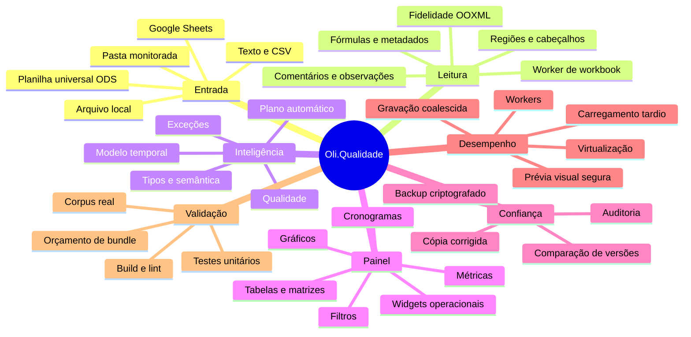
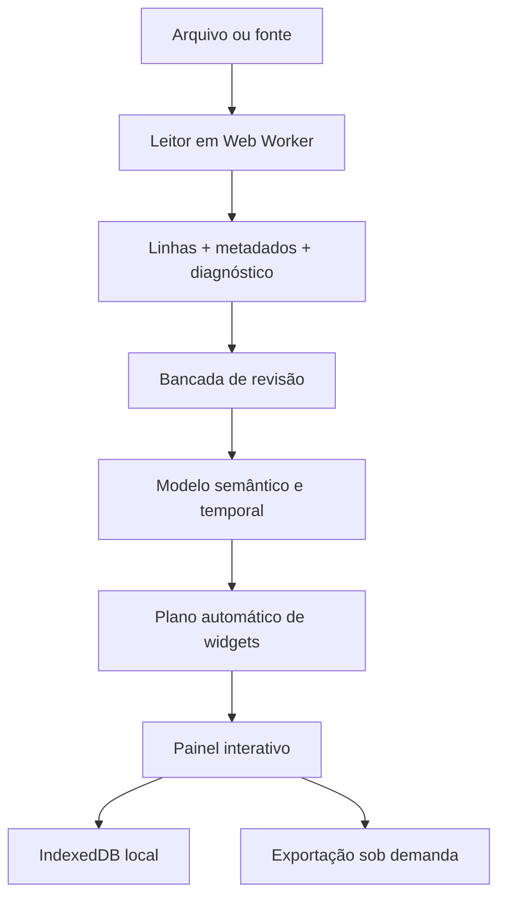

# Oli.Qualidade — Second Brain

Este documento é a fonte de orientação do projeto: explica o que existe, por
que existe, onde alterar e como provar que uma mudança não quebrou a leitura.
O código e os testes continuam sendo a fonte de verdade técnica.

A auditoria detalhada da base, lacunas, matriz de leitores e plano Rust está em
[`CURRENT_STATE_AUDIT.md`](CURRENT_STATE_AUDIT.md).

## Mapa mental



## Fluxo principal



1. `workbook-reader-client.ts` valida tamanho e transfere a leitura pesada ao
   `workbook.worker`.
2. `workbook-reader.ts`, `ooxml-reader.ts`, `import.ts` e
   `import-intelligence.ts` preservam conteúdo, estrutura e diagnóstico.
3. A revisão permite selecionar abas/regiões, corrigir células e registrar
   auditoria antes de criar o painel.
4. `spreadsheet-intelligence.ts`, `structural-model.ts` e
   `temporal-model.ts` acrescentam significado sem alterar a origem.
5. `auto-dashboard.ts` recomenda widgets; `routes/index.tsx` coordena a
   experiência e a configuração manual.
6. `storage.ts` persiste localmente. Nenhuma planilha é enviada para IA sem a
   ação e os controles previstos no fluxo de análise inteligente.

## Onde mexer

| Necessidade                                 | Fonte principal                                                       | Prova mínima                                 |
| ------------------------------------------- | --------------------------------------------------------------------- | -------------------------------------------- |
| Novo formato ou fidelidade de Excel         | `workbook-reader.ts`, `ooxml-reader.ts`, `ooxml-archive.ts`, `import.ts` | fixture + teste de corpus                    |
| Inventário Rust de planilha universal (ODS) | `rust/oli-ooxml-core/src/ods.rs`                                      | `rust/oli-ooxml-core/tests/ods_inventory.rs` |
| Cabeçalhos, blocos e regiões                | `import.ts`, `structural-model.ts`                                    | `import.test.ts`                             |
| Tipos, fórmulas e semântica                 | `format.ts`, `formula.ts`, `spreadsheet-intelligence.ts`              | teste dedicado                               |
| Widget novo ou recomendação                 | `types.ts`, `widgets.ts`, `auto-dashboard.ts`, `components/oliam/widget-card.tsx`, `components/oliam/widget-support.tsx` | widgets + auto-dashboard                     |
| Coluna vazia entrando/saindo de métrica ou dimensão automática | `classifyDashboardColumn` (`auto-dashboard.ts`), `nums`/`fillRatio` em `createWidget`/`buildDefaultWidgets` (`widgets.ts`) | `auto-dashboard.test.ts`, `widgets.test.ts` |
| Painel de leitura guiada de categoria em destaque (comparação vs. maior outra categoria) | `pieComparisonFor` (`data-pipeline.ts`), `SeriesComparisonPanel` (`components/oliam/widget-support.tsx`) — genérico sobre `{name, total}[]`, usado hoje por pizza e barra | `data-pipeline.test.ts` (a função) + verificação manual do widget |
| Resumo de tendência (início→fim, mínimo, máximo, média) para séries temporais | `trendSummaryFor` (`data-pipeline.ts`), `TrendSummaryPanel` (`components/oliam/widget-support.tsx`) — usado por linha e área agrupada por data | `data-pipeline.test.ts` (a função) + verificação manual do widget |
| Cobertura do Top N no ranking (participação, categorias fora do ranking) | `rankingCoverageFor` (`data-pipeline.ts`), faixa inline no widget `ranking` (`components/oliam/widget-card.tsx`) | `data-pipeline.test.ts` (a função) |
| Quanto foi filtrado na tabela detalhada | prop `totalRows` de `WidgetCard`, passado como `rulesApplied.length` em `routes/index.tsx` | `npx tsc --noEmit` confirma o único call site atualizado |
| Widget "Insights automáticos" (`insights`), narra achados em texto | `widget-card.tsx` (bloco `w.type === "insights"`), compõe `pieComparisonFor`/`rankingCoverageFor`/`detectQualitySignals` já testadas | `npx tsc --noEmit` (checklist completo de registro de `WidgetType` na seção 47 do audit) |
| Importação/revisão (UI)                     | `components/oliam/{home,empty,import-workbench,review}.tsx`          | `routes/index.tsx` orquestra via props        |
| Combinar planilha, apresentação, coluna calculada, marcadores, atalhos, notas de origem, diff de versão, dica de termos, regras ausentes, formatação, sinais de qualidade, chips de filtro, colunas (drag-and-drop) (UI do Dashboard) | `components/oliam/{join-sheet-dialog,presentation-mode,formula-column-editor,bookmark-panel,shortcuts-dialog,source-notes-panel,version-diff-banner,term-hint-banner,missing-rules-panel,format-panel,quality-signals-panel,filter-chips-bar,column-panel}.tsx` | extraídos de `Dashboard`; `tsc` pega referências órfãs se algo ficar pra trás |
| Cálculos e séries                           | `data-pipeline.ts`                                                    | `data-pipeline.test.ts`                      |
| Cronograma                                  | `schedule-normalizer.ts`, `operational-widgets.ts`                    | testes dos dois módulos                      |
| Revisão, auditoria e versões                | `data-review.ts`, `import-workbench.ts`, `review-export.ts`           | testes de revisão/exportação                 |
| Armazenamento e privacidade                 | `storage.ts`, `encrypted-backup.ts`                                   | storage/privacy + backup                     |
| IA                                          | `gemini-security.ts`, `gemini-server.ts`, `assistant-context.ts`      | segurança + contexto                         |
| Erro do servidor (500, recuperação de stack) | `error-capture.ts` (`AsyncLocalStorage` por requisição), `server.ts`  | `error-capture.test.ts`                      |
| Exportação PNG/PDF e tabelas                | `dashboard-export.ts`, `data-table-widget.tsx`, CSS `.oliam-export-*` | layout + teste de exportação                 |
| Desempenho                                  | workers, `latest-task-queue.ts`, CSS `.oliam-widget`, budgets         | `npm run verify`                             |
| Métricas de importação (leitor, tempo, bytes, fallback) | `import-metrics.ts`, `storage.ts` (`loadImportMetrics`/`saveImportMetrics`), painel em `components/oliam/import-diagnostics-dialog.tsx` | `import-metrics.test.ts`, `workbook-reader.test.ts` |

## Regras de produto que não podem regredir

- O dado original e o agregado são modos diferentes e explicitamente
  selecionáveis nos gráficos coerentes.
- O botão de calculadora concentra as operações; o painel não deve exibir uma
  sequência confusa de verbos de cálculo.
- Métrica, eixo/grupo e forma de cálculo precisam estar visíveis no contexto do
  widget. X/Y usam rótulos compactos e o nome completo fica no seletor/tooltip;
  não repetir títulos longos dentro do gráfico.
- Painel de exceções e validação são widgets manuais; não entram
  automaticamente no painel.
- Cronogramas são apresentados por blocos/segmentos detectados na planilha.
- Códigos de frequência (`D`, `S`, `M`, `T`, `A`, `SM`) são planejamento, não
  resultado. As métricas do cronograma separam programados, resultados,
  cobertura, conformidade, não conformidade, lacunas e observações.
- Comentários de célula e blocos textuais de observação são metadados da origem:
  devem permanecer rastreáveis por endereço sem virar linhas falsas da tabela.
- A prévia visual pode ser reduzida para proteger o navegador, mas nunca deve
  alterar, descartar ou sobrescrever as linhas importadas. A tabela detalhada é
  o caminho para todos os registros.
- Correções geram auditoria e cópia nova; o arquivo original permanece intacto.

## Modelo de desempenho

| Risco                                             | Proteção                                               |
| ------------------------------------------------- | ------------------------------------------------------ |
| Parse grande bloqueando a interface               | leitura e revisão em Web Workers                       |
| Uma biblioteca interpreta errado um XLSX          | motor compara SheetJS com leitor OOXML independente    |
| O leitor principal perde uma aba OOXML inteira    | reconciliação restaura a aba e audita cada célula      |
| Evoluir para Rust/WASM sem ruptura                | contrato de adaptador + fallback automático validado   |
| Bibliotecas pesadas no primeiro acesso            | Excel, PDF, captura e mapa carregados quando usados    |
| Painel longo renderizando fora da tela            | `content-visibility` nos cartões                       |
| Tabela enorme criando milhares de nós             | virtualização com `@tanstack/react-virtual`            |
| SVG com dezenas de milhares de marcas             | prévia distribuída; dados completos na tabela          |
| Edições rápidas disparando snapshots concorrentes | fila que mantém somente o estado completo mais recente |
| Bundle crescendo silenciosamente                  | `npm run performance:check`                            |

### Medição de 2026-08-13

| Artefato/caminho          | Antes               | Depois                    | Resultado                               |
| ------------------------- | ------------------- | ------------------------- | --------------------------------------- |
| Excel no módulo da rota   | importação estática | chunk tardio de 481,1 KiB | só baixa ao colar, conectar ou exportar |
| Leaflet sob demanda       | 1.275,1 KiB         | 785,0 KiB                 | continua fora do caminho sem mapa       |
| Worker de workbook        | 429,7 KiB           | 429,7 KiB                 | custo isolado da interface              |
| Maior chunk comum da tela | 295,0 KiB           | 295,0 KiB                 | sem regressão                           |

Os tamanhos são minificados e medidos em `.vercel/output/static/assets`. O
orçamento verifica os artefatos depois de cada build, com limites distintos
para chunks comuns, workers e módulos grandes carregados sob demanda.

Limites funcionais atuais: arquivo de até 100 MB, até 100 abas e até 2 milhões
de células por workbook. Arquivos ZIP/OOXML também passam por limites de
entradas, tamanho expandido e razão de compressão para evitar arquivos hostis.

## Corpus de confiança

Os testes de corpus cobrem os modelos reais enviados durante o desenvolvimento,
incluindo cronogramas microbiológicos, planos de produção, política de segurança,
pesagens/testes GREEN PCR e validação de inspetores automáticos. Os arquivos
ficam em `upload/` apenas como fixtures locais; os testes devem pular de forma
explicável quando uma fixture privada não estiver presente no clone.

“100%” significa que todos os critérios automatizados definidos para essas
planilhas passam. Não significa compatibilidade matemática universal com cada
recurso já criado em toda versão do Excel. Macros VBA não são executadas e
fórmulas não suportadas dependem do valor armazenado no arquivo.

No cronograma FRS-QA-BR-405 usado como fixture, a prova inclui 18 tabelas úteis,
validade integral, fidelidade mínima de 90% e 21 notas preservadas (20 comentários
de célula + 1 bloco textual de observações).

## Comandos operacionais

```bash
npm run dev                 # desenvolvimento
npm test                    # suíte automatizada
npm run lint                # qualidade estática
npm run build               # typecheck + produção
npm run performance:check   # orçamento dos artefatos gerados
npm run verify              # testes + build + orçamento de desempenho
npm run graph:build         # graphify-out/graph.json + relatório + HTML
npm run test:security-smoke # cabeçalhos de segurança + CORS contra um servidor rodando (roda na CI, job security-smoke)
```

## Diagnóstico rápido

| Sintoma                     | Verifique primeiro                                                    |
| --------------------------- | --------------------------------------------------------------------- |
| Importação parece parada    | progresso do worker, tamanho, extensão e limites ZIP                  |
| Colunas erradas             | região, cabeçalho detectado e `SourceGrid` na revisão                 |
| Números divergem do Excel   | modo original/agregado, operação, filtros e unidade semântica         |
| Cronograma vira traços/“4s” | normalização temporal, blocos e células mescladas                     |
| Gráfico trava               | quantidade renderizada, largura calculada e texto acessível duplicado |
| Alteração não persiste      | IndexedDB, modo privado, limite e retorno de `SaveResult`             |
| Exportação falha            | carregamento tardio do módulo e limite de pixels/páginas              |

## Decisões registradas

| Decisão                                                      | Motivo                                                          | Consequência                                                                                  |
| ------------------------------------------------------------ | --------------------------------------------------------------- | --------------------------------------------------------------------------------------------- |
| Processar workbook fora da thread principal                  | planilhas grandes congelavam a UI                               | worker é parte obrigatória do caminho de importação                                           |
| Preservar original e agregado                                | soma automática distorcia planilhas já consolidadas             | widgets guardam `dataMode` e operação                                                         |
| Exceções/validação apenas manuais                            | criavam ruído e pouca explicação no painel inicial              | continuam disponíveis no catálogo                                                             |
| Calculadora como controle progressivo                        | operações expostas ocupavam espaço e confundiam                 | cálculo abre sob demanda                                                                      |
| Notas fora da matriz de dados                                | observações soltas não são registros nem métricas               | painel preserva texto, autor e célula sem contaminar cálculos                                 |
| Métricas semânticas no cronograma                            | códigos planejados pareciam resultados executados               | cobertura e conformidade usam estados distintos e limites por linha                           |
| Prévia visual segura                                         | SVG/DOM não escala para milhares de pontos                      | tabela mantém acesso integral                                                                 |
| Persistência latest-wins                                     | snapshots completos intermediários são desperdício              | primeira e última versão são gravadas, intermediárias podem ser coalescidas                   |
| "Não suportado" não altera a pontuação                       | recurso nunca comparado não é validado nem incorreto            | `fidelity-meter.ts` expõe `unsupportedFeatures` e `warnings` à parte do score                 |
| Repetição literal do cabeçalho vira linha ignorada, não dado | relatórios paginados repetem o cabeçalho sem separador de bloco | `sheetToRows` filtra e reporta em `audit.repeatedHeaderRowsIgnored`, exige 2+ colunas batendo |
| Rollback do candidato Rust é só variável de ambiente, mas exige rebuild | `VITE_WASM_READER_MODE` é lido via `import.meta.env`, substituído em tempo de build pelo Vite | rollback não pede código/PR, mas pede novo deploy; documentado em `WASM_PROMOTION_CRITERIA.md` e provado em `workbook-reader.test.ts` |
| Confiança por aba já existia para todas as abas, só não era agregada | `sheetsWithData` roda diagnóstico em toda aba com dado, não só na ativa | `buildSheetConfidenceMatrix` em `import-intelligence.ts` só lê e classifica o que já é calculado |
| Regiões detectadas mas não separadas viram auditoria, não silêncio | `regionsAreSafeToSplit` recusa por segurança (ex: matriz id+período) sem registrar em lugar nenhum | `audit.regionsKeptTogether` conta as regiões, sem mudar a decisão de separar |
| Rust "General" agora arredonda a 11 dígitos significativos como o Excel | `display_cell_value` caía em `value.to_string()` bruto fora dos formatos explícitos | corrigido; validado rodando `cargo test` de verdade via workflow manual da CI (sandbox não linka localmente), corpus XLSM fecha em zero divergências |
| Widget "linha a linha" precisa de chave composta, nunca só o nome da categoria | modo raw repete a mesma categoria várias vezes no Top N/eixo; `key={g.name}` sozinho colide | seguir o padrão já usado no gráfico de barras/pizza: `sourceRow` de `chartSeries` ou índice como desempate |
| `requestAnimationFrame` nunca dispara neste sandbox (`document.hidden === true`) | o painel do navegador não compõe frames, mesma causa do bloqueio de screenshot | qualquer código dependente de RAF (animações, `settleExportLayout`) trava aqui; confirmado sandbox-only via polyfill temporário, não é bug de produção |
| Alvos de toque de 28px nos botões de widget ficam abaixo do recomendado | `size-7` do Tailwind sem variante responsiva, 5 botões agrupados por widget | corrigido com `pointer-coarse:` (media feature de ponteiro, não largura): 36px em toque, 28px em mouse, cabeçalho com `h-auto` em toque para acomodar quebra de linha |
| `pointer: coarse` (Tailwind `pointer-coarse:`) é verificável neste sandbox, ao contrário de RAF/screenshot | preset mobile emula corretamente a media feature via `matchMedia`, mesmo sem compor frames | preferir variantes de mídia CSS a testes que dependam de pintura real para ajustes específicos de toque |
| Filtro semântico de operação por coluna já é maduro e testado | `semanticAggregationOps`/`relevantAggregationOps` aplicados uniformemente em 6+ tipos de widget | bug semântico futuro provavelmente está na classificação da coluna, não na lógica de filtragem |
| Dividir `routes/index.tsx` em vários arquivos, sem mudar o grafo de módulos, pode estourar o orçamento de bundle | o bundler escolhe o "módulo fachada" de um chunk compartilhado por algum critério interno; qual arquivo vira fachada muda ao reorganizar imports, mesmo com o mesmo código | `vite.config.ts` ganhou `manualChunks` explícito para `recharts`/`d3-*` e `@radix-ui`/`@floating-ui`/`cmdk`/`sonner`; sempre rodar `npm run performance:check` depois de mover código entre arquivos, não só depois de mudar o que o código faz |
| Métricas de importação nunca guardam nome de arquivo nem dado de célula/linha | histórico persiste localmente (IndexedDB) e por tempo indefinido (200 entradas), então qualquer campo livre vira risco de retenção de dado sensível | `import-metrics.ts` só grava contagens, durações, bytes e identificadores fixos já calculados pelo motor; mensagem de erro é truncada a 200 caracteres por segurança, mas as mensagens do pipeline já são estáticas (auditado) |
| Cancelamento de importação (`AbortError`) não conta como falha nas métricas | usuário cancelar deliberadamente não é um sintoma de leitor com problema | `readWorkbook` (`routes/index.tsx`) checa `DOMException`/`AbortError` antes de chamar `buildFailedImportMetricEntry` |
| Captura de erro do servidor era uma variável global, racy sob requisições concorrentes | duas requisições falhando ao mesmo tempo podiam trocar de erro entre si ou perder o stack de ambas | `error-capture.ts` usa `AsyncLocalStorage` por requisição (`node:async_hooks`, confirmado disponível no runtime `nodejs24.x` do Vercel); também redige segredos conhecidos (`OLI_SESSION_SECRET`/`OLI_CHAT_AUTH_TOKEN`/`GEMINI_API_KEY`) do texto logado |
| Coluna de grid com `minmax(0, ...)` some sem aviso na tela viva, mas colapsa em texto quebrado letra-por-letra na exportação | `.oliam-export-mode .truncate` desliga `nowrap`/reticências de propósito (para nunca perder texto no PDF); sem um mínimo de largura, essa mesma coluna que só "cortava silenciosamente" na tela vira `overflow-wrap: anywhere` sobre ~0px | toda coluna de grid que usa `.truncate`/`.line-clamp` precisa de um `minmax(<valor razoável>, ...)`, nunca `minmax(0, ...)` — a proteção de truncamento não existe mais em modo de exportação |
| `<details>` fechado captura em estado inconsistente no html2canvas (conteúdo sobreposto/cortado, nem escondido nem visível) | `exportBreakpoints()` já presumia `<details>` aberto (usa `"details li"` para paginar) sem nunca de fato abrir o elemento antes de capturar | `captureDashboard()` agora abre todo `<details>` do elemento antes de capturar e restaura o estado original no `finally`, mesmo padrão já usado ali para a posição de scroll |
| `attachWorkbookFeatures` e `inspectOoxml` faziam `unzipSync` independente sobre os mesmos bytes em todo import OOXML | duas descompactações + duas leituras completas do XML do mesmo pacote, sempre, mesmo no caminho comum sem erro | `ooxml-archive.ts` centraliza a descompactação; `workbook-reader.ts` descompacta uma vez e compartilha o archive entre as duas funções, sem alterar nenhuma lógica de comparação/reconciliação |
| Painel de comparação do pizza foi extraído para `SeriesComparisonPanel`, reaproveitado pelo bar | `pieComparisonFor` já era genérica sobre `{name, total}[]`, só o pizza tinha o painel construído em cima dela | bar usa hover (`activeBarIndex`) em vez de clique-para-selecionar, porque no bar o clique já filtra diretamente — clique não muda de significado; próximos widgets categóricos (ranking, etc.) devem seguir o mesmo cuidado de não sobrepor uma interação já existente |
| Resumo de tendência (linha/área) usa função e componente próprios, não reaproveita `SeriesComparisonPanel` | série temporal não tem "maior outra categoria" para comparar, tem "de onde veio, para onde foi" — forçar o mesmo painel fabricaria uma narrativa de comparação sem sentido | painel só aparece quando o eixo é cronológico de verdade (`line`, ou `area` agrupada por coluna de data) — área agrupada por categoria não temporal não ganha o painel |
| Widget "Insights automáticos" não entra na recomendação automática (`auto-dashboard.ts`) | mesma regra já aplicada a `exception-panel`/`validation-overview`: mudar o que é recomendado por padrão é decisão de produto de alcance amplo, fora do escopo combinado para esta etapa | só pode ser adicionado manualmente pelo seletor "Adicionar widget"; se decidir automatizar depois, é uma decisão separada, não implícita |
| `onClick` de `<Bar>` não pode confiar em `pt.name` do payload do Recharts; usar índice | confirmado ao vivo: invocar o handler real com o evento real do Recharts nunca chamava `handleGroupClick` — `pt.name` não existe de forma confiável no payload de uma `<Bar>` com `<Cell>` filhas | usar `barSeries[index]` (2º argumento do onClick, sempre correto) em vez do 1º argumento — mesmo padrão já usado no `<Pie>` |
| Coluna sem nenhum valor preenchido nunca vira métrica/dimensão automática | `classifyDashboardColumn` e `createWidget`/`buildDefaultWidgets` só olhavam o tipo detectado, nunca se a coluna tinha algum dado — uma coluna 100% vazia virava "Total geral: 0" ou groupKey de gráfico sem sentido | `classifyDashboardColumn` força role `"unsupported"` quando `diagnostic.filled === 0`; `nums` em `widgets.ts` prioriza colunas com `fillRatio > 0`, caindo no conjunto completo só se não sobrar nenhuma — não corrige widgets já persistidos, só a geração daqui pra frente |
| Botão "Limpar filtros" quando há mais de um filtro ativo | a barra de filtros globais já existia e funcionava, mas remover filtros um a um quando vêm de widgets diferentes lia como "não consigo desfiltrar" | `setFilters([])` num botão visível só com `sheet.filters.length > 1`, ao lado dos chips individuais |
| `setPointerCapture` no drag-to-scroll de gráficos só pode ser chamado depois de confirmar arrasto real (>3px), nunca no `pointerdown` | capturar incondicionalmente redireciona o alvo de todo clique/ponteiro seguinte para o container de rolagem, quebrando cliques parados em qualquer gráfico com muitas categorias | `handleChartScrollPointerDown` (`widget-card.tsx`) só chama `setPointerCapture` dentro do `onMove`, quando o deslocamento cruza o limiar de arrasto |
| Isolar `widget-card.tsx`/`widget-support.tsx` num `manualChunks` próprio, tentado e revertido | criou um chunk de 777 KiB (estourou os 420 KiB) — os dois arquivos puxam consigo tanta coisa de primeira-parte (data-pipeline, format, widgets, data-table-widget, operational-widget-body etc.) que isolá-los sozinhos concentra tudo isso num único chunk em vez de distribuir | orçamento voltou a passar (~414,7 KiB) revertendo para só recharts/radix isolados; qualquer tentativa futura de isolar precisa de análise real do grafo de dependências (ex. `rollup-plugin-visualizer`), não uma regra de `id.includes(...)` por tentativa e erro |
| Extração do diálogo de junção (`useJoinSheetDialog`) é puramente estrutural, mas ainda assim reduziu a margem de bundle de ~415,3 para ~418,6 KiB | mesma fragilidade de "fachada de chunk compartilhado" das duas linhas acima — mover código entre arquivos de primeira-parte muda o resultado do chunking mesmo sem nova lógica | limite do orçamento subido de 420 para 450 KiB (decisão do usuário) — crescimento reconhecido como legítimo; se voltar a apertar, `rollup-plugin-visualizer` é o caminho antes de subir o número de novo |

## Checklist antes de publicar

1. Adicionar ou atualizar um teste que reproduza a mudança.
2. Confirmar que a planilha de origem não foi mutada.
3. Verificar modos original/agregado, filtros, valores nulos, zeros e negativos.
4. Testar um conjunto pequeno e outro acima do limite visual.
5. Executar `npm run verify` e o lint nos arquivos alterados.
6. Regenerar `npm run graph:build` quando a arquitetura mudar.
7. Registrar neste documento uma nova regra ou decisão que um futuro
   mantenedor precisará conhecer.

## Estado conhecido

- A aplicação é deliberadamente local-first e usa IndexedDB no navegador.
- Leitura pesada, análise de revisão e exportações pesadas são separadas do
  caminho interativo sempre que possível.
- `src/routes/index.tsx` caiu de 10.282 para 2.855 linhas (72%) numa
  refatoração puramente estrutural, em etapas sucessivas: `Home`, `Empty`,
  `ImportWorkbench`, `Review`, `WidgetCard`/`EmptyWidget`, as peças de
  suporte de widget (`FieldDropSlot`, `WidgetHead`, tooltips/eixos de
  gráfico, `MapWidgetBody` etc.), `FormatRulesEditor`, o diálogo de combinar
  planilha, o modo apresentação, o editor de coluna calculada, o painel de
  marcadores, o diálogo de atalhos, o painel de notas de origem, o banner de
  diff de versão e a dica de termos foram movidos para arquivos próprios em
  `src/components/oliam/`, sem mudar comportamento. O que resta em
  `index.tsx` é `OliAm` (orquestração de rota/estágio) e o núcleo de
  `Dashboard` (busca/filtro, exportação, revisão de fundo, undo/redo, o
  pipeline de dados e a orquestração da grade de widgets) — ver seções 36,
  51, 52, 55 e 56 do `CURRENT_STATE_AUDIT.md` para o histórico completo, o
  mapeamento de candidatos restantes por risco e a regressão de bundle
  descoberta e corrigida no processo. Sem reducer único planejado: os
  estados que restam não formam uma máquina de estados coesa, são recursos
  independentes (extração continua incremental, por candidato).
- O mapa estrutural gerado em `graphify-out/` é um artefato derivado. Este
  documento explica intenção; o grafo mostra dependências extraídas do código.
- O Reading Engine v2 registra leitor, tempos, divergências e recuperações por
  importação. Ele usa SheetJS verificado por OOXML hoje e aceita um adaptador
  Rust/WASM opcional no cliente quando este estiver disponível e aprovado pelo
  corpus. O gate exige cinco fontes reais sanitizadas e únicas por formato;
  duplicatas e fontes sem identidade privada não contam. O fallback TypeScript
  continua obrigatório para compatibilidade.
- O crate Rust também inventaria ODS (planilha universal ISO/IEC 26300) de
  forma isolada em `rust/oli-ooxml-core/src/ods.rs`. Ainda não está ligado ao
  worker de leitura; segue a mesma progressão incremental usada para o XLSX
  antes de qualquer shadow mode. Ver `CURRENT_STATE_AUDIT.md`, seção 21.
