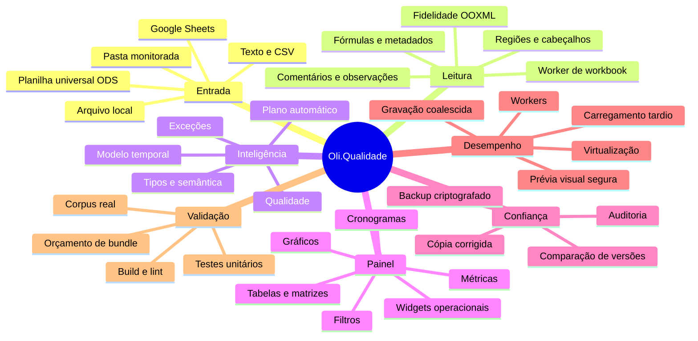
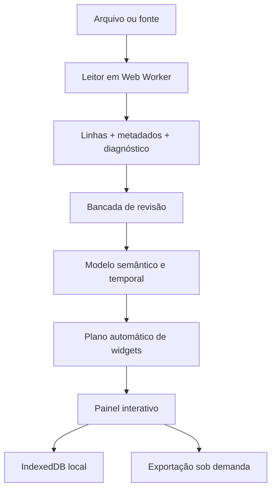

# Oli.Qualidade — Second Brain

Este documento é a fonte de orientação do projeto: explica o que existe, por
que existe, onde alterar e como provar que uma mudança não quebrou a leitura.
O código e os testes continuam sendo a fonte de verdade técnica.

A auditoria detalhada da base, lacunas, matriz de leitores e plano Rust está em
[`CURRENT_STATE_AUDIT.md`](CURRENT_STATE_AUDIT.md).

## Mapa mental



## Fluxo principal



1. `workbook-reader-client.ts` valida tamanho e transfere a leitura pesada ao
   `workbook.worker`.
2. `workbook-reader.ts`, `ooxml-reader.ts`, `import.ts` e
   `import-intelligence.ts` preservam conteúdo, estrutura e diagnóstico.
3. A revisão permite selecionar abas/regiões, corrigir células e registrar
   auditoria antes de criar o painel.
4. `spreadsheet-intelligence.ts`, `structural-model.ts` e
   `temporal-model.ts` acrescentam significado sem alterar a origem.
5. `auto-dashboard.ts` recomenda widgets; `routes/index.tsx` coordena a
   experiência e a configuração manual.
6. `storage.ts` persiste localmente. Nenhuma planilha é enviada para IA sem a
   ação e os controles previstos no fluxo de análise inteligente.

## Onde mexer

| Necessidade                                 | Fonte principal                                                       | Prova mínima                                 |
| ------------------------------------------- | --------------------------------------------------------------------- | -------------------------------------------- |
| Novo formato ou fidelidade de Excel         | `workbook-reader.ts`, `ooxml-reader.ts`, `import.ts`                  | fixture + teste de corpus                    |
| Inventário Rust de planilha universal (ODS) | `rust/oli-ooxml-core/src/ods.rs`                                      | `rust/oli-ooxml-core/tests/ods_inventory.rs` |
| Cabeçalhos, blocos e regiões                | `import.ts`, `structural-model.ts`                                    | `import.test.ts`                             |
| Tipos, fórmulas e semântica                 | `format.ts`, `formula.ts`, `spreadsheet-intelligence.ts`              | teste dedicado                               |
| Widget novo ou recomendação                 | `types.ts`, `widgets.ts`, `auto-dashboard.ts`, `routes/index.tsx`     | widgets + auto-dashboard                     |
| Cálculos e séries                           | `data-pipeline.ts`                                                    | `data-pipeline.test.ts`                      |
| Cronograma                                  | `schedule-normalizer.ts`, `operational-widgets.ts`                    | testes dos dois módulos                      |
| Revisão, auditoria e versões                | `data-review.ts`, `import-workbench.ts`, `review-export.ts`           | testes de revisão/exportação                 |
| Armazenamento e privacidade                 | `storage.ts`, `encrypted-backup.ts`                                   | storage/privacy + backup                     |
| IA                                          | `gemini-security.ts`, `gemini-server.ts`, `assistant-context.ts`      | segurança + contexto                         |
| Exportação PNG/PDF e tabelas                | `dashboard-export.ts`, `data-table-widget.tsx`, CSS `.oliam-export-*` | layout + teste de exportação                 |
| Desempenho                                  | workers, `latest-task-queue.ts`, CSS `.oliam-widget`, budgets         | `npm run verify`                             |

## Regras de produto que não podem regredir

- O dado original e o agregado são modos diferentes e explicitamente
  selecionáveis nos gráficos coerentes.
- O botão de calculadora concentra as operações; o painel não deve exibir uma
  sequência confusa de verbos de cálculo.
- Métrica, eixo/grupo e forma de cálculo precisam estar visíveis no contexto do
  widget. X/Y usam rótulos compactos e o nome completo fica no seletor/tooltip;
  não repetir títulos longos dentro do gráfico.
- Painel de exceções e validação são widgets manuais; não entram
  automaticamente no painel.
- Cronogramas são apresentados por blocos/segmentos detectados na planilha.
- Códigos de frequência (`D`, `S`, `M`, `T`, `A`, `SM`) são planejamento, não
  resultado. As métricas do cronograma separam programados, resultados,
  cobertura, conformidade, não conformidade, lacunas e observações.
- Comentários de célula e blocos textuais de observação são metadados da origem:
  devem permanecer rastreáveis por endereço sem virar linhas falsas da tabela.
- A prévia visual pode ser reduzida para proteger o navegador, mas nunca deve
  alterar, descartar ou sobrescrever as linhas importadas. A tabela detalhada é
  o caminho para todos os registros.
- Correções geram auditoria e cópia nova; o arquivo original permanece intacto.

## Modelo de desempenho

| Risco                                             | Proteção                                               |
| ------------------------------------------------- | ------------------------------------------------------ |
| Parse grande bloqueando a interface               | leitura e revisão em Web Workers                       |
| Uma biblioteca interpreta errado um XLSX          | motor compara SheetJS com leitor OOXML independente    |
| O leitor principal perde uma aba OOXML inteira    | reconciliação restaura a aba e audita cada célula      |
| Evoluir para Rust/WASM sem ruptura                | contrato de adaptador + fallback automático validado   |
| Bibliotecas pesadas no primeiro acesso            | Excel, PDF, captura e mapa carregados quando usados    |
| Painel longo renderizando fora da tela            | `content-visibility` nos cartões                       |
| Tabela enorme criando milhares de nós             | virtualização com `@tanstack/react-virtual`            |
| SVG com dezenas de milhares de marcas             | prévia distribuída; dados completos na tabela          |
| Edições rápidas disparando snapshots concorrentes | fila que mantém somente o estado completo mais recente |
| Bundle crescendo silenciosamente                  | `npm run performance:check`                            |

### Medição de 2026-08-13

| Artefato/caminho          | Antes               | Depois                    | Resultado                               |
| ------------------------- | ------------------- | ------------------------- | --------------------------------------- |
| Excel no módulo da rota   | importação estática | chunk tardio de 481,1 KiB | só baixa ao colar, conectar ou exportar |
| Leaflet sob demanda       | 1.275,1 KiB         | 785,0 KiB                 | continua fora do caminho sem mapa       |
| Worker de workbook        | 429,7 KiB           | 429,7 KiB                 | custo isolado da interface              |
| Maior chunk comum da tela | 295,0 KiB           | 295,0 KiB                 | sem regressão                           |

Os tamanhos são minificados e medidos em `.vercel/output/static/assets`. O
orçamento verifica os artefatos depois de cada build, com limites distintos
para chunks comuns, workers e módulos grandes carregados sob demanda.

Limites funcionais atuais: arquivo de até 100 MB, até 100 abas e até 2 milhões
de células por workbook. Arquivos ZIP/OOXML também passam por limites de
entradas, tamanho expandido e razão de compressão para evitar arquivos hostis.

## Corpus de confiança

Os testes de corpus cobrem os modelos reais enviados durante o desenvolvimento,
incluindo cronogramas microbiológicos, planos de produção, política de segurança,
pesagens/testes GREEN PCR e validação de inspetores automáticos. Os arquivos
ficam em `upload/` apenas como fixtures locais; os testes devem pular de forma
explicável quando uma fixture privada não estiver presente no clone.

“100%” significa que todos os critérios automatizados definidos para essas
planilhas passam. Não significa compatibilidade matemática universal com cada
recurso já criado em toda versão do Excel. Macros VBA não são executadas e
fórmulas não suportadas dependem do valor armazenado no arquivo.

No cronograma FRS-QA-BR-405 usado como fixture, a prova inclui 18 tabelas úteis,
validade integral, fidelidade mínima de 90% e 21 notas preservadas (20 comentários
de célula + 1 bloco textual de observações).

## Comandos operacionais

```bash
npm run dev                 # desenvolvimento
npm test                    # suíte automatizada
npm run lint                # qualidade estática
npm run build               # typecheck + produção
npm run performance:check   # orçamento dos artefatos gerados
npm run verify              # testes + build + orçamento de desempenho
npm run graph:build         # graphify-out/graph.json + relatório + HTML
```

## Diagnóstico rápido

| Sintoma                     | Verifique primeiro                                                    |
| --------------------------- | --------------------------------------------------------------------- |
| Importação parece parada    | progresso do worker, tamanho, extensão e limites ZIP                  |
| Colunas erradas             | região, cabeçalho detectado e `SourceGrid` na revisão                 |
| Números divergem do Excel   | modo original/agregado, operação, filtros e unidade semântica         |
| Cronograma vira traços/“4s” | normalização temporal, blocos e células mescladas                     |
| Gráfico trava               | quantidade renderizada, largura calculada e texto acessível duplicado |
| Alteração não persiste      | IndexedDB, modo privado, limite e retorno de `SaveResult`             |
| Exportação falha            | carregamento tardio do módulo e limite de pixels/páginas              |

## Decisões registradas

| Decisão                                                      | Motivo                                                          | Consequência                                                                                  |
| ------------------------------------------------------------ | --------------------------------------------------------------- | --------------------------------------------------------------------------------------------- |
| Processar workbook fora da thread principal                  | planilhas grandes congelavam a UI                               | worker é parte obrigatória do caminho de importação                                           |
| Preservar original e agregado                                | soma automática distorcia planilhas já consolidadas             | widgets guardam `dataMode` e operação                                                         |
| Exceções/validação apenas manuais                            | criavam ruído e pouca explicação no painel inicial              | continuam disponíveis no catálogo                                                             |
| Calculadora como controle progressivo                        | operações expostas ocupavam espaço e confundiam                 | cálculo abre sob demanda                                                                      |
| Notas fora da matriz de dados                                | observações soltas não são registros nem métricas               | painel preserva texto, autor e célula sem contaminar cálculos                                 |
| Métricas semânticas no cronograma                            | códigos planejados pareciam resultados executados               | cobertura e conformidade usam estados distintos e limites por linha                           |
| Prévia visual segura                                         | SVG/DOM não escala para milhares de pontos                      | tabela mantém acesso integral                                                                 |
| Persistência latest-wins                                     | snapshots completos intermediários são desperdício              | primeira e última versão são gravadas, intermediárias podem ser coalescidas                   |
| "Não suportado" não altera a pontuação                       | recurso nunca comparado não é validado nem incorreto            | `fidelity-meter.ts` expõe `unsupportedFeatures` e `warnings` à parte do score                 |
| Repetição literal do cabeçalho vira linha ignorada, não dado | relatórios paginados repetem o cabeçalho sem separador de bloco | `sheetToRows` filtra e reporta em `audit.repeatedHeaderRowsIgnored`, exige 2+ colunas batendo |
| Rollback do candidato Rust é só variável de ambiente, mas exige rebuild | `VITE_WASM_READER_MODE` é lido via `import.meta.env`, substituído em tempo de build pelo Vite | rollback não pede código/PR, mas pede novo deploy; documentado em `WASM_PROMOTION_CRITERIA.md` e provado em `workbook-reader.test.ts` |
| Confiança por aba já existia para todas as abas, só não era agregada | `sheetsWithData` roda diagnóstico em toda aba com dado, não só na ativa | `buildSheetConfidenceMatrix` em `import-intelligence.ts` só lê e classifica o que já é calculado |
| Regiões detectadas mas não separadas viram auditoria, não silêncio | `regionsAreSafeToSplit` recusa por segurança (ex: matriz id+período) sem registrar em lugar nenhum | `audit.regionsKeptTogether` conta as regiões, sem mudar a decisão de separar |

## Checklist antes de publicar

1. Adicionar ou atualizar um teste que reproduza a mudança.
2. Confirmar que a planilha de origem não foi mutada.
3. Verificar modos original/agregado, filtros, valores nulos, zeros e negativos.
4. Testar um conjunto pequeno e outro acima do limite visual.
5. Executar `npm run verify` e o lint nos arquivos alterados.
6. Regenerar `npm run graph:build` quando a arquitetura mudar.
7. Registrar neste documento uma nova regra ou decisão que um futuro
   mantenedor precisará conhecer.

## Estado conhecido

- A aplicação é deliberadamente local-first e usa IndexedDB no navegador.
- Leitura pesada, análise de revisão e exportações pesadas são separadas do
  caminho interativo sempre que possível.
- `src/routes/index.tsx` ainda concentra a orquestração visual. O motor de
  exportação PNG/PDF está em `dashboard-export.ts` e a tabela detalhada já foi
  extraída para `data-table-widget.tsx`, com uma representação semântica de
  altura automática exclusiva para exportação. O próximo recorte recomendado é
  extrair gráficos e métricas sem alterar comportamento.
- O mapa estrutural gerado em `graphify-out/` é um artefato derivado. Este
  documento explica intenção; o grafo mostra dependências extraídas do código.
- O Reading Engine v2 registra leitor, tempos, divergências e recuperações por
  importação. Ele usa SheetJS verificado por OOXML hoje e aceita um adaptador
  Rust/WASM opcional no cliente quando este estiver disponível e aprovado pelo
  corpus. O gate exige cinco fontes reais sanitizadas e únicas por formato;
  duplicatas e fontes sem identidade privada não contam. O fallback TypeScript
  continua obrigatório para compatibilidade.
- O crate Rust também inventaria ODS (planilha universal ISO/IEC 26300) de
  forma isolada em `rust/oli-ooxml-core/src/ods.rs`. Ainda não está ligado ao
  worker de leitura; segue a mesma progressão incremental usada para o XLSX
  antes de qualquer shadow mode. Ver `CURRENT_STATE_AUDIT.md`, seção 21.
